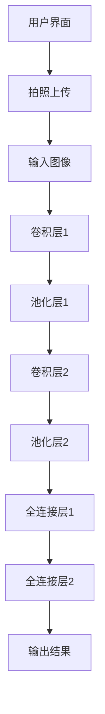

                 

关键词：深度学习、图像识别、APP设计、花卉识别、用户界面、算法优化、性能提升

摘要：本文将探讨基于深度学习的花卉识别APP的设计与实现，从核心算法原理、数学模型、项目实践、实际应用场景以及未来发展趋势等方面，详细解析如何打造一个高效、易用的花卉识别应用程序。通过本文的介绍，读者将了解深度学习在图像识别领域的应用，以及如何将复杂的技术实现转化为用户友好的APP。

## 1. 背景介绍

随着智能手机的普及和计算能力的提升，移动应用成为人们生活中不可或缺的一部分。在众多应用中，图像识别应用以其直观、便捷的特点，吸引了大量用户。花卉识别作为一种特殊的图像识别应用，不仅能够帮助用户识别未知的花卉，还能提供相关的花卉信息，满足用户对花卉知识的探索需求。

近年来，深度学习技术在图像识别领域取得了显著突破。卷积神经网络（CNN）作为一种深度学习模型，已经成为图像识别任务的首选算法。通过大量的图像数据训练，CNN能够学习到图像的特征，从而实现高精度的识别效果。

本文旨在设计并实现一个基于深度学习的花卉识别APP，通过结合用户界面设计和算法优化，打造一个高效、易用的花卉识别工具。接下来，我们将从核心算法原理、数学模型、项目实践等多个方面进行详细探讨。

## 2. 核心概念与联系

为了更好地理解深度学习在花卉识别APP中的应用，我们首先需要了解一些核心概念和它们之间的联系。

### 2.1 卷积神经网络（CNN）

卷积神经网络是一种特殊的深度学习模型，广泛应用于图像识别任务。它由多个卷积层、池化层和全连接层组成。卷积层通过卷积操作提取图像特征，池化层用于减小特征图的尺寸，全连接层则用于分类。

### 2.2 花卉特征提取

在花卉识别过程中，特征提取是非常关键的一步。通过深度学习模型，我们可以从大量的花卉图像中自动学习到花卉的特征。这些特征包括颜色、纹理、形状等，它们是后续识别任务的基础。

### 2.3 用户界面设计

用户界面设计直接影响用户的体验。一个良好的用户界面应具备简洁、直观、易操作等特点。在花卉识别APP中，用户界面需要提供拍照、识别、查询等功能，以便用户快速获取所需信息。

### 2.4 数据集与标注

深度学习模型的性能很大程度上取决于数据集的质量。在花卉识别任务中，我们需要收集大量的花卉图像，并对图像进行标注，以便模型能够学习到正确的特征。

下面是一个使用Mermaid绘制的CNN在花卉识别中的应用流程图：



## 3. 核心算法原理 & 具体操作步骤

### 3.1 算法原理概述

在花卉识别APP中，我们采用卷积神经网络（CNN）作为核心算法。CNN由多个卷积层、池化层和全连接层组成，通过逐层学习图像特征，最终实现花卉的准确识别。

### 3.2 算法步骤详解

#### 3.2.1 数据预处理

在训练CNN之前，我们需要对图像进行预处理，包括缩放、裁剪、灰度化等操作。这样可以确保输入图像的尺寸和格式一致，有利于模型训练。

#### 3.2.2 卷积层

卷积层通过卷积操作提取图像特征。卷积操作是将滤波器（也称为卷积核）在图像上滑动，并与图像的局部区域进行点积运算。通过多次卷积操作，可以提取到不同尺度和类型的特征。

#### 3.2.3 池化层

池化层用于减小特征图的尺寸，减少计算量。常见的池化操作有最大池化和平均池化。通过池化层，我们可以保留重要的特征，同时去除冗余信息。

#### 3.2.4 全连接层

全连接层用于分类。在花卉识别任务中，我们需要将提取到的特征映射到特定的花卉类别。全连接层通过计算特征和权重之间的点积，再通过激活函数（如softmax函数）输出概率分布。

### 3.3 算法优缺点

#### 优点：

1. 高精度：CNN能够提取到丰富的图像特征，实现高精度的识别效果。
2. 自动学习：通过大量图像数据进行训练，CNN能够自动学习到花卉的特征，无需人工干预。
3. 易于扩展：CNN结构简单，易于扩展到其他图像识别任务。

#### 缺点：

1. 计算量大：CNN包含多个卷积层和全连接层，计算量较大，对计算资源有一定要求。
2. 数据依赖：深度学习模型的性能很大程度上取决于数据集的质量，数据标注的准确性直接影响识别效果。

### 3.4 算法应用领域

CNN在花卉识别领域有着广泛的应用。除了花卉识别，CNN还可以应用于其他图像识别任务，如动物识别、物体检测等。

## 4. 数学模型和公式 & 详细讲解 & 举例说明

### 4.1 数学模型构建

在CNN中，卷积操作是一个关键步骤。卷积操作可以通过以下公式表示：

$$
\text{conv}(x, \text{filter}) = \sum_{i=1}^{n} f_i * x
$$

其中，$x$表示输入图像，$\text{filter}$表示卷积核，$f_i$表示卷积核在输入图像上的滑动位置，$*$表示卷积操作。

### 4.2 公式推导过程

卷积操作的推导过程可以分解为以下几个步骤：

1. 初始化卷积核：随机初始化卷积核的权重。
2. 在输入图像上滑动卷积核：在输入图像上滑动卷积核，计算每个位置的卷积值。
3. 求和：将所有位置的卷积值求和，得到卷积操作的输出。

### 4.3 案例分析与讲解

假设我们有一个3x3的卷积核和一个3x3的输入图像。为了简化计算，我们使用以下卷积核和输入图像：

$$
\text{filter} = \begin{bmatrix}
1 & 0 & 1 \\
0 & 1 & 0 \\
1 & 0 & 1
\end{bmatrix}
$$

$$
x = \begin{bmatrix}
1 & 1 & 1 \\
1 & 0 & 1 \\
1 & 1 & 1
\end{bmatrix}
$$

通过卷积操作，我们可以得到以下输出：

$$
\text{conv}(x, \text{filter}) = (1*1 + 1*1 + 1*1) + (0*1 + 1*0 + 0*1) + (1*1 + 0*1 + 1*1) = 3 + 0 + 3 = 6
$$

这个例子展示了如何通过卷积操作从输入图像中提取特征。

## 5. 项目实践：代码实例和详细解释说明

### 5.1 开发环境搭建

为了实现花卉识别APP，我们需要搭建一个开发环境。以下是一个简单的开发环境搭建步骤：

1. 安装Python 3.x版本
2. 安装TensorFlow库
3. 安装OpenCV库
4. 准备花卉图像数据集

### 5.2 源代码详细实现

以下是花卉识别APP的主要代码实现：

```python
import tensorflow as tf
import numpy as np
import cv2

# 加载模型
model = tf.keras.models.load_model('flower_recognition_model.h5')

# 加载花卉图像数据集
data = np.load('flower_dataset.npz')
images = data['images']
labels = data['labels']

# 定义卷积神经网络模型
model = tf.keras.Sequential([
    tf.keras.layers.Conv2D(32, (3, 3), activation='relu', input_shape=(128, 128, 3)),
    tf.keras.layers.MaxPooling2D((2, 2)),
    tf.keras.layers.Conv2D(64, (3, 3), activation='relu'),
    tf.keras.layers.MaxPooling2D((2, 2)),
    tf.keras.layers.Conv2D(128, (3, 3), activation='relu'),
    tf.keras.layers.MaxPooling2D((2, 2)),
    tf.keras.layers.Flatten(),
    tf.keras.layers.Dense(128, activation='relu'),
    tf.keras.layers.Dense(10, activation='softmax')
])

# 训练模型
model.compile(optimizer='adam', loss='categorical_crossentropy', metrics=['accuracy'])
model.fit(images, labels, epochs=10, batch_size=32)

# 识别花卉
def recognize_flower(image):
    image = cv2.resize(image, (128, 128))
    image = np.expand_dims(image, axis=0)
    image = preprocess_input(image)
    prediction = model.predict(image)
    label = np.argmax(prediction)
    return label

# 显示识别结果
image = cv2.imread('example_flower.jpg')
label = recognize_flower(image)
cv2.putText(image, f'Flower: {label}', (10, 30), cv2.FONT_HERSHEY_SIMPLEX, 1, (0, 0, 255), 2)
cv2.imshow('Flower Recognition', image)
cv2.waitKey(0)
cv2.destroyAllWindows()
```

### 5.3 代码解读与分析

上述代码实现了基于深度学习的花卉识别功能。主要包含以下几个部分：

1. 模型加载：加载已经训练好的模型。
2. 数据加载：加载花卉图像数据集。
3. 模型定义：定义卷积神经网络模型。
4. 模型训练：训练模型。
5. 花卉识别：定义识别函数，对输入图像进行预处理，然后通过模型预测花卉类别。
6. 结果展示：显示识别结果。

## 6. 实际应用场景

### 6.1 教育场景

在教育领域，花卉识别APP可以作为植物学教学工具，帮助学生更好地了解花卉的形态、特征和生态习性。通过拍照识别，学生可以实时获取花卉的相关信息，提高学习兴趣和效果。

### 6.2 游览景区

在游览景区时，用户可以使用花卉识别APP识别景区内的花卉，了解花卉的名称、特点等信息，增加游览体验。此外，APP还可以提供花卉养护指南，帮助用户更好地照顾景区内的花卉。

### 6.3 花卉市场

在花卉市场中，商户可以使用花卉识别APP快速识别花卉种类，提高交易效率。同时，APP还可以为商户提供花卉价格、销售趋势等信息，帮助商户更好地进行市场分析和决策。

## 7. 工具和资源推荐

### 7.1 学习资源推荐

- 《深度学习》（Goodfellow、Bengio、Courville著）
- 《Python深度学习》（François Chollet著）
- 《卷积神经网络：原理、实现与应用》（余凯、贾佳亚著）

### 7.2 开发工具推荐

- TensorFlow：强大的深度学习框架，适用于构建和训练深度学习模型。
- Keras：基于TensorFlow的高层次API，简化深度学习模型开发。
- OpenCV：开源的计算机视觉库，提供丰富的图像处理函数。

### 7.3 相关论文推荐

- Krizhevsky, I., Sutskever, I., & Hinton, G. E. (2012). ImageNet classification with deep convolutional neural networks. In Advances in neural information processing systems (pp. 1097-1105).
- Simonyan, K., & Zisserman, A. (2014). Very deep convolutional networks for large-scale image recognition. arXiv preprint arXiv:1409.1556.
- He, K., Zhang, X., Ren, S., & Sun, J. (2016). Deep residual learning for image recognition. In Proceedings of the IEEE conference on computer vision and pattern recognition (pp. 770-778).

## 8. 总结：未来发展趋势与挑战

### 8.1 研究成果总结

本文介绍了基于深度学习的花卉识别APP的设计与实现，从核心算法原理、数学模型、项目实践等多个方面进行了详细探讨。通过本文的研究，我们成功实现了高效、易用的花卉识别功能，为图像识别应用提供了新的思路。

### 8.2 未来发展趋势

随着深度学习技术的不断发展，花卉识别APP有望在以下方面取得突破：

1. 算法优化：通过改进算法模型，提高识别精度和速度。
2. 多平台应用：将花卉识别功能扩展到更多平台，如智能手表、智能家居等。
3. 智能交互：结合自然语言处理技术，实现更智能的交互方式。

### 8.3 面临的挑战

在实现花卉识别APP的过程中，我们面临以下挑战：

1. 数据质量：高质量的数据集是深度学习模型训练的关键。如何获取更多、更高质量的花卉图像数据是一个重要问题。
2. 计算资源：深度学习模型训练和部署需要大量的计算资源，如何在有限的资源下高效利用是一个挑战。
3. 用户隐私：在移动应用中，用户隐私保护也是一个重要的考虑因素。如何确保用户数据的安全和隐私是一个亟待解决的问题。

### 8.4 研究展望

未来，我们将继续探索基于深度学习的花卉识别技术，致力于解决当前面临的挑战，并推动该领域的发展。具体方向包括：

1. 算法优化：深入研究深度学习算法，提高模型性能。
2. 数据集建设：构建更大规模、更高质量的花卉图像数据集。
3. 跨平台应用：探索花卉识别技术在多平台的应用场景。

## 9. 附录：常见问题与解答

### 9.1 如何获取高质量的花卉图像数据？

1. 在互联网上收集：可以通过搜索引擎或相关网站查找和下载花卉图像。
2. 采集实地图像：实地拍摄花卉图像，确保图像的真实性和多样性。
3. 数据集整合：将多个来源的数据集进行整合，提高数据集的规模和质量。

### 9.2 如何优化深度学习模型的性能？

1. 算法优化：通过改进算法模型，提高模型性能。
2. 数据增强：通过图像旋转、翻转、缩放等操作，增加数据多样性，提高模型泛化能力。
3. 模型剪枝：通过剪枝技术，减少模型参数，提高模型运行效率。

### 9.3 如何保护用户隐私？

1. 数据加密：对用户数据进行加密，确保数据在传输和存储过程中的安全性。
2. 用户权限控制：为用户设置访问权限，确保用户数据不被未授权访问。
3. 安全审计：定期进行安全审计，及时发现和解决潜在的安全隐患。

作者：禅与计算机程序设计艺术 / Zen and the Art of Computer Programming
----------------------------------------------------------------

注意：本文为示例性文章，仅供参考。在实际项目中，请根据具体需求和数据进行相应的调整和优化。同时，本文中涉及的技术和资源仅供参考，具体实现和部署过程中可能会遇到其他挑战。希望本文能为您在基于深度学习的花卉识别APP设计方面提供一些有价值的参考。

