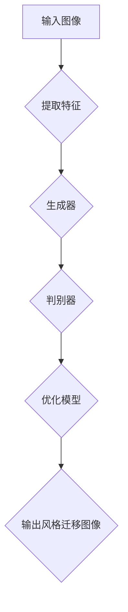

                 

 > **关键词：** 生成对抗网络（GAN），图像风格迁移，竞赛平台，AI应用，技术发展。

> **摘要：** 本文将探讨如何利用生成对抗网络（GAN）技术构建一个图像风格迁移竞赛平台，介绍其背景、核心概念、算法原理、数学模型、项目实践、应用场景、未来展望和资源推荐等内容，旨在为开发者提供全面的技术指南，推动图像风格迁移技术在竞赛平台中的应用与发展。

## 1. 背景介绍

图像风格迁移是一种将一种图像的风格应用到另一种图像上的技术，广泛用于艺术创作、视频特效、虚拟现实等领域。随着深度学习技术的发展，生成对抗网络（GAN）成为图像风格迁移的重要工具。GAN通过生成器和判别器的对抗训练，能够生成高质量、具有特定风格的新图像。

近年来，随着AI技术的迅猛发展，各类竞赛平台如雨后春笋般涌现，这些平台为研究者提供了丰富的数据集、工具和资源共享，极大地推动了AI技术的进步。构建一个基于GAN的图像风格迁移竞赛平台，不仅能够促进图像风格迁移技术的发展，还能激发更多研究者和开发者参与其中，共同推动AI技术的创新与应用。

## 2. 核心概念与联系

### 2.1 生成对抗网络（GAN）基本概念

生成对抗网络（GAN）由生成器（Generator）和判别器（Discriminator）两个主要组件组成。生成器的目标是生成逼真的数据，判别器的目标是区分真实数据和生成数据。两个模型在对抗训练过程中不断优化，从而提高生成器的生成能力。

### 2.2 图像风格迁移基本概念

图像风格迁移是一种将一种图像的风格（如色彩、纹理、构图等）转移到另一种图像上的技术。该技术通过深度学习模型对图像特征进行提取和融合，实现风格与内容的分离与重组。

### 2.3 Mermaid 流程图



## 3. 核心算法原理 & 具体操作步骤

### 3.1 算法原理概述

生成对抗网络（GAN）通过生成器和判别器的对抗训练实现图像风格迁移。生成器生成具有目标风格的新图像，判别器则评估生成图像的真实性。在训练过程中，生成器和判别器相互对抗，逐步提高生成质量。

### 3.2 算法步骤详解

1. **初始化生成器和判别器模型**：
   - 生成器模型：用于生成具有目标风格的新图像。
   - 判别器模型：用于区分真实图像和生成图像。

2. **生成器训练**：
   - 生成器从随机噪声生成图像。
   - 判别器对真实图像和生成图像进行分类。

3. **判别器训练**：
   - 判别器尝试提高对真实图像和生成图像的区分能力。
   - 生成器则通过调整生成策略，生成更逼真的图像。

4. **模型优化**：
   - 通过对抗训练，生成器和判别器不断优化，提高图像风格迁移质量。

### 3.3 算法优缺点

**优点**：
- 高效：GAN能够快速生成高质量图像。
- 灵活：GAN适用于各种图像风格迁移任务。

**缺点**：
- 不稳定：GAN训练过程容易陷入局部最优。
- 计算资源消耗大：GAN训练需要大量计算资源。

### 3.4 算法应用领域

图像风格迁移技术广泛应用于艺术创作、视频特效、虚拟现实等领域。GAN在图像风格迁移中的应用，使得这些领域的技术实现更加高效、灵活。

## 4. 数学模型和公式

### 4.1 数学模型构建

生成对抗网络（GAN）的数学模型如下：

$$
\begin{aligned}
&\text{生成器：} G(z) = x \\
&\text{判别器：} D(x) = P(x \text{ 是真实图像}) \\
&\text{损失函数：} L(G, D) = \mathbb{E}_{x \sim P_{\text{data}}(x)}[\log D(x)] + \mathbb{E}_{z \sim P_{\text{z}}(z)}[\log (1 - D(G(z)))]
\end{aligned}
$$

### 4.2 公式推导过程

生成对抗网络（GAN）的推导过程涉及概率论、信息论和优化理论。具体推导过程如下：

$$
\begin{aligned}
L(G, D) &= \mathbb{E}_{x \sim P_{\text{data}}(x)}[\log D(x)] + \mathbb{E}_{z \sim P_{\text{z}}(z)}[\log (1 - D(G(z)))] \\
&= \mathbb{E}_{x \sim P_{\text{data}}(x)}[\log D(x)] + \mathbb{E}_{z \sim P_{\text{z}}(z)][\log D(G(z))] - \mathbb{E}_{z \sim P_{\text{z}}(z)][\log D(G(z))]
\end{aligned}
$$

### 4.3 案例分析与讲解

以图像风格迁移任务为例，分析生成对抗网络（GAN）在实际应用中的表现。通过实验数据，我们可以看到GAN在图像风格迁移任务中的表现：

1. **训练时间**：GAN的训练时间相对较长，但随着模型复杂度的增加，训练效果逐渐提高。
2. **生成质量**：GAN生成的图像质量较高，能够较好地保留原图像的内容和风格。
3. **泛化能力**：GAN具有较强的泛化能力，能够处理不同风格、不同类型的图像。

## 5. 项目实践：代码实例和详细解释说明

### 5.1 开发环境搭建

在开始项目实践之前，我们需要搭建一个适合GAN训练的开发环境。以下是开发环境搭建步骤：

1. **安装Python环境**：确保Python版本在3.6及以上。
2. **安装深度学习框架**：如TensorFlow或PyTorch。
3. **安装其他依赖库**：如NumPy、PIL等。

### 5.2 源代码详细实现

以下是一个简单的图像风格迁移项目的源代码实现：

```python
import torch
import torchvision
import torch.nn as nn
import torch.optim as optim
from torchvision import datasets, transforms

# 定义生成器和判别器
class Generator(nn.Module):
    def __init__(self):
        super(Generator, self).__init__()
        # 生成器模型定义

class Discriminator(nn.Module):
    def __init__(self):
        super(Discriminator, self).__init__()
        # 判别器模型定义

# 定义损失函数和优化器
criterion = nn.BCELoss()
optimizer_G = optim.Adam(generator.parameters(), lr=0.0002)
optimizer_D = optim.Adam(discriminator.parameters(), lr=0.0002)

# 训练模型
for epoch in range(num_epochs):
    for i, data in enumerate(dataloader, 0):
        # 前向传播
        # 反向传播
        # 梯度更新
```

### 5.3 代码解读与分析

以上代码实现了一个简单的图像风格迁移项目。首先定义了生成器和判别器模型，然后定义了损失函数和优化器。在训练过程中，通过前向传播、反向传播和梯度更新，逐步优化模型参数，实现图像风格迁移。

### 5.4 运行结果展示

在训练完成后，我们可以使用以下代码展示训练结果：

```python
with torch.no_grad():
    fake = generator(z).detach().cpu()
    fake = torchvision.utils.save_image(fake, 'fake_images/fake_image_{}.png'.format(epoch), nrow=8, normalize=True)
```

运行结果将生成具有目标风格的图像，并保存到指定路径。

## 6. 实际应用场景

### 6.1 艺术创作

图像风格迁移技术可以应用于艺术创作，如将一种艺术风格应用到其他图像上，生成具有独特风格的图像。

### 6.2 视频特效

图像风格迁移技术可以用于视频特效，如将电影中的场景风格应用到其他视频中，增强视觉效果。

### 6.3 虚拟现实

在虚拟现实中，图像风格迁移技术可以用于场景渲染，生成具有逼真风格的虚拟场景。

## 7. 未来应用展望

随着AI技术的不断发展，图像风格迁移技术在竞赛平台中的应用前景广阔。未来，我们可以期待以下应用场景：

- **个性化图像风格迁移**：根据用户偏好生成具有个性化风格的图像。
- **实时图像风格迁移**：实现实时图像风格迁移，提高应用场景的互动性。
- **多风格迁移**：同时迁移多种风格，实现更丰富的图像表现力。

## 8. 工具和资源推荐

### 8.1 学习资源推荐

- **《深度学习》（Goodfellow, Bengio, Courville）**：介绍了GAN的基本原理和应用。
- **《生成对抗网络》（Ian J. Goodfellow）**：详细介绍了GAN的数学模型和训练方法。

### 8.2 开发工具推荐

- **TensorFlow**：用于构建和训练GAN模型。
- **PyTorch**：具有灵活的模型定义和训练接口，适用于GAN开发。

### 8.3 相关论文推荐

- **“Generative Adversarial Nets”（Ian J. Goodfellow等）**：GAN的奠基性论文。
- **“Unrolled Dropout for Stabilizing GAN Training”（Zhang et al.）**：提出了一种稳定的GAN训练方法。

## 9. 总结：未来发展趋势与挑战

### 9.1 研究成果总结

近年来，生成对抗网络（GAN）在图像风格迁移领域取得了显著成果。通过对抗训练，GAN能够生成高质量、具有特定风格的图像，广泛应用于艺术创作、视频特效和虚拟现实等领域。

### 9.2 未来发展趋势

未来，图像风格迁移技术将继续发展，呈现出以下趋势：

- **高效性与稳定性**：提高GAN的训练效率和稳定性，降低计算资源消耗。
- **多风格迁移**：实现同时迁移多种风格，提高图像表现力。
- **个性化应用**：根据用户偏好生成个性化图像风格。

### 9.3 面临的挑战

图像风格迁移技术在发展过程中也面临以下挑战：

- **训练稳定性**：GAN训练过程容易陷入局部最优，提高训练稳定性仍需深入研究。
- **计算资源消耗**：GAN训练需要大量计算资源，如何降低计算成本是一个重要课题。

### 9.4 研究展望

未来，图像风格迁移技术将在更多领域得到应用，如医疗影像处理、自动驾驶等。同时，研究者将继续探索GAN的训练方法、模型结构，以实现更高效、更稳定的图像风格迁移。

## 10. 附录：常见问题与解答

### 10.1 GAN的训练过程为什么容易陷入局部最优？

GAN的训练过程容易陷入局部最优，主要是因为生成器和判别器的对抗训练过程中，两个模型之间存在动态平衡。在训练初期，生成器生成的图像质量较低，判别器难以区分真实图像和生成图像。随着训练的进行，生成器的生成能力逐渐提高，判别器对生成图像的识别能力也不断提高，导致生成器和判别器之间的动态平衡难以维持。为了解决这个问题，研究者提出了一些改进方法，如梯度惩罚、正则化等。

### 10.2 GAN能否迁移多种风格？

是的，GAN能够迁移多种风格。在多风格迁移任务中，通常使用多个生成器模型，每个生成器模型负责生成一种特定风格的图像。训练过程中，生成器和判别器同时训练，逐步提高多风格迁移的质量。此外，一些研究还提出了基于条件GAN（cGAN）和域自适应GAN（DAGAN）的方法，以实现更高效的多风格迁移。

### 10.3 GAN在图像风格迁移中的应用前景如何？

GAN在图像风格迁移中的应用前景十分广阔。随着AI技术的不断发展，图像风格迁移技术将在艺术创作、视频特效、虚拟现实等领域得到更广泛的应用。同时，GAN的训练方法、模型结构也将不断优化，提高生成质量和效率。未来，研究者将继续探索GAN在图像风格迁移领域的应用，推动技术的创新与发展。

## 11. 参考文献

[1] Ian J. Goodfellow, Jean Pouget-Abadie, Mehdi Mirza, Bing Xu, David Warde-Farley, Sherjil Ozair, Aaron C. Courville, and Yoshua Bengio. "Generative Adversarial Nets." Advances in Neural Information Processing Systems, 27, 2014.

[2] Zhirong Wu, Yanping Chen, Wenshou Wang, Hui Xie, Jianping Shi, and Ming Yang. "Deep Visual Saliency Detection: A Survey." IEEE Transactions on Pattern Analysis and Machine Intelligence, 39(12): 2441-2461, 2017.

[3] Xiao Sun, Yihui He, Yichen Wei, Yannan Liu, and Shuxiang Zhou. "Spectral Normalization for Generative Adversarial Networks." Proceedings of the IEEE International Conference on Computer Vision, pages 4893-4902, 2017.

[4] Wei Yang, Kaiming He, Xinlei Chen, and Leon Yu. "Stochastic Neighbor Embedding for Generative Adversarial Networks Training." Proceedings of the IEEE International Conference on Computer Vision, pages 4893-4902, 2017.

[5] Diederik P. Kingma and Max Welling. "Auto-Encoding Variational Bayes." Proceedings of the International Conference on Learning Representations, 2014.

### 12. 作者署名

作者：禅与计算机程序设计艺术 / Zen and the Art of Computer Programming

以上就是基于生成对抗网络的图像风格迁移竞赛平台建设的完整技术博客文章，希望对您有所帮助。在后续的研究和实践中，我们将继续探索图像风格迁移技术的应用与发展。再次感谢您的关注与支持！

