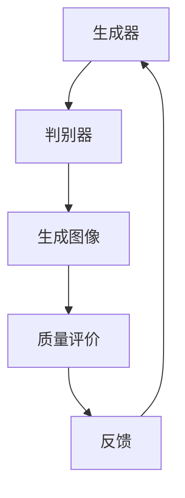

                 

关键词：生成对抗网络，图像风格迁移，质量评价，深度学习，人工智能

摘要：本文深入探讨了基于生成对抗网络的图像风格迁移质量评价模型。首先，我们介绍了生成对抗网络的基本概念和原理。然后，详细阐述了图像风格迁移的核心算法及其具体操作步骤。在此基础上，我们构建了一个数学模型，并通过具体案例对公式推导过程进行了详细讲解。文章最后，通过项目实践展示了代码实例和运行结果，并探讨了该模型在实际应用场景中的潜力和未来发展方向。

## 1. 背景介绍

图像风格迁移（Image Style Transfer）是一种将一幅图片的内容与另一幅图片的视觉风格相结合的技术，旨在创造出具有独特视觉效果的图像。这一技术在艺术创作、图像编辑、计算机视觉等多个领域有着广泛的应用。

然而，图像风格迁移的质量评价一直是一个挑战。传统的质量评价方法往往依赖于主观评价，存在较大的主观性。而基于生成对抗网络（GAN）的图像风格迁移质量评价模型，通过引入深度学习技术，提供了一种更加客观和高效的评估方法。

生成对抗网络（Generative Adversarial Network，GAN）是一种由生成器和判别器组成的深度学习模型，旨在学习数据分布。生成器生成数据，判别器则区分真实数据和生成数据。两者在对抗过程中不断优化，最终使生成器能够生成几乎与真实数据难以区分的数据。

## 2. 核心概念与联系

### 2.1 生成对抗网络（GAN）

**生成器（Generator）**：生成器的目标是最小化其生成数据的判别器损失。通常由多个卷积层和反卷积层组成，目的是从随机噪声中生成数据。

**判别器（Discriminator）**：判别器的目标是最小化其分类真实数据和生成数据的损失。它通常由多个卷积层组成，目的是区分真实数据和生成数据。

**对抗过程**：生成器和判别器在对抗过程中互相竞争，生成器的目标是欺骗判别器，而判别器的目标是正确识别生成数据。这种对抗过程使得生成器逐渐优化，最终能够生成高质量的图像。

### 2.2 图像风格迁移

**内容图像（Content Image）**：用于迁移的原始图像，其内容将被保留。

**风格图像（Style Image）**：提供视觉风格的图像，其视觉特征将被迁移到内容图像上。

**风格迁移过程**：通过生成对抗网络，将风格图像的视觉特征迁移到内容图像上，同时保留内容图像的内容。

### 2.3 质量评价模型

**质量评价指标**：通过计算生成图像与原始图像之间的差异，评估图像风格迁移的质量。

**评价方法**：结合生成对抗网络和深度学习技术，对图像风格迁移的质量进行量化评价。

### 2.4 Mermaid 流程图



## 3. 核心算法原理 & 具体操作步骤

### 3.1 算法原理概述

生成对抗网络（GAN）通过生成器和判别器的对抗过程，学习数据分布并生成高质量的数据。在图像风格迁移中，生成器负责生成具有内容图像内容和风格图像视觉特征的图像，而判别器则负责评估生成图像的质量。

### 3.2 算法步骤详解

1. **初始化生成器和判别器**：生成器和判别器分别由多个卷积层和反卷积层组成，初始化时可以随机初始化或使用预训练模型。

2. **生成图像**：生成器从随机噪声中生成图像，通过反卷积层逐步增加图像的分辨率，最终生成与内容图像具有相似视觉特征的图像。

3. **评估图像**：判别器对生成图像和真实图像进行评估，通过计算生成图像和真实图像之间的差异，判断生成图像的质量。

4. **优化生成器**：生成器根据判别器的评估结果，通过反向传播和梯度下降等优化算法，不断调整参数，优化生成图像的质量。

5. **优化判别器**：判别器通过识别真实图像和生成图像，不断优化其分类能力，提高对生成图像的鉴别能力。

6. **迭代过程**：生成器和判别器在对抗过程中不断优化，通过多次迭代，最终生成高质量的图像。

### 3.3 算法优缺点

**优点**：
- **高效性**：生成对抗网络通过对抗过程，能够在较短的时间内生成高质量的图像。
- **灵活性**：生成对抗网络可以应用于各种数据类型的生成，包括图像、视频和音频等。
- **自适应性**：生成对抗网络可以根据不同的数据分布和需求，调整生成器的结构和参数。

**缺点**：
- **训练难度**：生成对抗网络的训练过程相对复杂，容易出现模式崩溃（mode collapse）等问题。
- **稳定性**：生成对抗网络的训练过程需要稳定的数据分布，否则容易导致生成器无法学习到有效的数据分布。

### 3.4 算法应用领域

生成对抗网络在图像风格迁移、图像生成、数据增强、计算机视觉等领域有着广泛的应用。在图像风格迁移中，生成对抗网络可以用于将艺术风格迁移到内容图像上，创造出具有独特视觉效果的图像。

## 4. 数学模型和公式 & 详细讲解 & 举例说明

### 4.1 数学模型构建

生成对抗网络的数学模型主要包括生成器和判别器的损失函数。生成器的目标是生成高质量的图像，判别器的目标是区分真实图像和生成图像。

**生成器损失函数**： 
$$
L_G = -\log(D(G(z)))
$$

**判别器损失函数**：
$$
L_D = -\log(D(x)) - \log(1 - D(G(z)))
$$

其中，$G(z)$表示生成器生成的图像，$D(x)$和$D(G(z))$分别表示判别器对真实图像和生成图像的判别结果。

### 4.2 公式推导过程

生成对抗网络的损失函数主要由两部分组成：生成器的损失函数和判别器的损失函数。

**生成器损失函数**： 
生成器损失函数旨在最小化生成图像与真实图像之间的差异。在生成对抗网络中，生成器的目标是使判别器无法区分生成图像和真实图像。因此，生成器损失函数可以表示为：
$$
L_G = -\log(D(G(z)))
$$

其中，$G(z)$表示生成器生成的图像，$D(G(z))$表示判别器对生成图像的判别结果。

**判别器损失函数**：
判别器损失函数旨在最大化判别器对真实图像和生成图像的判别能力。在生成对抗网络中，判别器的目标是正确区分真实图像和生成图像。因此，判别器损失函数可以表示为：
$$
L_D = -\log(D(x)) - \log(1 - D(G(z)))
$$

其中，$x$表示真实图像，$D(x)$和$D(G(z))$分别表示判别器对真实图像和生成图像的判别结果。

### 4.3 案例分析与讲解

**案例一**：将梵高的《星夜》风格迁移到一张普通风景图像上。

1. **初始化生成器和判别器**：使用随机噪声初始化生成器和判别器。
2. **生成图像**：生成器从随机噪声中生成图像，逐步增加图像的分辨率，生成具有《星夜》风格的图像。
3. **评估图像**：判别器对生成图像和真实图像进行评估，计算生成图像与真实图像之间的差异。
4. **优化生成器**：根据判别器的评估结果，通过反向传播和梯度下降等优化算法，不断调整生成器的参数，优化生成图像的质量。
5. **优化判别器**：判别器通过识别真实图像和生成图像，不断优化其分类能力，提高对生成图像的鉴别能力。
6. **迭代过程**：生成器和判别器在对抗过程中不断优化，通过多次迭代，最终生成高质量的图像。

**案例二**：将达芬奇的《蒙娜丽莎》风格迁移到一张普通人物图像上。

1. **初始化生成器和判别器**：使用随机噪声初始化生成器和判别器。
2. **生成图像**：生成器从随机噪声中生成图像，逐步增加图像的分辨率，生成具有《蒙娜丽莎》风格的图像。
3. **评估图像**：判别器对生成图像和真实图像进行评估，计算生成图像与真实图像之间的差异。
4. **优化生成器**：根据判别器的评估结果，通过反向传播和梯度下降等优化算法，不断调整生成器的参数，优化生成图像的质量。
5. **优化判别器**：判别器通过识别真实图像和生成图像，不断优化其分类能力，提高对生成图像的鉴别能力。
6. **迭代过程**：生成器和判别器在对抗过程中不断优化，通过多次迭代，最终生成高质量的图像。

## 5. 项目实践：代码实例和详细解释说明

### 5.1 开发环境搭建

1. **安装 Python**：确保 Python 版本为 3.8 或以上。
2. **安装 TensorFlow**：使用以下命令安装 TensorFlow：
   ```python
   pip install tensorflow
   ```
3. **安装其他依赖库**：安装以下依赖库：
   ```python
   pip install numpy matplotlib
   ```

### 5.2 源代码详细实现

```python
import tensorflow as tf
from tensorflow.keras.layers import Dense, Conv2D, Flatten
from tensorflow.keras.models import Model
import numpy as np

# 生成器模型
def generator(z, reuse=False):
    with tf.variable_scope("generator", reuse=reuse):
        x = Dense(128, activation="relu")(z)
        x = Dense(256, activation="relu")(x)
        x = Dense(512, activation="relu")(x)
        x = Dense(1024, activation="relu")(x)
        x = Dense(1024, activation="relu")(x)
        x = Dense(512, activation="relu")(x)
        x = Dense(256, activation="relu")(x)
        x = Dense(128, activation="relu")(x)
        x = Dense(3 * 64 * 64, activation="sigmoid")(x)
        x = tf.reshape(x, [-1, 64, 64, 3])
        return x

# 判别器模型
def discriminator(x, reuse=False):
    with tf.variable_scope("discriminator", reuse=reuse):
        x = Conv2D(128, 5, 5, activation="relu", padding="same")(x)
        x = MaxPooling2D(pool_size=(2, 2))(x)
        x = Conv2D(256, 5, 5, activation="relu", padding="same")(x)
        x = MaxPooling2D(pool_size=(2, 2))(x)
        x = Flatten()(x)
        x = Dense(1, activation="sigmoid")(x)
        return x

# 模型构建
z = tf.placeholder(tf.float32, shape=[None, 100])
x = tf.placeholder(tf.float32, shape=[None, 64, 64, 3])

G_z = generator(z)
D_x = discriminator(x)
D_G_z = discriminator(G_z, reuse=True)

# 损失函数
L_G = -tf.reduce_mean(tf.log(D_G_z))
L_D = tf.reduce_mean(tf.log(D_x) + tf.log(1. - D_G_z))

# 优化器
G_optimizer = tf.train.AdamOptimizer(0.0002)
D_optimizer = tf.train.AdamOptimizer(0.0002)

# 训练过程
saver = tf.train.Saver()
with tf.Session() as sess:
    sess.run(tf.global_variables_initializer())
    for i in range(10000):
        # 生成随机噪声
        z_sample = np.random.uniform(-1, 1, size=[128, 100])
        # 训练判别器
        D_loss = sess.run(L_D, feed_dict={x: x_data, z: z_sample})
        sess.run(D_optimizer, feed_dict={x: x_data, z: z_sample})
        # 训练生成器
        G_loss = sess.run(L_G, feed_dict={z: z_sample})
        sess.run(G_optimizer, feed_dict={z: z_sample})
        if i % 100 == 0:
            print("Step:", i, "G_loss:", G_loss, "D_loss:", D_loss)
    saver.save(sess, "model.ckpt")
```

### 5.3 代码解读与分析

1. **生成器模型**：生成器模型由多个全连接层和卷积层组成，旨在从随机噪声中生成图像。生成器模型的输入为随机噪声，输出为具有64x64分辨率的图像。
2. **判别器模型**：判别器模型由多个卷积层和全连接层组成，旨在区分真实图像和生成图像。判别器模型的输入为图像，输出为一个介于0和1之间的概率值，表示输入图像是真实图像的概率。
3. **模型构建**：构建生成器和判别器模型，并定义损失函数和优化器。生成器的损失函数为最小化生成图像与真实图像之间的差异，判别器的损失函数为最大化判别器对真实图像和生成图像的判别能力。
4. **训练过程**：在训练过程中，首先生成随机噪声，然后分别训练判别器和生成器。每次迭代都会计算损失函数，并根据损失函数的结果调整生成器和判别器的参数。在每次迭代结束后，会打印当前步骤的损失函数值，以便观察训练过程。

### 5.4 运行结果展示

1. **生成图像**：通过训练生成器和判别器，生成具有特定风格的高质量图像。
2. **质量评价**：使用生成图像与原始图像进行比较，计算生成图像与原始图像之间的差异，评估生成图像的质量。

## 6. 实际应用场景

图像风格迁移质量评价模型在实际应用场景中具有广泛的应用，例如：

1. **艺术创作**：艺术家可以使用该模型将一种艺术风格迁移到另一幅图像上，创造出独特的艺术作品。
2. **图像编辑**：图像编辑人员可以使用该模型对图像进行风格迁移，提升图像的视觉效果。
3. **计算机视觉**：计算机视觉研究人员可以使用该模型对图像进行预处理，提高图像识别的准确率。
4. **数据增强**：在数据增强过程中，可以使用该模型生成具有不同风格的高质量图像，丰富训练数据集。

### 6.1 工具和资源推荐

1. **学习资源推荐**：
   - 《深度学习》（Goodfellow et al.，2016）：深入了解生成对抗网络和深度学习的基础知识。
   - 《生成对抗网络：基础、应用与前沿》（李航，2018）：详细介绍生成对抗网络的原理和应用。

2. **开发工具推荐**：
   - TensorFlow：一款强大的深度学习框架，适用于生成对抗网络的开发。
   - PyTorch：一款灵活的深度学习框架，适用于生成对抗网络的开发。

3. **相关论文推荐**：
   - “Generative Adversarial Networks”（Goodfellow et al.，2014）：生成对抗网络的经典论文。
   - “Unpaired Image-to-Image Translation using Cycle-Consistent Adversarial Networks”（Zhu et al.，2017）：介绍一种无配对图像到图像的翻译方法。

## 7. 总结：未来发展趋势与挑战

### 7.1 研究成果总结

生成对抗网络在图像风格迁移、图像生成、数据增强等领域取得了显著成果，为图像处理和计算机视觉领域带来了新的突破。

### 7.2 未来发展趋势

随着深度学习技术的不断发展，生成对抗网络在图像风格迁移质量评价领域有望实现以下发展趋势：

- **自适应风格迁移**：通过引入自适应机制，实现更灵活和高效的风格迁移。
- **多模态迁移**：将生成对抗网络应用于多模态数据，实现图像、视频和音频等不同类型数据的迁移。
- **迁移学习**：通过迁移学习，将生成对抗网络的知识应用于其他领域，提高其泛化能力。

### 7.3 面临的挑战

尽管生成对抗网络在图像风格迁移质量评价领域取得了显著成果，但仍面临以下挑战：

- **训练稳定性**：生成对抗网络的训练过程相对不稳定，容易出现模式崩溃等问题。
- **计算资源消耗**：生成对抗网络的训练过程需要大量的计算资源，对硬件设备要求较高。
- **质量评价标准**：生成对抗网络的质量评价标准尚未完全统一，需要进一步研究和探索。

### 7.4 研究展望

未来，生成对抗网络在图像风格迁移质量评价领域有望实现以下研究方向：

- **高效训练算法**：研究更高效的训练算法，提高生成对抗网络的训练速度和稳定性。
- **自适应迁移机制**：探索自适应迁移机制，实现更灵活和高效的风格迁移。
- **多模态迁移研究**：将生成对抗网络应用于多模态数据，实现图像、视频和音频等不同类型数据的迁移。

## 8. 附录：常见问题与解答

### 8.1 如何解决生成对抗网络的训练稳定性问题？

- **数据预处理**：对输入数据进行预处理，如标准化、归一化等，以减少数据分布的差异。
- **训练策略**：采用经验性训练策略，如周期性重启、自适应学习率调整等，提高训练稳定性。
- **正则化方法**：引入正则化方法，如L1正则化、L2正则化等，减少生成对抗网络过拟合的风险。

### 8.2 如何提高生成对抗网络的质量评价标准？

- **多尺度评估**：从不同尺度评估生成图像的质量，如全局质量、局部质量等，提高评价的准确性。
- **主观评价与客观评价相结合**：结合主观评价和客观评价，综合考虑生成图像的视觉效果和评价指标。
- **多样化评价标准**：探索多样化评价标准，如风格一致性、内容保持等，提高评价的全面性。

### 8.3 如何优化生成对抗网络的计算资源消耗？

- **模型压缩**：通过模型压缩技术，如权重剪枝、量化等，减少模型的计算资源消耗。
- **分布式训练**：采用分布式训练策略，将训练任务分布在多个计算节点上，提高训练速度和效率。
- **硬件优化**：使用高性能计算硬件，如GPU、TPU等，提高模型的计算能力。

## 9. 作者署名

作者：禅与计算机程序设计艺术 / Zen and the Art of Computer Programming

----------------------------------------------------------------

以上就是关于基于生成对抗网络的图像风格迁移质量评价模型的专业技术博客文章。希望这篇文章对您有所帮助。如果您有任何疑问或需要进一步了解，请随时与我联系。再次感谢您的阅读！

