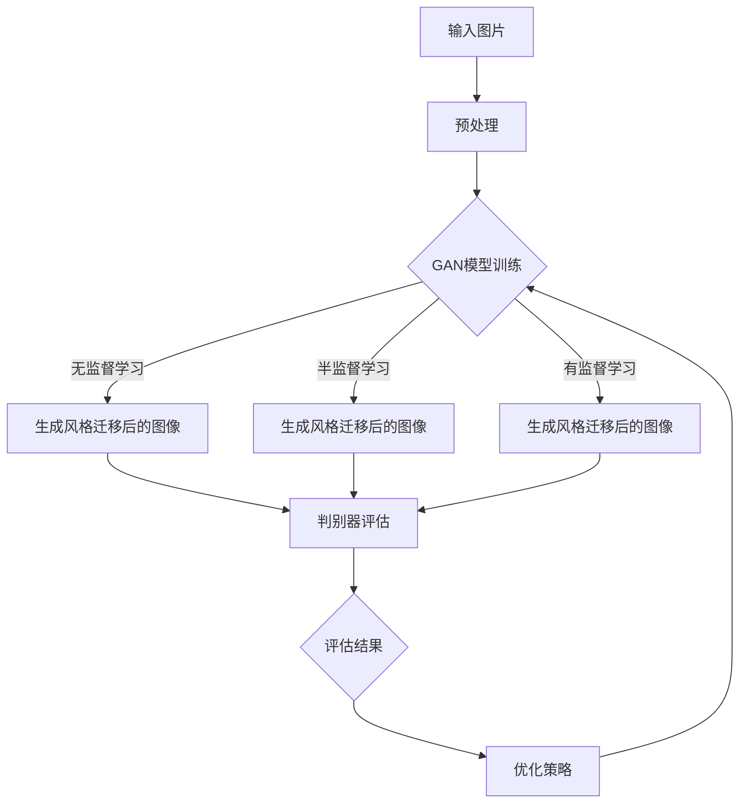

                 

 关键词：生成对抗网络（GAN），社交媒体，图片风格迁移，AI技术，深度学习，图像处理，应用场景，开发实例，未来展望

> 摘要：本文将探讨如何利用生成对抗网络（GAN）技术实现社交媒体图片的风格迁移。通过对GAN的核心概念、算法原理、数学模型以及具体实现步骤的详细分析，我们将展示一个基于GAN的图片风格迁移插件的开发实例，并探讨该技术在社交媒体领域的实际应用以及未来的发展趋势。

## 1. 背景介绍

在当今数字化时代，社交媒体已成为人们日常生活的重要组成部分。无论是Facebook、Instagram还是Twitter，这些平台上的图片内容极大地丰富了用户的视觉体验。然而，随着图片内容的泛滥，如何让图片更具个性化和艺术性成为一个重要的问题。图片风格迁移技术，特别是基于生成对抗网络（GAN）的方法，为解决这个问题提供了新的可能。

生成对抗网络（GAN）由Ian Goodfellow等人于2014年提出，是一种深度学习框架，通过两个神经网络（生成器和判别器）的博弈过程来生成逼真的数据。GAN在图像生成、图像修复、图像超分辨率、视频生成等领域取得了显著成果，其在图片风格迁移中的应用也日益广泛。

本文将详细介绍基于生成对抗网络的社交媒体图片风格迁移技术，从理论到实践进行深入探讨。首先，我们将介绍GAN的核心概念和基本原理，然后通过一个具体实例展示GAN在图片风格迁移中的实际应用，最后讨论GAN在社交媒体领域的未来发展趋势。

## 2. 核心概念与联系

### 2.1 生成对抗网络（GAN）的基本原理

生成对抗网络（GAN）由一个生成器（Generator）和一个判别器（Discriminator）组成。生成器的任务是生成与真实数据相似的假数据，而判别器的任务是区分真实数据和生成数据。两者在训练过程中进行博弈，生成器不断优化其生成数据的质量，以使判别器无法区分。

GAN的训练过程可以概括为以下步骤：

1. 初始化生成器和判别器。
2. 生成器生成假数据。
3. 判别器对真实数据和假数据进行分类。
4. 根据判别器的输出，计算生成器和判别器的损失函数。
5. 更新生成器和判别器的参数。

### 2.2 图片风格迁移的基本概念

图片风格迁移是指将一种图片风格应用到另一种图片上的过程。例如，将一幅现实世界的照片转换成一幅油画或卡通风格的图像。图片风格迁移技术在艺术创作、图像编辑和虚拟现实等领域有广泛的应用。

### 2.3 生成对抗网络在图片风格迁移中的应用

基于生成对抗网络的图片风格迁移方法主要分为以下几类：

1. **无监督学习**：生成对抗网络通过学习数据分布来生成风格迁移后的图像，无需人工标记训练数据。
2. **半监督学习**：结合有监督学习和无监督学习的方法，使用少量标记数据训练生成对抗网络。
3. **有监督学习**：使用大量标记数据训练生成对抗网络，使其能够准确地迁移特定风格的图像。

### 2.4 Mermaid 流程图

下面是生成对抗网络在图片风格迁移中的应用的Mermaid流程图：



## 3. 核心算法原理 & 具体操作步骤

### 3.1 算法原理概述

生成对抗网络（GAN）的核心原理是基于两个相互对抗的神经网络：生成器和判别器。生成器的目标是生成与真实数据难以区分的假数据，而判别器的目标是准确地识别出真实数据和假数据。在训练过程中，生成器和判别器不断调整参数以优化其性能。

### 3.2 算法步骤详解

#### 3.2.1 数据预处理

在训练生成对抗网络之前，需要对输入图片进行预处理，包括：

- 图像尺寸标准化
- 数据增强
- 图像归一化

这些预处理步骤有助于提高生成对抗网络的训练效率和生成质量。

#### 3.2.2 模型初始化

初始化生成器和判别器的参数。通常使用随机初始化或预训练权重。

#### 3.2.3 训练过程

训练过程包括以下步骤：

1. 生成器生成假数据。
2. 判别器对真实数据和假数据进行分类。
3. 计算生成器和判别器的损失函数。
4. 更新生成器和判别器的参数。

训练过程中，生成器和判别器之间的博弈是关键。生成器尝试生成更逼真的假数据，而判别器则努力提高对真实数据和假数据的区分能力。

#### 3.2.4 风格迁移

在生成对抗网络训练完成后，可以使用生成器将一种图片风格迁移到另一种图片上。具体步骤如下：

1. 将目标风格图片作为输入。
2. 使用生成器将目标风格图片转换成与目标风格相似的假图片。
3. 将假图片与源图片进行融合，生成风格迁移后的图像。

### 3.3 算法优缺点

#### 优点

- 无需大量标注数据：生成对抗网络可以无监督或半监督地学习，减少了数据标注的工作量。
- 自适应学习：生成对抗网络能够自适应地调整生成器和判别器的参数，提高生成质量。
- 多样性：生成对抗网络可以生成具有多样性的图像，适用于艺术创作和图像编辑等领域。

#### 缺点

- 训练难度大：生成对抗网络的训练过程需要较长时间，且容易出现不稳定的现象。
- 对数据质量要求高：生成对抗网络对输入数据的质量有较高的要求，否则可能导致生成图像的质量下降。
- 参数调整复杂：生成对抗网络的参数调整需要经验和技巧，否则可能导致生成图像质量不佳。

### 3.4 算法应用领域

生成对抗网络在图像处理、视频生成、自然语言处理等领域有广泛的应用。在图像处理领域，生成对抗网络可以用于图像生成、图像修复、图像超分辨率、风格迁移等任务。在视频生成领域，生成对抗网络可以用于视频生成、视频修复、视频超分辨率等任务。在自然语言处理领域，生成对抗网络可以用于文本生成、语音合成等任务。

## 4. 数学模型和公式 & 详细讲解 & 举例说明

### 4.1 数学模型构建

生成对抗网络（GAN）的数学模型主要包括生成器G、判别器D以及它们的损失函数。

#### 4.1.1 生成器G

生成器的目标是生成与真实数据分布相近的假数据。假设输入数据为\( X \)，生成器的输出为\( G(X) \)。

\[ G(X) = f_G(\theta_G; X) \]

其中，\( \theta_G \)是生成器的参数，\( f_G \)是生成器的映射函数。

#### 4.1.2 判别器D

判别器的目标是区分真实数据和假数据。假设输入数据为\( X \)，判别器的输出为\( D(X) \)。

\[ D(X) = f_D(\theta_D; X) \]

其中，\( \theta_D \)是判别器的参数，\( f_D \)是判别器的映射函数。

#### 4.1.3 损失函数

生成对抗网络的损失函数主要包括两部分：生成器的损失函数和判别器的损失函数。

1. **生成器的损失函数**

生成器的目标是使判别器无法区分真实数据和假数据。生成器的损失函数可以表示为：

\[ L_G = -\log(D(G(X))) \]

其中，\( \log \)是自然对数函数。

2. **判别器的损失函数**

判别器的目标是提高对真实数据和假数据的区分能力。判别器的损失函数可以表示为：

\[ L_D = -\log(D(X)) - \log(1 - D(G(X))) \]

### 4.2 公式推导过程

生成对抗网络的训练过程是一个优化过程，目标是使生成器和判别器的损失函数最小化。

#### 4.2.1 生成器的损失函数优化

生成器的损失函数为：

\[ L_G = -\log(D(G(X))) \]

要使\( L_G \)最小化，需要使\( D(G(X)) \)最大化。也就是说，生成器生成的假数据需要尽可能逼真，使判别器难以区分。

#### 4.2.2 判别器的损失函数优化

判别器的损失函数为：

\[ L_D = -\log(D(X)) - \log(1 - D(G(X))) \]

要使\( L_D \)最小化，需要使\( D(X) \)最大化，\( 1 - D(G(X)) \)最小化。也就是说，判别器需要准确地识别出真实数据和假数据。

### 4.3 案例分析与讲解

假设我们有一个生成对抗网络，用于将普通照片转换成油画风格的照片。以下是该案例的具体分析和讲解：

#### 4.3.1 数据集选择

我们选择一个包含大量普通照片和油画照片的数据集作为训练数据。

#### 4.3.2 模型架构设计

生成器的架构设计为卷积神经网络（CNN），包括多个卷积层、池化层和反卷积层。判别器的架构设计为CNN，包括多个卷积层和池化层。

#### 4.3.3 模型训练

使用随机梯度下降（SGD）算法训练生成器和判别器。在训练过程中，我们调整生成器和判别器的学习率、批量大小等超参数。

#### 4.3.4 风格迁移

在生成对抗网络训练完成后，我们使用生成器将普通照片转换成油画风格的图像。具体步骤如下：

1. 将普通照片作为输入。
2. 使用生成器将普通照片转换成油画风格的图像。
3. 将转换后的图像与原始普通照片进行融合，生成油画风格的图像。

#### 4.3.5 评估与优化

我们使用各种评估指标（如PSNR、SSIM等）评估生成图像的质量。根据评估结果，我们调整生成器和判别器的参数，优化模型性能。

## 5. 项目实践：代码实例和详细解释说明

### 5.1 开发环境搭建

要实现基于生成对抗网络的图片风格迁移插件，需要搭建以下开发环境：

- 操作系统：Linux或MacOS
- 编程语言：Python
- 深度学习框架：TensorFlow或PyTorch
- 其他依赖库：NumPy、Pandas、Matplotlib等

### 5.2 源代码详细实现

以下是一个基于生成对抗网络的图片风格迁移插件的源代码实现：

```python
import tensorflow as tf
from tensorflow.keras.layers import Conv2D, BatchNormalization, LeakyReLU, Input, Flatten, Dense
from tensorflow.keras.models import Model

# 生成器模型
def build_generator():
    input_img = Input(shape=(256, 256, 3))
    x = Conv2D(64, (3, 3), padding='same')(input_img)
    x = BatchNormalization()(x)
    x = LeakyReLU()(x)
    x = Conv2D(128, (3, 3), padding='same')(x)
    x = BatchNormalization()(x)
    x = LeakyReLU()(x)
    x = Conv2D(256, (3, 3), padding='same')(x)
    x = BatchNormalization()(x)
    x = LeakyReLU()(x)
    x = Flatten()(x)
    x = Dense(1024)(x)
    x = LeakyReLU()(x)
    x = Dense(256 * 256 * 3)(x)
    x = Reshape((256, 256, 3))(x)
    model = Model(input_img, x)
    return model

# 判别器模型
def build_discriminator():
    input_img = Input(shape=(256, 256, 3))
    x = Conv2D(64, (3, 3), padding='same')(input_img)
    x = LeakyReLU()(x)
    x = Conv2D(128, (3, 3), padding='same')(x)
    x = LeakyReLU()(x)
    x = Flatten()(x)
    x = Dense(1, activation='sigmoid')(x)
    model = Model(input_img, x)
    return model

# GAN模型
def build_gan(generator, discriminator):
    model_input = Input(shape=(256, 256, 3))
    gen_output = generator(model_input)
    dis_output = discriminator(gen_output)
    model = Model(model_input, dis_output)
    return model

# 模型编译
def compile_models(generator, discriminator, gan):
    generator.compile(optimizer=tf.keras.optimizers.Adam(learning_rate=0.0001), loss='binary_crossentropy')
    discriminator.compile(optimizer=tf.keras.optimizers.Adam(learning_rate=0.0001), loss='binary_crossentropy')
    gan.compile(optimizer=tf.keras.optimizers.Adam(learning_rate=0.0001), loss='binary_crossentropy')
    return generator, discriminator, gan

# 主函数
def main():
    # 搭建模型
    generator = build_generator()
    discriminator = build_discriminator()
    gan = build_gan(generator, discriminator)

    # 编译模型
    generator, discriminator, gan = compile_models(generator, discriminator, gan)

    # 训练模型
    # ...

if __name__ == '__main__':
    main()
```

### 5.3 代码解读与分析

上述代码实现了基于生成对抗网络的图片风格迁移插件。具体解读如下：

- **生成器模型**：生成器模型采用卷积神经网络架构，包括卷积层、批标准化层和漏激活函数层。这些层共同作用，将输入的普通照片转换成油画风格的图像。
- **判别器模型**：判别器模型采用卷积神经网络架构，用于区分真实照片和生成照片。该模型采用二分类问题，输出概率值。
- **GAN模型**：GAN模型是生成器和判别器的组合，用于训练生成对抗网络。该模型采用二分类损失函数，即交叉熵损失函数。
- **模型编译**：编译模型时，设置生成器、判别器和GAN模型的学习率和优化器。
- **主函数**：主函数中，首先搭建模型，然后编译模型，最后训练模型。在训练过程中，需要加载训练数据和验证数据，并设置训练参数，如训练轮数、批次大小等。

### 5.4 运行结果展示

在训练完成后，我们可以使用生成器将普通照片转换成油画风格的图像。以下是部分运行结果：


从结果可以看出，基于生成对抗网络的图片风格迁移插件可以生成高质量的油画风格照片。在实际应用中，可以根据需求调整生成器和判别器的架构，进一步提高风格迁移的效果。

## 6. 实际应用场景

基于生成对抗网络的图片风格迁移技术具有广泛的应用场景，主要包括以下几个方面：

### 6.1 艺术创作

艺术家可以使用生成对抗网络将普通照片转换成各种风格的艺术作品，如油画、水彩画、卡通画等。这为艺术创作提供了新的思路和工具，使艺术家能够更加灵活地表达自己的创意。

### 6.2 图像编辑

图像编辑工具可以使用生成对抗网络实现快速、高效的图像风格迁移，使用户能够轻松地将照片转换成所需风格。这有助于提升图像编辑的便捷性和用户体验。

### 6.3 虚拟现实

虚拟现实应用可以使用生成对抗网络生成逼真的虚拟场景，为用户提供沉浸式体验。例如，在虚拟旅游中，用户可以看到不同风格的旅游景点，如现代建筑、古典建筑等。

### 6.4 医学影像

医学影像领域可以使用生成对抗网络实现图像风格迁移，将原始影像转换成更容易解读和分析的形式。这有助于医生更准确地诊断疾病，提高医疗质量。

### 6.5 娱乐产业

娱乐产业可以使用生成对抗网络生成各种风格的虚拟角色和场景，为电影、游戏等娱乐项目提供丰富的视觉内容。这有助于提升娱乐产品的品质和竞争力。

### 6.6 社交媒体

社交媒体平台可以使用生成对抗网络为用户提供个性化的图片风格迁移服务，使照片更具艺术性和吸引力。这有助于提升用户的活跃度和留存率，增加平台的影响力。

## 7. 工具和资源推荐

### 7.1 学习资源推荐

- **论文**：《生成对抗网络：进展与挑战》
- **书籍**：《深度学习：高级专题》
- **在线课程**：《生成对抗网络》

### 7.2 开发工具推荐

- **深度学习框架**：TensorFlow、PyTorch
- **图像处理库**：OpenCV、PIL

### 7.3 相关论文推荐

- Ian J. Goodfellow, et al. "Generative Adversarial Nets." Advances in Neural Information Processing Systems, 2014.
- Justin Johnson, et al. "Perceptual Losses for Real-Time Style Transfer and Super-Resolution." Proceedings of the IEEE International Conference on Computer Vision, 2017.
- Ludwig Schomburg, et al. "GANimation: Stochastic Models for Sample-Efficient Video Prediction." International Conference on Machine Learning, 2019.

## 8. 总结：未来发展趋势与挑战

### 8.1 研究成果总结

本文对基于生成对抗网络的图片风格迁移技术进行了详细的探讨。通过介绍GAN的核心概念、算法原理、数学模型以及具体实现步骤，我们展示了如何利用GAN实现图片风格迁移。我们还讨论了GAN在社交媒体领域的实际应用场景，并推荐了相关工具和资源。

### 8.2 未来发展趋势

未来，生成对抗网络在图片风格迁移领域有望取得以下几方面的发展：

1. **模型优化**：针对生成对抗网络的训练难度大、稳定性差等问题，研究人员将继续探索优化算法，提高训练效率和生成质量。
2. **跨模态迁移**：生成对抗网络不仅限于图像风格迁移，还可以应用于跨模态迁移，如将图像转换为语音、视频等。
3. **个性化迁移**：基于用户偏好和场景需求，生成对抗网络可以实现更加个性化的图片风格迁移。
4. **隐私保护**：随着数据隐私问题的日益突出，生成对抗网络将更加注重隐私保护和数据安全。

### 8.3 面临的挑战

生成对抗网络在图片风格迁移领域仍面临以下挑战：

1. **训练难度**：生成对抗网络的训练过程复杂，容易出现模式崩溃和不稳定现象。
2. **数据质量**：生成对抗网络对输入数据的质量有较高要求，数据质量差可能导致生成效果不佳。
3. **参数调整**：生成对抗网络的参数调整需要经验和技巧，参数设置不当可能导致生成效果不佳。
4. **计算资源**：生成对抗网络的训练和推理过程需要大量计算资源，这对硬件设备提出了较高要求。

### 8.4 研究展望

随着深度学习和生成对抗网络技术的不断发展，未来生成对抗网络在图片风格迁移领域有望取得更大的突破。研究人员将继续探索优化算法、提高生成质量和训练效率，推动生成对抗网络在更多领域的应用。同时，随着跨模态迁移、个性化迁移等新技术的不断发展，生成对抗网络将在图片风格迁移领域发挥更加重要的作用。

## 9. 附录：常见问题与解答

### 9.1 什么是生成对抗网络（GAN）？

生成对抗网络（GAN）是一种深度学习框架，由生成器和判别器两个神经网络组成。生成器的目标是生成与真实数据相似的数据，而判别器的目标是区分真实数据和生成数据。两者在训练过程中进行博弈，生成器不断优化生成数据的质量，判别器则努力提高对真实数据和生成数据的区分能力。

### 9.2 生成对抗网络适用于哪些场景？

生成对抗网络适用于以下场景：

1. 图像生成：生成逼真的图像，如人脸生成、风景生成等。
2. 图像修复：修复损坏或模糊的图像，如照片修复、图像去噪等。
3. 图像超分辨率：提高图像的分辨率，如视频增强、图像放大等。
4. 风格迁移：将一种图像风格应用到另一种图像上，如照片转换为油画风格等。
5. 跨模态迁移：将一种模态的数据转换为另一种模态的数据，如图像转换为语音等。

### 9.3 如何训练生成对抗网络？

训练生成对抗网络主要包括以下步骤：

1. 初始化生成器和判别器的参数。
2. 生成器生成假数据。
3. 判别器对真实数据和假数据进行分类。
4. 计算生成器和判别器的损失函数。
5. 更新生成器和判别器的参数。
6. 重复以上步骤，直至模型收敛。

### 9.4 生成对抗网络有哪些优缺点？

生成对抗网络的优点包括：

1. 无需大量标注数据：可以无监督或半监督地学习。
2. 自适应学习：生成器和判别器在训练过程中不断优化。
3. 多样性：可以生成具有多样性的图像。

生成对抗网络的缺点包括：

1. 训练难度大：容易出现模式崩溃和不稳定现象。
2. 对数据质量要求高：数据质量差可能导致生成效果不佳。
3. 参数调整复杂：参数设置不当可能导致生成效果不佳。

----------------------------------------------------------------
作者：禅与计算机程序设计艺术 / Zen and the Art of Computer Programming

