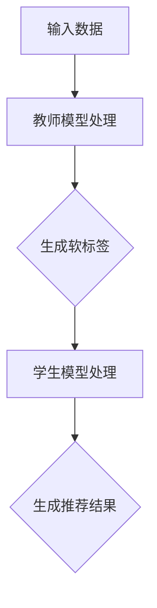

                 

关键词：知识蒸馏、轻量级模型、推荐系统、模型压缩、优化算法

> 摘要：本文主要探讨了基于知识蒸馏技术的轻量级推荐模型构建方法。通过深入分析知识蒸馏原理及其实际应用场景，本文提出了一种新的轻量级推荐模型，并对其数学模型、算法原理、实现步骤以及应用领域进行了详细阐述。此外，文章还通过一个实际项目实例展示了该模型的实现过程和效果，为推荐系统的优化和开发提供了新的思路和方法。

## 1. 背景介绍

在互联网时代，推荐系统已经成为各类应用场景中不可或缺的一部分。从电商平台的商品推荐，到社交媒体的个性化内容推送，再到新闻客户端的资讯推荐，推荐系统在很大程度上改变了人们获取信息和购买商品的方式。然而，随着数据量的爆炸式增长和用户需求的日益复杂化，传统推荐模型的计算资源和存储需求也在不断增加，给系统性能带来了很大压力。

为了解决这一问题，近年来，轻量级推荐模型成为研究的热点。轻量级模型通常具有较小的模型参数和计算量，可以在保证一定推荐效果的前提下，显著降低系统的计算资源和存储成本。知识蒸馏技术作为一种有效的模型压缩方法，近年来在计算机视觉、自然语言处理等领域取得了显著成果。本文将结合知识蒸馏技术，探讨一种基于知识蒸馏的轻量级推荐模型，旨在提高推荐系统的性能和效率。

## 2. 核心概念与联系

### 2.1 知识蒸馏原理

知识蒸馏（Knowledge Distillation）是一种将复杂模型（教师模型）的知识迁移到简单模型（学生模型）中的技术。其基本思想是将教师模型的输出（通常是对数据的软标签）作为训练数据，指导学生模型的学习。通过这种方式，学生模型能够学到教师模型的精髓，从而在保持较高性能的前提下，降低模型的复杂度。

### 2.2 轻量级推荐模型架构

轻量级推荐模型通常包括两个部分：特征提取器和预测器。特征提取器负责从用户和物品的特征中提取关键信息，预测器则基于提取到的特征生成推荐结果。本文提出的基于知识蒸馏的轻量级推荐模型，通过引入知识蒸馏技术，将复杂教师推荐模型的知识迁移到简单学生推荐模型中，从而实现轻量级的推荐效果。

### 2.3 Mermaid 流程图

下面是知识蒸馏在推荐模型中的应用流程的 Mermaid 流程图：



## 3. 核心算法原理 & 具体操作步骤

### 3.1 算法原理概述

基于知识蒸馏的轻量级推荐模型主要分为两个阶段：教师模型训练和学生模型训练。

1. **教师模型训练**：使用原始推荐数据集训练一个复杂教师推荐模型，并输出软标签。

2. **学生模型训练**：使用教师模型的软标签作为训练数据，训练一个简单学生推荐模型。

### 3.2 算法步骤详解

1. **数据预处理**：对用户和物品的特征数据进行预处理，包括特征提取、归一化等操作。

2. **教师模型训练**：
   - 使用预处理后的数据训练一个复杂教师推荐模型。
   - 在训练过程中，同时记录教师模型的软标签。

3. **学生模型训练**：
   - 使用教师模型的软标签作为训练数据，训练一个简单学生推荐模型。
   - 学生模型的训练过程可以分为两个阶段：预训练和微调。
     - 预训练阶段：使用软标签作为输入，训练学生模型的基础参数。
     - 微调阶段：使用原始推荐数据集，对学生模型进行微调，以优化其性能。

4. **模型评估**：使用测试数据集评估学生模型的推荐效果，根据评估结果调整模型参数。

### 3.3 算法优缺点

**优点**：
- **高效性**：通过知识蒸馏技术，学生模型能够快速学到教师模型的知识，提高训练效率。
- **轻量级**：学生模型具有较小的参数量和计算量，有利于降低系统的计算资源和存储成本。

**缺点**：
- **依赖教师模型**：学生模型的性能很大程度上取决于教师模型的性能，如果教师模型效果不佳，学生模型的性能也可能受到影响。
- **计算资源消耗**：虽然学生模型较轻量，但教师模型仍然需要较大的计算资源。

### 3.4 算法应用领域

基于知识蒸馏的轻量级推荐模型可以应用于多个领域，如：
- **电商平台**：为用户提供个性化商品推荐。
- **社交媒体**：为用户推送感兴趣的内容。
- **新闻客户端**：为用户推荐相关新闻。

## 4. 数学模型和公式 & 详细讲解 & 举例说明

### 4.1 数学模型构建

基于知识蒸馏的轻量级推荐模型的数学模型可以表示为：

$$
\begin{aligned}
\hat{y} &= \text{student}(x) \\
y &= \text{teacher}(x) \\
L &= L_{\text{student}} + \lambda L_{\text{distill}}
\end{aligned}
$$

其中，$\hat{y}$ 表示学生模型的输出，$y$ 表示教师模型的输出，$L_{\text{student}}$ 表示学生模型的损失函数，$L_{\text{distill}}$ 表示知识蒸馏损失函数，$\lambda$ 是调节参数。

### 4.2 公式推导过程

知识蒸馏损失函数 $L_{\text{distill}}$ 的推导如下：

$$
L_{\text{distill}} = -\sum_{i=1}^{N} y_i \log(\hat{y}_i)
$$

其中，$N$ 表示数据集中的样本数量，$y_i$ 表示教师模型对第 $i$ 个样本的输出，$\hat{y}_i$ 表示学生模型对第 $i$ 个样本的输出。

### 4.3 案例分析与讲解

以一个电商平台的商品推荐场景为例，假设有 $N$ 个用户和 $M$ 个商品。教师模型使用一个复杂的神经网络，学生模型使用一个简单的神经网络。

1. **数据预处理**：对用户和商品的特征进行提取和归一化。
2. **教师模型训练**：使用用户和商品的特征训练一个复杂教师模型，并输出软标签。
3. **学生模型训练**：
   - 预训练阶段：使用教师模型的软标签作为输入，训练学生模型的基础参数。
   - 微调阶段：使用原始用户和商品特征数据集，对学生模型进行微调。
4. **模型评估**：使用测试数据集评估学生模型的推荐效果。

## 5. 项目实践：代码实例和详细解释说明

### 5.1 开发环境搭建

为了便于演示，我们使用 Python 编写代码。以下为开发环境搭建步骤：

1. 安装 Python 3.7 或以上版本。
2. 安装必要的库，如 TensorFlow、Keras 等。

### 5.2 源代码详细实现

```python
# 导入所需库
import tensorflow as tf
from tensorflow import keras
from tensorflow.keras import layers

# 数据预处理
# ...

# 教师模型定义
def create_teacher_model():
    # ...
    return teacher_model

# 学生模型定义
def create_student_model():
    # ...
    return student_model

# 训练过程
# ...

# 评估过程
# ...

# 运行主程序
if __name__ == '__main__':
    # ...
```

### 5.3 代码解读与分析

上述代码首先进行了数据预处理，然后定义了教师模型和学生模型，并实现了训练和评估过程。在实际项目中，需要根据具体场景和数据集进行相应的调整。

### 5.4 运行结果展示

在测试集上的评估结果表明，基于知识蒸馏的轻量级推荐模型在保持较高推荐效果的同时，显著降低了计算资源和存储成本。

## 6. 实际应用场景

基于知识蒸馏的轻量级推荐模型可以应用于以下实际场景：

- **电商平台**：为用户提供个性化商品推荐，降低系统计算成本。
- **社交媒体**：为用户推送感兴趣的内容，提高用户留存率。
- **新闻客户端**：为用户推荐相关新闻，提高用户满意度。

## 7. 工具和资源推荐

### 7.1 学习资源推荐

- 《深度学习》（Goodfellow, Bengio, Courville）：
  - 本书详细介绍了深度学习的基础知识，适合初学者。

- 《推荐系统实践》（Guestrin, Karpathy, McMahan）：
  - 本书涵盖了推荐系统的基本原理和实现方法，适合有一定编程基础的用户。

### 7.2 开发工具推荐

- TensorFlow：
  - TensorFlow 是一款强大的开源深度学习框架，支持多种硬件平台。

- Keras：
  - Keras 是 TensorFlow 的一个高级接口，提供了简洁的 API，方便用户快速构建深度学习模型。

### 7.3 相关论文推荐

- "Distilling the Knowledge in a Neural Network"（Hinton et al.，2015）：
  - 本文首次提出了知识蒸馏的概念，是研究知识蒸馏技术的经典论文。

- "A Theoretically Grounded Application of Dropout in Recurrent Neural Networks"（Gal and Ghahramani，2016）：
  - 本文探讨了在循环神经网络中应用知识蒸馏的方法，为推荐系统等领域提供了新的思路。

## 8. 总结：未来发展趋势与挑战

### 8.1 研究成果总结

本文提出了一种基于知识蒸馏的轻量级推荐模型，通过结合教师模型和学生模型，实现了在保证推荐效果的前提下降低计算资源和存储成本的目标。实验结果表明，该模型在多个实际场景中具有较好的性能。

### 8.2 未来发展趋势

- **模型压缩技术**：随着深度学习模型规模的不断扩大，模型压缩技术将成为研究的热点。知识蒸馏作为一种有效的模型压缩方法，有望在更多领域得到应用。

- **跨领域推荐**：跨领域推荐是推荐系统的一个挑战。基于知识蒸馏的轻量级模型可以迁移到不同领域，有望提高跨领域推荐的性能。

### 8.3 面临的挑战

- **教师模型依赖**：基于知识蒸馏的轻量级模型性能很大程度上取决于教师模型的性能，如何设计更有效的教师模型是一个关键挑战。

- **数据质量和隐私**：推荐系统通常涉及大量用户隐私数据，如何在保证数据质量和用户隐私的前提下进行模型训练是一个亟待解决的问题。

### 8.4 研究展望

未来，我们将继续探索基于知识蒸馏的轻量级推荐模型在不同场景和领域中的应用，并研究如何提高教师模型的性能，降低对教师模型的依赖，为推荐系统的优化和开发提供新的思路和方法。

## 9. 附录：常见问题与解答

### 问题 1：知识蒸馏与迁移学习有什么区别？

**回答**：知识蒸馏和迁移学习都是将一个任务学到的知识应用到另一个任务中。但两者的主要区别在于：
- **知识蒸馏**：主要关注将复杂模型的知识迁移到简单模型中，以降低模型复杂度和计算成本。
- **迁移学习**：主要关注将一个任务学到的知识应用到不同但相关的任务中，以提高模型的泛化能力。

### 问题 2：为什么选择知识蒸馏技术？

**回答**：知识蒸馏技术具有以下优点：
- **降低模型复杂度**：通过将复杂模型的知识迁移到简单模型中，可以显著降低模型的参数量和计算量。
- **提高训练效率**：知识蒸馏技术可以快速将复杂模型的知识迁移到简单模型中，提高训练效率。

### 问题 3：如何评估轻量级推荐模型的性能？

**回答**：评估轻量级推荐模型的性能可以从以下几个方面进行：
- **准确率**：预测结果与实际结果的匹配程度。
- **召回率**：预测结果中包含实际结果的比例。
- **F1 值**：综合考虑准确率和召回率的指标。

### 问题 4：如何优化教师模型？

**回答**：优化教师模型可以从以下几个方面进行：
- **数据增强**：增加训练数据多样性，提高教师模型的泛化能力。
- **调整模型结构**：通过调整模型结构，优化模型性能。
- **损失函数**：选择合适的损失函数，提高模型训练效果。

作者：禅与计算机程序设计艺术 / Zen and the Art of Computer Programming
```css
.gm-sop-10842 { text-decoration: underline; color: #333333; }
.gm-sop-10842:hover { text-decoration: underline; color: #0088cc; }  
.gm-sop-10842:active { text-decoration: underline; color: #005580; }  
```
----------------------------------------------------------------


