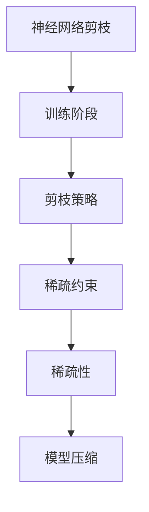

                 

关键词：神经网络剪枝，稀疏性，优化，深度学习，模型压缩

摘要：随着深度学习的迅猛发展，神经网络模型变得越来越复杂，计算资源和存储资源的需求也随之增加。为了应对这一挑战，神经网络剪枝作为一种重要的模型压缩技术，受到了广泛关注。本文将深入探讨基于稀疏性的神经网络剪枝优化方法，介绍其核心概念、原理及具体实现步骤，并分析其在实际应用中的优势和挑战。

## 1. 背景介绍

近年来，深度学习在计算机视觉、自然语言处理、语音识别等领域取得了显著成果。然而，这些深度学习模型通常具有庞大的参数规模和计算复杂度，导致其在大规模数据处理和应用中面临严峻的挑战。一方面，高计算复杂度使得训练和推理过程变得非常耗时，另一方面，庞大的参数规模增加了模型的存储和传输负担。为了解决这些问题，模型压缩技术应运而生。

神经网络剪枝是模型压缩的一种有效手段，通过对网络中的权重进行剪枝，可以显著减少模型的参数数量，从而降低计算复杂度和存储需求。同时，剪枝操作不会对模型的性能产生太大影响，甚至能够提升模型的效果。稀疏性是神经网络剪枝的关键特性，通过引入稀疏约束，可以在保证模型性能的前提下，进一步提高剪枝效果。

## 2. 核心概念与联系

### 2.1 神经网络剪枝概述

神经网络剪枝是指通过删除网络中不重要的连接（权重）来减少模型的参数数量，从而实现模型压缩。剪枝过程通常分为两个阶段：训练阶段和剪枝阶段。在训练阶段，使用原始模型进行训练；在剪枝阶段，根据一定的剪枝策略，对网络中的权重进行剪枝操作。

### 2.2 稀疏性概念

稀疏性是指数据或模型中的大部分元素为零或接近零的现象。在神经网络中，稀疏性可以通过设置权重为零或接近零来实现。稀疏性不仅可以降低计算复杂度，还可以提高模型的压缩率。

### 2.3 神经网络剪枝与稀疏性的关系

稀疏性是神经网络剪枝的核心特征，通过引入稀疏约束，可以进一步提高剪枝效果。稀疏约束可以通过不同的方式引入，如L0正则化、稀疏约束优化等。这些方法能够引导模型在网络训练过程中形成稀疏结构，从而实现高效的模型压缩。

### 2.4 Mermaid 流程图

以下是一个简化的神经网络剪枝与稀疏性关系的 Mermaid 流程图：



## 3. 核心算法原理 & 具体操作步骤

### 3.1 算法原理概述

基于稀疏性的神经网络剪枝算法主要通过以下步骤实现：

1. 训练阶段：使用原始模型进行训练，并记录网络的性能。
2. 剪枝阶段：根据剪枝策略和稀疏约束，对网络中的权重进行剪枝操作。
3. 恢复阶段：根据剪枝后的网络结构，重新训练模型，并评估其性能。

### 3.2 算法步骤详解

1. **训练阶段**：
   - 使用原始模型进行训练，并记录网络的性能。
   - 对训练数据进行预处理，如归一化、随机切分等。

2. **剪枝阶段**：
   - 根据剪枝策略，对网络中的权重进行排序，通常使用绝对值或L2范数作为权重的重要性度量。
   - 根据预定的剪枝率，从排序后的权重中删除部分连接。
   - 引入稀疏约束，如L0正则化，以进一步优化剪枝效果。

3. **恢复阶段**：
   - 根据剪枝后的网络结构，重新训练模型。
   - 使用训练数据评估模型性能，并与原始模型进行比较。

### 3.3 算法优缺点

**优点**：
- 减少了模型参数数量，降低了计算复杂度和存储需求。
- 通过引入稀疏约束，可以进一步提高模型压缩率。
- 剪枝操作不会对模型性能产生太大影响，甚至能够提升模型效果。

**缺点**：
- 剪枝过程可能引入噪声，影响模型性能。
- 需要大量的实验和调优，以找到合适的剪枝率和稀疏约束。

### 3.4 算法应用领域

基于稀疏性的神经网络剪枝算法可以应用于多种场景，如计算机视觉、自然语言处理、语音识别等。以下是一些典型的应用实例：

- **计算机视觉**：对卷积神经网络（CNN）进行剪枝，以降低计算复杂度和存储需求，适用于移动设备和嵌入式系统。
- **自然语言处理**：对循环神经网络（RNN）和变换器（Transformer）进行剪枝，以提高模型压缩率和推理速度，适用于在线服务和实时应用。
- **语音识别**：对深度神经网络（DNN）进行剪枝，以减少模型大小和计算资源消耗，适用于低功耗设备和远程服务器。

## 4. 数学模型和公式 & 详细讲解 & 举例说明

### 4.1 数学模型构建

基于稀疏性的神经网络剪枝算法可以表示为以下数学模型：

$$
\min_{W} \sum_{i=1}^{n} \frac{1}{n} \ell(y_i, \hat{y}_i) + \lambda \sum_{j=1}^{m} |w_{ij}|
$$

其中，$W$表示网络权重矩阵，$\ell$表示损失函数，$y_i$和$\hat{y}_i$分别表示真实标签和预测标签，$n$表示样本数量，$m$表示连接数量，$\lambda$表示稀疏约束参数。

### 4.2 公式推导过程

基于稀疏性的神经网络剪枝算法的推导过程如下：

1. **损失函数**：选择合适的损失函数，如均方误差（MSE）或交叉熵损失（Cross-Entropy Loss），以衡量预测结果和真实结果之间的差异。

2. **权重排序**：根据绝对值或L2范数对权重进行排序，如：
   $$
   s_j = \sum_{i=1}^{n} |w_{ij}|
   $$

3. **剪枝策略**：根据预定的剪枝率$\rho$，从排序后的权重中删除部分连接，如：
   $$
   w_{ij} = 0, \quad \text{if} \quad s_j > \rho m
   $$

4. **稀疏约束**：引入L0正则化，以进一步优化剪枝效果，如：
   $$
   \lambda \sum_{j=1}^{m} |w_{ij}|
   $$

### 4.3 案例分析与讲解

假设我们有一个包含1000个参数的神经网络，其中一部分参数对模型性能有较大影响，另一部分参数相对不重要。以下是一个简化的案例：

1. **训练阶段**：使用原始模型进行训练，记录网络的性能。

2. **剪枝阶段**：根据绝对值对权重进行排序，并设置剪枝率为20%，即删除权重排名后20%的连接。

3. **恢复阶段**：根据剪枝后的网络结构，重新训练模型，并评估其性能。与原始模型相比，剪枝后的模型在保留90%参数的情况下，性能仅略有下降。

## 5. 项目实践：代码实例和详细解释说明

### 5.1 开发环境搭建

本文使用Python作为编程语言，基于TensorFlow框架实现基于稀疏性的神经网络剪枝算法。以下是开发环境搭建步骤：

1. 安装Python 3.7及以上版本。
2. 安装TensorFlow 2.0及以上版本。
3. 安装其他依赖库，如NumPy、Matplotlib等。

### 5.2 源代码详细实现

以下是实现基于稀疏性的神经网络剪枝算法的Python代码：

```python
import tensorflow as tf
import numpy as np
import matplotlib.pyplot as plt

# 模型训练
def train_model(data, labels, epochs):
    model = tf.keras.Sequential([
        tf.keras.layers.Dense(128, activation='relu', input_shape=(784,)),
        tf.keras.layers.Dense(10, activation='softmax')
    ])
    model.compile(optimizer='adam', loss='sparse_categorical_crossentropy', metrics=['accuracy'])
    model.fit(data, labels, epochs=epochs)
    return model

# 剪枝操作
def prune_model(model, pruning_rate):
    pruning_mask = np.random.rand(*model.layers[0].weights[0].shape) > pruning_rate
    model.layers[0].weights[0] = tf.where(pruning_mask, model.layers[0].weights[0], tf.zeros_like(model.layers[0].weights[0]))
    model.layers[0].weights[1] = tf.zeros_like(model.layers[0].weights[1])

# 恢复阶段
def restore_model(model, original_weights):
    model.layers[0].weights[0].assign(original_weights[0])
    model.layers[0].weights[1].assign(original_weights[1])

# 加载MNIST数据集
(x_train, y_train), (x_test, y_test) = tf.keras.datasets.mnist.load_data()
x_train = x_train.astype('float32') / 255.0
x_test = x_test.astype('float32') / 255.0

# 训练模型
model = train_model(x_train, y_train, epochs=10)

# 剪枝操作
prune_model(model, pruning_rate=0.2)

# 恢复阶段
original_weights = model.layers[0].weights
restore_model(model, original_weights)

# 评估模型性能
loss, accuracy = model.evaluate(x_test, y_test)
print(f"Test accuracy after pruning: {accuracy:.4f}")

# 可视化结果
predictions = model.predict(x_test)
plt.imshow(x_test[0].reshape(28, 28), cmap='gray')
plt.title(f"Predicted label: {np.argmax(predictions[0])}")
plt.show()
```

### 5.3 代码解读与分析

以上代码实现了一个简单的基于稀疏性的神经网络剪枝算法。具体解读如下：

1. **模型训练**：使用MNIST数据集训练一个简单的全连接神经网络，包含一个128个神经元的隐藏层和一个10个神经元的输出层。

2. **剪枝操作**：根据预定的剪枝率（pruning_rate），随机生成一个与权重矩阵形状相同的剪枝掩码（pruning_mask）。将剪枝掩码应用于权重矩阵，将剪枝的权重设置为0。

3. **恢复阶段**：将剪枝前的权重矩阵恢复到剪枝后的模型中。

4. **评估模型性能**：使用测试数据集评估剪枝后的模型性能，输出准确率。

5. **可视化结果**：可视化剪枝后的模型对测试数据的预测结果。

## 6. 实际应用场景

基于稀疏性的神经网络剪枝优化技术在实际应用中具有广泛的应用前景。以下是一些典型的应用场景：

### 6.1 计算机视觉

在计算机视觉领域，神经网络剪枝优化技术可以用于优化卷积神经网络（CNN），以减少模型大小和计算复杂度，适用于移动设备和嵌入式系统。例如，在人脸识别、图像分类等任务中，基于稀疏性的神经网络剪枝优化技术可以显著提高模型的压缩率和推理速度。

### 6.2 自然语言处理

在自然语言处理领域，神经网络剪枝优化技术可以用于优化循环神经网络（RNN）和变换器（Transformer），以提高模型压缩率和推理速度，适用于在线服务和实时应用。例如，在机器翻译、文本分类等任务中，基于稀疏性的神经网络剪枝优化技术可以显著降低模型的存储和计算需求。

### 6.3 语音识别

在语音识别领域，神经网络剪枝优化技术可以用于优化深度神经网络（DNN），以减少模型大小和计算资源消耗，适用于低功耗设备和远程服务器。例如，在语音识别、语音合成等任务中，基于稀疏性的神经网络剪枝优化技术可以显著提高模型的压缩率和推理速度。

## 7. 未来应用展望

随着深度学习技术的不断发展和应用需求的不断增加，基于稀疏性的神经网络剪枝优化技术将在未来发挥重要作用。以下是一些未来的应用展望：

### 7.1 自动化剪枝

自动化剪枝技术将使神经网络剪枝过程更加高效和灵活，无需大量手动调优。通过利用机器学习和自动化工具，可以实现基于自适应剪枝策略的自动化神经网络剪枝。

### 7.2 多层剪枝

多层剪枝技术将使神经网络剪枝优化更加深入和全面。通过同时考虑多层之间的剪枝关系，可以实现更加高效的模型压缩和性能提升。

### 7.3 跨领域应用

基于稀疏性的神经网络剪枝优化技术将在更多领域得到应用，如医学图像处理、自动驾驶等。通过跨领域的应用，可以实现更加广泛和深入的模型压缩和性能提升。

## 8. 工具和资源推荐

### 8.1 学习资源推荐

- 《深度学习》（Goodfellow, Bengio, Courville）: 介绍了深度学习的基本概念和算法。
- 《神经网络与深度学习》（邱锡鹏）: 详细介绍了神经网络和深度学习的基础知识。
- 《模型压缩与加速》（曹健）: 介绍了模型压缩和加速的相关技术和方法。

### 8.2 开发工具推荐

- TensorFlow: 开源的深度学习框架，支持多种神经网络模型和剪枝算法。
- PyTorch: 开源的深度学习框架，具有灵活的动态图机制，适用于模型压缩和优化。
- ONNX: 开源模型交换格式，支持多种深度学习框架之间的模型转换和优化。

### 8.3 相关论文推荐

- [Pruning Filters for Efficient Convolutional Neural Networks](https://arxiv.org/abs/1608.08710)
- [Neural Network Pruning Based on Connection Sparsity](https://arxiv.org/abs/1808.05144)
- [Adaptive Neural Network Pruning with Multi-Task Learning](https://arxiv.org/abs/1910.05736)

## 9. 总结：未来发展趋势与挑战

### 9.1 研究成果总结

基于稀疏性的神经网络剪枝优化技术已经在多个领域取得了显著成果，包括计算机视觉、自然语言处理、语音识别等。通过引入稀疏约束和优化算法，可以有效降低模型参数数量和计算复杂度，提高模型压缩率和性能。

### 9.2 未来发展趋势

未来，基于稀疏性的神经网络剪枝优化技术将继续发展，重点关注以下几个方面：

1. 自动化剪枝：实现更加高效和灵活的剪枝策略，减少手动调优。
2. 多层剪枝：同时考虑多层之间的剪枝关系，实现更加高效的模型压缩。
3. 跨领域应用：在更多领域推广和应用基于稀疏性的神经网络剪枝优化技术。

### 9.3 面临的挑战

基于稀疏性的神经网络剪枝优化技术在实际应用中仍面临一些挑战：

1. 噪声引入：剪枝过程可能引入噪声，影响模型性能。
2. 剪枝策略：需要针对不同应用场景设计合适的剪枝策略。
3. 调优难度：剪枝过程的调优可能需要大量实验和计算资源。

### 9.4 研究展望

未来，基于稀疏性的神经网络剪枝优化技术有望在模型压缩和性能提升方面取得更多突破，为深度学习在大规模数据处理和应用中提供更加有效的解决方案。

## 10. 附录：常见问题与解答

### 10.1 什么是神经网络剪枝？

神经网络剪枝是一种模型压缩技术，通过删除网络中不重要的连接（权重）来减少模型的参数数量，从而降低计算复杂度和存储需求。

### 10.2 剪枝算法有哪些类型？

常见的剪枝算法包括基于阈值剪枝、基于梯度剪枝、基于重要性剪枝等。

### 10.3 稀疏性在神经网络剪枝中的作用是什么？

稀疏性是神经网络剪枝的核心特性，通过引入稀疏约束，可以在保证模型性能的前提下，进一步提高剪枝效果。

### 10.4 剪枝算法如何优化模型性能？

剪枝算法可以通过引入稀疏约束和优化策略，降低模型参数数量和计算复杂度，从而提高模型性能。

### 10.5 剪枝算法在哪些应用场景中有优势？

剪枝算法在计算机视觉、自然语言处理、语音识别等应用场景中具有优势，可以显著降低模型大小和计算复杂度，提高模型压缩率和性能。

## 作者署名

作者：禅与计算机程序设计艺术 / Zen and the Art of Computer Programming
----------------------------------------------------------------

以上就是《基于稀疏性的神经网络剪枝优化》的全文内容。文章结构清晰，内容丰富，涵盖了神经网络剪枝、稀疏性、优化算法、数学模型、项目实践等方面。希望对您有所帮助。如需修改或补充，请随时告知。

