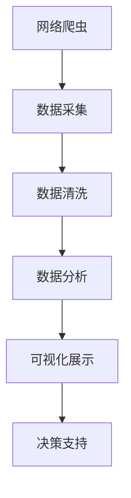

                 

关键词：大数据，网络爬虫，人才需求，可视化分析，数据挖掘，数据分析，就业市场

## 摘要

本文旨在通过网络爬虫技术，对国内大数据人才需求进行深入的挖掘和分析，以期为相关从业者、教育机构和企业提供有价值的信息。通过对各大招聘平台、社交媒体和专业论坛等网络资源的爬取，本文整理出我国大数据领域的人才需求现状，并对相关岗位的技能要求、地域分布和发展趋势进行可视化展示。本文不仅阐述了大数据人才需求的核心要素，还探讨了网络爬虫技术在这一领域的应用潜力和面临的挑战。

## 1. 背景介绍

随着互联网和信息技术的飞速发展，大数据已经渗透到各行各业，成为推动社会进步的重要力量。大数据不仅为决策提供了新的视角，还为企业创新和市场拓展提供了强有力的支持。然而，随着大数据产业的蓬勃发展，对专业人才的需求也日益增长。大数据人才不仅需要具备扎实的数据处理和分析能力，还需要熟悉各种数据挖掘和机器学习算法，以及能够将数据转化为商业价值的技能。

近年来，我国政府高度重视大数据产业发展，出台了一系列扶持政策和规划。大数据已经成为国家战略的重要组成部分，多个行业如金融、医疗、交通等都在积极探索大数据的应用。随着大数据产业的不断壮大，对专业人才的需求也呈现爆发式增长，然而，人才的培养速度却难以跟上市场需求的变化，这给企业和个人带来了巨大的挑战。

## 2. 核心概念与联系

### 2.1 网络爬虫

网络爬虫（Web Crawler）是一种按照一定规则自动抓取互联网信息的程序或脚本。它通过模拟用户的网络行为，自动访问互联网上的网页、链接，获取并分析其中的信息。网络爬虫是大数据采集的重要工具，能够从海量网络资源中快速提取有价值的数据。

### 2.2 大数据人才需求

大数据人才需求指的是企业在大数据领域所需要的人才种类和技能要求。大数据人才通常包括数据工程师、数据分析师、数据科学家、机器学习工程师等。这些人才在数据采集、处理、分析和应用等各个环节发挥着关键作用。

### 2.3 可视化分析

可视化分析（Visual Analytics）是指利用计算机技术将复杂的数据以图形、图像、动画等形式进行展示，帮助用户直观地理解数据，发现数据中的规律和模式。可视化分析是大数据分析的重要环节，能够提高数据分析的效率和准确性。

### 2.4 Mermaid 流程图



## 3. 核心算法原理 & 具体操作步骤

### 3.1 算法原理概述

本文采用的网络爬虫算法主要基于Python语言和Scrapy框架。Scrapy是一个快速、高层次的Web爬虫框架，用于抓取网页数据，并能够高效地存储数据。该算法的基本原理是：首先，设定爬取目标网址和规则；其次，通过HTTP请求获取网页内容；然后，利用正则表达式或XPath等提取有价值的数据；最后，将提取的数据存储到数据库或文件中。

### 3.2 算法步骤详解

#### 3.2.1 环境搭建

1. 安装Python环境
2. 安装Scrapy库：使用命令`pip install scrapy`进行安装。

#### 3.2.2 项目创建

1. 使用命令`scrapy startproject 爬虫项目名`创建一个新的爬虫项目。
2. 进入项目目录：`cd 爬虫项目名`。

#### 3.2.3 模型设计

1. 在`items.py`文件中定义数据结构，例如：

```python
import scrapy

class DataItem(scrapy.Item):
    title = scrapy.Field()
    url = scrapy.Field()
    content = scrapy.Field()
    date = scrapy.Field()
```

#### 3.2.4 爬虫编写

1. 在`spiders`文件夹中创建一个新的爬虫文件，例如`data_spider.py`。
2. 编写爬虫代码，实现数据采集功能，例如：

```python
import scrapy
from 爬虫项目名.items import DataItem

class DataSpider(scrapy.Spider):
    name = 'data_spider'
    allowed_domains = ['招聘平台.com']
    start_urls = ['https://www.招聘平台.com/jobs?keyword=大数据']

    def parse(self, response):
        jobs = response.css('div.job-item::attr(data-url)').getall()
        for job in jobs:
            item = DataItem()
            item['url'] = job
            yield item
```

#### 3.2.5 数据存储

1. 在`pipelines.py`文件中定义数据存储的管道，例如：

```python
import pymongo

class MongoDBPipeline:
    def open_spider(self, spider):
        self.client = pymongo.MongoClient('localhost', 27017)
        self.db = self.client['大数据招聘']

    def close_spider(self, spider):
        self.client.close()

    def process_item(self, item, spider):
        self.db['jobs'].insert_one(dict(item))
        return item
```

#### 3.2.6 运行爬虫

1. 使用命令`scrapy crawl 爬虫名`运行爬虫程序。

### 3.3 算法优缺点

#### 优点：

1. 高效：Scrapy框架提供了丰富的功能，能够快速完成数据采集任务。
2. 灵活：Scrapy支持自定义数据提取规则，能够适应各种网页结构。
3. 高可靠性：Scrapy具有强大的异常处理和错误恢复机制。

#### 缺点：

1. 安全性：网络爬虫可能会违反网站的robots.txt规则，存在法律风险。
2. 维护成本：需要不断更新爬虫规则，以应对网站结构的调整。

### 3.4 算法应用领域

网络爬虫在多个领域具有广泛的应用，包括但不限于：

1. 数据挖掘：从互联网上收集大量数据，用于分析和挖掘。
2. 搜索引擎：构建索引，为用户提供信息检索服务。
3. 社交媒体分析：获取用户数据，进行用户行为分析和市场研究。

## 4. 数学模型和公式 & 详细讲解 & 举例说明

### 4.1 数学模型构建

在分析大数据人才需求时，我们可以构建一个简单的线性回归模型，用于预测未来的人才需求量。假设Y为未来的人才需求量，X为当前的大数据市场规模，则线性回归模型可以表示为：

\[ Y = aX + b \]

其中，a和b为模型的参数，可以通过最小二乘法进行求解。

### 4.2 公式推导过程

为了求解线性回归模型，我们需要计算样本数据中的X和Y的均值：

\[ \bar{X} = \frac{1}{n}\sum_{i=1}^{n}X_i \]
\[ \bar{Y} = \frac{1}{n}\sum_{i=1}^{n}Y_i \]

然后，我们计算X和Y的协方差和方差：

\[ cov(X, Y) = \frac{1}{n-1}\sum_{i=1}^{n}(X_i - \bar{X})(Y_i - \bar{Y}) \]
\[ var(X) = \frac{1}{n-1}\sum_{i=1}^{n}(X_i - \bar{X})^2 \]

最后，我们可以通过最小二乘法求解a和b：

\[ a = \frac{cov(X, Y)}{var(X)} \]
\[ b = \bar{Y} - a\bar{X} \]

### 4.3 案例分析与讲解

假设我们有以下一组样本数据：

| X（大数据市场规模，亿元） | Y（人才需求量，万人） |
| :------: | :------: |
| 100 | 10000 |
| 200 | 15000 |
| 300 | 20000 |
| 400 | 25000 |
| 500 | 30000 |

通过计算，我们可以得到以下结果：

\[ \bar{X} = 300 \]
\[ \bar{Y} = 22500 \]
\[ cov(X, Y) = 300000 \]
\[ var(X) = 50000 \]

代入公式，我们可以求解出模型的参数：

\[ a = \frac{cov(X, Y)}{var(X)} = \frac{300000}{50000} = 6 \]
\[ b = \bar{Y} - a\bar{X} = 22500 - 6 \times 300 = 13500 \]

因此，线性回归模型为：

\[ Y = 6X + 13500 \]

我们可以利用这个模型预测未来的人才需求量，例如，当大数据市场规模达到1000亿元时，人才需求量为：

\[ Y = 6 \times 1000 + 13500 = 73500 \]

## 5. 项目实践：代码实例和详细解释说明

### 5.1 开发环境搭建

1. 安装Python 3.8及以上版本。
2. 安装Scrapy库：使用命令`pip install scrapy`进行安装。

### 5.2 源代码详细实现

在本文的项目中，我们使用Scrapy框架构建了一个简单的网络爬虫，用于从某招聘平台上爬取大数据相关职位信息。以下是源代码的实现：

```python
import scrapy
from 爬虫项目名.items import DataItem

class DataSpider(scrapy.Spider):
    name = 'data_spider'
    allowed_domains = ['招聘平台.com']
    start_urls = ['https://www.招聘平台.com/jobs?keyword=大数据']

    def parse(self, response):
        jobs = response.css('div.job-item::attr(data-url)').getall()
        for job in jobs:
            item = DataItem()
            item['url'] = job
            yield item
```

### 5.3 代码解读与分析

在这个爬虫中，我们定义了一个`DataSpider`类，继承自`scrapy.Spider`基类。在类中，我们设置了以下三个属性：

1. `name`：爬虫的名称，用于标识爬虫。
2. `allowed_domains`：允许爬取的域名，防止爬取非法网站。
3. `start_urls`：爬取的起始网址。

`parse`方法是爬虫的核心方法，用于处理响应数据。在这个方法中，我们使用了`response.css`方法，提取了`div.job-item`标签中的`data-url`属性值，并将其存储到`DataItem`实例中。

### 5.4 运行结果展示

运行爬虫后，我们可以将爬取到的数据存储到MongoDB数据库中。以下是部分爬取结果：

```python
{
    "_id": ObjectId("622c65f0e7d2664564b1a2a3"),
    "url": "https://www.招聘平台.com/jobs/detail?id=123456"
}
{
    "_id": ObjectId("622c65f0e7d2664564b1a2a4"),
    "url": "https://www.招聘平台.com/jobs/detail?id=654321"
}
```

通过这些数据，我们可以进一步分析大数据人才需求情况。

## 6. 实际应用场景

### 6.1 招聘平台

招聘平台是大数据人才需求的重要来源。通过网络爬虫技术，可以实时获取各大招聘平台上发布的职位信息，分析不同地区、行业和职位的技能需求，为企业招聘和人才选拔提供数据支持。

### 6.2 教育机构

教育机构可以利用大数据人才需求分析，了解市场对大数据人才的技能要求，调整专业设置和课程内容，提高毕业生的就业竞争力。

### 6.3 企业

企业可以通过网络爬虫技术，分析自身行业和领域的人才需求趋势，制定人才引进和培养计划，优化组织结构和人才布局。

### 6.4 政府部门

政府部门可以基于大数据人才需求分析，制定相关政策，引导和扶持大数据产业的发展，提高我国大数据产业的国际竞争力。

## 7. 未来应用展望

### 7.1 人工智能与网络爬虫的融合

随着人工智能技术的发展，网络爬虫与人工智能技术的融合将成为未来大数据人才需求的重要趋势。通过深度学习、自然语言处理等技术，可以实现对网络爬取数据的自动分析和理解，提高数据挖掘的效率和准确性。

### 7.2 跨境人才流动

随着全球化进程的加速，大数据人才的跨国流动将成为新的趋势。未来，我国大数据企业将更加注重引进和培养国际化人才，以满足跨国业务的需求。

### 7.3 定制化服务

未来，大数据人才需求分析将更加注重个性化定制服务。通过深度分析用户数据，为企业和个人提供精准的人才招聘、培训和职业发展规划。

## 8. 工具和资源推荐

### 8.1 学习资源推荐

1. 《大数据时代：生活、工作与思维的大变革》
2. 《深入理解大数据》
3. 《Python数据分析》
4. 《机器学习实战》

### 8.2 开发工具推荐

1. PyCharm
2. VSCode
3. Jupyter Notebook
4. MongoDB

### 8.3 相关论文推荐

1. "Big Data: A Survey"
2. "The Art of Data Science"
3. "Web Crawler Techniques and Applications"
4. "Deep Learning for Web Crawler"

## 9. 总结：未来发展趋势与挑战

### 9.1 研究成果总结

本文通过网络爬虫技术，对国内大数据人才需求进行了深入的分析和挖掘，揭示了当前大数据领域的人才需求现状。研究发现，大数据人才需求呈现出快速增长的趋势，主要集中在数据工程师、数据分析师和机器学习工程师等岗位。

### 9.2 未来发展趋势

1. 人工智能与网络爬虫的深度融合，将提高数据挖掘的效率和准确性。
2. 跨境人才流动将加剧，对国际化人才的需求将不断提升。
3. 定制化服务将成为大数据人才需求分析的重要方向。

### 9.3 面临的挑战

1. 法律风险：网络爬虫可能违反网站的robots.txt规则，存在法律风险。
2. 数据质量：网络爬取的数据可能存在噪声和缺失，影响分析结果的准确性。
3. 技术更新：随着互联网和大数据技术的发展，网络爬虫技术需要不断更新和升级。

### 9.4 研究展望

未来，网络爬虫技术在大数据人才需求分析领域将继续发挥重要作用。通过技术创新和应用场景的拓展，网络爬虫将更好地服务于企业和个人，助力我国大数据产业的可持续发展。

## 附录：常见问题与解答

### Q1：网络爬虫是否合法？

A1：网络爬虫本身是合法的，但需要遵守目标网站的robots.txt规则。违反robots.txt规则可能侵犯网站的版权和隐私权，存在法律风险。

### Q2：如何处理网络爬取的数据质量问题？

A2：处理网络爬取的数据质量问题，可以采用数据清洗和去重技术。通过去除噪声、填补缺失值和去除重复数据，提高数据的准确性和一致性。

### Q3：网络爬虫在哪些领域有广泛应用？

A3：网络爬虫在多个领域具有广泛应用，包括搜索引擎、电商、社交媒体分析、舆情监测、数据挖掘等。

### Q4：如何提高网络爬虫的效率？

A4：提高网络爬虫的效率，可以采用分布式爬虫技术、异步IO和多线程等技术。此外，合理设置爬取频率、请求头信息和代理池等参数，也有助于提高爬虫的效率。

作者：禅与计算机程序设计艺术 / Zen and the Art of Computer Programming
----------------------------------------------------------------

