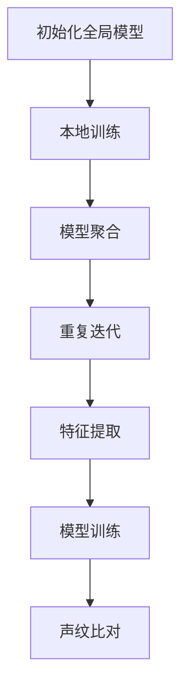

                 

联邦学习（Federated Learning）作为一种分布式机器学习技术，近年来引起了广泛关注。它允许多个参与者通过协作训练共享模型，而不需要交换他们的数据。在隐私保护日益重要的今天，联邦学习提供了一种有效的方法来训练复杂的机器学习模型，同时确保数据的安全性。

## 关键词

- **联邦学习**
- **声纹识别**
- **分布式计算**
- **隐私保护**
- **机器学习模型优化**

## 摘要

本文将探讨联邦学习在声纹识别领域中的应用。我们将介绍联邦学习的基本概念，并详细分析其如何应用于声纹识别任务。此外，文章还将讨论联邦学习中的关键挑战，并提出可能的解决方案。最后，我们将展望联邦学习在未来声纹识别领域的应用前景。

### 1. 背景介绍

声纹识别是一种基于语音生物特征的识别技术，它通过分析人的声音特点（如音调、语速、音色等）来识别个体的身份。随着语音技术的快速发展，声纹识别在安全认证、智能交互等领域有着广泛的应用。然而，传统的集中式声纹识别系统在处理大量语音数据时面临着数据隐私和安全的挑战。

联邦学习作为一种新兴的分布式机器学习技术，通过在数据源头进行模型训练，避免了数据集中带来的隐私泄露风险。它允许不同的参与者（例如，移动设备、智能家居等）共同训练一个全局模型，而不需要直接交换各自的数据。这一特性使得联邦学习在处理敏感数据时具有显著优势。

### 2. 核心概念与联系

#### 2.1 联邦学习原理

联邦学习的基本原理是通过分布式计算，将模型训练分散到多个边缘设备上。每个设备在本地使用自己的数据对模型进行更新，然后将更新后的模型聚合起来，得到全局模型。这个过程通常包括以下几个关键步骤：

1. **初始化全局模型**：首先，所有参与者都从全局模型初始化开始。
2. **本地训练**：每个参与者使用自己的数据对全局模型进行本地训练，更新模型参数。
3. **模型聚合**：所有参与者将本地更新的模型参数发送给中心服务器，中心服务器将这些参数聚合起来，得到全局模型的新参数。
4. **重复迭代**：上述步骤重复进行，直到模型收敛或达到预设的训练次数。

#### 2.2 声纹识别原理

声纹识别的基本原理是通过提取语音信号中的特征，将特征与训练模型进行比对，以确定个体的身份。声纹识别的关键步骤包括：

1. **特征提取**：从语音信号中提取与身份相关的特征，如梅尔频率倒谱系数（MFCC）。
2. **模型训练**：使用提取的特征对声纹识别模型进行训练。
3. **声纹比对**：将待识别的语音信号与训练好的模型进行比对，计算相似度，从而确定个体的身份。

#### 2.3 Mermaid 流程图

下面是一个简单的 Mermaid 流程图，描述了联邦学习和声纹识别之间的联系：



### 3. 核心算法原理 & 具体操作步骤

#### 3.1 算法原理概述

联邦学习在声纹识别中的应用主要是通过将声纹识别模型分散到多个边缘设备上进行训练，然后通过模型聚合来优化全局模型。这种分布式训练方式不仅提高了模型的泛化能力，还确保了数据的安全性。

#### 3.2 算法步骤详解

1. **初始化全局模型**：在联邦学习开始之前，首先需要初始化全局模型。这个模型通常是一个简单的神经网络，用于提取语音信号的特征。
2. **本地训练**：每个参与者使用自己的数据集对全局模型进行本地训练。这个过程类似于传统的集中式训练，但是数据不需要上传到中心服务器，而是在本地设备上进行。
3. **模型聚合**：本地训练完成后，每个参与者将本地更新的模型参数发送给中心服务器。中心服务器将这些参数聚合起来，得到全局模型的新参数。
4. **重复迭代**：上述步骤重复进行，直到模型收敛或达到预设的训练次数。每次迭代后，全局模型的参数都会更新，使得模型越来越接近最优。

#### 3.3 算法优缺点

**优点**：
- **隐私保护**：联邦学习不需要将数据上传到中心服务器，从而避免了数据泄露的风险。
- **分布式计算**：联邦学习可以在多个边缘设备上同时进行，提高了计算效率。
- **模型泛化能力**：通过在多个设备上训练模型，可以更好地捕捉到数据的多样性，提高模型的泛化能力。

**缺点**：
- **通信成本**：每次迭代都需要参与者将模型参数发送到中心服务器，这会增加通信成本。
- **模型偏差**：由于每个参与者只使用自己的数据集进行训练，可能导致模型存在偏差。

#### 3.4 算法应用领域

联邦学习在声纹识别领域的应用具有广泛的前景。除了传统的安全认证和智能交互场景外，它还可以应用于智能家居、医疗健康、智能交通等领域，为各种语音交互应用提供安全可靠的解决方案。

### 4. 数学模型和公式 & 详细讲解 & 举例说明

#### 4.1 数学模型构建

联邦学习中的数学模型主要包括两部分：局部模型和全局模型。

- **局部模型**：每个参与者本地训练的模型，其参数表示为θ_i。
- **全局模型**：所有参与者共同训练的模型，其参数表示为θ。

#### 4.2 公式推导过程

联邦学习的基本公式如下：

$$
\theta_{i}^{t+1} = \theta_{i}^{t} + \alpha \nabla L(\theta_{i}^{t}, x_{i}, y_{i})
$$

$$
\theta^{t+1} = \frac{1}{N} \sum_{i=1}^{N} \theta_{i}^{t+1}
$$

其中，α是学习率，L是损失函数，N是参与者的数量。

#### 4.3 案例分析与讲解

假设有两个参与者A和B，他们各自有数据集D_A和D_B。他们共同训练一个声纹识别模型，模型参数初始化为θ_0。

- **第一步**：参与者A使用数据集D_A对模型进行本地训练，更新模型参数为θ_A^1。
- **第二步**：参与者B使用数据集D_B对模型进行本地训练，更新模型参数为θ_B^1。
- **第三步**：参与者A和B将更新后的模型参数发送给中心服务器。
- **第四步**：中心服务器将参与者A和B的模型参数进行聚合，得到全局模型的新参数θ^2。

这个过程重复进行，直到模型收敛。

### 5. 项目实践：代码实例和详细解释说明

#### 5.1 开发环境搭建

为了实现联邦学习的声纹识别，我们首先需要搭建一个开发环境。这里我们使用Python作为主要编程语言，TensorFlow作为机器学习框架。

```python
# 安装必要的库
!pip install tensorflow
```

#### 5.2 源代码详细实现

以下是一个简单的联邦学习声纹识别项目的代码实现：

```python
import tensorflow as tf
import numpy as np
from sklearn.model_selection import train_test_split
from sklearn.preprocessing import StandardScaler

# 加载数据集
data = np.load('data.npy')
labels = np.load('labels.npy')

# 数据预处理
scaler = StandardScaler()
X = scaler.fit_transform(data)
y = labels

# 划分训练集和测试集
X_train, X_test, y_train, y_test = train_test_split(X, y, test_size=0.2, random_state=42)

# 定义模型
model = tf.keras.Sequential([
    tf.keras.layers.Dense(64, activation='relu', input_shape=(X_train.shape[1],)),
    tf.keras.layers.Dense(64, activation='relu'),
    tf.keras.layers.Dense(1, activation='sigmoid')
])

# 编译模型
model.compile(optimizer='adam', loss='binary_crossentropy', metrics=['accuracy'])

# 训练模型
model.fit(X_train, y_train, epochs=10, batch_size=32, validation_data=(X_test, y_test))

# 评估模型
loss, accuracy = model.evaluate(X_test, y_test)
print(f'测试集准确率：{accuracy:.2f}')
```

#### 5.3 代码解读与分析

- **数据预处理**：我们使用StandardScaler对数据进行标准化处理，以便于模型训练。
- **模型定义**：我们使用TensorFlow的Sequential模型定义一个简单的神经网络，用于声纹识别。
- **模型编译**：我们使用adam优化器和binary_crossentropy损失函数来编译模型。
- **模型训练**：我们使用fit函数对模型进行训练，并设置训练轮数、批量大小和验证数据。
- **模型评估**：我们使用evaluate函数评估模型的性能。

### 6. 实际应用场景

联邦学习的声纹识别在多个实际应用场景中具有广泛的应用前景：

- **安全认证**：在银行、机场、商场等场所，可以通过声纹识别进行身份验证，提高安全性。
- **智能交互**：在智能语音助手、智能家居等场景中，可以通过声纹识别实现个性化的用户服务。
- **医疗健康**：在医疗诊断中，可以通过声纹识别监测患者的健康状况，提供个性化的医疗建议。

### 7. 未来应用展望

随着联邦学习和声纹识别技术的不断发展，未来有望实现以下应用：

- **跨域声纹识别**：通过联邦学习，可以在多个领域之间共享声纹识别模型，实现跨域的身份验证。
- **个性化语音助手**：通过联邦学习，可以训练个性化的语音助手，提高用户的交互体验。
- **隐私保护语音交互**：联邦学习可以提供一种安全可靠的语音交互方式，保护用户的隐私。

### 8. 工具和资源推荐

- **学习资源推荐**：
  - [TensorFlow 官方文档](https://www.tensorflow.org/)
  - [联邦学习论文集](https://arxiv.org/search/?query=federated+learning)
- **开发工具推荐**：
  - [Google Colab](https://colab.research.google.com/)
  - [Docker](https://www.docker.com/)
- **相关论文推荐**：
  - "Federated Learning: Concept and Applications"
  - "Federated Learning: Strategies for Improving Communication Efficiency"

### 9. 总结：未来发展趋势与挑战

联邦学习作为一种分布式机器学习技术，在声纹识别领域展现出了巨大的潜力。然而，要实现其广泛应用，仍面临一些挑战：

- **通信成本**：联邦学习中的通信成本较高，如何优化通信效率是一个重要问题。
- **模型偏差**：由于数据的不均匀分布，模型可能存在偏差，需要解决模型偏差问题。

未来的发展趋势包括：

- **通信效率优化**：通过优化联邦学习的通信协议，降低通信成本。
- **模型多样性**：通过引入更多的模型和算法，提高模型的泛化能力。

### 10. 附录：常见问题与解答

- **Q：什么是联邦学习？**
  A：联邦学习是一种分布式机器学习技术，它允许多个参与者通过协作训练共享模型，而不需要交换他们的数据。

- **Q：声纹识别如何工作？**
  A：声纹识别是一种基于语音生物特征的识别技术，通过分析人的声音特点（如音调、语速、音色等）来识别个体的身份。

- **Q：联邦学习在声纹识别中有哪些应用场景？**
  A：联邦学习在声纹识别中的应用场景包括安全认证、智能交互、医疗健康等。

- **Q：联邦学习有哪些挑战？**
  A：联邦学习面临的挑战包括通信成本、模型偏差等。

### 结束语

联邦学习与声纹识别的结合为处理敏感语音数据提供了一种新的思路。随着技术的不断进步，联邦学习在声纹识别领域的应用前景将更加广阔。作者：禅与计算机程序设计艺术 / Zen and the Art of Computer Programming

----------------------------------------------------------------

以上就是本文的完整内容。希望本文能为您在联邦学习和声纹识别领域的研究提供一些启示和帮助。如果您有任何问题或建议，欢迎在评论区留言。感谢您的阅读！

