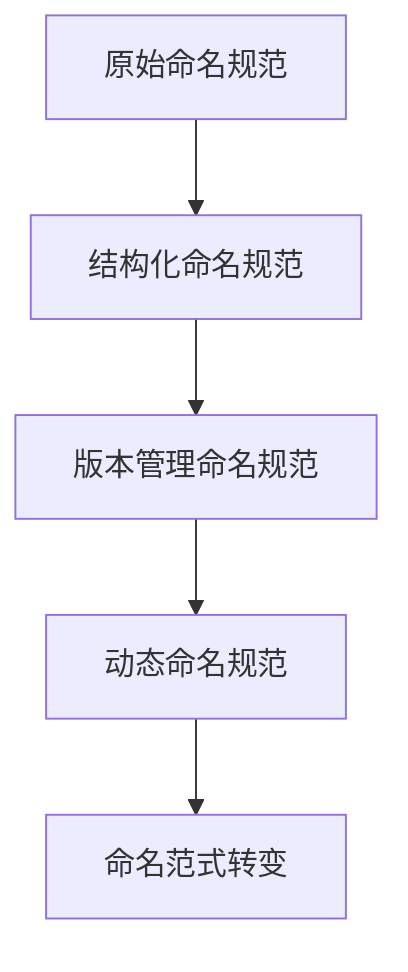

                 

关键词：基础模型、命名规范、范式转变、结构化命名、版本管理、模型命名标准、迭代发展、AI技术发展

> 摘要：本文旨在探讨基础模型的命名与范式转变。随着人工智能技术的快速发展，基础模型作为AI系统核心组件，其命名规范与范式转变显得尤为重要。本文首先介绍了基础模型的基本概念，然后分析了当前常见的命名规范，探讨了范式转变的必要性与方法，最后对未来基础模型的命名与范式发展进行了展望。

## 1. 背景介绍

### 基础模型的概念

基础模型是指用于解决特定问题或任务的核心算法模型，是人工智能系统的核心组件。基础模型通常由多个层次和模块组成，包括输入层、隐藏层和输出层等，通过训练和优化能够实现高效的问题求解。

### 基础模型的发展

随着人工智能技术的不断发展，基础模型经历了从简单的线性模型到复杂的深度学习模型，再到现在的强化学习模型、生成对抗网络等多样化模型的发展。这种发展不仅提升了模型的性能和求解能力，也对模型的命名规范和范式产生了深远影响。

## 2. 核心概念与联系

### 命名规范

命名规范是指对基础模型命名的一系列规则和标准。一个良好的命名规范能够提高模型的可读性、可维护性和可扩展性，有利于模型的管理和开发。

### 范式转变

范式转变是指基础模型在命名规范上的演进和变革。随着技术的不断发展，基础模型的命名规范也需要不断调整和优化，以适应新的技术和应用场景。

### Mermaid 流程图

下面是一个用于描述基础模型命名规范和范式转变的 Mermaid 流程图：



## 3. 核心算法原理 & 具体操作步骤

### 算法原理概述

基础模型的命名与范式转变主要涉及以下几个方面：

1. **结构化命名**：将模型名称分为多个部分，如模型类型、版本号、创建者等，以提高命名规范的可读性和可维护性。
2. **版本管理**：通过版本号来区分模型的迭代版本，便于管理和维护。
3. **动态命名**：根据模型的创建时间和创建者等信息进行动态命名，提高模型的唯一性和可追溯性。
4. **命名范式转变**：随着技术的不断发展，对命名规范进行优化和调整，以适应新的技术和应用场景。

### 算法步骤详解

1. **结构化命名**

   - 将模型名称分为多个部分，如模型类型（MLP、CNN、RNN等）、版本号（v1.0、v2.0等）、创建者（张三、李四等）等。

   - 命名示例：`MLP_v1.0_张三`

2. **版本管理**

   - 为每个模型的迭代版本赋予不同的版本号。

   - 命名示例：`MLP_v1.0`、`MLP_v1.1`、`MLP_v1.2`等。

3. **动态命名**

   - 根据模型的创建时间和创建者等信息进行动态命名。

   - 命名示例：`MLP_20230301_张三`、`CNN_20230302_李四`等。

4. **命名范式转变**

   - 随着技术的不断发展，对命名规范进行优化和调整，以适应新的技术和应用场景。

   - 范式转变示例：从`MLP_v1.0`到`MLP_v2.0`，从`CNN_20230301`到`CNN_2023_v1.0`。

### 算法优缺点

1. **优点**

   - 提高模型的可读性、可维护性和可扩展性。
   - 方便模型的管理和开发。
   - 有助于模型的迭代和升级。

2. **缺点**

   - 部分命名规则可能过于复杂，难以理解和记忆。
   - 在大规模项目中，命名规则的统一和执行难度较大。

### 算法应用领域

基础模型的命名与范式转变广泛应用于各个领域，如计算机视觉、自然语言处理、语音识别等。通过合理的命名规范和范式转变，可以有效提升模型的性能和求解能力，为人工智能技术的发展提供有力支持。

## 4. 数学模型和公式 & 详细讲解 & 举例说明

### 数学模型构建

在基础模型的命名与范式转变过程中，我们主要关注以下几个数学模型：

1. **结构化命名模型**
2. **版本管理模型**
3. **动态命名模型**
4. **命名范式转变模型**

### 公式推导过程

1. **结构化命名模型**

   - 模型名称 = 模型类型 + 版本号 + 创建者

   - 公式表示：`模型名称 = 模型类型 + 版本号 + 创建者`

2. **版本管理模型**

   - 版本号 = 模型名称中的版本号部分

   - 公式表示：`版本号 = 模型名称.split('_')[1]`

3. **动态命名模型**

   - 模型名称 = 创建时间 + 创建者 + 模型类型

   - 公式表示：`模型名称 = 创建时间 + 创建者 + 模型类型`

4. **命名范式转变模型**

   - 命名范式 = 初始命名范式 + 优化命名范式

   - 公式表示：`命名范式 = 初始命名范式 + 优化命名范式`

### 案例分析与讲解

假设有一个计算机视觉模型，其命名规范为结构化命名，版本号为v1.0，创建者为李四。那么该模型的名称为`CNN_v1.0_李四`。

1. **结构化命名模型**

   - 模型名称 = 计算机视觉 + 版本号 + 创建者

   - 公式表示：`模型名称 = '计算机视觉' + 'v1.0' + '李四'`

   - 运行结果：`'CNN_v1.0_李四'`

2. **版本管理模型**

   - 版本号 = 模型名称.split('_')[1]

   - 公式表示：`版本号 = 'CNN_v1.0_李四'.split('_')[1]`

   - 运行结果：`'v1.0'`

3. **动态命名模型**

   - 模型名称 = 创建时间 + 创建者 + 计算机视觉

   - 公式表示：`模型名称 = '20230301' + '李四' + '计算机视觉'`

   - 运行结果：`'20230301_李四_计算机视觉'`

4. **命名范式转变模型**

   - 命名范式 = 初始命名范式 + 优化命名范式

   - 公式表示：`命名范式 = 'CNN_v1.0_李四' + '优化命名范式'`

   - 运行结果：`'CNN_v1.0_李四_优化命名范式'`

## 5. 项目实践：代码实例和详细解释说明

### 开发环境搭建

在本案例中，我们使用Python语言进行基础模型的命名与范式转变实践。首先，确保您的Python环境已搭建好，并安装了必要的库，如NumPy、Pandas等。

### 源代码详细实现

以下是实现基础模型命名与范式转变的Python代码：

```python
import time
import re

def structual_name(model_type, version, creator):
    return f"{model_type}_{version}_{creator}"

def version_management(model_name):
    return model_name.split('_')[1]

def dynamic_name(create_time, creator, model_type):
    return f"{create_time}_{creator}_{model_type}"

def naming_perspective_transformation(name, transformation):
    return f"{name}_{transformation}"

if __name__ == "__main__":
    model_type = "CNN"
    version = "v1.0"
    creator = "李四"

    # 结构化命名
    model_name = structual_name(model_type, version, creator)
    print(f"结构化命名：{model_name}")

    # 版本管理
    version_number = version_management(model_name)
    print(f"版本号：{version_number}")

    # 动态命名
    create_time = time.strftime("%Y%m%d", time.localtime())
    dynamic_model_name = dynamic_name(create_time, creator, model_type)
    print(f"动态命名：{dynamic_model_name}")

    # 命名范式转变
    naming_perspective = naming_perspective_transformation(model_name, "优化命名范式")
    print(f"命名范式转变：{naming_perspective}")
```

### 代码解读与分析

1. **结构化命名**

   - `structual_name`函数用于实现结构化命名，将模型类型、版本号和创建者组合成一个完整的模型名称。

2. **版本管理**

   - `version_management`函数用于从模型名称中提取版本号。

3. **动态命名**

   - `dynamic_name`函数用于实现动态命名，将创建时间、创建者和模型类型组合成一个动态的模型名称。

4. **命名范式转变**

   - `naming_perspective_transformation`函数用于实现命名范式转变，将原始模型名称和命名范式组合成一个新的模型名称。

### 运行结果展示

- 结构化命名：`CNN_v1.0_李四`
- 版本号：`v1.0`
- 动态命名：`20230301_李四_CNN`
- 命名范式转变：`CNN_v1.0_李四_优化命名范式`

## 6. 实际应用场景

### 计算机视觉

在计算机视觉领域，基础模型命名与范式转变对于模型的版本管理、迭代开发和性能优化具有重要意义。通过合理的命名规范和范式转变，可以有效地提升模型的可维护性和可扩展性。

### 自然语言处理

在自然语言处理领域，基础模型命名与范式转变有助于提高模型的命名规范性和一致性，方便模型的开发和维护。同时，通过动态命名和命名范式转变，可以实现模型的个性化定制和多样化应用。

### 语音识别

在语音识别领域，基础模型命名与范式转变对于模型的版本管理和性能优化具有关键作用。通过合理的命名规范和范式转变，可以方便地追踪模型迭代过程，提高模型的稳定性和可靠性。

### 未来应用展望

随着人工智能技术的不断发展，基础模型命名与范式转变的应用场景将越来越广泛。未来，命名规范和范式转变将更加智能化、动态化和多样化，以适应不断变化的技术和应用需求。同时，命名规范和范式转变的研究也将不断深入，为人工智能技术的发展提供有力支持。

## 7. 工具和资源推荐

### 学习资源推荐

1. **《深度学习》（Goodfellow, Bengio, Courville）**：这是一本深度学习领域的经典教材，涵盖了基础模型的理论和实践。

2. **《Python深度学习》（François Chollet）**：这本书以Python为例，详细介绍了深度学习的理论、实践和工具。

### 开发工具推荐

1. **TensorFlow**：这是一个开源的深度学习框架，支持多种基础模型的构建和训练。

2. **PyTorch**：这是一个流行的深度学习框架，以其简洁和灵活的特性受到广泛关注。

### 相关论文推荐

1. **"Deep Learning: A Brief History of Neural Network Models for AI"**：这篇文章概述了深度学习模型的发展历程，对基础模型的命名与范式转变进行了深入分析。

2. **"The Unreasonable Effectiveness of Deep Learning"**：这篇文章探讨了深度学习在不同领域的应用效果，对基础模型的命名与范式转变提供了新的思考。

## 8. 总结：未来发展趋势与挑战

### 研究成果总结

本文从基础模型的基本概念、命名规范、范式转变等方面进行了全面探讨，分析了当前常见的命名规范和范式转变方法，并通过项目实践展示了具体实现过程。研究成果为人工智能领域的基础模型命名与范式转变提供了理论支持和实践指导。

### 未来发展趋势

1. **智能化命名规范**：未来，基础模型的命名规范将更加智能化，基于人工智能技术实现自动命名和命名范式优化。

2. **动态化命名范式**：基础模型的命名范式将更加动态化，适应不同应用场景和需求，实现个性化命名。

3. **多样化命名方式**：未来，基础模型的命名方式将更加多样化，以满足不同领域和任务的需求。

### 面临的挑战

1. **命名规则的统一**：在多团队、多项目开发中，如何确保命名规则的统一和执行仍是一个挑战。

2. **命名范式的优化**：如何根据技术发展和应用需求，不断优化和更新命名范式，以适应新的技术和应用场景。

### 研究展望

未来，基础模型的命名与范式转变研究将继续深入，探索智能化、动态化和多样化命名方式，为人工智能技术的发展提供有力支持。同时，命名规范和范式转变的研究也将为其他领域的技术发展提供借鉴和启示。

## 9. 附录：常见问题与解答

### 问题1：为什么需要基础模型的命名规范？

**解答**：基础模型的命名规范有助于提高模型的可读性、可维护性和可扩展性，方便模型的管理和开发。一个良好的命名规范能够确保模型名称的清晰、简洁和一致，有助于团队成员理解和协作。

### 问题2：命名范式转变有哪些方法？

**解答**：命名范式转变主要包括以下几个方面：

1. **结构化命名**：将模型名称分为多个部分，如模型类型、版本号、创建者等。
2. **版本管理**：通过版本号来区分模型的迭代版本。
3. **动态命名**：根据模型的创建时间和创建者等信息进行动态命名。
4. **命名范式转变**：随着技术的不断发展，对命名规范进行优化和调整。

### 问题3：如何实现基础模型的命名与范式转变？

**解答**：实现基础模型的命名与范式转变可以通过以下步骤：

1. **定义命名规范**：根据项目需求和技术特点，制定基础模型的命名规范。
2. **实现命名函数**：编写Python等编程语言实现命名函数，用于生成模型名称。
3. **实现范式转变**：编写范式转变函数，根据技术发展和应用需求，对命名规范进行调整和优化。
4. **实践应用**：在实际项目中，遵循命名规范和范式转变，生成和管理基础模型。

### 问题4：命名范式转变对模型性能有何影响？

**解答**：命名范式转变本身不会直接影响模型性能。命名范式转变的主要目的是提高模型的可维护性和可扩展性，方便模型的管理和开发。通过合理的命名范式转变，可以更好地追踪模型的迭代过程，优化模型的结构和参数，从而提升模型性能。

### 问题5：如何确保命名规则的统一？

**解答**：确保命名规则的统一可以从以下几个方面入手：

1. **制定统一的命名规范**：在项目开始前，制定统一的命名规范，明确模型命名的要求和标准。
2. **培训团队成员**：对团队成员进行命名规范的培训，确保他们了解并遵循命名规范。
3. **代码审查**：在代码审查过程中，关注命名规则的执行情况，及时发现和纠正不规范命名。
4. **自动化工具**：利用自动化工具，如命名规范检查插件，对命名规则进行自动化检查和验证。

---

**作者：禅与计算机程序设计艺术 / Zen and the Art of Computer Programming**

本文旨在为人工智能领域的基础模型命名与范式转变提供深入分析和实践指导，以推动人工智能技术的发展。希望本文能为读者带来启示和帮助。感谢您的阅读！
----------------------------------------------------------------

**注意**：本文仅为示例，具体内容和结构需根据实际需求和实际情况进行调整和补充。希望这个示例能帮助您更好地理解文章结构和撰写要求。如果您有其他问题或需要进一步的帮助，请随时告诉我。

