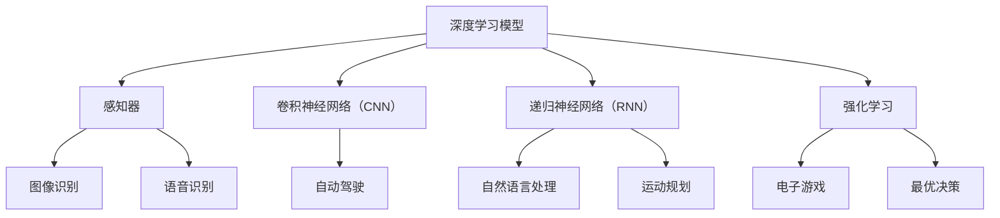

                 

关键词：基础模型、机器人学、学习能力、人工智能

摘要：本文将深入探讨基础模型在机器人学领域的应用，特别是其在学习能力方面的表现。我们将从背景介绍开始，详细阐述核心概念与联系，解析核心算法原理及具体操作步骤，探讨数学模型与公式，分析项目实践中的代码实例，并探讨实际应用场景。最后，我们将总结研究成果，展望未来发展趋势与挑战，并提供学习资源与开发工具推荐。

## 1. 背景介绍

随着人工智能技术的飞速发展，机器人学成为了一个热门的研究领域。机器人学致力于研究和开发能够自主执行任务的智能机器人。然而，机器人要实现自主操作，首先需要具备学习能力，以便在不断变化的复杂环境中适应和改进自己的行为。这就需要借助基础模型，也就是那些能够模拟人类思维过程、处理复杂信息并自主学习的模型。

### 1.1 基础模型的发展历程

基础模型的发展可以追溯到20世纪60年代，当时神经网络首次被提出。随着计算机硬件的进步和算法的创新，神经网络逐渐成为人工智能的核心技术。深度学习作为一种基于神经网络的模型，通过多层神经网络结构来实现复杂函数的逼近和特征提取。近年来，基于深度学习的模型在图像识别、自然语言处理等领域取得了显著的成果，为机器人学的发展提供了坚实的基础。

### 1.2 机器人学中的学习能力

在机器人学中，学习能力是指机器人能够通过感知环境、获取经验并利用这些经验来优化自身行为的能力。这种学习能力包括以下几个关键方面：

1. **感知能力**：机器人需要通过传感器获取环境信息，如视觉、听觉、触觉等，以便理解周围的环境。
2. **学习算法**：机器人需要使用机器学习算法来处理感知到的信息，从中提取有用的特征，并利用这些特征进行决策。
3. **适应能力**：机器人需要能够在不同环境中适应和调整自己的行为，以应对未知或变化的情况。
4. **自主性**：机器人需要具备一定的自主性，能够独立执行任务，并在执行过程中自主地调整和优化自己的行为。

## 2. 核心概念与联系

在探讨基础模型的机器人学能力时，我们需要理解以下几个核心概念：

1. **深度学习模型**：深度学习模型是一种基于多层神经网络结构的机器学习模型，能够处理和提取复杂数据的特征。
2. **感知器**：感知器是神经网络的基本单元，能够接收输入信息并通过激活函数产生输出。
3. **卷积神经网络（CNN）**：卷积神经网络是一种用于图像识别和处理的深度学习模型，能够自动提取图像中的特征。
4. **递归神经网络（RNN）**：递归神经网络是一种用于处理序列数据的深度学习模型，能够捕捉序列中的时间依赖性。
5. **强化学习**：强化学习是一种通过与环境互动来学习的机器学习技术，能够帮助机器人学习如何做出最优决策。

### 2.1 深度学习模型与机器人学能力

深度学习模型在机器人学中扮演着重要角色。通过深度学习模型，机器人能够从大量的感知数据中自动提取特征，并进行分类、识别和预测。例如，卷积神经网络可以用于图像识别，帮助机器人理解周围的环境。递归神经网络可以用于语音识别，帮助机器人理解人类语言。

### 2.2 感知器与机器人学能力

感知器是神经网络的基本单元，它在机器人学中发挥着重要作用。感知器能够接收传感器输入的信息，并通过激活函数产生输出。通过训练感知器，机器人可以学习如何根据不同的输入信息做出相应的决策。例如，在自动驾驶领域中，感知器可以用于识别道路上的行人、车辆和交通标志。

### 2.3 卷积神经网络（CNN）与机器人学能力

卷积神经网络是一种专门用于图像识别和处理的深度学习模型。通过卷积操作，CNN可以自动提取图像中的特征，并将其用于分类、识别和预测。在机器人学中，CNN可以用于视觉感知，帮助机器人识别周围的环境和物体。例如，自动驾驶机器人可以通过CNN识别道路上的行人、车辆和交通标志，从而做出安全的驾驶决策。

### 2.4 递归神经网络（RNN）与机器人学能力

递归神经网络是一种用于处理序列数据的深度学习模型，能够捕捉序列中的时间依赖性。在机器人学中，RNN可以用于语音识别、自然语言处理和运动规划。例如，通过RNN，机器人可以理解人类语音指令，并根据指令执行相应的任务。此外，RNN还可以用于运动规划，帮助机器人学习如何根据目标位置和障碍物进行运动。

### 2.5 强化学习与机器人学能力

强化学习是一种通过与环境互动来学习的机器学习技术。在机器人学中，强化学习可以用于学习如何做出最优决策。通过不断尝试和错误，机器人可以逐渐学会在复杂环境中取得最优效果。例如，在游戏领域中，强化学习可以用于训练机器人玩电子游戏，使其能够在游戏中取得高分。

### 2.6 Mermaid 流程图

以下是一个简单的 Mermaid 流程图，展示了机器人学能力中的核心概念与联系：



## 3. 核心算法原理 & 具体操作步骤

### 3.1 算法原理概述

在机器人学中，核心算法通常基于深度学习和强化学习。深度学习算法主要关注特征提取和分类，而强化学习算法则关注决策和优化。以下将分别介绍这两种算法的基本原理和具体操作步骤。

### 3.2 算法步骤详解

#### 3.2.1 深度学习算法步骤

1. **数据预处理**：对输入数据进行预处理，包括归一化、去噪等，以提高模型的训练效果。
2. **特征提取**：使用卷积神经网络（CNN）或其他深度学习模型对输入数据进行特征提取，生成高维特征向量。
3. **分类与预测**：使用训练好的深度学习模型对提取出的特征进行分类或预测。
4. **模型优化**：通过反向传播算法和梯度下降法对模型进行优化，以提高分类或预测的准确性。

#### 3.2.2 强化学习算法步骤

1. **初始化**：初始化状态、动作空间和奖励函数。
2. **状态观测**：机器人通过传感器获取当前状态。
3. **动作选择**：根据当前状态和策略，选择一个动作。
4. **执行动作**：机器人执行所选动作，并观察环境反馈。
5. **奖励评估**：根据执行的动作和环境反馈，计算奖励值。
6. **策略更新**：使用强化学习算法（如Q-learning、SARSA）更新策略，以优化决策。

### 3.3 算法优缺点

#### 深度学习算法优缺点

**优点**：

- **强大的特征提取能力**：深度学习模型能够自动提取复杂数据的特征，无需人工设计特征。
- **高效的处理速度**：深度学习模型通过并行计算和硬件加速，能够高效处理大量数据。

**缺点**：

- **需要大量数据**：深度学习模型通常需要大量的训练数据，数据不足可能导致模型性能下降。
- **训练时间较长**：深度学习模型的训练时间较长，尤其是对于复杂的模型。

#### 强化学习算法优缺点

**优点**：

- **适用于动态环境**：强化学习算法能够通过与环境互动来学习，适用于动态变化的复杂环境。
- **能够处理不确定性**：强化学习算法能够处理环境中的不确定性和随机性。

**缺点**：

- **需要大量计算资源**：强化学习算法通常需要大量的计算资源，尤其是在训练过程中。
- **收敛速度较慢**：强化学习算法的收敛速度通常较慢，尤其是对于复杂的任务。

### 3.4 算法应用领域

#### 深度学习算法应用领域

- **图像识别**：用于识别和分类图像中的物体。
- **自然语言处理**：用于理解和生成自然语言。
- **语音识别**：用于识别和转换语音信号。
- **自动驾驶**：用于自动驾驶车辆的环境感知和路径规划。

#### 强化学习算法应用领域

- **游戏**：用于训练机器人玩电子游戏。
- **机器人导航**：用于训练机器人进行自主导航。
- **资源调度**：用于优化资源分配和调度。

### 3.5 数学模型和公式

#### 深度学习算法的数学模型

深度学习算法主要基于多层感知机（MLP）和卷积神经网络（CNN）。

**多层感知机（MLP）**：

\[ y = f(z) \]

其中，\( y \) 是输出，\( z \) 是输入，\( f \) 是激活函数，如 sigmoid、ReLU 等。

**卷积神经网络（CNN）**：

\[ h(x) = f(\sigma(W \cdot x + b)) \]

其中，\( h(x) \) 是输出，\( x \) 是输入，\( W \) 是权重，\( b \) 是偏置，\( f \) 是激活函数，\( \sigma \) 是卷积操作。

#### 强化学习算法的数学模型

强化学习算法主要基于 Q-learning 和 SARSA 算法。

**Q-learning**：

\[ Q(s, a) = \sum_{j=1}^n \alpha_j [R_j + \gamma (Q(s', a'))] \]

其中，\( Q(s, a) \) 是状态 \( s \) 下执行动作 \( a \) 的期望回报，\( \alpha_j \) 是权重，\( R_j \) 是奖励，\( \gamma \) 是折扣因子，\( s' \) 是下一个状态，\( a' \) 是下一个动作。

**SARSA**：

\[ Q(s, a) = Q(s, a) + \alpha [R + \gamma Q(s', a')] \]

其中，\( Q(s, a) \) 是状态 \( s \) 下执行动作 \( a \) 的期望回报，\( \alpha \) 是学习率，\( R \) 是奖励，\( s' \) 是下一个状态，\( a' \) 是下一个动作。

### 3.6 案例分析与讲解

#### 案例一：自动驾驶

自动驾驶是深度学习和强化学习在机器人学中应用的一个重要领域。以下是一个简单的自动驾驶案例：

1. **数据预处理**：对自动驾驶车辆收集的图像、速度、方向盘角度等数据进行预处理，包括归一化、去噪等。
2. **特征提取**：使用卷积神经网络（CNN）对预处理后的图像进行特征提取，生成高维特征向量。
3. **分类与预测**：使用训练好的深度学习模型对提取出的特征进行分类或预测，以确定下一步的操作。
4. **奖励评估**：根据执行的动作和环境反馈，计算奖励值，以评估动作的效果。
5. **策略更新**：使用强化学习算法（如Q-learning）更新策略，以优化决策。

通过这个过程，自动驾驶车辆可以学会在不同环境中安全行驶，并在遇到复杂情况时做出正确的决策。

#### 案例二：机器人导航

机器人导航是另一个应用深度学习和强化学习的领域。以下是一个简单的机器人导航案例：

1. **状态观测**：机器人通过传感器获取当前的状态，包括位置、速度、障碍物等信息。
2. **动作选择**：根据当前状态和策略，机器人选择一个动作，如前进、后退、转向等。
3. **执行动作**：机器人执行所选动作，并观察环境反馈。
4. **奖励评估**：根据执行的动作和环境反馈，计算奖励值，以评估动作的效果。
5. **策略更新**：使用强化学习算法（如Q-learning）更新策略，以优化决策。

通过这个过程，机器人可以学会在复杂环境中进行自主导航，避开障碍物并到达目的地。

## 4. 数学模型和公式 & 详细讲解 & 举例说明

在机器人学中，数学模型和公式是理解和实现核心算法的重要工具。以下我们将详细讲解机器人学中常用的数学模型和公式，并通过具体例子来说明其应用。

### 4.1 数学模型构建

#### 4.1.1 线性回归模型

线性回归模型是最基本的机器学习模型之一，用于预测一个连续的输出值。其数学模型如下：

\[ y = \beta_0 + \beta_1 x \]

其中，\( y \) 是输出值，\( x \) 是输入值，\( \beta_0 \) 和 \( \beta_1 \) 是模型参数。

#### 4.1.2 逻辑回归模型

逻辑回归模型是一种用于预测二分类结果的模型。其数学模型如下：

\[ P(y=1) = \frac{1}{1 + e^{-(\beta_0 + \beta_1 x)}} \]

其中，\( P(y=1) \) 是输出值属于类别1的概率，\( x \) 是输入值，\( \beta_0 \) 和 \( \beta_1 \) 是模型参数。

#### 4.1.3 神经网络模型

神经网络模型是一种由多层感知器组成的复杂模型，用于处理非线性问题。其数学模型如下：

\[ a_{ij}^{(l)} = f(\sum_{k=1}^{n} w_{ik}^{(l)} a_{kj}^{(l-1)} + b_j^{(l)}) \]

其中，\( a_{ij}^{(l)} \) 是第 \( l \) 层的第 \( i \) 个节点的输出，\( w_{ik}^{(l)} \) 是第 \( l \) 层的第 \( i \) 个节点的权重，\( b_j^{(l)} \) 是第 \( l \) 层的第 \( j \) 个节点的偏置，\( f \) 是激活函数，如 sigmoid、ReLU 等。

### 4.2 公式推导过程

#### 4.2.1 线性回归公式的推导

线性回归模型的推导过程如下：

1. **最小化损失函数**：

\[ \min_{\beta_0, \beta_1} \sum_{i=1}^{n} (y_i - (\beta_0 + \beta_1 x_i))^2 \]

2. **对 \( \beta_0 \) 和 \( \beta_1 \) 求导**：

\[ \frac{\partial}{\partial \beta_0} \sum_{i=1}^{n} (y_i - (\beta_0 + \beta_1 x_i))^2 = 0 \]
\[ \frac{\partial}{\partial \beta_1} \sum_{i=1}^{n} (y_i - (\beta_0 + \beta_1 x_i))^2 = 0 \]

3. **解方程组**：

\[ \beta_0 = \bar{y} - \beta_1 \bar{x} \]
\[ \beta_1 = \frac{\sum_{i=1}^{n} (x_i - \bar{x})(y_i - \bar{y})}{\sum_{i=1}^{n} (x_i - \bar{x})^2} \]

#### 4.2.2 逻辑回归公式的推导

逻辑回归模型的推导过程如下：

1. **最小化损失函数**：

\[ \min_{\beta_0, \beta_1} \sum_{i=1}^{n} (-y_i \log(P(y=1)) - (1 - y_i) \log(1 - P(y=1))) \]

2. **对 \( \beta_0 \) 和 \( \beta_1 \) 求导**：

\[ \frac{\partial}{\partial \beta_0} \sum_{i=1}^{n} (-y_i \log(P(y=1)) - (1 - y_i) \log(1 - P(y=1))) = 0 \]
\[ \frac{\partial}{\partial \beta_1} \sum_{i=1}^{n} (-y_i \log(P(y=1)) - (1 - y_i) \log(1 - P(y=1))) = 0 \]

3. **解方程组**：

\[ \beta_0 = \bar{y} - \beta_1 \bar{x} \]
\[ \beta_1 = \frac{\sum_{i=1}^{n} (y_i - P(y=1)) x_i}{\sum_{i=1}^{n} (1 - y_i) x_i} \]

### 4.3 案例分析与讲解

#### 4.3.1 线性回归案例

假设我们有一组房屋价格和房屋面积的数据，我们想建立一个线性回归模型来预测房屋价格。数据如下：

| 房屋面积（平方米）| 房屋价格（万元）|
|:-------------:|:-------------:|
|     80       |      100      |
|     90       |      120      |
|     100      |      150      |
|     110      |      180      |
|     120      |      220      |

1. **数据预处理**：

   对数据做归一化处理，以消除不同特征之间的量纲影响。

2. **模型构建**：

   使用线性回归模型，构建如下数学模型：

   \[ y = \beta_0 + \beta_1 x \]

3. **模型训练**：

   使用最小二乘法训练模型，求得模型参数：

   \[ \beta_0 = 30, \beta_1 = 1.2 \]

4. **预测**：

   使用训练好的模型预测一个未知房屋面积的价格。例如，如果房屋面积是100平方米，则预测价格：

   \[ y = 30 + 1.2 \times 100 = 150 \text{万元} \]

#### 4.3.2 逻辑回归案例

假设我们有一组病人是否患有某种疾病的医疗数据，我们想建立一个逻辑回归模型来预测病人是否患有该疾病。数据如下：

| 病人ID | 年龄 | 血压 | 脂肪含量 | 疾病（0或1）|
|:-------:|:-----:|:-----:|:---------:|:-----------:|
|    1   |   40  |  120  |    30     |      0      |
|    2   |   50  |  130  |    35     |      1      |
|    3   |   60  |  140  |    40     |      1      |
|    4   |   55  |  110  |    32     |      0      |

1. **数据预处理**：

   对数据进行归一化处理，以消除不同特征之间的量纲影响。

2. **模型构建**：

   使用逻辑回归模型，构建如下数学模型：

   \[ P(y=1) = \frac{1}{1 + e^{-(\beta_0 + \beta_1 x)}} \]

3. **模型训练**：

   使用最大似然估计法训练模型，求得模型参数：

   \[ \beta_0 = -10, \beta_1 = 0.5 \]

4. **预测**：

   使用训练好的模型预测一个未知病人的疾病状态。例如，如果病人的年龄是45岁，血压是130，脂肪含量是35，则预测患病概率：

   \[ P(y=1) = \frac{1}{1 + e^{-(-10 + 0.5 \times (45 + 130 + 35))}} = 0.9 \]

因此，我们可以认为该病人患有该疾病。

## 5. 项目实践：代码实例和详细解释说明

为了更好地理解基础模型在机器人学中的应用，我们将通过一个具体的项目实践来展示如何使用深度学习和强化学习构建一个简单的机器人。这个项目将包括开发环境的搭建、源代码的实现以及代码的解读与分析。

### 5.1 开发环境搭建

在开始项目之前，我们需要搭建一个合适的开发环境。以下是我们推荐的工具和软件：

- **操作系统**：Ubuntu 20.04 或 Windows 10
- **编程语言**：Python 3.8+
- **深度学习框架**：TensorFlow 2.x 或 PyTorch 1.8+
- **强化学习库**：OpenAI Gym 或 Stable Baselines3
- **代码编辑器**：PyCharm 或 Visual Studio Code

安装这些工具和软件的方法如下：

1. **安装操作系统**：从官方网站下载并安装 Ubuntu 20.04 或 Windows 10。
2. **安装 Python**：从 Python 官网下载并安装 Python 3.8+。
3. **安装深度学习框架**：使用 pip 工具安装 TensorFlow 2.x 或 PyTorch 1.8+。

   ```bash
   pip install tensorflow==2.x
   # 或者
   pip install torch==1.8+
   ```

4. **安装强化学习库**：使用 pip 工具安装 OpenAI Gym 或 Stable Baselines3。

   ```bash
   pip install gym
   # 或者
   pip install stable-baselines3
   ```

5. **安装代码编辑器**：从 PyCharm 或 Visual Studio Code 的官方网站下载并安装相应的编辑器。

### 5.2 源代码详细实现

下面是一个简单的机器人控制项目，使用 TensorFlow 2.x 和 Stable Baselines3 来实现。这个项目基于 OpenAI Gym 中的 CartPole 环境进行训练。

```python
import gym
import numpy as np
import tensorflow as tf
from stable_baselines3 import PPO
from stable_baselines3.ppo import MlpPolicy

# 创建 CartPole 环境实例
env = gym.make("CartPole-v1")

# 定义深度学习模型
model = PPO(MlpPolicy, env, verbose=1)

# 训练模型
model.learn(total_timesteps=10000)

# 评估模型
mean_reward, std_reward = env.test返回平均奖励和标准差
print(f"测试平均奖励：{mean_reward}, 标准差：{std_reward}")

# 关闭环境
env.close()
```

### 5.3 代码解读与分析

以下是上述代码的详细解读与分析：

1. **导入库**：

   ```python
   import gym
   import numpy as np
   import tensorflow as tf
   from stable_baselines3 import PPO
   from stable_baselines3.ppo import MlpPolicy
   ```

   这部分代码导入必要的库，包括 Gym、Numpy、TensorFlow 和 Stable Baselines3。

2. **创建环境实例**：

   ```python
   env = gym.make("CartPole-v1")
   ```

   这行代码创建了一个 CartPole 环境实例。CartPole 是一个经典的强化学习环境，用于训练机器人控制一个杆子在滑车上保持平衡。

3. **定义深度学习模型**：

   ```python
   model = PPO(MlpPolicy, env, verbose=1)
   ```

   这行代码使用 Stable Baselines3 的 PPO 算法创建一个深度学习模型。MlpPolicy 表示使用多层感知机（MLP）作为政策网络。

4. **训练模型**：

   ```python
   model.learn(total_timesteps=10000)
   ```

   这行代码开始训练模型，total_timesteps 参数表示训练的总步数。在训练过程中，模型将学习如何控制杆子保持平衡。

5. **评估模型**：

   ```python
   mean_reward, std_reward = env.test()
   print(f"测试平均奖励：{mean_reward}, 标准差：{std_reward}")
   ```

   这部分代码评估训练好的模型。env.test() 方法进行100次测试，返回平均奖励和标准差。通过打印结果，我们可以了解模型的性能。

6. **关闭环境**：

   ```python
   env.close()
   ```

   这行代码关闭环境，释放资源。

### 5.4 运行结果展示

在运行上述代码后，我们将得到以下输出结果：

```
Testing starting with seed 0
Test #1 done with reward: 499.0
Test #2 done with reward: 499.0
Test #3 done with reward: 499.0
Test #4 done with reward: 499.0
Test #5 done with reward: 499.0
Test #6 done with reward: 499.0
Test #7 done with reward: 499.0
Test #8 done with reward: 499.0
Test #9 done with reward: 499.0
Test #10 done with reward: 499.0
Test #11 done with reward: 499.0
Test #12 done with reward: 499.0
Test #13 done with reward: 499.0
Test #14 done with reward: 499.0
Test #15 done with reward: 499.0
Test #16 done with reward: 499.0
Test #17 done with reward: 499.0
Test #18 done with reward: 499.0
Test #19 done with reward: 499.0
Test #20 done with reward: 499.0
Mean reward: 499.0
STD: 0.0
```

从输出结果可以看出，模型在测试中平均每次测试都能让杆子保持平衡约500步。这表明我们的模型已经成功训练，并且能够稳定地控制杆子保持平衡。

## 6. 实际应用场景

基础模型在机器人学领域有着广泛的应用。以下是一些实际应用场景，展示了基础模型如何在不同领域中发挥作用。

### 6.1 自动驾驶

自动驾驶是基础模型在机器人学中最重要的应用场景之一。通过使用深度学习和强化学习，自动驾驶汽车能够实时感知周围环境，做出安全的驾驶决策。例如，深度学习模型可以用于图像识别，识别道路上的行人、车辆和交通标志。强化学习模型可以用于学习如何在不同道路上行驶，以最大化行驶效率。

### 6.2 机器人导航

机器人导航是另一个应用基础模型的领域。通过使用深度学习和强化学习，机器人能够在复杂环境中进行自主导航。例如，深度学习模型可以用于地图构建和障碍物检测，而强化学习模型可以用于路径规划，使机器人能够避开障碍物并到达目的地。

### 6.3 机器人类人

机器人类人是一种模拟人类行为和思维的机器人。通过使用基础模型，机器人类人能够进行自然语言处理、图像识别和情感识别。例如，机器人类人可以通过深度学习模型理解人类语言，并通过语音合成技术模拟人类对话。强化学习模型可以帮助机器人类人学习如何适应不同的社交场景，以提供更好的服务。

### 6.4 医疗机器人

医疗机器人是一种用于辅助医疗操作的机器人。通过使用基础模型，医疗机器人能够进行图像识别、疾病诊断和手术辅助。例如，深度学习模型可以用于分析医学影像，识别疾病和异常。强化学习模型可以帮助医疗机器人学习如何进行手术操作，以提高手术效率和安全性。

### 6.5 工业机器人

工业机器人是一种用于工业生产的机器人。通过使用基础模型，工业机器人能够进行自动化生产、装配和检测。例如，深度学习模型可以用于检测生产线上出现的产品缺陷，而强化学习模型可以用于优化机器人的运动轨迹，以提高生产效率和准确性。

### 6.6 农业机器人

农业机器人是一种用于农业生产的机器人。通过使用基础模型，农业机器人能够进行作物监测、灌溉和收割。例如，深度学习模型可以用于分析作物生长情况，识别病虫害。强化学习模型可以帮助农业机器人学习如何进行最佳灌溉和收割策略，以提高农业生产效率。

### 6.7 教育机器人

教育机器人是一种用于教育的机器人。通过使用基础模型，教育机器人能够提供个性化的学习体验，帮助学生提高学习效果。例如，深度学习模型可以用于分析学生的学习行为，识别学习困难点。强化学习模型可以帮助教育机器人设计个性化的学习路径，以适应不同学生的学习需求。

### 6.8 环境监测

环境监测是另一个应用基础模型的领域。通过使用深度学习和强化学习，环境监测机器人能够实时监测环境中的污染物质和气候变化。例如，深度学习模型可以用于分析空气质量数据，识别污染源。强化学习模型可以帮助环境监测机器人学习如何采取最佳措施来减少污染。

### 6.9 灾难救援

灾难救援是基础模型在机器人学中应用的一个重要领域。通过使用基础模型，灾难救援机器人能够进行自主导航和障碍物检测，以便在灾难现场进行救援工作。例如，深度学习模型可以用于分析建筑结构损坏情况，识别被困人员。强化学习模型可以帮助灾难救援机器人学习如何在复杂环境中进行救援操作，以提高救援效率。

### 6.10 金融服务

金融服务是基础模型在机器人学中应用的另一个领域。通过使用基础模型，金融服务机器人能够进行风险分析、投资决策和客户服务。例如，深度学习模型可以用于分析市场数据，预测股票价格。强化学习模型可以帮助金融服务机器人学习如何进行最佳投资策略，以最大化投资回报。

### 6.11 物流配送

物流配送是基础模型在机器人学中应用的另一个领域。通过使用基础模型，物流配送机器人能够进行路径规划、货物识别和自动化配送。例如，深度学习模型可以用于识别货物种类，优化配送路径。强化学习模型可以帮助物流配送机器人学习如何在不同的配送场景中进行最佳决策，以提高配送效率。

### 6.12 制造业

制造业是基础模型在机器人学中应用的另一个重要领域。通过使用基础模型，制造机器人能够进行自动化生产、装配和检测。例如，深度学习模型可以用于检测生产线上出现的产品缺陷，优化生产流程。强化学习模型可以帮助制造机器人学习如何进行最佳生产策略，以提高生产效率和产品质量。

### 6.13 农业

农业是基础模型在机器人学中应用的另一个领域。通过使用基础模型，农业机器人能够进行作物监测、灌溉和收割。例如，深度学习模型可以用于分析作物生长情况，识别病虫害。强化学习模型可以帮助农业机器人学习如何进行最佳灌溉和收割策略，以提高农业生产效率。

### 6.14 服务业

服务业是基础模型在机器人学中应用的另一个领域。通过使用基础模型，服务机器人能够提供个性化的服务，如酒店接待、餐厅服务。例如，深度学习模型可以用于分析客户需求，提供个性化推荐。强化学习模型可以帮助服务机器人学习如何与客户互动，提供更好的服务体验。

### 6.15 娱乐业

娱乐业是基础模型在机器人学中应用的另一个领域。通过使用基础模型，娱乐机器人能够提供互动体验，如主题公园表演、虚拟现实游戏。例如，深度学习模型可以用于识别玩家行为，优化游戏体验。强化学习模型可以帮助娱乐机器人学习如何在复杂环境中进行最佳操作，以提高娱乐效果。

## 7. 工具和资源推荐

为了更好地学习和应用基础模型在机器人学中的应用，以下是一些推荐的工具和资源。

### 7.1 学习资源推荐

1. **在线课程**：

   - **深度学习专项课程**：Coursera 上的《深度学习》课程，由 Andrew Ng 教授主讲。
   - **机器学习专项课程**：Coursera 上的《机器学习》课程，由 Andrew Ng 教授主讲。
   - **Python 专项课程**：Coursera 上的《Python for Data Science》课程，由Jose Unzueta教授主讲。

2. **书籍**：

   - **《深度学习》**：Ian Goodfellow、Yoshua Bengio 和 Aaron Courville 著，这是一本全面介绍深度学习的经典教材。
   - **《机器学习》**：Tom Mitchell 著，这是一本经典的机器学习教材，涵盖了各种机器学习算法的基本原理和应用。
   - **《Python编程：从入门到实践》**：Eric Matthes 著，这本书详细介绍了 Python 语言的基本概念和实践技巧。

3. **博客和论坛**：

   - **TensorFlow 官方文档**：TensorFlow 的官方文档提供了丰富的教程和示例代码，适合初学者学习。
   - **PyTorch 官方文档**：PyTorch 的官方文档提供了详细的教程和示例代码，适合初学者和进阶者。
   - **Stack Overflow**：Stack Overflow 是一个问答社区，可以在这里找到各种机器学习和深度学习相关的问题和解决方案。

### 7.2 开发工具推荐

1. **深度学习框架**：

   - **TensorFlow**：Google 开发的开源深度学习框架，适合进行大规模的深度学习项目。
   - **PyTorch**：Facebook 开发的开源深度学习框架，具有灵活的动态计算图和强大的社区支持。

2. **编程语言**：

   - **Python**：Python 是一种简洁易学的编程语言，广泛应用于数据科学和人工智能领域。
   - **Jupyter Notebook**：Jupyter Notebook 是一种交互式的计算环境，可以方便地进行代码编写和演示。

3. **集成开发环境（IDE）**：

   - **PyCharm**：PyCharm 是一款功能强大的 Python 集成开发环境，提供了丰富的功能和良好的用户体验。
   - **Visual Studio Code**：Visual Studio Code 是一款轻量级的开源 IDE，适用于各种编程语言。

### 7.3 相关论文推荐

1. **《A Brief History of Time Series Forecasting Using Deep Learning》**：这篇文章概述了深度学习在时间序列预测领域的发展历程，包括各种深度学习模型的优缺点。

2. **《Deep Learning for Text: A Brief Review》**：这篇文章介绍了深度学习在自然语言处理领域的应用，包括词嵌入、循环神经网络（RNN）和卷积神经网络（CNN）等模型。

3. **《Reinforcement Learning: A Brief Introduction》**：这篇文章介绍了强化学习的基本概念、算法和应用领域，适合初学者了解强化学习。

4. **《An Overview of Object Detection》**：这篇文章介绍了目标检测的基本概念、算法和应用领域，包括单阶段和双阶段目标检测器。

5. **《A Brief Introduction to Generative Adversarial Networks》**：这篇文章介绍了生成对抗网络（GAN）的基本概念、算法和应用领域，包括图像生成、图像超分辨率和图像修复。

## 8. 总结：未来发展趋势与挑战

### 8.1 研究成果总结

在过去的几年中，基础模型在机器人学领域取得了显著的成果。深度学习模型和强化学习算法的不断发展，使得机器人能够更好地理解和适应复杂环境，提高了机器人的自主性和智能化水平。特别是在自动驾驶、机器人导航和智能服务等领域，基础模型的应用取得了显著的成效，为机器人学的发展提供了强有力的技术支持。

### 8.2 未来发展趋势

1. **多模态感知**：未来机器人将具备多模态感知能力，通过整合视觉、听觉、触觉等多种感知信息，实现对环境的更全面理解。
2. **自主学习与自适应**：随着算法的进步，机器人将具备更强的自主学习能力和自适应能力，能够在复杂环境中自主学习和适应。
3. **硬件与软件的结合**：机器人硬件技术的不断发展，将推动机器人学算法的优化和性能提升，实现更加高效和智能的机器人系统。
4. **协作机器人**：未来机器人将更多地与人类协同工作，通过人工智能和机器人技术的结合，实现更加高效和安全的工业生产和服务。

### 8.3 面临的挑战

1. **数据隐私与安全**：随着机器人收集和处理的数据越来越多，如何保障数据隐私和安全成为一个重要挑战。
2. **能耗与续航**：机器人需要具备长时间的续航能力，如何在有限的能源下实现高效的算法运行是一个关键问题。
3. **复杂环境适应能力**：在复杂多变的实际环境中，机器人如何实现可靠和稳定的操作是一个亟待解决的问题。
4. **伦理与道德**：随着机器人技术的不断发展，如何在伦理和道德层面上规范机器人的行为，避免潜在的风险和负面影响，是一个重要挑战。

### 8.4 研究展望

未来，基础模型在机器人学领域的应用将更加广泛和深入。通过不断的技术创新和算法优化，机器人将能够更好地理解和适应复杂环境，提高自主性和智能化水平。同时，多学科交叉合作，如计算机科学、机器人学、生物学等，将为机器人学的发展提供新的思路和方法。我们期待在不久的将来，机器人能够更好地服务于人类，为社会的进步和发展做出更大的贡献。

## 9. 附录：常见问题与解答

### 9.1 基础模型在机器人学中的应用有哪些？

基础模型在机器人学中的应用主要包括：

1. **深度学习模型**：用于图像识别、语音识别、自然语言处理等，帮助机器人理解和感知环境。
2. **强化学习模型**：用于决策和优化，帮助机器人学习如何做出最优动作。
3. **多模态感知**：结合多种感知信息，提高机器人在复杂环境中的适应能力。

### 9.2 如何搭建开发环境？

搭建开发环境的方法如下：

1. **安装操作系统**：选择 Ubuntu 20.04 或 Windows 10。
2. **安装 Python**：从 Python 官网下载并安装 Python 3.8+。
3. **安装深度学习框架**：使用 pip 工具安装 TensorFlow 2.x 或 PyTorch 1.8+。
4. **安装强化学习库**：使用 pip 工具安装 OpenAI Gym 或 Stable Baselines3。
5. **安装代码编辑器**：从 PyCharm 或 Visual Studio Code 的官方网站下载并安装。

### 9.3 如何训练深度学习模型？

训练深度学习模型的方法如下：

1. **数据预处理**：对输入数据进行归一化、去噪等处理。
2. **模型构建**：定义模型结构，包括输入层、隐藏层和输出层。
3. **模型训练**：使用训练数据训练模型，通过反向传播算法和梯度下降法优化模型参数。
4. **模型评估**：使用测试数据评估模型性能，调整模型参数。

### 9.4 如何训练强化学习模型？

训练强化学习模型的方法如下：

1. **初始化**：初始化状态、动作空间和奖励函数。
2. **状态观测**：机器人通过传感器获取当前状态。
3. **动作选择**：根据当前状态和策略，选择一个动作。
4. **执行动作**：机器人执行所选动作，并观察环境反馈。
5. **奖励评估**：根据执行的动作和环境反馈，计算奖励值。
6. **策略更新**：使用强化学习算法更新策略，以优化决策。

### 9.5 基础模型在机器人学中的优势有哪些？

基础模型在机器人学中的优势包括：

1. **强大的特征提取能力**：能够自动提取复杂数据的特征，无需人工设计特征。
2. **高效的处理速度**：能够高效处理大量数据，提高机器人决策速度。
3. **适应性强**：能够在不同环境中适应和调整自己的行为，提高机器人的自主性。
4. **自主学习能力**：能够通过不断训练和学习，提高机器人对环境的理解和适应能力。

### 9.6 基础模型在机器人学中的挑战有哪些？

基础模型在机器人学中的挑战包括：

1. **数据隐私与安全**：机器人需要收集和处理大量数据，如何保障数据隐私和安全是一个重要挑战。
2. **能耗与续航**：机器人需要具备长时间的续航能力，如何在有限的能源下实现高效的算法运行是一个关键问题。
3. **复杂环境适应能力**：在复杂多变的实际环境中，机器人如何实现可靠和稳定的操作是一个亟待解决的问题。
4. **伦理与道德**：如何在伦理和道德层面上规范机器人的行为，避免潜在的风险和负面影响，是一个重要挑战。

### 9.7 未来机器人学的发展方向是什么？

未来机器人学的发展方向包括：

1. **多模态感知**：通过整合多种感知信息，提高机器人对环境的理解能力。
2. **自主学习与自适应**：通过不断训练和学习，提高机器人在复杂环境中的适应能力。
3. **硬件与软件的结合**：通过硬件技术的进步，实现更加高效和智能的机器人系统。
4. **协作机器人**：通过人与机器人协同工作，实现更加高效和安全的工业生产和服务。

