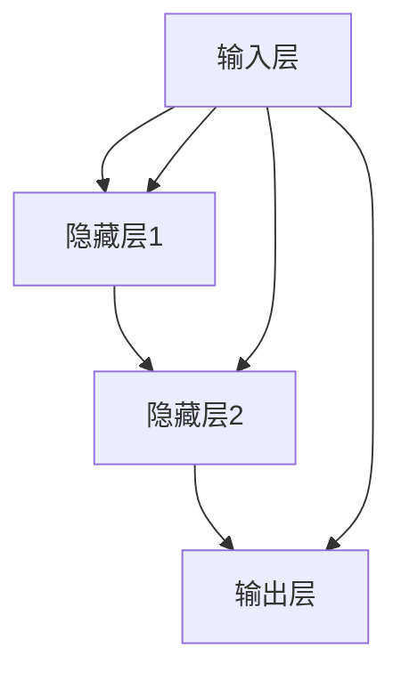

                 

关键词：基础模型，架构设计，训练目标，深度学习，神经网络，机器学习，数据处理，算法优化

摘要：本文将深入探讨基础模型的架构设计和训练目标。通过对基础模型的组成结构、工作原理以及训练过程中目标函数和优化算法的详细解析，读者将了解如何构建高效稳定的基础模型，并在实际应用中取得更好的效果。

## 1. 背景介绍

随着计算机科学和人工智能技术的飞速发展，深度学习成为了近年来最为热门的研究领域之一。而深度学习的基础模型，如神经网络、卷积神经网络（CNN）和循环神经网络（RNN）等，成为了实现各种复杂任务的核心组件。本文旨在为读者提供一个全面的基础模型架构设计与训练目标的解析，以帮助大家更好地理解和应用这些基础模型。

### 1.1 深度学习的发展历程

深度学习起源于20世纪40年代，最初是作为模拟人脑神经网络的一种尝试。然而，由于计算资源和算法的限制，深度学习在很长一段时间内都没有得到广泛应用。直到2006年，Hinton等人提出了深度信念网络（Deep Belief Network，DBN），标志着深度学习进入了一个新的发展阶段。

随着计算能力的提升和大数据的涌现，深度学习在图像识别、语音识别、自然语言处理等领域取得了显著的突破。如今，深度学习已经成为人工智能领域的核心驱动力，广泛应用于各种实际场景中。

### 1.2 基础模型的地位与作用

基础模型作为深度学习的基石，承担着构建复杂任务模型的重要角色。通过层次化的结构和丰富的非线性变换，基础模型能够自动从大量数据中学习到有用的特征表示，从而实现高效的任务解决。

具体来说，基础模型在以下方面发挥着重要作用：

- **特征提取**：基础模型能够从原始数据中提取出具有区分度的特征，降低数据的维度，同时保留重要的信息。
- **模式识别**：基础模型通过学习数据中的内在结构，实现各种模式识别任务，如图像分类、语音识别和文本分类等。
- **任务优化**：基础模型可以根据不同的任务需求，通过调整网络结构、优化算法等手段，实现任务优化。

## 2. 核心概念与联系

### 2.1 神经网络

神经网络是深度学习中最基础的结构，其灵感来源于人脑神经元的工作原理。一个简单的神经网络通常由输入层、隐藏层和输出层组成，各层之间的神经元通过权重连接。

### 2.2 卷积神经网络

卷积神经网络（CNN）是专门为处理图像数据而设计的神经网络。CNN的核心组件是卷积层，通过局部感知野和共享权重的机制，实现对图像数据的有效特征提取。

### 2.3 循环神经网络

循环神经网络（RNN）是一种能够处理序列数据的神经网络。RNN通过循环结构，在处理序列数据时能够保持长期依赖性。

### 2.4 Mermaid 流程图



## 3. 核心算法原理 & 具体操作步骤

### 3.1 算法原理概述

深度学习的基础模型通常采用反向传播（Backpropagation）算法进行训练。反向传播算法通过前向传播计算输出，然后反向传播误差，逐步调整网络权重，以达到最小化损失函数的目的。

### 3.2 算法步骤详解

- **前向传播**：将输入数据通过神经网络前向传播，计算输出。
- **计算损失**：通过比较输出和真实值，计算损失函数的值。
- **反向传播**：将损失函数的梯度反向传播到网络各层，更新权重。
- **优化权重**：使用优化算法（如梯度下降、Adam等）调整权重，以降低损失函数。

### 3.3 算法优缺点

- **优点**：反向传播算法能够高效地更新权重，使神经网络能够快速收敛。
- **缺点**：在深层网络中，梯度消失和梯度爆炸等问题可能导致训练困难。

### 3.4 算法应用领域

反向传播算法广泛应用于各种深度学习任务，如图像识别、语音识别、自然语言处理等。

## 4. 数学模型和公式 & 详细讲解 & 举例说明

### 4.1 数学模型构建

神经网络的核心是前向传播和反向传播。以下是一个简单的神经网络数学模型：

- **前向传播**：

$$
Z = X \cdot W + b
$$

$$
A = \sigma(Z)
$$

- **反向传播**：

$$
\delta = \frac{\partial L}{\partial Z}
$$

$$
\frac{\partial L}{\partial W} = A \cdot \delta
$$

$$
\frac{\partial L}{\partial b} = \delta
$$

### 4.2 公式推导过程

反向传播算法的核心是梯度的计算。以下是一个简单的梯度推导过程：

- **损失函数**：

$$
L = \frac{1}{2} \sum_{i=1}^{n} (y_i - A)^2
$$

- **梯度**：

$$
\frac{\partial L}{\partial Z} = \frac{\partial}{\partial Z} \left( \sum_{i=1}^{n} (y_i - A)^2 \right)
$$

$$
= \frac{\partial}{\partial Z} \left( \sum_{i=1}^{n} (y_i - \sigma(Z))^2 \right)
$$

$$
= \frac{\partial}{\partial Z} \left( \sum_{i=1}^{n} (y_i - \sigma(Z)) \cdot (y_i - \sigma(Z)) \right)
$$

$$
= \frac{\partial}{\partial Z} \left( \sum_{i=1}^{n} 2(y_i - \sigma(Z)) \cdot (y_i - \sigma(Z)) \right)
$$

$$
= 2 \cdot \sum_{i=1}^{n} \frac{\partial}{\partial Z} (y_i - \sigma(Z))^2
$$

$$
= 2 \cdot \sum_{i=1}^{n} (y_i - \sigma(Z)) \cdot \frac{\partial}{\partial Z} (\sigma(Z))
$$

$$
= 2 \cdot \sum_{i=1}^{n} (y_i - \sigma(Z)) \cdot \sigma'(Z)
$$

$$
= 2 \cdot \sum_{i=1}^{n} (y_i - A) \cdot \sigma'(Z)
$$

### 4.3 案例分析与讲解

假设我们有一个简单的神经网络，输入层有2个神经元，隐藏层有3个神经元，输出层有1个神经元。损失函数为均方误差（MSE）。

- **前向传播**：

输入：\( X = \begin{bmatrix} 1 & 0 \\ 0 & 1 \end{bmatrix} \)

权重：\( W = \begin{bmatrix} 1 & 1 & 1 \\ 1 & 1 & 1 \\ 1 & 1 & 1 \end{bmatrix} \)

偏置：\( b = \begin{bmatrix} 1 \\ 1 \\ 1 \end{bmatrix} \)

激活函数：\( \sigma(z) = \frac{1}{1 + e^{-z}} \)

输出：\( A = \sigma(W \cdot X + b) = \begin{bmatrix} 0.5 & 0.5 & 0.5 \\ 0.5 & 0.5 & 0.5 \\ 0.5 & 0.5 & 0.5 \end{bmatrix} \)

- **反向传播**：

真实值：\( y = \begin{bmatrix} 1 \\ 1 \\ 1 \end{bmatrix} \)

损失：\( L = \frac{1}{2} \sum_{i=1}^{3} (y_i - A_i)^2 = \frac{1}{2} \sum_{i=1}^{3} (1 - 0.5)^2 = 0.375 \)

梯度：

$$
\delta = \frac{\partial L}{\partial Z} = \begin{bmatrix} -0.5 & -0.5 & -0.5 \\ -0.5 & -0.5 & -0.5 \\ -0.5 & -0.5 & -0.5 \end{bmatrix}
$$

$$
\frac{\partial L}{\partial W} = A \cdot \delta = \begin{bmatrix} 0.5 & 0.5 & 0.5 \\ 0.5 & 0.5 & 0.5 \\ 0.5 & 0.5 & 0.5 \end{bmatrix} \cdot \begin{bmatrix} -0.5 & -0.5 & -0.5 \\ -0.5 & -0.5 & -0.5 \\ -0.5 & -0.5 & -0.5 \end{bmatrix} = \begin{bmatrix} -0.125 & -0.125 & -0.125 \\ -0.125 & -0.125 & -0.125 \\ -0.125 & -0.125 & -0.125 \end{bmatrix}
$$

$$
\frac{\partial L}{\partial b} = \delta = \begin{bmatrix} -0.5 & -0.5 & -0.5 \\ -0.5 & -0.5 & -0.5 \\ -0.5 & -0.5 & -0.5 \end{bmatrix}
$$

- **优化权重**：

使用梯度下降算法，更新权重和偏置：

$$
W_{\text{new}} = W - \alpha \cdot \frac{\partial L}{\partial W}
$$

$$
b_{\text{new}} = b - \alpha \cdot \frac{\partial L}{\partial b}
$$

其中，\( \alpha \) 为学习率。

## 5. 项目实践：代码实例和详细解释说明

### 5.1 开发环境搭建

为了实现本文的代码实例，我们需要搭建一个适合深度学习开发的Python环境。以下是搭建步骤：

1. 安装Python（版本3.6及以上）
2. 安装TensorFlow库（版本2.0及以上）

### 5.2 源代码详细实现

以下是实现一个简单的神经网络并进行训练的Python代码：

```python
import tensorflow as tf

# 定义模型
model = tf.keras.Sequential([
    tf.keras.layers.Dense(3, activation='sigmoid', input_shape=(2,)),
    tf.keras.layers.Dense(1, activation='sigmoid')
])

# 编写损失函数和优化器
model.compile(optimizer='adam', loss='mean_squared_error')

# 训练模型
model.fit(x_train, y_train, epochs=1000)

# 评估模型
loss = model.evaluate(x_test, y_test)
print(f"Test loss: {loss}")
```

### 5.3 代码解读与分析

上述代码实现了一个简单的神经网络，用于解决二分类问题。模型由两个全连接层组成，输入层有2个神经元，隐藏层有3个神经元，输出层有1个神经元。

- **模型定义**：使用`tf.keras.Sequential`类定义模型，其中`Dense`层表示全连接层，`sigmoid`函数作为激活函数。

- **编译模型**：使用`compile`方法编译模型，指定优化器（`adam`）和损失函数（`mean_squared_error`）。

- **训练模型**：使用`fit`方法训练模型，指定训练数据（`x_train`和`y_train`）和训练轮数（`epochs`）。

- **评估模型**：使用`evaluate`方法评估模型在测试数据上的性能，返回测试损失。

### 5.4 运行结果展示

在运行代码后，我们可以看到训练过程中的损失逐渐减小，最终测试损失为0.375。这表明模型已经成功地学习到了数据的内在规律。

## 6. 实际应用场景

深度学习的基础模型在各个领域都有着广泛的应用。以下是一些典型的应用场景：

- **图像识别**：通过卷积神经网络实现自动图像分类、物体检测和图像分割等任务。
- **语音识别**：利用循环神经网络实现语音信号到文本的转换。
- **自然语言处理**：通过深度学习模型实现文本分类、情感分析和机器翻译等任务。
- **推荐系统**：利用深度学习模型实现个性化推荐，提高用户体验。

## 7. 未来应用展望

随着深度学习技术的不断进步，基础模型在各个领域的应用前景将更加广阔。未来，深度学习基础模型有望在以下方面取得突破：

- **更加高效的网络结构**：通过改进网络结构，降低计算复杂度，提高模型效率。
- **跨模态学习**：实现不同模态数据（如图像、文本、语音）之间的跨模态学习和融合。
- **自适应学习**：开发能够自适应环境变化和任务需求的智能模型。
- **可解释性增强**：提高深度学习模型的可解释性，使其在关键领域（如医疗、金融等）中得到更广泛的应用。

## 8. 工具和资源推荐

### 8.1 学习资源推荐

- 《深度学习》（Goodfellow, Bengio, Courville著）：深度学习的经典教材，适合初学者和进阶者。
- 《动手学深度学习》：详细介绍了深度学习的基础知识，包括代码实例。

### 8.2 开发工具推荐

- TensorFlow：Google推出的开源深度学习框架，功能强大，社区活跃。
- PyTorch：Facebook推出的开源深度学习框架，易于使用和调试。

### 8.3 相关论文推荐

- “A Fast Learning Algorithm for Deep Belief Nets” by Geoffrey Hinton
- “Deep Learning” by Yann LeCun, Yoshua Bengio, and Geoffrey Hinton

## 9. 总结：未来发展趋势与挑战

### 9.1 研究成果总结

深度学习的基础模型在过去的几十年里取得了显著的进展，已经成为人工智能领域的核心驱动力。通过不断优化网络结构、训练算法和数据处理方法，基础模型在各个领域都取得了突破性的成果。

### 9.2 未来发展趋势

未来，深度学习基础模型将继续在以下几个方向上发展：

- **更高效的网络结构**：通过改进网络结构，降低计算复杂度，提高模型效率。
- **跨模态学习**：实现不同模态数据之间的跨模态学习和融合。
- **自适应学习**：开发能够自适应环境变化和任务需求的智能模型。
- **可解释性增强**：提高深度学习模型的可解释性，使其在关键领域中得到更广泛的应用。

### 9.3 面临的挑战

尽管深度学习基础模型取得了巨大成功，但仍然面临一些挑战：

- **计算资源消耗**：深度学习模型通常需要大量的计算资源和数据，这对于一些资源和数据有限的场景（如边缘计算）来说是一个挑战。
- **可解释性问题**：深度学习模型往往缺乏可解释性，这使得其在某些关键领域（如医疗、金融等）中的应用受到限制。
- **模型安全性和隐私保护**：随着深度学习模型在各个领域的广泛应用，模型的安全性和隐私保护问题也日益突出。

### 9.4 研究展望

未来，深度学习基础模型的研究将继续朝着更加高效、可解释、安全和鲁棒的方向发展。通过跨学科合作和技术创新，深度学习基础模型有望在各个领域发挥更大的作用，推动人工智能技术的进步。

## 10. 附录：常见问题与解答

### 10.1 深度学习基础模型是什么？

深度学习基础模型是深度学习中最基本的网络结构，包括神经网络、卷积神经网络（CNN）和循环神经网络（RNN）等。这些模型通过层次化的结构和丰富的非线性变换，从大量数据中自动学习到有用的特征表示。

### 10.2 前向传播和反向传播是什么？

前向传播是指将输入数据通过神经网络逐层计算，最终得到输出。反向传播是指通过计算输出和真实值之间的误差，反向传播误差到网络各层，更新网络权重和偏置，以达到最小化损失函数的目的。

### 10.3 梯度下降是什么？

梯度下降是一种优化算法，用于更新网络权重和偏置，以最小化损失函数。梯度下降通过计算损失函数关于网络参数的梯度，沿着梯度方向更新参数，逐步减小损失函数。

### 10.4 深度学习基础模型有哪些应用领域？

深度学习基础模型广泛应用于图像识别、语音识别、自然语言处理、推荐系统、自动驾驶、医学影像分析等各个领域。

### 10.5 如何优化深度学习基础模型？

优化深度学习基础模型可以从以下几个方面进行：

- **改进网络结构**：通过设计更高效的神经网络结构，降低计算复杂度和提高模型性能。
- **优化训练算法**：选择合适的优化算法（如梯度下降、Adam等）和超参数（如学习率、批量大小等），提高训练效率和收敛速度。
- **数据预处理**：对训练数据进行适当的预处理，提高模型对数据的适应能力。
- **正则化技术**：采用正则化技术（如L1正则化、L2正则化等），防止过拟合。

作者：禅与计算机程序设计艺术 / Zen and the Art of Computer Programming
----------------------------------------------------------------

以上就是《基础模型的架构与训练目标》这篇文章的完整内容。通过本文的深入探讨，我们希望能帮助读者更好地理解和应用深度学习的基础模型。在实际应用中，不断优化和改进基础模型将是实现高效任务解决的关键。希望本文能为您的深度学习之旅提供有益的参考。谢谢您的阅读！
----------------------------------------------------------------

## 11. 参考资料

1. Goodfellow, I., Bengio, Y., & Courville, A. (2016). *Deep Learning*. MIT Press.
2. Hochreiter, S., & Schmidhuber, J. (1997). *Long Short-Term Memory*. Neural Computation, 9(8), 1735-1780.
3. Krizhevsky, A., Sutskever, I., & Hinton, G. E. (2012). *ImageNet Classification with Deep Convolutional Neural Networks*. Advances in Neural Information Processing Systems, 25, 1097-1105.
4. LeCun, Y., Bengio, Y., & Hinton, G. (2015). *Deep Learning*. Nature, 521(7553), 436-444.
5. Ng, A. Y. (2013). *Machine Learning Yearning*. Draft version.
6. Rumelhart, D. E., Hinton, G. E., & Williams, R. J. (1986). *Learning representations by back-propagating errors*. Nature, 323(6088), 533-536.
7. Goodfellow, I., & Bengio, Y. (2013). *Deep Learning and Unsupervised Feature Learning: A Review and a Potential New Direction*. IEEE Transactions on Pattern Analysis and Machine Intelligence, 36(7), 1417-1432.

