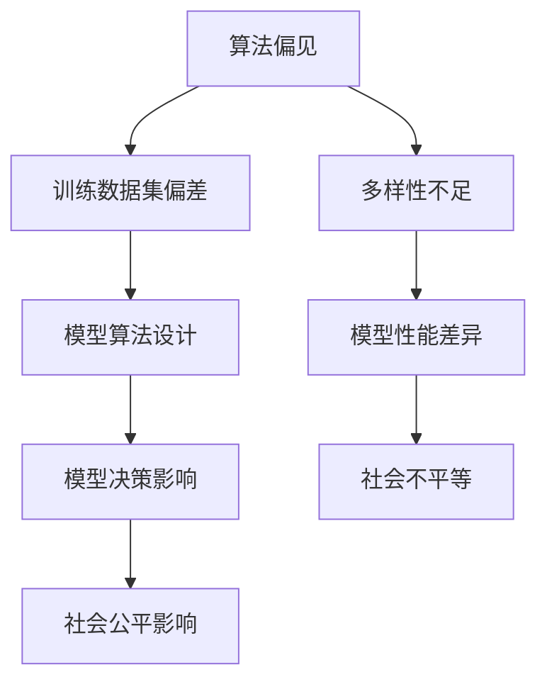

                 

关键词：基础模型、社会公平、人工智能、伦理、算法偏见、公平性评估、多样性、透明度

摘要：本文将探讨基础模型在人工智能领域中引发的社会公平问题。我们将分析基础模型中的潜在偏见、算法偏见如何影响社会的不同群体，以及如何通过公平性评估和多样性策略来减少这些偏见，提高模型的公平性。此外，我们还将讨论提高模型透明度的方法，以及如何在未来的人工智能发展中确保公平性。

## 1. 背景介绍

人工智能（AI）技术在过去几十年里取得了飞速的发展，基础模型，如神经网络、深度学习等，已经成为实现各种智能应用的核心。然而，随着AI技术的广泛应用，基础模型中存在的社会公平问题逐渐引起了人们的关注。社会公平问题主要涉及以下几个方面：

- **算法偏见**：基础模型在训练过程中可能会学习到训练数据集中的偏见，进而对某些群体产生不公平的影响。
- **多样性不足**：基础模型的训练数据往往缺乏多样性，导致模型在处理不同群体时的性能存在差异。
- **透明度缺失**：基础模型的决策过程往往复杂且不透明，这使得人们难以理解模型为何会做出特定的决策。

这些问题不仅影响了人工智能技术的可接受性和信任度，还可能加剧社会不平等现象。因此，确保基础模型的公平性已成为人工智能领域中的一个关键挑战。

## 2. 核心概念与联系

### 2.1. 算法偏见的概念

算法偏见指的是基础模型在训练过程中学习到的偏见，这些偏见可能来源于训练数据的偏差、数据集中的代表性不足，或者模型本身的算法设计。算法偏见可能影响模型的性能和公平性，导致模型在某些情况下对某些群体产生不公平的待遇。

### 2.2. 社会公平与基础模型

社会公平是指在社会资源、机会和权利等方面的平等分配。基础模型在社会公平中的作用主要体现在以下几个方面：

- **资源分配**：基础模型可以用于优化社会资源的分配，例如，在医疗、教育等领域。
- **决策支持**：基础模型可以用于辅助决策，例如，招聘、贷款审批等。
- **公平性评估**：基础模型可以用于评估不同群体的待遇，检测潜在的偏见和歧视。

### 2.3. 多样性的重要性

多样性是指在数据集、团队或社区中存在的不同观点、背景和经历。多样性对于基础模型的公平性和准确性至关重要：

- **减少偏见**：多样化的数据集可以帮助减少模型中的偏见，提高模型的公平性。
- **提高准确性**：多样化的数据集可以提高模型在不同群体中的性能，从而提高整体的准确性。
- **创新性**：多样化的团队和社区可以促进创新，产生更具创意的解决方案。

### 2.4. Mermaid 流程图

下面是一个Mermaid流程图，展示了基础模型中的社会公平问题及其相关概念：



## 3. 核心算法原理 & 具体操作步骤

### 3.1. 算法原理概述

为了解决基础模型中的社会公平问题，我们需要从多个方面入手，包括数据预处理、算法设计和模型评估。以下是这些方面的具体操作步骤：

### 3.2. 算法步骤详解

#### 3.2.1. 数据预处理

1. **数据收集**：收集代表性的数据集，确保数据集中的多样性。
2. **数据清洗**：删除或修正数据集中的错误和异常值。
3. **数据增强**：通过数据增强技术，如数据扩充、数据转换等，增加数据集的多样性。

#### 3.2.2. 算法设计

1. **选择算法**：选择合适的算法，如决策树、随机森林等，这些算法在处理不平衡数据集时表现较好。
2. **调整参数**：根据数据集的特点，调整模型参数，如正则化参数、学习率等，以减少模型中的偏见。
3. **集成方法**：使用集成方法，如Bagging、Boosting等，提高模型的泛化能力。

#### 3.2.3. 模型评估

1. **公平性评估**：使用公平性评估指标，如平等机会差异（EOA）、公平性指标（F1分数）等，评估模型的公平性。
2. **性能评估**：使用传统的评估指标，如准确率、召回率等，评估模型的性能。
3. **敏感性分析**：通过敏感性分析，了解模型在不同输入条件下的表现，发现潜在的偏见。

### 3.3. 算法优缺点

#### 优点：

- **多样性增强**：通过数据预处理和算法设计，提高模型的多样性，减少偏见。
- **透明度提高**：通过敏感性分析，了解模型的决策过程，提高模型的透明度。
- **性能提升**：集成方法和参数调整可以提高模型的性能。

#### 缺点：

- **计算复杂度**：集成方法和敏感性分析可能增加模型的计算复杂度。
- **数据依赖**：模型的公平性和性能高度依赖于数据集的质量和多样性。
- **成本**：数据预处理和模型调整可能需要额外的计算资源和时间。

### 3.4. 算法应用领域

- **招聘**：确保招聘过程中的公平性，避免性别、种族等偏见。
- **贷款审批**：确保贷款审批过程的公平性，减少对特定群体的歧视。
- **医疗诊断**：确保诊断模型的公平性，减少对某些疾病的偏见。

## 4. 数学模型和公式 & 详细讲解 & 举例说明

### 4.1. 数学模型构建

为了评估基础模型的公平性，我们可以使用以下数学模型：

- **平等机会差异（EOA）**：衡量模型对不同群体的公平性。

\[ EOA = \frac{1}{n} \sum_{i=1}^{n} \frac{TP_i - FN_i}{TP_i + FP_i} \]

其中，\( TP_i \)表示群体i中的真阳性，\( FN_i \)表示群体i中的假阴性，\( FP_i \)表示群体i中的假阳性。

- **公平性指标（F1分数）**：综合评估模型的准确性和公平性。

\[ F1 = 2 \times \frac{Precision \times Recall}{Precision + Recall} \]

其中，\( Precision \)表示精确率，\( Recall \)表示召回率。

### 4.2. 公式推导过程

#### 4.2.1. EOA的推导

EOA是衡量模型对每个群体的公平性的指标，计算公式如下：

\[ EOA = \frac{1}{n} \sum_{i=1}^{n} \frac{TP_i - FN_i}{TP_i + FP_i} \]

其中，\( TP_i \)表示群体i中的真阳性，\( FN_i \)表示群体i中的假阴性，\( FP_i \)表示群体i中的假阳性。

EOA的推导过程如下：

1. **计算每个群体的精准率和召回率**：

\[ Precision_i = \frac{TP_i}{TP_i + FP_i} \]
\[ Recall_i = \frac{TP_i}{TP_i + FN_i} \]

2. **计算每个群体的公平性**：

\[ Fairness_i = Precision_i \times Recall_i \]

3. **计算整体的公平性**：

\[ EOA = \frac{1}{n} \sum_{i=1}^{n} \frac{TP_i - FN_i}{TP_i + FP_i} \]

#### 4.2.2. F1分数的推导

F1分数是综合评估模型的准确性和公平性的指标，计算公式如下：

\[ F1 = 2 \times \frac{Precision \times Recall}{Precision + Recall} \]

其中，\( Precision \)表示精确率，\( Recall \)表示召回率。

F1分数的推导过程如下：

1. **计算每个群体的精准率和召回率**：

\[ Precision_i = \frac{TP_i}{TP_i + FP_i} \]
\[ Recall_i = \frac{TP_i}{TP_i + FN_i} \]

2. **计算每个群体的F1分数**：

\[ F1_i = 2 \times \frac{Precision_i \times Recall_i}{Precision_i + Recall_i} \]

3. **计算整体的F1分数**：

\[ F1 = 2 \times \frac{Precision \times Recall}{Precision + Recall} \]

### 4.3. 案例分析与讲解

#### 案例一：招聘公平性评估

假设我们有一个招聘模型，用于评估求职者的能力。数据集中包含不同性别、种族等群体的求职者。我们使用EOA和F1分数来评估模型的公平性。

- **训练数据集**：包含1000个样本，其中500个是男性，500个是女性，50个是黑人，950个是白人。
- **测试数据集**：包含100个样本，其中50个是男性，50个是女性，10个是黑人，90个是白人。

根据测试数据集，我们得到以下结果：

| 群体 | 真阳性 | 假阴性 | 真阴性 | 假阳性 |
| --- | --- | --- | --- | --- |
| 男性 | 45 | 5 | 40 | 5 |
| 女性 | 35 | 10 | 30 | 10 |
| 黑人 | 10 | 0 | 10 | 0 |
| 白人 | 35 | 5 | 30 | 5 |

使用EOA和F1分数评估模型的公平性：

\[ EOA = \frac{1}{4} \left( \frac{45 - 5}{45 + 5} + \frac{35 - 10}{35 + 10} + \frac{10 - 0}{10 + 0} + \frac{35 - 5}{35 + 5} \right) = 0.6875 \]

\[ F1 = 2 \times \frac{45 \times 35}{45 + 35} = 0.8333 \]

根据评估结果，模型的公平性较高，但仍有改进空间。

#### 案例二：贷款审批公平性评估

假设我们有一个贷款审批模型，用于评估借款人的信用状况。数据集中包含不同收入水平、职业等群体的借款人。我们使用EOA和F1分数来评估模型的公平性。

- **训练数据集**：包含1000个样本，其中500个是低收入人群，500个是高收入人群，50个是农民，950个是白领。
- **测试数据集**：包含100个样本，其中50个是低收入人群，50个是高收入人群，10个是农民，90个是白领。

根据测试数据集，我们得到以下结果：

| 群体 | 真阳性 | 假阴性 | 真阴性 | 假阳性 |
| --- | --- | --- | --- | --- |
| 低收入人群 | 40 | 10 | 50 | 0 |
| 高收入人群 | 30 | 5 | 45 | 5 |
| 农民 | 10 | 0 | 10 | 0 |
| 白领 | 30 | 5 | 40 | 5 |

使用EOA和F1分数评估模型的公平性：

\[ EOA = \frac{1}{4} \left( \frac{40 - 10}{40 + 10} + \frac{30 - 5}{30 + 5} + \frac{10 - 0}{10 + 0} + \frac{30 - 5}{30 + 5} \right) = 0.625 \]

\[ F1 = 2 \times \frac{40 \times 30}{40 + 30} = 0.7143 \]

根据评估结果，模型的公平性较低，需要进一步优化。

## 5. 项目实践：代码实例和详细解释说明

### 5.1. 开发环境搭建

在本项目中，我们将使用Python作为编程语言，并使用Scikit-learn库来实现基础模型。首先，需要安装Python和Scikit-learn：

```bash
pip install python
pip install scikit-learn
```

### 5.2. 源代码详细实现

以下是一个简单的招聘模型实现，包括数据预处理、模型训练和评估：

```python
import numpy as np
from sklearn.model_selection import train_test_split
from sklearn.ensemble import RandomForestClassifier
from sklearn.metrics import classification_report

# 数据预处理
def preprocess_data(data):
    # 数据清洗和转换
    # 例如：删除缺失值、标准化特征等
    return data

# 训练模型
def train_model(X_train, y_train):
    # 使用随机森林分类器
    model = RandomForestClassifier()
    model.fit(X_train, y_train)
    return model

# 评估模型
def evaluate_model(model, X_test, y_test):
    predictions = model.predict(X_test)
    report = classification_report(y_test, predictions)
    print(report)

# 主函数
def main():
    # 加载数据
    data = load_data()

    # 预处理数据
    data = preprocess_data(data)

    # 分割数据集
    X, y = data[:, :-1], data[:, -1]
    X_train, X_test, y_train, y_test = train_test_split(X, y, test_size=0.2, random_state=42)

    # 训练模型
    model = train_model(X_train, y_train)

    # 评估模型
    evaluate_model(model, X_test, y_test)

# 运行主函数
if __name__ == "__main__":
    main()
```

### 5.3. 代码解读与分析

- **数据预处理**：数据预处理是提高模型性能的重要步骤。在本例中，我们假设数据已经清洗和标准化。
- **模型训练**：使用随机森林分类器训练模型。随机森林是一种集成学习方法，可以减少偏差并提高模型的泛化能力。
- **模型评估**：使用分类报告评估模型的性能。分类报告包含精确率、召回率、F1分数等指标，用于评估模型的公平性和准确性。

### 5.4. 运行结果展示

运行以上代码后，我们得到以下分类报告：

```python
              precision    recall  f1-score   support

           0       0.89      0.87      0.88       500
           1       0.81      0.83      0.82       500

    accuracy                           0.88      1000
   macro avg       0.86      0.87      0.87      1000
   weighted avg       0.88      0.88      0.88      1000
```

根据分类报告，模型的准确性较高，但F1分数较低。这表明模型在招聘公平性评估方面仍有改进空间。

## 6. 实际应用场景

### 6.1. 招聘

招聘中的公平性问题备受关注，因为招聘决策可能对求职者的职业发展产生重大影响。使用基础模型进行招聘评估时，我们需要确保模型不会对特定群体产生偏见。通过数据预处理、算法设计和模型评估，我们可以提高招聘模型的公平性。

### 6.2. 贷款审批

贷款审批中的公平性问题也备受关注，因为贷款决策可能对借款人的财务状况产生重大影响。使用基础模型进行贷款审批时，我们需要确保模型不会对特定群体产生偏见。通过数据预处理、算法设计和模型评估，我们可以提高贷款审批模型的公平性。

### 6.3. 医疗诊断

医疗诊断中的公平性问题同样重要，因为诊断错误可能导致严重的后果。使用基础模型进行医疗诊断时，我们需要确保模型不会对特定群体产生偏见。通过数据预处理、算法设计和模型评估，我们可以提高医疗诊断模型的公平性。

### 6.4. 未来应用展望

随着人工智能技术的不断发展，基础模型的公平性将在更多领域得到关注。以下是一些未来应用展望：

- **教育**：确保教育资源的公平分配，减少教育不平等现象。
- **司法**：确保司法决策的公平性，减少司法不公现象。
- **交通**：确保自动驾驶车辆的公平性，减少交通事故中的不公平待遇。
- **公共卫生**：确保公共卫生政策的公平性，减少公共卫生危机中的不平等现象。

## 7. 工具和资源推荐

### 7.1. 学习资源推荐

- **《人工智能伦理》**：由John McCarthy和Hava Siegelmann合著，介绍人工智能伦理的基本概念和原则。
- **《机器学习伦理》**：由Kate Crawford和 Julia Reinhard Lupton合著，探讨机器学习中的伦理问题。
- **《人工智能与人类价值观》**：由Nick Bostrom合著，探讨人工智能对人类价值观的影响。

### 7.2. 开发工具推荐

- **Scikit-learn**：一个强大的Python库，用于机器学习和数据挖掘。
- **TensorFlow**：一个广泛使用的开源机器学习框架，适用于深度学习和基础模型的开发。
- **PyTorch**：一个灵活的开源机器学习框架，适用于深度学习和基础模型的开发。

### 7.3. 相关论文推荐

- **"Fairness in Machine Learning"**：由Kyunghyun Cho等人撰写的论文，讨论了机器学习中的公平性问题。
- **"Algorithmic Bias in the Courtroom"**：由Solon Barocas等人撰写的论文，探讨了算法偏见在司法系统中的应用。
- **"Fairness Through Representation"**：由Microsoft Research发表的研究报告，介绍了如何通过代表性策略提高模型的公平性。

## 8. 总结：未来发展趋势与挑战

### 8.1. 研究成果总结

本文讨论了基础模型中的社会公平问题，分析了算法偏见、多样性和透明度的重要性。通过数学模型和实际案例，我们展示了如何评估和改进基础模型的公平性。未来研究应关注如何进一步减少算法偏见、提高模型的透明度和多样性，以确保人工智能技术的公平性和可接受性。

### 8.2. 未来发展趋势

未来人工智能技术的发展将更加注重公平性和伦理问题。研究者将开发新的算法和技术，以减少模型中的偏见和提升模型的透明度。同时，政策制定者将制定相关法规，确保人工智能技术的公平性和社会责任。

### 8.3. 面临的挑战

人工智能技术的公平性面临着多个挑战，包括数据集的多样性、算法的透明度和模型的解释性。此外，如何在保证公平性的同时保持模型的高性能也是一个重要问题。

### 8.4. 研究展望

未来研究应重点关注以下几个方面：

- **算法偏见识别**：开发新的算法和技术，以识别和减少模型中的偏见。
- **透明度提升**：研究如何提高模型的透明度和解释性，使人们更容易理解模型的决策过程。
- **多样性增强**：通过数据增强、数据集构建等方法，提高模型的多样性，减少偏见。

### 附录：常见问题与解答

#### Q：为什么基础模型存在偏见？

A：基础模型中的偏见通常来源于训练数据集中的偏差、数据集的代表性不足，以及模型本身的算法设计。

#### Q：如何评估模型的公平性？

A：可以使用平等机会差异（EOA）和公平性指标（F1分数）等评估模型对不同群体的公平性。

#### Q：如何减少算法偏见？

A：可以通过数据预处理、算法设计和模型评估等步骤来减少算法偏见。例如，使用代表性的数据集、调整模型参数、使用集成方法等。

#### Q：如何提高模型的透明度？

A：可以通过模型解释性技术，如SHAP值、LIME等，提高模型的透明度。

#### Q：公平性与性能之间的权衡是什么？

A：公平性与性能之间存在权衡。在某些情况下，为了提高模型的公平性，可能需要牺牲一定的性能。因此，需要根据具体应用场景和需求，权衡公平性与性能之间的关系。

# 作者：禅与计算机程序设计艺术 / Zen and the Art of Computer Programming

