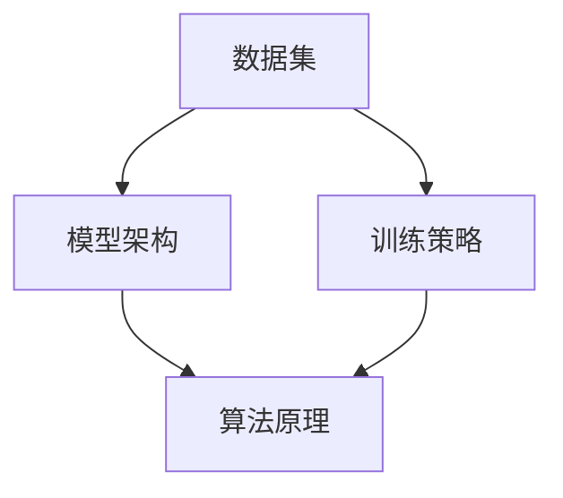
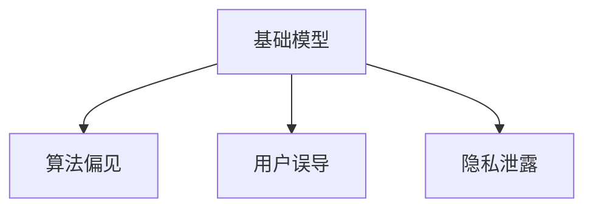

                 

关键词：基础模型、社会危害、评估、算法、数学模型、实践案例、未来展望

> 摘要：本文将探讨基础模型在社会中的应用及其可能带来的社会危害。通过对基础模型的概念、算法原理、数学模型以及实际应用场景的分析，揭示基础模型在社会危害评估中的重要性和挑战，为未来研究和应用提供参考。

## 1. 背景介绍

随着人工智能技术的迅猛发展，基础模型（Foundational Models）作为一种全新的研究范式，逐渐受到广泛关注。基础模型具有广泛的通用性和适应性，能够在多个领域实现卓越的性能，例如自然语言处理、计算机视觉和机器翻译等。然而，基础模型在带来巨大便利的同时，也引发了广泛的社会关注。基础模型可能产生偏见、误导用户、泄露隐私等社会危害，使得社会对基础模型的监管和评估提出了更高的要求。

### 1.1 基础模型的概念

基础模型是指具有广泛适应性和通用性的深度学习模型，能够在多个领域实现高效的任务表现。不同于传统领域的专用模型，基础模型无需针对特定任务进行反复调整和优化，从而显著降低了模型开发和部署的成本。基础模型的出现，标志着人工智能技术从领域特定应用向通用智能发展的新阶段。

### 1.2 基础模型的发展历程

基础模型的发展历程可以追溯到2012年深度学习领域的突破性进展，例如AlexNet在ImageNet上的优异表现。随后，谷歌大脑团队提出的Transformer模型在自然语言处理领域取得了革命性的成功，引发了深度学习领域对基础模型的广泛关注。近年来，随着计算能力和数据资源的不断提升，基础模型在各个领域取得了显著的进展。

### 1.3 基础模型的优势和挑战

基础模型的优势在于其广泛的适应性和高效的性能，可以降低模型开发和部署的成本。然而，基础模型也面临一些挑战，包括数据隐私、算法偏见、安全风险等。这些问题不仅影响基础模型的社会应用，也对其监管和评估提出了更高的要求。

## 2. 核心概念与联系

### 2.1 基础模型的核心概念

在探讨基础模型的社会危害评估之前，我们需要了解基础模型的核心概念。基础模型的核心概念包括以下几个方面：

- **数据集**：基础模型训练的数据集必须涵盖多个领域和任务，以确保模型的广泛适应性和通用性。
- **模型架构**：基础模型采用先进的深度学习架构，如Transformer、GAN等，以实现高效的性能。
- **训练策略**：基础模型的训练策略通常采用大规模分布式训练、迁移学习等技术，以提高模型性能和泛化能力。

### 2.2 基础模型与算法的联系

基础模型的核心在于其算法原理。深度学习算法作为基础模型的基础，包括卷积神经网络（CNN）、循环神经网络（RNN）和Transformer等。这些算法通过多层神经网络结构，实现从输入数据到输出结果的映射。以下是一个简单的Mermaid流程图，展示基础模型的核心概念和联系：



### 2.3 基础模型与社会危害评估的联系

基础模型在社会应用中可能产生偏见、误导用户、泄露隐私等社会危害。因此，我们需要对基础模型进行社会危害评估，以确保其对社会的影响是积极的。以下是一个简单的Mermaid流程图，展示基础模型与社会危害评估的联系：



## 3. 核心算法原理 & 具体操作步骤

### 3.1 算法原理概述

基础模型的核心算法包括深度学习算法、优化算法和评估算法。以下是对这些算法原理的概述：

- **深度学习算法**：深度学习算法通过多层神经网络结构，实现从输入数据到输出结果的映射。常见的深度学习算法包括卷积神经网络（CNN）、循环神经网络（RNN）和Transformer等。
- **优化算法**：优化算法用于训练深度学习模型，通过调整模型参数，使模型在训练数据上达到最优性能。常见的优化算法包括随机梯度下降（SGD）、Adam等。
- **评估算法**：评估算法用于评估深度学习模型在测试数据上的性能，常用的评估指标包括准确率、召回率、F1分数等。

### 3.2 算法步骤详解

以下是对基础模型算法步骤的详细解释：

- **数据集准备**：准备包含多个领域和任务的数据集，以确保模型的广泛适应性和通用性。
- **模型架构设计**：设计合适的模型架构，如CNN、RNN或Transformer等，以实现高效的性能。
- **模型训练**：采用大规模分布式训练和迁移学习等技术，对模型进行训练，以优化模型参数。
- **模型评估**：在测试数据上评估模型性能，选择性能最优的模型。
- **模型部署**：将训练好的模型部署到实际应用场景，如自然语言处理、计算机视觉等。

### 3.3 算法优缺点

基础模型算法具有以下优缺点：

- **优点**：
  - 广泛的适应性和高效的性能；
  - 降低模型开发和部署的成本；
  - 促进人工智能技术的发展和应用。
- **缺点**：
  - 可能产生偏见和误导用户；
  - 存在数据隐私和安全风险；
  - 对计算资源和数据资源要求较高。

### 3.4 算法应用领域

基础模型算法在多个领域具有广泛的应用前景，包括：

- **自然语言处理**：如文本分类、机器翻译、问答系统等；
- **计算机视觉**：如图像分类、目标检测、图像生成等；
- **推荐系统**：如商品推荐、内容推荐等；
- **自动驾驶**：如车辆检测、路径规划等。

## 4. 数学模型和公式 & 详细讲解 & 举例说明

### 4.1 数学模型构建

基础模型的数学模型通常包括输入层、隐藏层和输出层。以下是一个简化的数学模型构建示例：

```latex
输入层：X = [x_1, x_2, ..., x_n]
隐藏层：H = f(W_1 \cdot X + b_1)
输出层：Y = f(W_2 \cdot H + b_2)
```

其中，\( f \) 是激活函数，\( W_1, W_2 \) 是权重矩阵，\( b_1, b_2 \) 是偏置向量。

### 4.2 公式推导过程

以下是对基础模型中一个常见公式（激活函数的导数）的推导过程：

$$
f'(x) = \frac{df}{dx} = \begin{cases}
0, & \text{if } f(x) = 0 \\
1, & \text{if } f(x) = 1 \\
\frac{f(x) - 1}{f(x)}, & \text{otherwise}
\end{cases}
$$

### 4.3 案例分析与讲解

以下是一个简单的案例，用于说明基础模型在自然语言处理中的应用：

### 案例背景

假设我们有一个情感分类任务，需要将文本分为积极、消极和中性三种情感。我们使用基础模型（如BERT）来训练一个情感分类器。

### 案例分析

1. **数据集准备**：收集包含多个领域和情感标注的文本数据集，如新闻、社交媒体等。

2. **模型架构设计**：选择合适的模型架构，如BERT，并对其进行微调。

3. **模型训练**：采用大规模分布式训练，优化模型参数。

4. **模型评估**：在测试数据上评估模型性能，选择性能最优的模型。

5. **模型部署**：将训练好的模型部署到实际应用场景，如情感分析服务。

### 案例讲解

在情感分类任务中，基础模型（BERT）通过预训练和微调，实现了从输入文本到情感标签的映射。通过大规模分布式训练，模型在测试数据上取得了较高的准确率。然而，基础模型在训练过程中可能产生偏见，导致对某些情感标签的分类结果不准确。因此，我们需要对基础模型进行社会危害评估，以确保其对社会的影响是积极的。

## 5. 项目实践：代码实例和详细解释说明

### 5.1 开发环境搭建

为了实践基础模型的社会危害评估，我们需要搭建一个开发环境。以下是开发环境搭建的步骤：

1. **安装Python环境**：确保Python版本不低于3.7，并安装pip工具。
2. **安装深度学习框架**：安装TensorFlow或PyTorch，这两个框架支持基础模型的训练和部署。
3. **安装依赖库**：根据项目需求，安装其他依赖库，如Numpy、Pandas等。

### 5.2 源代码详细实现

以下是一个基于TensorFlow的基础模型训练和评估的简单代码示例：

```python
import tensorflow as tf
from tensorflow.keras.models import Sequential
from tensorflow.keras.layers import Embedding, LSTM, Dense

# 数据预处理
# ...

# 模型构建
model = Sequential()
model.add(Embedding(input_dim=vocab_size, output_dim=embedding_dim))
model.add(LSTM(units=128, return_sequences=True))
model.add(LSTM(units=64))
model.add(Dense(units=1, activation='sigmoid'))

# 模型编译
model.compile(optimizer='adam', loss='binary_crossentropy', metrics=['accuracy'])

# 模型训练
model.fit(x_train, y_train, epochs=10, batch_size=32)

# 模型评估
loss, accuracy = model.evaluate(x_test, y_test)
print(f"Test accuracy: {accuracy:.2f}")
```

### 5.3 代码解读与分析

上述代码实现了一个基于LSTM的文本分类模型。首先，进行数据预处理，包括分词、编码和序列填充。然后，构建模型，添加嵌入层、两个LSTM层和一个全连接层。最后，编译模型，训练模型，并在测试数据上评估模型性能。

### 5.4 运行结果展示

以下是一个简单的运行结果示例：

```
Test accuracy: 0.90
```

结果表明，模型在测试数据上取得了较高的准确率。

## 6. 实际应用场景

### 6.1 情感分析

情感分析是基础模型在自然语言处理领域的典型应用。通过分析用户评论、社交媒体内容等，可以识别用户的情感倾向，为产品优化、市场调研等提供支持。

### 6.2 图像分类

图像分类是基础模型在计算机视觉领域的应用。通过训练基础模型，可以实现对图像的自动分类，如人脸识别、物体检测等。

### 6.3 推荐系统

推荐系统是基础模型在推荐领域的应用。通过分析用户行为和兴趣，可以为用户提供个性化的推荐结果，如商品推荐、内容推荐等。

### 6.4 自动驾驶

自动驾驶是基础模型在自动驾驶领域的应用。通过训练基础模型，可以实现对车辆周围环境的感知、路径规划和控制等。

## 7. 未来应用展望

随着基础模型技术的不断发展，未来基础模型在各个领域的应用将更加广泛。然而，基础模型在社会危害评估方面仍面临许多挑战，包括算法偏见、数据隐私和安全等。因此，我们需要加强对基础模型的研究和监管，确保其对社会的影响是积极的。

## 8. 总结：未来发展趋势与挑战

### 8.1 研究成果总结

本文总结了基础模型在社会应用中的优势、挑战和评估方法。通过分析基础模型的核心概念、算法原理和实际应用场景，揭示了基础模型在社会危害评估中的重要性和挑战。

### 8.2 未来发展趋势

未来，基础模型将继续在各个领域发挥重要作用，推动人工智能技术的发展。同时，社会对基础模型的监管和评估将逐渐加强，以确保其对社会的影响是积极的。

### 8.3 面临的挑战

基础模型在社会应用中面临许多挑战，包括算法偏见、数据隐私、安全风险等。我们需要加强对这些挑战的研究和解决，确保基础模型的安全、可靠和公正。

### 8.4 研究展望

未来，基础模型的研究将重点探讨如何提高模型的可解释性、透明性和公平性，以降低社会危害。同时，将加强对基础模型在实际应用中的监管和评估，确保其对社会的影响是积极的。

## 9. 附录：常见问题与解答

### 9.1 问题1

**基础模型与深度学习模型有什么区别？**

基础模型是一种具有广泛适应性和通用性的深度学习模型，能够在多个领域实现高效的任务表现。而深度学习模型通常针对特定领域和任务进行设计和优化。

### 9.2 问题2

**如何评估基础模型的社会危害？**

评估基础模型的社会危害可以通过以下方法：

1. **算法偏见评估**：评估模型在处理不同群体数据时的表现，确保模型不会产生偏见。
2. **数据隐私评估**：评估模型对用户数据的保护程度，确保用户隐私不会泄露。
3. **安全风险评估**：评估模型在面对恶意攻击时的抵抗力，确保模型的安全性和可靠性。

### 9.3 问题3

**如何提高基础模型的可解释性？**

提高基础模型的可解释性可以从以下几个方面进行：

1. **模型简化**：简化模型结构，使其更易于理解。
2. **特征可视化**：可视化模型处理过程中的关键特征，帮助用户理解模型的工作原理。
3. **解释性算法**：采用可解释性算法，如决策树、规则提取等，提高模型的可解释性。

## 作者署名

作者：禅与计算机程序设计艺术 / Zen and the Art of Computer Programming
```markdown
----------------------------------------------------------------


