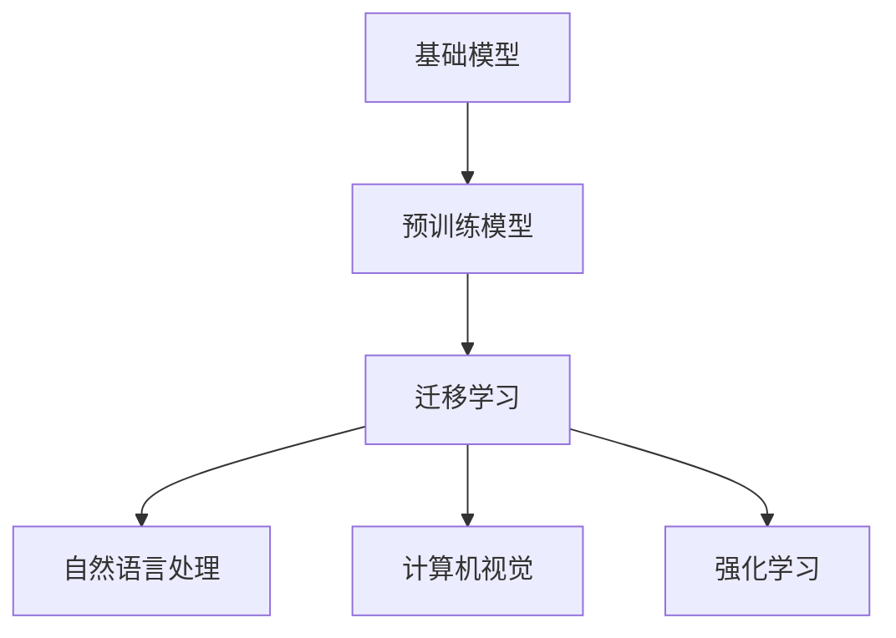

                 

关键词：基础模型，社会影响，人工智能，伦理问题，风险评估

> 摘要：本文将探讨基础模型在社会中的影响，分析其带来的伦理问题，并提出一套科学的风险评估框架。随着人工智能技术的快速发展，基础模型在各个领域的应用日益广泛，其对社会产生的影响不可忽视。本文旨在通过深入分析基础模型的社会影响，为相关研究和政策制定提供参考。

## 1. 背景介绍

近年来，人工智能（AI）技术取得了显著进展，特别是深度学习算法的广泛应用，使得基础模型（Foundational Models）成为可能。基础模型是一种具有广泛知识理解和复杂决策能力的人工智能系统，其核心在于通过大量数据进行自学习和自适应，以实现从单一任务到多任务、从简单任务到复杂任务的跨越。

### 基础模型的发展历程

- **1990年代**：神经网络和机器学习方法开始受到关注，但受限于计算能力和数据量，应用范围有限。
- **2010年代**：随着计算能力和数据资源的提升，深度学习算法得到快速发展，显著提升了AI系统的性能。
- **2020年代**：基于深度学习的预训练模型（如GPT、BERT等）的出现，使得基础模型成为可能。

### 基础模型的应用领域

- **自然语言处理**：基础模型在文本生成、机器翻译、情感分析等方面表现出色。
- **计算机视觉**：基础模型在图像识别、物体检测、图像生成等领域具有广泛的应用。
- **强化学习**：基础模型在游戏、推荐系统、无人驾驶等领域发挥了重要作用。

## 2. 核心概念与联系

### 核心概念

- **基础模型**：具有广泛知识理解和复杂决策能力的人工智能系统。
- **预训练模型**：在大量数据上进行预训练，以获得通用的知识表示和语言理解能力。
- **迁移学习**：将预训练模型的知识迁移到新的任务上，提高新任务的性能。

### 关联图



## 3. 核心算法原理 & 具体操作步骤

### 3.1 算法原理概述

基础模型的算法原理主要基于深度学习和迁移学习。深度学习通过多层神经网络对大量数据进行训练，从而学习到复杂的特征表示。迁移学习则利用预训练模型在特定任务上的知识，迁移到新的任务上，以提高新任务的性能。

### 3.2 算法步骤详解

1. **数据收集**：收集大量与任务相关的数据。
2. **数据预处理**：对数据进行清洗、归一化等处理，以便于模型训练。
3. **模型训练**：使用深度学习算法对数据集进行训练，学习到特征表示。
4. **模型迁移**：将预训练模型的知识迁移到新的任务上。
5. **模型评估**：对迁移后的模型进行评估，验证其在新任务上的性能。

### 3.3 算法优缺点

**优点**：

- **强大的通用性**：基础模型具有广泛的任务适应能力，能够应用于多种领域。
- **高效的性能**：通过迁移学习，基础模型能够快速在新任务上达到高水平的性能。

**缺点**：

- **数据依赖性**：基础模型需要大量数据进行训练，对数据质量和数量有较高要求。
- **可解释性差**：深度学习模型往往缺乏透明度，难以解释其决策过程。

### 3.4 算法应用领域

- **自然语言处理**：文本生成、机器翻译、情感分析等。
- **计算机视觉**：图像识别、物体检测、图像生成等。
- **强化学习**：游戏、推荐系统、无人驾驶等。

## 4. 数学模型和公式 & 详细讲解 & 举例说明

### 4.1 数学模型构建

基础模型的数学模型主要包括神经网络和迁移学习的相关公式。以下是神经网络和迁移学习的主要公式：

#### 神经网络

$$
z = W \cdot x + b
$$

$$
a = \sigma(z)
$$

$$
\delta = \frac{\partial L}{\partial z}
$$

$$
W_{new} = W - \alpha \cdot \frac{\partial L}{\partial W}
$$

#### 迁移学习

$$
L_{new} = L_{base} + \lambda \cdot L_{target}
$$

其中，\(L_{base}\) 是预训练模型的损失函数，\(L_{target}\) 是新任务的损失函数，\(\lambda\) 是调节参数。

### 4.2 公式推导过程

#### 神经网络推导

1. **前向传播**：计算输出和损失函数。
2. **反向传播**：计算梯度，更新模型参数。

#### 迁移学习推导

1. **损失函数**：将预训练模型的损失函数和新任务的损失函数相结合。
2. **梯度计算**：计算整体损失函数的梯度，更新模型参数。

### 4.3 案例分析与讲解

#### 案例一：自然语言处理

假设我们要将一个预训练的GPT模型迁移到一个新的文本生成任务。首先，我们需要收集与文本生成相关的数据集，并对数据进行预处理。然后，我们使用GPT模型在数据集上进行训练，学习到文本的特征表示。接下来，我们将GPT模型的知识迁移到新的文本生成任务，对模型进行评估，验证其在新的任务上的性能。

#### 案例二：计算机视觉

假设我们要将一个预训练的ResNet模型迁移到一个新的图像分类任务。首先，我们需要收集与图像分类相关的数据集，并对数据进行预处理。然后，我们使用ResNet模型在数据集上进行训练，学习到图像的特征表示。接下来，我们将ResNet模型的知识迁移到新的图像分类任务，对模型进行评估，验证其在新的任务上的性能。

## 5. 项目实践：代码实例和详细解释说明

### 5.1 开发环境搭建

在本项目中，我们将使用Python作为编程语言，TensorFlow和PyTorch作为深度学习框架。首先，我们需要安装Python和相关的依赖库。

```bash
pip install tensorflow
pip install pytorch
```

### 5.2 源代码详细实现

以下是使用TensorFlow实现基础模型迁移学习的代码示例。

```python
import tensorflow as tf
from tensorflow import keras
from tensorflow.keras.applications import ResNet50

# 加载预训练的ResNet模型
base_model = ResNet50(weights='imagenet')

# 冻结预训练模型的层
for layer in base_model.layers:
    layer.trainable = False

# 添加新的全连接层
x = base_model.output
x = keras.layers.Dense(1000, activation='softmax')(x)

# 创建迁移学习模型
model = keras.Model(inputs=base_model.input, outputs=x)

# 编译模型
model.compile(optimizer='adam', loss='categorical_crossentropy', metrics=['accuracy'])

# 加载数据集并进行预处理
(train_images, train_labels), (test_images, test_labels) = keras.datasets.cifar10.load_data()
train_images = train_images.astype('float32') / 255.0
test_images = test_images.astype('float32') / 255.0

# 训练迁移学习模型
model.fit(train_images, train_labels, epochs=10, validation_data=(test_images, test_labels))
```

### 5.3 代码解读与分析

1. **加载预训练模型**：使用TensorFlow的`ResNet50`模型作为基础模型。
2. **冻结预训练模型的层**：为了防止预训练模型的权重在迁移学习过程中发生变化，我们需要将预训练模型的层设置为不可训练。
3. **添加新的全连接层**：在预训练模型的输出层上添加新的全连接层，以适应新的任务。
4. **创建迁移学习模型**：使用`keras.Model`创建一个新的迁移学习模型。
5. **编译模型**：设置模型的优化器、损失函数和评估指标。
6. **加载数据集并进行预处理**：加载数据集并进行归一化处理。
7. **训练迁移学习模型**：使用训练数据对迁移学习模型进行训练。

### 5.4 运行结果展示

运行上述代码后，我们将得到迁移学习模型的训练结果。在新的图像分类任务上，模型的表现将取决于数据集的质量和模型的训练过程。

## 6. 实际应用场景

### 6.1 自然语言处理

自然语言处理是基础模型应用最为广泛的领域之一。例如，文本生成、机器翻译、情感分析等任务都取得了显著的成果。然而，基础模型在自然语言处理中的应用也存在一些挑战，如语义理解、多语言处理等。

### 6.2 计算机视觉

计算机视觉是另一个重要的应用领域。例如，图像识别、物体检测、图像生成等任务都取得了重大突破。然而，基础模型在计算机视觉中的应用也存在一些问题，如模型的可解释性、图像质量等。

### 6.3 强化学习

强化学习是基础模型在游戏、推荐系统、无人驾驶等领域的应用。例如，AlphaGo在围棋领域的成功证明了基础模型在强化学习领域的潜力。然而，基础模型在强化学习中的应用仍然面临一些挑战，如探索与利用的平衡、模型的可解释性等。

## 7. 工具和资源推荐

### 7.1 学习资源推荐

1. **深度学习课程**：[《深度学习》（Deep Learning）] 作者：Ian Goodfellow、Yoshua Bengio、Aaron Courville
2. **迁移学习教程**：[《迁移学习》（Transfer Learning for Deep Neural Networks）] 作者：Sajid R. Khan

### 7.2 开发工具推荐

1. **TensorFlow**：https://www.tensorflow.org/
2. **PyTorch**：https://pytorch.org/

### 7.3 相关论文推荐

1. **“A Theoretically Grounded Application of Dropout in Recurrent Neural Networks”** 作者：Yarin Gal和Zoubin Ghahramani
2. **“Large-scale Language Modeling”** 作者：Kaiming He、Xu Wang和Richard S. Zemel

## 8. 总结：未来发展趋势与挑战

### 8.1 研究成果总结

基础模型的研究成果在自然语言处理、计算机视觉、强化学习等领域取得了显著进展，推动了人工智能技术的快速发展。

### 8.2 未来发展趋势

1. **模型的泛化能力**：未来研究将致力于提升基础模型的泛化能力，使其能够更好地适应各种新任务。
2. **模型的可解释性**：研究将关注模型的可解释性，以提高人们对模型决策过程的理解。
3. **多模态学习**：未来研究将探索多模态学习，以实现更高效的跨模态信息融合。

### 8.3 面临的挑战

1. **数据依赖性**：基础模型对数据有较高的依赖性，数据质量和数量对模型性能有重要影响。
2. **计算资源**：基础模型的训练和推理过程需要大量的计算资源，这对计算能力提出了挑战。
3. **伦理问题**：基础模型在应用过程中可能引发伦理问题，如歧视、隐私泄露等，需要引起重视。

### 8.4 研究展望

随着人工智能技术的不断发展，基础模型将发挥越来越重要的作用。未来研究将致力于解决基础模型面临的各种挑战，推动人工智能技术的持续创新。

## 9. 附录：常见问题与解答

### 9.1 什么是基础模型？

基础模型是一种具有广泛知识理解和复杂决策能力的人工智能系统，通过深度学习和迁移学习算法，能够在多种任务上表现出色。

### 9.2 基础模型有哪些优缺点？

**优点**：强大的通用性、高效的性能。

**缺点**：数据依赖性、可解释性差。

### 9.3 基础模型在哪些领域有应用？

基础模型在自然语言处理、计算机视觉、强化学习等领域有广泛应用。

### 9.4 如何进行基础模型的迁移学习？

首先，加载预训练模型；然后，冻结预训练模型的层；接着，添加新的全连接层；最后，编译模型并进行训练。

### 9.5 如何评估基础模型？

可以通过模型在验证集上的表现、交叉验证等方法来评估基础模型。

### 9.6 基础模型有哪些挑战？

挑战包括数据依赖性、计算资源需求、伦理问题等。

---

作者：禅与计算机程序设计艺术 / Zen and the Art of Computer Programming
------------------------------------------------------------------

