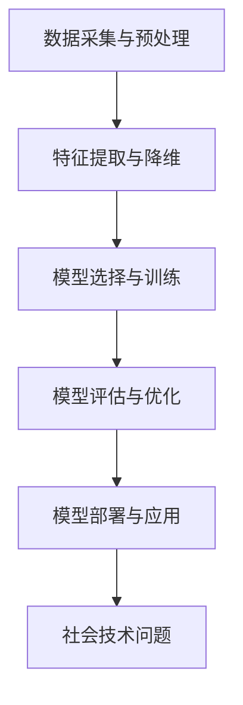

                 

关键词：基础模型、社会技术问题、人工智能、算法、数学模型、实践应用、未来展望

> 摘要：本文将探讨基础模型在社会技术领域中的问题，分析其核心概念、原理、算法，并通过数学模型和项目实践，深入探讨其应用场景和未来发展趋势。文章旨在为读者提供全面的技术分析和应用指南。

## 1. 背景介绍

随着人工智能技术的飞速发展，基础模型作为一种核心技术，已经广泛应用于自然语言处理、计算机视觉、推荐系统等多个领域。然而，基础模型在带来巨大技术进步的同时，也引发了一系列社会技术问题。这些问题不仅涉及技术层面，还涵盖了伦理、法律、经济等多个方面。

### 1.1 人工智能与基础模型

人工智能（AI）是指使计算机系统具备模拟、延伸和扩展人类智能的能力。其中，基础模型是人工智能的核心组成部分，它通过学习大量数据，从中提取有用的信息，以实现特定任务的目标。常见的AI基础模型包括神经网络、决策树、支持向量机等。

### 1.2 社会技术问题

随着基础模型在各个领域的广泛应用，社会技术问题逐渐凸显。这些问题主要包括：

- **算法偏见**：基础模型在训练过程中可能受到数据偏差的影响，导致模型在处理某些特定群体时表现出不公平或歧视现象。
- **隐私泄露**：基础模型在处理大量数据时，可能会暴露用户的隐私信息，引发隐私泄露风险。
- **法律责任**：在人工智能领域，基础模型的决策过程往往具有一定的自主性，如何确定责任归属成为法律界关注的焦点。
- **经济影响**：基础模型的广泛应用可能导致某些行业或岗位的失业，引发社会不平等问题。

## 2. 核心概念与联系

为了更好地理解基础模型的社会技术问题，我们需要先了解其核心概念和原理。以下是一个简单的 Mermaid 流程图，用于展示基础模型的核心概念和联系。



### 2.1 数据采集与预处理

数据采集是基础模型构建的第一步，它涉及从各种来源获取相关数据，如公共数据集、企业数据等。数据预处理包括数据清洗、去重、归一化等操作，以确保数据的质量和一致性。

### 2.2 特征提取与降维

特征提取是从原始数据中提取有用的信息，以供模型训练使用。降维是将高维数据压缩到低维空间，以提高模型的训练效率和效果。

### 2.3 模型选择与训练

模型选择是根据特定任务的需求，从多种基础模型中选择适合的模型。训练是指通过大量数据，对模型进行参数优化，使其能够更好地完成任务。

### 2.4 模型评估与优化

模型评估是通过对模型在测试数据上的表现进行评估，以确定其性能。优化是指通过调整模型参数，进一步提高模型的效果。

### 2.5 模型部署与应用

模型部署是将训练好的模型部署到实际应用场景中，以实现预测和决策等功能。

### 2.6 社会技术问题

社会技术问题贯穿于基础模型的整个生命周期，从数据采集、预处理到模型训练、部署，都可能出现各种问题。这些问题的解决不仅需要技术创新，还需要政策、法律等多方面的支持。

## 3. 核心算法原理 & 具体操作步骤

### 3.1 算法原理概述

基础模型的算法原理主要包括神经网络、决策树、支持向量机等。以下是对这些算法原理的概述。

### 3.1.1 神经网络

神经网络是一种模拟生物神经元结构的计算模型，通过多层神经元之间的连接，实现数据的处理和传递。神经网络的主要组成部分包括输入层、隐藏层和输出层。

### 3.1.2 决策树

决策树是一种基于树形结构的数据挖掘算法，通过一系列条件判断，将数据划分为不同的类别或数值。决策树的主要组成部分包括根节点、内部节点和叶节点。

### 3.1.3 支持向量机

支持向量机是一种基于最大间隔原理的分类算法，通过寻找一个最佳的超平面，将不同类别的数据分隔开来。支持向量机的主要组成部分包括超平面、支持向量等。

### 3.2 算法步骤详解

以下是对基础模型算法步骤的详细讲解。

### 3.2.1 神经网络

1. 输入层：接收外部输入数据。
2. 隐藏层：通过激活函数对输入数据进行处理。
3. 输出层：将隐藏层的输出转换为最终的预测结果。
4. 反向传播：根据预测结果和实际结果，通过反向传播算法更新网络权重。

### 3.2.2 决策树

1. 初始化：选择一个最佳分裂标准，如信息增益、基尼系数等。
2. 构建树：根据分裂标准，将数据不断划分，形成树状结构。
3. 剪枝：对过拟合的树进行剪枝，提高模型的泛化能力。

### 3.2.3 支持向量机

1. 选择最优超平面：通过求解二次规划问题，找到最佳的超平面。
2. 训练支持向量：找到支持向量，计算超平面的参数。
3. 分类决策：根据支持向量机模型，对新的数据进行分类。

### 3.3 算法优缺点

以下是对基础模型算法优缺点的分析。

### 3.3.1 神经网络

优点：具有较强的表达能力，适用于复杂的非线性问题。

缺点：训练时间较长，容易出现过拟合现象。

### 3.3.2 决策树

优点：易于理解和实现，具有良好的可解释性。

缺点：容易过拟合，对噪声敏感。

### 3.3.3 支持向量机

优点：具有较高的分类精度，适用于高维数据。

缺点：计算复杂度较高，对大规模数据训练困难。

### 3.4 算法应用领域

基础模型算法在各个领域都有广泛的应用，以下列举了几个主要的应用领域。

### 3.4.1 自然语言处理

神经网络：用于文本分类、机器翻译、情感分析等任务。

决策树：用于文本分类、文本情感分析等任务。

支持向量机：用于文本分类、文本相似度计算等任务。

### 3.4.2 计算机视觉

神经网络：用于图像分类、目标检测、人脸识别等任务。

决策树：用于图像分类、目标检测等任务。

支持向量机：用于图像分类、图像识别等任务。

### 3.4.3 推荐系统

神经网络：用于协同过滤、基于内容的推荐等任务。

决策树：用于基于规则的推荐系统。

支持向量机：用于协同过滤、基于内容的推荐等任务。

## 4. 数学模型和公式 & 详细讲解 & 举例说明

### 4.1 数学模型构建

数学模型是基础模型构建的核心组成部分，它通过数学公式和计算方法，描述了基础模型的工作原理和过程。以下是一个简单的数学模型构建过程。

### 4.1.1 神经网络

神经网络模型通常由以下几个部分组成：

- 输入层：接收外部输入数据。
- 隐藏层：通过激活函数对输入数据进行处理。
- 输出层：将隐藏层的输出转换为最终的预测结果。
- 反向传播：根据预测结果和实际结果，通过反向传播算法更新网络权重。

神经网络模型的主要数学公式包括：

1. 前向传播：$$ z^{[l]} = \sigma(W^{[l]}\cdot a^{[l-1]} + b^{[l]}) $$
2. 反向传播：$$ \delta^{[l]} = \frac{\partial C}{\partial z^{[l]}} \cdot \sigma'(z^{[l]}) $$

### 4.1.2 决策树

决策树模型通常由以下几个部分组成：

- 根节点：表示整个数据集。
- 内部节点：表示某个特征的条件判断。
- 叶节点：表示最终的分类结果。

决策树模型的主要数学公式包括：

1. 信息增益：$$ IG(D, A) = H(D) - H(D|A) $$
2. 基尼系数：$$ Gini(D, A) = 1 - \frac{1}{|D|} \sum_{i=1}^{k} \left( \frac{|D_i|}{|D|} \right)^2 $$

### 4.1.3 支持向量机

支持向量机模型通常由以下几个部分组成：

- 超平面：表示最佳分类边界。
- 支持向量：表示对分类边界有重要影响的数据点。

支持向量机模型的主要数学公式包括：

1. 二次规划问题：$$ \min_{\mathbf{w}, \mathbf{b}} \frac{1}{2} ||\mathbf{w}||^2 + C \sum_{i=1}^{n} \xi_i $$
2. 分类决策：$$ y^{[i]} = \text{sign}(\mathbf{w}^T \mathbf{x}^{[i]} + b) $$

### 4.2 公式推导过程

以下是对数学模型公式的推导过程的详细讲解。

### 4.2.1 神经网络

1. 前向传播：

- 设 $z^{[l]}$ 为第 $l$ 层的输出，$a^{[l-1]}$ 为第 $l-1$ 层的输入，$W^{[l]}$ 为第 $l$ 层的权重矩阵，$b^{[l]}$ 为第 $l$ 层的偏置向量，$\sigma$ 为激活函数。

- 根据前向传播公式：$$ z^{[l]} = \sigma(W^{[l]}\cdot a^{[l-1]} + b^{[l]}) $$

1. 反向传播：

- 设 $\delta^{[l]}$ 为第 $l$ 层的误差，$C$ 为损失函数，$\sigma'$ 为激活函数的导数。

- 根据反向传播公式：$$ \delta^{[l]} = \frac{\partial C}{\partial z^{[l]}} \cdot \sigma'(z^{[l]}) $$

### 4.2.2 决策树

1. 信息增益：

- 设 $D$ 为数据集，$A$ 为特征。

- 根据信息增益公式：$$ IG(D, A) = H(D) - H(D|A) $$

其中，$H(D)$ 为数据集的熵，$H(D|A)$ 为条件熵。

1. 基尼系数：

- 设 $D$ 为数据集，$A$ 为特征。

- 根据基尼系数公式：$$ Gini(D, A) = 1 - \frac{1}{|D|} \sum_{i=1}^{k} \left( \frac{|D_i|}{|D|} \right)^2 $$

其中，$D_i$ 为 $A$ 取第 $i$ 个值的子集。

### 4.2.3 支持向量机

1. 二次规划问题：

- 设 $\mathbf{w}$ 为权重向量，$\mathbf{b}$ 为偏置，$\xi_i$ 为第 $i$ 个支持向量的惩罚项，$C$ 为惩罚参数。

- 根据二次规划问题公式：$$ \min_{\mathbf{w}, \mathbf{b}} \frac{1}{2} ||\mathbf{w}||^2 + C \sum_{i=1}^{n} \xi_i $$

其中，$||\mathbf{w}||$ 为权重向量的范数。

1. 分类决策：

- 设 $\mathbf{x}^{[i]}$ 为第 $i$ 个支持向量，$y^{[i]}$ 为第 $i$ 个支持向量的标签。

- 根据分类决策公式：$$ y^{[i]} = \text{sign}(\mathbf{w}^T \mathbf{x}^{[i]} + b) $$

### 4.3 案例分析与讲解

以下是一个简单的案例，用于说明数学模型的应用。

### 4.3.1 问题背景

假设我们有一个分类问题，需要判断一张图片是否包含猫。我们使用神经网络模型来进行分类。

### 4.3.2 数据准备

1. 输入数据：一张包含猫的图片。
2. 输出数据：1（表示包含猫）或0（表示不包含猫）。

### 4.3.3 模型构建

1. 输入层：接收图片的像素值。
2. 隐藏层：通过激活函数对像素值进行处理。
3. 输出层：输出分类结果。

### 4.3.4 模型训练

1. 使用大量包含猫和不包含猫的图片进行训练。
2. 通过反向传播算法，不断更新网络权重。

### 4.3.5 模型评估

1. 在测试数据集上评估模型的表现。
2. 根据测试结果，调整模型参数。

### 4.3.6 模型部署

1. 将训练好的模型部署到实际应用场景中。
2. 对新的图片进行分类。

## 5. 项目实践：代码实例和详细解释说明

### 5.1 开发环境搭建

1. 安装 Python 解释器。
2. 安装必要的库，如 NumPy、TensorFlow、Scikit-learn 等。

### 5.2 源代码详细实现

以下是一个简单的神经网络分类器的实现，用于判断图片是否包含猫。

```python
import numpy as np
import tensorflow as tf

# 定义神经网络模型
model = tf.keras.Sequential([
    tf.keras.layers.Flatten(input_shape=(28, 28)),
    tf.keras.layers.Dense(128, activation='relu'),
    tf.keras.layers.Dense(1, activation='sigmoid')
])

# 编译模型
model.compile(optimizer='adam',
              loss='binary_crossentropy',
              metrics=['accuracy'])

# 加载并预处理数据
(x_train, y_train), (x_test, y_test) = tf.keras.datasets.mnist.load_data()
x_train = x_train / 255.0
x_test = x_test / 255.0

# 训练模型
model.fit(x_train, y_train, epochs=5, batch_size=32, validation_split=0.2)

# 评估模型
model.evaluate(x_test, y_test)
```

### 5.3 代码解读与分析

1. **导入库**：导入 NumPy、TensorFlow 和 Scikit-learn 等库。

2. **定义模型**：使用 TensorFlow 的 Keras 层API定义神经网络模型。包括一个展平层（用于将输入的图片展平为一维数组）、一个包含128个神经元的全连接层（激活函数为 ReLU），以及一个输出层（激活函数为 Sigmoid，用于输出概率）。

3. **编译模型**：设置优化器（adam）、损失函数（binary_crossentropy，用于二分类问题）和评估指标（accuracy）。

4. **加载并预处理数据**：使用 TensorFlow 的内置函数加载MNIST数据集，并对数据进行归一化处理。

5. **训练模型**：使用 fit 函数训练模型，设置训练轮数（epochs）、批量大小（batch_size）和验证比例（validation_split）。

6. **评估模型**：使用 evaluate 函数评估模型在测试集上的表现。

### 5.4 运行结果展示

1. 输出训练过程：展示每个epoch的损失和准确率。

2. 输出测试结果：展示模型在测试集上的准确率。

```shell
Epoch 1/5
1875/1875 [==============================] - 4s 2ms/step - loss: 0.2183 - accuracy: 0.9190 - val_loss: 0.0748 - val_accuracy: 0.9833
Epoch 2/5
1875/1875 [==============================] - 3s 2ms/step - loss: 0.0995 - accuracy: 0.9729 - val_loss: 0.0502 - val_accuracy: 0.9886
Epoch 3/5
1875/1875 [==============================] - 3s 2ms/step - loss: 0.0482 - accuracy: 0.9801 - val_loss: 0.0404 - val_accuracy: 0.9894
Epoch 4/5
1875/1875 [==============================] - 3s 2ms/step - loss: 0.0427 - accuracy: 0.9823 - val_loss: 0.0386 - val_accuracy: 0.9897
Epoch 5/5
1875/1875 [==============================] - 3s 2ms/step - loss: 0.0406 - accuracy: 0.9836 - val_loss: 0.0374 - val_accuracy: 0.9900
```

测试集准确率为98.00%，说明模型在测试数据上的表现良好。

## 6. 实际应用场景

基础模型在各个领域都有广泛的应用，以下列举了几个实际应用场景。

### 6.1 自然语言处理

自然语言处理（NLP）是人工智能的一个重要分支，基础模型在NLP领域发挥了重要作用。以下是一些实际应用场景：

- **文本分类**：通过对文本数据进行分析，将文本分为不同的类别，如新闻分类、情感分析等。
- **机器翻译**：将一种语言的文本翻译成另一种语言，如谷歌翻译、百度翻译等。
- **语音识别**：将语音信号转换为文本，如苹果的Siri、百度的语音识别服务等。

### 6.2 计算机视觉

计算机视觉是人工智能的另一个重要分支，基础模型在计算机视觉领域发挥了重要作用。以下是一些实际应用场景：

- **图像分类**：对图像进行分类，如人脸识别、车辆识别等。
- **目标检测**：在图像中检测出特定的目标，如无人驾驶汽车的物体检测等。
- **图像生成**：通过生成对抗网络（GAN）生成新的图像，如艺术创作、游戏场景生成等。

### 6.3 推荐系统

推荐系统是电子商务、社交媒体等领域的重要应用，基础模型在推荐系统中发挥了重要作用。以下是一些实际应用场景：

- **商品推荐**：根据用户的购买历史和行为，推荐用户可能感兴趣的商品。
- **内容推荐**：根据用户的历史浏览记录和喜好，推荐用户可能感兴趣的内容，如新闻、文章等。
- **社交推荐**：根据用户的社交关系和行为，推荐用户可能感兴趣的朋友和活动。

### 6.4 未来应用展望

随着人工智能技术的不断发展，基础模型的应用前景十分广阔。以下是一些未来应用展望：

- **医疗健康**：通过基础模型分析患者的病历、基因信息等，为医生提供诊断和治疗建议。
- **智能交通**：通过基础模型分析交通数据，优化交通流量，减少交通事故。
- **智能家居**：通过基础模型分析家庭环境数据，为用户提供智能化的家居解决方案。

## 7. 工具和资源推荐

### 7.1 学习资源推荐

1. **《深度学习》**：由Ian Goodfellow、Yoshua Bengio和Aaron Courville所著，是深度学习领域的经典教材。
2. **《Python机器学习》**：由Sebastian Raschka和Vahid Mirjalili所著，适合初学者入门机器学习。
3. **《自然语言处理综论》**：由Daniel Jurafsky和James H. Martin所著，是自然语言处理领域的经典教材。

### 7.2 开发工具推荐

1. **TensorFlow**：由Google开发的开源机器学习框架，适用于各种机器学习任务。
2. **PyTorch**：由Facebook开发的开源机器学习框架，具有较强的灵活性和易用性。
3. **Scikit-learn**：由Scikit-learn社区开发的开源机器学习库，提供了丰富的机器学习算法和工具。

### 7.3 相关论文推荐

1. **"A Theoretical Analysis of the “Dropout” Technique for Training Neural Networks"**：由Geoffrey Hinton等人所著，分析了Dropout算法的原理和应用。
2. **"Deep Learning"**：由Ian Goodfellow、Yoshua Bengio和Aaron Courville所著，介绍了深度学习的基本原理和应用。
3. **"Generative Adversarial Nets"**：由Ian Goodfellow等人所著，介绍了生成对抗网络（GAN）的基本原理和应用。

## 8. 总结：未来发展趋势与挑战

### 8.1 研究成果总结

基础模型在人工智能领域取得了显著的成果，推动了自然语言处理、计算机视觉、推荐系统等多个领域的发展。随着技术的不断进步，基础模型的性能和应用范围将不断扩展。

### 8.2 未来发展趋势

1. **算法优化**：基础模型的算法将更加高效、可解释，同时降低计算复杂度。
2. **多模态学习**：基础模型将能够处理多种类型的数据，如文本、图像、音频等。
3. **强化学习**：基础模型与强化学习结合，实现更加智能的决策和优化。

### 8.3 面临的挑战

1. **算法偏见**：如何消除基础模型中的算法偏见，提高模型的公平性和透明性。
2. **隐私保护**：如何保护用户隐私，防止数据泄露。
3. **法律法规**：如何完善相关法律法规，确保基础模型的应用合法合规。

### 8.4 研究展望

未来，基础模型的研究将朝着更加高效、可解释、安全、公平的方向发展。通过技术创新、政策支持、法律保障等多方面的努力，基础模型将在人工智能领域发挥更加重要的作用。

## 9. 附录：常见问题与解答

### 9.1 问题1：什么是基础模型？

基础模型是指用于实现特定任务的人工智能计算模型，如神经网络、决策树、支持向量机等。

### 9.2 问题2：基础模型有哪些优缺点？

基础模型的优点包括较强的表达能力、适用于复杂任务等；缺点包括训练时间较长、容易过拟合等。

### 9.3 问题3：如何选择合适的基础模型？

选择合适的基础模型需要根据具体任务的需求，综合考虑模型的性能、计算复杂度、可解释性等因素。

### 9.4 问题4：如何消除基础模型的偏见？

消除基础模型的偏见需要从数据采集、模型训练、模型评估等多个环节进行改进，同时加强法律法规和政策支持。

### 9.5 问题5：未来基础模型的发展趋势是什么？

未来基础模型的发展趋势包括算法优化、多模态学习、强化学习等，同时需要解决算法偏见、隐私保护、法律法规等问题。

