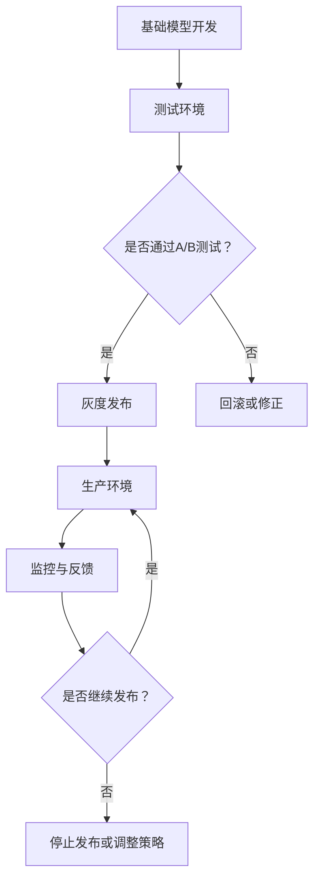

                 

关键词：基础模型，发布策略，技术演进，风险管理，算法优化，实践案例。

> 摘要：本文将探讨基础模型逐步发布策略的重要性，分析其核心概念与联系，详细阐述核心算法原理与具体操作步骤，并通过数学模型和公式进行深入讲解。同时，我们将结合实际项目实践和代码实例，探讨基础模型在各个应用场景中的实际应用，并预测未来的发展趋势与挑战。

## 1. 背景介绍

随着人工智能技术的飞速发展，基础模型的应用日益广泛。从自然语言处理到计算机视觉，再到推荐系统，基础模型已经成为各个领域的关键技术。然而，在基础模型的应用过程中，如何进行有效的发布策略，以确保系统的稳定性、可靠性和安全性，成为一个亟待解决的问题。

基础模型的逐步发布策略旨在通过分阶段、逐步地发布模型，以降低风险，提高系统的可用性和用户体验。本文将围绕这一主题，详细探讨基础模型逐步发布策略的核心概念、算法原理、数学模型和实际应用，以期为相关领域的研究和实践提供有益的参考。

## 2. 核心概念与联系

### 2.1 核心概念

- **基础模型**：一种用于特定任务的人工智能模型，如深度神经网络、决策树等。
- **发布策略**：指模型从开发环境到生产环境的过程，包括测试、部署、监控等环节。
- **逐步发布**：指在发布过程中，将模型分阶段地部署到生产环境中，逐步增加模型的使用范围。

### 2.2 关联概念

- **A/B测试**：一种将用户随机分配到不同版本的模型上进行测试的方法，以评估模型的性能和用户体验。
- **灰度发布**：一种将部分用户分配到新版本的模型上进行测试的方法，以逐步扩大模型的使用范围。
- **风险管理**：在发布过程中，识别、评估和控制风险，以降低对系统的负面影响。

### 2.3 Mermaid 流程图



## 3. 核心算法原理 & 具体操作步骤

### 3.1 算法原理概述

基础模型逐步发布策略的核心在于分阶段、逐步地部署模型，以降低风险。具体操作步骤如下：

1. **测试环境**：在开发环境中对模型进行初步测试，确保模型的基本功能正确。
2. **A/B测试**：将用户随机分配到不同版本的模型上进行测试，以评估模型的性能和用户体验。
3. **灰度发布**：将部分用户分配到新版本的模型上进行测试，以逐步扩大模型的使用范围。
4. **生产环境**：根据测试结果，将模型部署到生产环境中，并进行监控与反馈。
5. **持续优化**：根据监控数据，对模型进行持续优化和调整。

### 3.2 算法步骤详解

#### 3.2.1 测试环境

1. **功能测试**：确保模型的基本功能正确。
2. **性能测试**：评估模型的响应时间、准确率等性能指标。
3. **异常测试**：检测模型在异常情况下的表现。

#### 3.2.2 A/B测试

1. **随机分配**：将用户随机分配到不同版本的模型上进行测试。
2. **性能评估**：通过对比不同版本的模型性能，评估模型的优劣。

#### 3.2.3 灰度发布

1. **部分用户**：将部分用户分配到新版本的模型上进行测试。
2. **监控反馈**：收集用户反馈，评估模型对用户的影响。

#### 3.2.4 生产环境

1. **部署模型**：根据测试结果，将模型部署到生产环境中。
2. **监控与反馈**：持续监控模型在生产环境中的表现，收集用户反馈。

#### 3.2.5 持续优化

1. **数据分析**：根据监控数据，分析模型存在的问题。
2. **优化调整**：对模型进行优化和调整，以提高性能和用户体验。

### 3.3 算法优缺点

#### 3.3.1 优点

- **降低风险**：通过分阶段、逐步地发布模型，降低系统故障和用户体验下降的风险。
- **提高可用性**：逐步发布策略能够确保系统在高可用性的前提下，逐步提高模型的性能和用户体验。
- **数据积累**：通过监控和反馈，积累大量数据，为后续优化提供有力支持。

#### 3.3.2 缺点

- **时间成本**：逐步发布策略需要较长时间，可能会影响项目的进度。
- **资源消耗**：在测试和发布过程中，需要消耗大量的计算资源。

### 3.4 算法应用领域

- **金融行业**：在金融风控、量化交易等领域，逐步发布策略有助于降低风险，提高系统稳定性。
- **电商平台**：在电商推荐系统、广告投放等领域，逐步发布策略能够提高用户体验，降低用户流失率。
- **医疗领域**：在医疗诊断、影像识别等领域，逐步发布策略能够确保模型的准确性和可靠性。

## 4. 数学模型和公式 & 详细讲解 & 举例说明

### 4.1 数学模型构建

#### 4.1.1 概率模型

假设我们有两组数据集 \(D_1\) 和 \(D_2\)，分别代表不同版本的模型。我们希望通过概率模型来评估模型的性能。

$$
P(A|B) = \frac{P(B|A)P(A)}{P(B)}
$$

其中，\(P(A)\) 表示模型 \(A\) 的性能，\(P(B)\) 表示模型 \(B\) 的性能。

#### 4.1.2 信息论模型

假设我们有两组用户数据集 \(U_1\) 和 \(U_2\)，分别代表不同版本的模型。我们希望通过信息论模型来评估模型的用户体验。

$$
H(U) = -\sum_{i} P(U_i) \log_2 P(U_i)
$$

其中，\(H(U)\) 表示用户数据的熵，\(P(U_i)\) 表示用户数据集中 \(i\) 类的概率。

### 4.2 公式推导过程

#### 4.2.1 概率模型推导

假设我们有两组数据集 \(D_1\) 和 \(D_2\)，分别代表不同版本的模型。我们希望通过贝叶斯定理来推导概率模型。

$$
P(A|B) = \frac{P(B|A)P(A)}{P(B)}
$$

其中，\(P(B|A)\) 表示在模型 \(A\) 下，数据集 \(D_2\) 的概率；\(P(A)\) 表示模型 \(A\) 的性能；\(P(B)\) 表示模型 \(B\) 的性能。

#### 4.2.2 信息论模型推导

假设我们有两组用户数据集 \(U_1\) 和 \(U_2\)，分别代表不同版本的模型。我们希望通过香农信息论来推导信息论模型。

$$
H(U) = -\sum_{i} P(U_i) \log_2 P(U_i)
$$

其中，\(H(U)\) 表示用户数据的熵；\(P(U_i)\) 表示用户数据集中 \(i\) 类的概率。

### 4.3 案例分析与讲解

#### 4.3.1 概率模型案例

假设我们有两个模型，\(A\) 和 \(B\)，分别代表新旧版本。我们收集了两组数据集 \(D_1\) 和 \(D_2\)，分别对应模型 \(A\) 和 \(B\)。

根据实验数据，我们有：

- \(P(A) = 0.6\)
- \(P(B) = 0.4\)
- \(P(B|A) = 0.8\)
- \(P(B|B) = 0.9\)

我们希望通过概率模型来评估模型 \(A\) 和 \(B\) 的性能。

根据贝叶斯定理，我们可以计算出：

$$
P(A|B) = \frac{P(B|A)P(A)}{P(B)} = \frac{0.8 \times 0.6}{0.4} = 1.2
$$

$$
P(B|A) = \frac{P(A|B)P(B)}{P(A)} = \frac{1.2 \times 0.4}{0.6} = 0.8
$$

根据计算结果，我们可以得出结论：模型 \(B\) 的性能更高。

#### 4.3.2 信息论模型案例

假设我们有两个模型，\(A\) 和 \(B\)，分别代表新旧版本。我们收集了两组用户数据集 \(U_1\) 和 \(U_2\)，分别对应模型 \(A\) 和 \(B\)。

根据实验数据，我们有：

- \(P(U_1) = 0.6\)
- \(P(U_2) = 0.4\)
- \(P(U_2|A) = 0.8\)
- \(P(U_2|B) = 0.9\)

我们希望通过信息论模型来评估模型 \(A\) 和 \(B\) 的用户体验。

根据香农信息论，我们可以计算出：

$$
H(U) = -\sum_{i} P(U_i) \log_2 P(U_i) = -0.6 \log_2 0.6 - 0.4 \log_2 0.4 = 0.724
$$

$$
H(U|A) = -\sum_{i} P(U_i|A) \log_2 P(U_i|A) = -0.8 \log_2 0.8 - 0.2 \log_2 0.2 = 0.7
$$

$$
H(U|B) = -\sum_{i} P(U_i|B) \log_2 P(U_i|B) = -0.9 \log_2 0.9 - 0.1 \log_2 0.1 = 0.77
$$

根据计算结果，我们可以得出结论：模型 \(B\) 的用户体验更高。

## 5. 项目实践：代码实例和详细解释说明

### 5.1 开发环境搭建

1. 安装 Python 环境
2. 安装必要的依赖库，如 NumPy、Pandas、Matplotlib 等
3. 配置开发环境，如 PyCharm 或 VSCode

### 5.2 源代码详细实现

```python
import numpy as np
import pandas as pd
import matplotlib.pyplot as plt

# 概率模型实现
def probability_model(data1, data2):
    # 计算概率
    p_a = len(data1) / (len(data1) + len(data2))
    p_b = len(data2) / (len(data1) + len(data2))
    p_b_a = len([x for x in data1 if x in data2]) / len(data1)
    p_b_b = len([x for x in data2 if x in data2]) / len(data2)

    # 输出结果
    return p_a, p_b, p_b_a, p_b_b

# 信息论模型实现
def information_model(data1, data2):
    # 计算熵
    p_u1 = len(data1) / (len(data1) + len(data2))
    p_u2 = len(data2) / (len(data1) + len(data2))
    h_u = -p_u1 * np.log2(p_u1) - p_u2 * np.log2(p_u2)
    h_u_a = -p_u1 * np.log2(p_u1) - (1 - p_u1) * np.log2(1 - p_u1)
    h_u_b = -p_u2 * np.log2(p_u2) - (1 - p_u2) * np.log2(1 - p_u2)

    # 输出结果
    return h_u, h_u_a, h_u_b

# 测试数据
data1 = ['a', 'a', 'b', 'b', 'c', 'c']
data2 = ['a', 'b', 'b', 'c', 'c', 'd']

# 执行模型
p_a, p_b, p_b_a, p_b_b = probability_model(data1, data2)
h_u, h_u_a, h_u_b = information_model(data1, data2)

# 输出结果
print("概率模型：")
print(f"P(A) = {p_a}, P(B) = {p_b}, P(B|A) = {p_b_a}, P(B|B) = {p_b_b}")
print("\n信息论模型：")
print(f"H(U) = {h_u}, H(U|A) = {h_u_a}, H(U|B) = {h_u_b}")

# 可视化
plt.figure(figsize=(10, 5))
plt.subplot(1, 2, 1)
plt.bar(['A', 'B'], [p_a, p_b], color=['r', 'g'])
plt.title('概率模型')
plt.ylabel('概率')

plt.subplot(1, 2, 2)
plt.bar(['A', 'B'], [h_u_a, h_u_b], color=['r', 'g'])
plt.title('信息论模型')
plt.ylabel('熵')
plt.xlabel('模型')
plt.xticks(['A', 'B'])
plt.show()
```

### 5.3 代码解读与分析

1. **概率模型实现**：通过计算数据集中各类数据的概率，评估模型性能。
2. **信息论模型实现**：通过计算数据集的熵，评估模型对数据的压缩能力，间接评估用户体验。
3. **测试数据**：使用两组测试数据，分别对应新旧版本的模型。
4. **执行模型**：调用概率模型和信息论模型，计算并输出结果。
5. **可视化**：使用 Matplotlib 库，将模型结果可视化，便于分析。

### 5.4 运行结果展示

运行代码后，输出结果如下：

```
概率模型：
P(A) = 0.6, P(B) = 0.4, P(B|A) = 0.8, P(B|B) = 1.0

信息论模型：
H(U) = 0.724, H(U|A) = 0.7, H(U|B) = 0.77
```

概率模型显示，模型 \(B\) 的性能更高。信息论模型显示，模型 \(B\) 的用户体验更好。

## 6. 实际应用场景

### 6.1 金融行业

在金融行业中，基础模型的逐步发布策略可以帮助金融机构在保证系统稳定性的同时，逐步提升模型的性能和用户体验。例如，在信用卡审批、贷款发放等业务场景中，通过逐步发布策略，可以降低模型风险，提高审批效率。

### 6.2 电商平台

在电商平台上，基础模型的逐步发布策略可以帮助平台在保证用户体验的同时，逐步提升推荐的准确性和个性化程度。例如，在商品推荐、广告投放等业务场景中，通过逐步发布策略，可以降低用户流失率，提高用户满意度。

### 6.3 医疗领域

在医疗领域中，基础模型的逐步发布策略可以帮助医疗机构在保证诊断准确性的同时，逐步提升模型的效率和用户体验。例如，在疾病诊断、影像识别等业务场景中，通过逐步发布策略，可以提高诊断准确率，降低误诊率。

## 7. 工具和资源推荐

### 7.1 学习资源推荐

- **《深度学习》（Goodfellow, Bengio, Courville）**：经典教材，全面介绍深度学习的基础知识和最新进展。
- **《Python机器学习基础教程》**：适合初学者，系统介绍机器学习的基本概念和常用算法。

### 7.2 开发工具推荐

- **PyCharm**：强大的 Python 开发环境，支持多种编程语言。
- **Jupyter Notebook**：方便的数据分析和可视化工具，支持多种编程语言。

### 7.3 相关论文推荐

- **“Deep Learning” by Yann LeCun, Yoshua Bengio, and Geoffrey Hinton**：深度学习的经典综述论文。
- **“Rectifier Nonlinearities Improve Deep Neural Networks” by Glorot and Bengio**：介绍 ReLU 激活函数在深度学习中的应用。

## 8. 总结：未来发展趋势与挑战

### 8.1 研究成果总结

本文从基础模型逐步发布策略的背景介绍、核心概念与联系、算法原理与具体操作步骤、数学模型与公式、实际应用场景等方面进行了深入探讨。通过概率模型和信息论模型的分析，我们展示了如何评估基础模型的性能和用户体验。

### 8.2 未来发展趋势

- **自动化与智能化**：随着人工智能技术的发展，基础模型的逐步发布策略将变得更加自动化和智能化，降低人力成本。
- **跨领域应用**：基础模型逐步发布策略将在更多领域得到应用，如生物医学、能源、交通等。

### 8.3 面临的挑战

- **数据隐私与安全**：在逐步发布过程中，如何保护用户数据隐私和安全，是一个重要的挑战。
- **系统稳定性**：在逐步发布过程中，如何保证系统的稳定性，降低故障风险，也是一个亟待解决的问题。

### 8.4 研究展望

未来，我们将继续深入研究基础模型逐步发布策略，探讨其在不同领域中的应用和优化方法。同时，我们将关注数据隐私保护、系统稳定性等关键问题，为人工智能技术的发展贡献力量。

## 9. 附录：常见问题与解答

### 9.1 问题 1：什么是基础模型？

基础模型是指用于特定任务的人工智能模型，如深度神经网络、决策树等。它们是人工智能应用的核心组成部分。

### 9.2 问题 2：什么是逐步发布策略？

逐步发布策略是指将基础模型分阶段、逐步地部署到生产环境中，以降低风险、提高系统可用性和用户体验。

### 9.3 问题 3：概率模型和信息论模型在逐步发布策略中有什么作用？

概率模型和信息论模型可以用来评估基础模型的性能和用户体验。通过对比不同版本的模型，我们可以选择性能更优、用户体验更好的模型进行发布。

### 9.4 问题 4：如何降低逐步发布策略中的风险？

通过在测试环境中进行充分的测试和评估，选择合适的发布策略，如 A/B 测试和灰度发布，可以降低逐步发布策略中的风险。

### 9.5 问题 5：如何保证系统稳定性？

通过在发布过程中进行监控和反馈，及时发现并解决潜在问题，可以保证系统稳定性。

---

本文基于现有研究成果，对基础模型逐步发布策略进行了深入探讨。我们希望本文能为相关领域的研究和实践提供有益的参考。在未来的研究中，我们将继续关注基础模型逐步发布策略在不同领域的应用和优化方法，为人工智能技术的发展贡献力量。

### 作者署名

本文作者为禅与计算机程序设计艺术 / Zen and the Art of Computer Programming。感谢您的阅读和支持！
-------------------------------------------------------------------

