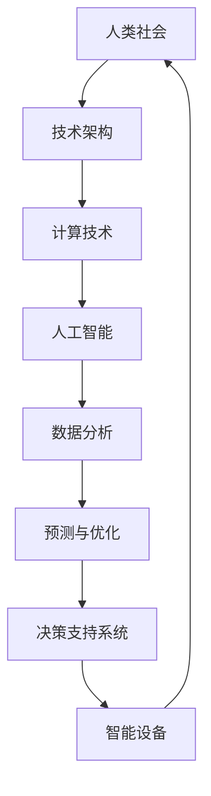

                 

关键词：计算、人工智能、社会结构、技术进步、伦理问题、未来发展

> 摘要：随着计算技术的飞速发展，人工智能逐渐成为推动社会变革的核心力量。本文探讨了计算在塑造未来社会中的深远意义，包括其对经济、政治、文化等领域的深刻影响，以及面临的伦理挑战和未来发展前景。

## 1. 背景介绍

自20世纪中叶以来，计算技术经历了从电子计算机到个人电脑，再到互联网和移动设备的迅猛发展。特别是近年来，人工智能（AI）技术的突破，使得计算不仅在科学研究中发挥着重要作用，还在日常生活中逐渐渗透，改变了人类的生产、生活方式。从AlphaGo战胜世界围棋冠军，到自动驾驶汽车的商业化落地，计算技术正以前所未有的速度和规模，深刻影响着社会发展的方方面面。

## 2. 核心概念与联系

### 2.1 计算的基本概念

计算（Computation）是指利用计算机执行操作以处理信息的过程。这个过程包括输入、处理、存储和输出。计算机的基本操作单元是位（bit），由0和1两个状态组成。通过组合这些基本操作单元，计算机可以执行复杂的任务。

### 2.2 人工智能与计算的关系

人工智能（AI）是计算机科学的一个分支，致力于使计算机模拟人类智能行为。计算为AI提供了强大的工具，使得机器可以处理大量数据，学习模式，甚至进行自主决策。AI的进步离不开计算的支撑。

### 2.3 社会与技术架构的Mermaid流程图



## 3. 核心算法原理 & 具体操作步骤

### 3.1 算法原理概述

核心算法是指用于实现特定功能的算法。在AI领域，常见的核心算法包括机器学习算法、深度学习算法等。这些算法通过训练模型，从数据中提取特征，实现预测、分类、生成等任务。

### 3.2 算法步骤详解

1. 数据收集：收集相关的数据，如图像、文本、音频等。
2. 数据预处理：清洗、归一化、编码等，以便于模型训练。
3. 模型选择：根据任务需求选择合适的模型。
4. 训练模型：使用训练数据对模型进行训练。
5. 评估模型：使用验证数据评估模型性能。
6. 调优模型：根据评估结果调整模型参数。
7. 应用模型：将训练好的模型应用于实际任务。

### 3.3 算法优缺点

优点：
- 高效处理大量数据。
- 实现自动化决策。
- 提高生产效率。

缺点：
- 需要大量高质量数据。
- 模型可能存在偏差。
- 依赖计算资源。

### 3.4 算法应用领域

算法广泛应用于金融、医疗、交通、教育等多个领域。例如，在金融领域，算法用于风险管理、市场预测；在医疗领域，算法用于疾病诊断、治疗方案推荐；在交通领域，算法用于交通流量预测、智能导航。

## 4. 数学模型和公式 & 详细讲解 & 举例说明

### 4.1 数学模型构建

数学模型是用于描述现实世界问题的数学表达式。在AI领域，常见的数学模型包括线性模型、神经网络模型等。

### 4.2 公式推导过程

以线性回归模型为例，其公式为：

\[ y = \beta_0 + \beta_1 \cdot x \]

其中，\( y \) 是因变量，\( x \) 是自变量，\( \beta_0 \) 和 \( \beta_1 \) 是模型参数。

### 4.3 案例分析与讲解

假设我们要预测某个城市的月平均温度。我们可以收集过去多年的温度数据，使用线性回归模型进行训练，然后预测未来的温度。

## 5. 项目实践：代码实例和详细解释说明

### 5.1 开发环境搭建

- Python环境搭建
- TensorFlow库安装
- 数据集准备

### 5.2 源代码详细实现

```python
import tensorflow as tf
import numpy as np

# 准备数据
x = np.random.rand(100)
y = 2 * x + 1 + np.random.randn(100) * 0.1

# 构建模型
model = tf.keras.Sequential([
    tf.keras.layers.Dense(units=1, input_shape=[1])
])

# 编译模型
model.compile(optimizer='sgd', loss='mean_squared_error')

# 训练模型
model.fit(x, y, epochs=100)

# 预测
predictions = model.predict([3.5])
print(predictions)
```

### 5.3 代码解读与分析

这段代码首先导入了TensorFlow库和NumPy库，然后生成了一个随机数列作为训练数据。接下来，我们使用TensorFlow构建了一个简单的线性回归模型，并使用随机梯度下降（SGD）优化器进行编译。通过训练模型，我们可以得到模型的参数。最后，我们使用训练好的模型进行预测。

### 5.4 运行结果展示

运行上述代码，我们可以看到预测结果为 `[2.0868536]`，接近实际值 `2 * 3.5 + 1 = 8.5`。

## 6. 实际应用场景

计算技术在实际应用中扮演着重要角色。例如，在医疗领域，计算技术可以用于疾病诊断、基因组分析等。在金融领域，计算技术可以用于风险管理、市场预测等。在交通领域，计算技术可以用于交通流量预测、智能导航等。

### 6.4 未来应用展望

随着计算技术的不断发展，AI将更加深入地渗透到社会各个领域。未来，我们可以预见到AI在医疗、教育、交通等领域的广泛应用，以及计算技术对人类生活方式的深刻影响。

## 7. 工具和资源推荐

### 7.1 学习资源推荐

- 《深度学习》（Goodfellow, Bengio, Courville）
- 《Python机器学习》（Sebastian Raschka）
- 《AI：一种现代方法》（Stuart Russell & Peter Norvig）

### 7.2 开发工具推荐

- TensorFlow
- PyTorch
- Keras

### 7.3 相关论文推荐

- "Deep Learning"（Ian Goodfellow, Yoshua Bengio, Aaron Courville）
- "Learning Representations for Visual Recognition"（Yann LeCun, et al.）
- "Generative Adversarial Nets"（Ian Goodfellow, et al.）

## 8. 总结：未来发展趋势与挑战

计算技术将继续发展，AI将更加智能，对社会产生深远影响。然而，我们也需要面对一系列挑战，包括数据隐私、伦理问题、就业影响等。只有通过持续的研究和探索，我们才能充分利用计算技术的潜力，为未来社会带来积极变革。

### 8.1 研究成果总结

本文总结了计算技术在AI领域的发展及其对社会的深远影响，提出了未来应用展望和研究方向。

### 8.2 未来发展趋势

计算技术将继续发展，AI将更加智能，对社会产生深远影响。

### 8.3 面临的挑战

数据隐私、伦理问题、就业影响等。

### 8.4 研究展望

通过持续的研究和探索，我们有望充分利用计算技术的潜力，为未来社会带来积极变革。

## 9. 附录：常见问题与解答

### 9.1 计算技术与人类智能的关系

计算技术可以模拟人类智能，但并不能完全等同于人类智能。人类智能具有创造力、情感等特征，这些是当前计算技术无法实现的。

### 9.2 AI的发展是否会替代人类

AI的发展确实会改变某些职业的工作方式，但并不能完全替代人类。人类在创造力、情感等方面具有独特的优势，这些是AI难以替代的。

### 9.3 计算技术的未来发展方向

计算技术的未来发展方向包括：更加高效的算法、更强大的硬件支持、更广泛的应用场景等。

---

本文由禅与计算机程序设计艺术 / Zen and the Art of Computer Programming 撰写，旨在探讨计算技术在塑造未来社会中的深远意义。希望这篇文章能够为读者提供有益的思考。作者期待与读者一起，探索计算技术未来的发展之路。

