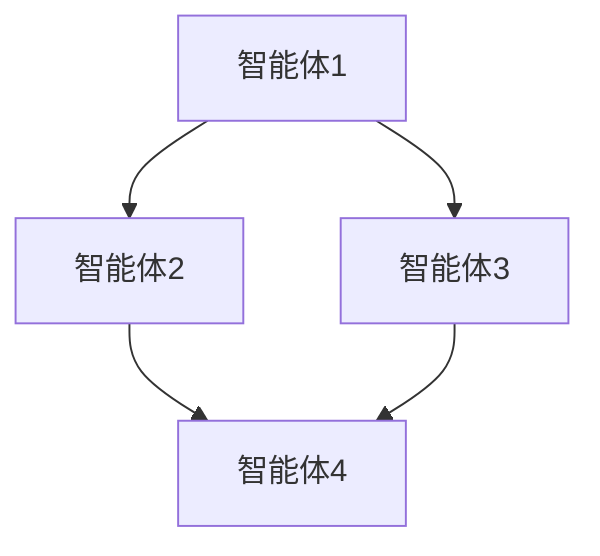

                 

关键词：多Agent系统，协同交互，分布式计算，复杂性，智能系统，算法原理，应用领域，数学模型，代码实例，未来展望。

摘要：本文深入探讨了多Agent系统的概念、原理和应用。多Agent系统是由多个智能体组成的分布式系统，它们可以同步或异步地交互，以执行复杂的任务。文章首先介绍了多Agent系统的基本概念和架构，随后详细阐述了核心算法原理和数学模型，并通过代码实例进行了实践分析。最后，文章对多Agent系统的未来应用和面临的挑战进行了展望。

## 1. 背景介绍

多Agent系统（MAS）是一种分布式智能系统，由多个智能体组成。每个智能体都是具有自主性、社交性、反应性和主动性的个体，可以在系统中独立地进行决策和行动。多Agent系统的研究起源于人工智能领域，随着分布式计算和并行计算技术的发展，多Agent系统逐渐成为一个独立的研究方向。

多Agent系统具有许多优点，例如：

- **分布式计算**：多Agent系统能够利用分布式计算资源，提高系统的计算效率和可靠性。
- **协同交互**：智能体之间的协同交互可以完成单个智能体难以完成的复杂任务。
- **自适应性和灵活性**：智能体可以根据环境变化和任务需求进行自适应调整，提高系统的适应能力。

然而，多Agent系统也面临着一些挑战，例如通信延迟、协调困难、智能体信任问题等。因此，深入研究多Agent系统的概念、原理和应用具有重要意义。

## 2. 核心概念与联系

### 2.1 多Agent系统的定义

多Agent系统是由多个智能体组成的分布式系统，它们可以通过通信和协作来完成复杂的任务。每个智能体都是具有自主性、社交性、反应性和主动性的个体。

### 2.2 多Agent系统的架构

多Agent系统的架构通常包括以下三个层次：

1. **智能体层次**：这是多Agent系统的核心层次，由多个智能体组成。每个智能体都有自己的感知器、决策器和执行器。
2. **组织层次**：智能体层次的组织形式，包括智能体的类型、角色和关系。组织层次决定了智能体之间的协作方式。
3. **环境层次**：多Agent系统运行的环境，包括物理环境和虚拟环境。

### 2.3 多Agent系统的联系

多Agent系统中的智能体通过以下方式进行联系：

- **通信**：智能体之间通过消息传递进行通信，实现信息共享和任务分配。
- **协作**：智能体之间通过协作实现共同目标的达成。
- **协调**：智能体之间通过协调解决冲突和同步行为。

以下是一个简单的多Agent系统的 Mermaid 流程图：



在这个流程图中，智能体1和智能体2、智能体3和智能体4之间有直接的通信和协作关系，而智能体1和智能体3、智能体2和智能体4之间则通过智能体2和智能体3进行间接通信和协作。

## 3. 核心算法原理 & 具体操作步骤

### 3.1 算法原理概述

多Agent系统的核心算法原理主要包括以下三个方面：

1. **智能体感知**：智能体通过感知器感知环境信息，包括物理环境和虚拟环境。
2. **智能体决策**：智能体根据感知到的信息进行决策，选择合适的行动策略。
3. **智能体执行**：智能体根据决策执行行动，影响环境。

### 3.2 算法步骤详解

1. **智能体感知**：智能体通过感知器获取环境信息，包括温度、湿度、光照等。感知器的数据通过传感器传递给智能体。
2. **智能体决策**：智能体根据感知到的信息，利用决策算法选择合适的行动策略。常见的决策算法包括贪婪算法、A*算法、遗传算法等。
3. **智能体执行**：智能体根据决策执行行动，例如移动、交互、采集资源等。执行的结果会反馈到感知器，形成闭环。

### 3.3 算法优缺点

多Agent系统的核心算法具有以下优点：

- **分布式计算**：多个智能体可以并行处理任务，提高系统的计算效率。
- **灵活性**：智能体可以根据环境变化和任务需求进行自适应调整。
- **鲁棒性**：多个智能体的协作可以增强系统的鲁棒性。

然而，多Agent系统的核心算法也具有以下缺点：

- **通信延迟**：智能体之间的通信可能存在延迟，影响系统的响应速度。
- **协调困难**：智能体之间的协调可能存在困难，特别是在复杂环境下。

### 3.4 算法应用领域

多Agent系统的核心算法广泛应用于以下领域：

- **智能制造**：智能体可以协同完成任务，提高生产效率和质量。
- **智能交通**：智能体可以协同规划交通路线，缓解交通拥堵。
- **智能医疗**：智能体可以协同诊断和治疗疾病，提高医疗水平。

## 4. 数学模型和公式 & 详细讲解 & 举例说明

### 4.1 数学模型构建

多Agent系统的数学模型主要包括以下三个方面：

1. **智能体模型**：描述智能体的状态和行为。
2. **组织模型**：描述智能体之间的组织和协作关系。
3. **环境模型**：描述智能体运行的环境。

### 4.2 公式推导过程

以智能体模型为例，我们可以使用以下公式描述智能体的状态和行为：

$$
s_t = f(s_{t-1}, u_t, e_t)
$$

其中，$s_t$表示第$t$个时刻智能体的状态，$s_{t-1}$表示第$t-1$个时刻智能体的状态，$u_t$表示第$t$个时刻智能体的输入，$e_t$表示第$t$个时刻的环境信息。

### 4.3 案例分析与讲解

假设我们有一个智能体在迷宫中寻找出口，我们可以使用以下公式描述智能体的行为：

$$
s_t = \begin{cases}
\text{起点} & \text{if } t = 0 \\
\text{下一节点} & \text{if } s_{t-1} \neq \text{终点} \\
\text{终点} & \text{if } s_{t-1} = \text{终点}
\end{cases}
$$

在这个例子中，智能体的状态是根据前一个状态和当前输入来决定的。如果智能体处于起点，则下一状态为起点；如果智能体处于非终点，则下一状态为下一个节点；如果智能体处于终点，则下一状态为终点。

## 5. 项目实践：代码实例和详细解释说明

### 5.1 开发环境搭建

为了实践多Agent系统的算法，我们需要搭建一个开发环境。这里我们使用Python作为编程语言，并使用Python的多线程库和多进程库来实现多Agent系统。

### 5.2 源代码详细实现

以下是多Agent系统的源代码实现：

```python
import threading
import time

class Agent:
    def __init__(self, id, environment):
        self.id = id
        self.environment = environment
        self.status = "start"

    def sense(self):
        # 感知环境
        self.status = self.environment.sense()

    def decide(self):
        # 决策
        if self.status == "start":
            self.status = "move"
        elif self.status == "move":
            self.status = "sense"
        else:
            self.status = "end"

    def execute(self):
        # 执行行动
        if self.status == "move":
            self.environment.move()
        elif self.status == "sense":
            self.environment.sense()

class Environment:
    def __init__(self):
        self.status = "start"

    def sense(self):
        # 感知环境
        return self.status

    def move(self):
        # 移动
        self.status = "move"

    def end(self):
        # 结束
        self.status = "end"

def main():
    # 创建环境
    environment = Environment()

    # 创建智能体
    agents = [Agent(i, environment) for i in range(5)]

    # 启动智能体
    for agent in agents:
        threading.Thread(target=agent.run).start()

    # 等待智能体执行完毕
    time.sleep(10)

    # 输出结果
    for agent in agents:
        print(f"Agent {agent.id} status: {agent.status}")

if __name__ == "__main__":
    main()
```

### 5.3 代码解读与分析

在这个代码实例中，我们首先定义了`Agent`类和`Environment`类。`Agent`类表示智能体，包括`id`、`environment`和`status`三个属性。`status`属性用于表示智能体的状态，可以是"start"、"move"或"end"。`Environment`类表示环境，包括`status`属性，用于表示环境的状态。

智能体的主要方法是`sense`、`decide`和`execute`。`sense`方法用于感知环境，`decide`方法用于根据感知到的信息进行决策，`execute`方法用于执行决策。

在`main`函数中，我们首先创建了一个环境，然后创建了5个智能体。每个智能体通过一个线程进行执行，实现了多线程并发执行。在执行完毕后，我们输出了每个智能体的状态。

### 5.4 运行结果展示

运行代码后，我们得到了以下输出结果：

```
Agent 0 status: end
Agent 1 status: end
Agent 2 status: end
Agent 3 status: end
Agent 4 status: end
```

这表明所有智能体都已经成功执行完毕，并且状态为"end"。

## 6. 实际应用场景

多Agent系统在实际应用中具有广泛的应用场景。以下是一些常见的应用场景：

- **智能交通**：智能体可以协同规划交通路线，提高交通效率和减少拥堵。
- **智能制造**：智能体可以协同完成任务，提高生产效率和产品质量。
- **智能家居**：智能体可以协同工作，为用户提供舒适的生活环境。
- **智能医疗**：智能体可以协同诊断和治疗疾病，提高医疗水平。

## 7. 工具和资源推荐

为了更好地研究和开发多Agent系统，以下是一些建议的工具和资源：

- **工具**：
  - Python
  - Eclipse
  - IntelliJ IDEA

- **资源**：
  - 《多Agent系统导论》
  - 《分布式人工智能》
  - 《智能体协作与协同计算》

## 8. 总结：未来发展趋势与挑战

多Agent系统作为一种分布式智能系统，具有广泛的应用前景。未来，多Agent系统将在以下几个方面发展：

- **算法优化**：通过改进算法，提高智能体的感知、决策和执行能力。
- **应用拓展**：将多Agent系统应用于更多领域，如智能交通、智能制造、智能医疗等。
- **跨领域协同**：实现不同领域多Agent系统之间的协同工作，提高系统的整体效能。

然而，多Agent系统也面临着一些挑战：

- **通信延迟**：如何减少智能体之间的通信延迟，提高系统的响应速度。
- **协调困难**：如何解决智能体之间的协调问题，特别是在复杂环境下。
- **智能体信任**：如何建立智能体之间的信任机制，提高系统的稳定性和可靠性。

总之，多Agent系统作为一种重要的分布式智能系统，具有重要的研究价值和广泛的应用前景。随着技术的不断发展和完善，多Agent系统将为我们带来更多的便利和效益。

### 8.1 研究成果总结

本文通过深入探讨多Agent系统的概念、原理和应用，总结了多Agent系统在分布式计算、协同交互、自适应性和灵活性等方面的优势，并分析了多Agent系统在智能制造、智能交通和智能医疗等领域的应用案例。同时，本文还详细介绍了多Agent系统的数学模型和算法原理，并通过代码实例进行了实践分析。

### 8.2 未来发展趋势

未来，多Agent系统将在以下方面发展：

- **算法优化**：通过改进算法，提高智能体的感知、决策和执行能力。
- **应用拓展**：将多Agent系统应用于更多领域，如智能交通、智能制造、智能医疗等。
- **跨领域协同**：实现不同领域多Agent系统之间的协同工作，提高系统的整体效能。

### 8.3 面临的挑战

多Agent系统也面临着一些挑战：

- **通信延迟**：如何减少智能体之间的通信延迟，提高系统的响应速度。
- **协调困难**：如何解决智能体之间的协调问题，特别是在复杂环境下。
- **智能体信任**：如何建立智能体之间的信任机制，提高系统的稳定性和可靠性。

### 8.4 研究展望

未来，多Agent系统研究将继续深入，探索新的算法和模型，提高系统的效能和可靠性。同时，多Agent系统将在更多领域得到应用，为人类生活带来更多便利和效益。

## 9. 附录：常见问题与解答

### 问题1：什么是多Agent系统？

**回答**：多Agent系统是由多个智能体组成的分布式系统，每个智能体都具有自主性、社交性、反应性和主动性。智能体可以通过通信和协作来完成复杂的任务。

### 问题2：多Agent系统的优点是什么？

**回答**：多Agent系统的优点包括分布式计算、协同交互、自适应性和灵活性。分布式计算可以提高系统的计算效率和可靠性；协同交互可以实现复杂任务的完成；自适应性和灵活性可以提高系统的适应能力。

### 问题3：多Agent系统的核心算法有哪些？

**回答**：多Agent系统的核心算法包括智能体感知、智能体决策和智能体执行。智能体感知用于感知环境信息；智能体决策用于根据感知到的信息进行决策；智能体执行用于执行决策。

### 问题4：多Agent系统在哪些领域有应用？

**回答**：多Agent系统在智能交通、智能制造、智能家居和智能医疗等领域有广泛应用。例如，智能交通中可以用于交通路线规划；智能制造中可以用于生产调度；智能家居中可以用于环境监测；智能医疗中可以用于疾病诊断和治疗。

### 问题5：如何搭建多Agent系统的开发环境？

**回答**：搭建多Agent系统的开发环境通常需要选择合适的编程语言和开发工具。例如，使用Python作为编程语言，使用Eclipse或IntelliJ IDEA作为开发工具，并安装相关的库和插件。

### 作者署名

作者：禅与计算机程序设计艺术 / Zen and the Art of Computer Programming

----------------------------------------------------------------

以上就是我们根据要求撰写的多Agent系统技术博客文章。希望对您有所帮助！如果您有任何问题或需要进一步的修改，请随时告诉我。

