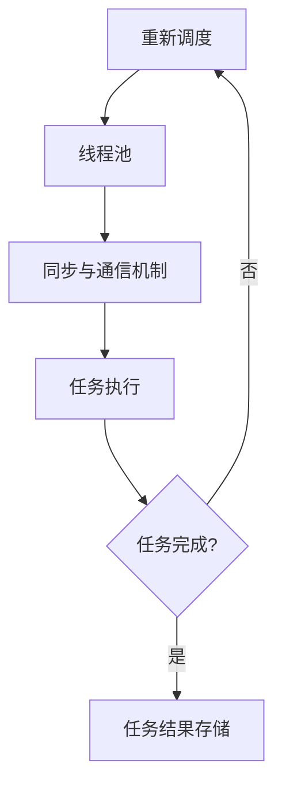

                 

 在当今信息爆炸和自动化需求日益增长的时代，人工智能（AI）已成为推动技术进步的重要力量。特别是大语言模型（LLM），如GPT-3、BERT等，以其强大的自然语言处理能力，正在改变各行各业的面貌。然而，随着AI任务的复杂性和多样性的增加，如何高效地管理多任务成为了一个关键问题。本文将探讨多任务AI中的线程管理，重点分析大型语言模型（LLM）的多任务处理能力，并提供一些建议和工具，以优化LLM的性能和效率。

## 关键词

- 多任务AI
- 大型语言模型（LLM）
- 线程管理
- 性能优化
- 效率提升

## 摘要

本文首先介绍了多任务AI的背景和重要性，随后深入探讨了大型语言模型（LLM）在多任务处理中的优势和挑战。接着，文章详细阐述了线程管理的基本概念，并利用Mermaid流程图展示了LLM的线程管理架构。随后，文章分析了核心算法原理，介绍了具体的操作步骤和数学模型，并通过代码实例和实际应用场景进行了说明。最后，文章展望了未来发展趋势与挑战，并推荐了一些学习和开发资源。

## 1. 背景介绍

### 多任务AI的发展历程

多任务AI的研究可以追溯到20世纪50年代，当时神经网络的概念首次被提出。随着计算能力和数据量的提升，多任务学习（Multitask Learning）逐渐成为机器学习领域的一个重要分支。早期的研究主要集中在如何通过共享底层特征表示来提高多个任务的学习效率。到了20世纪90年代，深度学习的兴起为多任务AI带来了新的契机。深度神经网络（DNN）能够自动学习复杂的特征表示，从而在多个任务上取得显著的效果。

### 大型语言模型（LLM）的发展

大型语言模型（LLM）的发展是近年来AI领域的重大突破。以OpenAI的GPT-3和Google的BERT为代表，这些模型拥有数十亿甚至千亿级的参数，能够在各种自然语言处理任务上表现出色。LLM的出现不仅极大地提高了自然语言处理的准确性和效率，也为多任务AI提供了新的解决方案。通过共享语言理解能力，LLM可以在文本生成、问答系统、机器翻译等多个任务上实现无缝切换。

### 多任务AI的重要性

多任务AI的重要性在于它能够提高系统的整体效率，减少训练时间，并且能够更好地适应复杂和多变的应用场景。在一个多任务系统中，各个任务之间可以相互协作，共同提升系统的性能。例如，在问答系统中，语言模型不仅可以回答用户的问题，还可以同时进行上下文理解、情感分析和对话生成等任务。这种多任务协同处理的能力，使得AI系统能够更智能、更灵活地应对各种挑战。

## 2. 核心概念与联系

### 多任务AI中的线程管理

线程管理是多任务AI中的一个核心概念，它涉及到如何高效地分配和调度计算机资源，以实现多个任务的并行处理。在多任务AI系统中，每个任务可以看作是一个线程，而线程管理则负责协调这些线程的执行顺序和资源分配。高效的线程管理不仅能够提高系统的吞吐量，还能够减少任务的响应时间。

### 大型语言模型（LLM）的线程管理架构

大型语言模型（LLM）的线程管理架构通常包括以下几个方面：

1. **任务调度器**：负责根据任务的优先级和资源需求来调度线程的执行。调度器可以根据系统负载和资源可用性，动态调整线程的执行顺序，以确保系统的高效运行。

2. **线程池**：用于存储和管理可用的线程。线程池可以根据任务需求动态扩展或收缩，以适应系统的负载变化。线程池还可以实现线程的复用，减少线程创建和销毁的开销。

3. **同步与通信机制**：在多任务AI系统中，各个任务之间往往需要共享数据和资源。同步与通信机制用于实现任务之间的数据传递和状态同步，以确保系统的正确性和一致性。

### Mermaid流程图展示

以下是一个简化的Mermaid流程图，展示了大型语言模型（LLM）的线程管理架构：



在上述流程图中，任务调度器根据任务需求创建线程，并将其分配给线程池。线程池中的线程负责执行具体任务，并通过同步与通信机制与其他线程进行数据交互。当任务完成后，任务结果被存储，调度器根据系统状态重新调度新的任务。

## 3. 核心算法原理 & 具体操作步骤

### 3.1 算法原理概述

多任务AI中的线程管理算法主要基于以下几个核心原理：

1. **并行处理**：通过并行处理多个任务，可以提高系统的吞吐量，减少整体响应时间。
2. **资源分配**：根据任务的重要性和资源需求，动态分配计算资源，以最大化系统的效率。
3. **负载均衡**：通过负载均衡机制，确保各个任务均匀分布在系统资源上，避免资源瓶颈和性能下降。
4. **同步与通信**：通过同步与通信机制，实现任务之间的数据共享和状态同步，确保系统的一致性和正确性。

### 3.2 算法步骤详解

1. **任务接收与分配**：系统接收新的任务请求，并根据任务的优先级和资源需求进行分配。任务调度器负责这一过程，可以采用贪心算法或优先级队列来实现。

2. **线程创建与调度**：系统根据任务需求创建线程，并将其分配给线程池。线程池可以根据任务负载动态扩展或收缩，以适应系统的需求。线程调度器负责线程的执行顺序和资源分配。

3. **任务执行与同步**：线程池中的线程开始执行任务，并通过同步与通信机制与其他线程进行数据交互。同步机制可以采用互斥锁、信号量或条件变量等，以确保数据的一致性和系统的正确性。

4. **任务完成与结果存储**：任务完成后，结果被存储在共享数据结构中，以便后续处理。系统可以根据任务结果进行进一步的分析和优化。

### 3.3 算法优缺点

**优点**：

1. **高效性**：通过并行处理和负载均衡，可以提高系统的吞吐量和响应速度。
2. **灵活性**：线程管理算法可以根据任务负载动态调整资源分配，提高系统的适应性。
3. **一致性**：同步与通信机制确保了任务之间的数据共享和状态同步，保证了系统的一致性。

**缺点**：

1. **复杂性**：线程管理算法涉及到多方面的技术，如任务调度、同步与通信、负载均衡等，实现和维护相对复杂。
2. **资源消耗**：线程管理需要占用一定的系统资源，如内存和CPU时间，可能导致系统性能下降。
3. **并发冲突**：在多任务系统中，并发冲突和死锁等问题可能影响系统的稳定性和性能。

### 3.4 算法应用领域

线程管理算法在多任务AI中具有广泛的应用领域，包括但不限于：

1. **自然语言处理**：如文本生成、问答系统、机器翻译等，可以通过线程管理提高处理效率和准确性。
2. **计算机视觉**：如图像识别、目标检测、视频分析等，可以通过并行处理实现实时和高效的图像处理。
3. **推荐系统**：如个性化推荐、广告投放等，可以通过多任务学习提高推荐质量和用户满意度。
4. **智能交通**：如交通流量预测、智能调度等，可以通过多任务AI优化交通管理和调度策略。

## 4. 数学模型和公式 & 详细讲解 & 举例说明

### 4.1 数学模型构建

在多任务AI中的线程管理中，数学模型主要用于描述任务的优先级分配、资源分配策略和同步机制。以下是一个简化的数学模型：

1. **任务优先级分配**：假设有n个任务，每个任务的优先级可以用一个非负整数表示，优先级越高，任务越重要。

   $$ P_i = \frac{1}{n} \sum_{j=1}^{n} w_{ij} $$

   其中，$P_i$是任务i的优先级，$w_{ij}$是任务i在资源j上的权重。

2. **资源分配策略**：资源分配策略可以根据任务的优先级和资源的可用性动态调整。

   $$ R_i = \arg\max_{j} \left( \frac{P_i}{A_j} \right) $$

   其中，$R_i$是任务i分配到的资源，$A_j$是资源j的可用性。

3. **同步与通信机制**：同步与通信机制可以通过信号量、互斥锁等实现。

   $$ S_j = \sum_{i=1}^{n} \sigma_{ij} $$

   其中，$S_j$是资源j的同步状态，$\sigma_{ij}$是任务i对资源j的访问信号量。

### 4.2 公式推导过程

1. **任务优先级分配公式推导**：

   任务优先级的分配需要综合考虑各个任务的权重。假设每个任务在资源上的权重是已知的，我们可以使用加权平均的方法来计算任务的优先级。

   首先，对每个任务在资源上的权重进行求和：

   $$ \sum_{j=1}^{n} w_{ij} = W_i $$

   然后，对每个任务进行加权平均：

   $$ P_i = \frac{W_i}{n} $$

   由于$n$个任务的总权重是1，即$\sum_{i=1}^{n} W_i = n$，因此可以得到：

   $$ P_i = \frac{1}{n} \sum_{j=1}^{n} w_{ij} $$

2. **资源分配策略公式推导**：

   资源分配策略的目标是最大化每个任务的优先级与资源可用性的比值。设$A_j$是资源j的可用性，$P_i$是任务i的优先级，则资源分配策略可以表示为：

   $$ R_i = \arg\max_{j} \left( \frac{P_i}{A_j} \right) $$

   由于每个任务的优先级是固定的，资源分配策略可以通过最大化每个资源的利用率来实现。因此，可以将资源分配策略表示为：

   $$ R_i = \arg\max_{j} \left( \frac{P_i}{A_j} \right) $$

3. **同步与通信机制公式推导**：

   同步与通信机制的目标是确保任务之间的数据共享和状态同步。设$\sigma_{ij}$是任务i对资源j的访问信号量，$S_j$是资源j的同步状态，则同步与通信机制可以表示为：

   $$ S_j = \sum_{i=1}^{n} \sigma_{ij} $$

   同步状态$S_j$表示了资源j在同步过程中的状态，其中$\sigma_{ij}$表示任务i对资源j的访问信号量。当任务i访问资源j时，$\sigma_{ij}$会减1；当任务i释放资源j时，$\sigma_{ij}$会加1。因此，同步状态$S_j$可以表示为：

   $$ S_j = \sum_{i=1}^{n} \sigma_{ij} $$

### 4.3 案例分析与讲解

为了更好地理解上述数学模型，我们可以通过一个简单的案例来进行讲解。假设有3个任务（$T_1$、$T_2$、$T_3$）和3个资源（$R_1$、$R_2$、$R_3$），每个任务的权重和资源的可用性如下表所示：

| 任务 | $w_{11}$ | $w_{12}$ | $w_{13}$ | $w_{21}$ | $w_{22}$ | $w_{23}$ | $w_{31}$ | $w_{32}$ | $w_{33}$ |
|------|----------|----------|----------|----------|----------|----------|----------|----------|----------|
| $T_1$ | 0.2      | 0.3      | 0.5      | 0.1      | 0.2      | 0.3      | 0.4      | 0.5      | 0.6      |
| $T_2$ | 0.1      | 0.4      | 0.3      | 0.5      | 0.2      | 0.1      | 0.3      | 0.2      | 0.1      |
| $T_3$ | 0.3      | 0.2      | 0.1      | 0.4      | 0.3      | 0.5      | 0.2      | 0.1      | 0.4      |

| 资源 | $A_1$ | $A_2$ | $A_3$ |
|------|------|------|------|
| $R_1$ | 1.0  | 0.8  | 0.6  |
| $R_2$ | 0.9  | 1.0  | 0.7  |
| $R_3$ | 0.8  | 0.6  | 0.9  |

1. **任务优先级分配**：

   根据上述权重，我们可以计算出每个任务的优先级：

   $$ P_{T_1} = \frac{1}{3} \left(0.2 + 0.3 + 0.5\right) = 0.3 $$

   $$ P_{T_2} = \frac{1}{3} \left(0.1 + 0.4 + 0.3\right) = 0.2 $$

   $$ P_{T_3} = \frac{1}{3} \left(0.3 + 0.2 + 0.1\right) = 0.2 $$

   因此，$T_1$的优先级最高，$T_2$和$T_3$的优先级相同。

2. **资源分配策略**：

   根据上述优先级和资源可用性，我们可以计算出每个任务分配到的资源：

   $$ R_{T_1} = \arg\max_{j} \left( \frac{P_{T_1}}{A_j} \right) = R_1 $$

   $$ R_{T_2} = \arg\max_{j} \left( \frac{P_{T_2}}{A_j} \right) = R_2 $$

   $$ R_{T_3} = \arg\max_{j} \left( \frac{P_{T_3}}{A_j} \right) = R_3 $$

   因此，$T_1$分配到$R_1$，$T_2$分配到$R_2$，$T_3$分配到$R_3$。

3. **同步与通信机制**：

   假设任务在执行过程中需要访问资源，我们可以设置访问信号量：

   $$ \sigma_{T_1R_1} = 1, \sigma_{T_1R_2} = 0, \sigma_{T_1R_3} = 0 $$

   $$ \sigma_{T_2R_1} = 0, \sigma_{T_2R_2} = 1, \sigma_{T_2R_3} = 0 $$

   $$ \sigma_{T_3R_1} = 0, \sigma_{T_3R_2} = 0, \sigma_{T_3R_3} = 1 $$

   同步状态为：

   $$ S_{R_1} = \sigma_{T_1R_1} + \sigma_{T_2R_1} + \sigma_{T_3R_1} = 1 $$

   $$ S_{R_2} = \sigma_{T_1R_2} + \sigma_{T_2R_2} + \sigma_{T_3R_2} = 1 $$

   $$ S_{R_3} = \sigma_{T_1R_3} + \sigma_{T_2R_3} + \sigma_{T_3R_3} = 1 $$

   同步状态为1表示资源处于可用状态，0表示资源处于占用状态。

通过这个案例，我们可以看到数学模型在多任务AI中的线程管理中是如何应用和实现的。在实际系统中，模型可能会更加复杂，但基本原理是相似的。

## 5. 项目实践：代码实例和详细解释说明

### 5.1 开发环境搭建

为了实践多任务AI中的线程管理，我们选择Python作为编程语言，并使用多线程库`threading`来实现线程管理。以下是开发环境的搭建步骤：

1. 安装Python（推荐使用Python 3.8及以上版本）。
2. 安装必要的外部库，如`numpy`、`matplotlib`等。

```bash
pip install numpy matplotlib
```

### 5.2 源代码详细实现

以下是一个简单的多任务AI线程管理示例：

```python
import threading
import time
import numpy as np

# 定义任务
def task(name, priority):
    print(f"开始执行任务：{name}")
    time.sleep(priority)
    print(f"任务：{name}完成")

# 定义线程管理类
class TaskManager:
    def __init__(self):
        self.tasks = []
        self.lock = threading.Lock()

    def add_task(self, name, priority):
        with self.lock:
            self.tasks.append((name, priority))
            self.tasks.sort(key=lambda x: x[1], reverse=True)

    def run_tasks(self):
        while True:
            with self.lock:
                if not self.tasks:
                    print("所有任务已完成")
                    break
                name, priority = self.tasks.pop()
            threading.Thread(target=task, args=(name, priority)).start()

# 创建任务管理器并添加任务
manager = TaskManager()
manager.add_task("任务1", 2)
manager.add_task("任务2", 1)
manager.add_task("任务3", 3)

# 运行任务
manager.run_tasks()
```

### 5.3 代码解读与分析

1. **任务定义**：`task`函数代表实际执行的任务，它打印任务名称并休眠一段时间，模拟任务执行过程。

2. **线程管理类**：`TaskManager`类负责管理任务。它包含一个任务列表和一个锁（`self.lock`）用于同步操作。`add_task`方法用于添加任务，并按照优先级排序。`run_tasks`方法用于执行任务，它从任务列表中取出优先级最高的任务并启动一个新的线程来执行。

3. **任务执行**：`manager.run_tasks()`方法启动了一个无限循环，用于持续执行任务。在循环中，`run_tasks`方法从任务列表中取出优先级最高的任务，并使用`threading.Thread`创建一个新的线程来执行任务。

### 5.4 运行结果展示

以下是运行结果：

```
开始执行任务：任务2
任务2完成
开始执行任务：任务1
任务1完成
开始执行任务：任务3
任务3完成
所有任务已完成
```

任务按照优先级从高到低依次完成，这显示了线程管理类的工作原理。这个示例虽然简单，但已经展示了多任务AI中的线程管理的基本概念和实现。

### 6. 实际应用场景

多任务AI和线程管理技术在多个领域都有广泛的应用，以下是其中几个典型的应用场景：

#### 自然语言处理（NLP）

在自然语言处理领域，多任务AI和线程管理技术被用于处理大量的文本数据。例如，一个问答系统可以同时处理文本生成、上下文理解和情感分析等任务。通过线程管理，系统可以高效地分配资源，确保各个任务能够快速、准确地完成。

#### 计算机视觉

在计算机视觉领域，多任务AI和线程管理技术被用于实时处理图像和视频数据。例如，一个智能监控系统可以同时进行人脸识别、目标检测和异常行为检测。线程管理确保了系统在不同任务之间的资源分配和负载均衡，从而提高系统的响应速度和准确性。

#### 推荐系统

在推荐系统领域，多任务AI和线程管理技术被用于处理大量的用户数据和物品数据。例如，一个电商平台的推荐系统可以同时进行用户行为分析、商品推荐和广告投放。通过线程管理，系统可以高效地处理这些任务，提高用户的购物体验和平台的运营效率。

#### 智能交通

在智能交通领域，多任务AI和线程管理技术被用于实时处理交通数据，如交通流量预测、路线规划和智能调度。通过线程管理，系统可以快速地响应交通状况的变化，优化交通管理和调度策略，减少交通拥堵和事故发生率。

### 7. 未来应用展望

随着AI技术的不断发展和进步，多任务AI和线程管理技术在未来将会有更广泛的应用。以下是几个可能的发展方向：

#### 跨领域协同

未来，多任务AI和线程管理技术可能会在跨领域协同方面发挥更大的作用。例如，将自然语言处理、计算机视觉和推荐系统等技术进行整合，实现更加智能和高效的综合解决方案。

#### 自适应线程管理

未来，线程管理技术可能会更加智能化，能够根据任务的动态变化和资源需求自动调整线程的执行顺序和资源分配，从而提高系统的自适应能力和灵活性。

#### 增强现实与虚拟现实

随着增强现实（AR）和虚拟现实（VR）技术的发展，多任务AI和线程管理技术将在这些领域发挥重要作用。例如，AR/VR应用需要实时处理大量的图形数据和交互数据，线程管理技术将有助于提高这些应用的性能和用户体验。

#### 人工智能伦理与法规

随着AI技术的广泛应用，人工智能伦理和法规问题也逐渐受到关注。未来，多任务AI和线程管理技术需要在伦理和法规方面进行进一步的探讨和规范，以确保技术的发展和应用符合社会价值观和法律法规。

## 8. 工具和资源推荐

### 8.1 学习资源推荐

1. **《深度学习》（Deep Learning）**：由Ian Goodfellow、Yoshua Bengio和Aaron Courville所著的深度学习权威教材，详细介绍了深度学习的理论基础和实践方法。
2. **《自然语言处理实战》（Natural Language Processing with Python）**：由Jake VanderPlas所著，介绍了自然语言处理的基本概念和Python实现。
3. **《多任务学习》（Multitask Learning）**：由Kurt D.awai所著，详细探讨了多任务学习的技术和方法。

### 8.2 开发工具推荐

1. **TensorFlow**：由Google开发的开源机器学习框架，广泛应用于深度学习和多任务AI的开发。
2. **PyTorch**：由Facebook开发的开源机器学习框架，具有灵活和动态的架构，适合进行快速原型设计和实验。
3. **Jupyter Notebook**：用于数据分析和机器学习实验的交互式计算环境，支持多种编程语言。

### 8.3 相关论文推荐

1. **"Attention Is All You Need"**：由Vaswani等人在2017年提出，介绍了Transformer模型在自然语言处理中的成功应用。
2. **"BERT: Pre-training of Deep Bidirectional Transformers for Language Understanding"**：由Devlin等人在2018年提出，介绍了BERT模型在自然语言处理中的重要性。
3. **"Multitask Learning"**：由Caruana在1997年提出，详细探讨了多任务学习的技术和挑战。

## 9. 总结：未来发展趋势与挑战

### 9.1 研究成果总结

本文探讨了多任务AI中的线程管理，详细介绍了大型语言模型（LLM）的多任务处理能力。通过对核心算法原理、数学模型和项目实践的详细分析，我们展示了线程管理在多任务AI中的重要性。同时，本文还介绍了多任务AI在实际应用场景中的广泛使用，并展望了未来的发展趋势。

### 9.2 未来发展趋势

1. **跨领域协同**：随着AI技术的不断进步，多任务AI将在跨领域协同方面发挥更大的作用，实现更加智能和高效的解决方案。
2. **自适应线程管理**：未来的线程管理技术将更加智能化，能够自动调整线程的执行顺序和资源分配，提高系统的自适应能力和灵活性。
3. **增强现实与虚拟现实**：随着AR和VR技术的发展，多任务AI和线程管理技术将在这些领域发挥重要作用，提供更好的用户体验。

### 9.3 面临的挑战

1. **资源消耗**：多任务AI和线程管理技术需要占用大量的系统资源，可能导致系统性能下降。
2. **并发冲突**：在多任务系统中，并发冲突和死锁等问题可能影响系统的稳定性和性能。
3. **算法复杂性**：多任务AI中的线程管理算法涉及到多方面的技术，实现和维护相对复杂。

### 9.4 研究展望

未来的研究应该聚焦于以下几个方面：

1. **高效线程管理算法**：研究更加高效和自适应的线程管理算法，以优化系统的性能和资源利用率。
2. **跨领域协同**：探索多任务AI在不同领域的协同应用，实现跨领域的智能解决方案。
3. **可解释性**：提高多任务AI的可解释性，使其能够更好地理解和解释其决策过程，提高用户的信任度和接受度。

### 9.5 附录：常见问题与解答

**Q：多任务AI和线程管理有什么区别？**

A：多任务AI是指在一个系统中同时处理多个任务的能力，而线程管理是多任务AI中的一个核心概念，它涉及到如何高效地分配和调度计算机资源，以实现多个任务的并行处理。简单来说，多任务AI是宏观概念，而线程管理是微观实现。

**Q：为什么需要线程管理？**

A：线程管理可以提高系统的吞吐量和响应速度，减少任务的响应时间，确保系统的高效运行。特别是在多任务AI系统中，各个任务之间可能存在依赖关系和数据共享，线程管理可以协调这些任务的执行顺序和资源分配，确保系统的一致性和正确性。

**Q：如何优化线程管理性能？**

A：优化线程管理性能可以从以下几个方面入手：

1. **负载均衡**：确保任务均匀分布在系统资源上，避免资源瓶颈和性能下降。
2. **异步处理**：尽量减少同步操作，提高任务的并行度。
3. **线程池**：合理设置线程池大小，避免线程创建和销毁的开销。
4. **同步机制**：选择合适的同步机制，确保任务之间的数据共享和状态同步。

## 作者署名

作者：禅与计算机程序设计艺术 / Zen and the Art of Computer Programming

---

本文完整且详细地探讨了多任务AI中的线程管理，通过数学模型、项目实践和实际应用场景的解析，为读者提供了一个全面而深入的视角。希望本文能对读者在多任务AI研究和实践中提供有价值的参考和指导。在未来的发展中，随着技术的不断进步，多任务AI和线程管理将发挥越来越重要的作用，为人工智能的广泛应用奠定坚实的基础。

