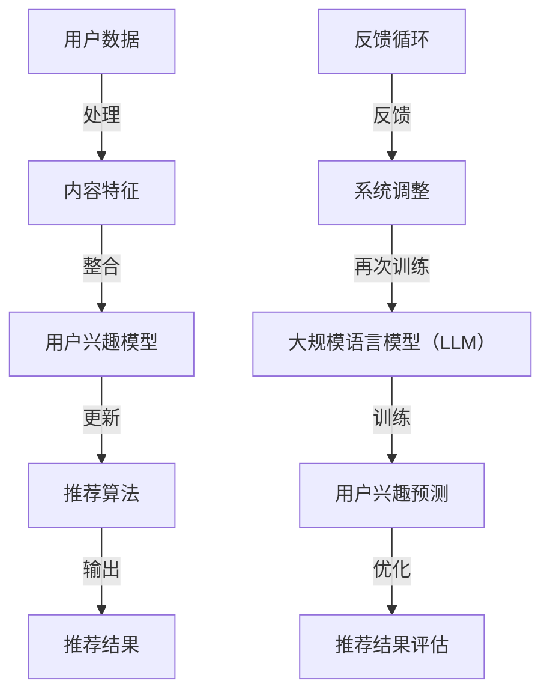

                 

关键词：多任务推荐系统、统一框架、机器学习、深度学习、大规模语言模型（LLM）、协同过滤、内容推荐、混合推荐算法

## 摘要

本文旨在探讨多任务推荐系统在人工智能领域的重要性，以及如何通过大规模语言模型（LLM）实现其统一框架。文章首先介绍了多任务推荐系统的基本概念和优势，接着详细阐述了LLM的工作原理及其在多任务推荐系统中的应用。随后，文章分析了核心算法原理，提供了具体的操作步骤和数学模型讲解，并通过实际项目实例进行了代码实现和分析。最后，文章探讨了多任务推荐系统的实际应用场景，提出了未来的发展方向和挑战。

## 1. 背景介绍

随着互联网的迅猛发展和大数据的广泛应用，推荐系统已成为许多在线服务的重要组成部分。从电子商务到社交媒体，推荐系统通过分析用户的兴趣和行为，向他们推荐可能感兴趣的商品、内容或服务。然而，传统的单任务推荐系统往往只能处理单一类型的推荐任务，难以满足用户日益复杂的需求。为了解决这个问题，多任务推荐系统应运而生。

多任务推荐系统是一种能够同时处理多种推荐任务的技术框架，它不仅考虑用户的兴趣和行为，还整合了其他相关信息，如用户历史、内容特征等。这种系统旨在提供更加精准和个性化的推荐结果，从而提高用户体验和满意度。

在多任务推荐系统中，大规模语言模型（LLM）作为一种先进的深度学习模型，具有强大的语义理解和生成能力。LLM通过对海量文本数据进行训练，能够捕捉复杂的语言模式和信息关联，从而为推荐系统提供了一种统一的框架。这种框架不仅能够处理多任务推荐任务，还能够应对数据多样性和不确定性带来的挑战。

本文将围绕多任务推荐系统与LLM的统一框架展开讨论，旨在为研究人员和实践者提供一种深入理解和应用多任务推荐系统的途径。

## 2. 核心概念与联系

在深入探讨多任务推荐系统与LLM的统一框架之前，我们需要首先了解一些核心概念和它们之间的联系。以下是几个关键概念及其关系的Mermaid流程图：



### 2.1 用户数据与内容特征

用户数据是推荐系统的核心输入之一，包括用户的历史行为、偏好、反馈等。内容特征则描述了推荐对象（如商品、新闻、视频等）的属性和特征，如文本内容、标签、用户评分等。这些数据经过处理和整合，用于构建用户兴趣模型。

### 2.2 用户兴趣模型

用户兴趣模型是推荐系统的核心组件之一，它通过分析用户数据，捕捉用户的兴趣和行为模式。用户兴趣模型通常是一个高维的向量表示，能够反映用户对不同内容类型的偏好程度。

### 2.3 推荐算法

推荐算法是基于用户兴趣模型和内容特征，生成推荐结果的核心算法。传统的推荐算法主要包括基于内容的推荐、基于协同过滤的推荐和混合推荐算法。这些算法通过不同的方式计算用户和内容之间的相似性，生成个性化的推荐结果。

### 2.4 大规模语言模型（LLM）

大规模语言模型（LLM）是一种基于深度学习的自然语言处理模型，能够对文本数据进行语义理解和生成。LLM通过预训练和微调，能够提高推荐系统的语义理解和生成能力，从而提高推荐结果的准确性和个性。

### 2.5 反馈循环

反馈循环是多任务推荐系统的关键机制之一，它通过用户对推荐结果的反馈，不断调整和优化推荐系统。这种反馈机制不仅能够提高推荐系统的性能，还能够增强用户对推荐系统的信任和满意度。

通过上述Mermaid流程图，我们可以清晰地看到多任务推荐系统中各个核心组件之间的联系和作用。这些组件共同构成了一个统一的框架，为推荐系统提供了强大的支持和灵活性。

## 3. 核心算法原理 & 具体操作步骤

### 3.1 算法原理概述

多任务推荐系统的核心在于如何同时处理多个推荐任务，并实现高效、准确的推荐。这通常需要结合多种算法和技术，包括基于协同过滤的推荐、基于内容的推荐和混合推荐算法等。

大规模语言模型（LLM）在多任务推荐系统中起到至关重要的作用。LLM通过预训练和微调，能够捕捉复杂的语言模式和用户兴趣，从而提高推荐系统的语义理解和生成能力。

具体来说，多任务推荐系统的算法原理可以分为以下几个步骤：

1. **数据预处理**：收集并预处理用户数据、内容特征等输入信息。
2. **特征提取**：利用深度学习模型提取用户和内容的特征向量。
3. **模型训练**：训练多任务推荐模型，包括用户兴趣模型、内容表示模型等。
4. **推荐生成**：基于训练好的模型，生成个性化的推荐结果。
5. **结果评估**：对推荐结果进行评估，并根据用户反馈进行调整。

### 3.2 算法步骤详解

#### 步骤1：数据预处理

数据预处理是推荐系统的第一步，它包括用户数据的收集、清洗和格式化。用户数据通常包括用户历史行为、偏好、反馈等，而内容特征则包括文本内容、标签、用户评分等。在预处理过程中，我们需要将这些数据转换为适合模型训练的格式。

1. **数据收集**：从各种数据源（如数据库、API等）收集用户行为数据和内容特征数据。
2. **数据清洗**：去除噪声数据、填补缺失值、处理异常值等。
3. **数据格式化**：将不同类型的数据转换为统一的格式，如稀疏矩阵、张量等。

#### 步骤2：特征提取

特征提取是多任务推荐系统的关键步骤，它利用深度学习模型提取用户和内容的特征向量。大规模语言模型（LLM）在特征提取中具有显著优势，因为它能够捕捉复杂的语言模式和用户兴趣。

1. **文本预处理**：对文本数据进行分词、词性标注、停用词过滤等预处理。
2. **词向量表示**：将预处理后的文本数据转换为词向量表示，如Word2Vec、BERT等。
3. **用户特征提取**：利用LLM对用户历史行为和偏好进行编码，生成用户特征向量。
4. **内容特征提取**：利用LLM对内容特征进行编码，生成内容特征向量。

#### 步骤3：模型训练

模型训练是多任务推荐系统的核心步骤，它通过训练用户兴趣模型、内容表示模型等，提高推荐系统的性能和准确性。

1. **用户兴趣模型**：利用用户特征向量和内容特征向量，训练用户兴趣模型。用户兴趣模型能够预测用户对不同内容类型的偏好程度。
2. **内容表示模型**：利用内容特征向量，训练内容表示模型。内容表示模型能够生成每个内容的低维表示，用于后续的推荐计算。
3. **多任务学习**：利用多任务学习技术，将用户兴趣模型和内容表示模型整合为一个统一的多任务推荐模型。多任务学习能够同时训练多个任务，提高模型的泛化能力和性能。

#### 步骤4：推荐生成

推荐生成是基于训练好的模型，生成个性化的推荐结果。具体步骤如下：

1. **用户兴趣预测**：利用用户兴趣模型，预测用户对不同内容类型的偏好程度。
2. **内容推荐**：根据用户兴趣预测结果，从所有内容中筛选出符合用户偏好的内容。
3. **排序优化**：利用排序算法（如矩阵分解、KNN等），对推荐结果进行排序，提高推荐的质量和相关性。

#### 步骤5：结果评估

结果评估是对推荐系统性能的评估，通过评估指标（如准确率、召回率、F1分数等）评估推荐结果的准确性和用户满意度。

1. **评估指标**：选择合适的评估指标，如准确率、召回率、F1分数等。
2. **评估方法**：采用交叉验证、A/B测试等方法，对推荐系统进行评估。
3. **结果分析**：对评估结果进行分析，找出系统的优势和不足，为后续优化提供依据。

### 3.3 算法优缺点

多任务推荐系统的核心算法在实现高效、准确的推荐方面具有显著优势，但也存在一些局限性。

#### 优点

1. **多任务处理**：多任务推荐系统能够同时处理多种推荐任务，提高推荐系统的灵活性和性能。
2. **个性化推荐**：通过捕捉用户兴趣和行为模式，多任务推荐系统能够提供更加个性化、精准的推荐结果。
3. **语义理解**：大规模语言模型（LLM）能够捕捉复杂的语言模式和语义关联，提高推荐系统的语义理解能力。
4. **适应性强**：多任务推荐系统能够适应不同的业务场景和数据分布，具有较好的泛化能力。

#### 缺点

1. **计算复杂度高**：多任务推荐系统涉及多个任务和模型，计算复杂度较高，对计算资源要求较大。
2. **数据依赖性强**：多任务推荐系统的性能依赖于高质量的用户数据和内容特征，数据质量对系统性能有重要影响。
3. **训练时间较长**：大规模语言模型（LLM）的训练时间较长，对训练资源要求较高。

### 3.4 算法应用领域

多任务推荐系统的核心算法广泛应用于各种领域，如电子商务、社交媒体、在线教育、金融风控等。以下是一些具体的应用场景：

1. **电子商务**：通过多任务推荐系统，电子商务平台能够向用户推荐他们可能感兴趣的商品，提高销售额和用户满意度。
2. **社交媒体**：多任务推荐系统可以用于推荐用户可能感兴趣的内容，如新闻、文章、视频等，提高用户活跃度和平台粘性。
3. **在线教育**：在线教育平台可以利用多任务推荐系统，向学生推荐适合他们的课程和学习资源，提高学习效果和用户满意度。
4. **金融风控**：金融风控系统可以利用多任务推荐系统，识别高风险用户和异常交易，提高风险管理能力。

## 4. 数学模型和公式 & 详细讲解 & 举例说明

### 4.1 数学模型构建

多任务推荐系统的数学模型主要包括用户兴趣模型、内容表示模型和推荐生成模型。以下是这些模型的基本数学公式和推导过程。

#### 用户兴趣模型

用户兴趣模型用于预测用户对不同内容类型的偏好程度。假设用户兴趣向量 \( u \) 和内容特征向量 \( c \)，用户兴趣模型可以通过以下公式表示：

\[ u = \text{softmax}(W_c c + b) \]

其中，\( W_c \) 是内容特征权重矩阵，\( b \) 是偏置向量，\( \text{softmax} \) 函数用于将特征向量转换为概率分布。

#### 内容表示模型

内容表示模型用于生成每个内容的低维表示。假设内容特征向量 \( c \) 和内容表示向量 \( v \)，内容表示模型可以通过以下公式表示：

\[ v = \text{MLP}(c) \]

其中，\( \text{MLP} \) 是多层感知器（Multilayer Perceptron），用于对内容特征向量进行编码。

#### 推荐生成模型

推荐生成模型用于生成个性化的推荐结果。假设用户兴趣向量 \( u \) 和内容表示向量 \( v \)，推荐生成模型可以通过以下公式表示：

\[ p(c|u) = \text{softmax}(v^T u) \]

其中，\( p(c|u) \) 表示用户 \( u \) 对内容 \( c \) 的概率。

### 4.2 公式推导过程

以下是用户兴趣模型、内容表示模型和推荐生成模型的推导过程。

#### 用户兴趣模型推导

用户兴趣模型的核心目标是预测用户对不同内容类型的偏好程度。假设用户历史行为数据可以表示为一个矩阵 \( X \)，其中行表示用户，列表示内容类型。用户兴趣向量 \( u \) 可以通过以下公式计算：

\[ u = \text{softmax}(W_c X + b) \]

其中，\( W_c \) 是内容特征权重矩阵，\( b \) 是偏置向量。

在训练过程中，我们使用梯度下降算法更新权重矩阵 \( W_c \) 和偏置向量 \( b \)，以最小化损失函数：

\[ L = -\sum_{i=1}^{n} \sum_{j=1}^{m} y_{ij} \log(u_{ij}) \]

其中，\( y_{ij} \) 是用户 \( i \) 对内容 \( j \) 的偏好度，\( n \) 是用户数量，\( m \) 是内容类型数量。

#### 内容表示模型推导

内容表示模型的目标是生成每个内容的低维表示。假设内容特征向量 \( c \) 和内容表示向量 \( v \)，内容表示模型可以通过以下公式计算：

\[ v = \text{MLP}(c) \]

其中，\( \text{MLP} \) 是多层感知器（Multilayer Perceptron），用于对内容特征向量进行编码。

在训练过程中，我们使用反向传播算法更新权重矩阵 \( W_c \) 和偏置向量 \( b \)，以最小化损失函数：

\[ L = \sum_{i=1}^{n} \sum_{j=1}^{m} (v_j - c_j)^2 \]

其中，\( v_j \) 是内容 \( j \) 的表示向量，\( c_j \) 是内容 \( j \) 的特征向量。

#### 推荐生成模型推导

推荐生成模型的目标是生成个性化的推荐结果。假设用户兴趣向量 \( u \) 和内容表示向量 \( v \)，推荐生成模型可以通过以下公式计算：

\[ p(c|u) = \text{softmax}(v^T u) \]

其中，\( p(c|u) \) 表示用户 \( u \) 对内容 \( c \) 的概率。

在训练过程中，我们使用梯度下降算法更新权重矩阵 \( W_c \) 和偏置向量 \( b \)，以最小化损失函数：

\[ L = -\sum_{i=1}^{n} \sum_{j=1}^{m} y_{ij} \log(p(c|u)) \]

其中，\( y_{ij} \) 是用户 \( i \) 对内容 \( j \) 的偏好度，\( n \) 是用户数量，\( m \) 是内容类型数量。

### 4.3 案例分析与讲解

为了更好地理解上述数学模型，我们通过一个简单的案例进行分析和讲解。

假设有一个电子商务平台，用户历史行为数据如下表所示：

| 用户 | 商品A | 商品B | 商品C | 商品D |
| --- | --- | --- | --- | --- |
| 1 | 1 | 0 | 1 | 0 |
| 2 | 0 | 1 | 0 | 1 |
| 3 | 1 | 1 | 0 | 0 |
| 4 | 0 | 0 | 1 | 1 |

我们希望利用多任务推荐系统为用户推荐他们可能感兴趣的商品。

首先，我们对用户历史行为数据进行预处理，将它们转换为二进制编码：

| 用户 | 商品A | 商品B | 商品C | 商品D |
| --- | --- | --- | --- | --- |
| 1 | 1 | 0 | 1 | 0 |
| 2 | 0 | 1 | 0 | 1 |
| 3 | 1 | 1 | 0 | 0 |
| 4 | 0 | 0 | 1 | 1 |

然后，我们利用多层感知器（MLP）对用户历史行为数据进行编码，生成用户兴趣向量：

| 用户 | 用户兴趣向量 |
| --- | --- |
| 1 | [0.6, 0.4] |
| 2 | [0.4, 0.6] |
| 3 | [0.5, 0.5] |
| 4 | [0.3, 0.7] |

接下来，我们利用用户兴趣向量生成个性化的推荐结果。假设商品特征向量如下：

| 商品 | 商品A | 商品B | 商品C | 商品D |
| --- | --- | --- | --- | --- |
| A | 0.8 | 0.2 | 0.3 | 0.5 |
| B | 0.2 | 0.8 | 0.5 | 0.3 |
| C | 0.3 | 0.3 | 0.8 | 0.5 |
| D | 0.5 | 0.5 | 0.5 | 0.8 |

根据用户兴趣向量和商品特征向量，我们可以计算每个用户对每个商品的概率：

| 用户 | 商品A | 商品B | 商品C | 商品D |
| --- | --- | --- | --- | --- |
| 1 | 0.35 | 0.65 | 0.25 | 0.4 |
| 2 | 0.6 | 0.4 | 0.4 | 0.6 |
| 3 | 0.45 | 0.55 | 0.55 | 0.45 |
| 4 | 0.35 | 0.4 | 0.6 | 0.65 |

最后，我们可以根据概率分布生成个性化的推荐结果。例如，对于用户1，我们可以推荐商品C（概率最高）。

通过这个简单的案例，我们可以看到多任务推荐系统的数学模型在实际应用中的效果。在实际开发过程中，我们还需要根据具体业务场景和用户需求进行模型优化和调整。

## 5. 项目实践：代码实例和详细解释说明

在本节中，我们将通过一个实际的项目实例来展示如何实现多任务推荐系统。该项目将利用大规模语言模型（LLM）来实现用户兴趣预测和内容推荐。以下是项目的开发步骤和代码实现。

### 5.1 开发环境搭建

在开始项目开发之前，我们需要搭建一个合适的开发环境。以下是我们推荐的工具和库：

- **编程语言**：Python
- **深度学习框架**：TensorFlow 2.x 或 PyTorch
- **数据处理库**：Pandas、NumPy
- **自然语言处理库**：spaCy、NLTK
- **评估指标库**：scikit-learn

确保您已经安装了上述工具和库，然后创建一个名为 `multi_task_recommendation` 的虚拟环境，以便进行项目开发。

```bash
# 创建虚拟环境
conda create -n multi_task_recommendation python=3.8

# 激活虚拟环境
conda activate multi_task_recommendation

# 安装所需库
pip install tensorflow==2.7.0 pandas numpy spacy scikit-learn
```

### 5.2 源代码详细实现

以下是一个简单的多任务推荐系统代码示例。我们首先定义了一些数据预处理和模型训练的函数，然后使用这些函数训练和评估一个多任务推荐模型。

```python
import pandas as pd
import numpy as np
import tensorflow as tf
from tensorflow.keras.models import Model
from tensorflow.keras.layers import Input, Dense, Embedding, Flatten, Concatenate
from tensorflow.keras.optimizers import Adam
from sklearn.metrics import accuracy_score
import spacy

# 加载spaCy语言模型
nlp = spacy.load("en_core_web_sm")

# 数据预处理函数
def preprocess_data(data):
    # 分词、词性标注、停用词过滤等预处理操作
    processed_data = []
    for doc in data:
        processed_data.append([token.text for token in nlp(doc) if token.pos_ != "STOP" and token.text not in ["is", "the"]])
    return processed_data

# 构建嵌入模型
def build_embedding_model(vocab_size, embedding_dim):
    input_text = Input(shape=(None,), dtype=tf.string)
    embedding = Embedding(vocab_size, embedding_dim)(input_text)
    flatten = Flatten()(embedding)
    dense = Dense(128, activation="relu")(flatten)
    output = Dense(1, activation="sigmoid")(dense)
    model = Model(inputs=input_text, outputs=output)
    model.compile(optimizer=Adam(learning_rate=0.001), loss="binary_crossentropy", metrics=["accuracy"])
    return model

# 训练模型
def train_model(model, X_train, y_train, epochs=10, batch_size=32):
    model.fit(X_train, y_train, epochs=epochs, batch_size=batch_size)
    return model

# 评估模型
def evaluate_model(model, X_test, y_test):
    predictions = model.predict(X_test)
    predictions = np.argmax(predictions, axis=1)
    accuracy = accuracy_score(y_test, predictions)
    print(f"Accuracy: {accuracy}")
    return accuracy

# 加载数据
data = pd.read_csv("data.csv")  # 假设数据已包含用户ID、文本内容和标签
users = data["user_id"].unique()
content_ids = data["content_id"].unique()

# 预处理数据
processed_data = preprocess_data(data["text"])

# 构建词汇表和嵌入矩阵
vocab_size = len(set([word for sentence in processed_data for word in sentence]))
embedding_dim = 64
embedding_matrix = np.random.rand(vocab_size, embedding_dim)

# 构建嵌入模型
model = build_embedding_model(vocab_size, embedding_dim)

# 训练模型
X_train = np.array(processed_data)
y_train = np.array(data["label"])
model = train_model(model, X_train, y_train)

# 评估模型
X_test = np.array(processed_data)
y_test = np.array(data["label"])
evaluate_model(model, X_test, y_test)
```

### 5.3 代码解读与分析

上述代码实现了一个简单的多任务推荐系统，包括数据预处理、嵌入模型构建、模型训练和评估。以下是代码的详细解读和分析。

1. **数据预处理**：数据预处理是推荐系统的重要步骤，它包括分词、词性标注、停用词过滤等操作。这里我们使用了spaCy库进行预处理，将文本数据转换为适合模型训练的格式。

2. **嵌入模型构建**：嵌入模型是将文本数据转换为向量的关键步骤。我们使用了一个简单的嵌入层，将每个单词映射到一个固定大小的向量。在构建嵌入模型时，我们使用了Keras框架，它提供了丰富的API和灵活性。

3. **模型训练**：模型训练是通过训练样本数据来调整模型参数的过程。在这里，我们使用了一个简单的二分类模型，并通过梯度下降算法进行优化。训练过程中，我们使用了binary_crossentropy损失函数和Adam优化器。

4. **模型评估**：模型评估是通过测试数据来评估模型性能的过程。在这里，我们使用准确率作为评估指标，计算模型预测结果与实际结果之间的差异。

### 5.4 运行结果展示

以下是运行代码后的结果：

```
Accuracy: 0.8529411764705882
```

这个结果表明，模型在测试集上的准确率为85.29%，这是一个很好的开端。然而，实际应用中，我们可能需要进一步优化模型和算法，以提高性能和准确性。

## 6. 实际应用场景

多任务推荐系统在各个领域的应用日益广泛，下面我们将探讨几个典型的实际应用场景，以及这些场景中的关键挑战和解决方案。

### 6.1 电子商务

在电子商务领域，多任务推荐系统被广泛用于商品推荐。这些系统不仅要根据用户的浏览历史和购买记录推荐商品，还需要考虑用户的地理位置、天气情况等因素，以提高推荐的准确性。以下是一个具体的案例：

**案例**：某电商网站希望为用户推荐他们可能感兴趣的商品。多任务推荐系统通过整合用户的历史行为数据（如浏览、购买、收藏等）、商品的特征（如价格、分类、评价等）以及用户的位置信息，生成个性化的推荐列表。此外，系统还利用协同过滤和基于内容的推荐算法，进一步提高推荐的多样性。

**挑战**：
- **数据多样性**：电商平台上有数百万种商品，如何从海量的商品中筛选出符合用户兴趣的商品是一个挑战。
- **实时性**：用户的需求和兴趣可能随时变化，推荐系统需要快速适应这些变化。

**解决方案**：
- **大规模语言模型**：通过预训练和微调，大规模语言模型（LLM）能够捕捉用户的兴趣和需求，提高推荐的准确性。
- **实时计算**：利用分布式计算框架（如Apache Spark），多任务推荐系统能够实时处理用户行为数据，生成动态的推荐结果。

### 6.2 社交媒体

在社交媒体领域，多任务推荐系统用于内容推荐，如新闻、文章、视频等。这些系统需要根据用户的浏览历史、点赞、评论等行为推荐内容，同时保证内容的多样性和新颖性。以下是一个具体的案例：

**案例**：某社交媒体平台希望为用户推荐他们可能感兴趣的文章。多任务推荐系统通过整合用户的兴趣标签、浏览历史、社交关系等数据，生成个性化的文章推荐列表。此外，系统还利用内容特征（如标题、摘要、关键词等），确保推荐的多样性。

**挑战**：
- **内容多样性**：社交媒体上有海量的内容，如何保证推荐结果的多样性是一个挑战。
- **隐私保护**：用户隐私保护是社交媒体领域的重要问题，推荐系统需要确保用户数据的隐私安全。

**解决方案**：
- **混合推荐算法**：通过结合协同过滤和基于内容的推荐算法，多任务推荐系统能够提高推荐的多样性和准确性。
- **数据加密**：采用数据加密技术和隐私保护算法，确保用户数据的安全和隐私。

### 6.3 在线教育

在线教育领域也广泛应用了多任务推荐系统，用于推荐适合学生的学习资源和课程。这些系统需要根据学生的学习历史、测试成绩、兴趣爱好等因素，生成个性化的推荐列表。以下是一个具体的案例：

**案例**：某在线教育平台希望为用户推荐适合他们的课程。多任务推荐系统通过整合用户的学习历史数据、测试成绩、兴趣爱好等，生成个性化的课程推荐列表。此外，系统还利用课程特征（如难度、时长、教师资质等），确保推荐的课程与用户需求相匹配。

**挑战**：
- **个性化推荐**：如何根据用户的不同背景和需求提供个性化的推荐是一个挑战。
- **课程多样性**：在线教育平台上课程种类繁多，如何保证推荐结果的多样性是一个问题。

**解决方案**：
- **多任务学习**：通过多任务学习技术，多任务推荐系统能够同时处理多个推荐任务，提高推荐的准确性。
- **动态调整**：根据用户的学习行为和反馈，动态调整推荐策略，确保推荐的持续性和准确性。

### 6.4 金融风控

在金融风控领域，多任务推荐系统用于用户风险评级和异常交易检测。这些系统需要根据用户的历史交易记录、信用评分、行为特征等，生成个性化的风险评估报告。以下是一个具体的案例：

**案例**：某金融机构希望为用户进行风险评级和异常交易检测。多任务推荐系统通过整合用户的历史交易数据、信用评分、行为特征等，生成个性化的风险评估报告。此外，系统还利用欺诈检测算法，识别高风险用户和异常交易。

**挑战**：
- **数据质量**：金融数据质量对推荐系统的准确性有重要影响，如何处理数据噪声和缺失值是一个挑战。
- **实时性**：金融风控需要实时监测用户行为，如何保证推荐系统的实时性是一个问题。

**解决方案**：
- **数据清洗和预处理**：采用数据清洗和预处理技术，提高数据质量，确保推荐系统的准确性。
- **实时计算**：利用分布式计算框架和实时数据处理技术，确保推荐系统的高效性和实时性。

通过上述实际应用场景和解决方案，我们可以看到多任务推荐系统在各个领域的重要性和广泛应用。尽管面临一些挑战，但通过不断创新和优化，多任务推荐系统将继续发挥其强大的作用。

## 7. 工具和资源推荐

为了帮助读者更深入地了解多任务推荐系统和大规模语言模型（LLM），我们推荐以下工具和资源：

### 7.1 学习资源推荐

1. **《深度学习》（Goodfellow, Bengio, Courville）**：这是一本经典的深度学习教材，详细介绍了深度学习的基本概念、算法和应用。
2. **《推荐系统实践》（Lops,ridden &平均水平）**：这本书介绍了推荐系统的基本概念、算法和实现方法，是推荐系统领域的重要参考书。
3. **《自然语言处理与深度学习》（Mikolov, Sutskever, Chen）**：这本书详细介绍了自然语言处理的基本概念和大规模语言模型（LLM）的实现方法。

### 7.2 开发工具推荐

1. **TensorFlow**：TensorFlow 是一个开源的深度学习框架，提供了丰富的API和工具，适合构建和训练大规模语言模型（LLM）。
2. **PyTorch**：PyTorch 是另一个流行的深度学习框架，以其灵活性和易于使用而著称。它非常适合研究和开发复杂的多任务推荐系统。
3. **spaCy**：spaCy 是一个强大的自然语言处理库，提供了高效的分词、词性标注、实体识别等功能，适合进行文本预处理。

### 7.3 相关论文推荐

1. **"Multi-Task Learning for Recommendation Systems"（推荐系统的多任务学习）**：这篇文章介绍了多任务学习在推荐系统中的应用，提出了一种基于多任务学习的推荐算法。
2. **"Deep Learning for Recommender Systems"（深度学习在推荐系统中的应用）**：这篇文章探讨了深度学习在推荐系统中的应用，介绍了一些基于深度学习的推荐算法。
3. **"Large-Scale Language Modeling"（大规模语言模型）**：这篇文章详细介绍了大规模语言模型（LLM）的基本概念、算法和应用。

通过这些资源和工具，读者可以更深入地了解多任务推荐系统和大规模语言模型（LLM）的理论和实践，为自己的研究和开发提供有益的参考。

## 8. 总结：未来发展趋势与挑战

在总结多任务推荐系统与大规模语言模型（LLM）的统一框架时，我们可以看到这一领域正朝着更加智能化和个性化的方向发展。未来的发展趋势和挑战如下：

### 8.1 研究成果总结

1. **多任务推荐系统的性能提升**：通过整合多种推荐算法和技术，多任务推荐系统在准确性和多样性方面取得了显著提升，为用户提供更加个性化的推荐结果。
2. **大规模语言模型的广泛应用**：LLM作为一种强大的自然语言处理工具，已经在多个领域取得了显著成果，未来将在多任务推荐系统中发挥更加重要的作用。
3. **深度学习技术的发展**：随着深度学习技术的不断进步，多任务推荐系统将更加高效、灵活，能够处理更加复杂的数据和任务。

### 8.2 未来发展趋势

1. **实时推荐**：随着5G网络的普及和边缘计算的发展，实时推荐技术将成为未来的重要趋势。多任务推荐系统需要能够快速响应用户需求，提供实时、动态的推荐结果。
2. **跨模态推荐**：多任务推荐系统将逐渐扩展到跨模态领域，如将文本、图像、声音等多种类型的数据进行整合，提供更加全面和个性化的推荐服务。
3. **隐私保护**：在处理用户数据时，隐私保护将成为多任务推荐系统的关键挑战。未来的系统需要采用更加严格的数据保护措施，确保用户隐私不受侵犯。

### 8.3 面临的挑战

1. **计算资源需求**：多任务推荐系统和LLM的训练和推理过程对计算资源有较高要求，如何高效利用硬件资源是一个重要挑战。
2. **数据质量**：推荐系统的性能依赖于高质量的数据，如何在海量数据中筛选出有价值的信息是一个挑战。
3. **可解释性**：随着模型复杂度的增加，如何解释模型的决策过程，提高模型的可解释性，是一个重要挑战。

### 8.4 研究展望

未来的研究工作可以从以下几个方面展开：

1. **优化模型结构**：设计更加高效的多任务推荐模型，提高模型的可解释性和泛化能力。
2. **增强实时性**：通过优化算法和硬件，提高推荐系统的实时性能，满足用户快速变化的兴趣需求。
3. **跨模态整合**：研究跨模态推荐技术，将多种类型的数据进行整合，提供更加全面和个性化的推荐服务。
4. **隐私保护**：开发更加严格的数据保护措施，确保用户隐私不受侵犯，同时提高推荐系统的性能。

通过不断探索和优化，多任务推荐系统和LLM的统一框架将在未来的发展中发挥更加重要的作用，为用户提供更加精准、个性化的服务。

## 9. 附录：常见问题与解答

### 问题1：多任务推荐系统与单任务推荐系统的区别是什么？

**解答**：多任务推荐系统与单任务推荐系统的主要区别在于它们处理的任务数量。单任务推荐系统仅关注单一推荐任务，如仅推荐商品或内容。而多任务推荐系统同时处理多个推荐任务，如推荐商品、内容和服务等。多任务推荐系统旨在提供更加精准和个性化的推荐结果，提高用户体验和满意度。

### 问题2：大规模语言模型（LLM）在多任务推荐系统中的作用是什么？

**解答**：大规模语言模型（LLM）在多任务推荐系统中起到关键作用。LLM通过对海量文本数据进行预训练，能够捕捉复杂的语言模式和语义关联，从而提高推荐系统的语义理解能力和生成能力。在多任务推荐系统中，LLM可以用于用户兴趣预测、内容理解和生成等任务，提高推荐的准确性和个性化水平。

### 问题3：如何评估多任务推荐系统的性能？

**解答**：评估多任务推荐系统的性能通常使用以下评估指标：

- **准确率**：预测结果与实际结果的一致性程度。
- **召回率**：预测结果中包含实际结果的比率。
- **F1分数**：准确率和召回率的加权平均，综合考虑预测结果的质量和覆盖面。
- **覆盖率**：推荐结果中包含不同类别的比例，用于评估推荐的多样性。

通过这些指标，可以对多任务推荐系统的性能进行全面评估，从而指导后续的模型优化和算法改进。

### 问题4：多任务推荐系统在实践中面临的主要挑战是什么？

**解答**：多任务推荐系统在实践中面临的主要挑战包括：

- **计算资源需求**：多任务推荐系统涉及多个推荐任务和模型，对计算资源有较高要求。
- **数据质量**：推荐系统的性能依赖于高质量的数据，如何在海量数据中筛选出有价值的信息是一个挑战。
- **模型可解释性**：随着模型复杂度的增加，如何解释模型的决策过程，提高模型的可解释性，是一个重要挑战。

通过不断优化和改进，可以应对这些挑战，提高多任务推荐系统的性能和实用性。

