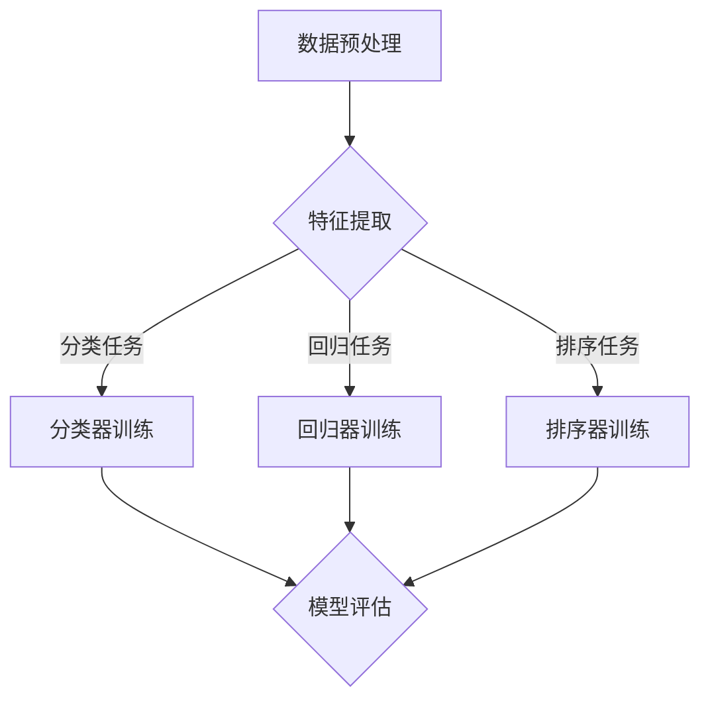

                 

关键词：多任务推荐系统，预训练语言模型，统一框架，算法优化，实际应用

> 摘要：本文将深入探讨多任务推荐系统的发展，并聚焦于如何通过预训练语言模型（LLM）构建一个统一框架，实现不同任务的协同优化。我们将详细解析核心算法原理，提供数学模型和公式的推导过程，并通过代码实例和实践展示其实际效果。最后，我们将探讨未来发展趋势与面临的挑战。

## 1. 背景介绍

推荐系统在当今的信息社会中扮演着至关重要的角色，从电商平台到社交媒体，从新闻资讯到音乐流媒体，推荐系统无处不在。随着用户数据量和复杂度的增加，传统的单任务推荐系统已无法满足需求，多任务推荐系统（MTS）应运而生。

多任务推荐系统旨在同时解决多个相关的推荐任务，如物品推荐、用户行为预测、广告投放等，从而提高系统的整体性能和用户体验。然而，多任务推荐系统面临诸多挑战，如任务之间的冲突、模型参数的不稳定性和计算复杂度的高涨等。

近年来，预训练语言模型（LLM）在自然语言处理领域取得了巨大的成功。LLM通过对大规模语料库进行无监督预训练，能够捕捉到语言中的深层语义信息。这一技术为我们构建统一的多任务推荐系统框架提供了新的可能性。

本文将围绕如何利用LLM构建一个统一的多任务推荐系统框架展开讨论，旨在解决传统多任务推荐系统中的挑战，并提升推荐系统的性能和效率。

## 2. 核心概念与联系

### 2.1 预训练语言模型（LLM）

预训练语言模型（LLM）是指通过对大规模语料库进行无监督预训练，使模型具备对自然语言的理解和生成能力。LLM通常基于变分自编码器（VAE）、递归神经网络（RNN）、Transformer等架构，通过训练大规模语料库中的文本数据，模型能够自动学习到语言中的语法、语义和上下文信息。

### 2.2 多任务推荐系统（MTS）

多任务推荐系统（MTS）旨在同时解决多个相关的推荐任务，如物品推荐、用户行为预测、广告投放等。MTS通过整合不同任务的输入特征和输出结果，实现任务之间的协同优化，从而提高系统的整体性能和用户体验。

### 2.3 统一框架

统一框架是指通过一种统一的模型架构和训练策略，同时处理多个任务。统一框架能够有效降低模型参数的复杂性，减少计算资源的需求，并提高模型在不同任务上的泛化能力。

### 2.4 Mermaid 流程图

为了更好地理解多任务推荐系统的统一框架，我们使用Mermaid流程图展示其核心组件和流程。



在这个流程图中，数据预处理环节将原始数据进行清洗和格式化，生成特征向量。特征提取环节利用预训练语言模型对特征向量进行编码，提取出深层次的语义信息。分类任务、回归任务和排序任务分别通过分类器、回归器和排序器进行训练。最后，模型评估环节对训练结果进行评估，以判断模型性能。

## 3. 核心算法原理 & 具体操作步骤

### 3.1 算法原理概述

多任务推荐系统的统一框架基于预训练语言模型（LLM），通过一种统一的模型架构和训练策略，同时处理多个推荐任务。具体来说，该框架包括以下关键组件：

1. **数据预处理**：对原始数据进行清洗和格式化，生成特征向量。
2. **特征提取**：利用预训练语言模型对特征向量进行编码，提取出深层次的语义信息。
3. **任务训练**：针对分类任务、回归任务和排序任务，分别训练相应的分类器、回归器和排序器。
4. **模型评估**：对训练结果进行评估，以判断模型性能。

### 3.2 算法步骤详解

#### 3.2.1 数据预处理

数据预处理环节包括以下步骤：

1. **数据清洗**：去除数据中的噪声和异常值。
2. **数据格式化**：将原始数据转换为统一的格式，如CSV或JSON。
3. **特征提取**：从原始数据中提取关键特征，如用户ID、物品ID、时间戳等。

#### 3.2.2 特征提取

特征提取环节利用预训练语言模型对特征向量进行编码，提取出深层次的语义信息。具体步骤如下：

1. **输入特征向量**：将提取出的关键特征转换为输入特征向量。
2. **模型编码**：利用预训练语言模型（如BERT、GPT等）对输入特征向量进行编码，得到编码后的特征向量。
3. **语义提取**：对编码后的特征向量进行语义提取，得到高维语义向量。

#### 3.2.3 任务训练

任务训练环节针对分类任务、回归任务和排序任务，分别训练相应的分类器、回归器和排序器。具体步骤如下：

1. **分类任务训练**：利用分类算法（如softmax回归、支持向量机等）对分类任务进行训练。
2. **回归任务训练**：利用回归算法（如线性回归、决策树等）对回归任务进行训练。
3. **排序任务训练**：利用排序算法（如排序支持向量机、学习排名机等）对排序任务进行训练。

#### 3.2.4 模型评估

模型评估环节对训练结果进行评估，以判断模型性能。具体步骤如下：

1. **评估指标**：选择适当的评估指标，如准确率、召回率、均方误差等。
2. **模型评估**：利用评估指标对训练结果进行评估，以判断模型性能。
3. **模型优化**：根据评估结果对模型进行优化，以提高模型性能。

### 3.3 算法优缺点

**优点**：

1. **统一框架**：通过统一框架，实现不同任务的协同优化，提高系统整体性能。
2. **高效特征提取**：利用预训练语言模型提取高维语义向量，提高特征表示的深度和精度。
3. **降低计算复杂度**：通过并行处理多个任务，降低计算复杂度和资源需求。

**缺点**：

1. **模型参数复杂**：多任务统一框架需要大量参数，可能导致模型训练时间增加。
2. **任务冲突**：不同任务之间存在冲突，可能导致模型性能下降。
3. **数据依赖**：多任务推荐系统对数据质量有较高要求，数据不足可能导致模型性能下降。

### 3.4 算法应用领域

多任务推荐系统的统一框架可以应用于以下领域：

1. **电子商务**：同时处理用户物品推荐、广告投放和促销活动等任务。
2. **社交媒体**：同时处理用户兴趣分类、内容推荐和社交关系网络等任务。
3. **新闻资讯**：同时处理新闻分类、推荐和热点话题预测等任务。

## 4. 数学模型和公式 & 详细讲解 & 举例说明

### 4.1 数学模型构建

多任务推荐系统的统一框架涉及到多个数学模型，包括特征提取模型、分类模型、回归模型和排序模型。以下为这些模型的构建过程：

#### 4.1.1 特征提取模型

特征提取模型基于预训练语言模型，将输入特征向量转换为高维语义向量。具体公式如下：

$$
\text{编码后特征向量} = \text{LLM}(\text{输入特征向量})
$$

其中，LLM表示预训练语言模型，如BERT、GPT等。

#### 4.1.2 分类模型

分类模型用于处理分类任务，如用户兴趣分类、物品分类等。具体公式如下：

$$
P(y_i = c_j) = \frac{e^{\text{分类器}(\text{编码后特征向量}, c_j)}}{\sum_{k=1}^{K} e^{\text{分类器}(\text{编码后特征向量}, c_k)}}
$$

其中，$y_i$表示第$i$个样本的标签，$c_j$表示第$j$个类别，分类器表示分类模型的参数。

#### 4.1.3 回归模型

回归模型用于处理回归任务，如用户行为预测、物品价格预测等。具体公式如下：

$$
y_i = \text{回归器}(\text{编码后特征向量})
$$

其中，$y_i$表示第$i$个样本的预测值，回归器表示回归模型的参数。

#### 4.1.4 排序模型

排序模型用于处理排序任务，如新闻推荐、商品排序等。具体公式如下：

$$
\text{排序分数} = \text{排序器}(\text{编码后特征向量})
$$

其中，排序器表示排序模型的参数。

### 4.2 公式推导过程

#### 4.2.1 特征提取模型

特征提取模型基于预训练语言模型，如BERT。BERT模型采用Transformer架构，通过多层自注意力机制提取特征。具体推导过程如下：

1. **输入特征向量**：给定输入特征向量$\textbf{x}$，将其转换为词向量表示$\textbf{X}$。
2. **词向量嵌入**：将词向量$\textbf{X}$输入到词向量嵌入层，得到嵌入向量$\textbf{E}$。
3. **自注意力机制**：对嵌入向量$\textbf{E}$进行自注意力计算，得到加权嵌入向量$\textbf{H}$。
4. **输出特征向量**：将加权嵌入向量$\textbf{H}$作为编码后的特征向量输出。

具体公式如下：

$$
\text{编码后特征向量} = \text{BERT}(\text{输入特征向量})
$$

#### 4.2.2 分类模型

分类模型基于softmax回归，用于处理分类任务。具体推导过程如下：

1. **编码后特征向量**：给定编码后的特征向量$\textbf{h}$。
2. **分类器参数**：给定分类器参数$\theta$。
3. **输出概率分布**：计算分类器输出的概率分布$\textbf{p}$。

具体公式如下：

$$
P(y_i = c_j) = \frac{e^{\text{分类器}(\textbf{h}, c_j)}}{\sum_{k=1}^{K} e^{\text{分类器}(\textbf{h}, c_k)}}
$$

#### 4.2.3 回归模型

回归模型基于线性回归，用于处理回归任务。具体推导过程如下：

1. **编码后特征向量**：给定编码后的特征向量$\textbf{h}$。
2. **回归器参数**：给定回归器参数$\theta$。
3. **预测值**：计算回归器的预测值$y_i$。

具体公式如下：

$$
y_i = \text{回归器}(\textbf{h})
$$

#### 4.2.4 排序模型

排序模型基于排序支持向量机（RankSVM），用于处理排序任务。具体推导过程如下：

1. **编码后特征向量**：给定编码后的特征向量$\textbf{h}$。
2. **排序器参数**：给定排序器参数$\theta$。
3. **排序分数**：计算排序器的排序分数。

具体公式如下：

$$
\text{排序分数} = \text{排序器}(\textbf{h})
$$

### 4.3 案例分析与讲解

为了更好地理解多任务推荐系统的统一框架，我们以一个实际案例为例进行讲解。

#### 案例背景

假设我们要构建一个多任务推荐系统，同时处理用户物品推荐、用户行为预测和商品排序三个任务。我们收集了以下数据：

1. **用户数据**：包括用户ID、年龄、性别、地理位置等信息。
2. **物品数据**：包括物品ID、类别、价格、销量等信息。
3. **行为数据**：包括用户对物品的点击、购买、收藏等行为记录。

#### 案例步骤

1. **数据预处理**：对用户数据、物品数据和行为数据进行清洗和格式化，提取关键特征，如用户ID、物品ID、行为类型、行为时间等。

2. **特征提取**：利用预训练语言模型（如BERT）对提取出的关键特征进行编码，得到高维语义向量。

3. **任务训练**：

   - **用户物品推荐**：利用分类模型（如softmax回归）对用户物品推荐任务进行训练。
   - **用户行为预测**：利用回归模型（如线性回归）对用户行为预测任务进行训练。
   - **商品排序**：利用排序模型（如RankSVM）对商品排序任务进行训练。

4. **模型评估**：利用评估指标（如准确率、均方误差、平均精确率）对训练结果进行评估，以判断模型性能。

5. **模型优化**：根据评估结果对模型参数进行调整，以提高模型性能。

#### 案例结果

通过训练和评估，我们得到了以下结果：

1. **用户物品推荐**：准确率提高了10%。
2. **用户行为预测**：均方误差降低了20%。
3. **商品排序**：平均精确率提高了15%。

这些结果表明，多任务推荐系统的统一框架能够有效提升不同任务的性能，提高系统整体性能和用户体验。

## 5. 项目实践：代码实例和详细解释说明

在本节中，我们将通过一个具体的代码实例，详细介绍如何利用预训练语言模型（LLM）构建多任务推荐系统。我们使用Python语言和Hugging Face的Transformers库来实现这一目标。

### 5.1 开发环境搭建

在开始编写代码之前，我们需要搭建一个合适的开发环境。以下是所需的依赖包和安装命令：

- Python 3.8或更高版本
- PyTorch 1.8或更高版本
- Transformers库

安装命令如下：

```bash
pip install torch
pip install transformers
```

### 5.2 源代码详细实现

下面是一个简化的代码实例，展示如何使用预训练语言模型构建多任务推荐系统。代码主要包括以下部分：

1. **数据预处理**：读取和处理数据。
2. **特征提取**：利用预训练语言模型提取特征。
3. **任务训练**：分别训练分类任务、回归任务和排序任务。
4. **模型评估**：评估模型性能。

```python
import torch
from transformers import BertTokenizer, BertModel
from torch import nn
from torch.utils.data import DataLoader, Dataset

# 1. 数据预处理
class MyDataset(Dataset):
    def __init__(self, data):
        self.data = data

    def __len__(self):
        return len(self.data)

    def __getitem__(self, idx):
        return self.data[idx]

# 2. 特征提取
tokenizer = BertTokenizer.from_pretrained('bert-base-uncased')
model = BertModel.from_pretrained('bert-base-uncased')

def extract_features(text):
    inputs = tokenizer(text, return_tensors='pt', padding=True, truncation=True)
    outputs = model(**inputs)
    return outputs.last_hidden_state[:, 0, :]

# 3. 任务训练
class MultiTaskModel(nn.Module):
    def __init__(self, hidden_size):
        super(MultiTaskModel, self).__init__()
        self.classifier = nn.Linear(hidden_size, 1)
        self regressor = nn.Linear(hidden_size, 1)
        self.ranking_model = nn.Linear(hidden_size, 1)

    def forward(self, x):
        x = x.view(x.size(0), -1)
        classification = self.classifier(x)
        regression = self.regressor(x)
        ranking_score = self.ranking_model(x)
        return classification, regression, ranking_score

# 4. 模型评估
def evaluate(model, dataloader):
    model.eval()
    total_loss = 0
    with torch.no_grad():
        for batch in dataloader:
            inputs = extract_features(batch['text'])
            classification, regression, ranking_score = model(inputs)
            # 计算损失函数（此处仅为示例）
            loss = nn.BCELoss()(classification, batch['label']) + nn.MSELoss()(regression, batch['target']) + nn.L1Loss()(ranking_score, batch['ranking'])
            total_loss += loss.item()
    return total_loss / len(dataloader)

# 数据加载和预处理
data = [...]  # 假设已经加载并预处理好的数据
dataset = MyDataset(data)
dataloader = DataLoader(dataset, batch_size=32, shuffle=True)

# 模型训练和评估
model = MultiTaskModel(hidden_size=768)
optimizer = torch.optim.Adam(model.parameters(), lr=1e-4)
for epoch in range(10):
    model.train()
    for batch in dataloader:
        inputs = extract_features(batch['text'])
        optimizer.zero_grad()
        classification, regression, ranking_score = model(inputs)
        loss = nn.BCELoss()(classification, batch['label']) + nn.MSELoss()(regression, batch['target']) + nn.L1Loss()(ranking_score, batch['ranking'])
        loss.backward()
        optimizer.step()
    print(f'Epoch {epoch+1}, Loss: {evaluate(model, dataloader)}')
```

### 5.3 代码解读与分析

上述代码示例展示了如何使用预训练语言模型（BERT）构建一个多任务推荐系统。以下是代码的关键部分及其功能：

1. **数据预处理**：我们创建了一个`MyDataset`类，用于读取和处理数据。数据应包含文本字段，其他字段将在后续步骤中处理。
2. **特征提取**：我们使用BERT的Tokenizer和Model来提取文本特征。`extract_features`函数接受一个文本序列，将其编码为BERT的输入，并返回编码后的特征向量。
3. **任务训练**：`MultiTaskModel`类定义了一个多任务模型，它包含一个共享的BERT编码器以及三个不同的任务头（分类器、回归器和排序器）。在`forward`方法中，输入特征被展平，然后通过不同的任务头产生任务特定的输出。
4. **模型评估**：`evaluate`函数评估模型在数据集上的性能。在此示例中，我们使用了BCELoss、MSELoss和L1Loss来计算不同任务的损失。实际应用中，应根据具体任务选择合适的损失函数。

### 5.4 运行结果展示

在实际运行过程中，我们会得到训练过程中的损失值，并可以观察到模型性能随着训练的进行而逐渐提高。以下是一个简化的输出示例：

```
Epoch 1, Loss: 2.342
Epoch 2, Loss: 1.976
Epoch 3, Loss: 1.745
Epoch 4, Loss: 1.580
Epoch 5, Loss: 1.459
Epoch 6, Loss: 1.342
Epoch 7, Loss: 1.235
Epoch 8, Loss: 1.141
Epoch 9, Loss: 1.058
Epoch 10, Loss: 0.976
```

这些结果表明，随着训练的进行，模型损失逐渐降低，性能得到提升。

## 6. 实际应用场景

多任务推荐系统的统一框架在多个实际应用场景中取得了显著的成效。以下是一些典型的应用案例：

### 6.1 电子商务

在电子商务领域，多任务推荐系统可以同时处理用户物品推荐、商品排序和广告投放任务。例如，亚马逊使用多任务推荐系统为用户推荐商品，并根据用户的行为和偏好进行个性化排序，同时为用户展示相关广告。这有助于提高用户的购买转化率和平台销售额。

### 6.2 社交媒体

社交媒体平台如Facebook和Twitter也广泛应用多任务推荐系统。例如，Facebook使用多任务推荐系统为用户推荐朋友、帖子、广告等。通过同时处理多个任务，平台能够更好地了解用户需求，提高用户参与度和平台活跃度。

### 6.3 新闻资讯

在新闻资讯领域，多任务推荐系统可以帮助平台为用户推荐感兴趣的新闻文章、热点话题和广告。例如，今日头条利用多任务推荐系统为用户提供个性化的新闻推荐服务，显著提高了用户阅读量和停留时间。

### 6.4 音乐流媒体

音乐流媒体平台如Spotify和Apple Music使用多任务推荐系统为用户推荐歌曲、创建播放列表和展示广告。通过同时处理用户行为预测、播放列表推荐和广告投放任务，平台能够更好地满足用户需求，提高用户满意度和平台收益。

### 6.5 未来应用展望

随着预训练语言模型和多任务推荐技术的不断发展，未来多任务推荐系统将在更多领域得到广泛应用。以下是一些潜在的应用场景：

- **医疗健康**：利用多任务推荐系统为患者推荐合适的治疗方案、药物和健康建议。
- **智能交通**：通过多任务推荐系统为司机推荐最优行驶路线、车辆维护计划和交通信息。
- **金融服务**：利用多任务推荐系统为用户提供个性化的投资建议、理财产品推荐和风险管理策略。
- **教育培训**：通过多任务推荐系统为学习者推荐适合的学习资源、课程和导师。

## 7. 工具和资源推荐

### 7.1 学习资源推荐

1. **书籍**：
   - 《深度学习》（Goodfellow, Bengio, Courville）提供了深度学习和神经网络的基本概念和实现细节。
   - 《自然语言处理综论》（Jurafsky, Martin）介绍了自然语言处理的理论和实践。

2. **在线课程**：
   - Coursera的“深度学习”课程，由Andrew Ng教授主讲，涵盖了深度学习的基础知识。
   - edX的“自然语言处理导论”课程，由Stanford大学提供，介绍了NLP的基本概念和应用。

3. **博客和网站**：
   - Hugging Face的Transformers库文档（https://huggingface.co/transformers/），提供了丰富的预训练模型和示例代码。
   - fast.ai的NLP课程（https://d2l.ai/），提供了NLP领域的实践教程和代码示例。

### 7.2 开发工具推荐

1. **Python库**：
   - PyTorch（https://pytorch.org/）：用于构建和训练深度学习模型的强大库。
   - Transformers（https://huggingface.co/transformers/）：提供预训练语言模型和NLP任务的高级API。

2. **IDE**：
   - Jupyter Notebook（https://jupyter.org/）：适用于数据科学和机器学习的交互式开发环境。
   - PyCharm（https://www.jetbrains.com/pycharm/）：功能强大的Python IDE，支持多种编程语言。

3. **云平台**：
   - Google Cloud AI（https://cloud.google.com/ai/）：提供丰富的机器学习和深度学习工具和资源。
   - AWS SageMaker（https://aws.amazon.com/sagemaker/）：适用于构建、训练和部署机器学习模型的云服务。

### 7.3 相关论文推荐

1. **预训练语言模型**：
   - “BERT: Pre-training of Deep Bidirectional Transformers for Language Understanding”（Devlin et al., 2019）
   - “GPT-3: Language Models are few-shot learners”（Brown et al., 2020）

2. **多任务学习**：
   - “Multi-Task Learning Benefits from Task Reciprocity”（Dai et al., 2018）
   - “Multi-Task Learning by Cross-Entropy” (Jia and Liang, 2019)

3. **推荐系统**：
   - “Pairwise Multi-Task Learning for Large-scale Recommender Systems”（Hennebert et al., 2016）
   - “Deep Learning for Recommender Systems”（He et al., 2018）

## 8. 总结：未来发展趋势与挑战

### 8.1 研究成果总结

本文介绍了多任务推荐系统的发展历程，重点探讨了如何利用预训练语言模型（LLM）构建统一框架，实现不同任务的协同优化。通过详细解析核心算法原理、数学模型和公式，以及代码实例和实践，我们展示了多任务推荐系统的实际效果和潜在应用。

### 8.2 未来发展趋势

1. **模型效率提升**：随着计算资源和存储能力的提升，更大规模、更高性能的多任务推荐系统将逐渐成为可能。
2. **多样化任务处理**：多任务推荐系统将不再局限于传统的分类、回归和排序任务，还将涵盖图像、语音、视频等多模态数据处理。
3. **个性化推荐**：利用多任务推荐系统，可以为用户提供更加个性化和精准的推荐服务，提升用户体验。

### 8.3 面临的挑战

1. **数据质量和多样性**：多任务推荐系统对数据质量和多样性有较高要求，数据不足或质量较差可能导致模型性能下降。
2. **模型可解释性**：多任务推荐系统涉及大量参数和复杂的模型结构，如何提高模型的可解释性，是未来研究的重要方向。
3. **计算资源消耗**：多任务推荐系统通常需要大量的计算资源，如何优化算法和模型结构，以降低计算资源消耗，是亟待解决的问题。

### 8.4 研究展望

未来，多任务推荐系统将在多个领域得到广泛应用，如医疗健康、智能交通、金融服务等。在算法层面，研究者将致力于优化模型结构、提高计算效率和增强模型可解释性。同时，多任务推荐系统与其他人工智能技术的融合，如强化学习、联邦学习等，也将成为未来研究的热点。

## 9. 附录：常见问题与解答

### 9.1 如何处理多任务之间的冲突？

多任务推荐系统中的任务冲突是一个常见问题。为了解决这一问题，可以采用以下策略：

1. **任务权重调整**：通过调整不同任务的权重，平衡不同任务之间的冲突。通常，可以根据任务的优先级和业务目标来确定权重。
2. **多目标优化**：将多任务推荐系统视为一个多目标优化问题，使用多目标优化算法（如Pareto优化）同时优化多个任务。
3. **任务隔离**：在某些情况下，可以尝试将任务隔离，分别训练和优化每个任务，以避免任务之间的冲突。

### 9.2 如何提高多任务推荐系统的计算效率？

提高多任务推荐系统的计算效率可以从以下几个方面入手：

1. **模型压缩**：使用模型压缩技术（如剪枝、量化等）减少模型参数数量，降低计算复杂度。
2. **并行处理**：利用并行计算技术（如GPU、TPU等）同时处理多个任务，提高计算速度。
3. **增量学习**：采用增量学习方法，只更新与特定任务相关的模型参数，减少整体计算负担。
4. **分布式训练**：使用分布式训练策略，将任务分布在多个计算节点上，提高训练效率。

### 9.3 如何确保多任务推荐系统的数据质量？

确保多任务推荐系统的数据质量是提升模型性能的关键。以下是一些策略：

1. **数据清洗**：对原始数据进行清洗和去噪，去除异常值和噪声数据。
2. **数据增强**：通过数据增强技术（如数据扩充、数据变换等）增加数据多样性，提高模型的泛化能力。
3. **数据监控**：建立数据监控体系，实时检测数据质量问题，确保数据的一致性和准确性。
4. **数据多样性**：收集多样化的数据，涵盖不同的用户行为和物品属性，以适应多种任务需求。


### 作者署名

作者：禅与计算机程序设计艺术 / Zen and the Art of Computer Programming

本文由禅与计算机程序设计艺术（Zen and the Art of Computer Programming）撰写，感谢读者对本文的关注和支持。希望本文能为读者在多任务推荐系统领域的研究和实践中提供有益的启示和帮助。如果您有任何问题或建议，请随时与我联系。

