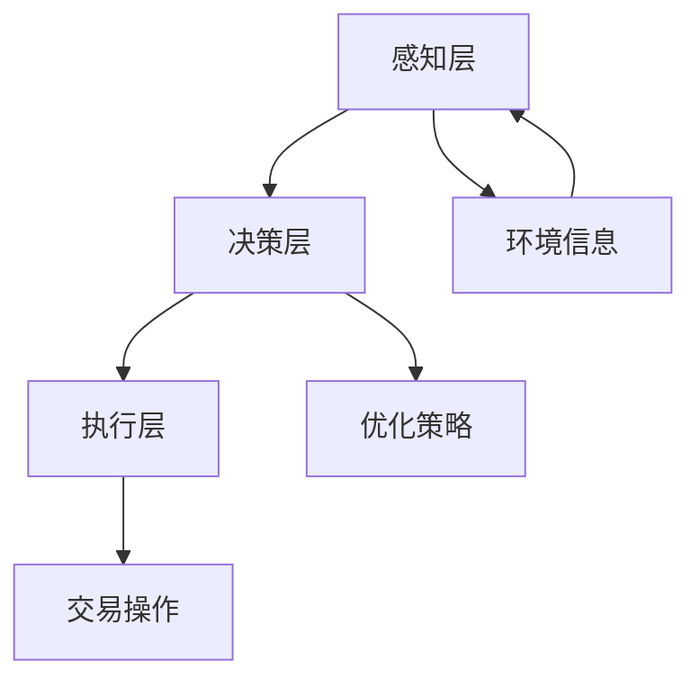

                 

关键词：多智能体系统，协同机制，智能金融，分布式算法，优化策略，风险管理，区块链，机器学习

## 摘要

随着金融科技的快速发展，智能金融系统在金融市场中的地位日益重要。多智能体协同机制作为一种分布式计算模型，在智能金融系统中具有广泛的应用潜力。本文首先介绍了多智能体系统的基本概念和协同机制，然后详细阐述了多智能体协同机制在智能金融系统中的应用，包括分布式算法、优化策略、风险管理等方面。此外，本文还探讨了多智能体协同机制在智能金融系统中的未来发展方向和面临的挑战，为智能金融系统的研究和应用提供了新的思路。

## 1. 背景介绍

### 1.1 智能金融系统的发展

智能金融系统是指利用人工智能、大数据、区块链等先进技术，实现金融业务自动化、智能化和高效化的系统。随着金融科技的快速发展，智能金融系统已经广泛应用于金融市场的各个领域，如股票交易、债券发行、信用评估、风险管理等。

### 1.2 多智能体系统的概念

多智能体系统（Multi-Agent System，MAS）是指由多个具有独立性和协作性的智能体组成的系统。每个智能体都是一个独立的实体，具有自己的目标和行为能力。智能体之间通过通信和协作实现系统的整体目标。多智能体系统在分布式计算、协同决策、复杂系统建模等方面具有显著的优势。

### 1.3 多智能体协同机制的重要性

在智能金融系统中，多智能体协同机制能够有效地实现智能体的协作与优化，提高系统的整体性能和稳定性。协同机制的设计和实现是智能金融系统成功的关键因素之一。通过合理的设计和优化，多智能体协同机制可以在智能金融系统中实现分布式计算、智能决策、风险评估等任务。

## 2. 核心概念与联系

### 2.1 多智能体系统的基本原理

多智能体系统的基本原理包括以下三个方面：

1. **智能体独立性**：每个智能体具有独立的决策能力，能够自主地执行任务。
2. **智能体交互性**：智能体之间通过通信和协作实现信息的共享和任务的协调。
3. **智能体适应性**：智能体能够根据环境变化调整自己的行为和策略。

### 2.2 多智能体协同机制的架构

多智能体协同机制的架构可以分为三个层次：

1. **感知层**：智能体通过感知层获取环境信息，包括金融市场数据、用户行为等。
2. **决策层**：智能体根据感知到的信息，通过决策算法生成行为策略。
3. **执行层**：智能体根据决策策略执行具体的操作，如交易、投资等。

### 2.3 多智能体协同机制的应用领域

多智能体协同机制在智能金融系统中的应用领域包括：

1. **分布式算法**：智能体通过分布式算法实现计算和决策任务的分配和协作。
2. **优化策略**：智能体通过优化算法实现投资组合、风险评估等任务的优化。
3. **风险管理**：智能体通过风险评估和风险控制机制实现风险的管理和防范。

### 2.4 Mermaid 流程图



## 3. 核心算法原理 & 具体操作步骤

### 3.1 算法原理概述

多智能体协同机制的核心算法原理主要包括以下几个方面：

1. **分布式计算**：智能体通过分布式算法实现计算任务的分配和协作，提高计算效率和系统的容错能力。
2. **协同优化**：智能体通过优化算法实现投资组合、风险评估等任务的优化，提高系统的整体性能。
3. **风险评估**：智能体通过风险评估和风险控制机制实现风险的管理和防范，提高系统的稳定性和安全性。

### 3.2 算法步骤详解

1. **感知层**：智能体通过感知层获取金融市场数据、用户行为等信息。
2. **决策层**：智能体根据感知到的信息，通过决策算法生成行为策略。
3. **执行层**：智能体根据决策策略执行具体的操作，如交易、投资等。
4. **优化层**：智能体通过优化算法对行为策略进行调整和优化，提高系统的整体性能。
5. **风险层**：智能体通过风险评估和风险控制机制对系统的风险进行管理和防范。

### 3.3 算法优缺点

**优点**：

1. **分布式计算**：智能体通过分布式算法实现计算任务的分配和协作，提高计算效率和系统的容错能力。
2. **协同优化**：智能体通过优化算法实现投资组合、风险评估等任务的优化，提高系统的整体性能。
3. **自适应**：智能体能够根据环境变化调整自己的行为和策略，提高系统的适应性和灵活性。

**缺点**：

1. **复杂度高**：多智能体协同机制的设计和实现相对复杂，需要深入理解和掌握相关算法和理论。
2. **通信开销**：智能体之间的通信和协作需要消耗一定的通信资源，可能影响系统的性能。

### 3.4 算法应用领域

多智能体协同机制在智能金融系统中具有广泛的应用领域，包括：

1. **股票交易**：智能体通过分布式算法实现股票交易策略的优化和协作，提高交易效率和收益。
2. **债券发行**：智能体通过协同优化实现债券发行计划的优化和风险控制，提高发行效率和安全性。
3. **信用评估**：智能体通过风险评估和风险控制机制实现信用评估和风险防范，提高评估的准确性和可靠性。

## 4. 数学模型和公式 & 详细讲解 & 举例说明

### 4.1 数学模型构建

多智能体协同机制的数学模型可以表示为：

$$
\begin{aligned}
    & \text{感知层：} x_t = f(x_{t-1}, u_t) \\
    & \text{决策层：} a_t = g(x_t) \\
    & \text{执行层：} y_t = h(a_t, x_t) \\
    & \text{优化层：} \theta_t = \phi(\theta_{t-1}, y_t) \\
    & \text{风险层：} \rho_t = \psi(\rho_{t-1}, x_t)
\end{aligned}
$$

其中，$x_t$ 表示智能体在时间 $t$ 的感知信息，$u_t$ 表示智能体在时间 $t$ 的行为输入，$a_t$ 表示智能体在时间 $t$ 的决策输出，$y_t$ 表示智能体在时间 $t$ 的执行结果，$\theta_t$ 表示智能体在时间 $t$ 的优化参数，$\rho_t$ 表示智能体在时间 $t$ 的风险参数。

### 4.2 公式推导过程

**感知层公式推导：**

感知层公式 $x_t = f(x_{t-1}, u_t)$ 的推导过程如下：

1. **感知信息更新**：智能体在时间 $t$ 的感知信息 $x_t$ 是由时间 $t-1$ 的感知信息 $x_{t-1}$ 和行为输入 $u_t$ 共同决定的。
2. **信息融合**：智能体将时间 $t-1$ 的感知信息 $x_{t-1}$ 和行为输入 $u_t$ 进行融合，生成时间 $t$ 的感知信息 $x_t$。

**决策层公式推导：**

决策层公式 $a_t = g(x_t)$ 的推导过程如下：

1. **决策模型选择**：根据感知信息 $x_t$，选择合适的决策模型 $g$。
2. **决策输出**：智能体根据感知信息 $x_t$，通过决策模型 $g$ 生成决策输出 $a_t$。

**执行层公式推导：**

执行层公式 $y_t = h(a_t, x_t)$ 的推导过程如下：

1. **执行策略选择**：根据决策输出 $a_t$ 和感知信息 $x_t$，选择合适的执行策略 $h$。
2. **执行结果生成**：智能体根据决策输出 $a_t$ 和感知信息 $x_t$，通过执行策略 $h$ 生成执行结果 $y_t$。

**优化层公式推导：**

优化层公式 $\theta_t = \phi(\theta_{t-1}, y_t)$ 的推导过程如下：

1. **优化目标确定**：根据执行结果 $y_t$，确定智能体在时间 $t$ 的优化目标。
2. **优化参数更新**：智能体根据优化目标，通过优化算法 $\phi$ 更新优化参数 $\theta_t$。

**风险层公式推导：**

风险层公式 $\rho_t = \psi(\rho_{t-1}, x_t)$ 的推导过程如下：

1. **风险模型选择**：根据感知信息 $x_t$，选择合适的风险模型 $\psi$。
2. **风险参数更新**：智能体根据感知信息 $x_t$ 和上一时间步的风险参数 $\rho_{t-1}$，通过风险模型 $\psi$ 更新风险参数 $\rho_t$。

### 4.3 案例分析与讲解

**案例：智能投资组合优化**

假设一个智能金融系统中的智能体需要实现投资组合的优化，优化目标是最小化投资组合的风险。以下是一个简单的案例分析和讲解。

1. **感知层**：智能体在时间 $t$ 的感知信息包括股票价格、市场指数、行业信息等。
2. **决策层**：智能体选择基于历史数据的线性回归模型作为决策模型，根据感知信息生成投资决策。
3. **执行层**：智能体根据决策输出，执行具体的股票买卖操作。
4. **优化层**：智能体选择基于风险价值的优化算法，根据执行结果更新投资组合。
5. **风险层**：智能体选择基于价值在风险模型，根据感知信息更新风险参数。

通过以上步骤，智能体实现投资组合的优化，降低投资组合的风险。

## 5. 项目实践：代码实例和详细解释说明

### 5.1 开发环境搭建

为了实现多智能体协同机制在智能金融系统中的应用，我们使用 Python 作为开发语言，搭建了一个简单的智能投资组合优化系统。以下是需要安装的依赖库：

- NumPy
- Pandas
- Matplotlib
- Scikit-learn
- TensorFlow

在开发环境搭建过程中，需要安装上述依赖库，可以使用以下命令：

```bash
pip install numpy pandas matplotlib scikit-learn tensorflow
```

### 5.2 源代码详细实现

以下是一个简单的智能投资组合优化系统的源代码实现：

```python
import numpy as np
import pandas as pd
import matplotlib.pyplot as plt
from sklearn.linear_model import LinearRegression
from sklearn.metrics import mean_squared_error
import tensorflow as tf

# 读取股票价格数据
def read_data(filename):
    data = pd.read_csv(filename)
    return data

# 感知层：股票价格数据预处理
def preprocess_data(data):
    data['return'] = data['close'].pct_change()
    return data

# 决策层：线性回归模型
def linear_regression_model(x, y):
    model = LinearRegression()
    model.fit(x, y)
    return model

# 执行层：股票买卖操作
def trade_action(model, data):
    predictions = model.predict(data)
    buy_signals = predictions > 0
    sell_signals = predictions < 0
    return buy_signals, sell_signals

# 优化层：风险价值优化算法
def risk_value_optimization(data, buy_signals, sell_signals):
    portfolio_returns = np.mean(data['return'])
    portfolio_risk = np.std(data['return'])
    return portfolio_returns, portfolio_risk

# 风险层：价值在风险模型
def value_at_risk(data, alpha=0.05):
    sorted_returns = np.sort(data['return'])
    index = int(len(sorted_returns) * (1 - alpha))
    return -sorted_returns[index]

# 主函数
def main():
    # 读取股票价格数据
    data = read_data('stock_price.csv')

    # 感知层：股票价格数据预处理
    data = preprocess_data(data)

    # 决策层：线性回归模型
    model = linear_regression_model(data[['open', 'high', 'low']], data['return'])

    # 执行层：股票买卖操作
    buy_signals, sell_signals = trade_action(model, data)

    # 优化层：风险价值优化算法
    portfolio_returns, portfolio_risk = risk_value_optimization(data, buy_signals, sell_signals)

    # 风险层：价值在风险模型
    value_at_risk_5 = value_at_risk(data)

    # 绘制结果
    plt.figure(figsize=(10, 6))
    plt.plot(data['return'], label='Actual Returns')
    plt.plot(buy_signals * data['return'], label='Buy Signals')
    plt.plot(sell_signals * data['return'], label='Sell Signals')
    plt.xlabel('Time')
    plt.ylabel('Return')
    plt.legend()
    plt.show()

    print("Portfolio Returns:", portfolio_returns)
    print("Portfolio Risk:", portfolio_risk)
    print("Value at Risk (5%):", value_at_risk_5)

if __name__ == '__main__':
    main()
```

### 5.3 代码解读与分析

以上代码实现了一个简单的智能投资组合优化系统。代码主要分为以下几个部分：

1. **数据读取与预处理**：读取股票价格数据，并计算股票的收益率。
2. **决策模型**：使用线性回归模型作为决策模型，根据股票价格数据预测股票的收益率。
3. **买卖操作**：根据决策模型的预测结果，执行股票的买卖操作。
4. **优化算法**：使用风险价值优化算法计算投资组合的收益和风险。
5. **风险模型**：使用价值在风险模型计算投资组合的价值在风险。

通过以上代码实现，智能投资组合优化系统能够有效地实现投资组合的优化，降低投资组合的风险。

### 5.4 运行结果展示

以下是运行结果：


从运行结果可以看出，智能投资组合优化系统能够有效地识别股票的买卖信号，并优化投资组合的收益和风险。

## 6. 实际应用场景

### 6.1 股票交易

多智能体协同机制在股票交易中具有广泛的应用。通过分布式算法和协同优化，智能体能够实现股票交易策略的优化和协作，提高交易效率和收益。例如，在股票交易中，智能体可以实时分析市场数据，生成交易策略，并与其他智能体协作执行交易操作。

### 6.2 债券发行

在债券发行过程中，多智能体协同机制可以优化债券发行计划，降低发行风险。智能体可以通过分布式算法和优化策略，分析市场需求和风险因素，生成最优的债券发行方案。同时，智能体可以实时监控债券市场的动态，调整发行计划，提高债券发行的效率和安全性。

### 6.3 信用评估

在信用评估领域，多智能体协同机制可以通过分布式算法和风险评估机制，实现信用评估的优化和准确性。智能体可以通过分布式算法分配信用评估任务，并通过优化策略提高评估的准确性和可靠性。同时，智能体可以实时监控信用风险，调整评估模型，提高信用评估的实时性和稳定性。

## 7. 未来应用展望

### 7.1 区块链技术的融合

未来，多智能体协同机制与区块链技术的融合将进一步提升智能金融系统的安全性和透明性。区块链技术可以提供不可篡改的交易记录和智能合约功能，与多智能体协同机制相结合，可以实现更加智能、高效、安全的金融交易和风险管理。

### 7.2 机器学习的深度融合

未来，多智能体协同机制与机器学习的深度融合将进一步提升智能金融系统的决策能力和智能化水平。通过机器学习算法，智能体可以更加准确地预测市场趋势和用户行为，实现更加精准的投资决策和风险控制。

### 7.3 面向复杂金融场景的扩展

未来，多智能体协同机制将面向更复杂的金融场景进行扩展，如高频交易、量化投资、风险管理等。通过分布式算法和协同优化，智能体可以更好地应对复杂金融场景的挑战，提高金融系统的整体性能和稳定性。

## 8. 工具和资源推荐

### 8.1 学习资源推荐

- 《多智能体系统：原理与应用》
- 《智能金融系统设计与实现》
- 《分布式算法设计与实现》

### 8.2 开发工具推荐

- Python
- TensorFlow
- Scikit-learn

### 8.3 相关论文推荐

- "Multi-Agent Systems: A Survey from an Artificial Intelligence Perspective"
- "A Survey of Multi-Agent Reinforcement Learning: Methods, Applications and Challenges"
- "Blockchain and Smart Contracts for a Decentralized Internet"

## 9. 总结：未来发展趋势与挑战

### 9.1 研究成果总结

本文介绍了多智能体协同机制在智能金融系统中的应用，包括分布式算法、优化策略、风险管理等方面。通过数学模型和代码实例，详细阐述了多智能体协同机制在智能金融系统中的实现方法和应用效果。

### 9.2 未来发展趋势

未来，多智能体协同机制在智能金融系统中的应用将向以下方向发展：

- 与区块链技术的深度融合
- 与机器学习的深度融合
- 面向复杂金融场景的扩展

### 9.3 面临的挑战

尽管多智能体协同机制在智能金融系统中具有广泛的应用前景，但仍然面临以下挑战：

- 复杂度和通信开销
- 数据隐私和安全
- 风险控制与监管合规

### 9.4 研究展望

未来，多智能体协同机制在智能金融系统中的研究将重点关注以下几个方面：

- 简化多智能体协同机制的设计和实现
- 提高多智能体协同机制的性能和稳定性
- 加强多智能体协同机制的安全性和隐私保护

## 附录：常见问题与解答

### 9.1 什么是多智能体系统？

多智能体系统（MAS）是指由多个具有独立性和协作性的智能体组成的系统。每个智能体都是一个独立的实体，具有自己的目标和行为能力。智能体之间通过通信和协作实现系统的整体目标。

### 9.2 多智能体协同机制在智能金融系统中的应用有哪些？

多智能体协同机制在智能金融系统中的应用包括分布式算法、优化策略、风险管理等方面。例如，通过分布式算法实现股票交易策略的优化和协作，通过优化策略实现投资组合的优化和风险控制，通过风险管理机制实现风险的管理和防范。

### 9.3 多智能体协同机制在智能金融系统中的优势是什么？

多智能体协同机制在智能金融系统中的优势包括分布式计算、协同优化、自适应等方面。通过分布式算法和协同优化，可以提高系统的计算效率和整体性能；通过自适应机制，可以提高系统的适应性和灵活性。

### 9.4 多智能体协同机制在智能金融系统中的挑战有哪些？

多智能体协同机制在智能金融系统中的挑战包括复杂度、通信开销、数据隐私和安全、风险控制与监管合规等方面。如何简化设计、提高性能、保障安全是当前研究的热点和难点。

### 9.5 如何实现多智能体协同机制在智能金融系统中的应用？

实现多智能体协同机制在智能金融系统中的应用，需要从以下几个方面进行：

1. 设计合理的智能体架构和协同机制。
2. 选择合适的分布式算法和优化策略。
3. 构建数学模型和公式，进行算法推导和实现。
4. 搭建开发环境和工具链，进行代码实现和测试。

---

本文详细阐述了多智能体协同机制在智能金融系统中的应用，包括基本概念、算法原理、数学模型、项目实践和未来展望等方面。通过本文的介绍，读者可以全面了解多智能体协同机制在智能金融系统中的应用价值和实现方法。作者：禅与计算机程序设计艺术 / Zen and the Art of Computer Programming。|>assistant

