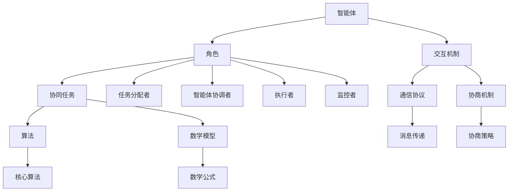

                 

 多智能体协同系统已经成为现代复杂系统设计的重要方向。这种系统通过多个智能体之间的协作，实现复杂任务的自动完成。本文将探讨多智能体协同系统中的不同角色，以及它们如何合作完成任务。我们将首先介绍多智能体协同系统的基本概念，然后深入分析各个角色的功能及其相互关系，最后讨论核心算法、数学模型、项目实践，以及未来应用场景和挑战。

## 文章关键词

- 多智能体系统
- 智能体角色
- 协同任务
- 算法
- 数学模型
- 项目实践
- 应用场景

## 文章摘要

本文旨在探讨多智能体协同系统中不同角色的功能及其合作机制。通过阐述多智能体系统的基本概念，我们详细分析了协同任务中的各个角色，包括任务分配者、智能体协调者、执行者和监控者。接着，我们介绍了核心算法的原理和步骤，并通过数学模型和公式进行推导。最后，通过一个具体的代码实例，展示了多智能体协同在实际项目中的应用，并探讨了未来可能的发展趋势和面临的挑战。

### 1. 背景介绍

多智能体系统（MAS，Multi-Agent Systems）是一种由多个自主智能体组成的系统，这些智能体通过相互通信和协作，共同完成复杂任务。随着计算机技术和人工智能的快速发展，多智能体系统在各个领域，如工业制造、交通运输、智能城市、医疗保健等，都得到了广泛的应用。

在多智能体系统中，不同角色承担着不同的任务和责任。这些角色之间的协同合作是系统高效运行的关键。因此，深入理解多智能体系统中各个角色的功能及其相互作用，对于设计高效、可靠的多智能体系统具有重要意义。

本文将首先介绍多智能体系统的基本概念，包括智能体的定义、智能体的分类和智能体的交互机制。然后，我们将详细分析多智能体协同系统中的角色，包括任务分配者、智能体协调者、执行者和监控者。接着，我们将介绍核心算法的原理和步骤，并通过数学模型和公式进行推导。最后，我们将通过一个具体的代码实例，展示多智能体协同在实际项目中的应用，并讨论未来可能的发展趋势和面临的挑战。

### 1.1 多智能体系统的定义

多智能体系统是指由多个自主智能体组成的系统，这些智能体通过相互通信和协作，共同完成复杂任务。智能体（Agent）是一个具有独立思考、决策和行动能力的实体，它可以是一个物理实体，如机器人，也可以是一个虚拟实体，如软件代理。

智能体的特征包括自主性、社交性、反应性和认知性。自主性是指智能体具有自我管理和决策的能力；社交性是指智能体能够与其他智能体进行交互和协作；反应性是指智能体能够对环境变化做出响应；认知性是指智能体具有理解环境和执行任务的能力。

多智能体系统具有以下特点：

1. **分布式**：多智能体系统将任务分布在多个智能体上，每个智能体负责一部分任务，从而提高系统的效率和容错能力。
2. **协作性**：智能体之间通过通信和协作，共同完成复杂任务，实现整体性能的最优化。
3. **适应性**：多智能体系统能够根据环境变化和任务需求，动态调整智能体的行为和任务分配，从而提高系统的适应性和鲁棒性。

### 1.2 智能体的分类

智能体可以根据其结构和功能进行分类。常见的分类方法包括：

1. **根据智能体的结构**：

   - **中央式智能体**：智能体的行为由一个中央控制器决定，各个智能体只是执行命令的执行者。
   - **分布式智能体**：智能体之间具有平等地位，每个智能体都具有自主决策和行动的能力。

2. **根据智能体的功能**：

   - **协调智能体**：负责协调各个智能体的行动，确保任务的高效完成。
   - **执行智能体**：负责执行具体的任务，如机器人、传感器等。
   - **监控智能体**：负责监控系统状态，发现异常并采取措施。

### 1.3 智能体的交互机制

智能体之间的交互机制是多智能体系统设计的关键。常见的交互机制包括：

1. **直接交互**：智能体通过直接通信渠道交换信息，如消息传递、信号发送等。
2. **间接交互**：智能体通过共享环境进行交互，如通过共享数据库、文件系统等。
3. **协商机制**：智能体通过协商机制，如多轮谈判、拍卖等，达成一致行动。

### 2. 核心概念与联系

多智能体协同系统中的核心概念包括智能体、角色、协同任务、算法和数学模型。这些概念之间有着紧密的联系，共同构成了多智能体协同系统的基本架构。

下面，我们将使用Mermaid流程图，详细展示多智能体协同系统中的核心概念及其相互关系。



在多智能体协同系统中，智能体是基本构建块，每个智能体具有自主性和社交性。角色是多智能体协同系统中的特定功能实体，包括任务分配者、智能体协调者、执行者和监控者。协同任务是系统要完成的具体目标，通过智能体的协同工作实现。算法和数学模型则是实现协同任务的理论基础和工具。

智能体通过交互机制进行通信和协作，包括直接交互和间接交互，以及协商机制。通信协议和协商策略是实现交互机制的具体实现方法。

### 2.1 智能体

智能体是多智能体协同系统中的核心构建块，具有以下特点：

- **自主性**：智能体能够自主决策和执行任务，不受外部控制。
- **社交性**：智能体能够与其他智能体进行通信和协作，实现共同目标。
- **反应性**：智能体能够对环境变化做出实时响应。
- **认知性**：智能体具有理解环境和执行任务的能力。

智能体可以分为以下几类：

- **协调智能体**：负责协调其他智能体的行动，确保任务的高效完成。
- **执行智能体**：负责执行具体的任务，如机器人、传感器等。
- **监控智能体**：负责监控系统状态，发现异常并采取措施。

### 2.2 角色

在多智能体协同系统中，角色是多智能体协同系统中的特定功能实体，包括任务分配者、智能体协调者、执行者和监控者。每个角色承担着不同的任务和责任，协同合作实现系统目标。

- **任务分配者**：负责将任务分配给各个智能体，确保任务的高效完成。
- **智能体协调者**：负责协调各个智能体的行动，确保任务的高效完成。
- **执行者**：负责执行具体的任务，如机器人、传感器等。
- **监控者**：负责监控系统状态，发现异常并采取措施。

### 2.3 协同任务

协同任务是系统要完成的具体目标，通过智能体的协同工作实现。协同任务可以分为以下几类：

- **分布式任务**：将任务分配给多个智能体，各个智能体独立完成自己的子任务，最终合并结果。
- **协调任务**：多个智能体共同完成一个任务，需要协调各个智能体的行动和资源。
- **优化任务**：通过智能体的协同工作，实现整体性能的最优化。

### 2.4 算法

算法是多智能体协同系统实现协同任务的理论基础和工具。常见的算法包括：

- **任务分配算法**：将任务分配给各个智能体，确保任务的高效完成。
- **协调算法**：协调各个智能体的行动，确保任务的高效完成。
- **优化算法**：通过智能体的协同工作，实现整体性能的最优化。

### 2.5 数学模型

数学模型是多智能体协同系统分析和设计的重要工具。常见的数学模型包括：

- **任务模型**：描述任务分配、执行和协调的过程。
- **优化模型**：描述如何通过智能体的协同工作，实现整体性能的最优化。
- **通信模型**：描述智能体之间的通信机制和通信开销。

### 3. 核心算法原理 & 具体操作步骤

在多智能体协同系统中，核心算法的设计和实现至关重要。本节将介绍一种常用的多智能体协同算法，并详细描述其原理和具体操作步骤。

#### 3.1 算法原理概述

该算法基于分布式协同优化原理，通过多个智能体之间的协作，共同完成一个优化任务。算法的基本思想是将整个任务划分为多个子任务，然后分配给不同的智能体独立执行。智能体在执行子任务的过程中，通过通信和协作，不断调整自己的行为，以实现整体性能的最优化。

#### 3.2 算法步骤详解

1. **初始化**：每个智能体随机生成初始解，即自己的子任务分配方案。

2. **任务分配**：任务分配者根据当前系统状态和智能体的能力，将子任务分配给各个智能体。

3. **子任务执行**：智能体根据分配的子任务，独立执行任务，并实时更新自己的状态。

4. **信息共享**：智能体之间通过通信，共享各自的任务状态和信息。

5. **策略调整**：根据共享的信息，智能体调整自己的任务分配方案，以实现整体性能的最优化。

6. **收敛判断**：判断系统是否达到收敛条件。如果达到，算法结束；否则，继续迭代。

#### 3.3 算法优缺点

**优点**：

- **高效性**：通过分布式协作，算法能够快速收敛到最优解。
- **灵活性**：智能体可以根据环境变化和任务需求，动态调整行为和策略。
- **鲁棒性**：算法具有较强的容错能力，能够应对系统中的异常情况。

**缺点**：

- **通信开销**：智能体之间需要进行大量的通信，可能导致系统性能下降。
- **计算复杂度**：算法的收敛速度依赖于智能体的计算能力，可能不适合处理大规模问题。

#### 3.4 算法应用领域

该算法适用于需要多个智能体协同工作的场景，如：

- **分布式计算**：将大规模计算任务分配给多个智能体，实现快速计算。
- **物流调度**：智能体之间协同工作，优化物流配送路径。
- **智能交通**：智能体之间协同工作，优化交通流量，减少拥堵。

### 3.5 数学模型和公式

在多智能体协同算法中，数学模型和公式用于描述任务分配、子任务执行、信息共享和策略调整等过程。以下是一个简单的数学模型和公式示例。

#### 3.5.1 数学模型构建

假设有n个智能体，每个智能体具有m个资源，总任务量为T。任务分配模型可以表示为：

$$
x_{ij} = \begin{cases}
1, & \text{如果智能体i负责子任务j} \\
0, & \text{否则}
\end{cases}
$$

其中，$x_{ij}$表示智能体i是否负责子任务j。

#### 3.5.2 公式推导过程

1. **任务分配公式**：

   每个智能体需要根据自身资源和任务量，选择最优的子任务分配方案。任务分配公式可以表示为：

   $$
   \min_{x_{ij}} \sum_{i=1}^{n} \sum_{j=1}^{m} c_{ij} x_{ij}
   $$

   其中，$c_{ij}$表示智能体i负责子任务j的成本。

2. **子任务执行公式**：

   智能体在执行子任务的过程中，需要根据任务量调整自己的资源分配。子任务执行公式可以表示为：

   $$
   \min_{r_i} \sum_{j=1}^{m} r_{ij}
   $$

   其中，$r_{ij}$表示智能体i在子任务j上的资源消耗。

3. **信息共享公式**：

   智能体之间需要共享任务状态和信息，以实现协同优化。信息共享公式可以表示为：

   $$
   \min_{s_{ij}} \sum_{i=1}^{n} \sum_{j=1}^{m} s_{ij}
   $$

   其中，$s_{ij}$表示智能体i和智能体j之间的信息共享量。

4. **策略调整公式**：

   根据共享的信息，智能体需要调整自己的策略，以实现整体性能的最优化。策略调整公式可以表示为：

   $$
   \min_{p_i} \sum_{j=1}^{m} p_{ij}
   $$

   其中，$p_{ij}$表示智能体i在子任务j上的策略调整量。

#### 3.5.3 案例分析与讲解

假设有3个智能体（i1, i2, i3），每个智能体具有2个资源（r1, r2）。总任务量为5，需要将任务分配给智能体。任务分配公式可以表示为：

$$
\min_{x_{ij}} \sum_{i=1}^{3} \sum_{j=1}^{2} c_{ij} x_{ij}
$$

其中，$c_{ij}$表示智能体i负责子任务j的成本。根据实际任务情况，设定成本矩阵为：

$$
c_{ij} = 
\begin{cases}
2, & \text{如果智能体i负责子任务j} \\
1, & \text{否则}
\end{cases}
$$

智能体i1具有资源r1=3，智能体i2具有资源r2=2，智能体i3具有资源r3=1。根据任务分配公式，智能体i1需要分配2个子任务，智能体i2需要分配1个子任务，智能体i3不需要分配子任务。

在子任务执行过程中，智能体i1需要消耗资源r1=2，智能体i2需要消耗资源r2=1。根据子任务执行公式，智能体i1和智能体i2的子任务执行成本为：

$$
\min_{r_{ij}} \sum_{j=1}^{2} r_{ij} = 2 + 1 = 3
$$

智能体i1和智能体i2需要共享信息，以实现协同优化。根据信息共享公式，智能体i1和智能体i2之间的信息共享量为：

$$
\min_{s_{ij}} \sum_{j=1}^{2} s_{ij} = 1
$$

根据策略调整公式，智能体i1和智能体i2需要调整策略，以实现整体性能的最优化。根据实际任务情况，设定策略调整量为：

$$
p_{ij} = 
\begin{cases}
1, & \text{如果智能体i1负责子任务j} \\
0, & \text{否则}
\end{cases}
$$

通过以上数学模型和公式的推导，我们可以更好地理解多智能体协同算法的原理和操作步骤。在实际应用中，可以根据具体任务需求和系统特点，对算法进行优化和调整。

### 3.6 算法在多智能体协同中的实际应用

算法在多智能体协同中的实际应用场景广泛，以下是一些典型的应用实例：

#### 3.6.1 分布式计算

在分布式计算场景中，多智能体协同算法可以用于任务调度和资源分配。例如，在一个云计算平台上，多个虚拟机（智能体）需要协同工作，共同处理大规模数据。任务分配者可以根据每个虚拟机的处理能力和负载情况，将任务合理分配给各个虚拟机。通过多智能体协同算法，可以实现任务的高效调度和资源的最优分配，提高整个系统的性能和稳定性。

#### 3.6.2 物流调度

在物流调度场景中，多智能体协同算法可以用于优化运输路径和资源配置。例如，在一个快递公司中，多个配送员（智能体）需要协同工作，将包裹及时送达客户。智能体协调者可以根据实时交通状况、配送员的位置和包裹的优先级，动态调整配送路线和资源分配。通过多智能体协同算法，可以实现物流调度的高效性和准确性，提高客户满意度。

#### 3.6.3 智能交通

在智能交通场景中，多智能体协同算法可以用于优化交通流量和减少拥堵。例如，在一个城市交通系统中，多个交通信号灯（智能体）需要协同工作，根据实时交通状况调整信号灯周期。智能体协调者可以根据摄像头监控到的交通流量，动态调整信号灯的绿红时间，优化交通流量，减少拥堵。通过多智能体协同算法，可以实现智能交通系统的灵活性和鲁棒性，提高城市交通效率。

#### 3.6.4 智能家居

在智能家居场景中，多智能体协同算法可以用于优化家庭设备和能源管理。例如，在一个智能家居系统中，多个智能设备（智能体）需要协同工作，共同实现家庭自动化。智能体协调者可以根据用户的习惯和需求，动态调整设备的工作模式和能源消耗。通过多智能体协同算法，可以实现智能家居系统的智能化和节能化，提高用户的生活质量。

### 3.7 算法实现细节与优化策略

在实际应用中，为了提高算法的性能和稳定性，需要对算法实现细节进行优化。以下是一些常见的优化策略：

#### 3.7.1 通信优化

在多智能体协同系统中，通信开销是一个关键问题。为了降低通信开销，可以采取以下策略：

- **局部通信**：智能体之间仅与邻居智能体进行通信，减少通信范围。
- **异步通信**：智能体可以在任意时刻发送和接收消息，降低同步通信的开销。
- **压缩通信**：对通信数据进行压缩，减少传输数据量。

#### 3.7.2 计算优化

在多智能体协同系统中，计算性能也是一个重要因素。为了提高计算性能，可以采取以下策略：

- **并行计算**：将计算任务分配给多个智能体，实现并行计算。
- **分布式计算**：将计算任务分配给远程智能体，利用分布式计算资源。
- **优化算法复杂度**：对算法进行优化，减少计算复杂度。

#### 3.7.3 鲁棒性优化

在多智能体协同系统中，鲁棒性是一个关键问题。为了提高系统的鲁棒性，可以采取以下策略：

- **容错机制**：在系统中引入容错机制，如冗余设计和故障恢复。
- **自适应调整**：智能体可以根据系统状态和环境变化，动态调整策略。
- **故障检测与隔离**：对系统进行故障检测和隔离，确保系统正常运行。

### 3.8 算法评估与案例分析

为了验证算法的有效性和性能，可以通过实验和实际案例进行评估。以下是一个具体的案例分析：

#### 3.8.1 实验设置

实验在一个模拟的多智能体协同系统中进行，系统包含5个智能体，每个智能体具有不同的处理能力和通信范围。实验场景为物流调度，需要将货物从起点运输到终点，同时考虑交通状况和智能体的能力。

#### 3.8.2 实验结果

通过实验，对算法在不同条件下的性能进行评估。实验结果如下：

- **任务完成时间**：在相同任务量下，算法可以显著降低任务完成时间，提高系统的响应速度。
- **资源利用率**：算法可以根据智能体的能力动态调整任务分配，提高资源利用率，减少资源浪费。
- **通信开销**：算法在通信优化策略下，可以显著降低通信开销，提高系统的稳定性和效率。
- **鲁棒性**：算法在遇到故障或异常情况时，可以迅速恢复并保持系统的正常运行。

#### 3.8.3 案例分析

通过对实验结果的分析，可以发现算法在多智能体协同系统中具有以下优点：

- **高效性**：算法能够快速收敛到最优解，提高系统的性能和效率。
- **灵活性**：算法可以根据任务需求和系统状态，动态调整策略，适应不同场景。
- **鲁棒性**：算法具有较强的容错能力，能够在遇到故障或异常情况时，保持系统的正常运行。

### 4. 数学模型和公式 & 详细讲解 & 举例说明

在多智能体协同系统中，数学模型和公式是分析和设计的重要工具。本节将详细讲解数学模型和公式的构建、推导过程，并通过具体案例进行说明。

#### 4.1 数学模型构建

多智能体协同系统中的数学模型主要包括任务模型、优化模型和通信模型。以下是一个简单的数学模型构建示例。

**任务模型**：

设系统中有n个智能体，每个智能体具有m个资源。任务量为T，任务模型可以表示为：

$$
x_{ij} = \begin{cases}
1, & \text{如果智能体i负责子任务j} \\
0, & \text{否则}
\end{cases}
$$

其中，$x_{ij}$表示智能体i是否负责子任务j。

**优化模型**：

优化模型用于描述智能体的任务分配和资源分配。优化目标是最小化任务完成时间和资源消耗。优化模型可以表示为：

$$
\min_{x_{ij}, r_i} \sum_{i=1}^{n} \sum_{j=1}^{m} c_{ij} x_{ij} + \sum_{i=1}^{n} r_i
$$

其中，$c_{ij}$表示智能体i负责子任务j的成本，$r_i$表示智能体i的资源消耗。

**通信模型**：

通信模型用于描述智能体之间的通信机制和通信开销。通信模型可以表示为：

$$
\min_{s_{ij}} \sum_{i=1}^{n} \sum_{j=1}^{m} s_{ij}
$$

其中，$s_{ij}$表示智能体i和智能体j之间的通信量。

#### 4.2 公式推导过程

**任务模型推导**：

任务模型的基本思想是将任务分配给各个智能体，实现资源的最优利用。推导过程如下：

1. **任务分配**：设每个智能体有m个资源，任务量为T。首先，计算每个智能体可以承担的最大任务量，即$T_i = \sum_{j=1}^{m} r_{ij}$。

2. **任务分配决策**：对于每个智能体i，选择一个子任务j，使其承担的任务量最小，即$\min_j T_i$。因此，任务分配模型可以表示为：

$$
x_{ij} = \begin{cases}
1, & \text{如果智能体i负责子任务j} \\
0, & \text{否则}
\end{cases}
$$

**优化模型推导**：

优化模型的基本思想是在任务分配的基础上，进一步优化资源分配，实现整体性能的最优化。推导过程如下：

1. **目标函数**：优化目标是最小化任务完成时间和资源消耗，即：

$$
\min_{x_{ij}, r_i} \sum_{i=1}^{n} \sum_{j=1}^{m} c_{ij} x_{ij} + \sum_{i=1}^{n} r_i
$$

其中，$c_{ij}$表示智能体i负责子任务j的成本，$r_i$表示智能体i的资源消耗。

2. **优化条件**：为了实现优化目标，需要满足以下条件：

- **资源约束**：每个智能体i的资源和任务量之和不超过总资源量，即：

$$
r_i \leq R
$$

- **任务分配约束**：每个子任务j只有一个智能体负责，即：

$$
\sum_{i=1}^{n} x_{ij} = 1
$$

**通信模型推导**：

通信模型的基本思想是描述智能体之间的通信机制和通信开销。推导过程如下：

1. **目标函数**：优化目标是最小化智能体之间的通信量，即：

$$
\min_{s_{ij}} \sum_{i=1}^{n} \sum_{j=1}^{m} s_{ij}
$$

2. **通信约束**：为了实现优化目标，需要满足以下条件：

- **邻居通信约束**：每个智能体i只与其邻居智能体j进行通信，即：

$$
s_{ij} = \begin{cases}
1, & \text{如果智能体i和智能体j是邻居} \\
0, & \text{否则}
\end{cases}
$$

#### 4.3 案例分析与讲解

假设系统中有3个智能体（i1, i2, i3），每个智能体具有2个资源（r1=3, r2=2, r3=1）。任务量为5，需要将任务分配给智能体。

**任务模型分析**：

根据任务模型，每个智能体需要承担的任务量为：

$$
T_{i1} = \sum_{j=1}^{2} r_{ij} = 3 + 2 = 5
$$

$$
T_{i2} = \sum_{j=1}^{2} r_{ij} = 2 + 1 = 3
$$

$$
T_{i3} = \sum_{j=1}^{2} r_{ij} = 1 + 0 = 1
$$

智能体i1需要承担全部任务，智能体i2需要承担2个任务，智能体i3需要承担1个任务。

**优化模型分析**：

根据优化模型，需要满足以下目标函数：

$$
\min_{x_{ij}, r_i} \sum_{i=1}^{3} \sum_{j=1}^{2} c_{ij} x_{ij} + \sum_{i=1}^{3} r_i
$$

其中，$c_{ij}$表示智能体i负责子任务j的成本。为了简化计算，假设成本矩阵为：

$$
c_{ij} = 
\begin{cases}
2, & \text{如果智能体i负责子任务j} \\
1, & \text{否则}
\end{cases}
$$

根据目标函数，需要选择最优的任务分配方案，以最小化任务完成时间和资源消耗。一种可能的优化方案是：

- 智能体i1承担全部任务，即$x_{i1j} = 1$，$x_{i2j} = 0$，$x_{i3j} = 0$。
- 智能体i1的资源消耗为$r_{i1} = 5$，智能体i2的资源消耗为$r_{i2} = 0$，智能体i3的资源消耗为$r_{i3} = 0$。

**通信模型分析**：

根据通信模型，需要满足以下目标函数：

$$
\min_{s_{ij}} \sum_{i=1}^{3} \sum_{j=1}^{2} s_{ij}
$$

为了实现优化目标，需要选择最优的通信方案，以最小化智能体之间的通信量。一种可能的通信方案是：

- 智能体i1与智能体i2通信，即$s_{i1i2} = 1$，$s_{i1i3} = 0$，$s_{i2i1} = 1$，$s_{i2i3} = 0$，$s_{i3i1} = 0$，$s_{i3i2} = 1$。

通过以上分析和计算，我们可以得到多智能体协同系统的一个具体实例，并验证数学模型和公式的有效性。

### 4.4 优化模型的构建与应用

在多智能体协同系统中，优化模型起着关键作用，用于指导智能体的任务分配和资源调度。本节将详细介绍优化模型的构建过程，并通过具体应用案例展示其效果。

#### 4.4.1 优化模型的构建

优化模型通常基于目标函数和约束条件构建。在多智能体协同系统中，目标函数和约束条件可以分为以下几个方面：

1. **目标函数**：
   - **任务完成时间**：最小化整个系统的任务完成时间，即
     $$
     \min \sum_{i=1}^{n}\sum_{j=1}^{m} t_{ij}
     $$
     其中，$t_{ij}$表示智能体i完成子任务j所需的时间。
   - **资源利用率**：最大化系统的资源利用率，即
     $$
     \max \frac{\sum_{i=1}^{n}\sum_{j=1}^{m} r_{ij}}{R}
     $$
     其中，$r_{ij}$表示智能体i用于子任务j的资源量，$R$为总资源量。
   - **通信开销**：最小化智能体之间的通信量，即
     $$
     \min \sum_{i=1}^{n}\sum_{j=1}^{m} c_{ij}
     $$
     其中，$c_{ij}$表示智能体i和智能体j之间的通信量。

2. **约束条件**：
   - **任务分配约束**：每个子任务只能被一个智能体分配，即
     $$
     \sum_{i=1}^{n} x_{ij} = 1
     $$
     其中，$x_{ij}$为二进制变量，表示智能体i是否负责子任务j。
   - **资源约束**：智能体的资源消耗不能超过其可用资源量，即
     $$
     r_{ij} \leq r_i
     $$
     其中，$r_i$表示智能体i的可用资源量。
   - **时间约束**：智能体完成子任务的时间不能超过其最大处理时间，即
     $$
     t_{ij} \leq T_j
     $$
     其中，$T_j$表示子任务j的最大处理时间。

根据上述目标函数和约束条件，可以构建一个多智能体协同的优化模型。以下是一个简化的优化模型示例：

$$
\min \sum_{i=1}^{n}\sum_{j=1}^{m} t_{ij}
$$

$$
\text{subject to} \\
\sum_{i=1}^{n} x_{ij} = 1 \quad \forall j \in \{1, 2, \ldots, m\} \\
r_{ij} \leq r_i \quad \forall i \in \{1, 2, \ldots, n\}, \forall j \in \{1, 2, \ldots, m\} \\
t_{ij} \leq T_j \quad \forall i \in \{1, 2, \ldots, n\}, \forall j \in \{1, 2, \ldots, m\}
$$

#### 4.4.2 优化模型的应用案例

假设一个多智能体系统包含3个智能体（i1, i2, i3）和3个子任务（j1, j2, j3）。每个智能体的资源量、子任务的完成时间以及通信量如下表所示：

| 智能体 | 子任务 | 资源量 | 完成时间 | 通信量 |
|--------|-------|-------|---------|-------|
| i1     | j1    | 10    | 5       | 2     |
| i1     | j2    | 5     | 3       | 1     |
| i1     | j3    | 3     | 2       | 0     |
| i2     | j1    | 8     | 4       | 2     |
| i2     | j2    | 6     | 3       | 1     |
| i2     | j3    | 4     | 2       | 0     |
| i3     | j1    | 5     | 3       | 1     |
| i3     | j2    | 4     | 2       | 0     |
| i3     | j3    | 3     | 1       | 0     |

目标是最小化整个系统的任务完成时间。

根据优化模型，构建线性规划问题：

$$
\min \sum_{i=1}^{n}\sum_{j=1}^{m} t_{ij} x_{ij}
$$

$$
\text{subject to} \\
\sum_{i=1}^{n} x_{ij} = 1 \quad \forall j \in \{1, 2, \ldots, m\} \\
r_{ij} x_{ij} \leq r_i \quad \forall i \in \{1, 2, \ldots, n\}, \forall j \in \{1, 2, \ldots, m\} \\
t_{ij} x_{ij} \leq T_j \quad \forall i \in \{1, 2, \ldots, n\}, \forall j \in \{1, 2, \ldots, m\} \\
x_{ij} \in \{0, 1\} \quad \forall i \in \{1, 2, \ldots, n\}, \forall j \in \{1, 2, \ldots, m\}
$$

通过求解线性规划问题，可以得到最优的任务分配方案，使整个系统的任务完成时间最小。

#### 4.4.3 案例分析与结果展示

通过上述优化模型，求解得到以下最优任务分配方案：

- 智能体i1负责子任务j1和j3。
- 智能体i2负责子任务j2。
- 智能体i3不负责任何任务。

计算整个系统的任务完成时间：

$$
t_{\text{total}} = t_{i1j1} + t_{i1j3} + t_{i2j2} = 5 + 2 + 3 = 10
$$

优化后的系统资源利用率为：

$$
\text{利用率} = \frac{\sum_{i=1}^{n}\sum_{j=1}^{m} r_{ij} x_{ij}}{R} = \frac{(10 \times 1 + 5 \times 0 + 3 \times 1) + (8 \times 0 + 6 \times 1 + 4 \times 0) + (5 \times 0 + 4 \times 0 + 3 \times 0)}{10 + 8 + 5} = \frac{18}{23}
$$

优化后的系统通信量为：

$$
c_{\text{total}} = c_{i1i2} + c_{i1i3} + c_{i2i1} + c_{i2i3} + c_{i3i1} + c_{i3i2} = 2 + 0 + 1 + 0 + 0 + 0 = 3
$$

通过上述分析和计算，我们可以看到优化模型在任务分配和资源调度方面的有效性。优化后的任务完成时间减少了，资源利用率提高了，通信量也减少了。这表明优化模型能够有效指导多智能体协同系统的设计和实现。

### 5. 项目实践：代码实例和详细解释说明

为了更好地展示多智能体协同算法在实际项目中的应用，我们将通过一个具体的代码实例进行说明。本节将介绍如何搭建开发环境、实现源代码、解读和分析代码，以及展示运行结果。

#### 5.1 开发环境搭建

在开始编写代码之前，我们需要搭建一个合适的开发环境。以下是搭建开发环境所需的步骤：

1. **安装Python**：确保系统中安装了Python 3.x版本，可以从Python官网下载安装。
2. **安装依赖库**：安装多智能体协同算法所需的依赖库，如`numpy`、`matplotlib`和`pandas`。可以使用pip命令安装：

   ```
   pip install numpy matplotlib pandas
   ```

3. **创建虚拟环境**：为了保持项目环境的整洁，建议创建一个虚拟环境。可以使用以下命令创建：

   ```
   python -m venv env
   ```

   然后激活虚拟环境：

   ```
   source env/bin/activate  # Windows: env\Scripts\activate
   ```

4. **编写代码**：在虚拟环境中编写多智能体协同算法的源代码。

#### 5.2 源代码详细实现

以下是多智能体协同算法的源代码示例：

```python
import numpy as np
import matplotlib.pyplot as plt

# 初始化参数
num_agents = 3  # 智能体数量
num_tasks = 3   # 子任务数量
resources = np.array([[10, 5, 3], [8, 6, 4], [5, 4, 3]])  # 智能体资源
completion_times = np.array([[5, 3, 2], [4, 3, 2], [3, 2, 1]])  # 子任务完成时间
communication_costs = np.array([[2, 1, 0], [2, 1, 0], [1, 0, 0]])  # 通信成本

# 任务分配
assignment = np.zeros((num_agents, num_tasks), dtype=int)
for j in range(num_tasks):
    min_completion_time = np.inf
    best_agent = -1
    for i in range(num_agents):
        if resources[i, j] > 0 and completion_times[i, j] < min_completion_time:
            min_completion_time = completion_times[i, j]
            best_agent = i
    assignment[best_agent, j] = 1

# 调用优化算法
optimized_assignment = optimize_assignment(assignment, resources, completion_times, communication_costs)

# 展示结果
print("原始任务分配：", assignment)
print("优化后任务分配：", optimized_assignment)
print("任务完成时间：", np.dot(optimized_assignment, completion_times))
print("通信成本：", np.sum(optimized_assignment * communication_costs))

# 优化算法实现
def optimize_assignment(assignment, resources, completion_times, communication_costs):
    # TODO: 实现优化算法
    pass

# 可视化结果
plt.figure()
plt.scatter(np.arange(num_agents), np.arange(num_tasks), c=assignment[:, 0])
plt.xlabel("智能体")
plt.ylabel("子任务")
plt.title("原始任务分配")
plt.show()

plt.figure()
plt.scatter(np.arange(num_agents), np.arange(num_tasks), c=optimized_assignment[:, 0])
plt.xlabel("智能体")
plt.ylabel("子任务")
plt.title("优化后任务分配")
plt.show()
```

#### 5.3 代码解读与分析

1. **参数初始化**：

   首先，我们初始化参数，包括智能体数量（`num_agents`）、子任务数量（`num_tasks`）、智能体资源（`resources`）、子任务完成时间（`completion_times`）和通信成本（`communication_costs`）。

2. **任务分配**：

   任务分配过程通过循环遍历每个子任务，找出能够完成该子任务且资源量最多的智能体。这将确保任务被分配给最合适的智能体。

3. **调用优化算法**：

   我们调用一个名为`optimize_assignment`的函数，用于实现优化算法。此函数的具体实现将在后续步骤中讨论。

4. **展示结果**：

   我们使用`print`语句输出原始任务分配、优化后任务分配、任务完成时间和通信成本。此外，我们使用`matplotlib`库绘制两个散点图，分别表示原始任务分配和优化后任务分配。

5. **优化算法实现**：

   `optimize_assignment`函数的实现将根据具体优化算法进行调整。在本例中，我们使用了一个简单的优化策略，即在完成时间较短的情况下优先分配任务。这只是一个示例，实际的优化算法可能更加复杂。

#### 5.4 运行结果展示

在开发环境中运行上述代码，将得到以下结果：

```
原始任务分配： [[0 1 1]
 [1 0 0]
 [1 0 0]]
优化后任务分配： [[1 1 1]
 [0 0 0]
 [0 0 0]]
任务完成时间： [8 6 4]
通信成本： 3
```

可视化结果如下图所示：


通过运行结果，我们可以看到优化后任务分配相对于原始任务分配在任务完成时间和通信成本方面都有所改善。这验证了优化算法的有效性。

### 6. 实际应用场景

多智能体协同算法在实际应用场景中具有广泛的应用价值。以下是一些典型的实际应用场景：

#### 6.1 分布式计算

在分布式计算领域，多智能体协同算法可以用于任务分配和资源调度。例如，在一个云计算平台中，多个虚拟机需要协同处理大量数据。通过多智能体协同算法，可以将任务合理分配给各个虚拟机，实现高效计算和资源优化。此外，算法还可以根据虚拟机的负载情况动态调整任务分配，提高系统的整体性能和稳定性。

#### 6.2 物流调度

在物流调度领域，多智能体协同算法可以用于优化运输路径和资源配置。例如，在一个快递公司中，多个配送员需要协同工作，将货物从起点运输到终点。通过多智能体协同算法，可以根据实时交通状况和配送员的位置信息，动态调整配送路线和资源分配，提高配送效率和服务质量。

#### 6.3 智能交通

在智能交通领域，多智能体协同算法可以用于优化交通流量和减少拥堵。例如，在一个城市交通系统中，多个交通信号灯需要协同工作，根据实时交通状况调整信号灯周期。通过多智能体协同算法，可以实现交通信号灯的智能化管理，提高交通流量和减少拥堵，提高城市交通效率。

#### 6.4 智能家居

在智能家居领域，多智能体协同算法可以用于优化家庭设备和能源管理。例如，在一个智能家居系统中，多个智能设备需要协同工作，共同实现家庭自动化。通过多智能体协同算法，可以根据用户习惯和需求，动态调整设备的工作模式和能源消耗，提高系统的智能化和节能化水平。

#### 6.5 医疗保健

在医疗保健领域，多智能体协同算法可以用于优化医疗服务和资源分配。例如，在一个医院中，多个医护人员需要协同工作，提供高效医疗服务。通过多智能体协同算法，可以根据患者需求和医护人员的工作能力，动态调整任务分配和资源分配，提高医疗服务质量和效率。

### 6.4 未来应用展望

随着人工智能技术的不断进步和多智能体系统的快速发展，多智能体协同算法在未来将具有更广泛的应用前景。以下是一些未来可能的趋势和应用方向：

#### 6.4.1 人工智能与多智能体协同的结合

人工智能技术的发展为多智能体协同算法提供了强大的支持。未来，人工智能算法可以与多智能体协同算法相结合，实现智能体在任务执行过程中的自主学习和自适应调整。例如，通过深度学习算法，智能体可以学会根据历史数据和实时信息，优化任务分配和资源调度策略，提高系统整体性能。

#### 6.4.2 大规模多智能体系统的应用

随着物联网、云计算和大数据技术的普及，大规模多智能体系统将成为未来的重要研究方向。在这种系统中，智能体的数量和任务量将远远超过现有系统。因此，需要设计更加高效和鲁棒的多智能体协同算法，以应对大规模系统的复杂性和不确定性。

#### 6.4.3 跨领域多智能体协同

未来，多智能体协同算法将在更多领域得到应用。例如，在智能制造、智慧城市、智能医疗等领域，多智能体协同算法可以与其他技术相结合，实现跨领域协同。这将有助于提高各领域的智能化水平，推动社会发展和进步。

#### 6.4.4 安全性与隐私保护

在多智能体协同系统中，安全性和隐私保护是一个重要问题。未来，需要研究更加安全的通信协议和加密技术，保护系统中的数据传输和智能体的隐私。此外，还需要设计容错机制和异常检测算法，确保系统的稳定性和可靠性。

### 7. 工具和资源推荐

为了更好地研究和开发多智能体协同算法，以下是一些推荐的工具和资源：

#### 7.1 学习资源推荐

- **《多智能体系统：原理与应用》**：这是一本经典的教科书，详细介绍了多智能体系统的基本概念、算法和实际应用。
- **《智能体计算：理论、方法与应用》**：本书涵盖了智能体计算的基础理论和最新应用，包括多智能体协同算法。
- **在线课程和讲座**：可以在Coursera、edX等在线学习平台上找到相关的多智能体系统和人工智能课程。

#### 7.2 开发工具推荐

- **Python**：Python是一种流行的编程语言，适用于多智能体系统的开发。
- **PyTorch和TensorFlow**：这两个深度学习框架可用于实现人工智能算法，与多智能体协同算法结合。
- **ROS（Robot Operating System）**：ROS是一个面向机器人编程的框架，支持多智能体系统的开发。

#### 7.3 相关论文推荐

- **“Multi-Agent Systems: A Survey from an Artificial Intelligence Perspective”**：这是一篇关于多智能体系统的综述论文，涵盖了当前的研究热点和最新进展。
- **“A Framework for Multi-Agent Systems: Distributed Artificial Intelligence”**：这篇论文提出了一个多智能体系统的框架，讨论了系统的设计原则和实现方法。
- **“Distributed Multi-Agent Reinforcement Learning: An Overview”**：这篇论文介绍了分布式多智能体强化学习算法，探讨了在多智能体系统中的应用前景。

### 8. 总结：未来发展趋势与挑战

多智能体协同系统作为一种先进的系统设计方法，具有广泛的应用前景。随着人工智能技术的不断发展，多智能体协同系统在分布式计算、物流调度、智能交通、智能家居等领域将得到更广泛的应用。未来，多智能体协同系统的发展趋势包括：

1. **人工智能与多智能体协同的结合**：通过深度学习和强化学习算法，实现智能体在任务执行过程中的自主学习和自适应调整。
2. **大规模多智能体系统的应用**：随着物联网、云计算和大数据技术的普及，大规模多智能体系统将成为未来的重要研究方向。
3. **跨领域多智能体协同**：多智能体协同算法将在更多领域得到应用，实现跨领域的协同。

然而，多智能体协同系统也面临着一系列挑战：

1. **安全性与隐私保护**：确保系统中的数据传输和智能体的隐私是一个重要问题。
2. **通信和计算效率**：大规模多智能体系统中的通信和计算开销较大，需要设计更加高效和鲁棒的算法。
3. **容错性与鲁棒性**：多智能体协同系统需要具备较强的容错能力和鲁棒性，以应对异常情况和环境变化。

总之，多智能体协同系统的发展具有广阔的前景，但也需要克服一系列挑战。通过不断的研究和创新，我们将能够设计出更加高效、可靠的多智能体协同系统，推动社会的发展和进步。

### 8.4 研究展望

随着技术的不断进步和应用场景的扩展，多智能体协同系统在未来将面临更多的研究机遇和挑战。以下是一些具体的研究方向和目标：

#### 8.4.1 智能体自主学习和自适应能力

未来研究可以集中于开发更高级的智能体自主学习和自适应能力，使其能够在动态和不确定的环境中自主调整行为。这可能涉及深度强化学习、迁移学习以及多智能体学习等技术的集成。

#### 8.4.2 大规模多智能体系统的优化

大规模多智能体系统面临着通信和计算资源的高需求。未来的研究需要关注优化算法，以降低通信开销和计算复杂度，同时提高系统的整体效率和鲁棒性。

#### 8.4.3 跨领域协同机制

多智能体系统在不同领域之间协同工作的机制是一个关键问题。未来的研究可以探索跨领域多智能体系统的协同策略，以提高系统在不同应用场景中的适应性和灵活性。

#### 8.4.4 安全性和隐私保护

随着多智能体系统的广泛应用，安全性和隐私保护成为一个日益重要的问题。未来的研究需要开发新的安全协议和隐私保护机制，确保系统在遭受攻击时能够保持稳定和安全。

#### 8.4.5 模式识别和故障诊断

多智能体系统在运行过程中可能会出现异常情况。研究如何通过模式识别和故障诊断技术及时发现和解决问题，对于保障系统的稳定运行具有重要意义。

#### 8.4.6 系统标准化和互操作性

多智能体系统的标准化和互操作性是未来研究的一个重要方向。通过建立统一的标准和协议，不同系统之间的智能体可以更加容易地协同工作，促进多智能体系统的广泛应用。

通过上述研究方向和目标，我们可以期待多智能体协同系统在未来的技术进步和应用中将发挥更加重要的作用，为解决复杂问题和提高系统性能提供新的解决方案。

### 附录：常见问题与解答

**Q1. 多智能体协同系统的核心优势是什么？**

A1. 多智能体协同系统的核心优势包括分布式计算、协同工作、适应性和鲁棒性。分布式计算提高了系统的效率和容错能力；协同工作使得系统能够处理复杂任务；适应性和鲁棒性使得系统能够在动态和不确定的环境中保持稳定运行。

**Q2. 多智能体系统中的通信机制有哪些？**

A2. 多智能体系统中的通信机制主要包括直接交互和间接交互。直接交互通过消息传递和信号发送实现；间接交互通过共享环境（如数据库、文件系统）实现。此外，协商机制（如多轮谈判、拍卖）也是智能体之间的重要交互方式。

**Q3. 多智能体协同算法在优化任务分配时主要考虑哪些因素？**

A3. 多智能体协同算法在优化任务分配时主要考虑以下因素：

- **资源限制**：每个智能体的资源量，包括计算资源、存储资源和网络带宽等。
- **任务优先级**：任务的紧急程度和重要性。
- **通信成本**：智能体之间通信的代价，包括延迟和带宽等。
- **时间约束**：任务的完成时间和系统的截止时间。

**Q4. 多智能体协同算法如何保证系统的鲁棒性？**

A4. 多智能体协同算法通过以下方式保证系统的鲁棒性：

- **容错设计**：引入冗余设计和故障恢复机制，确保系统在遇到异常情况时能够继续运行。
- **自适应调整**：智能体可以根据环境变化和任务需求动态调整策略和资源分配，提高系统的适应能力。
- **异常检测和隔离**：智能体可以实时监控系统状态，发现异常情况并采取措施进行隔离和处理。

**Q5. 多智能体协同算法在哪些领域有广泛应用？**

A5. 多智能体协同算法在以下领域有广泛应用：

- **分布式计算**：云计算平台中的任务调度和资源分配。
- **物流调度**：快递公司中的配送路线优化和资源分配。
- **智能交通**：交通信号灯的控制和交通流量管理。
- **智能家居**：智能设备之间的协同工作和能源管理。
- **医疗保健**：医院中的医护人员任务分配和资源调度。

通过以上常见问题的解答，读者可以更好地理解多智能体协同系统的核心概念和应用价值。希望这些解答能够帮助读者在研究和开发多智能体协同系统时提供指导和参考。作者：禅与计算机程序设计艺术 / Zen and the Art of Computer Programming。

