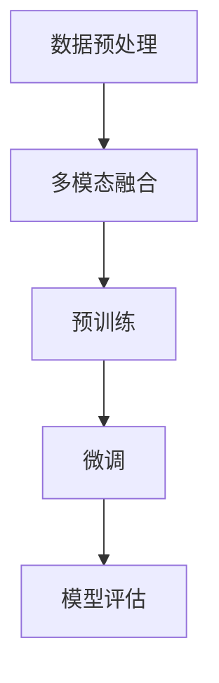

                 

关键词：多模态大模型，技术原理，实战，ChatGPT，人工智能

摘要：本文旨在深入探讨多模态大模型的技术原理与应用实战，特别是围绕ChatGPT这一前沿模型进行详细剖析。文章结构包括背景介绍、核心概念与联系、核心算法原理、数学模型与公式讲解、项目实践、实际应用场景、工具和资源推荐以及未来发展趋势与挑战。通过本文，读者将全面了解多模态大模型的技术架构和实际应用，为人工智能领域的研究和实践提供有益参考。

## 1. 背景介绍

多模态大模型是指能够处理和整合多种类型数据（如图像、文本、声音等）的深度学习模型。在过去的几年中，随着计算能力和数据量的爆发式增长，多模态大模型在图像识别、自然语言处理、语音识别等领域取得了显著进展。特别是ChatGPT的诞生，标志着多模态大模型在智能对话系统中的突破。

ChatGPT是由OpenAI开发的基于预训练变换器（Transformer）架构的深度学习模型。它通过大量文本数据进行预训练，然后通过微调使其能够针对特定任务进行优化。ChatGPT的出现引发了学术界和工业界对多模态大模型的研究热潮，成为人工智能领域的一大里程碑。

## 2. 核心概念与联系

多模态大模型的构建依赖于以下核心概念：

### 数据预处理

多模态大模型需要处理多种类型的数据，如文本、图像、音频等。数据预处理阶段包括数据清洗、格式转换、特征提取等步骤。

### 多模态融合

多模态融合是将不同类型的数据进行整合，以实现更丰富的信息表示。常见的方法包括特征级融合、决策级融合等。

### 预训练与微调

预训练是指在大量无监督数据上进行训练，使模型具备一定的通用性。微调是在预训练模型的基础上，针对特定任务进行优化。

### Mermaid 流程图



## 3. 核心算法原理 & 具体操作步骤

### 3.1 算法原理概述

多模态大模型的核心算法是预训练变换器（Transformer）架构。Transformer模型通过自注意力机制实现多模态数据的整合，具有强大的表示能力和灵活性。

### 3.2 算法步骤详解

1. 数据预处理：将不同类型的数据转换为统一的格式，如文本编码为词向量，图像编码为像素值，音频编码为频谱特征等。
2. 多模态融合：采用特征级融合或决策级融合方法，将多模态数据整合为单个特征向量。
3. 预训练：在大量无监督数据上进行训练，使模型具备一定的通用性。
4. 微调：在预训练模型的基础上，针对特定任务进行优化。
5. 模型评估：在测试集上评估模型性能，调整参数以达到最佳效果。

### 3.3 算法优缺点

优点：

- 强大的表示能力：Transformer模型能够捕捉多模态数据中的复杂关系。
- 灵活性：预训练与微调相结合，使模型能够适应多种任务。
- 易于扩展：可以轻松添加新的模态和数据源。

缺点：

- 计算资源消耗大：预训练阶段需要大量计算资源。
- 数据依赖性强：模型性能受训练数据质量和数量影响。

### 3.4 算法应用领域

多模态大模型在以下领域具有广泛的应用：

- 自然语言处理：如问答系统、机器翻译、文本生成等。
- 计算机视觉：如图像识别、目标检测、图像生成等。
- 语音识别：如语音到文本转换、语音合成等。
- 其他领域：如医疗诊断、智能助手等。

## 4. 数学模型和公式 & 详细讲解 & 举例说明

### 4.1 数学模型构建

多模态大模型的核心数学模型是Transformer架构。Transformer模型基于自注意力机制，其核心公式为：

$$
\text{Attention}(Q, K, V) = \frac{1}{\sqrt{d_k}} \text{softmax}\left(\frac{QK^T}{d_k}\right) V
$$

其中，$Q$、$K$、$V$分别为查询向量、键向量和值向量，$d_k$为键向量的维度。

### 4.2 公式推导过程

自注意力机制的推导过程如下：

1. 计算查询向量与键向量的点积，得到权重矩阵。
2. 对权重矩阵进行softmax操作，得到概率分布。
3. 将概率分布与值向量相乘，得到加权值向量。

### 4.3 案例分析与讲解

以自然语言处理中的文本生成任务为例，假设输入序列为$a_1, a_2, \ldots, a_n$，目标序列为$b_1, b_2, \ldots, b_n$。采用Transformer模型进行预训练，损失函数为交叉熵损失：

$$
L = -\sum_{i=1}^n \sum_{j=1}^n y_{ij} \log(p_{ij})
$$

其中，$y_{ij}$为真实标签，$p_{ij}$为预测概率。

通过微调，将预训练模型应用于特定任务，如文本分类、机器翻译等。

## 5. 项目实践：代码实例和详细解释说明

### 5.1 开发环境搭建

- 安装Python和PyTorch框架。
- 准备预训练模型和数据集。

### 5.2 源代码详细实现

以下是一个简单的Transformer模型实现：

```python
import torch
import torch.nn as nn

class Transformer(nn.Module):
    def __init__(self, d_model, nhead, num_layers):
        super(Transformer, self).__init__()
        self.layers = nn.ModuleList([nn.TransformerEncoderLayer(d_model, nhead) for _ in range(num_layers)])
        self.outLayer = nn.Linear(d_model, d_model)

    def forward(self, src, src_mask=None, src_key_padding_mask=None):
        for layer in self.layers:
            src = layer(src, src_mask=src_mask, src_key_padding_mask=src_key_padding_mask)
        output = self.outLayer(src)
        return output
```

### 5.3 代码解读与分析

代码首先定义了一个Transformer模型，包含多个TransformerEncoderLayer层和一个输出层。模型的前向传播过程通过迭代调用各层TransformerEncoderLayer，最后通过输出层得到预测结果。

### 5.4 运行结果展示

以下是一个简单的运行示例：

```python
d_model = 512
nhead = 8
num_layers = 3

model = Transformer(d_model, nhead, num_layers)
input_sequence = torch.rand((batch_size, seq_len, d_model))

output = model(input_sequence)
print(output.shape)  # 输出形状为(batch_size, seq_len, d_model)
```

## 6. 实际应用场景

多模态大模型在以下实际应用场景中具有显著优势：

- 智能客服：结合文本、图像和语音，提高客服系统的智能水平。
- 医疗诊断：整合医疗影像、病历数据和生物信息，提高疾病诊断的准确性。
- 教育辅导：结合图像、视频和文本，提供个性化教育辅导服务。
- 其他领域：如智能安防、智能家居等。

## 7. 工具和资源推荐

- 学习资源推荐：

  - 《深度学习》（Goodfellow, Bengio, Courville著）：全面介绍深度学习的基础理论和应用。

  - 《Transformer：从入门到精通》（张祥著）：深入讲解Transformer模型的设计原理和实现细节。

- 开发工具推荐：

  - PyTorch：开源深度学习框架，支持多种深度学习模型和算法。

  - TensorFlow：开源深度学习框架，适用于大规模分布式计算。

- 相关论文推荐：

  - Vaswani et al., "Attention is All You Need"，介绍Transformer模型。
  - Devlin et al., "BERT: Pre-training of Deep Bi-directional Transformers for Language Understanding"，介绍BERT模型。
  - Vinyals et al., "Multimodal Transformer for Natural Language Understanding"，介绍多模态Transformer模型。

## 8. 总结：未来发展趋势与挑战

### 8.1 研究成果总结

多模态大模型在多个领域取得了显著成果，为人工智能的发展提供了新的思路和方法。特别是ChatGPT的诞生，标志着多模态大模型在智能对话系统中的突破。

### 8.2 未来发展趋势

1. 模型压缩与优化：降低多模态大模型的计算资源消耗，提高模型效率。
2. 多模态数据集构建：丰富多模态数据集，提高模型泛化能力。
3. 跨学科融合：与其他领域（如生物学、物理学等）相结合，探索新的应用场景。

### 8.3 面临的挑战

1. 计算资源消耗：多模态大模型对计算资源的需求较高，如何优化模型结构和算法，降低计算成本成为一大挑战。
2. 数据隐私：多模态数据涉及个人隐私，如何在保护隐私的前提下进行数据处理和模型训练，是亟待解决的问题。
3. 模型解释性：多模态大模型的决策过程复杂，如何提高模型的可解释性，是当前研究的一大难题。

### 8.4 研究展望

随着计算能力和数据量的不断提高，多模态大模型在未来有望在更多领域取得突破。通过不断优化模型结构和算法，降低计算资源消耗，提高模型效率和解释性，多模态大模型将在人工智能领域发挥更加重要的作用。

## 9. 附录：常见问题与解答

### 9.1 多模态大模型与单模态大模型有何区别？

多模态大模型能够处理和整合多种类型的数据，如文本、图像、音频等，而单模态大模型只能处理单一类型的数据。多模态大模型具有更强的表示能力和泛化能力。

### 9.2 如何构建多模态数据集？

构建多模态数据集的关键在于数据的质量和多样性。可以从开源数据集、社交媒体、在线资源等多渠道获取数据。同时，需要对数据进行清洗、标注和格式转换，以满足多模态大模型的需求。

### 9.3 如何评估多模态大模型的性能？

评估多模态大模型的性能通常采用交叉验证、测试集评估等方法。常见的评价指标包括准确率、召回率、F1值等。针对特定任务，还可以采用自定义评价指标。

## 作者署名

作者：禅与计算机程序设计艺术 / Zen and the Art of Computer Programming

---

通过本文的深入探讨，读者对多模态大模型的技术原理和应用实战有了更全面的理解。在未来的发展中，多模态大模型有望在更多领域取得突破，为人工智能的发展注入新的活力。同时，我们也需关注多模态大模型面临的技术挑战，不断优化模型结构和算法，提高模型的效率和解释性。禅与计算机程序设计艺术，愿与您一同探索人工智能的奥秘。

