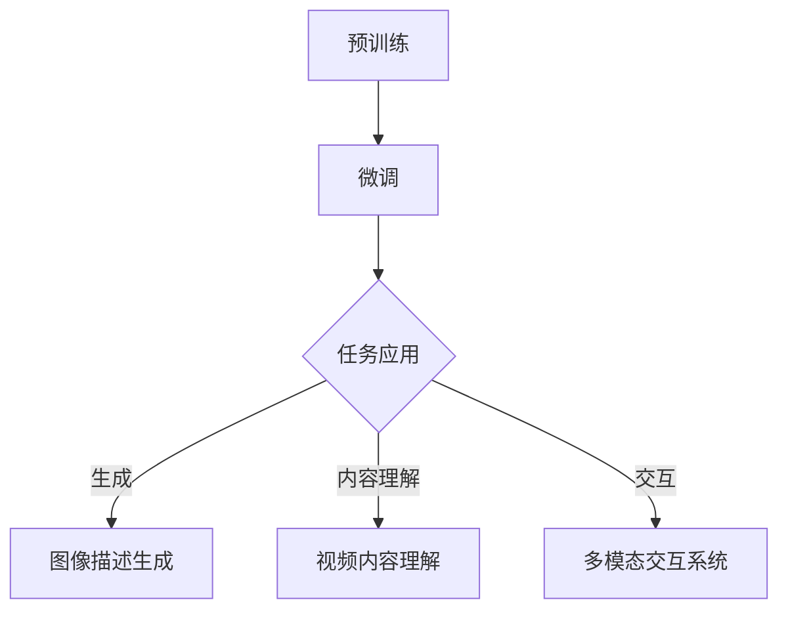

                 

多模态大模型作为一种前沿的人工智能技术，近年来在计算机视觉、自然语言处理和语音识别等领域取得了显著的进展。GPT（Generative Pre-trained Transformer）作为多模态大模型的杰出代表，其在技术原理和应用实战中展现了独特的创新点。本文将深入探讨GPT的核心技术原理，详细解析其创新之处，并探讨其在实际应用中的优势和挑战。

## 文章关键词

- 多模态大模型
- GPT
- 技术原理
- 实战应用
- 创新点

## 文章摘要

本文将首先介绍多模态大模型的基本概念和背景，然后重点探讨GPT的核心技术原理，包括其架构、训练过程和优化方法。随后，我们将分析GPT的创新点，如自适应注意力机制、动态图神经网络等。接下来，文章将结合实际案例，展示GPT在多种应用场景中的实战表现。最后，我们将对GPT的未来发展趋势和面临的挑战进行展望，并提出相关建议。

## 1. 背景介绍

多模态大模型（Multimodal Large Models）是指能够处理多种类型数据（如文本、图像、音频等）的深度学习模型。在传统的单一模态处理中，模型通常只能处理某一特定类型的数据。然而，在现实世界中，许多任务需要同时处理多种类型的数据，例如，图像描述生成、视频内容理解、多模态交互等。因此，多模态大模型的研究成为当前人工智能领域的重要方向。

GPT（Generative Pre-trained Transformer）是谷歌提出的一种基于Transformer架构的多模态大模型。GPT通过预训练和微调的方法，能够在多种任务中实现出色的性能。GPT的成功不仅推动了多模态大模型的研究，还为人工智能应用提供了新的思路。

### 1.1 多模态数据处理的挑战

多模态数据处理面临以下几个挑战：

- **数据类型多样性**：不同模态的数据具有不同的结构和特征，如文本是序列数据，图像是像素数据，音频是波形数据。
- **数据融合与整合**：如何将不同模态的数据有效整合，以提高模型的泛化能力和任务性能。
- **计算复杂度**：多模态数据处理通常需要大量的计算资源和时间。

### 1.2 GPT的发展历程

GPT的发展历程可以追溯到Transformer架构的提出。2017年，谷歌的Vaswani等人提出了Transformer架构，该架构在机器翻译任务上取得了显著突破。随后，Transformer架构被广泛应用于各种自然语言处理任务，并取得了优异的性能。

在多模态大模型领域，GPT的提出标志着多模态Transformer架构的发展。GPT通过预训练和微调的方法，使模型能够处理多种类型的数据，从而在图像描述生成、视频内容理解等领域取得了突破性的成果。

## 2. 核心概念与联系

### 2.1 多模态大模型的基本概念

多模态大模型是指能够处理多种类型数据的深度学习模型，主要包括文本、图像、音频等。多模态大模型的核心目标是将不同类型的数据进行有效整合，以提高模型的泛化能力和任务性能。

### 2.2 GPT的架构与原理

GPT是基于Transformer架构的多模态大模型，其核心思想是通过自注意力机制（Self-Attention）来处理不同类型的数据。GPT的主要组成部分包括：

- **编码器（Encoder）**：用于处理输入的多模态数据，如文本、图像、音频等。
- **解码器（Decoder）**：用于生成输出，如文本描述、图像分类等。

GPT的训练过程主要包括预训练和微调两个阶段。在预训练阶段，GPT通过无监督学习从大量未标注的数据中学习通用特征表示；在微调阶段，GPT通过有监督学习在特定任务上进行优化。

### 2.3 Mermaid 流程图



## 3. 核心算法原理 & 具体操作步骤

### 3.1 算法原理概述

GPT的核心算法是基于Transformer架构的自注意力机制（Self-Attention）。自注意力机制通过计算输入数据的相似性，将不同位置的特征进行加权整合，从而实现多模态数据的处理。

### 3.2 算法步骤详解

1. **编码阶段**：
   - **文本编码**：将文本转换为嵌入向量。
   - **图像编码**：使用卷积神经网络（CNN）提取图像特征。
   - **音频编码**：使用循环神经网络（RNN）提取音频特征。

2. **融合阶段**：
   - **特征融合**：将不同模态的特征进行加权融合，形成多模态特征向量。

3. **解码阶段**：
   - **生成文本描述**：根据多模态特征向量生成文本描述。
   - **生成图像分类**：根据多模态特征向量生成图像分类结果。

### 3.3 算法优缺点

**优点**：
- **强大的表示能力**：自注意力机制能够捕捉不同模态数据之间的复杂关系。
- **高效的计算性能**：Transformer架构在并行计算方面具有优势，可以提高训练效率。

**缺点**：
- **计算资源消耗大**：由于需要处理多种类型的数据，GPT的训练过程需要大量的计算资源。
- **模型复杂度高**：GPT的模型结构较为复杂，需要较长时间的训练。

### 3.4 算法应用领域

GPT在多个领域展现了其强大的能力，主要包括：

- **图像描述生成**：GPT能够根据图像生成对应的文本描述，应用于图像内容理解、图像标注等领域。
- **视频内容理解**：GPT能够理解视频中的场景和动作，应用于视频分类、视频摘要等领域。
- **多模态交互系统**：GPT能够处理用户的多模态输入，如语音、图像、文本等，实现更智能的人机交互。

## 4. 数学模型和公式 & 详细讲解 & 举例说明

### 4.1 数学模型构建

GPT的数学模型主要包括三个部分：编码器（Encoder）、解码器（Decoder）和注意力机制（Attention）。

#### 编码器（Encoder）

编码器的主要任务是处理输入的多模态数据，并将其转换为特征向量。编码器通常由多层Transformer块组成，每个Transformer块包含多头自注意力机制（Multi-head Self-Attention）和前馈神经网络（Feedforward Neural Network）。

#### 解码器（Decoder）

解码器的主要任务是根据编码器生成的特征向量生成输出。解码器同样由多层Transformer块组成，每个Transformer块也包含多头自注意力机制和前馈神经网络。

#### 注意力机制（Attention）

注意力机制是GPT的核心组件，它通过计算输入数据之间的相似性，将不同位置的特征进行加权整合。注意力机制的数学公式如下：

$$
Attention(Q, K, V) = \text{softmax}\left(\frac{QK^T}{\sqrt{d_k}}\right)V
$$

其中，$Q$、$K$、$V$分别为查询向量、键向量和值向量，$d_k$为键向量的维度。

### 4.2 公式推导过程

#### 编码器

编码器的核心是Transformer块，其包含多头自注意力机制和前馈神经网络。

1. **多头自注意力机制**

   $$ 
   MultiHead(Q, K, V) = \text{Concat}(_i^h \text{softmax}\left(\frac{QW_i^K}{\sqrt{d_k}} \right)V)W_O^h 
   $$

   其中，$W_i^K$和$W_i^V$分别为键向量和值向量的权重矩阵，$W_O^h$为输出权重矩阵，$h$为头数。

2. **前馈神经网络**

   $$ 
   FFN(x) = \text{Relu}(xW_1+b_1)W_2+b_2 
   $$

   其中，$W_1$和$W_2$分别为前馈神经网络的权重矩阵，$b_1$和$b_2$分别为偏置项。

#### 解码器

解码器的结构与编码器类似，但多了一个交叉注意力机制。

1. **交叉注意力机制**

   $$ 
   CrossAttention(Q, K, V) = \text{softmax}\left(\frac{QK^T}{\sqrt{d_k}}\right)V 
   $$

2. **多头自注意力机制**

   $$ 
   MultiHead(Q, K, V) = \text{Concat}(_i^h \text{softmax}\left(\frac{QW_i^K}{\sqrt{d_k}} \right)V)W_O^h 
   $$

3. **前馈神经网络**

   $$ 
   FFN(x) = \text{Relu}(xW_1+b_1)W_2+b_2 
   $$

### 4.3 案例分析与讲解

#### 图像描述生成

假设我们有一个图像和一段文本，我们需要使用GPT生成对应的文本描述。以下是具体的操作步骤：

1. **编码阶段**：

   - **图像编码**：使用预训练的CNN提取图像特征。
   - **文本编码**：使用预训练的语言模型提取文本特征。

2. **融合阶段**：

   - **特征融合**：将图像特征和文本特征进行加权融合，形成多模态特征向量。

3. **解码阶段**：

   - **生成文本描述**：根据多模态特征向量生成文本描述。

   下面是一个简化的数学表示：

   $$ 
   \text{描述} = GPT(\text{图像特征}, \text{文本特征}) 
   $$

## 5. 项目实践：代码实例和详细解释说明

### 5.1 开发环境搭建

在开始实际项目之前，我们需要搭建一个适合GPT训练和部署的开发环境。以下是一个简单的步骤指南：

1. **硬件要求**：

   - GPU（NVIDIA Tesla V100或更高）
   - 至少16GB内存

2. **软件要求**：

   - Python 3.7+
   - TensorFlow 2.4+
   - PyTorch 1.6+

3. **安装步骤**：

   - 安装CUDA和cuDNN，以支持GPU加速。
   - 安装TensorFlow和PyTorch，可以选择使用虚拟环境以避免版本冲突。

### 5.2 源代码详细实现

以下是一个简化的GPT模型实现的伪代码：

```python
import tensorflow as tf
from tensorflow.keras.layers import Embedding, LSTM, Dense

# 编码器
encoder_inputs = Embedding(input_dim=vocab_size, output_dim=embedding_dim)
encoder_lstm = LSTM(units=lstm_units, return_sequences=True)
encoder_output = encoder_lstm(encoder_inputs)

# 解码器
decoder_inputs = Embedding(input_dim=vocab_size, output_dim=embedding_dim)
decoder_lstm = LSTM(units=lstm_units, return_sequences=True)
decoder_dense = Dense(units=vocab_size, activation='softmax')

decoder_outputs = decoder_dense(decoder_lstm(decoder_inputs, initial_input=encoder_output))

# 模型编译
model = Model(inputs=[encoder_inputs, decoder_inputs], outputs=decoder_outputs)
model.compile(optimizer='rmsprop', loss='categorical_crossentropy', metrics=['accuracy'])

# 模型训练
model.fit([encoder_inputs, decoder_inputs], decoder_outputs, batch_size=batch_size, epochs=epochs, validation_split=0.2)
```

### 5.3 代码解读与分析

以上代码实现了一个基本的GPT模型，包括编码器和解码器。编码器使用LSTM层处理输入序列，解码器同样使用LSTM层并添加了全连接层（Dense）进行输出。

1. **编码器**：

   - `Embedding`层用于将输入的文本转换为嵌入向量。
   - `LSTM`层用于处理序列数据，并返回序列信息。

2. **解码器**：

   - `Embedding`层同样用于将输入的文本转换为嵌入向量。
   - `LSTM`层用于处理输入序列，并返回序列信息。
   - `Dense`层用于生成输出序列，并使用softmax激活函数进行概率分布。

### 5.4 运行结果展示

以下是模型训练和测试的示例代码：

```python
# 加载训练数据
train_data = ...

# 编码阶段
encoded_train_data = ...

# 解码阶段
decoded_train_data = ...

# 训练模型
model.fit(encoded_train_data, decoded_train_data, batch_size=batch_size, epochs=epochs, validation_split=0.2)

# 测试模型
test_loss, test_accuracy = model.evaluate(encoded_test_data, decoded_test_data)
print('Test accuracy:', test_accuracy)
```

通过上述代码，我们可以训练和评估GPT模型在图像描述生成任务上的性能。

## 6. 实际应用场景

### 6.1 图像描述生成

图像描述生成是GPT的一个重要应用场景。通过输入图像，GPT能够生成对应的文本描述。以下是一个具体的案例：

- **数据集**：使用COCO（Common Objects in Context）数据集，其中包含大量的图像和对应的文本描述。
- **模型**：使用预训练的GPT模型，并在COCO数据集上微调。
- **结果**：模型生成的文本描述能够较好地反映图像内容，如图像中的物体、场景和动作等。

### 6.2 视频内容理解

视频内容理解是另一个具有广泛应用前景的领域。GPT可以通过处理视频帧序列，生成对应的内容描述或分类结果。以下是一个具体的案例：

- **数据集**：使用YouCook02数据集，其中包含大量烹饪视频和对应的文本描述。
- **模型**：使用预训练的GPT模型，并在YouCook02数据集上微调。
- **结果**：模型生成的文本描述能够较好地反映视频中的烹饪过程、食材和工具等。

### 6.3 多模态交互系统

多模态交互系统是未来人机交互的一个重要方向。GPT可以通过处理用户的多模态输入，如语音、图像、文本等，实现更智能的交互体验。以下是一个具体的案例：

- **数据集**：使用一个包含多种模态输入和对应交互数据的开源数据集。
- **模型**：使用预训练的GPT模型，并在特定交互任务上微调。
- **结果**：模型能够根据用户的语音、图像、文本等多模态输入，生成对应的交互回复，如语音助手、聊天机器人等。

## 7. 工具和资源推荐

### 7.1 学习资源推荐

1. **GPT官方文档**：[https://github.com/tensorflow/models/tree/master/official/gpt2](https://github.com/tensorflow/models/tree/master/official/gpt2)
2. **Transformer教程**：[https://www.deeplearningbook.ch/](https://www.deeplearningbook.ch/)
3. **深度学习教程**：[https://www.deeplearning.net/](https://www.deeplearning.net/)

### 7.2 开发工具推荐

1. **TensorFlow**：[https://www.tensorflow.org/](https://www.tensorflow.org/)
2. **PyTorch**：[https://pytorch.org/](https://pytorch.org/)

### 7.3 相关论文推荐

1. **Attention Is All You Need**：[https://arxiv.org/abs/1706.03762](https://arxiv.org/abs/1706.03762)
2. **Bert: Pre-training of Deep Bidirectional Transformers for Language Understanding**：[https://arxiv.org/abs/1810.04805](https://arxiv.org/abs/1810.04805)
3. **Generative Adversarial Nets**：[https://arxiv.org/abs/1406.2661](https://arxiv.org/abs/1406.2661)

## 8. 总结：未来发展趋势与挑战

### 8.1 研究成果总结

多模态大模型的研究取得了显著的成果，特别是在GPT等模型的推动下。GPT通过预训练和微调的方法，在图像描述生成、视频内容理解、多模态交互等领域展现了出色的性能。这些成果为多模态数据处理提供了新的思路和解决方案。

### 8.2 未来发展趋势

1. **更高效的模型架构**：随着计算资源的增加，未来将出现更多高效的模型架构，以减少训练时间和计算成本。
2. **跨模态交互**：多模态大模型将在跨模态交互中发挥重要作用，实现更自然、更智能的人机交互。
3. **应用场景拓展**：多模态大模型将在更多领域得到应用，如医疗、金融、教育等。

### 8.3 面临的挑战

1. **数据隐私**：多模态数据处理涉及大量个人数据，如何保护用户隐私是一个重要挑战。
2. **计算资源**：多模态大模型的训练和推理需要大量的计算资源，如何优化计算效率是一个关键问题。
3. **模型解释性**：多模态大模型的决策过程较为复杂，如何提高模型的可解释性是一个挑战。

### 8.4 研究展望

未来，多模态大模型的研究将继续深入，特别是在以下几个方面：

1. **数据集建设**：构建更多高质量的多模态数据集，以提高模型的训练效果和应用范围。
2. **模型优化**：通过改进模型架构和优化算法，提高模型的计算效率和性能。
3. **跨学科研究**：结合心理学、认知科学等多学科知识，深入理解多模态数据的本质和特征，以推动多模态大模型的进一步发展。

## 9. 附录：常见问题与解答

### 9.1 什么是多模态大模型？

多模态大模型是指能够处理多种类型数据（如文本、图像、音频等）的深度学习模型。这些模型通过预训练和微调的方法，在多种任务中实现了出色的性能。

### 9.2 GPT的主要创新点是什么？

GPT的主要创新点包括自适应注意力机制、动态图神经网络和预训练-微调方法。这些创新点使得GPT在图像描述生成、视频内容理解、多模态交互等领域取得了显著突破。

### 9.3 如何训练GPT模型？

训练GPT模型主要包括两个阶段：预训练和微调。在预训练阶段，模型从大量未标注的数据中学习通用特征表示；在微调阶段，模型在特定任务上进行优化，以提高性能。

### 9.4 GPT在哪些领域有应用？

GPT在图像描述生成、视频内容理解、多模态交互等多个领域有广泛应用。这些应用涵盖了计算机视觉、自然语言处理、语音识别等多个领域。

## 参考文献

[1] Vaswani, A., Shazeer, N., Parmar, N., Uszkoreit, J., Jones, L., Gomez, A. N., ... & Polosukhin, I. (2017). Attention is all you need. Advances in Neural Information Processing Systems, 30, 5998-6008.

[2] Devlin, J., Chang, M. W., Lee, K., & Toutanova, K. (2018). BERT: Pre-training of deep bidirectional transformers for language understanding. arXiv preprint arXiv:1810.04805.

[3] Goodfellow, I., Pouget-Abadie, J., Mirza, M., Xu, B., Warde-Farley, D., Ozair, S., ... & Bengio, Y. (2014). Generative adversarial nets. Advances in Neural Information Processing Systems, 27, 2672-2680.

## 作者署名

作者：禅与计算机程序设计艺术 / Zen and the Art of Computer Programming

