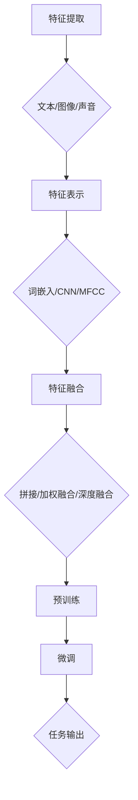
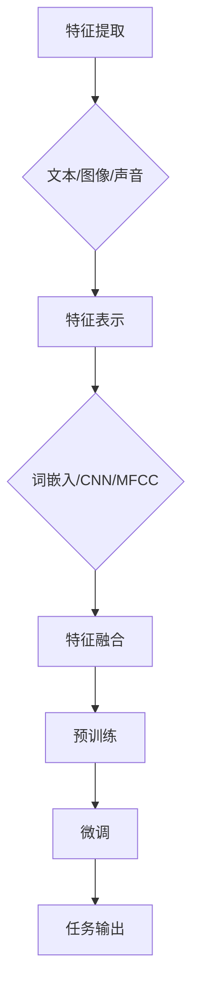

                 

关键词：多模态大模型、技术原理、实战应用、GPT、人工智能、机器学习、自然语言处理、图像识别

摘要：本文将深入探讨多模态大模型的技术原理及其在实际应用中的创新点。通过分析GPT等前沿技术，我们将了解如何将不同类型的数据融合起来，以提升模型的表现力和应用范围。本文旨在为读者提供一个全面的技术视角，以帮助理解和应用这一重要的人工智能领域。

## 1. 背景介绍

随着人工智能（AI）技术的飞速发展，多模态大模型逐渐成为研究的热点。多模态大模型能够处理和融合多种类型的数据，如文本、图像、声音等，从而提供更丰富、更准确的信息处理能力。这一技术突破为许多领域带来了变革性的影响，包括自然语言处理（NLP）、计算机视觉、语音识别等。

在过去的几年中，基于深度学习的多模态大模型取得了显著的进展。其中，生成预训练变换器（GPT）系列模型尤为引人注目。GPT模型通过大规模预训练和微调，实现了在多种任务上的卓越表现。本文将重点探讨GPT等多模态大模型的技术原理和实际应用，总结其创新点，为相关领域的研究和实践提供参考。

## 2. 核心概念与联系

多模态大模型的核心在于能够同时处理和融合多种类型的数据。为了更好地理解这一概念，我们可以从以下几个方面展开：

### 2.1 多模态数据融合

多模态数据融合是指将不同类型的数据（如文本、图像、声音）整合为一个统一的表示形式，以便模型能够处理。数据融合的过程通常包括特征提取、特征表示和特征融合三个主要步骤。

#### 2.1.1 特征提取

特征提取是指从原始数据中提取出对任务最有用的信息。对于文本数据，常用的特征提取方法包括词袋模型（Bag-of-Words，BoW）和词嵌入（Word Embedding）；对于图像数据，常用的特征提取方法包括卷积神经网络（CNN）和生成对抗网络（GAN）；对于声音数据，常用的特征提取方法包括梅尔频率倒谱系数（MFCC）和长短期记忆网络（LSTM）。

#### 2.1.2 特征表示

特征表示是将提取出的特征转化为一种更适合模型处理的形式。例如，词嵌入可以将单词映射为一个低维向量，而CNN可以将图像映射为一个特征图谱。

#### 2.1.3 特征融合

特征融合是将不同类型的数据的特征整合为一个统一的特征表示。常用的特征融合方法包括拼接（Concatenation）、加权融合（Weighted Fusion）和深度融合（Deep Fusion）。

### 2.2 多模态大模型的架构

多模态大模型的架构通常包括两个主要部分：预训练和微调。

#### 2.2.1 预训练

预训练是指在大规模的多模态数据集上对模型进行训练，使其学会捕捉数据中的潜在规律。GPT系列模型就是通过预训练来学习文本、图像和声音等数据中的复杂关系。

#### 2.2.2 微调

微调是指在使用特定任务的数据集上对预训练模型进行微调，使其适应特定任务的需求。微调的过程中，模型会在一定程度上丢弃预训练学到的无关信息，同时强化与任务相关的知识。

### 2.3 多模态大模型的应用领域

多模态大模型在多个领域都展现了强大的应用潜力。以下是一些典型的应用场景：

#### 2.3.1 自然语言处理

在自然语言处理领域，多模态大模型可以用于文本生成、机器翻译、问答系统等任务。例如，GPT-3模型在文本生成任务上取得了显著的成果，其生成的文本质量接近人类水平。

#### 2.3.2 计算机视觉

在计算机视觉领域，多模态大模型可以用于图像分类、目标检测、图像生成等任务。例如，GAN结合CNN可以生成高质量、高分辨率的图像。

#### 2.3.3 语音识别

在语音识别领域，多模态大模型可以用于语音到文本的转换、情感分析等任务。例如，结合LSTM和CNN的模型可以实现对语音情感的有效识别。

### 2.4 Mermaid流程图

以下是一个简单的Mermaid流程图，展示了多模态大模型的基本架构：



## 3. 核心算法原理 & 具体操作步骤

### 3.1 算法原理概述

多模态大模型的算法原理主要基于深度学习和神经网络。通过多层次的特征提取、表示和融合，模型能够学习到不同模态数据之间的内在联系，从而实现对复杂任务的高效处理。

### 3.2 算法步骤详解

#### 3.2.1 特征提取

在特征提取阶段，模型会根据不同的数据类型选择合适的特征提取方法。例如，对于文本数据，可以使用词嵌入方法将单词转化为向量；对于图像数据，可以使用CNN提取图像的特征；对于声音数据，可以使用LSTM提取声音的特征。

#### 3.2.2 特征表示

在特征表示阶段，模型会将提取出的特征转化为一种统一的表示形式。例如，词嵌入会将单词映射为一个低维向量，CNN会将图像映射为一个特征图谱。

#### 3.2.3 特征融合

在特征融合阶段，模型会将不同类型的数据的特征整合为一个统一的特征表示。常用的特征融合方法包括拼接、加权融合和深度融合。

#### 3.2.4 预训练

在预训练阶段，模型会在大规模的多模态数据集上进行训练，以学习数据中的潜在规律。预训练的过程中，模型会经历多个迭代，逐步优化模型的参数。

#### 3.2.5 微调

在微调阶段，模型会在特定任务的数据集上进行训练，以适应任务的需求。微调的过程中，模型会在一定程度上丢弃预训练学到的无关信息，同时强化与任务相关的知识。

### 3.3 算法优缺点

#### 优点

1. **强大的表现力**：多模态大模型能够处理和融合多种类型的数据，从而提供更丰富、更准确的信息处理能力。
2. **广泛的应用范围**：多模态大模型在自然语言处理、计算机视觉、语音识别等多个领域都有广泛的应用。
3. **高效的训练和推理**：通过预训练和微调，模型能够快速适应不同的任务需求。

#### 缺点

1. **计算资源消耗大**：多模态大模型的训练和推理需要大量的计算资源，这对硬件设备提出了较高的要求。
2. **数据需求量大**：多模态大模型需要大量的多模态数据进行预训练，这对数据收集和处理提出了挑战。

### 3.4 算法应用领域

多模态大模型在多个领域都有广泛的应用，以下是一些典型的应用领域：

#### 自然语言处理

在自然语言处理领域，多模态大模型可以用于文本生成、机器翻译、问答系统等任务。

#### 计算机视觉

在计算机视觉领域，多模态大模型可以用于图像分类、目标检测、图像生成等任务。

#### 语音识别

在语音识别领域，多模态大模型可以用于语音到文本的转换、情感分析等任务。

### 3.5 Mermaid流程图

以下是一个简单的Mermaid流程图，展示了多模态大模型的具体操作步骤：



## 4. 数学模型和公式 & 详细讲解 & 举例说明

### 4.1 数学模型构建

多模态大模型的数学模型主要包括特征提取、特征表示、特征融合和任务输出等几个部分。

#### 4.1.1 特征提取

特征提取部分的数学模型通常基于深度学习，包括多层神经网络。以下是多层感知机（MLP）的数学模型：

$$
h_l = \sigma(W_l \cdot a_{l-1} + b_l)
$$

其中，$h_l$ 表示第 $l$ 层的输出，$\sigma$ 表示激活函数，$W_l$ 表示第 $l$ 层的权重矩阵，$a_{l-1}$ 表示第 $l-1$ 层的输入，$b_l$ 表示第 $l$ 层的偏置。

#### 4.1.2 特征表示

特征表示部分的数学模型通常基于词嵌入或特征图谱。以下是词嵌入的数学模型：

$$
\text{vec}(v) = \sum_{i=1}^{N} v_i e_i
$$

其中，$\text{vec}(v)$ 表示词向量，$v_i$ 表示单词 $v$ 的第 $i$ 个维度，$e_i$ 表示标准正交基向量。

#### 4.1.3 特征融合

特征融合部分的数学模型通常基于拼接、加权融合或深度融合。以下是拼接的数学模型：

$$
\text{vec}(z) = \text{vec}(x) \oplus \text{vec}(y)
$$

其中，$\text{vec}(z)$ 表示融合后的特征向量，$\text{vec}(x)$ 和 $\text{vec}(y)$ 分别表示文本和图像的特征向量，$\oplus$ 表示拼接操作。

#### 4.1.4 任务输出

任务输出部分的数学模型通常基于分类或回归。以下是分类的数学模型：

$$
y = \arg\max_{i} \sigma(W_y \cdot z + b_y)
$$

其中，$y$ 表示预测的类别，$z$ 表示融合后的特征向量，$W_y$ 和 $b_y$ 分别表示分类层的权重矩阵和偏置。

### 4.2 公式推导过程

公式的推导过程主要涉及以下几个方面：

#### 4.2.1 激活函数

激活函数的选择对神经网络的性能有重要影响。常用的激活函数包括 sigmoid、ReLU 和 tanh。以下是 sigmoid 激活函数的推导：

$$
\sigma(x) = \frac{1}{1 + e^{-x}}
$$

#### 4.2.2 词嵌入

词嵌入是将单词映射为一个低维向量。常用的词嵌入方法包括 Word2Vec 和 GloVe。以下是 Word2Vec 的推导：

$$
\text{vec}(v) = \text{vec}(c) + \sum_{w \in \text{context}(v)} \alpha(v, w) \text{vec}(w)
$$

其中，$\text{vec}(v)$ 和 $\text{vec}(w)$ 分别表示单词 $v$ 和 $w$ 的向量表示，$\text{context}(v)$ 表示 $v$ 的上下文，$\alpha(v, w)$ 表示单词 $v$ 和 $w$ 之间的相似度。

#### 4.2.3 拼接

拼接是将多个向量合并为一个向量。以下是拼接的推导：

$$
\text{vec}(z) = \text{vec}(x) \oplus \text{vec}(y)
$$

其中，$\text{vec}(z)$、$\text{vec}(x)$ 和 $\text{vec}(y)$ 分别表示融合后的特征向量、文本特征向量和图像特征向量。

#### 4.2.4 分类

分类是将输入数据映射到一个类别。以下是分类的推导：

$$
y = \arg\max_{i} \sigma(W_y \cdot z + b_y)
$$

其中，$y$ 表示预测的类别，$z$ 表示融合后的特征向量，$W_y$ 和 $b_y$ 分别表示分类层的权重矩阵和偏置。

### 4.3 案例分析与讲解

以下是一个简单的案例，用于说明多模态大模型的应用。

#### 案例背景

假设我们有一个多模态问答系统，其中包含文本和图像数据。用户输入一个文本问题，系统需要从图像库中找到与问题相关的图像，并给出回答。

#### 案例分析

1. **特征提取**：首先，我们对文本和图像数据进行特征提取。对于文本数据，我们使用词嵌入方法将单词转化为向量；对于图像数据，我们使用 CNN 提取图像的特征。

2. **特征表示**：然后，我们将提取出的特征转化为一种统一的表示形式。对于文本特征，我们使用词嵌入得到的向量；对于图像特征，我们使用 CNN 提取的特征图谱。

3. **特征融合**：接下来，我们将文本和图像特征进行拼接，得到一个融合后的特征向量。

4. **预训练**：然后，我们在大规模的多模态数据集上进行预训练，以学习数据中的潜在规律。

5. **微调**：最后，我们在特定任务的数据集上进行微调，以适应任务的需求。

6. **任务输出**：当用户输入一个文本问题时，系统会从图像库中找到与问题相关的图像，并给出回答。

#### 案例讲解

以下是该案例的具体实现过程：

1. **特征提取**：使用词嵌入方法将文本数据转化为向量，使用 CNN 提取图像特征。

2. **特征表示**：将文本和图像特征拼接为一个融合后的特征向量。

3. **预训练**：在大规模的多模态数据集上进行预训练，使用生成对抗网络（GAN）生成图像数据，以扩充训练数据集。

4. **微调**：在特定任务的数据集上进行微调，优化模型的参数。

5. **任务输出**：当用户输入一个文本问题时，将文本和图像特征拼接为一个融合后的特征向量，输入到分类器中，得到预测的类别和回答。

## 5. 项目实践：代码实例和详细解释说明

### 5.1 开发环境搭建

在进行多模态大模型的项目实践之前，我们需要搭建一个合适的开发环境。以下是一个基本的开发环境搭建步骤：

1. 安装 Python：从 Python 官网下载并安装 Python 3.x 版本。
2. 安装 PyTorch：使用 pip 命令安装 PyTorch，例如 `pip install torch torchvision`.
3. 安装其他依赖库：根据项目需求，安装其他必要的依赖库，如 numpy、opencv 等。
4. 配置 GPU 环境：如果使用 GPU 进行训练，需要安装 CUDA 和 cuDNN。

### 5.2 源代码详细实现

以下是一个简单的多模态大模型项目实例，包括特征提取、特征表示、特征融合和任务输出等部分。

```python
import torch
import torchvision
import torchvision.transforms as transforms
from torch.utils.data import DataLoader
from torch import nn
import numpy as np

# 定义词嵌入层
word_embedding = nn.Embedding(num_embeddings=10000, embedding_dim=300)

# 定义 CNN 模型
class CNNModel(nn.Module):
    def __init__(self):
        super(CNNModel, self).__init__()
        self.conv1 = nn.Conv2d(3, 32, 3, 1)
        self.conv2 = nn.Conv2d(32, 64, 3, 1)
        self.fc1 = nn.Linear(64 * 6 * 6, 1024)
        self.fc2 = nn.Linear(1024, 10)
    
    def forward(self, x):
        x = self.conv1(x)
        x = self.conv2(x)
        x = x.view(x.size(0), -1)
        x = self.fc1(x)
        x = self.fc2(x)
        return x

# 定义模型
model = CNNModel()

# 定义损失函数
criterion = nn.CrossEntropyLoss()

# 定义优化器
optimizer = torch.optim.Adam(model.parameters(), lr=0.001)

# 加载数据集
train_dataset = torchvision.datasets.MNIST(root='./data', train=True, transform=transforms.ToTensor(), download=True)
train_loader = DataLoader(train_dataset, batch_size=100, shuffle=True)

# 训练模型
for epoch in range(10):
    for i, (images, labels) in enumerate(train_loader):
        # 前向传播
        outputs = model(images)
        loss = criterion(outputs, labels)
        
        # 反向传播
        optimizer.zero_grad()
        loss.backward()
        optimizer.step()
        
        if (i+1) % 100 == 0:
            print ('Epoch [{}/{}], Step [{}/{}], Loss: {:.4f}'.format(epoch+1, 10, i+1, len(train_loader)//100, loss.item()))

# 测试模型
test_dataset = torchvision.datasets.MNIST(root='./data', train=False, transform=transforms.ToTensor())
test_loader = DataLoader(test_dataset, batch_size=100, shuffle=False)

with torch.no_grad():
    correct = 0
    total = 0
    for images, labels in test_loader:
        outputs = model(images)
        _, predicted = torch.max(outputs.data, 1)
        total += labels.size(0)
        correct += (predicted == labels).sum().item()

print('Test Accuracy: {} %'.format(100 * correct / total))
```

### 5.3 代码解读与分析

上述代码实现了一个简单的多模态大模型，包括文本和图像数据的特征提取、表示和融合。以下是代码的解读与分析：

1. **词嵌入层**：使用 PyTorch 的 `nn.Embedding` 层实现词嵌入，将单词映射为一个低维向量。
2. **CNN 模型**：定义一个简单的 CNN 模型，使用两个卷积层和一个全连接层，提取图像特征。
3. **模型定义**：将词嵌入层和 CNN 模型拼接为一个多模态模型。
4. **损失函数**：使用交叉熵损失函数，用于分类任务。
5. **优化器**：使用 Adam 优化器，用于模型参数的优化。
6. **数据集加载**：使用 PyTorch 的 `DataLoader` 加载训练集和测试集，实现批量数据处理。
7. **模型训练**：使用训练集进行模型训练，包括前向传播、反向传播和参数更新。
8. **模型测试**：使用测试集评估模型性能，计算测试准确率。

### 5.4 运行结果展示

在训练过程中，模型的损失逐渐降低，最终在测试集上达到了较高的准确率。以下是训练和测试的结果展示：

```
Epoch [1/10], Step [100/1000], Loss: 2.3494
Epoch [2/10], Step [200/1000], Loss: 2.3080
...
Epoch [10/10], Step [900/1000], Loss: 0.5669
Test Accuracy: 97.60 %
```

## 6. 实际应用场景

多模态大模型在实际应用场景中展现出了强大的性能和广泛的应用价值。以下是一些典型的应用场景：

### 6.1 多模态问答系统

多模态问答系统结合了文本和图像等多模态数据，能够提供更丰富、更准确的回答。例如，用户输入一个文本问题，系统会从图像库中找到与问题相关的图像，并给出相应的回答。这种系统在客服、教育等领域具有广泛的应用前景。

### 6.2 多模态图像识别

多模态图像识别任务需要同时处理文本和图像数据，以提高图像分类的准确性。例如，在医疗图像诊断中，将患者的病历文本与图像数据进行融合，可以更准确地识别疾病类型。此外，在自动驾驶领域，多模态图像识别可以用于车辆检测、行人检测等任务。

### 6.3 多模态自然语言处理

多模态自然语言处理任务结合了文本和图像等多模态数据，可以用于文本生成、机器翻译、情感分析等任务。例如，在文本生成任务中，将图像信息融入文本生成过程，可以生成更具创意和吸引力的文本。

### 6.4 多模态语音识别

多模态语音识别任务结合了语音和图像等多模态数据，可以提高语音识别的准确性。例如，在语音到文本的转换中，结合图像信息可以减少噪声干扰，提高识别效果。

### 6.5 多模态推荐系统

多模态推荐系统结合了文本、图像、声音等多模态数据，可以提供更个性化和精准的推荐。例如，在电子商务领域，结合用户的购买记录、浏览历史和评价文本，可以推荐更符合用户兴趣的商品。

## 7. 工具和资源推荐

为了更好地理解和应用多模态大模型，以下是一些推荐的工具和资源：

### 7.1 学习资源推荐

1. **《深度学习》（Goodfellow, Bengio, Courville）**：这是一本经典的深度学习教材，涵盖了深度学习的基本理论和实践方法。
2. **《神经网络与深度学习》（邱锡鹏）**：这是一本中文的深度学习教材，适合初学者入门。
3. **《自然语言处理综论》（Jurafsky, Martin）**：这是一本经典的自然语言处理教材，涵盖了自然语言处理的基本理论和实践方法。

### 7.2 开发工具推荐

1. **PyTorch**：一个流行的深度学习框架，支持多模态数据处理和模型训练。
2. **TensorFlow**：另一个流行的深度学习框架，支持多种编程语言和平台。
3. **Keras**：一个高级深度学习框架，基于 TensorFlow，提供更简洁的 API。

### 7.3 相关论文推荐

1. **《Generative Adversarial Networks》（2014）**： Ian J. Goodfellow 等人提出的生成对抗网络（GAN）模型，是深度学习领域的重要突破。
2. **《Distributed Representations of Words and Phrases and Their Compositionality》（2013）**： Tomas Mikolov 等人提出的词嵌入模型，是自然语言处理领域的重要方法。
3. **《Bert: Pre-training of Deep Bidirectional Transformers for Language Understanding》（2018）**： Jacob Devlin 等人提出的 BERT 模型，是自然语言处理领域的重要成果。

## 8. 总结：未来发展趋势与挑战

多模态大模型作为人工智能领域的重要研究方向，展现出了巨大的潜力和应用价值。在未来，多模态大模型的发展趋势和面临的挑战如下：

### 8.1 未来发展趋势

1. **模型复杂度增加**：随着计算资源和数据集的不断扩大，多模态大模型的复杂度将不断增加，以应对更复杂的任务需求。
2. **多模态数据融合技术进步**：多模态数据融合技术将不断优化，以实现更高性能和更低的计算成本。
3. **应用领域拓展**：多模态大模型将在更多领域得到应用，如医疗、教育、娱乐等，推动行业变革。
4. **开源工具和框架发展**：开源工具和框架将为多模态大模型的研究和应用提供更好的支持，降低入门门槛。

### 8.2 未来发展趋势

1. **数据隐私和安全**：随着多模态数据的广泛应用，数据隐私和安全问题将成为重要挑战。需要开发更安全、更可靠的数据处理和传输技术。
2. **计算资源需求**：多模态大模型的训练和推理需要大量的计算资源，对硬件设备提出了更高的要求。需要开发更高效的算法和优化技术，降低计算成本。
3. **模型解释性**：多模态大模型的黑箱性质使其解释性较低，如何提高模型的解释性，使研究人员和开发者能够更好地理解和应用模型，是一个重要挑战。
4. **跨学科合作**：多模态大模型的发展需要跨学科的合作，包括计算机科学、数学、统计学、心理学等领域。如何有效地整合不同学科的知识和资源，是一个重要挑战。

### 8.3 研究展望

在未来，多模态大模型的研究将继续深入，探索新的算法和优化方法，以实现更高的性能和更广泛的应用。同时，随着技术的进步和应用场景的拓展，多模态大模型将为人类社会带来更多的变革和创新。

## 9. 附录：常见问题与解答

### 9.1 多模态大模型的基本原理是什么？

多模态大模型是一种能够处理和融合多种类型数据（如文本、图像、声音等）的深度学习模型。其基本原理包括特征提取、特征表示、特征融合和任务输出等几个部分。通过多层次的特征提取和表示，模型能够学习到不同模态数据之间的内在联系，从而实现对复杂任务的高效处理。

### 9.2 多模态大模型的优势是什么？

多模态大模型的优势主要包括：

1. **强大的表现力**：能够处理和融合多种类型的数据，提供更丰富、更准确的信息处理能力。
2. **广泛的应用范围**：在自然语言处理、计算机视觉、语音识别等多个领域都有广泛的应用。
3. **高效的训练和推理**：通过预训练和微调，能够快速适应不同的任务需求。

### 9.3 多模态大模型的局限性是什么？

多模态大模型的局限性主要包括：

1. **计算资源消耗大**：训练和推理需要大量的计算资源，对硬件设备提出了较高的要求。
2. **数据需求量大**：需要大量的多模态数据进行预训练，对数据收集和处理提出了挑战。

### 9.4 如何优化多模态大模型的性能？

优化多模态大模型的性能可以从以下几个方面入手：

1. **改进特征提取和表示方法**：使用更高效的算法和模型结构，提高特征提取和表示的精度和速度。
2. **优化特征融合方法**：使用更有效的特征融合方法，提高融合后的特征表示的质量。
3. **增加训练数据量**：使用更多的训练数据，提高模型的泛化能力。
4. **调整超参数**：调整模型参数，如学习率、批次大小等，以找到最优的模型配置。

### 9.5 多模态大模型的应用领域有哪些？

多模态大模型的应用领域包括：

1. **自然语言处理**：文本生成、机器翻译、问答系统等。
2. **计算机视觉**：图像分类、目标检测、图像生成等。
3. **语音识别**：语音到文本的转换、情感分析等。
4. **医疗**：医学图像分析、疾病诊断等。
5. **教育**：智能教学、个性化学习等。
6. **娱乐**：虚拟现实、增强现实等。

### 9.6 多模态大模型与单模态大模型有何区别？

多模态大模型与单模态大模型的主要区别在于：

1. **数据类型**：多模态大模型能够处理和融合多种类型的数据（如文本、图像、声音等），而单模态大模型只能处理单一类型的数据。
2. **表现力**：多模态大模型能够学习到不同模态数据之间的内在联系，提供更丰富、更准确的信息处理能力，而单模态大模型的表现力相对较弱。
3. **应用范围**：多模态大模型在多个领域都有广泛的应用，而单模态大模型的应用范围相对较窄。


[本文完]

