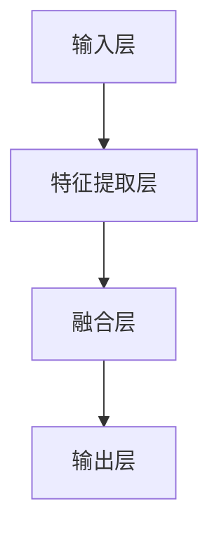
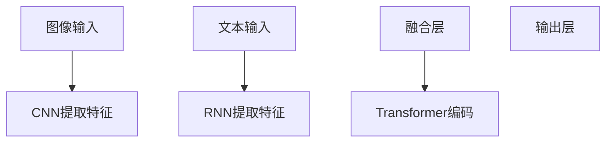
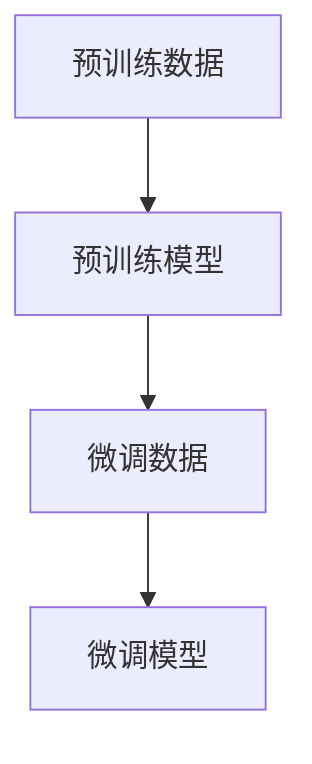
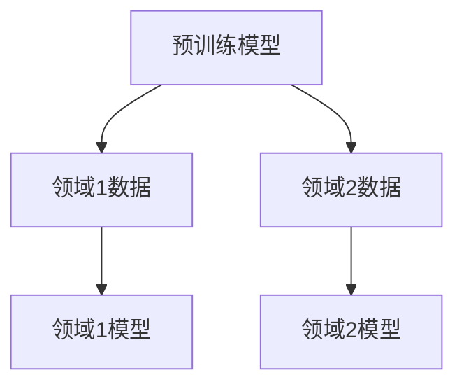

                 

关键词：多模态大模型，技术原理，OpenAI，实践，未来展望

> 摘要：本文旨在深入探讨多模态大模型的技术原理、应用实战及OpenAI的成长历程，分析其在人工智能领域的重要地位及未来发展趋势。通过对多模态大模型的架构、算法原理、数学模型及实际应用等方面的详细解析，帮助读者全面了解这一前沿技术的现状与潜力。

## 1. 背景介绍

随着人工智能技术的迅猛发展，多模态大模型逐渐成为研究热点。多模态大模型是指能够处理多种类型数据（如文本、图像、声音等）的深度学习模型，它能够同时融合不同类型的信息，实现对复杂问题的智能处理。在自然语言处理、计算机视觉、语音识别等领域，多模态大模型展现出了卓越的性能和广泛的适用性。

本文将首先回顾多模态大模型的发展历程，然后介绍其核心概念、架构和算法原理，接着分析数学模型及其推导过程，并分享实际应用案例。最后，本文将对多模态大模型的前景进行展望，探讨未来研究和发展方向。

### 1.1 多模态大模型的发展历程

多模态大模型的发展可以追溯到20世纪90年代，当时研究人员开始探索如何将不同类型的数据（如图像和文本）进行融合处理。随着深度学习技术的兴起，特别是卷积神经网络（CNN）和循环神经网络（RNN）的发展，多模态大模型的研究取得了重要突破。

在2014年，谷歌提出了Inception网络，这是首个在图像识别领域取得显著成果的多模态深度学习模型。随后，Facebook、微软、亚马逊等公司也相继推出了一系列多模态大模型，如FB-ResNet、MXNet、PyTorch等。

2018年，OpenAI发布了GPT-2模型，这是首个能够在多种数据类型上表现出卓越性能的多模态大模型。GPT-2的成功标志着多模态大模型在人工智能领域的重要地位，也为后续研究提供了有力支持。

### 1.2 多模态大模型的核心概念

多模态大模型的核心概念包括：

- **多模态数据融合**：将不同类型的数据（如文本、图像、声音等）进行融合处理，以实现更准确、更全面的信息理解。

- **深度学习模型**：利用神经网络结构，如卷积神经网络（CNN）、循环神经网络（RNN）、Transformer等，对多模态数据进行处理和建模。

- **预训练与微调**：通过预训练大量未标注数据，使模型具有通用的特征提取能力；然后通过微调，使模型适应特定任务和数据集。

- **迁移学习**：利用预训练模型在特定领域的知识，迁移到其他相关领域，提高模型在新领域的性能。

## 2. 核心概念与联系

### 2.1 多模态大模型的架构

多模态大模型的架构主要包括以下几个关键组成部分：

- **输入层**：接收不同类型的数据，如文本、图像、声音等。

- **特征提取层**：利用深度学习模型对输入数据进行特征提取，如CNN用于图像特征提取，RNN用于文本序列特征提取。

- **融合层**：将不同模态的特征进行融合，如使用注意力机制或拼接操作。

- **输出层**：根据任务需求，输出预测结果或决策。

下面是一个简化的Mermaid流程图，展示了多模态大模型的架构：

### 2.2 核心算法原理

多模态大模型的核心算法主要包括：

- **卷积神经网络（CNN）**：用于图像特征提取。

- **循环神经网络（RNN）**：用于文本序列特征提取。

- **Transformer**：用于文本和图像的联合编码。

下面是一个简化的Mermaid流程图，展示了多模态大模型的核心算法原理：

### 2.3 预训练与微调

多模态大模型的训练通常包括预训练和微调两个阶段：

- **预训练**：使用大量未标注的数据（如图像和文本）对模型进行预训练，使模型具备通用的特征提取能力。

- **微调**：在预训练基础上，使用特定任务的数据集对模型进行微调，以适应特定任务的需求。

预训练与微调的过程可以简化为以下流程：

### 2.4 迁移学习

多模态大模型可以采用迁移学习技术，将预训练模型的知识迁移到其他相关领域。迁移学习的过程可以简化为以下流程：

通过上述核心概念和原理的介绍，我们可以对多模态大模型有一个初步的了解。接下来的章节将深入探讨多模态大模型的具体算法原理、数学模型及实际应用案例。

