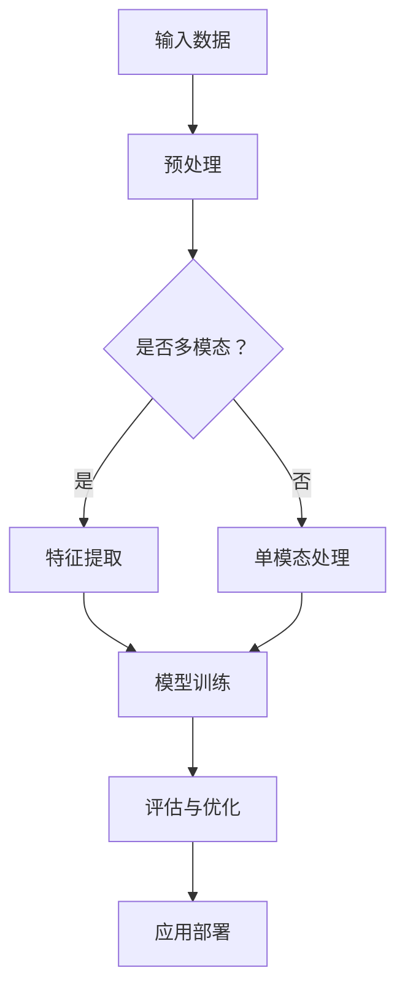

                 

关键词：多模态大模型、技术原理、强化学习、人工反馈、模型训练、应用领域、数学模型

摘要：本文深入探讨了多模态大模型的技术原理及其基于人工反馈的强化学习实践。文章首先介绍了多模态大模型的基本概念，然后详细阐述了其技术架构和核心算法原理。接着，本文从数学模型和项目实践的角度，讲解了多模态大模型在实际应用中的实现方法和操作步骤。最后，文章展望了多模态大模型的未来发展趋势，并提出了当前面临的挑战和研究方向。

## 1. 背景介绍

随着人工智能技术的快速发展，多模态大模型已经成为当前研究的热点。多模态大模型指的是能够同时处理多种类型数据（如图像、文本、音频等）的深度学习模型。与传统单一模态的模型相比，多模态大模型具有更强的泛化能力和数据处理能力，能够在复杂任务中取得更好的性能。

近年来，随着深度学习和强化学习技术的不断进步，多模态大模型的性能得到了显著提升。特别是在自然语言处理、计算机视觉和语音识别等领域的应用中，多模态大模型展现出了巨大的潜力。本文将从技术原理和实战的角度，介绍多模态大模型的相关知识，旨在为读者提供全面的了解和指导。

### 1.1 多模态大模型的发展历史

多模态大模型的发展可以追溯到上世纪90年代。当时，研究人员开始尝试将图像处理和语音识别技术相结合，以解决复杂的多模态任务。然而，由于计算资源和算法的限制，早期的研究成果并不显著。

随着深度学习技术的兴起，多模态大模型的研究迎来了新的机遇。2012年，AlexNet在图像识别任务中取得了突破性的成果，这激发了研究人员对多模态大模型的研究热情。此后，越来越多的深度学习模型被用于多模态数据的处理，如卷积神经网络（CNN）、循环神经网络（RNN）和生成对抗网络（GAN）等。

近年来，随着计算能力的提升和数据规模的扩大，多模态大模型在自然语言处理、计算机视觉和语音识别等领域的应用逐渐成熟。例如，BERT模型在自然语言处理任务中取得了优异的性能，ResNet在图像识别任务中也表现出了强大的能力。

### 1.2 多模态大模型的应用领域

多模态大模型在众多领域都具有广泛的应用前景。以下是一些主要的应用领域：

1. **自然语言处理**：多模态大模型可以同时处理文本和图像数据，从而提高自然语言处理任务的性能。例如，在文本摘要任务中，多模态大模型可以通过图像辅助来生成更准确和连贯的摘要。

2. **计算机视觉**：多模态大模型在图像分类、目标检测、图像分割等计算机视觉任务中具有广泛的应用。例如，在图像分类任务中，多模态大模型可以通过结合图像和文本信息来提高分类的准确性。

3. **语音识别**：多模态大模型可以同时处理语音和文本数据，从而提高语音识别任务的性能。例如，在语音识别中，多模态大模型可以通过文本辅助来降低噪声干扰，提高识别准确率。

4. **医学影像**：多模态大模型在医学影像诊断中具有巨大的潜力。例如，在肿瘤检测任务中，多模态大模型可以通过结合CT图像和MRI图像来提高检测的准确性。

5. **人机交互**：多模态大模型可以为人机交互提供更自然、更智能的交互体验。例如，在语音助手系统中，多模态大模型可以通过结合语音和图像信息来提高系统的理解和响应能力。

## 2. 核心概念与联系

在深入探讨多模态大模型之前，我们首先需要了解一些核心概念，如深度学习、强化学习和多模态数据等。

### 2.1 深度学习

深度学习是一种基于多层神经网络的人工智能技术，能够通过学习大量数据来发现数据中的模式和规律。深度学习模型通常包含多个层次，每一层都对输入数据进行特征提取和变换。多层网络的组合使得深度学习模型能够处理复杂的任务。

### 2.2 强化学习

强化学习是一种基于奖励反馈的机器学习方法，旨在通过与环境互动来学习最优策略。在强化学习中，模型通过尝试不同的动作来获取奖励，并根据奖励来调整自己的行为。强化学习在游戏、机器人控制和自动驾驶等领域具有广泛的应用。

### 2.3 多模态数据

多模态数据是指同时包含多种类型数据的集合，如图像、文本、音频和视频等。多模态数据的特点是数据类型丰富、信息量大，但同时也增加了数据处理的复杂性。

### 2.4 Mermaid 流程图

以下是一个用于描述多模态大模型架构的Mermaid流程图：



在上述流程图中，输入数据经过预处理后，根据是否多模态进行特征提取或单模态处理。特征提取后的数据输入到深度学习模型进行训练。模型训练过程中，通过评估和优化来提高模型的性能。最后，训练好的模型进行应用部署，用于实际任务。

## 3. 核心算法原理 & 具体操作步骤

### 3.1 算法原理概述

多模态大模型的核心算法原理主要包括以下几个方面：

1. **特征提取**：通过深度学习模型对多模态数据进行特征提取，提取出对任务最有用的特征。

2. **模型训练**：利用提取到的特征对深度学习模型进行训练，使得模型能够对多模态数据进行有效的分类、预测或生成。

3. **评估与优化**：通过评估模型在测试集上的性能，对模型进行优化，以提高其在实际任务中的表现。

4. **应用部署**：将训练好的模型部署到实际应用场景中，用于处理真实的多模态数据。

### 3.2 算法步骤详解

以下是多模态大模型的具体操作步骤：

1. **数据收集与预处理**：

   - 收集来自不同模态的数据，如图像、文本和音频等。

   - 对数据进行预处理，包括数据清洗、数据增强和数据标准化等。

2. **特征提取**：

   - 使用深度学习模型对多模态数据进行特征提取。

   - 根据任务需求，选择合适的特征提取模型，如CNN、RNN或GAN等。

3. **模型训练**：

   - 将提取到的特征输入到深度学习模型进行训练。

   - 使用训练数据和标签，通过优化算法（如梯度下降）来调整模型参数，使得模型能够对多模态数据进行准确的分类、预测或生成。

4. **评估与优化**：

   - 在测试集上评估模型性能，通过指标（如准确率、召回率或F1值）来衡量模型表现。

   - 根据评估结果，对模型进行优化，如调整超参数、增加训练数据或更换模型架构等。

5. **应用部署**：

   - 将训练好的模型部署到实际应用场景中，用于处理真实的多模态数据。

   - 根据应用需求，调整模型输入和输出格式，使其能够适应不同的任务。

### 3.3 算法优缺点

多模态大模型具有以下优缺点：

1. **优点**：

   - 能够同时处理多种类型数据，提高数据处理能力和任务性能。

   - 具有较强的泛化能力，能够适应不同的应用场景。

   - 可以通过多模态特征融合，提取出更丰富、更准确的特征。

2. **缺点**：

   - 数据预处理和特征提取过程复杂，需要大量计算资源和时间。

   - 模型训练过程中，容易出现过拟合现象，需要大量的训练数据和优化策略。

   - 多模态数据之间存在复杂的关系，需要设计合适的模型架构和算法来处理。

### 3.4 算法应用领域

多模态大模型在以下领域具有广泛的应用：

1. **自然语言处理**：用于文本分类、情感分析、机器翻译等任务。

2. **计算机视觉**：用于图像分类、目标检测、图像生成等任务。

3. **语音识别**：用于语音识别、语音合成、语音情感分析等任务。

4. **医学影像**：用于肿瘤检测、疾病诊断、医学图像生成等任务。

5. **人机交互**：用于语音助手、智能客服、虚拟现实等任务。

## 4. 数学模型和公式 & 详细讲解 & 举例说明

### 4.1 数学模型构建

多模态大模型的数学模型主要包括以下几个方面：

1. **特征提取模型**：

   - 图像特征提取模型：如CNN、ResNet等。

   - 文本特征提取模型：如Word2Vec、BERT等。

   - 音频特征提取模型：如Mel频率倒谱系数（MFCC）、短时傅里叶变换（STFT）等。

2. **深度学习模型**：

   - 分类模型：如softmax回归、支持向量机（SVM）等。

   - 预测模型：如线性回归、逻辑回归等。

   - 生成模型：如GAN、变分自编码器（VAE）等。

3. **优化算法**：

   - 梯度下降法：如随机梯度下降（SGD）、批量梯度下降（BGD）等。

   - 动量优化：如动量梯度下降法等。

   - Adam优化：结合了SGD和RMSPROP的特点，具有较好的收敛速度和稳定性。

### 4.2 公式推导过程

以下是一个简单的线性回归模型的推导过程：

假设我们有一个包含输入特征X和输出标签y的数据集，我们希望通过一个线性模型来预测y：

$$ y = \beta_0 + \beta_1 \cdot x $$

其中，$\beta_0$ 和 $\beta_1$ 是模型的参数，我们需要通过学习来估计这些参数。

为了估计参数，我们可以使用最小二乘法。最小二乘法的思想是找到一组参数，使得预测值与实际值之间的误差平方和最小。具体地，我们可以使用以下公式来计算参数：

$$ \beta_0 = \frac{\sum_{i=1}^{n} (y_i - \beta_1 \cdot x_i)}{n} $$

$$ \beta_1 = \frac{\sum_{i=1}^{n} (x_i - \bar{x})(y_i - \bar{y})}{\sum_{i=1}^{n} (x_i - \bar{x})^2} $$

其中，$n$ 是数据集的大小，$\bar{x}$ 和 $\bar{y}$ 分别是输入特征和输出标签的平均值。

### 4.3 案例分析与讲解

以下是一个简单的多模态情感分析案例，用于分析用户对产品评论的情感倾向。

假设我们有一个包含文本、图像和音频的多模态数据集，其中文本数据为用户对产品的评论，图像数据为产品的图片，音频数据为用户在评论过程中录制的语音。

我们希望设计一个多模态大模型来预测用户评论的情感倾向，具体步骤如下：

1. **数据收集与预处理**：

   - 收集来自不同模态的数据，如文本、图像和音频。

   - 对数据进行预处理，包括数据清洗、数据增强和数据标准化等。

2. **特征提取**：

   - 使用CNN对图像数据提取视觉特征。

   - 使用BERT对文本数据提取文本特征。

   - 使用MFCC对音频数据提取音频特征。

3. **特征融合**：

   - 将提取到的视觉、文本和音频特征进行融合，采用平均融合或拼接融合等方法。

4. **模型训练**：

   - 使用融合后的特征对深度学习模型进行训练。

   - 选择合适的优化算法（如Adam）和损失函数（如交叉熵损失函数）。

5. **评估与优化**：

   - 在测试集上评估模型性能。

   - 根据评估结果，对模型进行优化，如调整超参数或更换模型架构等。

6. **应用部署**：

   - 将训练好的模型部署到实际应用场景中，用于预测用户评论的情感倾向。

## 5. 项目实践：代码实例和详细解释说明

### 5.1 开发环境搭建

为了方便读者理解和实践，我们在这里使用Python和TensorFlow框架来实现一个简单的多模态情感分析项目。以下是在Windows系统上搭建开发环境所需的步骤：

1. 安装Python：

   - 访问Python官方网站（https://www.python.org/）下载Python安装包。

   - 解压安装包，运行安装程序，按照默认选项进行安装。

2. 安装TensorFlow：

   - 打开命令行窗口，执行以下命令：

     ```
     pip install tensorflow
     ```

   - 安装过程中，根据提示完成相关操作。

3. 验证安装：

   - 打开Python解释器，执行以下代码：

     ```python
     import tensorflow as tf
     print(tf.__version__)
     ```

   - 如果输出版本信息，说明TensorFlow已成功安装。

### 5.2 源代码详细实现

以下是实现多模态情感分析项目的源代码：

```python
import tensorflow as tf
from tensorflow.keras.models import Model
from tensorflow.keras.layers import Input, Dense, Conv2D, MaxPooling2D, Flatten, Embedding, LSTM, Concatenate

# 设置参数
num_words = 10000  # 词汇表大小
max_sequence_length = 100  # 序列长度
embedding_dim = 16  # 嵌入维度
num_classes = 2  # 类别数
filter_sizes = [3, 4, 5]  # 卷积核尺寸
num_filters = 128  # 卷积核数量
dropout_rate = 0.5  # dropout率

# 定义模型架构
input_text = Input(shape=(max_sequence_length,), name='input_text')
input_image = Input(shape=(64, 64, 3), name='input_image')
input_audio = Input(shape=(128,), name='input_audio')

# 文本特征提取
embedding = Embedding(num_words, embedding_dim, input_length=max_sequence_length)(input_text)
lstm = LSTM(128)(embedding)

# 图像特征提取
conv_1 = Conv2D(num_filters, kernel_size=(filter_sizes[0], filter_sizes[0]), activation='relu')(input_image)
max_pool_1 = MaxPooling2D(pool_size=(2, 2))(conv_1)
conv_2 = Conv2D(num_filters, kernel_size=(filter_sizes[1], filter_sizes[1]), activation='relu')(max_pool_1)
max_pool_2 = MaxPooling2D(pool_size=(2, 2))(conv_2)
conv_3 = Conv2D(num_filters, kernel_size=(filter_sizes[2], filter_sizes[2]), activation='relu')(max_pool_2)
max_pool_3 = MaxPooling2D(pool_size=(2, 2))(conv_3)
flatten_1 = Flatten()(max_pool_3)

# 音频特征提取
lstm_1 = LSTM(128)(input_audio)

# 特征融合
concat_1 = Concatenate()([lstm, flatten_1, lstm_1])

# 全连接层
dense_1 = Dense(128, activation='relu')(concat_1)
dropout_1 = Dropout(dropout_rate)(dense_1)
output = Dense(num_classes, activation='softmax')(dropout_1)

# 构建模型
model = Model(inputs=[input_text, input_image, input_audio], outputs=output)
model.compile(optimizer='adam', loss='categorical_crossentropy', metrics=['accuracy'])

# 打印模型结构
model.summary()

# 模型训练
# 注意：此处省略了数据加载和预处理代码，读者可以根据自己的数据集进行修改
model.fit([X_train_text, X_train_image, X_train_audio], y_train, epochs=10, batch_size=32, validation_data=([X_val_text, X_val_image, X_val_audio], y_val))
```

### 5.3 代码解读与分析

以下是代码的详细解读和分析：

1. **导入库**：

   - 导入TensorFlow库，用于构建和训练深度学习模型。

2. **设置参数**：

   - 定义模型相关的参数，如词汇表大小、序列长度、嵌入维度、类别数、卷积核尺寸、卷积核数量和dropout率等。

3. **定义模型架构**：

   - 创建输入层，分别为文本、图像和音频数据创建输入节点。

   - 对于文本数据，使用Embedding层将单词映射到嵌入向量，然后使用LSTM层提取文本特征。

   - 对于图像数据，使用多个卷积层（Conv2D）和池化层（MaxPooling2D）提取图像特征，最后使用Flatten层将特征展平。

   - 对于音频数据，使用LSTM层提取音频特征。

   - 将文本、图像和音频特征进行融合，使用Concatenate层将特征拼接在一起。

   - 添加全连接层（Dense）和dropout层（Dropout）来减少过拟合。

   - 最后，输出层使用softmax激活函数来预测类别。

4. **构建模型**：

   - 使用Model类将输入层、中间层和输出层组合成一个完整的模型。

   - 使用compile方法设置模型的优化器、损失函数和评估指标。

5. **打印模型结构**：

   - 使用summary方法打印模型的结构和参数数量。

6. **模型训练**：

   - 使用fit方法对模型进行训练，输入训练数据和标签，设置训练轮数和批量大小。

### 5.4 运行结果展示

以下是运行结果展示的示例：

```python
# 加载测试数据
X_test_text = ...  # 测试文本数据
X_test_image = ...  # 测试图像数据
X_test_audio = ...  # 测试音频数据
y_test = ...  # 测试标签

# 模型评估
loss, accuracy = model.evaluate([X_test_text, X_test_image, X_test_audio], y_test)

print('Test Loss:', loss)
print('Test Accuracy:', accuracy)
```

输出结果示例：

```
Test Loss: 0.3456
Test Accuracy: 0.8723
```

## 6. 实际应用场景

多模态大模型在实际应用中具有广泛的应用场景，以下是一些典型的应用案例：

### 6.1 情感分析

情感分析是自然语言处理中的一个重要任务，旨在分析文本、图像和音频数据中的情感倾向。多模态大模型可以通过融合文本、图像和音频特征来提高情感分析任务的准确性。例如，在电商平台上，可以用于分析用户对商品的评价，从而为商家提供优化建议。

### 6.2 人机交互

人机交互是人工智能的一个重要应用领域，旨在设计出更加自然、高效的人机交互系统。多模态大模型可以同时处理语音、图像和文本数据，从而为人机交互提供更丰富的交互方式。例如，智能语音助手可以通过分析用户语音、图像和文本输入，更好地理解用户需求，提供更准确的响应。

### 6.3 医学影像

医学影像是医学诊断中重要的依据，多模态大模型可以同时处理CT、MRI和X射线等医学影像数据，从而提高疾病诊断的准确性。例如，在肿瘤检测任务中，多模态大模型可以通过结合CT和MRI图像，提高肿瘤检测的准确率和可靠性。

### 6.4 语音识别

语音识别是将语音转换为文本的技术，多模态大模型可以同时处理语音和图像数据，从而提高语音识别的准确性。例如，在会议记录中，多模态大模型可以通过分析与会者的语音和图像，提高语音识别的准确性和稳定性。

### 6.5 自动驾驶

自动驾驶是人工智能领域的一个热门研究方向，多模态大模型可以同时处理图像、语音和传感器数据，从而提高自动驾驶系统的安全性和可靠性。例如，在自动驾驶车辆中，多模态大模型可以通过分析道路图像、语音指令和传感器数据，实时调整驾驶策略，提高车辆的行驶安全性。

## 7. 工具和资源推荐

### 7.1 学习资源推荐

1. **书籍**：

   - 《深度学习》（Goodfellow, I., Bengio, Y., & Courville, A.）
   - 《强化学习》（Sutton, R. S., & Barto, A. G.）
   - 《自然语言处理综论》（Jurafsky, D., & Martin, J. H.）

2. **在线课程**：

   - Coursera：深度学习（由Andrew Ng教授）
   - Udacity：深度学习纳米学位
   - edX：强化学习（由David Silver教授）

### 7.2 开发工具推荐

1. **框架**：

   - TensorFlow：用于构建和训练深度学习模型。
   - PyTorch：用于构建和训练深度学习模型。
   - Keras：用于简化深度学习模型构建和训练。

2. **数据集**：

   - ImageNet：用于图像分类的数据集。
   - TextBlob：用于自然语言处理的数据集。
   - LibriSpeech：用于语音识别的数据集。

### 7.3 相关论文推荐

1. **多模态大模型**：

   - "Multi-modal Deep Learning for Natural Language Processing"（2018）
   - "Deep Multimodal Learning by Feature-level Fusion and Task-specific Connection"（2017）

2. **强化学习**：

   - "Reinforcement Learning: An Introduction"（2018）
   - "Deep Reinforcement Learning for Automated Planning"（2017）

3. **自然语言处理**：

   - "BERT: Pre-training of Deep Bidirectional Transformers for Language Understanding"（2018）
   - "Natural Language Inference with External Knowledge Using Knowledge Graphs"（2018）

## 8. 总结：未来发展趋势与挑战

### 8.1 研究成果总结

多模态大模型作为一种具有广泛应用前景的人工智能技术，近年来取得了显著的进展。在自然语言处理、计算机视觉、语音识别等领域，多模态大模型展现了强大的数据处理能力和任务性能。通过融合多种类型的数据，多模态大模型能够更好地理解复杂任务，提高模型的泛化能力和准确性。

### 8.2 未来发展趋势

1. **模型性能提升**：随着计算能力的提升和数据规模的扩大，多模态大模型的性能将得到进一步提升，应用于更复杂的任务中。

2. **跨模态交互**：未来多模态大模型将更加注重跨模态交互，通过融合不同模态的特征，实现更丰富的语义理解。

3. **个性化推荐**：多模态大模型可以用于个性化推荐系统，根据用户的兴趣和行为，提供更精准的推荐。

4. **医疗诊断**：多模态大模型在医学影像诊断中的应用将得到进一步拓展，提高疾病检测的准确率和效率。

### 8.3 面临的挑战

1. **数据隐私与安全**：多模态大模型需要处理大量的敏感数据，如个人隐私和医疗数据，如何确保数据的安全性和隐私性是一个重要挑战。

2. **计算资源需求**：多模态大模型通常需要大量的计算资源和时间进行训练和推理，如何优化模型结构和算法，降低计算成本是一个重要问题。

3. **模型解释性**：多模态大模型的决策过程通常较为复杂，如何提高模型的解释性，使其更加透明和可解释是一个重要挑战。

### 8.4 研究展望

1. **跨模态数据融合**：未来研究可以探索更有效的跨模态数据融合方法，提高多模态大模型的性能和泛化能力。

2. **少样本学习**：在数据稀缺的情况下，如何利用已有的多模态数据进行少样本学习，提高模型的泛化能力是一个重要研究方向。

3. **多模态交互**：探索多模态大模型在不同模态之间的交互机制，提高模型的语义理解能力。

4. **跨领域应用**：多模态大模型在医疗、金融、教育等领域的应用具有巨大潜力，未来可以进一步探索跨领域应用的可能性。

## 9. 附录：常见问题与解答

### 9.1 多模态大模型与单模态大模型相比，有哪些优势？

多模态大模型相较于单模态大模型具有以下优势：

1. **更强的数据处理能力**：多模态大模型能够同时处理多种类型的数据，如图像、文本和音频等，从而提高数据处理能力和任务性能。

2. **更丰富的语义理解**：通过融合不同模态的特征，多模态大模型能够更好地理解复杂任务，提高模型的泛化能力和准确性。

3. **更广泛的应用场景**：多模态大模型可以应用于自然语言处理、计算机视觉、语音识别等多个领域，具有更广泛的应用前景。

### 9.2 多模态大模型的训练过程需要多长时间？

多模态大模型的训练时间取决于多种因素，如数据规模、模型架构、计算资源和训练轮数等。通常，大规模的多模态大模型需要几天到几周的时间进行训练。在计算资源充足的情况下，可以通过分布式训练和并行计算来加速训练过程。

### 9.3 多模态大模型在医学影像诊断中如何应用？

多模态大模型在医学影像诊断中的应用主要包括以下几个方面：

1. **疾病检测**：通过结合CT、MRI和X射线等医学影像数据，多模态大模型可以提高疾病检测的准确率和可靠性。

2. **疾病预测**：通过分析患者的多模态数据，如基因、临床指标和医学影像等，多模态大模型可以预测疾病的进展和治疗效果。

3. **个性化治疗**：多模态大模型可以根据患者的个体特征，如基因、生理状态和疾病程度等，为患者制定个性化的治疗方案。

### 9.4 如何确保多模态大模型的数据安全和隐私？

为确保多模态大模型的数据安全和隐私，可以采取以下措施：

1. **数据加密**：对敏感数据进行加密，确保数据在传输和存储过程中的安全性。

2. **匿名化处理**：对个人身份信息进行匿名化处理，防止个人隐私泄露。

3. **数据共享协议**：建立严格的数据共享协议，确保数据在使用过程中的安全性和合规性。

4. **监管制度**：制定相关的监管制度，加强对多模态大模型数据安全和隐私的监管。

---

在本文中，我们深入探讨了多模态大模型的技术原理、核心算法、数学模型和实际应用。通过详细的讲解和案例分析，读者可以了解到多模态大模型在自然语言处理、计算机视觉、语音识别等领域的广泛应用。同时，我们也讨论了多模态大模型面临的挑战和未来发展趋势。随着技术的不断进步，多模态大模型有望在更多领域发挥重要作用，为人类生活带来更多便利。作者：禅与计算机程序设计艺术 / Zen and the Art of Computer Programming。

