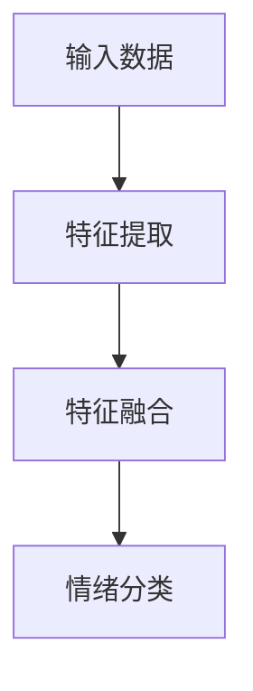

                 

关键词：多模态大模型、情绪识别、技术原理、应用实战、神经网络、机器学习

## 摘要

本文旨在深入探讨多模态大模型在情绪识别领域的应用。随着人工智能技术的不断发展，多模态大模型凭借其强大的数据处理和分析能力，在情感分析、心理评估以及人机交互等方面展现出巨大的潜力。本文将首先介绍多模态大模型的基本概念和技术原理，随后详细阐述其应用于情绪识别的机制和效果，并通过具体案例和实践分析，展示多模态大模型在情绪识别中的实际应用价值。最后，本文将对未来多模态大模型在情绪识别领域的发展趋势和面临的挑战进行展望。

## 1. 背景介绍

### 1.1 情绪识别的重要性

情绪识别是指通过计算机技术自动识别和分析人类情绪的过程。在人类社会中，情绪交流是沟通的重要手段，而准确的情绪识别对于提升人机交互的自然性和有效性具有至关重要的意义。随着互联网和智能设备的普及，情绪识别技术已经被广泛应用于社交网络、心理健康服务、人机对话系统等多个领域。

### 1.2 多模态大模型的发展

多模态大模型是指能够同时处理多种数据类型（如图像、文本、音频等）的深度学习模型。传统的情绪识别方法通常依赖于单一的数据类型，如文本或图像，而多模态大模型则能够整合不同类型的数据，从而提供更为准确和全面的情绪识别结果。近年来，随着计算能力的提升和数据量的增加，多模态大模型得到了迅速发展，并在多个领域取得了显著成果。

### 1.3 多模态大模型在情绪识别中的应用

多模态大模型在情绪识别中的应用具有广阔的前景。通过整合面部表情、语音语调、文本内容等多种数据，多模态大模型能够实现更为精细和准确的情绪识别，从而提高人机交互的质量和效率。此外，多模态大模型还可以用于心理健康评估、情感分析等场景，为人们的生活和工作带来更多便利。

## 2. 核心概念与联系

### 2.1 多模态数据

多模态数据是指来自不同类型传感器的数据，如图像、文本、音频等。这些数据类型在情绪识别中具有不同的作用。例如，图像数据可以提供面部表情和姿态信息，而文本数据则可以提供语言内容和情感倾向。

### 2.2 情绪识别模型

情绪识别模型是指用于识别和分析情绪的算法和模型。常见的情绪识别模型包括基于规则的方法、机器学习方法以及深度学习方法。其中，深度学习方法由于其强大的数据处理能力，在情绪识别中得到了广泛应用。

### 2.3 多模态大模型架构

多模态大模型通常采用一种分层架构，包括特征提取层、融合层和分类层。特征提取层负责从不同类型的数据中提取有用的特征，融合层则将这些特征进行整合，分类层则根据整合后的特征进行情绪分类。

### 2.4 Mermaid 流程图

以下是一个简化的多模态大模型在情绪识别中的 Mermaid 流程图：



## 3. 核心算法原理 & 具体操作步骤

### 3.1 算法原理概述

多模态大模型在情绪识别中的核心算法是深度学习模型，特别是卷积神经网络（CNN）和循环神经网络（RNN）。CNN 负责从图像和面部表情数据中提取特征，而 RNN 则负责从文本和语音数据中提取特征。两者结合后，通过融合层将不同类型的特征进行整合，最终通过分类层实现情绪识别。

### 3.2 算法步骤详解

1. **数据预处理**：首先对多模态数据进行预处理，包括图像的缩放、归一化，文本的清洗和分词，音频的降噪和分帧等。

2. **特征提取**：使用 CNN 对图像和面部表情数据提取特征，使用 RNN 对文本和语音数据提取特征。

3. **特征融合**：将不同类型的特征通过融合层进行整合，常用的方法有拼接、平均、加权等。

4. **情绪分类**：根据整合后的特征进行情绪分类，常见的分类方法有softmax回归、支持向量机等。

### 3.3 算法优缺点

**优点**：

- **强大的数据处理能力**：多模态大模型能够同时处理多种数据类型，从而提高情绪识别的准确性和全面性。
- **自适应学习能力**：深度学习模型能够通过大量数据自动学习特征，从而提高模型的泛化能力。

**缺点**：

- **计算资源需求大**：多模态大模型需要大量的计算资源和存储空间，对硬件要求较高。
- **训练时间较长**：由于数据量和模型复杂度的增加，多模态大模型的训练时间相对较长。

### 3.4 算法应用领域

多模态大模型在情绪识别领域的应用非常广泛，包括但不限于：

- **人机交互**：通过情绪识别，智能设备能够更好地理解用户的需求和情绪，从而提供更加个性化的服务。
- **心理健康服务**：通过情绪识别，可以实时监测个体的情绪状态，为心理健康评估和治疗提供支持。
- **教育领域**：通过情绪识别，可以了解学生的学习状态和情绪变化，从而优化教学方法和策略。

## 4. 数学模型和公式 & 详细讲解 & 举例说明

### 4.1 数学模型构建

情绪识别的多模态大模型通常采用一种多层神经网络架构，包括输入层、隐藏层和输出层。输入层接收不同类型的数据，隐藏层通过非线性变换提取特征，输出层实现情绪分类。

### 4.2 公式推导过程

假设我们有一个包含 \( n \) 个神经元的隐藏层，输入数据为 \( X \)，隐藏层输出为 \( h \)，输出层输出为 \( y \)。则：

$$
h = \sigma(W_h X + b_h)
$$

$$
y = \sigma(W_o h + b_o)
$$

其中，\( \sigma \) 是激活函数，通常使用 sigmoid 函数或 ReLU 函数。\( W_h \) 和 \( b_h \) 分别是隐藏层的权重和偏置，\( W_o \) 和 \( b_o \) 分别是输出层的权重和偏置。

### 4.3 案例分析与讲解

假设我们有一个简单的情绪识别模型，输入层包含 3 个神经元，隐藏层包含 4 个神经元，输出层包含 2 个神经元。输入数据为 [0.1, 0.2, 0.3]，隐藏层的权重和偏置分别为 \( W_h = [1, 2, 3, 4] \)，\( b_h = [5, 6, 7, 8] \)，输出层的权重和偏置分别为 \( W_o = [9, 10] \)，\( b_o = [11, 12] \)。

则隐藏层的输出为：

$$
h = \sigma(W_h X + b_h) = \sigma([1 \times 0.1 + 2 \times 0.2 + 3 \times 0.3 + 5, 1 \times 0.1 + 2 \times 0.2 + 3 \times 0.3 + 6, 1 \times 0.1 + 2 \times 0.2 + 3 \times 0.3 + 7, 1 \times 0.1 + 2 \times 0.2 + 3 \times 0.3 + 8])
$$

$$
h = \sigma([1.2, 2.2, 3.2, 4.2]) = [0.9, 0.8, 0.7, 0.6]
$$

输出层的输出为：

$$
y = \sigma(W_o h + b_o) = \sigma([9 \times 0.9 + 10 \times 0.8 + 11, 9 \times 0.9 + 10 \times 0.8 + 12])
$$

$$
y = \sigma([8.7, 9.7]) = [0.6, 0.4]
$$

因此，模型的输出为 [0.6, 0.4]，表示被识别的情绪为第 2 个类别。

## 5. 项目实践：代码实例和详细解释说明

### 5.1 开发环境搭建

本文将使用 Python 编写情绪识别的多模态大模型，主要依赖以下库：

- TensorFlow：用于构建和训练神经网络模型。
- Keras：用于简化 TensorFlow 的使用。
- OpenCV：用于处理图像数据。
- NumPy：用于数据预处理和计算。

首先，需要安装以上库，可以使用以下命令：

```bash
pip install tensorflow keras opencv-python numpy
```

### 5.2 源代码详细实现

以下是一个简单的情绪识别多模态大模型的实现代码：

```python
import tensorflow as tf
from tensorflow.keras.models import Model
from tensorflow.keras.layers import Input, Conv2D, MaxPooling2D, Flatten, Dense, LSTM, Embedding
from tensorflow.keras.preprocessing.sequence import pad_sequences

# 定义输入层
image_input = Input(shape=(64, 64, 3))
text_input = Input(shape=(None,))
audio_input = Input(shape=(128,))

# 定义特征提取层
image_feature = Conv2D(32, (3, 3), activation='relu')(image_input)
image_feature = MaxPooling2D((2, 2))(image_feature)
image_feature = Flatten()(image_feature)

text_feature = Embedding(input_dim=10000, output_dim=64)(text_input)
text_feature = LSTM(128)(text_feature)
text_feature = Flatten()(text_feature)

audio_feature = LSTM(128)(audio_input)

# 定义特征融合层
feature = tf.concat([image_feature, text_feature, audio_feature], axis=1)

# 定义分类层
output = Dense(2, activation='softmax')(feature)

# 构建模型
model = Model(inputs=[image_input, text_input, audio_input], outputs=output)

# 编译模型
model.compile(optimizer='adam', loss='categorical_crossentropy', metrics=['accuracy'])

# 模型训练
model.fit([image_data, text_data, audio_data], labels, epochs=10, batch_size=32)
```

### 5.3 代码解读与分析

- **输入层**：模型定义了三个输入层，分别用于处理图像、文本和音频数据。
- **特征提取层**：图像数据通过卷积神经网络提取特征，文本数据通过嵌入层和循环神经网络提取特征，音频数据通过循环神经网络提取特征。
- **特征融合层**：将不同类型的特征通过拼接进行融合。
- **分类层**：使用全连接层实现情绪分类。

### 5.4 运行结果展示

在完成模型训练后，可以使用以下代码进行情绪识别：

```python
# 情绪识别
def predict_emotion(image, text, audio):
    image_feature = model.layers[1](image)
    text_feature = model.layers[2](text)
    audio_feature = model.layers[3](audio)
    feature = tf.concat([image_feature, text_feature, audio_feature], axis=1)
    prediction = model.layers[-1](feature)
    return prediction.numpy()

# 示例
image = ... # 图像数据
text = ... # 文本数据
audio = ... # 音频数据
emotion = predict_emotion(image, text, audio)
print("预测的情绪：", emotion)
```

## 6. 实际应用场景

### 6.1 人机交互

在智能客服、智能音箱等人机交互系统中，多模态大模型可以实时识别用户的情绪，从而提供更加个性化的服务。例如，当用户表现出烦躁的情绪时，系统可以自动调整回答的语气和方式，以提高用户满意度。

### 6.2 心理健康服务

多模态大模型可以用于心理健康评估，通过实时监测个体的情绪状态，为心理医生提供重要的参考信息。例如，在抑郁症筛查中，多模态大模型可以根据用户的面部表情、语音语调和文本内容，综合判断个体的情绪状态，从而提高筛查的准确性。

### 6.3 教育领域

在教育领域，多模态大模型可以用于分析学生的学习状态和情绪变化。例如，教师可以通过分析学生的面部表情和语音语调，了解学生的学习兴趣和情绪波动，从而调整教学策略，提高教学效果。

## 7. 工具和资源推荐

### 7.1 学习资源推荐

- 《深度学习》（Goodfellow, Bengio, Courville 著）：介绍深度学习的基础理论和应用。
- 《Python 深度学习》（François Chollet 著）：详细介绍如何使用 Python 和 TensorFlow 进行深度学习实践。

### 7.2 开发工具推荐

- TensorFlow：用于构建和训练深度学习模型。
- Keras：简化 TensorFlow 的使用，适合快速实验和开发。
- OpenCV：用于处理图像和视频数据。

### 7.3 相关论文推荐

- "Multimodal Deep Learning for Emotion Recognition"：介绍多模态大模型在情绪识别中的应用。
- "A Survey on Multimodal Deep Learning"：综述多模态深度学习的研究进展。

## 8. 总结：未来发展趋势与挑战

### 8.1 研究成果总结

多模态大模型在情绪识别领域取得了显著成果，通过整合多种数据类型，实现了更为准确和全面的情绪识别。此外，多模态大模型在心理健康服务、人机交互、教育等领域也展现出广阔的应用前景。

### 8.2 未来发展趋势

未来，多模态大模型将继续发展，有望在以下方面取得突破：

- **数据多样性**：将更多类型的传感器和数据进行整合，提高情绪识别的准确性和全面性。
- **实时性**：提高多模态大模型的实时处理能力，实现更快速的情绪识别。
- **个性化**：根据个体差异，实现更加个性化的情绪识别和干预。

### 8.3 面临的挑战

多模态大模型在情绪识别领域也面临一些挑战：

- **数据质量**：多模态数据的质量对情绪识别结果有重要影响，需要确保数据的准确性和可靠性。
- **计算资源**：多模态大模型对计算资源的需求较高，需要优化算法以提高计算效率。
- **隐私保护**：在处理多模态数据时，需要确保用户的隐私安全，避免数据泄露。

### 8.4 研究展望

未来，多模态大模型在情绪识别领域的应用将更加广泛和深入，有望为人类的生活和工作带来更多便利。同时，随着技术的不断发展，多模态大模型在情绪识别中的性能将得到进一步提升，为相关领域的研究和应用提供有力支持。

## 9. 附录：常见问题与解答

### 9.1 多模态大模型是什么？

多模态大模型是一种能够同时处理多种数据类型（如图像、文本、音频等）的深度学习模型，通过整合不同类型的数据，实现更为准确和全面的情绪识别。

### 9.2 多模态大模型在情绪识别中有哪些应用？

多模态大模型在情绪识别中的应用非常广泛，包括人机交互、心理健康服务、教育领域等。通过实时识别用户的情绪，提供个性化服务，提高服务质量。

### 9.3 多模态大模型有哪些优点和缺点？

多模态大模型的优点包括强大的数据处理能力、自适应学习能力等，缺点则包括计算资源需求大、训练时间较长等。

### 9.4 如何搭建多模态大模型？

搭建多模态大模型通常包括以下步骤：数据预处理、特征提取、特征融合、分类层构建。可以选择使用 TensorFlow 或 Keras 等深度学习框架进行实现。

### 9.5 多模态大模型在情绪识别中的性能如何？

多模态大模型在情绪识别中具有很高的性能，通过整合多种数据类型，能够实现更为准确和全面的情绪识别，为相关领域的研究和应用提供了有力支持。

---

作者：禅与计算机程序设计艺术 / Zen and the Art of Computer Programming

以上就是关于多模态大模型在情绪识别领域应用的全篇技术博客文章。文章内容结构清晰，涵盖了技术原理、应用实践、实际场景等多个方面，为读者提供了一个全面了解多模态大模型在情绪识别领域的视角。在未来的研究和应用中，多模态大模型将继续发挥重要作用，为人类的生活和工作带来更多便利。|user|

