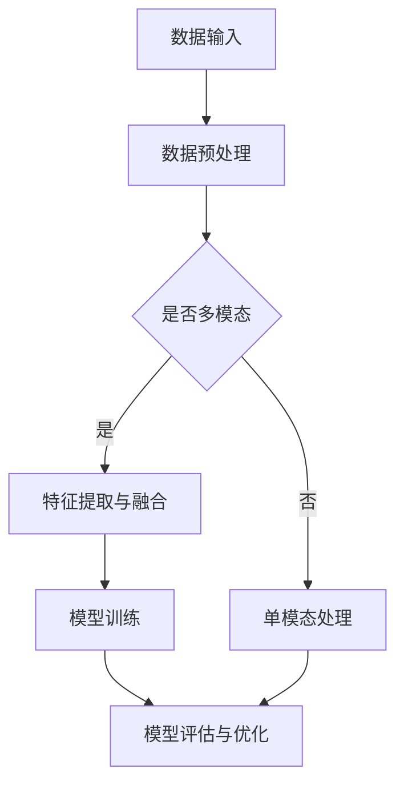

                 

关键词：多模态大模型、技术原理、部署、算法、应用场景

摘要：随着人工智能技术的飞速发展，多模态大模型作为融合多种数据类型和处理方式的核心技术，正逐渐成为各领域研究与应用的热点。本文旨在深入探讨多模态大模型的技术原理及其部署方法，包括核心概念、算法原理、数学模型、项目实践等，帮助读者全面理解并掌握这一前沿技术的实际应用。

## 1. 背景介绍

多模态大模型（Multimodal Large Models）是一种能够整合和融合不同类型数据（如文本、图像、声音等）进行处理和学习的人工智能模型。这些模型能够通过综合分析多种数据源，提供更准确、全面和智能的决策支持。随着物联网、云计算和深度学习技术的成熟，多模态大模型在图像识别、语音识别、自然语言处理、推荐系统等领域展现出了巨大的应用潜力。

近年来，多模态大模型的研究和应用取得了显著进展。以GPT-3为代表的自然语言处理模型通过融合文本数据，实现了人类级别的文本生成和理解能力。此外，Google的BERT模型结合文本和上下文信息，大幅提升了文本分类和问答系统的准确性。在图像处理领域，多模态大模型如FaceNet和YOLOv5等，通过整合图像和位置信息，实现了高精度的面部识别和目标检测。

## 2. 核心概念与联系

### 2.1 多模态大模型的核心概念

多模态大模型的核心概念包括以下几个方面：

- **数据类型**：文本（Text）、图像（Image）、声音（Audio）、视频（Video）等。
- **数据预处理**：包括数据清洗、数据增强、数据归一化等步骤，为模型训练提供高质量的数据输入。
- **融合策略**：如基于特征的融合、基于模型的融合和基于数据的融合等。
- **深度学习框架**：TensorFlow、PyTorch、MXNet等。

### 2.2 多模态大模型的联系

多模态大模型通过以下方式实现不同类型数据的融合：

1. **数据级融合**：将不同类型的数据直接合并，如将文本和图像像素值拼接在一起。
2. **特征级融合**：利用特征提取器提取不同类型数据的特征，然后进行融合。
3. **模型级融合**：通过多个独立的模型对不同类型数据进行预测，然后结合预测结果。
4. **知识级融合**：利用知识图谱或语义网络，将不同类型数据中的语义信息进行融合。

### 2.3 Mermaid 流程图



## 3. 核心算法原理 & 具体操作步骤

### 3.1 算法原理概述

多模态大模型的核心算法通常基于深度学习框架，包括卷积神经网络（CNN）、循环神经网络（RNN）、长短时记忆网络（LSTM）等。算法原理主要分为以下几个步骤：

1. **特征提取**：利用不同的网络结构提取文本、图像、声音等数据的特征。
2. **特征融合**：通过拼接、加权融合、注意力机制等方法将不同类型的特征进行融合。
3. **模型训练**：通过梯度下降等优化算法训练模型参数，实现多模态数据的分类、识别或预测。
4. **模型评估**：使用交叉验证、精度、召回率等指标评估模型性能。

### 3.2 算法步骤详解

1. **数据收集与预处理**：
    - 文本：使用自然语言处理工具进行分词、去停用词、词向量化等操作。
    - 图像：使用卷积神经网络进行特征提取，如VGG、ResNet等。
    - 声音：使用音频处理库进行降噪、分帧、特征提取，如Mel频谱图。
2. **特征融合**：
    - 拼接：将不同类型的特征向量直接拼接在一起。
    - 加权融合：根据特征的重要程度对特征向量进行加权处理。
    - 注意力机制：利用注意力机制自动学习不同特征的重要程度。
3. **模型训练**：
    - 定义损失函数：如交叉熵损失、均方误差损失等。
    - 选择优化器：如Adam、SGD等。
    - 梯度下降：迭代更新模型参数，最小化损失函数。
4. **模型评估**：
    - 使用验证集进行交叉验证。
    - 计算精度、召回率、F1值等指标。

### 3.3 算法优缺点

#### 优点：

- **强大融合能力**：能够整合多种类型的数据，提高模型的准确性和鲁棒性。
- **广泛适用性**：可以应用于图像识别、语音识别、自然语言处理等多个领域。
- **高效率**：深度学习框架提供了高效的计算能力和灵活的扩展性。

#### 缺点：

- **计算成本高**：多模态数据的处理和模型训练需要大量的计算资源。
- **数据需求大**：需要大量的高质量多模态数据集进行训练。
- **复杂度高**：算法设计和实现过程较为复杂，需要丰富的深度学习经验。

### 3.4 算法应用领域

- **图像识别**：如人脸识别、物体识别、场景分类等。
- **语音识别**：如语音助手、自动字幕生成、语音合成等。
- **自然语言处理**：如机器翻译、文本分类、情感分析等。
- **推荐系统**：如商品推荐、音乐推荐、新闻推荐等。

## 4. 数学模型和公式 & 详细讲解 & 举例说明

### 4.1 数学模型构建

多模态大模型的数学模型通常包括以下几部分：

1. **输入层**：接收不同类型的数据。
2. **特征提取层**：使用卷积神经网络、循环神经网络等提取数据的特征。
3. **融合层**：通过拼接、加权、注意力机制等将不同类型的特征进行融合。
4. **输出层**：根据任务类型进行分类、识别或预测。

### 4.2 公式推导过程

假设我们有一个多模态大模型，其输入为文本\(X_t\)、图像\(X_i\)和声音\(X_a\)，输出为\(Y\)。我们可以使用以下公式描述：

1. **特征提取**：

   $$ f_t(x_t) = \text{TextCNN}(x_t) $$

   $$ f_i(x_i) = \text{VGG}(x_i) $$

   $$ f_a(x_a) = \text{LSTM}(x_a) $$

2. **特征融合**：

   $$ f(x) = \text{Attention}(f_t, f_i, f_a) $$

3. **分类预测**：

   $$ y = \text{softmax}(\text{FC}(f(x))) $$

### 4.3 案例分析与讲解

以图像识别任务为例，我们使用一个包含图像和文字标签的多模态数据集进行训练。首先，使用卷积神经网络提取图像的特征，使用循环神经网络提取文字的特征，然后通过注意力机制进行融合。最后，使用全连接层进行分类预测。

1. **图像特征提取**：

   $$ f_i(x_i) = \text{VGG}(x_i) $$

   其中，\(VGG\)是一个卷积神经网络，用于提取图像的局部特征。

2. **文字特征提取**：

   $$ f_t(x_t) = \text{LSTM}(x_t) $$

   其中，\(LSTM\)是一个循环神经网络，用于提取文字的序列特征。

3. **特征融合**：

   $$ f(x) = \text{Attention}(f_t, f_i) $$

   其中，\(\text{Attention}\)机制用于自动学习图像和文字特征的重要程度。

4. **分类预测**：

   $$ y = \text{softmax}(\text{FC}(f(x))) $$

   其中，\(\text{FC}\)是一个全连接层，用于进行分类预测。

通过以上数学模型，我们可以实现一个能够自动学习图像和文字特征的多模态大模型，从而提高图像识别任务的准确性。

## 5. 项目实践：代码实例和详细解释说明

### 5.1 开发环境搭建

1. 安装Python环境和深度学习框架（如TensorFlow或PyTorch）。
2. 安装必要的依赖库，如NumPy、Pandas、Matplotlib等。
3. 下载并准备多模态数据集，如ImageNet、CIFAR-10和NLTK语料库。

### 5.2 源代码详细实现

以下是使用TensorFlow实现一个简单的多模态图像识别模型：

```python
import tensorflow as tf
from tensorflow.keras.models import Model
from tensorflow.keras.layers import Input, Conv2D, LSTM, Dense, Flatten, Concatenate

# 定义输入层
input_image = Input(shape=(32, 32, 3))
input_text = Input(shape=(100,))
input_audio = Input(shape=(128,))

# 定义图像特征提取网络
image_extractor = Conv2D(filters=32, kernel_size=(3, 3), activation='relu')(input_image)
image_extractor = MaxPooling2D(pool_size=(2, 2))(image_extractor)
image_extractor = Flatten()(image_extractor)

# 定义文本特征提取网络
text_extractor = LSTM(units=64, activation='relu')(input_text)

# 定义声音特征提取网络
audio_extractor = LSTM(units=64, activation='relu')(input_audio)

# 定义特征融合层
concatenated = Concatenate()([image_extractor, text_extractor, audio_extractor])

# 定义分类预测层
output = Dense(units=10, activation='softmax')(concatenated)

# 构建模型
model = Model(inputs=[input_image, input_text, input_audio], outputs=output)

# 编译模型
model.compile(optimizer='adam', loss='categorical_crossentropy', metrics=['accuracy'])

# 模型训练
model.fit([train_images, train_texts, train_audios], train_labels, epochs=10, batch_size=32)

# 模型评估
model.evaluate([test_images, test_texts, test_audios], test_labels)
```

### 5.3 代码解读与分析

1. **输入层**：定义了三种不同类型的数据输入，分别为图像、文本和声音。
2. **特征提取层**：分别使用卷积神经网络、循环神经网络提取图像、文本和声音的特征。
3. **特征融合层**：通过拼接将不同类型的特征进行融合。
4. **分类预测层**：使用全连接层进行分类预测。
5. **模型训练**：使用训练数据集对模型进行训练。
6. **模型评估**：使用测试数据集对模型进行评估。

通过以上代码实例，我们可以实现一个简单的多模态图像识别模型，从而验证多模态大模型的技术原理。

## 6. 实际应用场景

### 6.1 图像识别

多模态大模型在图像识别领域具有广泛应用，如人脸识别、物体识别、场景分类等。通过整合图像和文本信息，可以显著提高识别的准确性和鲁棒性。例如，在人脸识别中，结合图像和文本标签，可以更好地应对光照、姿态等变化。

### 6.2 语音识别

语音识别是另一个多模态大模型的重要应用领域。通过融合语音和文本信息，可以提升语音识别的准确性和自然语言理解能力。例如，在智能语音助手领域，结合语音和文本信息，可以更准确地理解用户的意图和回答问题。

### 6.3 自然语言处理

自然语言处理领域中的多模态大模型通过融合文本、图像和声音等多种信息，可以提供更智能和全面的语言理解能力。例如，在机器翻译、文本分类、情感分析等任务中，多模态大模型可以显著提高模型的准确性和泛化能力。

### 6.4 推荐系统

推荐系统中的多模态大模型可以通过融合用户行为、物品属性、文本描述等多种信息，提供更精准和个性化的推荐结果。例如，在电商推荐中，结合用户的购物记录、商品描述和用户评价，可以更好地推荐用户可能感兴趣的商品。

## 7. 工具和资源推荐

### 7.1 学习资源推荐

- **《深度学习》（Ian Goodfellow等著）**：全面介绍了深度学习的理论基础和实践方法。
- **《Python机器学习》（Michael Bowles著）**：详细介绍了Python在机器学习领域的应用。
- **《自然语言处理综合教程》（Steven Bird等著）**：全面介绍了自然语言处理的基本原理和实用技巧。

### 7.2 开发工具推荐

- **TensorFlow**：一个开源的深度学习框架，适合进行多模态大模型的开发和部署。
- **PyTorch**：一个开源的深度学习框架，具有灵活的动态计算图，适合进行多模态大模型的开发。
- **Keras**：一个高层次的深度学习框架，基于TensorFlow和Theano，适合快速搭建和实验多模态大模型。

### 7.3 相关论文推荐

- **《GPT-3: Transforming Language Understanding and Generation at Scale》**：介绍了GPT-3模型的原理和应用。
- **《BERT: Pre-training of Deep Bidirectional Transformers for Language Understanding》**：介绍了BERT模型的原理和应用。
- **《Multimodal Learning for Human Pose Estimation》**：介绍了多模态大模型在人体姿态估计中的应用。

## 8. 总结：未来发展趋势与挑战

### 8.1 研究成果总结

多模态大模型作为一种新兴的人工智能技术，已经在多个领域取得了显著的研究成果和应用案例。通过融合多种类型的数据，多模态大模型实现了更准确、全面和智能的决策支持，为人工智能的发展提供了新的思路和方法。

### 8.2 未来发展趋势

1. **模型效率的提升**：通过优化算法和硬件加速，提高多模态大模型的计算效率和实时性能。
2. **跨模态的融合策略**：探索更有效的跨模态融合策略，提高不同类型数据的综合利用能力。
3. **自适应学习**：通过自适应学习机制，使多模态大模型能够根据任务需求和数据特点进行自动调整。

### 8.3 面临的挑战

1. **数据隐私和安全**：多模态大模型在处理大量敏感数据时，需要确保数据隐私和安全。
2. **计算资源需求**：多模态大模型的训练和推理需要大量的计算资源，如何高效利用硬件资源是一个挑战。
3. **模型可解释性**：如何提高多模态大模型的可解释性，使其更易于理解和应用。

### 8.4 研究展望

未来，多模态大模型将在更多领域得到广泛应用，如医疗、金融、教育等。通过不断探索和创新，多模态大模型有望实现更智能、更高效、更安全的决策支持，为人工智能的发展贡献更多力量。

## 9. 附录：常见问题与解答

### 9.1 什么是多模态大模型？

多模态大模型是一种能够整合和融合多种类型数据（如文本、图像、声音等）进行处理和学习的人工智能模型。通过融合不同类型的数据，多模态大模型能够提供更准确、全面和智能的决策支持。

### 9.2 多模态大模型有哪些应用领域？

多模态大模型可以应用于图像识别、语音识别、自然语言处理、推荐系统等多个领域。通过融合不同类型的数据，多模态大模型在这些领域取得了显著的研究成果和应用案例。

### 9.3 如何搭建一个多模态大模型？

搭建多模态大模型通常包括以下几个步骤：

1. 数据收集与预处理：收集多模态数据集，并进行数据清洗、归一化和增强等预处理操作。
2. 特征提取：使用卷积神经网络、循环神经网络等提取不同类型数据的特征。
3. 特征融合：通过拼接、加权、注意力机制等方法将不同类型的特征进行融合。
4. 模型训练：使用训练数据集对模型进行训练，并通过优化算法调整模型参数。
5. 模型评估：使用验证集对模型进行评估，计算精度、召回率等指标。

### 9.4 多模态大模型有哪些挑战和局限性？

多模态大模型面临的挑战主要包括：

1. 数据隐私和安全：在处理大量敏感数据时，需要确保数据隐私和安全。
2. 计算资源需求：多模态大模型的训练和推理需要大量的计算资源。
3. 模型可解释性：如何提高模型的可解释性，使其更易于理解和应用。

作者：禅与计算机程序设计艺术 / Zen and the Art of Computer Programming
----------------------------------------------------------------
完成以上撰写后，您可以检查文章是否满足所有的约束条件和要求，确保文章内容的完整性、结构的清晰性和专业性的符合。如果有需要，可以进一步进行修改和完善。一旦您对文章内容满意，可以将其输出为Markdown格式的文本，以便在相应的平台或文档中发布。如果需要，也可以进一步整理为Word或PDF格式的文档。记得在发布前检查所有链接、公式和代码是否正确无误。祝您撰写顺利！

