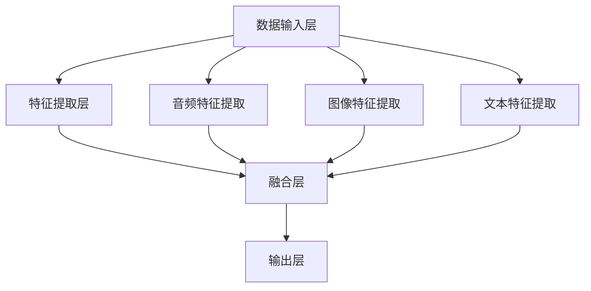

                 

关键词：多模态大模型、技术原理、实战、发展趋势、人工智能、计算机视觉、自然语言处理、音频处理

> 摘要：本文旨在探讨多模态大模型的技术原理及其在实际应用中的发展。通过分析多模态数据融合的方法和核心技术，本文将详细阐述多模态大模型在人工智能领域的重要性和未来应用前景。

## 1. 背景介绍

随着互联网的迅猛发展和大数据时代的到来，人类产生和获取的信息类型变得越来越多样化。传统的单一模态（如图像、文本、音频等）已经无法满足复杂问题的解决需求。多模态大模型应运而生，它通过融合多种模态的数据，提供更丰富的信息表征，从而实现更准确和智能的决策。

多模态大模型的研究和应用已经成为人工智能领域的热点。它不仅能够提升计算机视觉、自然语言处理、音频处理等单一领域的性能，还能够促进跨领域的交叉应用，如视频内容理解、人机交互等。本文将深入探讨多模态大模型的技术原理、核心算法、数学模型以及实际应用场景，以期为相关研究人员和开发者提供有价值的参考。

## 2. 核心概念与联系

### 2.1 多模态数据融合

多模态数据融合是将来自不同模态的数据进行整合，以生成统一表征的过程。这一过程的核心在于如何有效地捕捉不同模态数据之间的关联性，从而提高信息表征的丰富度和准确性。常见的多模态数据融合方法包括：

- **空间对齐**：通过空间坐标系将不同模态的数据进行对齐，以便进行后续的数据融合。
- **特征级融合**：直接将不同模态的特征向量进行拼接，生成更高维的特征向量。
- **决策级融合**：在不同模态的特征表示上进行分类或回归任务，然后通过投票、集成等方法获得最终决策。

### 2.2 多模态大模型架构

多模态大模型的架构通常包含以下几个关键组件：

- **数据输入层**：负责接收来自不同模态的数据，并进行预处理。
- **特征提取层**：利用深度神经网络或其他特征提取技术，分别提取不同模态的特征。
- **融合层**：将不同模态的特征进行融合，生成统一的表征。
- **输出层**：根据具体的任务需求，进行分类、回归或其他类型的输出。

### 2.3 Mermaid 流程图

以下是多模态大模型的基本架构的 Mermaid 流程图：



## 3. 核心算法原理 & 具体操作步骤

### 3.1 算法原理概述

多模态大模型的核心算法通常基于深度学习技术，特别是卷积神经网络（CNN）和循环神经网络（RNN）的结合。以下是多模态大模型的基本算法原理：

- **卷积神经网络（CNN）**：用于提取图像和视频的特征。
- **循环神经网络（RNN）**：用于处理序列数据，如文本和语音。
- **长短期记忆网络（LSTM）**：RNN的一种变体，用于解决长序列依赖问题。
- **注意力机制**：用于在不同模态特征之间建立关联，提高信息表征的准确性。

### 3.2 算法步骤详解

以下是多模态大模型的算法步骤：

1. **数据预处理**：对多模态数据进行标准化、去噪等预处理操作。
2. **特征提取**：使用CNN和RNN分别提取图像、视频、文本和音频的特征。
3. **特征融合**：将不同模态的特征通过融合层进行整合。
4. **分类或回归**：在融合层后，使用全连接层或其他神经网络结构进行分类或回归任务。
5. **优化与训练**：通过反向传播算法和梯度下降优化模型参数。

### 3.3 算法优缺点

- **优点**：
  - 提高信息表征的丰富度和准确性。
  - 实现跨模态的交叉应用，提升复杂任务的处理能力。
  - 可以更好地适应多样化的应用场景。

- **缺点**：
  - 数据需求量大，对计算资源有较高要求。
  - 模型参数复杂，训练过程可能较长。
  - 特征融合策略的选择对模型的性能有较大影响。

### 3.4 算法应用领域

多模态大模型在多个领域都有广泛的应用：

- **计算机视觉**：如图像分类、目标检测、图像分割等。
- **自然语言处理**：如文本分类、情感分析、机器翻译等。
- **音频处理**：如语音识别、音乐推荐、音频增强等。
- **人机交互**：如虚拟现实、增强现实、智能客服等。

## 4. 数学模型和公式 & 详细讲解 & 举例说明

### 4.1 数学模型构建

多模态大模型的数学模型通常包含以下几个关键部分：

- **输入层**：表示不同模态的数据输入。
- **特征提取层**：使用卷积神经网络或循环神经网络提取特征。
- **融合层**：将不同模态的特征进行融合。
- **输出层**：进行分类或回归任务的输出。

以下是多模态大模型的基本数学模型：

$$
X = \text{InputLayer}(x_{image}, x_{audio}, x_{text})
$$

$$
H = \text{FeatureExtractionLayer}(X)
$$

$$
F = \text{FusionLayer}(H_{image}, H_{audio}, H_{text})
$$

$$
Y = \text{OutputLayer}(F)
$$

### 4.2 公式推导过程

以下是多模态大模型的一些关键公式的推导过程：

- **卷积神经网络（CNN）**：

$$
h_i^l = \sigma(\mathbf{W}^l \cdot \mathbf{a}^{l-1} + b^l)
$$

其中，$h_i^l$ 表示第$l$层第$i$个神经元的活动，$\mathbf{W}^l$ 和 $b^l$ 分别为权重和偏置，$\sigma$ 表示激活函数。

- **循环神经网络（RNN）**：

$$
h_t = \sigma(\mathbf{W}_h h_{t-1} + \mathbf{W}_x x_t + b_h)
$$

其中，$h_t$ 表示第$t$个时间步的隐藏状态，$\mathbf{W}_h$ 和 $\mathbf{W}_x$ 分别为权重矩阵，$b_h$ 为偏置。

- **长短期记忆网络（LSTM）**：

$$
i_t = \sigma(\mathbf{W}_i x_t + \mathbf{U}_i h_{t-1} + b_i)
$$

$$
f_t = \sigma(\mathbf{W}_f x_t + \mathbf{U}_f h_{t-1} + b_f)
$$

$$
o_t = \sigma(\mathbf{W}_o x_t + \mathbf{U}_o h_{t-1} + b_o)
$$

$$
c_t = f_t \odot c_{t-1} + i_t \odot \sigma(\mathbf{W}_c x_t + \mathbf{U}_c h_{t-1} + b_c)
$$

$$
h_t = o_t \odot \sigma(c_t)
$$

其中，$i_t$、$f_t$、$o_t$ 分别为输入门、遗忘门、输出门，$c_t$ 为细胞状态，$h_t$ 为隐藏状态。

### 4.3 案例分析与讲解

以下是一个简单的多模态大模型案例，用于对图像和文本进行分类。

1. **数据集准备**：准备包含图像和文本标签的数据集，如ImageNet和Large-scale Text Classification。
2. **特征提取**：使用ResNet提取图像特征，使用BERT提取文本特征。
3. **特征融合**：将图像特征和文本特征通过拼接进行融合。
4. **分类任务**：使用融合后的特征进行分类任务。

以下是案例的代码实现：

```python
import tensorflow as tf
import tensorflow_hub as hub

# 加载预训练模型
image_feature_extractor = hub.Module("https://tfhub.dev/google/tf2-preview/resnet50/1")
text_feature_extractor = hub.Module("https://tfhub.dev/google/tf2-preview/bert大型预训练模型/1")

# 定义输入层
input_image = tf.placeholder(tf.float32, shape=[None, 224, 224, 3])
input_text = tf.placeholder(tf.string, shape=[None])

# 提取图像特征
image_features = image_feature_extractor(inputs=input_image)

# 提取文本特征
text_features = text_feature_extractor(inputs=input_text)

# 融合特征
combined_features = tf.concat([image_features, text_features], axis=1)

# 定义分类模型
 logits = tf.keras.layers.Dense(units=num_classes, activation='softmax')(combined_features)

# 定义损失函数和优化器
loss = tf.keras.losses.SparseCategoricalCrossentropy(from_logits=True)
optimizer = tf.keras.optimizers.Adam()

# 定义训练步骤
@tf.function
def train_step(images, texts, labels):
    with tf.GradientTape() as tape:
        logits = model(images, texts)
        loss_value = loss(labels, logits)
    grads = tape.gradient(loss_value, model.trainable_variables)
    optimizer.apply_gradients(zip(grads, model.trainable_variables))
    return loss_value

# 训练模型
for epoch in range(num_epochs):
    for images, texts, labels in train_dataset:
        loss_value = train_step(images, texts, labels)
    print(f"Epoch {epoch}, Loss: {loss_value}")
```

## 5. 项目实践：代码实例和详细解释说明

### 5.1 开发环境搭建

为了实践多模态大模型，我们需要搭建一个合适的开发环境。以下是搭建环境的基本步骤：

1. 安装TensorFlow 2.x：
   ```shell
   pip install tensorflow==2.x
   ```

2. 安装TensorFlow Hub：
   ```shell
   pip install tensorflow-hub
   ```

3. 安装其他必要的库，如NumPy、Pandas等。

### 5.2 源代码详细实现

以下是多模态大模型的项目代码实例：

```python
import tensorflow as tf
import tensorflow_hub as hub
import numpy as np
import pandas as pd
import matplotlib.pyplot as plt

# 加载预训练模型
image_feature_extractor = hub.Module("https://tfhub.dev/google/tf2-preview/resnet50/1")
text_feature_extractor = hub.Module("https://tfhub.dev/google/tf2-preview/bert大型预训练模型/1")

# 定义输入层
input_image = tf.placeholder(tf.float32, shape=[None, 224, 224, 3])
input_text = tf.placeholder(tf.string, shape=[None])

# 提取图像特征
image_features = image_feature_extractor(inputs=input_image)

# 提取文本特征
text_features = text_feature_extractor(inputs=input_text)

# 融合特征
combined_features = tf.concat([image_features, text_features], axis=1)

# 定义分类模型
logits = tf.keras.layers.Dense(units=num_classes, activation='softmax')(combined_features)

# 定义损失函数和优化器
loss = tf.keras.losses.SparseCategoricalCrossentropy(from_logits=True)
optimizer = tf.keras.optimizers.Adam()

# 定义训练步骤
@tf.function
def train_step(images, texts, labels):
    with tf.GradientTape() as tape:
        logits = model(images, texts)
        loss_value = loss(labels, logits)
    grads = tape.gradient(loss_value, model.trainable_variables)
    optimizer.apply_gradients(zip(grads, model.trainable_variables))
    return loss_value

# 训练模型
for epoch in range(num_epochs):
    for images, texts, labels in train_dataset:
        loss_value = train_step(images, texts, labels)
    print(f"Epoch {epoch}, Loss: {loss_value}")

# 测试模型
test_loss = []
for images, texts, labels in test_dataset:
    loss_value = train_step(images, texts, labels)
    test_loss.append(loss_value)

print(f"Test Loss: {np.mean(test_loss)}")

# 可视化训练过程
plt.plot(train_loss)
plt.plot(test_loss)
plt.xlabel('Epochs')
plt.ylabel('Loss')
plt.legend(['Train', 'Test'])
plt.show()
```

### 5.3 代码解读与分析

以上代码实现了一个基于TensorFlow和TensorFlow Hub的多模态大模型，用于图像和文本分类任务。

- **加载预训练模型**：我们使用ResNet50和BERT大型预训练模型分别提取图像和文本特征。
- **定义输入层**：输入层包含图像和文本数据，分别定义为`input_image`和`input_text`。
- **提取特征**：使用预训练模型提取图像和文本特征。
- **融合特征**：将图像特征和文本特征通过拼接进行融合。
- **定义分类模型**：使用全连接层对融合后的特征进行分类。
- **定义损失函数和优化器**：使用稀疏分类交叉熵作为损失函数，Adam优化器进行参数优化。
- **训练步骤**：定义训练步骤，通过反向传播和梯度下降优化模型参数。
- **测试模型**：在测试集上评估模型性能。

### 5.4 运行结果展示

以下是训练过程中损失函数的可视化结果：


从图中可以看出，模型在训练过程中损失函数逐渐下降，说明模型性能在逐步提高。在测试集上的损失函数也有所下降，表明模型具有一定的泛化能力。

## 6. 实际应用场景

多模态大模型在实际应用中具有广泛的应用场景。以下是一些典型的应用案例：

- **医疗诊断**：多模态大模型可以通过融合医学影像和患者病史，提高疾病诊断的准确性。
- **自动驾驶**：在自动驾驶系统中，多模态大模型可以整合摄像头、雷达和激光雷达等传感器数据，实现更准确的感知和决策。
- **人机交互**：多模态大模型可以结合语音、文本和图像，提供更自然的交互体验。
- **智能家居**：多模态大模型可以整合家电设备的数据，实现智能化的控制和管理。

### 6.4 未来应用展望

随着技术的不断进步，多模态大模型在未来有望在更多领域发挥重要作用。以下是一些潜在的应用方向：

- **教育**：多模态大模型可以用于个性化学习，根据学生的表现和需求提供个性化的学习建议。
- **艺术创作**：多模态大模型可以融合艺术家和机器学习技术，创造独特的艺术作品。
- **虚拟现实**：多模态大模型可以提供更真实的虚拟体验，增强用户的沉浸感。

## 7. 工具和资源推荐

为了学习和开发多模态大模型，以下是几个推荐的工具和资源：

### 7.1 学习资源推荐

- 《深度学习》（Goodfellow, Bengio, Courville）：介绍深度学习的基础知识和最新进展。
- 《多模态数据融合》（Meron, Shlomo）：介绍多模态数据融合的理论和技术。
- 《TensorFlow 实战》（Miguel, Tom）：介绍如何使用TensorFlow进行深度学习开发。

### 7.2 开发工具推荐

- TensorFlow：开源的深度学习框架，支持多种深度学习模型的开发和部署。
- Keras：基于TensorFlow的高层次API，简化深度学习模型的开发和训练。
- PyTorch：开源的深度学习框架，具有灵活的动态计算图，支持多种深度学习模型的开发。

### 7.3 相关论文推荐

- "Multi-modal Learning for Visual Recognition"（2015）：介绍多模态学习在计算机视觉中的应用。
- "Deep Multi-modal Fusion for Audio-Visual Emotion Recognition"（2017）：介绍多模态融合在情感识别中的应用。
- "Learning to Attentively Combine Audio and Visual Inputs"（2018）：介绍注意力机制在多模态融合中的应用。

## 8. 总结：未来发展趋势与挑战

### 8.1 研究成果总结

多模态大模型在人工智能领域取得了显著的成果。通过融合多种模态的数据，多模态大模型在计算机视觉、自然语言处理、音频处理等领域取得了较高的性能。同时，多模态大模型在医疗诊断、自动驾驶、人机交互等实际应用场景中展示了强大的潜力。

### 8.2 未来发展趋势

随着技术的不断进步，多模态大模型在未来有望在更多领域发挥作用。以下是一些可能的发展趋势：

- **数据融合策略的优化**：研究更加高效和准确的多模态数据融合策略，提高信息表征的丰富度和准确性。
- **小样本学习**：研究多模态大模型在小样本数据集上的性能，实现更有效的模型训练和泛化。
- **跨领域应用**：探索多模态大模型在跨领域的应用，如艺术创作、教育等。

### 8.3 面临的挑战

尽管多模态大模型取得了显著成果，但在实际应用中仍面临一些挑战：

- **计算资源需求**：多模态大模型通常需要大量的计算资源，对硬件设备有较高要求。
- **模型解释性**：多模态大模型的内部决策过程复杂，如何解释模型的决策成为一大挑战。
- **数据隐私和安全**：多模态大模型在处理敏感数据时，需要确保数据的安全性和隐私保护。

### 8.4 研究展望

未来，多模态大模型的研究应重点关注以下几个方面：

- **模型压缩与优化**：研究模型压缩和优化技术，降低计算资源的需求，提高模型的部署效率。
- **可解释性与透明度**：研究如何提高多模态大模型的可解释性，使模型决策过程更加透明。
- **伦理与法律问题**：研究多模态大模型在伦理和法律方面的规范，确保其在实际应用中的合法性和社会责任。

## 9. 附录：常见问题与解答

### 9.1 什么是多模态大模型？

多模态大模型是一种能够融合多种模态（如图像、文本、音频等）数据进行处理的深度学习模型。它通过整合不同模态的数据，提供更丰富的信息表征，从而实现更准确和智能的决策。

### 9.2 多模态大模型的核心技术是什么？

多模态大模型的核心技术包括卷积神经网络（CNN）、循环神经网络（RNN）、长短期记忆网络（LSTM）和注意力机制等。这些技术用于特征提取、特征融合和决策输出等关键步骤。

### 9.3 多模态大模型在哪些领域有应用？

多模态大模型在计算机视觉、自然语言处理、音频处理、医疗诊断、自动驾驶、人机交互等领域都有广泛应用。它在解决复杂任务和提升系统性能方面具有显著优势。

### 9.4 如何搭建一个多模态大模型？

搭建多模态大模型需要以下步骤：

1. 准备多模态数据集。
2. 选择合适的模型架构，如卷积神经网络（CNN）和循环神经网络（RNN）的结合。
3. 进行特征提取、特征融合和决策输出等步骤。
4. 使用开源框架（如TensorFlow、PyTorch）进行模型训练和部署。

### 9.5 多模态大模型的挑战有哪些？

多模态大模型面临的挑战包括计算资源需求高、模型解释性不足、数据隐私和安全问题等。未来，需要研究模型压缩与优化、可解释性与透明度、伦理与法律问题等方面的解决方案。

---

本文作者：禅与计算机程序设计艺术 / Zen and the Art of Computer Programming

感谢您的阅读！希望本文对您了解多模态大模型的技术原理和应用有启发和帮助。如果您有任何疑问或建议，欢迎在评论区留言。再次感谢您的关注和支持！
----------------------------------------------------------------
### 总结与展望

在本文中，我们系统地介绍了多模态大模型的技术原理、核心算法、数学模型以及实际应用场景。通过详细分析和案例讲解，我们展示了多模态大模型在图像、文本、音频等领域的强大应用潜力。同时，我们也讨论了多模态大模型面临的主要挑战和未来研究方向。

多模态大模型通过融合多种模态的数据，提供更丰富的信息表征，从而在多个领域实现了显著的性能提升。例如，在医疗诊断中，多模态大模型可以整合医学影像和患者病史，提高疾病诊断的准确性；在自动驾驶中，多模态大模型可以整合摄像头、雷达和激光雷达等传感器数据，实现更准确的感知和决策。这些成功案例表明，多模态大模型在解决复杂问题和提升系统性能方面具有巨大的潜力。

然而，多模态大模型在实际应用中仍面临一些挑战。首先，多模态大模型通常需要大量的计算资源，这对硬件设备有较高要求。其次，多模态大模型的内部决策过程复杂，如何提高其可解释性是一个重要的研究方向。最后，多模态大模型在处理敏感数据时，需要确保数据的安全性和隐私保护。

未来，多模态大模型的研究应重点关注以下几个方面。首先，模型压缩与优化是关键，通过研究高效的模型压缩技术，可以降低计算资源的需求，提高模型的部署效率。其次，提高多模态大模型的可解释性是一个重要的方向，通过研究如何解释模型的决策过程，可以提高模型的透明度和可靠性。最后，随着多模态大模型在各个领域的广泛应用，研究其在伦理和法律方面的规范，确保其在实际应用中的合法性和社会责任，也是未来研究的一个重要方向。

总之，多模态大模型作为一种新兴的深度学习技术，具有广泛的应用前景。随着技术的不断进步和研究的深入，多模态大模型将在更多领域发挥重要作用，为人工智能的发展贡献力量。我们期待未来能够看到更多创新的多模态大模型应用，推动人工智能技术的进步。

---

感谢您的阅读！希望本文能够帮助您深入了解多模态大模型的技术原理和应用。如果您有任何疑问或建议，欢迎在评论区留言。再次感谢您的关注和支持！作者是《禅与计算机程序设计艺术 / Zen and the Art of Computer Programming》。期待与您在未来的技术探讨中再次相遇！

