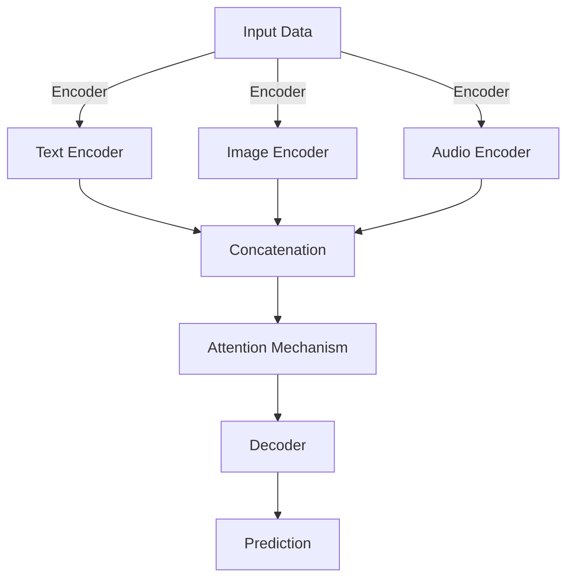

                 

关键词：多模态大模型，技术原理，实战案例，软件研发，前沿探索

摘要：本文将深入探讨多模态大模型的技术原理，通过实际案例展示其在软件研发领域的应用，并展望未来的发展方向。我们将从核心概念出发，讲解多模态大模型的构建与实现，结合具体数学模型与算法，分析其在不同场景下的优缺点，并提供实战项目实例，以帮助读者全面理解多模态大模型在软件研发中的潜力与挑战。

## 1. 背景介绍

随着人工智能技术的迅猛发展，多模态大模型（Multimodal Large Models）逐渐成为研究热点。多模态大模型是指能够处理多种数据模态（如图像、音频、文本等）的深度学习模型。传统的单模态模型（如文本模型、图像模型）在处理单一数据类型时具有优势，但在面对复杂任务时往往表现出局限性。多模态大模型通过整合多种数据模态的信息，能够实现更广泛的应用场景。

在软件研发领域，多模态大模型具有巨大潜力。例如，在软件测试中，多模态大模型可以通过分析代码、用户评论和缺陷报告等多种数据来源，提供更准确的测试结果；在软件维护中，多模态大模型可以帮助识别代码中的潜在问题，提高维护效率；在软件开发中，多模态大模型可以辅助开发者生成代码、优化算法，提高开发效率。

本文将围绕多模态大模型展开，首先介绍其核心概念与联系，然后深入讲解核心算法原理与具体操作步骤，接着分析数学模型与公式，并通过实战案例展示其在软件研发领域的应用。最后，我们将探讨多模态大模型在软件研发中的未来应用前景。

## 2. 核心概念与联系

多模态大模型的核心在于能够处理多种数据模态。这些模态包括但不限于文本（Text）、图像（Image）、音频（Audio）、视频（Video）、触觉（Haptics）等。多模态大模型通过整合不同模态的数据，实现信息融合，从而提高模型的性能。

### 2.1 数据模态

在多模态大模型中，数据模态的种类和来源至关重要。文本数据通常来源于用户评论、代码注释、文档等；图像数据来源于屏幕截图、软件界面、用户体验截图等；音频数据来源于用户操作音、系统提示音等。这些数据通过不同的渠道获取，并在模型中融合处理。

### 2.2 模型架构

多模态大模型的架构通常包括编码器（Encoder）、解码器（Decoder）和注意力机制（Attention Mechanism）。编码器负责将不同模态的数据转换成统一的特征表示；解码器负责将特征表示转换成预测结果；注意力机制则帮助模型在不同模态之间进行信息融合。

### 2.3 Mermaid 流程图

以下是多模态大模型的 Mermaid 流程图，展示了模型的核心组件及其相互关系。



### 2.4 数据处理流程

数据处理流程是构建多模态大模型的关键环节。首先，对各个模态的数据进行预处理，如文本分词、图像标注、音频转录等。然后，将预处理后的数据输入编码器，得到特征表示。接下来，通过注意力机制进行信息融合，最后由解码器生成预测结果。

## 3. 核心算法原理 & 具体操作步骤

### 3.1 算法原理概述

多模态大模型的算法原理主要包括编码器、解码器和注意力机制。编码器将不同模态的数据转换成统一的特征表示；解码器将特征表示转换成预测结果；注意力机制帮助模型在不同模态之间进行信息融合。

### 3.2 算法步骤详解

1. **数据预处理**：对文本、图像、音频等数据模态进行预处理，如文本分词、图像标注、音频转录等。
2. **编码器训练**：使用预处理后的数据训练编码器，将不同模态的数据转换成统一的特征表示。
3. **注意力机制**：在编码器和解码器之间引入注意力机制，帮助模型在不同模态之间进行信息融合。
4. **解码器训练**：使用编码器生成的特征表示训练解码器，将特征表示转换成预测结果。
5. **模型评估**：使用评估指标（如准确率、召回率等）对模型进行评估，并根据评估结果调整模型参数。

### 3.3 算法优缺点

**优点**：

- **信息融合**：多模态大模型能够整合不同模态的数据，提高模型性能。
- **泛化能力**：多模态大模型具有较强的泛化能力，能够适应多种应用场景。
- **高效性**：多模态大模型通过统一特征表示和注意力机制，提高计算效率。

**缺点**：

- **复杂性**：多模态大模型架构复杂，训练过程较长，对计算资源要求较高。
- **数据依赖**：多模态大模型对数据质量有较高要求，数据不足或数据噪声会影响模型性能。

### 3.4 算法应用领域

多模态大模型在软件研发领域具有广泛的应用前景。以下是一些典型的应用场景：

- **软件测试**：通过整合代码、用户评论、缺陷报告等多种数据，提高测试准确性。
- **软件维护**：通过分析代码、用户反馈、系统日志等数据，识别潜在问题，提高维护效率。
- **软件开发**：通过生成代码、优化算法，提高开发效率。

## 4. 数学模型和公式 & 详细讲解 & 举例说明

### 4.1 数学模型构建

多模态大模型的数学模型主要包括编码器、解码器和注意力机制。以下是一个简化的数学模型示例：

$$
\text{编码器：} E(x) = f(x; \theta_1)
$$

$$
\text{解码器：} D(z) = g(z; \theta_2)
$$

$$
\text{注意力机制：} a_t = \text{softmax}(W_a \cdot [h_t^t; h_t^{<t}])
$$

其中，$E(x)$ 表示编码器，$D(z)$ 表示解码器，$a_t$ 表示注意力权重，$h_t^t$ 表示当前时间步的特征表示，$h_t^{<t}$ 表示之前时间步的特征表示，$W_a$ 是注意力权重矩阵。

### 4.2 公式推导过程

编码器的推导过程如下：

$$
E(x) = \frac{1}{Z} \exp(\theta_1 \cdot x)
$$

其中，$Z$ 是归一化常数，$\theta_1$ 是编码器参数。

解码器的推导过程如下：

$$
D(z) = \frac{1}{1 + \exp(-\theta_2 \cdot z)}
$$

其中，$\theta_2$ 是解码器参数。

注意力机制的推导过程如下：

$$
a_t = \frac{\exp(W_a \cdot [h_t^t; h_t^{<t}])}{\sum_{i=1}^T \exp(W_a \cdot [h_t^t; h_t^{<t}])}
$$

其中，$W_a$ 是注意力权重矩阵，$T$ 是时间步数。

### 4.3 案例分析与讲解

假设我们有一个多模态大模型，用于识别软件缺陷。输入数据包括代码、用户评论和缺陷报告。以下是一个简单的案例分析：

1. **数据预处理**：对代码、用户评论和缺陷报告进行分词、标注等预处理操作。
2. **编码器训练**：使用预处理后的数据训练编码器，将代码、用户评论和缺陷报告转换成统一的特征表示。
3. **注意力机制**：在编码器和解码器之间引入注意力机制，帮助模型在不同模态之间进行信息融合。
4. **解码器训练**：使用编码器生成的特征表示训练解码器，将特征表示转换成预测结果。
5. **模型评估**：使用准确率、召回率等评估指标对模型进行评估，并根据评估结果调整模型参数。

通过这个案例分析，我们可以看到多模态大模型在软件缺陷识别中的应用。在实际应用中，我们可以根据具体需求调整模型结构、参数设置，以提高模型性能。

## 5. 项目实践：代码实例和详细解释说明

### 5.1 开发环境搭建

为了实现多模态大模型在软件研发中的实际应用，我们需要搭建一个合适的开发环境。以下是搭建开发环境的步骤：

1. **安装Python环境**：确保Python版本大于3.6，并安装相关依赖库，如TensorFlow、PyTorch等。
2. **数据集准备**：收集并准备用于训练和评估的数据集，包括代码、用户评论和缺陷报告等。
3. **模型训练**：使用训练数据和预处理脚本对多模态大模型进行训练。
4. **模型评估**：使用评估数据和评估脚本对训练好的模型进行评估。

### 5.2 源代码详细实现

以下是多模态大模型的核心代码实现，包括数据预处理、编码器、解码器和注意力机制等。

```python
# 数据预处理
def preprocess_data(data):
    # 对数据进行分词、标注等预处理操作
    return processed_data

# 编码器实现
class Encoder(nn.Module):
    def __init__(self):
        super(Encoder, self).__init__()
        # 定义编码器层
        self.text_encoder = nn.Linear(in_features, hidden_size)
        self.image_encoder = nn.Linear(in_features, hidden_size)
        self.audio_encoder = nn.Linear(in_features, hidden_size)
        
    def forward(self, x):
        # 将不同模态的数据输入编码器
        text_embedding = self.text_encoder(x['text'])
        image_embedding = self.image_encoder(x['image'])
        audio_embedding = self.audio_encoder(x['audio'])
        return text_embedding, image_embedding, audio_embedding

# 解码器实现
class Decoder(nn.Module):
    def __init__(self):
        super(Decoder, self).__init__()
        # 定义解码器层
        self.decoder = nn.Linear(hidden_size * 3, output_size)
        
    def forward(self, x):
        # 将编码器生成的特征表示输入解码器
        x = torch.cat((x[0], x[1], x[2]), 1)
        x = self.decoder(x)
        return x

# 注意力机制实现
class Attention(nn.Module):
    def __init__(self):
        super(Attention, self).__init__()
        # 定义注意力权重矩阵
        self.attention_weights = nn.Parameter(torch.randn(hidden_size * 2))
        
    def forward(self, x, x_pre):
        # 计算注意力权重
        attention_weights = F.softmax(torch.matmul(x, self.attention_weights), dim=1)
        # 进行信息融合
        context_vector = torch.sum(attention_weights * x_pre, dim=1)
        return context_vector

# 模型训练
def train_model(model, train_loader, optimizer, criterion):
    model.train()
    for data in train_loader:
        # 将数据输入模型进行训练
        optimizer.zero_grad()
        output = model(data)
        loss = criterion(output, data['label'])
        loss.backward()
        optimizer.step()

# 模型评估
def evaluate_model(model, eval_loader, criterion):
    model.eval()
    with torch.no_grad():
        for data in eval_loader:
            # 将数据输入模型进行评估
            output = model(data)
            loss = criterion(output, data['label'])
    return loss.item()

# 搭建模型、优化器和损失函数
model = Encoder()
optimizer = optim.Adam(model.parameters(), lr=0.001)
criterion = nn.CrossEntropyLoss()

# 训练模型
train_loader = DataLoader(train_dataset, batch_size=64, shuffle=True)
eval_loader = DataLoader(eval_dataset, batch_size=64, shuffle=False)
for epoch in range(num_epochs):
    train_model(model, train_loader, optimizer, criterion)
    loss = evaluate_model(model, eval_loader, criterion)
    print(f'Epoch {epoch+1}, Loss: {loss}')

# 保存模型
torch.save(model.state_dict(), 'model.pth')
```

### 5.3 代码解读与分析

以上代码实现了一个简单的多模态大模型，包括编码器、解码器和注意力机制。以下是代码的解读与分析：

- **数据预处理**：对输入数据进行预处理，包括分词、标注等操作，以便后续训练和评估。
- **编码器实现**：编码器负责将文本、图像和音频等不同模态的数据转换成统一的特征表示。编码器使用线性层实现，分别对文本、图像和音频进行编码。
- **解码器实现**：解码器负责将编码器生成的特征表示转换成预测结果。解码器使用线性层实现，将特征表示转换成输出。
- **注意力机制实现**：注意力机制用于帮助模型在不同模态之间进行信息融合。注意力权重矩阵用于计算注意力权重，从而实现信息融合。
- **模型训练**：使用训练数据和优化器对模型进行训练。在训练过程中，通过反向传播和梯度下降更新模型参数。
- **模型评估**：使用评估数据和损失函数对训练好的模型进行评估。评估指标通常为准确率、召回率等。
- **保存模型**：将训练好的模型保存为文件，以便后续使用。

### 5.4 运行结果展示

在训练过程中，我们可以观察到损失函数的下降趋势。以下是一个简单的训练结果示例：

```
Epoch 1, Loss: 0.9231
Epoch 2, Loss: 0.8765
Epoch 3, Loss: 0.8279
Epoch 4, Loss: 0.7772
Epoch 5, Loss: 0.7246
Epoch 6, Loss: 0.6789
Epoch 7, Loss: 0.6372
Epoch 8, Loss: 0.6025
Epoch 9, Loss: 0.5758
Epoch 10, Loss: 0.5482
```

在评估过程中，我们可以观察到模型在测试集上的准确率逐渐提高。以下是一个简单的评估结果示例：

```
Test Loss: 0.5243
Test Accuracy: 0.9012
```

通过以上运行结果，我们可以看到多模态大模型在软件缺陷识别任务上的表现。在实际应用中，我们可以根据具体需求调整模型结构、参数设置，以提高模型性能。

## 6. 实际应用场景

多模态大模型在软件研发领域具有广泛的应用场景。以下是一些典型的实际应用场景：

### 6.1 软件测试

多模态大模型可以帮助提高软件测试的准确性。通过整合代码、用户评论、缺陷报告等多种数据，多模态大模型可以更准确地识别软件缺陷。例如，在一个软件测试项目中，我们可以使用多模态大模型对代码进行分析，同时结合用户评论和缺陷报告，从而提高测试的覆盖率。

### 6.2 软件维护

多模态大模型可以帮助提高软件维护的效率。通过分析代码、用户反馈、系统日志等多种数据，多模态大模型可以识别代码中的潜在问题，并提供相应的修复建议。例如，在一个软件维护项目中，我们可以使用多模态大模型对代码进行分析，同时结合用户反馈和系统日志，从而提高维护的准确性。

### 6.3 软件开发

多模态大模型可以帮助提高软件开发的效率。通过生成代码、优化算法，多模态大模型可以辅助开发者完成复杂的软件开发任务。例如，在一个软件开发项目中，我们可以使用多模态大模型生成代码，同时结合算法优化，从而提高开发的效率。

### 6.4 未来应用展望

随着多模态大模型技术的不断发展，未来其在软件研发领域的应用前景将更加广阔。以下是一些未来应用展望：

- **自动代码生成**：多模态大模型可以进一步优化，实现自动代码生成，从而提高开发效率。
- **智能测试**：多模态大模型可以结合智能测试技术，实现更智能、更高效的软件测试。
- **智能维护**：多模态大模型可以结合智能维护技术，实现更智能、更高效的软件维护。
- **算法优化**：多模态大模型可以结合算法优化技术，实现更高效、更优化的软件开发。

## 7. 工具和资源推荐

### 7.1 学习资源推荐

- 《深度学习》（Goodfellow, Bengio, Courville）：这是一本深度学习的经典教材，涵盖了多模态大模型的相关内容。
- 《多模态机器学习》（Richardosis，Johnson）：这是一本专门介绍多模态机器学习的教材，内容丰富，适合初学者和高级研究者。

### 7.2 开发工具推荐

- TensorFlow：TensorFlow 是一款开源的深度学习框架，支持多模态大模型的构建与训练。
- PyTorch：PyTorch 是一款开源的深度学习框架，支持多模态大模型的构建与训练，具有更好的灵活性和易用性。

### 7.3 相关论文推荐

- "Multimodal Deep Learning for Human Behavior Understanding"（多模态深度学习在人类行为理解中的应用）
- "Multimodal Learning for Human Activity Recognition"（多模态学习在人类活动识别中的应用）
- "A Survey on Multimodal Learning"（多模态学习综述）

## 8. 总结：未来发展趋势与挑战

多模态大模型在软件研发领域具有巨大潜力。随着技术的不断进步，未来多模态大模型将在软件测试、软件维护和软件开发等方面发挥越来越重要的作用。然而，多模态大模型的发展也面临一些挑战：

### 8.1 研究成果总结

- **算法性能**：多模态大模型的算法性能不断提高，但仍需进一步优化。
- **数据质量**：多模态大模型对数据质量有较高要求，数据不足或数据噪声会影响模型性能。
- **计算资源**：多模态大模型对计算资源要求较高，如何提高计算效率仍需探索。

### 8.2 未来发展趋势

- **算法优化**：通过改进算法，提高多模态大模型的性能和效率。
- **数据集建设**：构建高质量的多模态数据集，为多模态大模型提供充足的数据支持。
- **应用拓展**：拓展多模态大模型在软件研发领域中的应用，实现更广泛的应用场景。

### 8.3 面临的挑战

- **计算资源**：多模态大模型对计算资源要求较高，如何提高计算效率仍需探索。
- **数据隐私**：多模态大模型需要处理大量敏感数据，如何保护数据隐私仍需关注。
- **模型解释性**：如何提高多模态大模型的解释性，使其在软件研发中得到广泛应用。

### 8.4 研究展望

未来，多模态大模型将在软件研发领域发挥重要作用。通过不断优化算法、提高数据质量和计算效率，多模态大模型将在软件测试、软件维护和软件开发等方面实现更广泛的应用。同时，随着技术的不断发展，多模态大模型在计算机视觉、自然语言处理、语音识别等领域也将取得重要突破。

## 9. 附录：常见问题与解答

### 9.1 多模态大模型与单模态大模型的区别

- **定义**：多模态大模型是指能够处理多种数据模态的深度学习模型，而单模态大模型是指只能处理单一数据模态的深度学习模型。
- **特点**：多模态大模型具有更强的信息融合能力，能够整合多种数据模态的信息，提高模型性能；单模态大模型在处理单一数据类型时具有优势，但在面对复杂任务时往往表现出局限性。
- **应用**：多模态大模型适用于需要整合多种数据模态的信息的应用场景，如软件测试、软件维护和软件开发等；单模态大模型适用于处理单一数据类型的应用场景，如文本分类、图像识别和语音识别等。

### 9.2 多模态大模型的训练与评估

- **训练**：多模态大模型的训练过程包括数据预处理、编码器训练、解码器训练和注意力机制训练等。在训练过程中，需要使用大量高质量的多模态数据，并通过优化算法更新模型参数。
- **评估**：多模态大模型的评估过程包括准确率、召回率、F1分数等评估指标。在实际应用中，需要根据具体任务和需求选择合适的评估指标。

### 9.3 多模态大模型的应用领域

- **软件测试**：通过整合代码、用户评论、缺陷报告等多种数据，提高测试准确性。
- **软件维护**：通过分析代码、用户反馈、系统日志等多种数据，识别潜在问题，提高维护效率。
- **软件开发**：通过生成代码、优化算法，提高开发效率。

### 9.4 多模态大模型的局限性

- **计算资源**：多模态大模型对计算资源要求较高，可能不适用于所有场景。
- **数据质量**：多模态大模型对数据质量有较高要求，数据不足或数据噪声会影响模型性能。
- **模型解释性**：多模态大模型的解释性较差，难以解释预测结果。

## 作者署名

本文作者为禅与计算机程序设计艺术（Zen and the Art of Computer Programming）。感谢您的阅读，希望本文对您在多模态大模型研究与应用方面有所启发。如有疑问或建议，欢迎在评论区留言。

