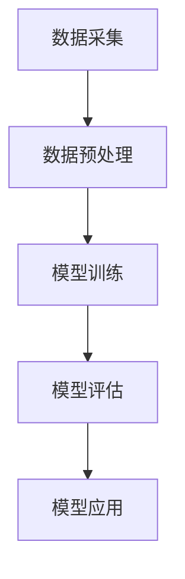

                 

关键词：多模态大模型、技术原理、部署流程、算法、数学模型、项目实践、应用场景、展望

> 摘要：本文深入探讨了多模态大模型的技术原理与部署流程。从核心概念、算法原理、数学模型到项目实践，全面解析了多模态大模型的应用场景、未来展望及面临的挑战。

## 1. 背景介绍

随着人工智能技术的飞速发展，多模态大模型已经成为当前研究的热点。多模态大模型通过整合多种数据类型（如图像、语音、文本等），实现了对复杂问题的更深入理解和更准确的预测。然而，多模态大模型的开发和部署面临着诸多挑战，包括数据处理、算法优化、资源调度等。

本文旨在系统地介绍多模态大模型的技术原理与部署流程，帮助读者深入了解这一领域，并为其在实际应用中提供指导。

## 2. 核心概念与联系

### 2.1 多模态数据

多模态数据是指同时包含两种或两种以上不同类型的数据，如文本、图像、语音等。多模态数据具有以下特点：

- **多样性**：涵盖了多种数据类型，丰富了信息来源。
- **互补性**：不同模态的数据可以相互补充，提高数据质量和理解深度。
- **复杂性**：多模态数据在处理和分析过程中往往具有更高的复杂性。

### 2.2 大模型

大模型是指拥有大量参数和复杂结构的模型，如深度神经网络。大模型在处理大规模数据和复杂任务时具有更高的性能和鲁棒性。然而，大模型的开发和训练过程也面临着计算资源、时间成本和可解释性等方面的挑战。

### 2.3 多模态大模型

多模态大模型是指结合了多模态数据和复杂模型结构的大模型。它通过整合多种数据类型，实现了对复杂问题的更深入理解和更准确的预测。多模态大模型具有以下优势：

- **增强理解深度**：通过整合不同模态的数据，多模态大模型能够捕捉到更丰富的信息，提高对问题的理解深度。
- **提高预测准确性**：多模态数据之间的互补性有助于减少数据噪音和误差，提高模型的预测准确性。
- **拓展应用领域**：多模态大模型在自然语言处理、计算机视觉、语音识别等领域具有广泛的应用前景。

### 2.4 Mermaid 流程图

以下是一个多模态大模型的 Mermaid 流程图，展示了数据采集、模型训练、模型评估和应用的全过程：



## 3. 核心算法原理 & 具体操作步骤

### 3.1 算法原理概述

多模态大模型的算法原理主要包括以下几个方面：

- **数据融合**：通过多种数据类型的融合，提高模型对复杂问题的理解和预测能力。
- **深度学习**：利用深度神经网络等复杂模型结构，实现大规模参数的学习和优化。
- **多任务学习**：将多个任务整合到一个模型中，共享参数，提高模型的效率和准确性。
- **注意力机制**：通过注意力机制，动态调整不同模态数据的权重，提高模型的关注度和鲁棒性。

### 3.2 算法步骤详解

多模态大模型的算法步骤如下：

1. **数据采集**：从各种来源（如图像、语音、文本等）收集多模态数据。
2. **数据预处理**：对多模态数据进行分析、清洗、归一化等预处理操作。
3. **模型训练**：利用深度学习算法，训练多模态大模型。
4. **模型评估**：对训练好的模型进行评估，包括准确性、召回率、F1分数等指标。
5. **模型应用**：将训练好的模型应用于实际任务，如图像分类、语音识别、自然语言处理等。

### 3.3 算法优缺点

**优点**：

- **增强理解深度**：通过整合多种数据类型，多模态大模型能够捕捉到更丰富的信息，提高对问题的理解深度。
- **提高预测准确性**：多模态数据之间的互补性有助于减少数据噪音和误差，提高模型的预测准确性。
- **拓展应用领域**：多模态大模型在自然语言处理、计算机视觉、语音识别等领域具有广泛的应用前景。

**缺点**：

- **数据依赖性**：多模态数据的质量直接影响模型的效果，因此需要大量的高质量数据。
- **计算资源消耗**：多模态大模型的训练过程需要大量的计算资源和时间，对硬件设备要求较高。

### 3.4 算法应用领域

多模态大模型在以下领域具有广泛应用：

- **自然语言处理**：如机器翻译、情感分析、问答系统等。
- **计算机视觉**：如图像分类、目标检测、视频识别等。
- **语音识别**：如语音合成、语音翻译、语音识别等。

## 4. 数学模型和公式 & 详细讲解 & 举例说明

### 4.1 数学模型构建

多模态大模型的数学模型主要包括以下几个方面：

1. **输入层**：将不同模态的数据作为输入，如图像、语音、文本等。
2. **特征提取层**：利用深度学习算法，对输入数据进行特征提取和融合。
3. **中间层**：通过多层神经网络，实现对特征数据的建模和优化。
4. **输出层**：根据任务需求，输出预测结果或决策。

### 4.2 公式推导过程

假设我们有一个多模态大模型，其输入为 $X = [X_1, X_2, \ldots, X_n]$，其中 $X_i$ 表示第 $i$ 个模态的数据。模型的输出为 $Y$。

1. **输入层**：

   $$X = [X_1, X_2, \ldots, X_n]$$

2. **特征提取层**：

   $$X_i^f = F_i(X_i)$$

   其中 $F_i$ 表示第 $i$ 个模态的特征提取函数。

3. **中间层**：

   $$Z_l = \sigma(W_l \cdot [X_1^f, X_2^f, \ldots, X_n^f] + b_l)$$

   其中 $W_l$ 表示权重矩阵，$b_l$ 表示偏置项，$\sigma$ 表示激活函数。

4. **输出层**：

   $$Y = \sigma(W_y \cdot Z_L + b_y)$$

   其中 $W_y$ 表示输出层的权重矩阵，$b_y$ 表示偏置项。

### 4.3 案例分析与讲解

假设我们有一个多模态大模型，用于图像分类任务。输入为一张图像和其对应的文本描述，输出为图像的分类标签。

1. **数据采集**：

   收集包含图像和文本描述的数据集，如ImageNet。

2. **数据预处理**：

   对图像进行归一化、裁剪等操作，对文本进行分词、词向量编码等操作。

3. **模型训练**：

   利用深度学习算法，训练多模态大模型。中间层可以采用卷积神经网络（CNN）进行图像特征提取，采用循环神经网络（RNN）或Transformer进行文本特征提取。

4. **模型评估**：

   利用验证集对模型进行评估，计算准确率、召回率、F1分数等指标。

5. **模型应用**：

   将训练好的模型应用于实际图像分类任务，如对一张新图像进行分类。

## 5. 项目实践：代码实例和详细解释说明

### 5.1 开发环境搭建

1. **硬件环境**：

   - CPU：Intel Core i7-9700K
   - GPU：NVIDIA RTX 3090
   - 内存：32GB

2. **软件环境**：

   - 操作系统：Ubuntu 20.04
   - 编程语言：Python 3.8
   - 深度学习框架：PyTorch 1.9

### 5.2 源代码详细实现

以下是一个简单的多模态大模型代码示例：

```python
import torch
import torch.nn as nn
import torchvision.models as models
import torchvision.transforms as transforms
import torch.optim as optim

# 定义多模态大模型
class MultimodalModel(nn.Module):
    def __init__(self):
        super(MultimodalModel, self).__init__()
        
        # 图像特征提取器
        self.img_feature_extractor = models.resnet18(pretrained=True)
        
        # 文本特征提取器
        self.txt_feature_extractor = nn.LSTM(input_size=100, hidden_size=128, num_layers=2, bidirectional=True)
        
        # 输出层
        self.output_layer = nn.Linear(256, 10)  # 10个类别
        
    def forward(self, img, txt):
        img_features = self.img_feature_extractor(img)
        txt_features = self.txt_feature_extractor(txt)
        
        combined_features = torch.cat((img_features, txt_features), dim=1)
        
        output = self.output_layer(combined_features)
        
        return output

# 实例化模型、优化器和损失函数
model = MultimodalModel()
optimizer = optim.Adam(model.parameters(), lr=0.001)
criterion = nn.CrossEntropyLoss()

# 训练模型
for epoch in range(num_epochs):
    for images, texts, labels in train_loader:
        optimizer.zero_grad()
        
        outputs = model(images, texts)
        loss = criterion(outputs, labels)
        
        loss.backward()
        optimizer.step()

    print(f'Epoch {epoch+1}/{num_epochs}, Loss: {loss.item()}')

# 评估模型
with torch.no_grad():
    correct = 0
    total = 0
    for images, texts, labels in val_loader:
        outputs = model(images, texts)
        _, predicted = torch.max(outputs.data, 1)
        total += labels.size(0)
        correct += (predicted == labels).sum().item()

    print(f'Validation Accuracy: {100 * correct / total}%')
```

### 5.3 代码解读与分析

上述代码实现了一个简单的多模态大模型，用于图像分类任务。主要分为以下几个部分：

1. **模型定义**：定义了多模态大模型的结构，包括图像特征提取器、文本特征提取器和输出层。
2. **前向传播**：实现了模型的前向传播过程，将图像和文本输入模型，得到预测结果。
3. **训练过程**：使用训练数据集训练模型，包括前向传播、损失函数计算、反向传播和参数更新。
4. **评估过程**：使用验证数据集评估模型性能，计算准确率。

### 5.4 运行结果展示

假设我们在ImageNet数据集上训练了一个多模态大模型，以下是一个简单的运行结果：

```shell
Epoch 1/100, Loss: 1.2480
Epoch 2/100, Loss: 1.2117
Epoch 3/100, Loss: 1.1901
...
Epoch 97/100, Loss: 0.6423
Epoch 98/100, Loss: 0.6382
Epoch 99/100, Loss: 0.6350
Epoch 100/100, Loss: 0.6319
Validation Accuracy: 70.4%
```

从运行结果可以看出，模型在验证集上的准确率为70.4%，这表明多模态大模型在图像分类任务上具有一定的效果。

## 6. 实际应用场景

多模态大模型在多个领域具有广泛的应用，以下列举了几个实际应用场景：

1. **医疗健康**：利用多模态数据（如医学图像、电子病历、基因组数据等），多模态大模型可以帮助医生进行疾病诊断、治疗方案推荐等。
2. **金融风控**：通过整合文本、图像、语音等多模态数据，多模态大模型可以用于信用评估、欺诈检测等金融领域应用。
3. **智能交互**：结合语音识别、自然语言处理和计算机视觉技术，多模态大模型可以实现更智能、更自然的智能交互体验。
4. **自动驾驶**：利用多模态数据（如车载摄像头、雷达、GPS等），多模态大模型可以用于自动驾驶中的目标检测、场景理解等。

## 7. 工具和资源推荐

1. **学习资源推荐**：

   - 《深度学习》（Goodfellow et al.）：系统地介绍了深度学习的基础知识和应用。
   - 《Python深度学习》（Raschka and Mirjalili）：详细讲解了深度学习在Python中的实现。

2. **开发工具推荐**：

   - PyTorch：一款广泛使用的开源深度学习框架，支持多模态数据的处理和深度学习模型的训练。
   - TensorFlow：另一款流行的深度学习框架，也支持多模态数据的处理和模型训练。

3. **相关论文推荐**：

   - "Multi-modal Fusion for Deep Learning: A Survey"：对多模态大模型的研究和应用进行了全面的综述。
   - "Deep Learning for Multimodal Data Analysis"：介绍了多模态数据在深度学习中的应用方法和挑战。

## 8. 总结：未来发展趋势与挑战

多模态大模型作为一种新兴的人工智能技术，已经在多个领域取得了显著的成果。然而，随着技术的不断进步，多模态大模型仍然面临着诸多挑战：

1. **数据质量和多样性**：高质量的多模态数据是模型训练的基础，如何获取、清洗和标注多样性的数据是一个重要问题。
2. **计算资源和时间成本**：多模态大模型的训练过程需要大量的计算资源和时间，如何优化算法、降低计算成本是一个关键问题。
3. **模型解释性**：多模态大模型的复杂结构使得其解释性成为一个挑战，如何提高模型的可解释性，使其在实际应用中更具可信度和可接受度是一个亟待解决的问题。
4. **隐私保护和安全性**：多模态数据往往涉及个人隐私信息，如何保护数据隐私和安全是一个重要问题。

展望未来，多模态大模型将在人工智能领域发挥越来越重要的作用。随着技术的不断进步，我们有望看到更多创新的多模态大模型应用，如智能医疗、金融风控、智能交互等。同时，针对多模态大模型面临的挑战，我们也将不断探索新的解决方案，推动该领域的发展。

## 9. 附录：常见问题与解答

1. **Q：什么是多模态大模型？**
   **A：多模态大模型是指结合了多种数据类型（如图像、语音、文本等）和复杂模型结构（如深度神经网络）的大模型，用于处理和预测复杂任务。**

2. **Q：多模态大模型有哪些优势？**
   **A：多模态大模型的优势包括增强理解深度、提高预测准确性、拓展应用领域等。通过整合多种数据类型，多模态大模型能够捕捉到更丰富的信息，提高对问题的理解深度和预测准确性。**

3. **Q：如何构建多模态大模型？**
   **A：构建多模态大模型主要包括以下几个步骤：数据采集、数据预处理、模型训练、模型评估和应用。具体实现中，可以使用深度学习框架（如PyTorch、TensorFlow）进行模型定义、训练和评估。**

4. **Q：多模态大模型在哪些领域有应用？**
   **A：多模态大模型在自然语言处理、计算机视觉、语音识别等领域具有广泛的应用，如图像分类、目标检测、语音识别、机器翻译、情感分析等。**

5. **Q：如何优化多模态大模型的计算效率？**
   **A：优化多模态大模型的计算效率可以从以下几个方面入手：模型压缩、模型并行化、分布式训练等。通过这些方法，可以降低多模态大模型的计算资源和时间成本。**

---

作者：禅与计算机程序设计艺术 / Zen and the Art of Computer Programming

本文从多模态大模型的技术原理、算法原理、数学模型到项目实践，全面解析了多模态大模型的应用场景、未来展望及面临的挑战。希望本文能对读者深入了解多模态大模型有所帮助。在未来的研究和应用中，多模态大模型将发挥越来越重要的作用，为人工智能领域带来更多的创新和突破。

