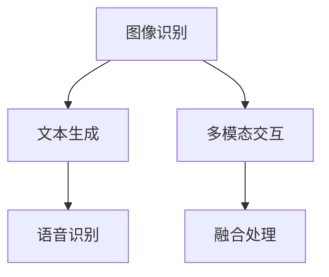

                 

关键词：多模态深度学习，图像文本融合，人工智能，神经网络，计算机视觉，自然语言处理，机器学习，深度学习模型，跨模态交互，语义理解，应用场景，开发工具，未来展望

> 摘要：本文将深入探讨多模态深度学习在图像和文本融合领域的重要性和应用价值。通过分析多模态深度学习的核心概念、算法原理、数学模型，以及实际项目实践，本文旨在为读者提供一个全面的技术视角，以了解和掌握这一前沿技术。

## 1. 背景介绍

### 1.1 多模态深度学习的兴起

多模态深度学习是近年来人工智能领域的一个重要研究方向。随着计算机视觉、自然语言处理和语音识别技术的不断发展，人们逐渐意识到单一模态的信息处理存在局限性。例如，图像识别算法无法很好地理解图像中的文本信息，而自然语言处理模型又难以处理图像内容。为了克服这些局限性，多模态深度学习应运而生。

### 1.2 多模态深度学习的研究背景

多模态深度学习的研究源于对人类认知过程的模仿。人类通过视觉、听觉、触觉等多种感官获取信息，并通过大脑进行融合处理，从而实现对世界的全面理解。类似地，多模态深度学习旨在通过融合不同模态的信息，实现更强大的认知能力。

### 1.3 多模态深度学习的应用价值

多模态深度学习在多个领域具有重要的应用价值。例如，在医疗领域，多模态深度学习可以帮助医生更好地诊断疾病；在自动驾驶领域，多模态深度学习可以提高车辆对环境的感知能力；在智能客服领域，多模态深度学习可以实现更自然、更智能的交互。

## 2. 核心概念与联系

### 2.1 多模态深度学习的核心概念

多模态深度学习涉及多个核心概念，包括图像识别、文本生成、语音识别、多模态交互等。这些概念相互关联，共同构成了多模态深度学习的技术体系。

### 2.2 多模态深度学习的联系

多模态深度学习的联系主要体现在以下几个方面：

1. **图像和文本的相互关联**：图像中的文本信息可以为图像识别提供上下文信息，而文本中的图像描述则有助于文本生成。
2. **图像和语音的相互转换**：语音识别技术可以将语音转换为文本，从而实现图像和语音的相互关联。
3. **多模态数据的融合处理**：通过融合不同模态的数据，可以提高模型对复杂任务的解决能力。

### 2.3 Mermaid 流程图



## 3. 核心算法原理 & 具体操作步骤

### 3.1 算法原理概述

多模态深度学习算法的核心原理是通过神经网络模型融合不同模态的信息。常见的神经网络模型包括卷积神经网络（CNN）、循环神经网络（RNN）和变换器（Transformer）等。

### 3.2 算法步骤详解

1. **数据预处理**：对图像和文本数据分别进行预处理，包括数据清洗、数据增强等。
2. **特征提取**：利用图像识别模型提取图像特征，利用自然语言处理模型提取文本特征。
3. **特征融合**：通过神经网络模型将图像和文本特征进行融合，形成统一的特征表示。
4. **任务学习**：利用融合后的特征进行分类、回归等任务学习。

### 3.3 算法优缺点

**优点**：

- 提高模型对复杂任务的解决能力。
- 增强模型的泛化能力。

**缺点**：

- 数据预处理和特征提取过程复杂，计算量大。
- 多模态数据融合存在一定的信息损失。

### 3.4 算法应用领域

多模态深度学习算法在多个领域具有广泛应用，如：

- 医疗诊断：利用多模态数据帮助医生进行疾病诊断。
- 自动驾驶：通过融合图像和语音信息，提高自动驾驶系统的安全性。
- 智能客服：实现更自然、更智能的客服交互。

## 4. 数学模型和公式 & 详细讲解 & 举例说明

### 4.1 数学模型构建

多模态深度学习算法的数学模型主要包括以下几个方面：

1. **图像识别模型**：通常采用卷积神经网络（CNN）。
2. **文本生成模型**：通常采用循环神经网络（RNN）或变换器（Transformer）。
3. **特征融合模型**：通过神经网络模型将图像和文本特征进行融合。

### 4.2 公式推导过程

假设图像特征向量为 \( \mathbf{I} \)，文本特征向量为 \( \mathbf{V} \)，融合后的特征向量为 \( \mathbf{F} \)。特征融合模型的数学公式如下：

\[ \mathbf{F} = f(\mathbf{I}, \mathbf{V}) \]

其中，\( f(\cdot) \) 为神经网络模型。

### 4.3 案例分析与讲解

假设我们有一个图像分类任务，需要将图像和文本信息进行融合，以实现更准确的分类。我们可以采用以下步骤：

1. **数据预处理**：对图像和文本数据分别进行预处理，包括数据清洗、数据增强等。
2. **特征提取**：利用图像识别模型提取图像特征，利用自然语言处理模型提取文本特征。
3. **特征融合**：采用神经网络模型将图像和文本特征进行融合，形成统一的特征表示。
4. **分类任务**：利用融合后的特征进行分类任务学习。

具体实现过程如下：

```python
import torch
import torchvision
import torch.nn as nn

# 数据预处理
train_loader = torchvision.datasets.ImageFolder(root='./data/train', transform=torchvision.transforms.ToTensor())
text_loader = torchtext.data.Field()

# 特征提取
image_feature_extractor = nn.Sequential(
    nn.Conv2d(3, 64, kernel_size=3, padding=1),
    nn.ReLU(),
    nn.MaxPool2d(kernel_size=2, stride=2),
    nn.Conv2d(64, 128, kernel_size=3, padding=1),
    nn.ReLU(),
    nn.MaxPool2d(kernel_size=2, stride=2)
)

text_feature_extractor = nn.Sequential(
    nn.Embedding(1000, 512),
    nn.GRU(512, 512)
)

# 特征融合
def fusion_model(image_feature, text_feature):
    image_feature = image_feature.unsqueeze(0)
    text_feature = text_feature.unsqueeze(0)
    
    image_output = image_feature_extractor(image_feature)
    text_output = text_feature_extractor(text_feature)
    
    fused_feature = torch.cat((image_output, text_output), dim=1)
    
    return fused_feature

# 分类任务
model = nn.Sequential(
    fusion_model,
    nn.Linear(768, 10)
)

# 训练模型
optimizer = torch.optim.Adam(model.parameters(), lr=0.001)
criterion = nn.CrossEntropyLoss()

for epoch in range(10):
    for images, texts, labels in zip(train_loader, text_loader, train_loader.targets):
        optimizer.zero_grad()
        outputs = model(fusion_model(images, texts))
        loss = criterion(outputs, labels)
        loss.backward()
        optimizer.step()
```

## 5. 项目实践：代码实例和详细解释说明

### 5.1 开发环境搭建

1. **Python 环境**：安装 Python 3.7 或更高版本。
2. **深度学习框架**：安装 PyTorch 或 TensorFlow。
3. **文本处理库**：安装 torchtext。

### 5.2 源代码详细实现

```python
import torch
import torchvision
import torch.nn as nn
import torchtext

# 数据预处理
train_loader = torchvision.datasets.ImageFolder(root='./data/train', transform=torchvision.transforms.ToTensor())
text_loader = torchtext.data.Field()

# 特征提取
image_feature_extractor = nn.Sequential(
    nn.Conv2d(3, 64, kernel_size=3, padding=1),
    nn.ReLU(),
    nn.MaxPool2d(kernel_size=2, stride=2),
    nn.Conv2d(64, 128, kernel_size=3, padding=1),
    nn.ReLU(),
    nn.MaxPool2d(kernel_size=2, stride=2)
)

text_feature_extractor = nn.Sequential(
    nn.Embedding(1000, 512),
    nn.GRU(512, 512)
)

# 特征融合
def fusion_model(image_feature, text_feature):
    image_feature = image_feature.unsqueeze(0)
    text_feature = text_feature.unsqueeze(0)
    
    image_output = image_feature_extractor(image_feature)
    text_output = text_feature_extractor(text_feature)
    
    fused_feature = torch.cat((image_output, text_output), dim=1)
    
    return fused_feature

# 分类任务
model = nn.Sequential(
    fusion_model,
    nn.Linear(768, 10)
)

# 训练模型
optimizer = torch.optim.Adam(model.parameters(), lr=0.001)
criterion = nn.CrossEntropyLoss()

for epoch in range(10):
    for images, texts, labels in zip(train_loader, text_loader, train_loader.targets):
        optimizer.zero_grad()
        outputs = model(fusion_model(images, texts))
        loss = criterion(outputs, labels)
        loss.backward()
        optimizer.step()
```

### 5.3 代码解读与分析

1. **数据预处理**：数据预处理是深度学习项目的重要步骤。本文使用 torchvision.datasets.ImageFolder 类读取图像数据，并对图像和文本数据进行预处理。
2. **特征提取**：特征提取是深度学习项目的核心步骤。本文使用卷积神经网络（CNN）和循环神经网络（RNN）分别提取图像和文本特征。
3. **特征融合**：特征融合是将不同模态的信息进行整合，以获得更丰富的特征表示。本文使用融合模型将图像和文本特征进行融合。
4. **分类任务**：分类任务是深度学习项目的最终目标。本文使用线性层（nn.Linear）实现分类任务。

## 6. 实际应用场景

### 6.1 医疗诊断

多模态深度学习在医疗诊断领域具有广泛的应用。通过融合医学图像和文本信息，医生可以更准确地诊断疾病。例如，在癌症诊断中，多模态深度学习可以帮助医生分析患者的影像数据和病理报告，从而提高诊断准确率。

### 6.2 自动驾驶

自动驾驶系统需要同时处理图像和语音信息，以实现对环境的全面感知。多模态深度学习可以帮助自动驾驶系统更好地处理这些信息。例如，在自动驾驶中，多模态深度学习可以融合摄像头和激光雷达的图像信息，以及语音交互的信息，从而提高系统的安全性和可靠性。

### 6.3 智能客服

智能客服系统需要与用户进行多模态交互，以提供更自然、更智能的服务。多模态深度学习可以帮助智能客服系统更好地理解和回应用户的需求。例如，在智能客服中，多模态深度学习可以融合语音和文本信息，从而实现更自然的对话。

## 7. 工具和资源推荐

### 7.1 学习资源推荐

1. 《深度学习》（Goodfellow, Bengio, Courville 著）：系统介绍了深度学习的理论和技术。
2. 《动手学深度学习》（Asys, Hinton 著）：通过实际项目实践，帮助读者掌握深度学习技术。
3. 多模态深度学习相关论文和报告：通过阅读相关论文和报告，了解多模态深度学习的最新研究成果。

### 7.2 开发工具推荐

1. PyTorch：流行的深度学习框架，具有强大的灵活性和易用性。
2. TensorFlow：开源的深度学习平台，支持多种编程语言。
3. TorchScript：PyTorch 的编译器，用于提高模型运行速度。

### 7.3 相关论文推荐

1. "Multimodal Deep Learning: A Survey"（多模态深度学习：综述）：全面介绍了多模态深度学习的相关技术。
2. "Learning to Represent Knowledge as Dynamic Graphs"（学习动态图表示知识）：探讨了多模态深度学习在知识图谱表示中的应用。
3. "Multimodal Deep Neural Networks for Text Classification"（多模态深度神经网络在文本分类中的应用）：介绍了多模态深度学习在自然语言处理领域的应用。

## 8. 总结：未来发展趋势与挑战

### 8.1 研究成果总结

多模态深度学习在图像和文本融合领域取得了显著的研究成果。通过融合不同模态的信息，模型在多个任务上取得了优异的性能。同时，随着深度学习技术的不断发展，多模态深度学习算法也在不断创新和优化。

### 8.2 未来发展趋势

未来，多模态深度学习将朝着以下几个方向发展：

1. **跨模态交互**：实现更自然的跨模态交互，提高用户体验。
2. **小样本学习**：提高模型在小样本数据上的性能，实现零样本学习。
3. **多任务学习**：实现多任务学习，提高模型对复杂任务的解决能力。

### 8.3 面临的挑战

多模态深度学习在图像和文本融合领域仍面临以下挑战：

1. **数据集不平衡**：多模态数据集往往存在数据不平衡问题，需要采取有效的数据预处理方法。
2. **模型解释性**：多模态深度学习模型的解释性较差，需要研究更加透明、可解释的模型。
3. **计算资源消耗**：多模态深度学习算法的计算资源消耗较大，需要研究更加高效的算法。

### 8.4 研究展望

随着深度学习技术的不断进步，多模态深度学习在图像和文本融合领域具有广阔的研究前景。通过跨学科合作，有望解决当前面临的挑战，推动多模态深度学习技术的进一步发展。

## 9. 附录：常见问题与解答

### 9.1 多模态深度学习与其他深度学习技术的区别是什么？

多模态深度学习与其他深度学习技术的区别在于，它能够处理和融合来自不同模态的数据。例如，图像识别模型只能处理图像数据，而多模态深度学习模型可以同时处理图像和文本数据。

### 9.2 多模态深度学习在医疗诊断中的应用有哪些？

多模态深度学习在医疗诊断中的应用包括癌症诊断、心血管疾病诊断、骨科疾病诊断等。通过融合医学影像数据和病历信息，多模态深度学习可以提高诊断准确率。

### 9.3 多模态深度学习的模型解释性如何？

多模态深度学习模型的解释性较差，需要进一步研究。当前，一些方法如可解释性神经网络（XNets）和注意力机制（Attention Mechanism）在提高模型解释性方面取得了一定的进展。

### 9.4 多模态深度学习算法的计算资源消耗如何优化？

优化多模态深度学习算法的计算资源消耗可以通过以下几个方面实现：

1. **模型压缩**：通过模型剪枝、量化等方法减小模型体积。
2. **算法优化**：优化算法的运行效率，例如使用并行计算、分布式训练等方法。
3. **硬件加速**：利用 GPU、TPU 等硬件加速深度学习计算。

----------------------------------------------------------------

### 作者署名
作者：禅与计算机程序设计艺术 / Zen and the Art of Computer Programming

