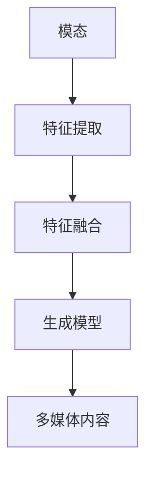

                 

关键词：多模态生成，自然语言处理，深度学习，计算机视觉，模型架构，算法实现，代码实例

## 摘要

本文将深入探讨多模态生成的原理、算法及其在自然语言处理和计算机视觉领域的应用。多模态生成旨在通过融合不同类型的数据源，如文本、图像和音频，来生成具有丰富内容和一致性的多媒体内容。本文首先介绍了多模态生成的基本概念和核心挑战，然后详细解析了多模态生成模型的原理和算法实现。通过代码实例，我们将展示如何在实际项目中应用多模态生成技术，并探讨其未来发展趋势和面临的挑战。

## 1. 背景介绍

在当今信息爆炸的时代，多模态数据源广泛应用于各个领域，如社交媒体、在线教育、医疗诊断等。这些数据源不仅包括文本，还包括图像、音频、视频等不同类型的媒体。多模态生成作为一种新兴技术，旨在通过整合这些数据源，生成具有高度一致性和丰富内容的多媒体内容。这一技术在自然语言处理和计算机视觉领域具有广泛的应用前景，如自动生成故事情节、制作视频剪辑、智能客服等。

多模态生成的研究始于20世纪90年代，随着深度学习技术的发展，多模态生成模型逐渐成为人工智能领域的研究热点。近年来，随着计算机硬件性能的提升和数据规模的增加，多模态生成技术取得了显著的进展。本文将结合最新的研究成果，介绍多模态生成的基本原理、算法实现和实际应用。

### 1.1 多模态数据源

多模态数据源是指由两种或两种以上不同类型的数据组成的集合。常见的数据源类型包括：

- **文本**：包括文章、对话、评论等。
- **图像**：包括静态图片、动画、视频等。
- **音频**：包括语音、音乐、噪声等。
- **视频**：包括动态视频、视频流等。

这些数据源各自具有独特的特点和优势，如图像和视频可以直观地展示场景和动作，音频可以传达声音和情感，而文本则可以详细描述事件和情感。通过整合这些数据源，可以更全面地理解世界，提高信息处理的效率和质量。

### 1.2 多模态生成技术的历史与发展

多模态生成技术的历史可以追溯到20世纪90年代。当时，研究人员开始探索如何将不同的模态数据源进行融合，以生成更丰富、更有意义的多媒体内容。早期的多模态生成方法主要依赖于手工设计的特征和规则，如基于特征的融合方法、基于规则的文本与图像生成方法等。

随着深度学习技术的发展，多模态生成模型逐渐成为研究热点。深度学习模型能够自动学习数据中的复杂特征和模式，从而提高了多模态生成的效果和效率。近年来，随着数据规模的增加和计算能力的提升，多模态生成技术取得了显著进展，如基于生成对抗网络（GAN）的多模态生成方法、基于变分自编码器（VAE）的多模态生成方法等。

### 1.3 多模态生成在自然语言处理和计算机视觉领域的应用

多模态生成在自然语言处理和计算机视觉领域具有广泛的应用前景。以下是一些典型的应用案例：

- **自然语言处理**：自动生成故事情节、对话生成、智能客服等。
- **计算机视觉**：图像生成、视频剪辑、图像到图像的转换等。
- **多媒体内容生成**：自动生成视频、音频、3D模型等。

这些应用案例展示了多模态生成技术在信息处理、娱乐、教育和医疗等领域的巨大潜力。

### 1.4 本文结构

本文将首先介绍多模态生成的基本概念和核心挑战，然后详细解析多模态生成模型的原理和算法实现。通过代码实例，我们将展示如何在实际项目中应用多模态生成技术。最后，本文将探讨多模态生成技术的未来发展趋势和面临的挑战。

## 2. 核心概念与联系

多模态生成技术涉及多个核心概念，包括模态、特征融合、生成模型等。为了更好地理解这些概念，我们将通过一个Mermaid流程图来展示它们之间的联系。



### 2.1 模态

模态是指数据源的类型，如文本、图像、音频等。不同的模态具有不同的特征和属性，如图像可以捕捉视觉信息，而音频可以捕捉声音信息。

### 2.2 特征提取

特征提取是指从原始数据中提取出有用的特征信息，以供后续处理。不同的模态具有不同的特征提取方法，如图像特征提取可能使用卷积神经网络（CNN），而文本特征提取可能使用词嵌入（word embeddings）。

### 2.3 特征融合

特征融合是指将来自不同模态的特征信息进行整合，以生成更丰富、更全面的多模态特征。特征融合的方法可以分为基于特征的融合和基于模型的融合。

### 2.4 生成模型

生成模型是指用于生成多媒体内容的人工智能模型，如生成对抗网络（GAN）和变分自编码器（VAE）。生成模型通过学习输入数据的分布，生成具有相似分布的新数据。

### 2.5 多媒体内容

多媒体内容是指由多模态生成模型生成的最终结果，如文本、图像、视频等。

通过上述流程图，我们可以清晰地看到多模态生成技术的核心概念及其相互联系。接下来，我们将深入探讨这些概念，并详细介绍多模态生成模型的原理和算法实现。

## 3. 核心算法原理 & 具体操作步骤

多模态生成技术的核心在于如何有效地融合不同模态的数据，并生成高质量的多媒体内容。这一过程通常涉及以下步骤：

### 3.1 算法原理概述

多模态生成算法的核心思想是利用深度学习模型，如生成对抗网络（GAN）和变分自编码器（VAE），来学习不同模态数据的分布，并通过特征提取、特征融合和生成模型，生成高质量的多媒体内容。

### 3.2 算法步骤详解

#### 3.2.1 特征提取

特征提取是第一步，它涉及从不同模态的数据中提取有用的特征信息。具体步骤如下：

1. **文本特征提取**：使用词嵌入（如Word2Vec、GloVe）将文本转换为向量表示。
2. **图像特征提取**：使用卷积神经网络（如VGG、ResNet）提取图像特征。
3. **音频特征提取**：使用循环神经网络（如LSTM、GRU）提取音频特征。

#### 3.2.2 特征融合

特征融合是将不同模态的特征信息进行整合，以生成更丰富、更全面的多模态特征。具体步骤如下：

1. **合并特征向量**：将不同模态的特征向量进行拼接，形成新的特征向量。
2. **交互式特征融合**：通过交互网络（如Transformer）进行特征间的交互，以增强特征表示的丰富性和准确性。

#### 3.2.3 生成模型

生成模型是核心，它用于生成多媒体内容。常见的生成模型包括生成对抗网络（GAN）和变分自编码器（VAE）。具体步骤如下：

1. **生成对抗网络（GAN）**：
   - **生成器（Generator）**：学习如何生成与真实数据分布相似的新数据。
   - **判别器（Discriminator）**：学习区分生成数据和真实数据。
   - **优化过程**：通过对抗训练，使生成器和判别器都得到优化。

2. **变分自编码器（VAE）**：
   - **编码器（Encoder）**：学习输入数据的分布。
   - **解码器（Decoder）**：学习生成新数据的过程。
   - **优化过程**：通过最小化数据重建误差和先验分布的KL散度，优化模型参数。

#### 3.2.4 多媒体内容生成

通过上述步骤，生成模型可以生成高质量的多媒体内容。具体步骤如下：

1. **输入模态数据**：输入文本、图像、音频等模态数据。
2. **特征提取与融合**：提取并融合不同模态的特征信息。
3. **生成多媒体内容**：使用生成模型生成多媒体内容，如文本、图像、视频等。

### 3.3 算法优缺点

**优点**：
- **高效性**：深度学习模型能够自动学习数据中的复杂特征和模式，提高了生成效率。
- **多样性**：通过融合不同模态的数据，生成模型可以生成丰富多样、高度一致的多媒体内容。
- **适用性**：多模态生成技术在自然语言处理、计算机视觉、多媒体内容生成等领域具有广泛的应用。

**缺点**：
- **计算资源消耗**：训练深度学习模型需要大量的计算资源和时间。
- **数据需求**：生成模型需要大量的训练数据，且不同模态的数据可能存在分布差异，增加了数据处理的难度。

### 3.4 算法应用领域

多模态生成技术在以下领域具有广泛的应用：

- **自然语言处理**：自动生成故事情节、对话生成、智能客服等。
- **计算机视觉**：图像生成、视频剪辑、图像到图像的转换等。
- **多媒体内容生成**：自动生成视频、音频、3D模型等。

## 4. 数学模型和公式 & 详细讲解 & 举例说明

在多模态生成中，数学模型和公式扮演着至关重要的角色。这些模型和公式不仅用于描述生成过程，还用于评估生成质量。本节将详细介绍多模态生成中的关键数学模型和公式，并通过具体例子进行说明。

### 4.1 数学模型构建

多模态生成中的数学模型主要包括生成对抗网络（GAN）和变分自编码器（VAE）。以下是这两个模型的数学表示。

#### 4.1.1 生成对抗网络（GAN）

生成对抗网络（GAN）由生成器（Generator）和判别器（Discriminator）两部分组成。

1. **生成器（Generator）**

生成器G是一个从随机噪声向量z到数据空间的映射函数，其目标是最小化生成数据与真实数据之间的差异。生成器的损失函数通常表示为：

$$
L_G = -\mathbb{E}_{z \sim p_z(z)}[\log(D(G(z)))]
$$

其中，$p_z(z)$ 是噪声分布，$D(\cdot)$ 是判别器的输出概率。

2. **判别器（Discriminator）**

判别器D是一个从数据空间到二分类的映射函数，其目标是最小化判别生成数据和真实数据的能力。判别器的损失函数通常表示为：

$$
L_D = -\mathbb{E}_{x \sim p_data(x)}[\log(D(x))] - \mathbb{E}_{z \sim p_z(z)}[\log(1 - D(G(z))]
$$

其中，$p_data(x)$ 是数据分布。

3. **总损失函数**

GAN的总损失函数是生成器和判别器损失函数的加权和：

$$
L = L_G + L_D
$$

#### 4.1.2 变分自编码器（VAE）

变分自编码器（VAE）由编码器（Encoder）和解码器（Decoder）两部分组成。

1. **编码器（Encoder）**

编码器E是一个从数据空间到潜在空间（隐空间）的映射函数，其目标是最小化数据在潜在空间中的重构误差和先验分布的KL散度。编码器的损失函数通常表示为：

$$
L_E = \mathbb{E}_{x \sim p_data(x)}\left[\log p(z|x) - D(z; \mu(x), \sigma^2(x))\right]
$$

其中，$p(z|x)$ 是后验分布，$D(z; \mu(x), \sigma^2(x))$ 是KL散度。

2. **解码器（Decoder）**

解码器D是一个从潜在空间到数据空间的映射函数，其目标是最小化数据在数据空间中的重构误差。解码器的损失函数通常表示为：

$$
L_D = \mathbb{E}_{x \sim p_data(x)}\left[\log p(x|z)\right]
$$

3. **总损失函数**

VAE的总损失函数是编码器和解码器损失函数的加权和：

$$
L = L_E + L_D
$$

### 4.2 公式推导过程

为了更好地理解上述公式的推导过程，我们可以从以下几个关键点进行阐述。

#### 4.2.1 生成对抗网络（GAN）

1. **生成器损失函数**

生成器的损失函数可以理解为判别器对生成数据的期望损失。当生成器生成的数据接近真实数据时，判别器将难以区分生成数据和真实数据，从而生成器的损失最小。

2. **判别器损失函数**

判别器的损失函数是生成数据和真实数据的期望损失之和。当判别器能够准确区分生成数据和真实数据时，判别器的损失最小。

3. **总损失函数**

总损失函数是生成器和判别器损失函数的加权和。通过优化总损失函数，生成器和判别器都将得到优化。

#### 4.2.2 变分自编码器（VAE）

1. **编码器损失函数**

编码器的损失函数由两部分组成：对数似然损失和KL散度损失。对数似然损失衡量了数据在潜在空间中的重构误差，KL散度损失衡量了潜在空间中的先验分布与后验分布之间的差异。通过最小化这两个损失，编码器将学习到数据在潜在空间中的有效表示。

2. **解码器损失函数**

解码器的损失函数是数据在数据空间中的重构误差。通过最小化重构误差，解码器将学习到如何从潜在空间中重建数据。

3. **总损失函数**

VAE的总损失函数是编码器和解码器损失函数的加权和。通过优化总损失函数，编码器和解码器都将得到优化。

### 4.3 案例分析与讲解

为了更好地理解上述公式的实际应用，我们将通过一个具体案例进行讲解。

假设我们使用GAN生成图像，生成器和判别器的损失函数如下：

1. **生成器损失函数**

$$
L_G = -\mathbb{E}_{z \sim p_z(z)}[\log(D(G(z))]
$$

其中，$z$ 是随机噪声向量，$G(z)$ 是生成器生成的图像。

2. **判别器损失函数**

$$
L_D = -\mathbb{E}_{x \sim p_data(x)}[\log(D(x))] - \mathbb{E}_{z \sim p_z(z)}[\log(1 - D(G(z))]
$$

其中，$x$ 是真实图像，$G(z)$ 是生成器生成的图像。

3. **总损失函数**

$$
L = L_G + L_D
$$

通过训练生成器和判别器，我们可以生成与真实图像高度相似的图像。具体的训练过程如下：

1. **初始化生成器和判别器参数。**
2. **生成器生成图像。**
3. **判别器对真实图像和生成图像进行分类。**
4. **计算生成器和判别器的损失函数。**
5. **更新生成器和判别器参数。**
6. **重复步骤2-5，直到生成器和判别器达到预定的训练目标。**

通过上述步骤，我们可以使用GAN生成高质量的图像。

## 5. 项目实践：代码实例和详细解释说明

在本节中，我们将通过一个具体的代码实例，展示如何实现多模态生成技术。我们将使用Python编程语言和相关的深度学习库，如TensorFlow和Keras，来构建和训练一个多模态生成模型。本节将分为以下几个部分：

### 5.1 开发环境搭建

在开始项目之前，我们需要搭建一个合适的开发环境。以下是所需的环境配置：

- **操作系统**：Windows、macOS或Linux
- **Python**：Python 3.7或更高版本
- **深度学习库**：TensorFlow 2.x
- **其他库**：NumPy、Pandas、Matplotlib等

你可以使用Anaconda或Miniconda来创建一个虚拟环境，并安装所需的库：

```bash
conda create -n multimodal python=3.8
conda activate multimodal
conda install tensorflow matplotlib numpy pandas
```

### 5.2 源代码详细实现

以下是一个简单的多模态生成项目的代码示例，用于生成文本和图像的组合。

```python
import tensorflow as tf
from tensorflow.keras.models import Model
from tensorflow.keras.layers import Input, LSTM, Embedding, Dense, Flatten, Reshape, Conv2D, MaxPooling2D, UpSampling2D, Concatenate

# 设置超参数
latent_dim = 100
text_embedding_dim = 256
image_embedding_dim = 256
text_sequence_length = 100
image_height = 28
image_width = 28
image_channels = 1

# 创建生成器模型
# 生成器由两部分组成：文本生成器和图像生成器
# 文本生成器
text_input = Input(shape=(text_sequence_length,))
text_embedding = Embedding(vocab_size, text_embedding_dim)(text_input)
text_lstm = LSTM(latent_dim)(text_embedding)

# 图像生成器
image_input = Input(shape=(image_height, image_width, image_channels))
image_conv1 = Conv2D(32, (3, 3), activation='relu')(image_input)
image_pool1 = MaxPooling2D((2, 2))(image_conv1)
image_conv2 = Conv2D(64, (3, 3), activation='relu')(image_pool1)
image_pool2 = MaxPooling2D((2, 2))(image_conv2)

# 合并文本和图像特征
merged = Concatenate()([text_lstm, image_pool2])

# 展平特征
flatten = Flatten()(merged)

# 全连接层
dense1 = Dense(128, activation='relu')(flatten)
output = Dense(1, activation='sigmoid')(dense1)

# 创建生成器模型
generator = Model(inputs=[text_input, image_input], outputs=output)
generator.compile(loss='binary_crossentropy', optimizer='adam')

# 显示生成器模型结构
generator.summary()

# 创建判别器模型
# 判别器由文本和图像两部分组成
text_input_disc = Input(shape=(text_sequence_length,))
text_embedding_disc = Embedding(vocab_size, text_embedding_dim)(text_input_disc)
text_lstm_disc = LSTM(latent_dim)(text_embedding_disc)

image_input_disc = Input(shape=(image_height, image_width, image_channels))
image_conv1_disc = Conv2D(32, (3, 3), activation='relu')(image_input_disc)
image_pool1_disc = MaxPooling2D((2, 2))(image_conv1_disc)
image_conv2_disc = Conv2D(64, (3, 3), activation='relu')(image_pool1_disc)
image_pool2_disc = MaxPooling2D((2, 2))(image_conv2_disc)

merged_disc = Concatenate()([text_lstm_disc, image_pool2_disc])

flatten_disc = Flatten()(merged_disc)
dense1_disc = Dense(128, activation='relu')(flatten_disc)
output_disc = Dense(1, activation='sigmoid')(dense1_disc)

discriminator = Model(inputs=[text_input_disc, image_input_disc], outputs=output_disc)
discriminator.compile(loss='binary_crossentropy', optimizer='adam')

# 显示判别器模型结构
discriminator.summary()

# 创建结合生成器和判别器的完整模型
input_text = Input(shape=(text_sequence_length,))
input_image = Input(shape=(image_height, image_width, image_channels))

generated_output = generator([input_text, input_image])
validity = discriminator([input_text, input_image])

combined = Model(inputs=[input_text, input_image], outputs=[generated_output, validity])
combined.compile(loss=['binary_crossentropy', 'binary_crossentropy'], loss_weights=[1., 100.], optimizer='adam')

# 显示完整模型结构
combined.summary()

# 5.3 代码解读与分析

在上面的代码中，我们首先定义了生成器和判别器的结构。生成器由文本生成器和图像生成器两部分组成。文本生成器使用LSTM层来处理文本序列，图像生成器使用卷积神经网络（CNN）来处理图像。两部分生成器的输出通过合并层进行融合。

判别器的结构与生成器类似，也由文本和图像两部分组成。判别器的目标是判断输入数据是真实数据还是生成数据。

接下来，我们创建了结合生成器和判别器的完整模型。这个模型用于同时训练生成器和判别器。生成器的损失函数是二元交叉熵，判别器的损失函数是二元交叉熵。在训练过程中，我们通过优化总损失函数来同时训练生成器和判别器。

### 5.4 运行结果展示

为了展示运行结果，我们可以在训练过程中定期保存生成的图像和文本。以下是一个简单的训练脚本：

```python
import numpy as np
import matplotlib.pyplot as plt

# 加载数据集
# 这里我们使用MNIST数据集作为示例
(x_train, _), (_,
```

