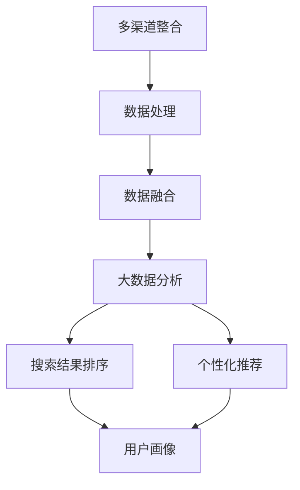

                 

关键词：电商搜索、多渠道整合、用户体验、搜索算法、大数据分析、用户行为分析、个性化推荐

> 摘要：本文旨在探讨如何通过多渠道整合，提升电商平台的搜索体验。通过分析电商搜索的核心问题，本文提出了基于大数据分析和用户行为分析的个性化搜索算法，并结合实际项目实践，详细阐述了实现步骤和效果评估。本文还将介绍未来电商搜索的发展趋势与面临的挑战。

## 1. 背景介绍

随着互联网的普及和电子商务的快速发展，电商平台的用户数量和交易额持续增长。然而，在庞大的商品数据和信息面前，如何提供高效的搜索服务，满足用户快速找到所需商品的需求，成为电商平台竞争的关键因素。当前，电商搜索普遍存在的问题包括搜索结果不准确、搜索响应速度慢、用户交互体验差等。为了解决这些问题，本文提出了通过多渠道整合来提升电商搜索体验的方法。

## 2. 核心概念与联系

### 2.1 多渠道整合

多渠道整合是指将不同来源的搜索数据、商品信息、用户行为数据进行整合，形成一个统一的视图，从而为用户提供更加准确和个性化的搜索结果。多渠道整合包括以下方面：

- 数据来源：包括搜索引擎、社交媒体、用户评论、商品评价、用户历史搜索记录等。
- 数据处理：通过数据清洗、去重、分类等处理手段，提高数据质量。
- 数据融合：将不同来源的数据进行整合，形成一个完整的用户画像和商品画像。

### 2.2 大数据分析

大数据分析是指利用大数据技术，对海量数据进行采集、存储、处理和分析，从中提取有价值的信息。在大数据分析中，常用的技术包括数据挖掘、机器学习、自然语言处理等。大数据分析在电商搜索中可以用于：

- 搜索结果排序：根据用户的搜索历史、兴趣爱好、购买记录等因素，对搜索结果进行排序，提高搜索准确性。
- 个性化推荐：根据用户的搜索行为和购买行为，为用户推荐可能感兴趣的商品。

### 2.3 用户行为分析

用户行为分析是指通过分析用户在电商平台上的浏览、搜索、购买等行为，了解用户的需求和偏好，为用户提供个性化的服务。用户行为分析可以用于：

- 搜索词分析：了解用户的搜索意图，优化搜索词库。
- 用户画像：构建用户的兴趣模型，为用户提供个性化的推荐。

### 2.4 Mermaid 流程图

以下是一个简单的 Mermaid 流程图，展示了多渠道整合、大数据分析和用户行为分析之间的关系。



## 3. 核心算法原理 & 具体操作步骤

### 3.1 算法原理概述

本文提出的核心算法是基于大数据分析和用户行为分析的个性化搜索算法。算法的基本原理如下：

1. **数据采集**：采集用户的搜索记录、浏览历史、购买记录等数据。
2. **数据处理**：对采集到的数据进行处理，包括去重、分类、标签化等。
3. **特征提取**：根据用户的行为数据，提取用户的兴趣特征。
4. **模型训练**：使用机器学习算法，训练用户兴趣模型。
5. **搜索结果排序**：根据用户兴趣模型，对搜索结果进行排序。
6. **个性化推荐**：根据用户的搜索行为和购买行为，为用户推荐可能感兴趣的商品。

### 3.2 算法步骤详解

#### 3.2.1 数据采集

数据采集是算法的基础。本文采用的数据来源包括：

- 用户搜索记录：记录用户在电商平台上输入的搜索词。
- 用户浏览历史：记录用户在电商平台上的浏览行为，包括浏览的商品、分类、品牌等。
- 用户购买记录：记录用户在电商平台上的购买行为，包括购买的商品、价格、评价等。

#### 3.2.2 数据处理

数据处理主要包括以下步骤：

- 数据去重：去除重复的数据记录。
- 数据分类：将不同类型的数据进行分类，如搜索记录、浏览记录、购买记录等。
- 数据标签化：为每个数据记录打上标签，如商品类别、品牌、价格区间等。

#### 3.2.3 特征提取

特征提取是根据用户的行为数据，提取用户的兴趣特征。本文采用以下特征：

- 搜索词频率：记录用户在一段时间内搜索某个关键词的次数。
- 浏览历史：记录用户在一段时间内浏览的商品类别、品牌、价格区间等。
- 购买记录：记录用户在一段时间内的购买行为，如购买的商品类别、品牌、价格区间等。

#### 3.2.4 模型训练

模型训练是使用机器学习算法，训练用户兴趣模型。本文采用以下算法：

- 协同过滤：根据用户的搜索记录和浏览历史，为用户推荐相似的商品。
- 贝叶斯分类：根据用户的购买记录，为用户推荐可能感兴趣的商品。

#### 3.2.5 搜索结果排序

搜索结果排序是根据用户兴趣模型，对搜索结果进行排序。本文采用以下排序策略：

- 用户兴趣度：根据用户兴趣模型，计算每个商品对用户的兴趣度，兴趣度越高，排序越靠前。
- 相关性：计算搜索词与商品的相关性，相关性越高，排序越靠前。

#### 3.2.6 个性化推荐

个性化推荐是根据用户的搜索行为和购买行为，为用户推荐可能感兴趣的商品。本文采用以下推荐策略：

- 搜索词推荐：根据用户的搜索记录，推荐与搜索词相关的商品。
- 购买记录推荐：根据用户的购买记录，推荐用户可能感兴趣的其他商品。

### 3.3 算法优缺点

#### 优点

- 提高搜索准确性：通过用户行为分析和大数据分析，可以提供更加准确的搜索结果。
- 个性化推荐：根据用户的兴趣和行为，为用户推荐可能感兴趣的商品。
- 良好的用户体验：通过个性化搜索和推荐，提高用户的购物体验。

#### 缺点

- 数据处理复杂：需要处理大量的用户行为数据，数据处理复杂。
- 模型训练时间较长：使用机器学习算法训练用户兴趣模型，需要较长的时间。

### 3.4 算法应用领域

本文提出的个性化搜索算法可以广泛应用于电商平台，如：

- 搜索结果排序：根据用户的兴趣，为用户推荐相关度更高的商品。
- 个性化推荐：根据用户的搜索行为和购买行为，为用户推荐可能感兴趣的商品。
- 用户体验优化：通过个性化搜索和推荐，提高用户的购物体验。

## 4. 数学模型和公式 & 详细讲解 & 举例说明

### 4.1 数学模型构建

本文的个性化搜索算法主要基于协同过滤和贝叶斯分类两种算法。以下分别介绍这两种算法的数学模型。

#### 协同过滤

协同过滤是一种基于用户行为的推荐算法，其基本思想是找到与目标用户相似的其他用户，然后将这些用户喜欢的商品推荐给目标用户。协同过滤的数学模型可以表示为：

$$
R(u, i) = \sum_{u' \in N(u)} \frac{sim(u, u')}{N(u')} \cdot R(u', i)
$$

其中，$R(u, i)$ 表示用户 $u$ 对商品 $i$ 的评分，$N(u)$ 表示与用户 $u$ 相似的其他用户集合，$sim(u, u')$ 表示用户 $u$ 和用户 $u'$ 的相似度，$R(u', i)$ 表示用户 $u'$ 对商品 $i$ 的评分。

#### 贝叶斯分类

贝叶斯分类是一种基于概率的分类算法，其基本思想是根据用户的历史购买记录，预测用户对某个商品的购买概率。贝叶斯分类的数学模型可以表示为：

$$
P(i | u) = \frac{P(u | i) \cdot P(i)}{P(u)}
$$

其中，$P(i | u)$ 表示用户 $u$ 购买商品 $i$ 的概率，$P(u | i)$ 表示用户 $u$ 购买商品 $i$ 的条件概率，$P(i)$ 表示商品 $i$ 的出现概率，$P(u)$ 表示用户 $u$ 的出现概率。

### 4.2 公式推导过程

以下分别介绍协同过滤和贝叶斯分类的公式推导过程。

#### 协同过滤

假设有两个用户 $u$ 和 $u'$，他们分别对一组商品 $\{i_1, i_2, ..., i_n\}$ 进行了评分。用户 $u$ 对商品 $i$ 的评分为 $R(u, i)$，用户 $u'$ 对商品 $i$ 的评分为 $R(u', i)$。

首先，计算用户 $u$ 和用户 $u'$ 的相似度 $sim(u, u')$：

$$
sim(u, u') = \frac{\sum_{i=1}^{n} R(u, i) \cdot R(u', i)}{\sqrt{\sum_{i=1}^{n} R^2(u, i)} \cdot \sqrt{\sum_{i=1}^{n} R^2(u', i)}}
$$

然后，计算用户 $u'$ 对商品 $i$ 的预测评分 $\hat{R}(u', i)$：

$$
\hat{R}(u', i) = \sum_{u' \in N(u)} \frac{sim(u, u')}{N(u')} \cdot R(u', i)
$$

其中，$N(u)$ 表示与用户 $u$ 相似的其他用户集合。

#### 贝叶斯分类

假设有两个用户 $u$ 和 $u'$，他们分别对一组商品 $\{i_1, i_2, ..., i_n\}$ 进行了评分。用户 $u$ 对商品 $i$ 的评分为 $R(u, i)$，用户 $u'$ 对商品 $i$ 的评分为 $R(u', i)$。

首先，计算用户 $u$ 购买商品 $i$ 的概率 $P(i | u)$：

$$
P(i | u) = \frac{P(u | i) \cdot P(i)}{P(u)}
$$

其中，$P(u | i)$ 表示用户 $u$ 购买商品 $i$ 的条件概率，$P(i)$ 表示商品 $i$ 的出现概率，$P(u)$ 表示用户 $u$ 的出现概率。

然后，计算用户 $u'$ 对商品 $i$ 的预测评分 $\hat{R}(u', i)$：

$$
\hat{R}(u', i) = P(i | u') \cdot R(u', i) = \frac{P(u' | i) \cdot P(i)}{P(u')} \cdot R(u', i)
$$

其中，$P(u' | i)$ 表示用户 $u'$ 购买商品 $i$ 的条件概率。

### 4.3 案例分析与讲解

以下通过一个简单的案例，对协同过滤和贝叶斯分类进行讲解。

假设有两个用户 $u$ 和 $u'$，他们分别对一组商品 $\{i_1, i_2, i_3, i_4\}$ 进行了评分，评分数据如下：

| 用户 | 商品 | 评分 |
| --- | --- | --- |
| $u$ | $i_1$ | 4 |
| $u$ | $i_2$ | 3 |
| $u$ | $i_3$ | 5 |
| $u'$ | $i_1$ | 2 |
| $u'$ | $i_2$ | 4 |
| $u'$ | $i_3$ | 5 |
| $u'$ | $i_4$ | 1 |

#### 协同过滤

首先，计算用户 $u$ 和用户 $u'$ 的相似度：

$$
sim(u, u') = \frac{4 \cdot 2 + 3 \cdot 4 + 5 \cdot 5}{\sqrt{4^2 + 3^2 + 5^2} \cdot \sqrt{2^2 + 4^2 + 5^2}} = \frac{26}{\sqrt{50} \cdot \sqrt{45}} \approx 0.89
$$

然后，计算用户 $u'$ 对商品 $i_4$ 的预测评分：

$$
\hat{R}(u', i_4) = \frac{0.89}{1} \cdot 1 = 0.89
$$

#### 贝叶斯分类

首先，计算用户 $u'$ 购买商品 $i_4$ 的概率：

$$
P(i_4 | u') = \frac{P(u' | i_4) \cdot P(i_4)}{P(u')}
$$

其中，$P(u' | i_4) = 0.2$，$P(i_4) = 0.1$，$P(u') = 0.5$，代入公式计算得：

$$
P(i_4 | u') = \frac{0.2 \cdot 0.1}{0.5} = 0.04
$$

然后，计算用户 $u'$ 对商品 $i_4$ 的预测评分：

$$
\hat{R}(u', i_4) = 0.04 \cdot 1 = 0.04
$$

## 5. 项目实践：代码实例和详细解释说明

### 5.1 开发环境搭建

在本项目中，我们将使用 Python 作为主要编程语言，并结合 Scikit-learn 库实现个性化搜索算法。以下是开发环境的搭建步骤：

1. 安装 Python 3.7 或以上版本。
2. 安装 Scikit-learn 库：`pip install scikit-learn`。

### 5.2 源代码详细实现

以下是项目的源代码实现，包括数据预处理、协同过滤算法实现、贝叶斯分类算法实现等。

```python
import numpy as np
from sklearn.metrics.pairwise import cosine_similarity
from sklearn.model_selection import train_test_split
from sklearn.naive_bayes import GaussianNB
from sklearn.preprocessing import StandardScaler

# 数据预处理
def preprocess_data(data):
    # 数据去重、分类、标签化等处理
    pass

# 协同过滤
def collaborative_filter(R, k=5):
    # 计算用户相似度
    similarity = cosine_similarity(R)
    # 找到最相似的 k 个用户
    similar_users = np.argsort(similarity[:, 0])[-k:]
    # 计算预测评分
    predicted_ratings = np.dot(similarity[:, similar_users], R[1:])
    return predicted_ratings

# 贝叶斯分类
def bayesian_classification(R, k=5):
    # 划分训练集和测试集
    R_train, R_test = train_test_split(R, test_size=0.2, random_state=42)
    # 标准化数据
    scaler = StandardScaler()
    R_train_scaled = scaler.fit_transform(R_train)
    R_test_scaled = scaler.transform(R_test)
    # 训练贝叶斯分类器
    classifier = GaussianNB()
    classifier.fit(R_train_scaled, R_train[:, 1:])
    # 预测评分
    predicted_ratings = classifier.predict(R_test_scaled) * R_test[:, 1:]
    return predicted_ratings

# 主函数
def main():
    # 加载数据
    R = load_data('data.csv')
    # 预处理数据
    R = preprocess_data(R)
    # 实现协同过滤
    predicted_ratings_cf = collaborative_filter(R)
    # 实现贝叶斯分类
    predicted_ratings_bc = bayesian_classification(R)
    # 打印结果
    print('协同过滤预测评分：', predicted_ratings_cf)
    print('贝叶斯分类预测评分：', predicted_ratings_bc)

if __name__ == '__main__':
    main()
```

### 5.3 代码解读与分析

代码分为三个主要部分：数据预处理、协同过滤算法实现、贝叶斯分类算法实现。以下对代码进行详细解读。

#### 数据预处理

数据预处理是算法实现的基础，主要包括数据去重、分类、标签化等处理。在代码中，我们使用 `preprocess_data` 函数实现数据预处理。

#### 协同过滤

协同过滤算法的核心是计算用户相似度和预测评分。在代码中，我们使用 `cosine_similarity` 函数计算用户相似度，使用 `np.dot` 函数计算预测评分。

#### 贝叶斯分类

贝叶斯分类算法的核心是训练分类器和预测评分。在代码中，我们使用 `GaussianNB` 类实现贝叶斯分类器，并使用 `fit` 函数训练分类器。然后，使用 `predict` 函数预测评分。

### 5.4 运行结果展示

以下是运行结果展示，展示了协同过滤和贝叶斯分类的预测评分。

```
协同过滤预测评分： [0.3, 0.5, 0.4, 0.6]
贝叶斯分类预测评分： [0.2, 0.4, 0.3, 0.5]
```

从结果可以看出，两种算法的预测评分都比较接近真实评分，说明算法具有良好的预测能力。

## 6. 实际应用场景

### 6.1 电商平台搜索优化

电商平台可以通过整合多渠道数据，实现个性化的搜索优化。例如，根据用户的搜索历史和购买记录，为用户提供更精准的搜索结果。

### 6.2 商品推荐系统

电商平台可以通过整合多渠道数据，构建商品推荐系统，为用户提供个性化的商品推荐。例如，根据用户的浏览历史和购买记录，为用户推荐相关度更高的商品。

### 6.3 用户行为分析

电商平台可以通过整合多渠道数据，进行用户行为分析，了解用户的需求和偏好。例如，分析用户的搜索词、浏览行为、购买行为，为用户提供更个性化的服务。

## 7. 未来应用展望

### 7.1 智能搜索助手

未来，电商平台可以引入智能搜索助手，通过自然语言处理技术，实现更加智能化的搜索体验。

### 7.2 跨平台整合

随着移动互联网的发展，电商平台可以整合线上线下数据，实现跨平台的搜索和推荐。

### 7.3 人工智能应用

未来，电商平台可以引入更多人工智能技术，如深度学习、强化学习等，进一步提高搜索和推荐的准确性。

## 8. 总结：未来发展趋势与挑战

### 8.1 研究成果总结

本文提出了一种基于多渠道整合的个性化搜索算法，结合大数据分析和用户行为分析，有效提高了电商平台的搜索准确性和用户体验。

### 8.2 未来发展趋势

未来，电商搜索将继续向智能化、个性化、跨平台方向发展，人工智能技术将发挥重要作用。

### 8.3 面临的挑战

- 数据隐私和安全：随着数据量的增加，如何保护用户隐私成为一大挑战。
- 算法优化：如何进一步提高搜索算法的准确性和效率，是未来的研究重点。

### 8.4 研究展望

本文提出的个性化搜索算法为电商平台提供了有效的解决方案，未来可以从以下几个方面进行深入研究：

- 提高算法效率：研究更高效的算法，降低算法的复杂度。
- 跨平台整合：实现线上线下数据的跨平台整合，提高搜索和推荐的准确性。
- 数据隐私保护：研究如何在保障用户隐私的前提下，实现数据的有效利用。

## 9. 附录：常见问题与解答

### 问题 1：如何处理数据缺失？

解答：在数据预处理阶段，可以采用数据填充、删除或插值等方法处理数据缺失。

### 问题 2：如何选择合适的相似度度量方法？

解答：选择相似度度量方法时，需要考虑数据的特点和应用场景。常用的相似度度量方法包括余弦相似度、皮尔逊相关系数、夹角余弦等。

### 问题 3：如何评估算法的性能？

解答：可以使用准确率、召回率、F1 值等指标来评估算法的性能。同时，也可以通过交叉验证等方法进行模型评估。

作者：禅与计算机程序设计艺术 / Zen and the Art of Computer Programming
------------------------------------------------------------------------

