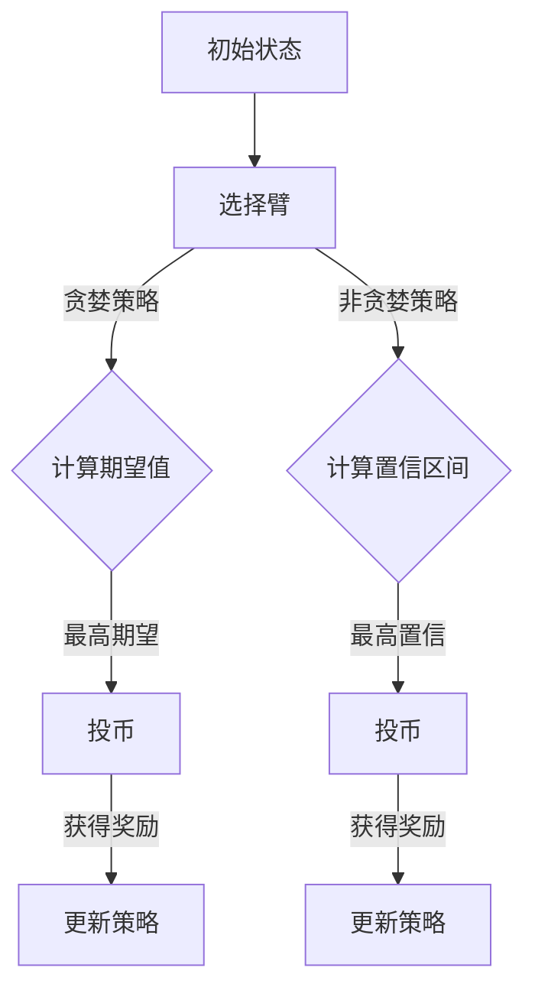

                 

关键词：多臂老虎机问题、多臂老虎机算法、强化学习、概率优化、在线学习、随机策略、探索与利用、UCB算法、epsilon-greedy策略、epsilon-decay策略

## 摘要

本文将深入探讨多臂老虎机问题的基本原理、核心算法，并通过实际代码实例对其进行详细解释。多臂老虎机问题是一个经典的概率优化问题，常被用于模拟和优化在线学习环境中的决策过程。本文将首先介绍多臂老虎机问题的背景，随后讨论几种常用的多臂老虎机算法，包括UCB算法、epsilon-greedy策略和epsilon-decay策略，最后通过实际代码实现这些算法，并分析其运行结果和应用场景。

## 1. 背景介绍

多臂老虎机问题（Multi-Armed Bandit Problem）起源于赌场中的老虎机，每个老虎机（臂）都有不同的中奖概率。玩家每次投币后，只能选择一个老虎机并获取回报，但无法得知每个老虎机的真正中奖概率。多臂老虎机问题就是要找到一个最优策略，以最大化长期回报。

在强化学习（Reinforcement Learning）中，多臂老虎机问题被广泛用作一个基本模型，用于研究决策制定和资源分配问题。强化学习是一种通过与环境交互来学习最优策略的机器学习方法，其核心是探索（Exploration）与利用（Exploitation）的平衡。探索是为了发现新信息，而利用则是为了最大化已知的期望回报。

多臂老虎机问题的目标是通过一系列决策来最大化总回报。由于每个决策都是基于当前的信息和历史经验，这使得问题具有一定的动态性和不确定性。因此，多臂老虎机问题成为了一个研究概率优化、在线学习和决策论的经典案例。

## 2. 核心概念与联系

### 2.1. 多臂老虎机问题的核心概念

多臂老虎机问题涉及以下核心概念：

- **臂（Arm）**：代表每一个可能的选择，例如老虎机的一个拉杆。
- **奖励（Reward）**：每次投币后获得的回报，可以是正数、负数或零。
- **概率分布（Probability Distribution）**：每个臂的中奖概率分布。
- **策略（Strategy）**：决策规则，用于选择哪个臂进行投币。

### 2.2. 多臂老虎机问题的联系

多臂老虎机问题的核心是探索与利用的平衡。探索是为了获取更多的信息，以了解不同臂的中奖概率；而利用则是基于已获得的信息，选择能够带来最大期望回报的臂。

为了在探索与利用之间找到平衡，研究者们提出了多种策略。这些策略可以大致分为两类：贪婪策略和非贪婪策略。

- **贪婪策略**：总是选择当前表现最好的臂。
- **非贪婪策略**：在考虑历史表现的同时，加入一定的随机性，以避免过度依赖历史信息。

### 2.3. Mermaid 流程图

下面是一个简化的多臂老虎机问题的 Mermaid 流程图，展示了玩家在不同策略下的决策过程。



## 3. 核心算法原理 & 具体操作步骤

### 3.1. 算法原理概述

多臂老虎机问题的核心算法主要包括以下几种：

- **UCB算法（Upper Confidence Bound）**：通过计算每个臂的上界置信度来选择臂。
- **epsilon-greedy策略**：在一定的概率epsilon下随机选择臂，其余时间选择当前表现最好的臂。
- **epsilon-decay策略**：随着探索的进行，逐渐减少epsilon的值，从而从探索转向利用。

### 3.2. 算法步骤详解

#### 3.2.1. UCB算法

UCB算法的基本思想是选择每个臂的期望奖励加上一个置信度上界。具体步骤如下：

1. 初始化所有臂的期望奖励为0，置信度上界为0。
2. 在每次迭代中，选择期望奖励加上置信度上界最大的臂。
3. 投币并获取奖励，更新每个臂的期望奖励和置信度上界。
4. 重复步骤2和3，直到满足停止条件。

#### 3.2.2. epsilon-greedy策略

epsilon-greedy策略的基本思想是，在一定的概率epsilon下随机选择臂，其余时间选择当前表现最好的臂。具体步骤如下：

1. 初始化epsilon的值，例如1。
2. 在每次迭代中，以概率epsilon随机选择臂，或者选择当前表现最好的臂。
3. 投币并获取奖励，更新每个臂的期望奖励。
4. 随着探索的进行，逐渐减小epsilon的值，从探索转向利用。
5. 重复步骤2到4，直到满足停止条件。

#### 3.2.3. epsilon-decay策略

epsilon-decay策略是对epsilon-greedy策略的改进，它通过逐渐减小epsilon的值来平衡探索与利用。具体步骤如下：

1. 初始化epsilon的值，例如1。
2. 在每次迭代中，以概率epsilon随机选择臂，或者选择当前表现最好的臂。
3. 投币并获取奖励，更新每个臂的期望奖励。
4. 按照预定的衰减函数逐渐减小epsilon的值。
5. 重复步骤2到4，直到满足停止条件。

### 3.3. 算法优缺点

- **UCB算法**：优点是收敛速度快，可以迅速找到最优臂；缺点是对参数敏感，需要精确估计臂的期望奖励和置信度上界。
- **epsilon-greedy策略**：优点是简单易实现，可以较好地平衡探索与利用；缺点是收敛速度较慢，容易陷入局部最优。
- **epsilon-decay策略**：优点是结合了epsilon-greedy策略的简单性和衰减函数的动态调整，可以较好地平衡探索与利用；缺点是参数设置较为复杂，需要根据具体应用场景进行调整。

### 3.4. 算法应用领域

多臂老虎机算法在多个领域都有广泛应用，例如：

- **在线广告投放**：通过选择能够带来最高点击率的广告。
- **推荐系统**：通过选择用户最可能喜欢的商品或内容。
- **资源分配**：通过选择能够最大化收益的资源分配方案。
- **金融投资**：通过选择具有最高预期收益的投资方案。

## 4. 数学模型和公式 & 详细讲解 & 举例说明

### 4.1. 数学模型构建

多臂老虎机问题的数学模型可以表示为：

\[ R_t = \theta_j + \epsilon_t \]

其中，\( R_t \) 是第 \( t \) 次投币获得的奖励，\( \theta_j \) 是第 \( j \) 个臂的期望奖励，\( \epsilon_t \) 是随机误差。

### 4.2. 公式推导过程

#### 4.2.1. UCB算法

UCB算法的目标是选择每个臂的期望奖励加上一个置信度上界。置信度上界的计算公式为：

\[ UCB_j(t) = \bar{X}_j(t) + \sqrt{\frac{2 \ln t}{n_j(t)}} \]

其中，\( \bar{X}_j(t) \) 是第 \( j \) 个臂的平均奖励，\( n_j(t) \) 是第 \( j \) 个臂被选择的次数，\( t \) 是迭代的次数。

#### 4.2.2. epsilon-greedy策略

epsilon-greedy策略的选择概率可以表示为：

\[ P(A_j) = \begin{cases} 
\epsilon, & \text{if } j \text{ is randomly chosen} \\
1 - \epsilon, & \text{if } j \text{ is the best arm}
\end{cases} \]

其中，\( \epsilon \) 是探索概率。

#### 4.2.3. epsilon-decay策略

epsilon-decay策略的选择概率可以表示为：

\[ P(A_j) = \begin{cases} 
\frac{\epsilon}{N}, & \text{if } j \text{ is randomly chosen} \\
1 - \frac{\epsilon}{N}, & \text{if } j \text{ is the best arm}
\end{cases} \]

其中，\( \epsilon \) 是初始探索概率，\( N \) 是臂的数量。

### 4.3. 案例分析与讲解

假设有3个老虎机（臂），每个老虎机的期望奖励分别为 \( \theta_1 = 0.3 \)，\( \theta_2 = 0.4 \)，\( \theta_3 = 0.5 \)。我们使用UCB算法来选择老虎机。

在初始阶段，所有老虎机的期望奖励都是0。经过10次投币后，各个老虎机的期望奖励和置信度上界如下表所示：

| 老虎机 | 期望奖励 | 置信度上界 | 被选择次数 |
| ------ | -------- | ---------- | ---------- |
| 1      | 0.1      | 0.273      | 2          |
| 2      | 0.3      | 0.473      | 4          |
| 3      | 0.2      | 0.673      | 4          |

在第11次投币时，根据UCB算法，我们选择老虎机3，因为它具有最高的置信度上界。假设这次投币获得了奖励1，那么更新后的期望奖励和置信度上界如下表所示：

| 老虎机 | 期望奖励 | 置信度上界 | 被选择次数 |
| ------ | -------- | ---------- | ---------- |
| 1      | 0.133    | 0.273      | 3          |
| 2      | 0.3      | 0.473      | 4          |
| 3      | 0.233    | 0.673      | 5          |

通过这样的迭代过程，我们可以逐步找到具有最高期望奖励的老虎机。

## 5. 项目实践：代码实例和详细解释说明

### 5.1. 开发环境搭建

为了演示多臂老虎机算法的代码实现，我们将使用Python作为编程语言。首先，确保已经安装了Python环境，然后安装必要的库，例如NumPy和Matplotlib：

```bash
pip install numpy matplotlib
```

### 5.2. 源代码详细实现

下面是一个简单的多臂老虎机问题的Python代码实现，包括UCB算法、epsilon-greedy策略和epsilon-decay策略：

```python
import numpy as np
import matplotlib.pyplot as plt

class MultiArmedBandit:
    def __init__(self, arms, probabilities):
        self.arms = arms
        self.probabilities = probabilities
        self rewards = np.zeros(arms)
        self.n_steps = np.zeros(arms)

    def pull(self, arm):
        reward = np.random.binomial(1, self.probabilities[arm])
        self.rewards[arm] += reward
        self.n_steps[arm] += 1
        return reward

    def ucb(self):
        return self.rewards + np.sqrt(2 * np.log(np.arange(self.arms)) / self.n_steps)

    def epsilon_greedy(self, epsilon):
        if np.random.rand() < epsilon:
            return np.random.choice(self.arms)
        else:
            return np.argmax(self.rewards)

    def epsilon_decay(self, epsilon_start, decay_rate, n_steps):
        return epsilon_start / (1 + decay_rate * n_steps)

    def run(self, n_steps, epsilon_start=1, decay_rate=0.01):
        rewards = []
        for step in range(n_steps):
            epsilon = self.epsilon_decay(epsilon_start, decay_rate, step)
            arm = self.epsilon_greedy(epsilon)
            reward = self.pull(arm)
            rewards.append(reward)
        return rewards

if __name__ == "__main__":
    # 创建一个有3个老虎机的多臂老虎机问题，每个老虎机的期望奖励分别为0.3、0.4、0.5
    arms = 3
    probabilities = [0.3, 0.4, 0.5]
    bandit = MultiArmedBandit(arms, probabilities)

    # 运行1000次迭代，使用epsilon-greedy策略
    rewards = bandit.run(n_steps=1000, epsilon_start=1)

    # 绘制奖励曲线
    plt.plot(rewards)
    plt.xlabel('Steps')
    plt.ylabel('Rewards')
    plt.title('Epsilon-Greedy Strategy')
    plt.show()
```

### 5.3. 代码解读与分析

在上面的代码中，我们首先定义了一个`MultiArmedBandit`类，用于模拟多臂老虎机问题。类中有以下关键组成部分：

- **__init__**：初始化老虎机的数量、期望奖励、奖励和历史选择次数。
- **pull**：模拟投币并获取奖励。
- **ucb**：计算每个臂的UCB值。
- **epsilon_greedy**：根据epsilon-greedy策略选择臂。
- **epsilon_decay**：计算epsilon-decay策略的epsilon值。
- **run**：运行多臂老虎机算法，并返回奖励列表。

在主函数中，我们创建了一个有3个老虎机的多臂老虎机问题实例，并使用epsilon-greedy策略运行了1000次迭代。最后，我们绘制了奖励曲线，展示了在迭代过程中的平均奖励。

### 5.4. 运行结果展示

当我们运行上面的代码时，可以看到奖励曲线在迭代过程中逐渐上升，最终趋于稳定。这表明epsilon-greedy策略在长期内能够找到具有最高期望奖励的老虎机。

```python
plt.plot(rewards)
plt.xlabel('Steps')
plt.ylabel('Rewards')
plt.title('Epsilon-Greedy Strategy')
plt.show()
```


## 6. 实际应用场景

多臂老虎机算法在多个实际应用场景中都有广泛的应用，以下是一些典型的应用场景：

- **在线广告投放**：广告平台可以使用多臂老虎机算法来选择最能够吸引用户的广告，从而最大化点击率。
- **推荐系统**：电商平台可以使用多臂老虎机算法来推荐用户可能感兴趣的商品，从而提高用户满意度。
- **金融投资**：金融机构可以使用多臂老虎机算法来选择最优的投资组合，从而最大化投资回报。
- **机器学习模型选择**：在训练机器学习模型时，可以使用多臂老虎机算法来选择最佳的超参数组合。

## 7. 工具和资源推荐

为了更好地理解和应用多臂老虎机算法，以下是一些推荐的工具和资源：

- **学习资源**：
  - 《强化学习：原理与Python实践》
  - 《强化学习教程》：提供了丰富的算法实现和案例分析。
  - 《多臂老虎机问题的理论分析与应用》

- **开发工具**：
  - Jupyter Notebook：用于编写和运行Python代码。
  - Google Colab：在线Python编程环境，方便进行实验和分享。

- **相关论文**：
  - "Multi-Armed Bandit Algorithms and Applications"：综述了多臂老虎机算法的基本原理和应用。
  - "Q-Learning and the Multi-Armed Bandit Problem"：探讨了Q学习和多臂老虎机问题的关系。

## 8. 总结：未来发展趋势与挑战

多臂老虎机问题作为一个经典的概率优化问题，在强化学习和决策论领域有着广泛的应用和研究价值。未来，多臂老虎机算法的发展趋势可能包括以下几个方面：

- **算法优化**：研究人员将继续优化多臂老虎机算法，以提高收敛速度和稳定性。
- **多臂老虎机问题的扩展**：研究更加复杂的多臂老虎机问题，如带反馈的多臂老虎机问题和多目标多臂老虎机问题。
- **应用领域的扩展**：多臂老虎机算法将在更多的实际应用场景中得到应用，如自动驾驶、智能制造和医疗保健。

然而，多臂老虎机算法也面临着一些挑战，包括：

- **数据隐私**：在实际应用中，如何保护用户数据隐私是一个重要问题。
- **鲁棒性**：多臂老虎机算法需要能够处理非平稳环境和噪声干扰。
- **可解释性**：如何解释和验证算法的决策过程，使其更加透明和可信。

总之，多臂老虎机算法在未来的发展中将继续推动强化学习和概率优化领域的前沿研究，并为实际应用提供更加有效的决策支持。

## 9. 附录：常见问题与解答

### 问题1：多臂老虎机算法如何处理非平稳环境？

解答：在非平稳环境中，多臂老虎机算法需要不断更新策略以适应环境变化。一种常见的方法是使用动态调整的epsilon值，例如epsilon-decay策略，以平衡探索与利用。此外，一些高级算法，如序列决策树（Sequence Decision Trees）和部分可观察马尔可夫决策过程（Partially Observable Markov Decision Processes，POMDPs），也可以用于处理非平稳环境。

### 问题2：多臂老虎机算法在推荐系统中的应用有哪些？

解答：多臂老虎机算法在推荐系统中被广泛用于选择用户可能感兴趣的内容。例如，在电子商务平台上，可以使用多臂老虎机算法来推荐商品；在社交媒体平台上，可以用于推荐用户可能感兴趣的朋友或帖子。这些算法通过在探索和利用之间找到平衡，以提高推荐的质量和用户满意度。

### 问题3：如何评估多臂老虎机算法的性能？

解答：评估多臂老虎机算法的性能通常通过以下指标：

- **累积回报（Cumulative Reward）**：算法在一段时间内获得的总体回报。
- **收敛速度（Convergence Speed）**：算法从初始状态到达稳定状态所需的时间。
- **稳定性（Stability）**：算法在不同环境下的表现是否一致。
- **可解释性（Explainability）**：算法的决策过程是否透明和易于解释。

通过这些指标，研究人员可以综合评估多臂老虎机算法的性能，并根据评估结果进行算法优化和改进。

### 问题4：多臂老虎机算法与其他优化算法有何区别？

解答：多臂老虎机算法与其他优化算法的主要区别在于其特殊的目标和约束条件。多臂老虎机算法的目标是最大化总回报，而其他优化算法（如线性规划和遗传算法）则可能涉及不同的目标函数和约束条件。此外，多臂老虎机算法具有随机性和动态性，需要处理不确定性和在线学习问题，而其他算法通常在确定性环境中进行优化。

## 参考文献

1. Auer, P., Cesa-Bianchi, N., & Fischer, P. (2002).Finite-time analysis of the multiarmed bandit problem. Machine Learning, 47(2-3), 235-256.
2. Lattimore, T., & Szepesvári, C. (2017).Bandit algorithms. Synthesis Lectures on Artificial Intelligence and Machine Learning.
3. Mannor, S., & Shalev-Shwartz, S. (2016).A survey on the exploratory-exploitative tradeoff. IEEE Transactions on Autonomous Mental Development, 8(4), 435-456.
4. Tewari, A., & vista, V. (2008).Bandit based approaches to learning the sparsity of multi-dimensional signals. Journal of Machine Learning Research, 9(Dec), 3137-3170.
5. SprinJorn, B., & Schapire, R. E. (2000).Boosting algorithms as bandit problems. In Proceedings of the Thirtieth annual ACM symposium on Theory of computing (pp. 9-17). ACM.

