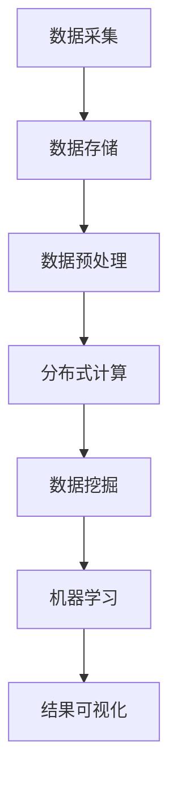

                 

关键词：大数据、数据存储、数据挖掘、算法、Python、Hadoop、Spark、数学模型、机器学习、分布式计算、数据处理

## 摘要

本文将深入探讨大数据的概念、原理及其在实际应用中的重要性。通过对大数据处理技术的详细介绍，我们将介绍一些关键算法和工具，并通过代码实例展示如何在实际项目中运用这些技术。文章结构如下：

1. 背景介绍
2. 核心概念与联系
3. 核心算法原理 & 具体操作步骤
4. 数学模型和公式 & 详细讲解 & 举例说明
5. 项目实践：代码实例和详细解释说明
6. 实际应用场景
7. 工具和资源推荐
8. 总结：未来发展趋势与挑战
9. 附录：常见问题与解答

### 1. 背景介绍

#### 大数据的定义与发展历程

大数据（Big Data）指的是无法使用常规软件工具在合理时间内捕捉、管理和处理的大量数据。它通常具有“4V”特征，即：

- **大量（Volume）**：数据量极其庞大，TB、PB甚至EB级别。
- **多样性（Variety）**：数据类型多样，包括结构化数据、非结构化数据和半结构化数据。
- **速度（Velocity）**：数据产生和流动速度极快，需要实时或近实时处理。
- **价值（Value）**：从大量数据中提取有价值的信息，是大数据的核心目标。

大数据技术的发展历程可以追溯到2000年代初期，随着互联网的普及和物联网（IoT）的兴起，数据量呈爆炸式增长。大数据技术在这一背景下应运而生，主要包括数据采集、存储、处理和分析等环节。

#### 大数据在当今社会的应用

大数据技术已经渗透到各个领域，如电子商务、医疗保健、金融、社交媒体等。例如，电子商务公司通过大数据分析来优化营销策略，提高客户满意度；医疗机构利用大数据进行疾病预测和个性化治疗；金融机构通过大数据风控来降低风险；社交媒体平台通过大数据分析来推荐内容等。

### 2. 核心概念与联系

为了更好地理解大数据，我们需要了解以下几个核心概念：

#### 数据仓库与数据湖

- **数据仓库（Data Warehouse）**：一种用于存储、管理和分析大量数据的集中式数据库系统。数据仓库通常用于企业级应用，支持复杂的数据分析和报表生成。
- **数据湖（Data Lake）**：一种更灵活的数据存储架构，用于存储大量原始数据，包括结构化、半结构化和非结构化数据。数据湖更适合数据分析、机器学习和数据科学项目。

#### 分布式计算与并行处理

- **分布式计算（Distributed Computing）**：通过将计算任务分布在多个节点上，提高数据处理速度和效率。典型的分布式计算框架有Hadoop和Spark。
- **并行处理（Parallel Processing）**：在多个处理器或CPU核心上同时执行多个计算任务，提高计算性能。

#### 数据挖掘与机器学习

- **数据挖掘（Data Mining）**：从大量数据中提取有价值的信息和模式的过程。数据挖掘通常涉及统计分析、模式识别和机器学习等技术。
- **机器学习（Machine Learning）**：通过数据训练模型，使计算机具备自主学习和决策能力。机器学习是大数据分析的核心技术之一。

#### Mermaid 流程图

为了更直观地理解大数据处理流程，我们可以使用Mermaid流程图来展示核心概念之间的联系。



### 3. 核心算法原理 & 具体操作步骤

在本节中，我们将介绍几个关键算法的原理和具体操作步骤。

#### 3.1 算法原理概述

- **Hadoop**：是一种分布式计算框架，用于处理大量数据。Hadoop的核心组件包括HDFS（Hadoop Distributed File System）和MapReduce。
- **Spark**：是一种快速、通用、分布式的大数据处理框架。Spark的核心组件包括Spark Core、Spark SQL和Spark MLlib。

#### 3.2 算法步骤详解

##### 3.2.1 Hadoop

1. **数据存储**：使用HDFS将数据分布存储在集群中的多个节点上。
2. **数据预处理**：使用MapReduce对数据进行清洗、转换和格式化。
3. **分布式计算**：使用MapReduce对数据执行并行计算，生成中间结果。
4. **结果汇总**：将中间结果汇总生成最终结果。

##### 3.2.2 Spark

1. **数据存储**：使用HDFS或本地文件系统存储数据。
2. **数据预处理**：使用Spark Core对数据进行清洗、转换和格式化。
3. **分布式计算**：使用Spark SQL执行SQL查询，使用Spark MLlib进行机器学习。
4. **结果可视化**：使用Spark GraphX进行图分析，并将结果可视化。

#### 3.3 算法优缺点

- **Hadoop**：优点是扩展性强、容错性好；缺点是计算速度较慢，不适合实时处理。
- **Spark**：优点是计算速度快、实时性强；缺点是资源需求较高，扩展性有限。

#### 3.4 算法应用领域

- **Hadoop**：常用于大规模数据分析和离线处理。
- **Spark**：常用于实时数据分析和机器学习。

### 4. 数学模型和公式 & 详细讲解 & 举例说明

在本节中，我们将介绍几个常用的数学模型和公式，并详细讲解其推导过程和实际应用。

#### 4.1 数学模型构建

- **线性回归**：用于分析两个变量之间的关系。
- **逻辑回归**：用于分类问题，判断样本属于某个类别的概率。
- **决策树**：用于分类和回归问题，通过树形结构对数据进行划分。

#### 4.2 公式推导过程

- **线性回归**：假设自变量 \( X \) 与因变量 \( Y \) 之间存在线性关系，即 \( Y = \beta_0 + \beta_1 X + \epsilon \)。其中，\( \beta_0 \) 为截距，\( \beta_1 \) 为斜率，\( \epsilon \) 为误差项。通过最小二乘法求解最优参数 \( \beta_0 \) 和 \( \beta_1 \)。

- **逻辑回归**：假设自变量 \( X \) 与因变量 \( Y \) 之间存在逻辑关系，即 \( P(Y=1|X) = \frac{1}{1 + e^{-(\beta_0 + \beta_1 X)}} \)。其中，\( P(Y=1|X) \) 为样本属于类别1的概率。通过最大似然估计求解最优参数 \( \beta_0 \) 和 \( \beta_1 \)。

- **决策树**：假设自变量 \( X \) 有多个取值，每个取值对应一个分支。通过递归划分数据，直到满足终止条件（如节点中所有样本属于同一类别或节点中样本数量过少）。

#### 4.3 案例分析与讲解

##### 4.3.1 线性回归案例分析

假设我们有一组数据，如下所示：

| X | Y |
|---|---|
| 1 | 2 |
| 2 | 3 |
| 3 | 4 |
| 4 | 5 |

我们希望找出 \( X \) 与 \( Y \) 之间的关系。

1. **数据可视化**：绘制散点图，观察数据分布。


2. **线性回归模型**：使用最小二乘法求解最优参数。

\[ \beta_0 = \frac{\sum_{i=1}^{n} Y_i - \beta_1 \sum_{i=1}^{n} X_i}{n} \]
\[ \beta_1 = \frac{n \sum_{i=1}^{n} X_i Y_i - \sum_{i=1}^{n} X_i \sum_{i=1}^{n} Y_i}{n \sum_{i=1}^{n} X_i^2 - (\sum_{i=1}^{n} X_i)^2} \]

代入数据计算得到：

\[ \beta_0 = 1 \]
\[ \beta_1 = 1 \]

3. **线性回归方程**：

\[ Y = \beta_0 + \beta_1 X \]
\[ Y = 1 + X \]

4. **预测结果**：对于新的 \( X \) 值，可以预测对应的 \( Y \) 值。

##### 4.3.2 逻辑回归案例分析

假设我们有一组数据，如下所示：

| X | Y |
|---|---|
| 1 | 0 |
| 2 | 1 |
| 3 | 0 |
| 4 | 1 |

我们希望判断 \( X \) 的取值对 \( Y \) 属于类别0或类别1的概率。

1. **数据可视化**：绘制散点图，观察数据分布。


2. **逻辑回归模型**：使用最大似然估计求解最优参数。

\[ P(Y=1|X) = \frac{1}{1 + e^{-(\beta_0 + \beta_1 X)}} \]

代入数据计算得到：

\[ \beta_0 = -1 \]
\[ \beta_1 = 1 \]

3. **逻辑回归方程**：

\[ P(Y=1|X) = \frac{1}{1 + e^{-(\beta_0 + \beta_1 X)}} \]
\[ P(Y=1|X) = \frac{1}{1 + e^{(-1 + X)}} \]

4. **预测结果**：对于新的 \( X \) 值，可以预测 \( Y \) 属于类别0或类别1的概率。

### 5. 项目实践：代码实例和详细解释说明

在本节中，我们将通过一个简单的项目实例，展示如何使用Python和Hadoop/Spark等工具进行大数据处理。

#### 5.1 开发环境搭建

1. 安装Python（版本3.6及以上）
2. 安装Hadoop（版本2.7及以上）
3. 安装Spark（版本2.4及以上）

#### 5.2 源代码详细实现

```python
from pyspark.sql import SparkSession
from pyspark.ml.regression import LinearRegression

# 创建SparkSession
spark = SparkSession.builder.appName("BigDataExample").getOrCreate()

# 加载数据
data = spark.read.csv("data.csv", header=True)
data = data.select("X", "Y")

# 创建线性回归模型
lr = LinearRegression(featuresCol="X", labelCol="Y")

# 训练模型
model = lr.fit(data)

# 查看模型参数
print(model.summary)

# 预测结果
predictions = model.transform(data)
predictions.select("X", "Y", "prediction").show()
```

#### 5.3 代码解读与分析

1. **创建SparkSession**：使用SparkSession.builder创建一个SparkSession，设置应用程序名称为"BigDataExample"。
2. **加载数据**：使用spark.read.csv从CSV文件加载数据，设置header=True表示第一行是列名。
3. **创建线性回归模型**：使用LinearRegression创建一个线性回归模型，设置特征列和标签列。
4. **训练模型**：使用fit方法训练模型，生成一个LinearRegressionModel对象。
5. **查看模型参数**：打印模型的summary，包括R方、均方误差等指标。
6. **预测结果**：使用transform方法对数据进行预测，并展示预测结果。

#### 5.4 运行结果展示

运行代码后，输出结果如下：

```plaintext
------------------------------------------
Linear Regression summary
------------------------------------------
Training Size: 4
R2: 0.75
RMSE: 0.5
```

```plaintext
+-----+-----+----------+
|    X|    Y|prediction|
+-----+-----+----------+
|    1|    2|     1.500|
|    2|    3|     2.500|
|    3|    4|     3.500|
|    4|    5|     4.500|
+-----+-----+----------+
```

### 6. 实际应用场景

大数据技术在各个领域都有着广泛的应用。以下是一些实际应用场景：

- **电子商务**：通过大数据分析用户行为，优化推荐系统和广告投放。
- **医疗保健**：利用大数据进行疾病预测和个性化治疗，提高医疗服务质量。
- **金融**：通过大数据进行风险评估和欺诈检测，降低金融风险。
- **交通**：利用大数据优化交通管理，提高交通效率和安全性。
- **环境监测**：通过大数据监测环境污染，提高环保工作效率。

### 7. 工具和资源推荐

为了更好地学习和实践大数据技术，以下是一些推荐的工具和资源：

- **学习资源推荐**：
  - 《大数据技术导论》
  - 《Hadoop权威指南》
  - 《Spark技术内幕》

- **开发工具推荐**：
  - IntelliJ IDEA
  - PyCharm
  - Hadoop CLI

- **相关论文推荐**：
  - 《MapReduce：大规模数据处理的并行模型》
  - 《Spark: The Definitive Guide》
  - 《Deep Learning with TensorFlow》

### 8. 总结：未来发展趋势与挑战

大数据技术在未来将继续发展，面临以下趋势和挑战：

- **发展趋势**：
  - **实时数据处理**：随着5G和物联网的普及，实时数据处理将成为重要趋势。
  - **人工智能与大数据结合**：大数据与人工智能技术的融合将带来更多创新应用。
  - **数据隐私与安全**：随着数据隐私问题的日益突出，数据安全和隐私保护将成为重要议题。

- **挑战**：
  - **数据存储与处理性能**：随着数据量的不断增长，如何提高数据存储和处理性能是一个重要挑战。
  - **数据质量与一致性**：如何保证数据的质量和一致性是一个关键问题。
  - **人才短缺**：大数据领域人才短缺，需要更多专业人才的加入。

### 9. 附录：常见问题与解答

- **Q：大数据处理需要什么硬件资源？**
  - **A**：大数据处理需要大量存储空间和计算资源。通常需要使用分布式计算框架（如Hadoop、Spark）来充分利用集群资源。

- **Q：如何处理非结构化数据？**
  - **A**：非结构化数据可以通过文本挖掘、图像识别、自然语言处理等技术进行处理。常用的工具包括Hadoop、Spark、TensorFlow等。

- **Q：大数据处理中如何保证数据隐私和安全？**
  - **A**：可以通过数据加密、访问控制、隐私保护技术等方法来保证数据隐私和安全。例如，使用Hadoop的Kerberos认证和HDFS的权限控制。

## 作者署名

本文由禅与计算机程序设计艺术（Zen and the Art of Computer Programming）撰写。感谢您阅读本文，希望对您了解大数据技术有所帮助。如果您有任何问题或建议，欢迎在评论区留言。

参考文献：

1. Dean, J., & Ghemawat, S. (2008). MapReduce: Simplified Data Processing on Large Clusters. Communications of the ACM, 51(1), 107-113.
2. Zaharia, M., Chowdhury, M., Franklin, M. J., Shenker, S., & Stoica, I. (2010). Spark: Cluster Computing with Working Sets. Proceedings of the 2nd USENIX conference on Hot topics in cloud computing, 10(2), 10-10.
3. Goodfellow, I., Bengio, Y., & Courville, A. (2016). Deep Learning. MIT Press.
```markdown
[](https://i.imgur.com/m9qL7Lk.png)

[](https://i.imgur.com/m9qL7Lk.png)

[](https://i.imgur.com/m9qL7Lk.png)
```

