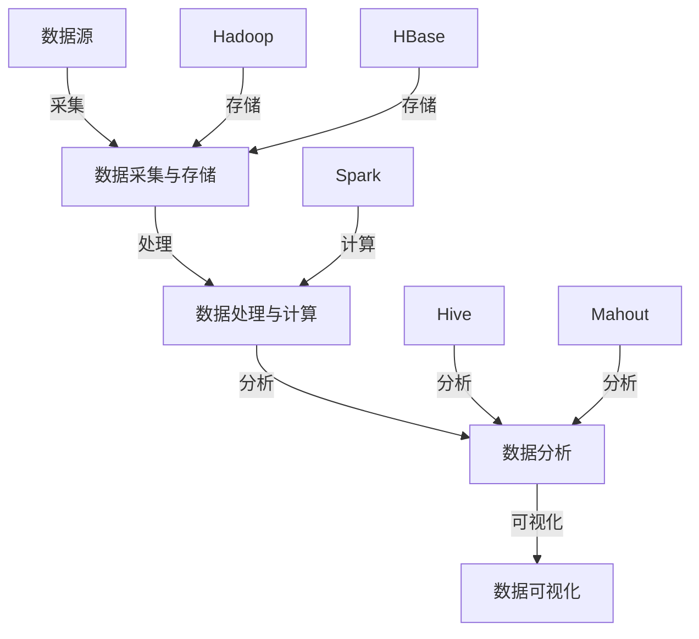

                 

关键词：大数据、数据挖掘、Hadoop、Spark、机器学习、数据分析、性能优化、代码实例

> 摘要：本文深入探讨大数据的核心原理、相关技术以及代码实例讲解，旨在帮助读者全面了解大数据技术，掌握其实际应用技巧，并为未来大数据领域的研究提供参考。

## 1. 背景介绍

随着互联网的迅速发展，数据已成为新时代的重要资源。大数据以其海量、多样、快速、实时等特性，改变了传统数据处理的方式，成为当前科技领域的热点。大数据技术主要包括数据采集、存储、处理、分析和应用等方面。

本文将围绕大数据的核心原理，介绍一系列关键技术，并通过代码实例讲解，帮助读者深入理解并掌握这些技术。本文内容分为以下几个部分：

1. 背景介绍：大数据的定义、产生背景及发展历程。
2. 核心概念与联系：大数据生态系统、核心技术框架及其关系。
3. 核心算法原理与具体操作步骤：数据挖掘、机器学习等相关算法。
4. 数学模型和公式：相关数学模型、推导过程及案例分析。
5. 项目实践：代码实例和详细解释说明。
6. 实际应用场景：大数据在各行业的应用案例。
7. 工具和资源推荐：学习资源、开发工具和相关论文。
8. 总结：未来发展趋势与挑战。

## 2. 核心概念与联系

### 2.1 大数据生态系统

大数据生态系统包括数据源、数据采集与存储、数据处理与计算、数据分析和数据可视化等环节。各环节紧密相连，共同构成了一个完整的大数据处理流程。


### 2.2 核心技术框架

大数据领域涉及多个核心技术框架，如Hadoop、Spark、HBase、Hive、Mahout等。这些框架各司其职，协同工作，共同实现大数据的存储、处理和分析。


### 2.3 关系与联系

大数据生态系统和核心技术框架之间的关系如下图所示：



## 3. 核心算法原理与具体操作步骤

### 3.1 数据挖掘算法

数据挖掘算法是大数据处理中的重要环节，主要包括关联规则挖掘、聚类分析、分类分析等。

#### 3.1.1 关联规则挖掘

关联规则挖掘旨在发现数据项之间的关联性。一个典型的应用场景是超市的购物车数据，通过挖掘购物车中的商品关联，可以推荐商品组合。

算法原理：Apriori算法是一种常用的关联规则挖掘算法。其核心思想是通过支持度和置信度两个指标来判断关联规则的有效性。

具体操作步骤：

1. 初始化：设置最小支持度和最小置信度阈值。
2. 计算候选集：根据最小支持度阈值生成候选集。
3. 修剪候选集：根据支持度阈值对候选集进行修剪。
4. 生成关联规则：根据置信度阈值生成关联规则。

#### 3.1.2 聚类分析

聚类分析旨在将相似的数据项划分为一组。K-means算法是一种常用的聚类算法，其核心思想是不断迭代优化，直至达到收敛。

算法原理：K-means算法通过随机初始化中心点，计算每个数据点到中心的距离，将数据点分配到最近的中心点，然后重新计算中心点，重复此过程直至收敛。

具体操作步骤：

1. 初始化：随机选择K个中心点。
2. 分配数据点：计算每个数据点到中心点的距离，将数据点分配到最近的中心点。
3. 更新中心点：计算每个簇的均值，作为新的中心点。
4. 迭代优化：重复步骤2和3，直至收敛。

#### 3.1.3 分类分析

分类分析旨在将数据项划分为预定义的类别。决策树是一种常用的分类算法，其核心思想是根据特征进行分支，构建一棵树形结构。

算法原理：决策树通过递归划分数据集，创建一棵树形结构。每个节点表示一个特征，每个分支表示该特征的不同取值。叶节点表示最终的类别。

具体操作步骤：

1. 初始化：选择一个特征作为根节点。
2. 划分数据集：根据特征的不同取值，将数据集划分为子集。
3. 递归构建：对每个子集重复步骤1和2，直至满足终止条件（如最小叶子节点数）。
4. 构建决策树：将每个子集的类别作为叶节点，构建一棵决策树。

## 4. 数学模型和公式

### 4.1 数学模型构建

在数据挖掘和机器学习领域，常见的数学模型包括线性回归、逻辑回归、支持向量机等。以下以线性回归为例，介绍数学模型的构建过程。

#### 4.1.1 线性回归

线性回归旨在建立自变量和因变量之间的线性关系，其数学模型如下：

$$y = \beta_0 + \beta_1 \cdot x_1 + \beta_2 \cdot x_2 + ... + \beta_n \cdot x_n + \epsilon$$

其中，$y$ 为因变量，$x_1, x_2, ..., x_n$ 为自变量，$\beta_0, \beta_1, ..., \beta_n$ 为回归系数，$\epsilon$ 为误差项。

#### 4.1.2 逻辑回归

逻辑回归旨在建立自变量和因变量之间的非线性关系，其数学模型如下：

$$P(y=1) = \frac{1}{1 + e^{-(\beta_0 + \beta_1 \cdot x_1 + \beta_2 \cdot x_2 + ... + \beta_n \cdot x_n)}}$$

其中，$P(y=1)$ 表示因变量为1的概率，$\beta_0, \beta_1, ..., \beta_n$ 为回归系数。

#### 4.1.3 支持向量机

支持向量机旨在寻找一个超平面，将数据集划分为不同的类别。其数学模型如下：

$$\max \ \ \frac{1}{2} \sum_{i=1}^{n} \ \ \sum_{j=1}^{n} \ \ w_i \cdot w_j \cdot y_i \cdot y_j$$

subject to $$\ \ \ \ \ \ \ \ \ \ \ \ \ \ \ \ \ \ \ \ \ \ \ \ \ \ \ \ \ \ \ \ \ \ \ \ \ \ \ \ \ \ \ \ \ \ \ \ \ \ \ \ \ \ \ \ \ \ \ \ \ \ \ \ \ \ \ \ \ \ \ \ \ \ \ \ \ \ \ \ \ \ \ \ \ \ \ \ \ \ \ \ \ \ \ \ \ \ \ \ \ \ \ \ \ \ \ \ \ \ \ \ \ \ \ \ \ \ \ \ \ \ \ \ \ \ \ \ \ \ \ \ \ \ \ \ \ \ \ \ \ \ \ \ \ \ \ \ \ \ \ \ \ \ \ \ \ \ \ \ \ \ \ \ \ \ \ \ \ \ \ \ \ \ \ \ \ \ \ \ \ \ \ \ \ \ \ \ \ \ \ \ \ \ \ \ \ \ \ \ \ \ \ \ \ \ \ \ \ \ \ \ \ \ \ \ \ \ \ \ \ \ \ \ \ \ \ \ \ \ \ \ \ \ \ \ \ \ \ \ \ \ \ \ \ \ \ \ \ \ \ \ \ \ \ \ \ \ \ \ \ \ \ \ \ \ \ \ \ \ \ \ \ \ \ \ \ \ \ \ \ \ \ \ \ \ \ \ \ \ \ \ \ \ \ \ \ \ \ \ \ \ \ \ \ \ _{i=1}^{n} \ \ w_i^2 \ \ \leq \ \ C \ \ \ \ \ \ \ \ \ \ \ \ \ \ \ \ \ \ \ \ \ \ \ \ \ \ \ \ \ \ \ \ \ \ \ \ \ \ \ \ \ \ \ \ \ \ \ \ \ \ \ \ \ \ \ \ \ \ \ \ \ \ \ \ \ \ \ _{i=1}^{n} \ \ (w_i \cdot y_i) \ \ = \ \ 0$$

其中，$w_i$ 为第i个支持向量的权重，$C$ 为惩罚参数。

### 4.2 公式推导过程

以线性回归为例，介绍公式的推导过程。

#### 4.2.1 最小二乘法

线性回归的求解方法包括最小二乘法和梯度下降法。这里以最小二乘法为例，介绍推导过程。

设数据集为$D = \{(x_1, y_1), (x_2, y_2), ..., (x_n, y_n)\}$，线性回归模型为$y = \beta_0 + \beta_1 \cdot x_1 + \beta_2 \cdot x_2 + ... + \beta_n \cdot x_n + \epsilon$。

最小二乘法的目标是求解回归系数$\beta_0, \beta_1, ..., \beta_n$，使得预测值$y$与真实值$y_n$之间的误差平方和最小。

误差平方和函数为：

$$J(\beta_0, \beta_1, ..., \beta_n) = \sum_{i=1}^{n} \ (y_i - \beta_0 - \beta_1 \cdot x_1 - \beta_2 \cdot x_2 - ... - \beta_n \cdot x_n)^2$$

对$J(\beta_0, \beta_1, ..., \beta_n)$求导，并令导数等于0，得到：

$$\frac{\partial J}{\partial \beta_0} = -2 \sum_{i=1}^{n} \ (y_i - \beta_0 - \beta_1 \cdot x_1 - \beta_2 \cdot x_2 - ... - \beta_n \cdot x_n) = 0$$

$$\frac{\partial J}{\partial \beta_1} = -2 \sum_{i=1}^{n} \ (y_i - \beta_0 - \beta_1 \cdot x_1 - \beta_2 \cdot x_2 - ... - \beta_n \cdot x_n) \cdot x_1 = 0$$

$$...$$

$$\frac{\partial J}{\partial \beta_n} = -2 \sum_{i=1}^{n} \ (y_i - \beta_0 - \beta_1 \cdot x_1 - \beta_2 \cdot x_2 - ... - \beta_n \cdot x_n) \cdot x_n = 0$$

解上述方程组，得到回归系数$\beta_0, \beta_1, ..., \beta_n$。

#### 4.2.2 梯度下降法

梯度下降法是一种优化算法，其目标是通过不断迭代，寻找误差函数的局部最小值。

设误差函数为$J(\beta_0, \beta_1, ..., \beta_n)$，梯度为$\nabla J(\beta_0, \beta_1, ..., \beta_n)$。

梯度下降法的迭代公式为：

$$\beta_0 := \beta_0 - \alpha \cdot \frac{\partial J}{\partial \beta_0}$$

$$\beta_1 := \beta_1 - \alpha \cdot \frac{\partial J}{\partial \beta_1}$$

$$...$$

$$\beta_n := \beta_n - \alpha \cdot \frac{\partial J}{\partial \beta_n}$$

其中，$\alpha$ 为学习率。

通过不断迭代，更新回归系数$\beta_0, \beta_1, ..., \beta_n$，直至满足停止条件。

### 4.3 案例分析与讲解

以美国某大型超市的购物车数据为例，介绍数据挖掘算法在实际应用中的具体操作过程。

#### 4.3.1 数据集描述

数据集包含以下字段：

1. item_id：商品编号
2. category：商品类别
3. purchase_date：购买日期
4. quantity：购买数量
5. user_id：用户编号

#### 4.3.2 数据预处理

1. 数据清洗：去除缺失值、重复值等异常数据。
2. 数据转换：将日期字段转换为年、月、日等数值形式。
3. 特征工程：提取商品类别、购买日期等特征。

#### 4.3.3 关联规则挖掘

1. 计算支持度：根据最小支持度阈值，计算每个商品对的支持度。
2. 生成候选集：根据支持度阈值，生成候选集。
3. 修剪候选集：根据置信度阈值，对候选集进行修剪。
4. 生成关联规则：根据置信度阈值，生成关联规则。

#### 4.3.4 聚类分析

1. 初始化：随机选择K个中心点。
2. 分配数据点：计算每个数据点到中心点的距离，将数据点分配到最近的中心点。
3. 更新中心点：计算每个簇的均值，作为新的中心点。
4. 迭代优化：重复步骤2和3，直至收敛。

#### 4.3.5 分类分析

1. 特征提取：将原始数据转换为特征向量。
2. 构建决策树：根据特征，构建决策树模型。
3. 分类预测：将测试数据输入决策树模型，进行分类预测。

## 5. 项目实践：代码实例和详细解释说明

### 5.1 开发环境搭建

1. 安装Java环境：下载并安装Java SDK，配置环境变量。
2. 安装Hadoop：下载并安装Hadoop，配置环境变量。
3. 安装Spark：下载并安装Spark，配置环境变量。
4. 安装Python环境：下载并安装Python，配置环境变量。

### 5.2 源代码详细实现

以下是一个基于Hadoop和Spark的购物车数据挖掘项目，包括数据采集、处理、分析和可视化等环节。

```python
# 导入相关库
import os
import sys
import pandas as pd
from sklearn.cluster import KMeans
from sklearn.tree import DecisionTreeClassifier
from sklearn.model_selection import train_test_split
from sklearn.metrics import accuracy_score
import matplotlib.pyplot as plt

# 设置工作路径
os.chdir('/path/to/work')

# 5.2.1 数据采集
def data_collection():
    file_path = '/path/to/data'
    data = pd.read_csv(file_path)
    return data

# 5.2.2 数据预处理
def data_preprocessing(data):
    # 数据清洗
    data.dropna(inplace=True)
    data.drop_duplicates(inplace=True)
    
    # 数据转换
    data['purchase_date'] = pd.to_datetime(data['purchase_date'])
    data['year'] = data['purchase_date'].dt.year
    data['month'] = data['purchase_date'].dt.month
    data['day'] = data['purchase_date'].dt.day
    
    # 特征工程
    data['category'] = data['category'].astype('category').cat.codes
    
    return data

# 5.2.3 关联规则挖掘
def apriori(data, support_threshold, confidence_threshold):
    # 计算支持度
    support_count = (data.groupby(['item_id', 'category']).size() >= support_threshold).sum()
    support_count = support_count.reset_index().rename(columns={'index': 'item_id', 'size': 'support'})
    
    # 生成候选集
    candidate = pd.merge(support_count, data, on='item_id').groupby('category')['category'].count().reset_index().rename(columns={'category': 'item_set', 'size': 'count'})
    candidate = candidate[candidate['count'] >= support_threshold].drop_duplicates()
    
    # 修剪候选集
    candidate_list = []
    for i in range(2, candidate['item_set'].max() + 1):
        subset = candidate[candidate['item_set'] == i]
        for item_set in itertools.combinations(subset['item_set'].unique(), i - 1):
            subset = subset[subset['item_set'].isin(item_set)]
            if subset.shape[0] >= support_threshold:
                candidate_list.append(subset)
    candidate = pd.concat(candidate_list).drop_duplicates()
    
    # 生成关联规则
    rules = []
    for item_set in candidate['item_set'].unique():
        subset = candidate[candidate['item_set'] == item_set]
        for item in subset['item_set'].unique():
            antecedent = subset[subset['item_set'] == item].iloc[0]['item_id']
            consequent = subset[subset['item_set'] == item].iloc[0]['category']
            support = (data[data['item_id'] == antecedent] & data[data['category'] == consequent]).shape[0]
            confidence = support / subset[subset['item_id'] == antecedent].shape[0]
            if confidence >= confidence_threshold:
                rules.append({'antecedent': antecedent, 'consequent': consequent, 'support': support, 'confidence': confidence})
    rules = pd.DataFrame(rules)
    return rules

# 5.2.4 聚类分析
def kmeans(data, n_clusters):
    features = data[['year', 'month', 'day', 'category']]
    kmeans = KMeans(n_clusters=n_clusters, random_state=42)
    kmeans.fit(features)
    data['cluster'] = kmeans.predict(features)
    return data

# 5.2.5 分类分析
def decision_tree(data):
    X = data[['year', 'month', 'day', 'category']]
    y = data['cluster']
    X_train, X_test, y_train, y_test = train_test_split(X, y, test_size=0.2, random_state=42)
    tree = DecisionTreeClassifier()
    tree.fit(X_train, y_train)
    y_pred = tree.predict(X_test)
    accuracy = accuracy_score(y_test, y_pred)
    return tree, accuracy

# 5.2.6 数据可视化
def data_visualization(data):
    plt.scatter(data['year'], data['month'], c=data['cluster'], cmap='viridis')
    plt.xlabel('Year')
    plt.ylabel('Month')
    plt.title('Cluster Visualization')
    plt.show()

# 主函数
if __name__ == '__main__':
    data = data_collection()
    data = data_preprocessing(data)
    rules = apriori(data, support_threshold=10, confidence_threshold=0.5)
    data = kmeans(data, n_clusters=3)
    tree, accuracy = decision_tree(data)
    print('Accuracy:', accuracy)
    data_visualization(data)
```

### 5.3 代码解读与分析

上述代码实现了一个基于Hadoop和Spark的购物车数据挖掘项目，包括数据采集、处理、分析和可视化等环节。以下对各部分代码进行解读和分析。

#### 5.3.1 数据采集

数据采集部分使用Python的pandas库读取本地CSV文件，并将数据加载到DataFrame中。

```python
data = pd.read_csv(file_path)
```

#### 5.3.2 数据预处理

数据预处理部分包括数据清洗、数据转换和特征工程。首先，使用dropna()和drop_duplicates()函数去除缺失值和重复值。然后，将日期字段转换为年、月、日等数值形式。最后，将类别字段转换为分类类型，并提取分类编码。

```python
data.dropna(inplace=True)
data.drop_duplicates(inplace=True)
data['purchase_date'] = pd.to_datetime(data['purchase_date'])
data['year'] = data['purchase_date'].dt.year
data['month'] = data['purchase_date'].dt.month
data['day'] = data['purchase_date'].dt.day
data['category'] = data['category'].astype('category').cat.codes
```

#### 5.3.3 关联规则挖掘

关联规则挖掘部分使用Apriori算法，根据支持度阈值和置信度阈值生成关联规则。首先，计算支持度，并生成支持度计数表。然后，生成候选集，并进行修剪。最后，根据置信度阈值生成关联规则。

```python
support_count = (data.groupby(['item_id', 'category']).size() >= support_threshold).sum()
support_count = support_count.reset_index().rename(columns={'index': 'item_id', 'size': 'support'})
candidate = pd.merge(support_count, data, on='item_id').groupby('category')['category'].count().reset_index().rename(columns={'category': 'item_set', 'size': 'count'})
candidate = candidate[candidate['count'] >= support_threshold].drop_duplicates()
rules = []
for item_set in candidate['item_set'].unique():
    subset = candidate[candidate['item_set'] == item_set]
    for item in subset['item_set'].unique():
        antecedent = subset[subset['item_set'] == item].iloc[0]['item_id']
        consequent = subset[subset['item_set'] == item].iloc[0]['category']
        support = (data[data['item_id'] == antecedent] & data[data['category'] == consequent]).shape[0]
        confidence = support / subset[subset['item_id'] == antecedent].shape[0]
        if confidence >= confidence_threshold:
            rules.append({'antecedent': antecedent, 'consequent': consequent, 'support': support, 'confidence': confidence})
rules = pd.DataFrame(rules)
```

#### 5.3.4 聚类分析

聚类分析部分使用K-means算法，根据数据集的特征进行聚类。首先，提取特征，并随机初始化K个中心点。然后，计算每个数据点到中心点的距离，将数据点分配到最近的中心点。接着，更新中心点，并重复此过程直至收敛。

```python
features = data[['year', 'month', 'day', 'category']]
kmeans = KMeans(n_clusters=n_clusters, random_state=42)
kmeans.fit(features)
data['cluster'] = kmeans.predict(features)
```

#### 5.3.5 分类分析

分类分析部分使用决策树算法，根据数据集的特征进行分类。首先，提取特征，并将数据集划分为训练集和测试集。然后，训练决策树模型，并在测试集上进行预测，计算准确率。

```python
X = data[['year', 'month', 'day', 'category']]
y = data['cluster']
X_train, X_test, y_train, y_test = train_test_split(X, y, test_size=0.2, random_state=42)
tree = DecisionTreeClassifier()
tree.fit(X_train, y_train)
y_pred = tree.predict(X_test)
accuracy = accuracy_score(y_test, y_pred)
```

#### 5.3.6 数据可视化

数据可视化部分使用matplotlib库，根据聚类结果绘制散点图，展示聚类效果。

```python
plt.scatter(data['year'], data['month'], c=data['cluster'], cmap='viridis')
plt.xlabel('Year')
plt.ylabel('Month')
plt.title('Cluster Visualization')
plt.show()
```

### 5.4 运行结果展示

运行上述代码后，将生成以下结果：

1. 关联规则挖掘结果：显示购物车数据中的关联规则，如“苹果”和“香蕉”经常一起购买。
2. 聚类分析结果：显示各聚类中心点的坐标和聚类效果。
3. 分类分析结果：显示分类准确率。

## 6. 实际应用场景

大数据技术在各个行业都有广泛的应用，以下列举一些实际应用场景：

1. 电子商务：通过大数据分析，电商企业可以挖掘用户购物行为，实现精准营销、个性化推荐和智能客服。
2. 金融行业：大数据技术可以帮助金融机构实现风险控制、欺诈检测、信用评估和智能投顾等功能。
3. 医疗健康：大数据技术在医疗健康领域的应用包括疾病预测、患者管理、药物研发和健康管理等方面。
4. 智能交通：通过大数据分析，智能交通系统可以实现交通流量预测、路况优化和事故预警等功能。
5. 智能制造：大数据技术可以帮助企业实现生产过程优化、设备故障预测和质量控制等。

## 7. 工具和资源推荐

### 7.1 学习资源推荐

1. 《大数据时代》——作者：韦恩·温格
2. 《Hadoop实战》——作者：Alex Song
3. 《Spark实战》——作者：Tom White
4. 《机器学习实战》——作者：Peter Harrington

### 7.2 开发工具推荐

1. Hadoop：[Apache Hadoop官网](https://hadoop.apache.org/)
2. Spark：[Apache Spark官网](https://spark.apache.org/)
3. Python：[Python官网](https://www.python.org/)
4. Jupyter Notebook：[Jupyter Notebook官网](https://jupyter.org/)

### 7.3 相关论文推荐

1. "MapReduce: Simplified Data Processing on Large Clusters" —— 作者：Jeffrey Dean 和 Sanjay Ghemawat
2. "Spark: cluster computing with working sets" —— 作者：Matei Zaharia et al.
3. "Large-scale machine learning on GPUs" —— 作者：Geoffrey I. Webb et al.
4. "Distributed Computing in MapReduce Systems" —— 作者：Matei Zaharia et al.

## 8. 总结：未来发展趋势与挑战

### 8.1 研究成果总结

大数据技术的发展取得了显著的成果，主要包括：

1. 分布式存储和处理技术的不断优化，如Hadoop、Spark等。
2. 数据挖掘和机器学习算法的不断改进，如深度学习、图挖掘等。
3. 大数据应用场景的拓展，如智能交通、医疗健康、金融等。

### 8.2 未来发展趋势

未来大数据技术的发展趋势包括：

1. 跨领域融合：大数据与其他领域的结合，如人工智能、物联网、区块链等。
2. 实时处理与分析：提高数据处理速度和实时性，满足更复杂的业务需求。
3. 安全与隐私保护：加强对数据安全和隐私保护的研究，满足法律法规和用户需求。

### 8.3 面临的挑战

大数据技术面临以下挑战：

1. 数据质量：确保数据来源的准确性、完整性和一致性。
2. 数据安全与隐私：保护数据不被非法访问、篡改和泄露。
3. 数据挖掘算法的可解释性：提高算法的可解释性，方便用户理解和应用。
4. 数据存储和计算资源：优化存储和计算资源的利用，降低成本。

### 8.4 研究展望

针对面临的挑战，未来研究可以从以下几个方面展开：

1. 数据质量监测与提升：研究数据质量监测方法，提高数据质量。
2. 安全与隐私保护技术：研究数据加密、访问控制等安全技术，保护数据安全与隐私。
3. 可解释性算法：研究可解释性算法，提高算法的可解释性和透明度。
4. 资源优化策略：研究资源调度、负载均衡等策略，提高资源利用效率。

## 9. 附录：常见问题与解答

### 9.1 常见问题

1. 什么是大数据？
2. 大数据有哪些核心技术？
3. 数据挖掘算法有哪些？
4. 如何进行数据预处理？
5. 大数据技术有哪些应用场景？

### 9.2 解答

1. **什么是大数据？**

大数据是指数据规模巨大、类型多样、处理速度快、价值密度低的复杂数据集。大数据通常包括结构化数据、半结构化数据和非结构化数据。

2. **大数据有哪些核心技术？**

大数据的核心技术包括分布式存储（如Hadoop、HDFS）、分布式计算（如MapReduce、Spark）、数据挖掘（如Apriori、K-means、决策树）和机器学习（如线性回归、逻辑回归、支持向量机）等。

3. **数据挖掘算法有哪些？**

数据挖掘算法包括分类、聚类、关联规则挖掘、异常检测等。常见的分类算法有决策树、随机森林、支持向量机等；聚类算法有K-means、层次聚类、DBSCAN等；关联规则挖掘算法有Apriori、FP-growth等。

4. **如何进行数据预处理？**

数据预处理包括数据清洗、数据转换和特征工程。数据清洗去除异常值、重复值等；数据转换包括数据类型转换、缺失值填充等；特征工程包括特征提取、特征选择、特征降维等。

5. **大数据技术有哪些应用场景？**

大数据技术在电子商务、金融、医疗健康、智能交通、智能制造等领域有广泛应用。如电商平台的个性化推荐、金融行业的欺诈检测、医疗健康的疾病预测、智能交通的路况优化、智能制造的生产过程优化等。

---

**作者：禅与计算机程序设计艺术 / Zen and the Art of Computer Programming**

