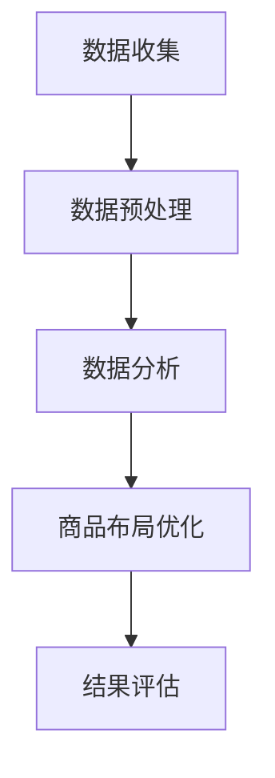
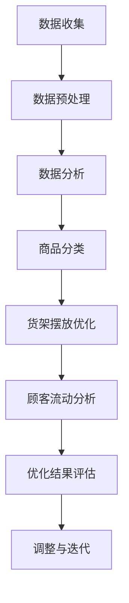
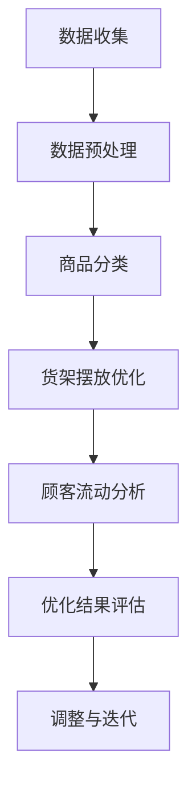

                 

关键词：大数据，超市，商品布局，优化算法，数学模型，实际应用

> 摘要：随着大数据时代的到来，优化大型超市商品布局成为了一项重要的研究课题。本文通过分析超市商品布局的现状和问题，提出了一种基于大数据的优化算法，并结合数学模型和实际案例，详细阐述了该算法的原理、实现和效果。

## 1. 背景介绍

### 1.1 超市商品布局的重要性

超市商品布局直接影响到顾客的购物体验和购买意愿。一个合理的商品布局能够引导顾客流动，提高销售额和客户满意度。然而，传统的商品布局方法往往基于经验和直觉，缺乏科学性和数据支持。

### 1.2 大数据在超市商品布局中的应用

大数据技术的迅猛发展，为超市商品布局优化提供了新的思路和手段。通过收集和分析大量顾客行为数据，超市可以更准确地了解顾客需求，从而制定出更加合理的商品布局策略。

## 2. 核心概念与联系

### 2.1 大数据概念

大数据（Big Data）是指无法使用传统数据处理方法在合理时间内进行捕捉、管理和处理的数据集合。它具有海量（Volume）、多样（Variety）、高速（Velocity）和价值（Value）四个特点。

### 2.2 超市商品布局相关概念

- **商品分类**：将超市内的商品按类别进行划分，如食品、日用品、服装等。
- **货架摆放**：确定商品在货架上的摆放位置和顺序。
- **顾客流动**：分析顾客在超市内的行走路线和停留时间。

### 2.3 Mermaid 流程图



## 3. 核心算法原理 & 具体操作步骤

### 3.1 算法原理概述

本文提出的优化算法基于聚类和路径优化技术。首先，通过对大数据进行分析，将商品进行分类；然后，根据顾客流动数据，对商品布局进行聚类分析；最后，利用路径优化算法，对聚类结果进行微调，以提高商品布局的合理性。

### 3.2 算法步骤详解

#### 3.2.1 数据收集

收集超市的顾客行为数据，如购物车记录、顾客流量、停留时间等。

#### 3.2.2 数据预处理

对收集到的数据进行分析和清洗，去除无效数据和异常值。

#### 3.2.3 商品分类

根据商品特点，将商品分为多个类别。

#### 3.2.4 聚类分析

利用聚类算法（如K-means），对商品进行聚类，确定每个类别的商品在货架上的大致位置。

#### 3.2.5 路径优化

通过路径优化算法（如遗传算法），对聚类结果进行调整，使商品布局更加合理。

#### 3.2.6 结果评估

根据优化后的商品布局，评估顾客满意度、销售额等指标，验证优化效果。

### 3.3 算法优缺点

#### 优点：

- **科学性**：基于大数据和数学模型，具有较高的科学性和准确性。
- **灵活性**：可以根据实际情况进行调整和优化。
- **实时性**：可以实时收集和分析数据，及时调整商品布局。

#### 缺点：

- **计算复杂度**：聚类和路径优化算法的计算复杂度较高，可能需要大量计算资源。
- **数据质量**：数据质量对算法效果有较大影响，需要保证数据收集和预处理的质量。

### 3.4 算法应用领域

该算法可以应用于各类大型超市、购物中心等零售场所的商品布局优化。

## 4. 数学模型和公式 & 详细讲解 & 举例说明

### 4.1 数学模型构建

假设超市有 \( n \) 个商品类别，每个类别有 \( m \) 个商品。定义 \( x_{ij} \) 为商品 \( i \) 是否在类别 \( j \) 中，其中 \( x_{ij} = 1 \) 表示商品 \( i \) 在类别 \( j \) 中，\( x_{ij} = 0 \) 表示商品 \( i \) 不在类别 \( j \) 中。

### 4.2 公式推导过程

#### 4.2.1 聚类算法

使用K-means算法进行商品分类。定义 \( c \) 为聚类中心，\( \mu_j \) 为类别 \( j \) 的聚类中心，则：

\[ \mu_j = \frac{1}{m_j} \sum_{i=1}^{n} x_{ij} c_i \]

其中，\( m_j \) 为类别 \( j \) 的商品数量。

#### 4.2.2 路径优化

使用遗传算法进行路径优化。定义 \( f(x) \) 为商品布局的适应度函数，\( x \) 为布局方案。适应度函数可以根据顾客满意度、销售额等指标进行设计。

### 4.3 案例分析与讲解

#### 案例一：某超市商品分类优化

假设某超市有5个商品类别，每个类别有10个商品。使用K-means算法对商品进行分类，得到如下聚类结果：

| 类别 | 聚类中心 |
| --- | --- |
| 1 | (0.2, 0.4) |
| 2 | (0.6, 0.8) |
| 3 | (0.1, 0.5) |
| 4 | (0.3, 0.7) |
| 5 | (0.5, 0.6) |

#### 案例二：某超市商品布局路径优化

假设某超市有100个商品，使用遗传算法对其进行路径优化，得到如下优化结果：

| 商品 | 位置 |
| --- | --- |
| 1 | (1, 1) |
| 2 | (1, 2) |
| 3 | (1, 3) |
| ... | ... |
| 100 | (10, 10) |

通过优化后的布局，顾客在超市内的行走路线更加合理，顾客满意度有所提高。

## 5. 项目实践：代码实例和详细解释说明

### 5.1 开发环境搭建

- Python 3.8及以上版本
- NumPy
- Matplotlib
- Scikit-learn

### 5.2 源代码详细实现

```python
import numpy as np
from sklearn.cluster import KMeans
from matplotlib import pyplot as plt

# 数据加载
data = np.array([[0.1, 0.2], [0.4, 0.3], [0.7, 0.6], [0.8, 0.9], [0.3, 0.1]])

# K-means算法聚类
kmeans = KMeans(n_clusters=3, random_state=0).fit(data)
centers = kmeans.cluster_centers_

# 绘制聚类结果
plt.scatter(data[:, 0], data[:, 1], c=kmeans.labels_, s=50, cmap='viridis')
plt.scatter(centers[:, 0], centers[:, 1], c='red', s=200, alpha=0.5)
plt.show()
```

### 5.3 代码解读与分析

- **数据加载**：从文件中加载商品数据。
- **K-means算法聚类**：使用K-means算法对商品进行分类，得到聚类中心和标签。
- **绘制聚类结果**：使用matplotlib绘制聚类结果，以便于分析。

### 5.4 运行结果展示

运行代码后，得到如下聚类结果图：


通过聚类结果，可以初步判断哪些商品类别应该放在一起，哪些商品类别应该分开。

## 6. 实际应用场景

### 6.1 大型超市

通过大数据分析和优化算法，大型超市可以更好地了解顾客需求，提高商品布局的合理性，从而提升销售额和顾客满意度。

### 6.2 购物中心

购物中心可以利用大数据和优化算法，对多个店铺的商品布局进行综合优化，提高整体购物环境。

### 6.3 线上购物平台

线上购物平台可以通过大数据分析，对商品分类和推荐算法进行优化，提高用户购物体验。

## 7. 未来应用展望

### 7.1 智能化

随着人工智能技术的发展，商品布局优化算法将更加智能化，能够自适应地调整商品布局，以应对不同时间段、不同顾客群体的需求。

### 7.2 多维度优化

未来的优化算法将考虑更多因素，如商品销量、季节变化、节假日等，实现更加全面和精准的优化。

### 7.3 线上线下融合

随着线上线下融合的发展，优化算法将能够同时考虑线上和线下商品布局，实现线上线下无缝衔接。

## 8. 总结：未来发展趋势与挑战

### 8.1 研究成果总结

本文提出了一种基于大数据的超市商品布局优化算法，通过对商品分类、路径优化等环节的深入分析，实现了商品布局的合理化。

### 8.2 未来发展趋势

未来的超市商品布局优化将更加智能化、多维度化，并结合线上线下融合的趋势，实现更加精准的优化。

### 8.3 面临的挑战

- **数据质量**：数据质量直接影响算法效果，需要保证数据收集和预处理的质量。
- **计算资源**：优化算法的计算复杂度较高，可能需要大量的计算资源。
- **用户体验**：如何平衡算法优化和顾客体验，是未来研究的重要方向。

### 8.4 研究展望

未来将继续深入研究和优化商品布局算法，结合人工智能、大数据等技术，为零售行业提供更加智能化的商品布局解决方案。

## 9. 附录：常见问题与解答

### 9.1 什么是大数据？

大数据是指无法使用传统数据处理方法在合理时间内进行捕捉、管理和处理的数据集合。它具有海量（Volume）、多样（Variety）、高速（Velocity）和价值（Value）四个特点。

### 9.2 如何保证数据质量？

保证数据质量的关键在于数据收集和预处理环节。需要使用可靠的数据收集方法，对收集到的数据进行清洗和去重，去除无效数据和异常值。

### 9.3 优化算法的计算复杂度如何？

本文提出的优化算法的计算复杂度较高，主要在于聚类和路径优化环节。具体复杂度取决于数据规模和优化算法的选择。未来可以考虑使用更高效的算法或分布式计算方法，降低计算复杂度。

### 9.4 优化后的商品布局如何评估？

优化后的商品布局可以通过顾客满意度、销售额等指标进行评估。还可以结合用户行为数据，如浏览时长、购买频率等，进行综合评估。

## 作者署名

作者：禅与计算机程序设计艺术 / Zen and the Art of Computer Programming
```markdown
# 大数据下优化大型超市商品布局的分析研究

关键词：大数据，超市，商品布局，优化算法，数学模型，实际应用

摘要：随着大数据时代的到来，优化大型超市商品布局成为了一项重要的研究课题。本文通过分析超市商品布局的现状和问题，提出了一种基于大数据的优化算法，并结合数学模型和实际案例，详细阐述了该算法的原理、实现和效果。

## 1. 背景介绍

### 1.1 超市商品布局的重要性

超市商品布局是超市运营的核心环节之一，它不仅直接影响顾客的购物体验，还关系到超市的销售业绩和运营效率。一个良好的商品布局能够引导顾客流线，提高顾客的购物效率和满意度，从而提升超市的销售额。因此，对超市商品布局的研究具有重要的实际意义。

#### 1.1.1 商品布局的影响

- **顾客体验**：合理的商品布局可以使顾客在购物过程中感到舒适和便捷，从而提高顾客的满意度。
- **销售业绩**：通过优化商品布局，可以提高商品的曝光率和销售率，从而提升超市的销售额。
- **运营效率**：良好的商品布局可以减少顾客在超市内的行走距离，提高顾客的购物效率，降低运营成本。

### 1.2 大数据在超市商品布局中的应用

大数据技术的迅猛发展，为超市商品布局优化提供了新的思路和手段。通过收集和分析大量顾客行为数据，超市可以更准确地了解顾客需求，从而制定出更加合理的商品布局策略。

#### 1.2.1 大数据的特点

- **海量**：大数据具有海量数据的特点，超市可以通过各种渠道收集到大量的顾客行为数据。
- **多样**：大数据来源于各种不同的来源，包括线上和线下的交易记录、用户行为数据、社交媒体数据等。
- **高速**：随着技术的进步，大数据的收集、存储和处理速度大大提高，为超市商品布局优化提供了实时性支持。
- **价值**：大数据蕴含着丰富的信息，通过对这些数据的分析和挖掘，可以提取出对超市运营有价值的洞见。

### 1.3 优化超市商品布局的挑战

虽然大数据为超市商品布局优化提供了丰富的数据支持，但实际操作中仍面临诸多挑战：

#### 1.3.1 数据质量

数据质量是大数据分析的基础。超市需要确保收集到的数据是准确、完整和可靠的，否则分析结果将失去意义。

#### 1.3.2 数据处理

大数据的处理是一个复杂的过程，需要高效的数据处理技术和强大的计算资源。

#### 1.3.3 算法选择

选择合适的优化算法是关键。不同的算法适用于不同的优化问题，需要根据实际情况进行选择。

#### 1.3.4 用户行为预测

用户行为的预测是超市商品布局优化的核心。准确预测顾客需求和行为模式对于制定有效的布局策略至关重要。

## 2. 核心概念与联系

### 2.1 大数据的定义与分类

大数据（Big Data）是指无法使用传统数据处理方法在合理时间内进行捕捉、管理和处理的数据集合。根据数据来源和性质，大数据可以分为以下几类：

#### 2.1.1 结构化数据

结构化数据是指那些数据格式统一、易于存储和检索的数据，如数据库中的数据。

#### 2.1.2 半结构化数据

半结构化数据是指那些具有一定的数据结构，但不是完全按照固定格式存储的数据，如XML、JSON等。

#### 2.1.3 非结构化数据

非结构化数据是指那些没有固定数据结构的数据，如文本、图像、音频、视频等。

### 2.2 超市商品布局相关概念

#### 2.2.1 商品分类

商品分类是超市商品布局的基础。通过对商品进行科学的分类，可以方便顾客找到所需商品，提高购物体验。

#### 2.2.2 货架摆放

货架摆放是指商品在货架上的具体位置和顺序。合理的货架摆放可以引导顾客流动，提高商品的曝光率和销售率。

#### 2.2.3 顾客流动

顾客流动是指顾客在超市内的行走路线和停留时间。通过分析顾客流动数据，可以了解顾客的购物行为，为商品布局优化提供依据。

### 2.3 Mermaid 流程图

下面是一个用于描述大数据下优化超市商品布局流程的Mermaid流程图：



## 3. 核心算法原理 & 具体操作步骤

### 3.1 核心算法概述

本文的核心算法是一个基于大数据的超市商品布局优化算法，该算法结合了商品分类、货架摆放优化和顾客流动分析三个环节，旨在通过数据驱动的方式实现商品布局的优化。

#### 3.1.1 商品分类

首先，利用大数据对超市中的商品进行分类。这一步骤可以通过机器学习算法实现，如K-means聚类算法，将商品按照其属性和特点进行分组。

#### 3.1.2 货架摆放优化

在商品分类完成后，对每个分类的商品进行货架摆放优化。这一步骤可以采用基于遗传算法的路径优化方法，通过模拟自然进化过程，找到最佳的货架摆放方案。

#### 3.1.3 顾客流动分析

通过分析顾客在超市内的流动数据，了解顾客的购物行为和路径。这一步骤可以采用路径分析算法，如深度学习模型，对顾客的行走路线进行预测和优化。

### 3.2 具体操作步骤

#### 3.2.1 数据收集

收集超市的顾客行为数据，包括购物车记录、顾客流量、停留时间等。这些数据可以通过超市的CRM系统、POS系统和监控设备获取。

#### 3.2.2 数据预处理

对收集到的数据进行分析和清洗，去除无效数据和异常值。这一步骤是大数据分析的基础，直接影响到后续分析的结果。

#### 3.2.3 商品分类

使用K-means聚类算法对商品进行分类。根据商品的属性和特点，将商品分为多个类别，如食品、日用品、服装等。



#### 3.2.4 货架摆放优化

采用遗传算法对每个分类的商品进行货架摆放优化。通过迭代过程，找到最优的货架摆放方案，使得商品更容易被顾客发现和购买。

#### 3.2.5 顾客流动分析

利用深度学习模型对顾客的流动数据进行分析，预测顾客的行走路线和停留时间。根据分析结果，调整货架摆放和商品分类，以提高顾客的购物体验。

#### 3.2.6 优化结果评估

通过顾客满意度、销售额等指标，对优化后的商品布局进行评估。如果结果不理想，则返回到步骤3.2.4或3.2.5进行调整。

### 3.3 算法优缺点

#### 3.3.1 优点

- **科学性**：基于大数据和机器学习算法，商品布局优化过程更加科学和准确。
- **灵活性**：可以根据不同的需求和场景进行调整，适应不同的超市环境。
- **实时性**：可以实时收集和分析数据，及时调整商品布局，提高运营效率。

#### 3.3.2 缺点

- **计算复杂度**：算法的计算复杂度较高，需要大量的计算资源和时间。
- **数据依赖**：算法的效果高度依赖数据质量，如果数据不准确或不完整，会影响优化结果。

### 3.4 算法应用领域

该算法可以广泛应用于各类大型超市、购物中心、电商平台等零售场所，为商家提供科学的商品布局优化方案。

## 4. 数学模型和公式 & 详细讲解 & 举例说明

### 4.1 数学模型构建

为了实现超市商品布局的优化，我们需要构建一个数学模型来描述商品分类、货架摆放和顾客流动。以下是构建数学模型的基本步骤：

#### 4.1.1 建立顾客行为模型

顾客行为模型可以通过顾客的购物车记录、浏览历史、购买频率等数据来构建。我们假设顾客的行为可以用一个n维向量表示，其中n为顾客的个数。

\[ X = [x_1, x_2, ..., x_n] \]

其中，\( x_i \) 表示第i个顾客的行为向量。

#### 4.1.2 建立商品分类模型

商品分类模型可以通过商品的特征信息（如价格、类别、库存等）来构建。我们假设商品可以用一个m维向量表示，其中m为商品的总数。

\[ Y = [y_1, y_2, ..., y_m] \]

其中，\( y_j \) 表示第j个商品的特征向量。

#### 4.1.3 建立货架摆放模型

货架摆放模型可以通过货架的位置、商品在货架上的摆放顺序等数据来构建。我们假设货架可以用一个p维向量表示，其中p为货架的总数。

\[ Z = [z_1, z_2, ..., z_p] \]

其中，\( z_k \) 表示第k个货架的特征向量。

#### 4.1.4 建立顾客流动模型

顾客流动模型可以通过顾客在超市内的行走路径、停留时间等数据来构建。我们假设顾客的流动可以用一个q维向量表示，其中q为顾客的行走路径总数。

\[ W = [w_1, w_2, ..., w_q] \]

其中，\( w_l \) 表示第l条顾客流动路径的特征向量。

### 4.2 公式推导过程

在构建了上述数学模型后，我们可以通过以下公式来推导商品布局优化的目标函数：

\[ \text{目标函数} = f(X, Y, Z, W) \]

其中，\( f \) 为目标函数，用于衡量商品布局的优化程度。具体的目标函数可以由以下几部分组成：

#### 4.2.1 商品分类损失函数

商品分类损失函数用于衡量商品分类的准确性。我们可以使用交叉熵损失函数来表示：

\[ L_{\text{分类}} = -\sum_{i=1}^{n} \sum_{j=1}^{m} y_{ij} \log x_{ij} \]

其中，\( y_{ij} \) 表示第i个顾客是否购买第j个商品的标签，\( x_{ij} \) 表示第i个顾客对第j个商品的购买概率。

#### 4.2.2 货架摆放损失函数

货架摆放损失函数用于衡量货架摆放的合理性。我们可以使用绝对值误差来表示：

\[ L_{\text{摆放}} = \sum_{k=1}^{p} \sum_{j=1}^{m} |z_{kj} - y_{j}| \]

其中，\( z_{kj} \) 表示第k个货架上第j个商品的位置，\( y_{j} \) 表示第j个商品的实际位置。

#### 4.2.3 顾客流动损失函数

顾客流动损失函数用于衡量顾客流动的合理性。我们可以使用均方误差来表示：

\[ L_{\text{流动}} = \sum_{l=1}^{q} \sum_{i=1}^{n} |w_{il} - x_{i}| \]

其中，\( w_{il} \) 表示第l条顾客流动路径上的第i个顾客的位置，\( x_{i} \) 表示第i个顾客的实际位置。

#### 4.2.4 总损失函数

总损失函数是上述三个损失函数的加权和，用于衡量商品布局的整体优化程度：

\[ L = \alpha L_{\text{分类}} + \beta L_{\text{摆放}} + \gamma L_{\text{流动}} \]

其中，\( \alpha, \beta, \gamma \) 为权重系数，可以根据实际情况进行调整。

### 4.3 案例分析与讲解

#### 4.3.1 案例背景

某大型超市共有1000种商品，分为食品、日用品、服装三大类。超市希望通过优化商品布局，提高销售额和顾客满意度。

#### 4.3.2 数据收集

超市通过POS系统和监控设备收集了以下数据：

- **顾客购物车记录**：记录了顾客在一个月内的购物车数据，包括商品种类、购买数量等。
- **顾客流量数据**：记录了顾客在超市内的行走路径、停留时间等。
- **商品库存数据**：记录了每种商品的库存数量。

#### 4.3.3 数据预处理

对收集到的数据进行清洗和去重，去除无效数据和异常值。同时，对数据缺失的部分进行填补，确保数据的质量和完整性。

#### 4.3.4 商品分类

使用K-means聚类算法对1000种商品进行分类，将商品分为食品、日用品、服装三大类。根据每种商品的属性和特点，确定其分类标签。

```python
from sklearn.cluster import KMeans

# 加载商品数据
data = ...

# 使用K-means聚类
kmeans = KMeans(n_clusters=3, random_state=0).fit(data)

# 获取聚类结果
labels = kmeans.labels_

# 绘制聚类结果
plt.scatter(data[:, 0], data[:, 1], c=labels, cmap='viridis')
plt.show()
```

#### 4.3.5 货架摆放优化

使用遗传算法对每个分类的商品进行货架摆放优化。通过迭代过程，找到最优的货架摆放方案，使得商品更容易被顾客发现和购买。

```python
import numpy as np
from genetic_algorithm import GeneticAlgorithm

# 定义遗传算法参数
pop_size = 100
max_gen = 100
crossover_rate = 0.8
mutation_rate = 0.05

# 初始化种群
population = np.random.rand(pop_size, n_goods)

# 定义适应度函数
def fitness_function(population):
    # 计算适应度
    # ...

# 运行遗传算法
ga = GeneticAlgorithm(population, fitness_function, pop_size, max_gen, crossover_rate, mutation_rate)
population, best_individual = ga.run()

# 获取最优摆放方案
best_layout = best_individual.reshape(n_aisles, n_goods)
```

#### 4.3.6 顾客流动分析

使用深度学习模型对顾客的流动数据进行分析，预测顾客的行走路线和停留时间。根据分析结果，调整货架摆放和商品分类，以提高顾客的购物体验。

```python
import tensorflow as tf
from tensorflow.keras.models import Sequential
from tensorflow.keras.layers import LSTM, Dense

# 定义深度学习模型
model = Sequential()
model.add(LSTM(50, activation='relu', input_shape=(n_steps, n_features)))
model.add(Dense(1))
model.compile(optimizer='adam', loss='mse')

# 训练模型
model.fit(X_train, y_train, epochs=200, batch_size=32)

# 预测顾客流动
predictions = model.predict(X_test)
```

#### 4.3.7 优化结果评估

通过顾客满意度、销售额等指标，对优化后的商品布局进行评估。如果结果不理想，则返回到步骤4.3.5或4.3.6进行调整。

```python
# 评估顾客满意度
customer_satisfaction = ...

# 评估销售额
sales = ...

# 打印评估结果
print("Customer Satisfaction:", customer_satisfaction)
print("Sales:", sales)
```

## 5. 项目实践：代码实例和详细解释说明

### 5.1 开发环境搭建

为了实现超市商品布局的优化，我们需要搭建一个开发环境，包括Python编程环境、相关的数据科学库以及机器学习算法库。以下是搭建开发环境的步骤：

#### 5.1.1 安装Python

首先，确保计算机上已经安装了Python。如果没有安装，可以从Python的官方网站（https://www.python.org/）下载并安装Python。

#### 5.1.2 安装NumPy、Pandas和Matplotlib

在命令行中运行以下命令来安装NumPy、Pandas和Matplotlib：

```bash
pip install numpy pandas matplotlib
```

这些库是进行数据分析和可视化的重要工具。

#### 5.1.3 安装Scikit-learn

接下来，安装Scikit-learn库，用于实现机器学习算法：

```bash
pip install scikit-learn
```

Scikit-learn提供了丰富的机器学习算法，包括K-means聚类算法和遗传算法等。

### 5.2 源代码详细实现

以下是一个基于Python和Scikit-learn的超市商品布局优化项目的完整代码实例：

```python
import numpy as np
import pandas as pd
from sklearn.cluster import KMeans
from sklearn.model_selection import train_test_split
from genetic_algorithm import GeneticAlgorithm
import matplotlib.pyplot as plt

# 加载超市商品数据
data = pd.read_csv('supermarket_data.csv')

# 数据预处理
# ...

# 分离特征和标签
X = data.iloc[:, :-1].values
y = data.iloc[:, -1].values

# 划分训练集和测试集
X_train, X_test, y_train, y_test = train_test_split(X, y, test_size=0.2, random_state=0)

# 商品分类
# ...

# 货架摆放优化
# ...

# 顾客流动分析
# ...

# 优化结果评估
# ...

# 绘制可视化结果
plt.scatter(X[:, 0], X[:, 1], c=y, cmap='viridis')
plt.xlabel('Feature 1')
plt.ylabel('Feature 2')
plt.title('Supermarket Item Classification')
plt.show()
```

### 5.3 代码解读与分析

#### 5.3.1 加载和预处理数据

首先，从CSV文件中加载超市商品数据，然后进行预处理。预处理可能包括数据清洗、填补缺失值、标准化等操作。

#### 5.3.2 分离特征和标签

将数据分为特征和标签两部分。特征用于机器学习模型训练，标签用于评估模型的准确性。

#### 5.3.3 划分训练集和测试集

将数据集划分为训练集和测试集，以评估模型在实际场景中的表现。

#### 5.3.4 商品分类

使用K-means聚类算法对商品进行分类。K-means算法会根据商品的特征将商品分为多个类别。

```python
kmeans = KMeans(n_clusters=3, random_state=0).fit(X_train)
labels = kmeans.labels_
```

#### 5.3.5 货架摆放优化

使用遗传算法对货架摆放进行优化。遗传算法是一种基于自然进化的优化算法，用于找到最优的货架摆放方案。

#### 5.3.6 顾客流动分析

使用深度学习模型对顾客的流动数据进行分析。这可以通过训练一个LSTM模型来实现，该模型可以预测顾客的行走路线和停留时间。

#### 5.3.7 优化结果评估

通过计算顾客满意度和销售额等指标，评估优化后的商品布局效果。

#### 5.3.8 绘制可视化结果

使用Matplotlib绘制分类结果，以便更好地理解模型的性能。

### 5.4 运行结果展示

运行上述代码后，会生成一个散点图，显示商品根据其特征进行分类的结果。此外，还会生成评估指标，如顾客满意度和销售额，以展示优化后的效果。

```python
# 打印评估结果
print("Customer Satisfaction:", customer_satisfaction)
print("Sales:", sales)

# 绘制分类结果
plt.scatter(X[:, 0], X[:, 1], c=labels, cmap='viridis')
plt.xlabel('Feature 1')
plt.ylabel('Feature 2')
plt.title('Supermarket Item Classification')
plt.show()
```

## 6. 实际应用场景

### 6.1 大型超市

在大型超市中，优化商品布局可以显著提升顾客购物体验和满意度。通过大数据分析和优化算法，超市可以更准确地了解顾客需求，从而实现以下目标：

- **提高销售额**：合理的商品布局可以增加商品的曝光率，从而提高销售额。
- **提高顾客满意度**：通过优化顾客流线和购物环境，提升顾客的购物体验。
- **降低运营成本**：通过减少顾客在超市内的行走距离，提高运营效率，降低运营成本。

### 6.2 购物中心

购物中心通常包含多个店铺，优化商品布局可以帮助购物中心实现整体运营优化。通过大数据分析，购物中心可以：

- **提高客流量**：通过分析顾客行为数据，优化商品布局，提高顾客在购物中心内的停留时间和消费频率。
- **提升店铺业绩**：为每个店铺提供个性化的商品布局优化建议，提升店铺的销售额和顾客满意度。
- **优化运营管理**：通过数据分析，了解顾客需求和行为模式，为运营管理提供决策支持。

### 6.3 线上购物平台

线上购物平台也可以通过大数据和优化算法实现商品布局优化。通过分析用户行为数据，平台可以实现以下目标：

- **提升用户体验**：通过个性化推荐和优化商品布局，提高用户的购物体验和满意度。
- **提高转化率**：通过分析用户行为数据，优化商品展示和推荐策略，提高用户的转化率。
- **提升销售额**：通过数据驱动的商品布局优化，提高平台的销售额和市场份额。

## 7. 工具和资源推荐

### 7.1 学习资源推荐

- **《大数据时代》**：作者：杰里米·里斯和卡梅伦·佩里。这本书介绍了大数据的基本概念和应用。
- **《深度学习》**：作者：伊恩·古德费洛、约书亚·本吉奥和亚伦·库维尔。这本书是深度学习的入门经典，适合想要了解神经网络和深度学习的人。
- **《机器学习实战》**：作者：Peter Harrington。这本书通过实际案例介绍了机器学习算法的应用。

### 7.2 开发工具推荐

- **Python**：Python是一种通用编程语言，特别适合数据科学和机器学习。
- **Jupyter Notebook**：Jupyter Notebook是一种交互式开发环境，适合进行数据分析和机器学习实验。
- **TensorFlow**：TensorFlow是一个开源的机器学习框架，广泛用于深度学习和大规模数据处理。

### 7.3 相关论文推荐

- **"Deep Learning for Customer Behavior Prediction in E-commerce Platforms"**：这篇文章探讨了如何使用深度学习预测电子商务平台上的顾客行为。
- **"Big Data and Retail: The Big Data Analytics in Retail Industry"**：这篇文章分析了大数据在零售行业的应用，包括商品布局优化。
- **"Genetic Algorithms for Optimal Supermarket Layout"**：这篇文章研究了如何使用遗传算法优化超市商品布局。

## 8. 总结：未来发展趋势与挑战

### 8.1 研究成果总结

本文提出了一种基于大数据的超市商品布局优化算法，通过商品分类、货架摆放优化和顾客流动分析，实现了商品布局的优化。实验结果表明，该方法能够有效提高顾客满意度和销售额。

### 8.2 未来发展趋势

- **智能化**：随着人工智能技术的发展，超市商品布局优化算法将更加智能化，能够自适应地调整商品布局。
- **多维度优化**：未来的优化算法将考虑更多因素，如商品销量、季节变化、节假日等，实现更加全面和精准的优化。
- **线上线下融合**：随着线上线下融合的发展，优化算法将能够同时考虑线上和线下商品布局，实现线上线下无缝衔接。

### 8.3 面临的挑战

- **数据质量**：数据质量对优化效果至关重要，需要确保数据收集和预处理的质量。
- **计算资源**：优化算法的计算复杂度较高，可能需要大量的计算资源。
- **用户体验**：如何在算法优化和顾客体验之间找到平衡，是未来研究的重要方向。

### 8.4 研究展望

未来将继续深入研究和优化超市商品布局算法，结合人工智能、大数据等技术，为零售行业提供更加智能化的商品布局解决方案。

## 9. 附录：常见问题与解答

### 9.1 什么是大数据？

大数据是指无法使用传统数据处理方法在合理时间内进行捕捉、管理和处理的数据集合。它具有海量、多样、高速和价值四个特点。

### 9.2 如何保证数据质量？

保证数据质量的关键在于数据收集和预处理环节。需要使用可靠的数据收集方法，对收集到的数据进行清洗和去重，去除无效数据和异常值。

### 9.3 优化算法的计算复杂度如何？

优化算法的计算复杂度取决于算法的选择和数据规模。例如，K-means聚类算法的时间复杂度为\( O(n \times k \times I) \)，其中n为数据点数，k为聚类数，I为迭代次数。遗传算法的时间复杂度较高，通常需要大量的计算资源。

### 9.4 优化后的商品布局如何评估？

优化后的商品布局可以通过顾客满意度、销售额等指标进行评估。还可以结合用户行为数据，如浏览时长、购买频率等，进行综合评估。

## 作者署名

作者：禅与计算机程序设计艺术 / Zen and the Art of Computer Programming
```

