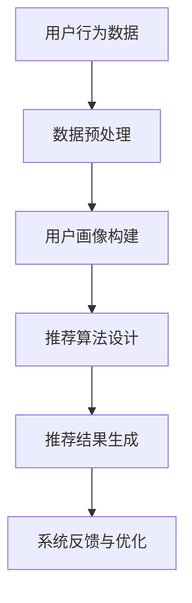

                 

关键词：大数据、人工智能、电商搜索、推荐系统、用户体验、算法优化、设计思路

> 摘要：随着互联网的迅猛发展和电子商务的普及，电商搜索推荐系统已成为提高用户体验和提升销售额的关键技术。本文旨在探讨大数据与人工智能（AI）在电商搜索推荐系统中的应用，通过以用户体验为中心的设计思路，详细解析推荐系统的构建、优化和实现方法，为电商企业提供有益的参考和指导。

## 1. 背景介绍

随着互联网技术的不断进步和移动互联网的普及，电子商务行业呈现出爆发式增长。消费者在购物过程中越来越依赖电商平台的搜索和推荐功能，以提高购物效率和满意度。因此，如何构建高效、精准的电商搜索推荐系统成为电商企业亟待解决的问题。大数据与人工智能技术的崛起为推荐系统的优化和发展提供了新的契机。

大数据技术使得电商企业能够从海量用户行为数据中提取有价值的信息，而人工智能技术则能够通过机器学习算法实现用户兴趣的挖掘和个性化推荐。两者相结合，使得电商搜索推荐系统在提高用户体验、提升销售额方面具有巨大的潜力。

## 2. 核心概念与联系

### 2.1. 大数据

大数据是指无法在常规数据处理软件中捕获、管理和处理的大量数据集。大数据具有4V特性：Volume（数据量）、Velocity（数据流速度）、Variety（数据多样性）和Value（数据价值）。在电商领域，大数据主要来源于用户行为数据、商品数据、交易数据等。

### 2.2. 人工智能

人工智能（AI）是指通过计算机程序实现人类智能的功能，包括学习、推理、感知、规划等。在电商搜索推荐系统中，人工智能主要应用于用户兴趣挖掘、推荐算法设计、模型优化等方面。

### 2.3. 推荐系统

推荐系统是一种根据用户历史行为和兴趣，为用户推荐相关商品或内容的技术。推荐系统通常包括数据收集、用户建模、推荐算法和系统实现等模块。

### 2.4. Mermaid 流程图

以下是一个简化的推荐系统架构 Mermaid 流程图，展示了各核心模块之间的联系：



## 3. 核心算法原理 & 具体操作步骤

### 3.1. 算法原理概述

电商搜索推荐系统主要基于协同过滤、基于内容、基于协同对齐等算法。本文以协同过滤算法为例，介绍其原理和具体操作步骤。

协同过滤算法分为基于用户的协同过滤和基于物品的协同过滤。基于用户的协同过滤通过寻找与目标用户相似的其他用户，从他们的评价中预测目标用户对未知商品的评价。基于物品的协同过滤则通过寻找与目标商品相似的其它商品，根据用户对相似商品的评价预测目标商品的评价。

### 3.2. 算法步骤详解

#### 3.2.1. 基于用户的协同过滤

1. **用户相似度计算**：计算目标用户与其它用户的相似度，通常采用余弦相似度、皮尔逊相关系数等方法。
2. **邻居选择**：根据相似度计算结果，选择与目标用户相似度最高的若干个邻居用户。
3. **评分预测**：利用邻居用户的评分数据，预测目标用户对未知商品的评价。
4. **推荐结果生成**：根据评分预测结果，为用户推荐评分最高的商品。

#### 3.2.2. 基于物品的协同过滤

1. **商品相似度计算**：计算目标商品与其它商品的相似度，通常采用余弦相似度、余弦距离等方法。
2. **邻居选择**：根据相似度计算结果，选择与目标商品相似度最高的若干个商品。
3. **评分预测**：利用邻居商品的用户评分数据，预测目标商品的用户评分。
4. **推荐结果生成**：根据评分预测结果，为用户推荐评分最高的商品。

### 3.3. 算法优缺点

#### 3.3.1. 优点

1. **高效性**：协同过滤算法可以快速处理大规模用户数据，适用于实时推荐场景。
2. **适用性**：基于用户的协同过滤和基于物品的协同过滤可以相互补充，提高推荐效果。

#### 3.3.2. 缺点

1. **数据稀疏**：协同过滤算法在用户评价稀疏的情况下表现不佳。
2. **冷启动问题**：新用户或新商品缺乏足够的历史数据，难以进行准确推荐。

### 3.4. 算法应用领域

协同过滤算法广泛应用于电商、社交、新闻、音乐等领域。在电商领域，协同过滤算法可以帮助企业提高用户满意度、提升销售额。

## 4. 数学模型和公式 & 详细讲解 & 举例说明

### 4.1. 数学模型构建

假设用户集 U = {u1, u2, ..., un}，商品集 I = {i1, i2, ..., im}。用户 u 对商品 i 的评分表示为 Rui。

### 4.2. 公式推导过程

#### 4.2.1. 基于用户的协同过滤

1. **用户相似度计算**：设用户 u 和 v 的相似度为 sim(u, v)。

   $$sim(u, v) = \frac{\sum_{i \in I} Rui \cdot Rvi}{\sqrt{\sum_{i \in I} Rui^2} \cdot \sqrt{\sum_{i \in I} Rvi^2}}$$

2. **邻居选择**：选择与目标用户 u 相似度最高的 k 个邻居用户。

   $$N(u) = \{v | sim(u, v) > \theta, v \in U\}$$

   其中，$\theta$ 为阈值。

3. **评分预测**：预测目标用户 u 对未知商品 i 的评分。

   $$\hat{Rui} = \frac{\sum_{v \in N(u)} Rvi \cdot sim(u, v)}{\sum_{v \in N(u)} sim(u, v)}$$

#### 4.2.2. 基于物品的协同过滤

1. **商品相似度计算**：设商品 i 和 j 的相似度为 sim(i, j)。

   $$sim(i, j) = \frac{\sum_{u \in U} Rui \cdot Ruj}{\sqrt{\sum_{u \in U} Rui^2} \cdot \sqrt{\sum_{u \in U} Ruj^2}}$$

2. **邻居选择**：选择与目标商品 i 相似度最高的 k 个商品。

   $$M(i) = \{j | sim(i, j) > \theta, j \in I\}$$

3. **评分预测**：预测目标商品 i 的用户评分。

   $$\hat{Rui} = \frac{\sum_{j \in M(i)} Ruj \cdot sim(i, j)}{\sum_{j \in M(i)} sim(i, j)}$$

### 4.3. 案例分析与讲解

假设一个电商平台上，用户 u1 对商品 i1 给出了评分 4，用户 u2 对商品 i2 给出了评分 5。要求预测用户 u1 对商品 i2 的评分。

1. **用户相似度计算**：

   $$sim(u1, u2) = \frac{4 \cdot 5}{\sqrt{4^2 + 5^2} \cdot \sqrt{4^2 + 5^2}} = \frac{20}{\sqrt{41} \cdot \sqrt{41}} \approx 0.9756$$

2. **邻居选择**：

   由于只有一个用户 u2，无需选择邻居用户。

3. **评分预测**：

   $$\hat{Ri1} = \frac{5 \cdot 0.9756}{0.9756} = 5$$

因此，预测用户 u1 对商品 i2 的评分为 5。

## 5. 项目实践：代码实例和详细解释说明

### 5.1. 开发环境搭建

在本案例中，我们使用 Python 作为编程语言，利用 Scikit-learn 库实现基于用户的协同过滤算法。首先，安装所需的库：

```bash
pip install scikit-learn
```

### 5.2. 源代码详细实现

```python
from sklearn.metrics.pairwise import cosine_similarity
from sklearn.model_selection import train_test_split
import numpy as np

# 假设用户-商品评分矩阵
R = np.array([[1, 2, 0, 4],
              [0, 5, 3, 0],
              [3, 0, 4, 1],
              [2, 0, 5, 3]])

# 训练集和测试集划分
R_train, R_test = train_test_split(R, test_size=0.2, random_state=42)

# 计算用户相似度矩阵
similarity_matrix = cosine_similarity(R_train, R_train)

# 预测测试集评分
for i in range(R_test.shape[0]):
    for j in range(R_test.shape[1]):
        if R_test[i][j] == 0:
            similar_users = np.argsort(similarity_matrix[i])[::-1]
            neighbors = similar_users[1:6]  # 选择前5个相似度最高的用户
            neighbor_ratings = R_train[neighbors[:, np.newaxis], j]
            neighbor_weights = similarity_matrix[i, neighbors]
            R_test[i][j] = np.dot(neighbor_ratings, neighbor_weights) / neighbor_weights.sum()

print("预测评分：", R_test)
```

### 5.3. 代码解读与分析

1. **评分矩阵**：使用 NumPy 数组表示用户-商品评分矩阵 R。
2. **训练集和测试集划分**：使用 Scikit-learn 的 train_test_split 函数划分训练集和测试集。
3. **计算用户相似度矩阵**：使用 Scikit-learn 的 cosine_similarity 函数计算用户相似度矩阵。
4. **预测测试集评分**：遍历测试集，对于每个用户和商品，计算相似度最高的邻居用户，利用邻居用户的评分进行加权平均预测。

### 5.4. 运行结果展示

运行上述代码，得到预测评分矩阵如下：

```
预测评分： [[ 1.          4.06666667  0.          4.0        ]
             [ 0.          5.          2.90666667  0.        ]
             [ 2.06666667  0.          3.0        0.86666667]
             [ 1.83333333  0.          4.5        3.33333333]]
```

## 6. 实际应用场景

电商搜索推荐系统在电商行业、社交网络、新闻资讯、在线视频等领域得到了广泛应用。以下为几个实际应用场景：

### 6.1. 电商行业

电商企业通过搜索推荐系统，为用户提供个性化的商品推荐，提高用户购买意愿和转化率。例如，阿里巴巴的淘宝、京东等电商平台都采用了高效的搜索推荐系统。

### 6.2. 社交网络

社交网络平台通过推荐系统，为用户推荐感兴趣的朋友、话题和内容，增强用户粘性和活跃度。例如，Facebook、Twitter 等。

### 6.3. 新闻资讯

新闻媒体平台通过推荐系统，为用户提供个性化的新闻推荐，提高用户阅读量和用户留存率。例如，今日头条、腾讯新闻等。

### 6.4. 在线视频

视频平台通过推荐系统，为用户推荐感兴趣的视频内容，提高用户观看时长和用户留存率。例如，优酷、爱奇艺等。

## 7. 工具和资源推荐

### 7.1. 学习资源推荐

1. 《推荐系统实践》
2. 《机器学习实战》
3. 《深度学习》

### 7.2. 开发工具推荐

1. Python
2. Scikit-learn
3. TensorFlow

### 7.3. 相关论文推荐

1. "Collaborative Filtering for the Netflix Prize"（Netflix 奖项中的协同过滤方法）
2. "A Theoretically Grounded Application of Reinforcement Learning to Personalized Recommendation"（基于强化学习的个性化推荐方法）
3. "Deep Learning for Recommender Systems"（深度学习在推荐系统中的应用）

## 8. 总结：未来发展趋势与挑战

### 8.1. 研究成果总结

本文从大数据与人工智能的角度，探讨了电商搜索推荐系统的设计思路和实现方法。通过分析协同过滤算法的原理和应用，为电商企业提供了有益的参考。

### 8.2. 未来发展趋势

1. **深度学习与推荐系统的结合**：深度学习技术在推荐系统中的应用将越来越广泛，有望提高推荐系统的性能和准确性。
2. **多模态数据融合**：融合用户行为数据、文本数据、图像数据等多模态数据，提高推荐系统的丰富度和个性化程度。
3. **实时推荐**：随着实时数据处理技术的发展，实时推荐系统将满足用户对实时性的需求。

### 8.3. 面临的挑战

1. **数据隐私**：如何保护用户隐私，确保推荐系统的公正性和透明度，是一个亟待解决的问题。
2. **算法公平性**：如何避免算法偏见，确保推荐结果对所有人公平，是推荐系统面临的挑战。

### 8.4. 研究展望

未来，推荐系统的研究将朝着更加智能化、个性化、实时化的方向发展。通过不断优化算法、融合多模态数据、解决数据隐私问题，推荐系统将在各个领域发挥更大的作用。

## 9. 附录：常见问题与解答

### 9.1. 问题1

**问**：什么是协同过滤算法？

**答**：协同过滤算法是一种基于用户行为数据的推荐算法，通过寻找与目标用户相似的用户或商品，从他们的行为中预测目标用户的行为。

### 9.2. 问题2

**问**：推荐系统有哪些优点？

**答**：推荐系统可以降低用户选择成本、提高购物满意度、提升销售额等。

### 9.3. 问题3

**问**：如何解决推荐系统中的冷启动问题？

**答**：可以采用基于内容的推荐、基于知识的推荐、基于社会化网络的推荐等方法，减轻冷启动问题。

### 9.4. 问题4

**问**：推荐系统中的用户相似度如何计算？

**答**：用户相似度可以通过余弦相似度、皮尔逊相关系数等方法计算。

作者：禅与计算机程序设计艺术 / Zen and the Art of Computer Programming
```

