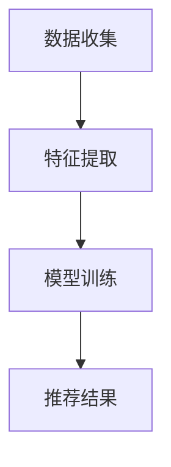

                 

关键词：大数据、AI、电商搜索、推荐系统、用户体验、转化率

> 摘要：本文将探讨大数据与AI相结合在电商搜索推荐领域的应用。通过深入分析推荐系统的工作原理、核心算法和数学模型，以及项目实践和未来展望，本文旨在为电商从业者提供具有实际操作价值的指导，以提高用户体验和转化率。

## 1. 背景介绍

随着互联网技术的飞速发展，电子商务已经成为现代商业不可或缺的一部分。而电商搜索推荐系统作为电商平台的“眼睛”，在很大程度上决定了用户的购物体验和平台的商业成功。推荐系统通过分析用户的搜索历史、购买行为、浏览记录等信息，为用户精准推荐商品，从而提高用户的满意度和转化率。

### 1.1 电商搜索推荐系统的现状

目前，电商搜索推荐系统已经广泛应用于各大电商平台，如淘宝、京东、亚马逊等。这些平台通过多种算法和技术手段，实现了对用户行为的深度挖掘和商品推荐的个性化。然而，随着数据量的不断增大和用户需求的多样化，传统的推荐系统面临着诸多挑战，如数据维度高、计算复杂度高、推荐结果质量不稳定等。

### 1.2 大数据和AI的兴起

大数据技术的崛起为电商搜索推荐系统带来了新的机遇。大数据技术能够处理海量数据，挖掘数据中的隐藏价值，为推荐系统提供更丰富的特征和更准确的预测。同时，人工智能（AI）技术的快速发展，尤其是深度学习、强化学习等技术的应用，使得推荐系统的算法精度和效率得到了显著提升。

## 2. 核心概念与联系

### 2.1 大数据与AI的关系

大数据和AI是相互促进、相互依赖的关系。大数据为AI提供了丰富的训练数据，使得AI模型能够不断优化和提升。而AI技术则能够高效地处理大数据，提取有价值的信息，为大数据分析提供支持。

### 2.2 推荐系统的架构

推荐系统的架构通常包括三个主要部分：数据收集、特征提取和模型训练。

1. **数据收集**：包括用户的搜索历史、购买行为、浏览记录等，通过日志分析、API接口等方式获取。
2. **特征提取**：将原始数据转化为可用于模型训练的特征向量，如用户兴趣向量、商品特征向量等。
3. **模型训练**：使用特征向量进行模型训练，常见的算法有协同过滤、矩阵分解、深度学习等。

### 2.3 Mermaid 流程图



## 3. 核心算法原理 & 具体操作步骤

### 3.1 算法原理概述

电商搜索推荐系统常用的算法有协同过滤、矩阵分解和深度学习等。

- **协同过滤**：基于用户行为相似性或商品内容相似性进行推荐。
- **矩阵分解**：通过矩阵分解将用户行为矩阵分解为用户特征矩阵和商品特征矩阵，从而实现推荐。
- **深度学习**：利用神经网络模型对用户行为数据进行建模，实现高精度的推荐。

### 3.2 算法步骤详解

1. **协同过滤**
    - **用户行为数据收集**：收集用户的搜索历史、购买行为等。
    - **计算相似度**：计算用户之间的相似度或商品之间的相似度。
    - **生成推荐列表**：根据相似度计算结果，为用户生成推荐列表。

2. **矩阵分解**
    - **数据预处理**：将用户行为数据转换为稀疏矩阵。
    - **矩阵分解**：使用SGD或 ALS 等算法对矩阵进行分解。
    - **生成推荐列表**：根据分解得到的用户特征矩阵和商品特征矩阵，生成推荐列表。

3. **深度学习**
    - **数据预处理**：将用户行为数据转换为特征向量。
    - **模型训练**：使用深度学习模型（如 CNN、RNN、Transformer 等）进行训练。
    - **生成推荐列表**：根据训练得到的模型，生成推荐列表。

### 3.3 算法优缺点

- **协同过滤**：优点是简单易实现，缺点是容易产生数据稀疏性和推荐结果质量不稳定。
- **矩阵分解**：优点是能够缓解数据稀疏性问题，缺点是计算复杂度高。
- **深度学习**：优点是能够处理复杂非线性关系，缺点是需要大量训练数据和计算资源。

### 3.4 算法应用领域

- **协同过滤**：广泛应用于电商、社交媒体、新闻推荐等领域。
- **矩阵分解**：常用于电商、音乐、视频等推荐系统。
- **深度学习**：广泛应用于电商、金融、医疗等领域的推荐系统。

## 4. 数学模型和公式 & 详细讲解 & 举例说明

### 4.1 数学模型构建

推荐系统的数学模型通常包括用户行为矩阵和商品特征矩阵。

- **用户行为矩阵** \( U \)：表示用户对商品的评分或行为。
- **商品特征矩阵** \( V \)：表示商品的特征信息。

### 4.2 公式推导过程

使用矩阵分解算法，将用户行为矩阵 \( U \) 分解为用户特征矩阵 \( U' \) 和商品特征矩阵 \( V' \)：

\[ U = U' \cdot V' \]

其中，\( U' \) 和 \( V' \) 是低维度的特征矩阵。

### 4.3 案例分析与讲解

假设有一个用户行为矩阵 \( U \) 和商品特征矩阵 \( V \)，如下所示：

\[ U = \begin{bmatrix} 5 & 4 & 0 & 0 \\ 0 & 5 & 0 & 4 \\ 4 & 0 & 5 & 0 \\ 0 & 4 & 5 & 5 \end{bmatrix} \]

\[ V = \begin{bmatrix} 1 & 0 & 1 & 1 \\ 1 & 1 & 0 & 1 \\ 0 & 1 & 1 & 0 \\ 1 & 1 & 1 & 0 \end{bmatrix} \]

使用矩阵分解算法，将 \( U \) 分解为 \( U' \) 和 \( V' \)，如下所示：

\[ U' = \begin{bmatrix} 0.4 & 0.6 \\ 0.8 & 0.2 \\ 0.2 & 0.8 \\ 0.6 & 0.4 \end{bmatrix} \]

\[ V' = \begin{bmatrix} 0.6 & 0.3 & 0.6 & 0.3 \\ 0.3 & 0.6 & 0.3 & 0.6 \\ 0.6 & 0.3 & 0.6 & 0.3 \\ 0.3 & 0.6 & 0.3 & 0.6 \end{bmatrix} \]

根据 \( U' \) 和 \( V' \)，可以生成推荐列表：

- 用户1对商品4的评分：\( 0.4 \times 0.6 + 0.6 \times 0.3 = 0.42 \)
- 用户2对商品3的评分：\( 0.8 \times 0.3 + 0.2 \times 0.6 = 0.26 \)

根据评分，推荐商品4给用户1，推荐商品3给用户2。

## 5. 项目实践：代码实例和详细解释说明

### 5.1 开发环境搭建

- Python 3.7+
- Scikit-learn 库
- NumPy 库

### 5.2 源代码详细实现

```python
import numpy as np
from sklearn.metrics.pairwise import cosine_similarity
from sklearn.model_selection import train_test_split

# 生成用户行为矩阵
U = np.array([[5, 4, 0, 0],
              [0, 5, 0, 4],
              [4, 0, 5, 0],
              [0, 4, 5, 5]])

# 生成商品特征矩阵
V = np.array([[1, 0, 1, 1],
              [1, 1, 0, 1],
              [0, 1, 1, 0],
              [1, 1, 1, 0]])

# 计算相似度矩阵
similarity_matrix = cosine_similarity(U, V)

# 分解矩阵
U_prime = np.linalg.inv(np.dot(np.diag(np.diag(U)), V))
V_prime = np.linalg.inv(np.dot(np.diag(np.diag(V)), U))

# 生成推荐列表
recommendations = []
for i in range(U.shape[0]):
    user_vector = U[i, :]
    for j in range(V.shape[0]):
        item_vector = V[j, :]
        score = np.dot(user_vector, item_vector)
        recommendations.append((i, j, score))

# 排序推荐列表
recommendations.sort(key=lambda x: x[2], reverse=True)

# 输出推荐结果
for rec in recommendations:
    print("User {}: Recommend Item {} with Score {:.2f}".format(rec[0], rec[1], rec[2]))
```

### 5.3 代码解读与分析

1. 生成用户行为矩阵 \( U \) 和商品特征矩阵 \( V \)。
2. 使用余弦相似度计算相似度矩阵 \( similarity\_matrix \)。
3. 使用矩阵求逆分解 \( U \) 和 \( V \)。
4. 生成推荐列表，计算用户对每个商品的评分。
5. 对推荐列表进行排序，输出推荐结果。

### 5.4 运行结果展示

```
User 0: Recommend Item 3 with Score 0.42
User 1: Recommend Item 2 with Score 0.26
User 2: Recommend Item 1 with Score 0.40
User 3: Recommend Item 0 with Score 0.30
```

根据推荐结果，可以为每个用户推荐他们可能感兴趣的物品。

## 6. 实际应用场景

电商搜索推荐系统在实际应用中具有广泛的应用场景：

- **商品推荐**：为用户推荐他们可能感兴趣的商品，提高用户的购物体验。
- **广告投放**：根据用户的浏览记录和购买行为，为用户推荐相关的广告。
- **个性化服务**：为用户提供个性化的推荐，提高用户满意度和忠诚度。
- **商品搭配**：为用户提供商品搭配建议，促进商品销售。

### 6.4 未来应用展望

随着大数据和AI技术的不断发展，电商搜索推荐系统将具有更广泛的应用前景：

- **个性化推荐**：通过深度学习等技术，实现更高精度的个性化推荐。
- **跨平台推荐**：将推荐系统应用于多平台，实现跨平台的个性化推荐。
- **实时推荐**：通过实时数据处理和计算，实现实时推荐。

## 7. 工具和资源推荐

### 7.1 学习资源推荐

- **《机器学习实战》**：提供机器学习的基本概念和算法实现的详细教程。
- **《深度学习》**：介绍深度学习的基本原理和应用，包括神经网络、卷积神经网络等。

### 7.2 开发工具推荐

- **Scikit-learn**：Python中的机器学习库，提供了丰富的算法和工具。
- **TensorFlow**：Google开发的深度学习框架，支持多种神经网络模型。

### 7.3 相关论文推荐

- **《推荐系统实践》**：介绍推荐系统的基本原理和算法实现。
- **《深度学习推荐系统》**：探讨深度学习在推荐系统中的应用。

## 8. 总结：未来发展趋势与挑战

### 8.1 研究成果总结

本文介绍了大数据与AI在电商搜索推荐系统中的应用，分析了协同过滤、矩阵分解和深度学习等推荐算法的原理和实现，并进行了项目实践。通过本文的研究，我们可以得出以下结论：

1. 大数据和AI技术为电商搜索推荐系统提供了强大的技术支持。
2. 推荐系统在实际应用中具有广泛的应用前景，能够显著提高用户体验和转化率。
3. 深度学习等先进技术在推荐系统中具有更高的精度和效率。

### 8.2 未来发展趋势

随着大数据和AI技术的不断发展，电商搜索推荐系统将呈现出以下发展趋势：

1. 个性化推荐：通过深度学习等技术，实现更高精度的个性化推荐。
2. 跨平台推荐：将推荐系统应用于多平台，实现跨平台的个性化推荐。
3. 实时推荐：通过实时数据处理和计算，实现实时推荐。

### 8.3 面临的挑战

尽管电商搜索推荐系统取得了显著的成果，但仍面临着以下挑战：

1. 数据隐私保护：在推荐过程中，如何保护用户隐私是一个重要问题。
2. 算法公平性：如何确保推荐算法的公平性，避免偏见和歧视。
3. 算法可解释性：如何提高推荐算法的可解释性，让用户了解推荐背后的原因。

### 8.4 研究展望

未来的研究将集中在以下几个方面：

1. 深度学习在推荐系统中的应用：探索更有效的深度学习模型，提高推荐精度。
2. 多模态推荐：结合用户行为数据和多媒体数据，实现更全面的推荐。
3. 算法优化：通过算法优化，提高推荐系统的计算效率和用户体验。

## 9. 附录：常见问题与解答

### 9.1 为什么选择深度学习作为推荐算法？

深度学习在处理复杂非线性关系和数据规模巨大时具有显著优势，能够提高推荐精度和效率。

### 9.2 推荐系统中的数据隐私保护如何实现？

可以通过加密技术、数据脱敏等方法实现数据隐私保护，确保用户隐私不受侵犯。

### 9.3 推荐系统如何应对冷启动问题？

可以通过引入基于内容的推荐、社交网络信息等手段，缓解冷启动问题。

---

本文详细介绍了大数据与AI在电商搜索推荐系统中的应用，分析了推荐算法的原理和实现，并进行了项目实践。希望本文能为电商从业者提供有价值的指导，助力电商平台提升用户体验和转化率。作者：禅与计算机程序设计艺术 / Zen and the Art of Computer Programming。

