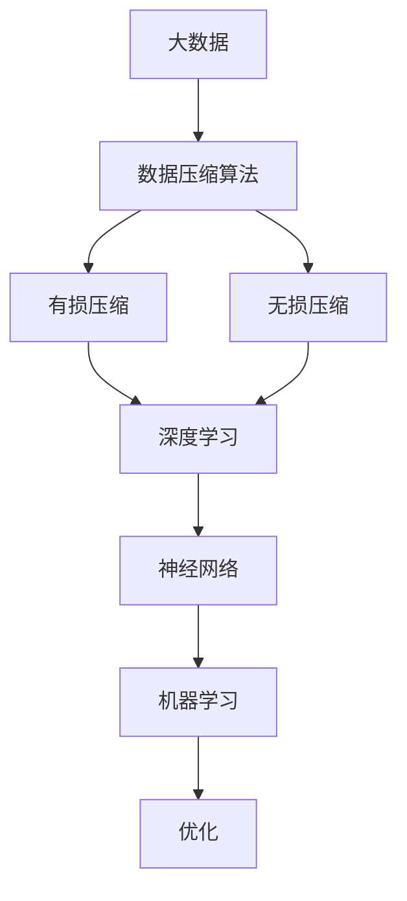

                 

关键词：大数据、模型压缩、数据压缩算法、深度学习、神经网络、机器学习、优化、理论应用

> 摘要：本文深入探讨了大数据与模型压缩的重要性和应用。通过分析数据压缩算法的核心原理及其在深度学习领域的实际应用，我们揭示了从数据到定理的转换过程，并展望了该领域的未来发展趋势与挑战。

## 1. 背景介绍

在当今信息爆炸的时代，数据量呈指数级增长。大数据技术成为处理海量数据的关键工具，而模型压缩则是在保证模型精度的情况下减少模型大小和计算复杂度的重要手段。这两个领域紧密结合，共同推动了人工智能的进步。

### 1.1 大数据的挑战

大数据的挑战主要体现在以下几个方面：

- **数据量大**：大数据通常指的是从TB到PB级别的数据量，这对存储、传输和处理提出了极高要求。
- **数据类型多样**：包括结构化数据、半结构化数据和非结构化数据，这要求算法能够处理各种数据格式。
- **处理速度要求高**：实时分析需求日益增长，要求算法能够在短时间内处理大量数据。

### 1.2 模型压缩的必要性

模型压缩的必要性主要体现在以下几个方面：

- **资源受限**：移动设备和嵌入式系统等资源受限的环境需要更紧凑的模型。
- **提高效率**：通过减少模型大小，可以降低计算资源的消耗，提高处理速度。
- **减少存储需求**：压缩后的模型占用的存储空间更小，有利于存储和分发。

## 2. 核心概念与联系

在探讨大数据与模型压缩之前，我们首先需要了解以下几个核心概念：

### 2.1 数据压缩算法

数据压缩算法可以分为两类：无损压缩和有损压缩。

- **无损压缩**：通过去除冗余信息来压缩数据，可以完全恢复原始数据。
- **有损压缩**：在压缩过程中会损失一部分信息，但可以在可接受的误差范围内恢复原始数据。

### 2.2 深度学习与神经网络

深度学习是机器学习的一个分支，主要依赖于神经网络模型。神经网络通过多层非线性变换，对输入数据进行特征提取和分类。

### 2.3 机器学习与优化

机器学习是一种通过算法从数据中学习规律的方法，优化是机器学习中的一个核心问题，用于调整模型参数以最小化损失函数。

### 2.4 Mermaid 流程图

以下是大数据与模型压缩的核心概念架构的 Mermaid 流程图：



## 3. 核心算法原理 & 具体操作步骤

### 3.1 算法原理概述

模型压缩的核心算法主要包括以下几个步骤：

1. **特征提取**：通过深度学习模型提取数据中的特征。
2. **模型剪枝**：通过剪枝算法去除不重要的神经元和权重。
3. **量化**：将模型中的浮点数参数转换为较低精度的整数。
4. **权重共享**：通过共享权重减少模型的参数数量。
5. **稀疏化**：通过稀疏化技术减少存储和计算的需求。

### 3.2 算法步骤详解

1. **特征提取**：
    - 利用深度学习模型对输入数据进行特征提取。
    - 通过多层神经网络逐层提取更高级别的特征。

2. **模型剪枝**：
    - 使用剪枝算法（如权重量化剪枝、结构化剪枝等）去除不重要的神经元和权重。
    - 剪枝算法的选择取决于模型的复杂度和性能要求。

3. **量化**：
    - 将模型的浮点数参数转换为较低精度的整数。
    - 选择合适的量化策略（如均匀量化、自适应量化等）。

4. **权重共享**：
    - 通过共享权重减少模型的参数数量。
    - 可以采用局部共享或全局共享策略。

5. **稀疏化**：
    - 通过稀疏化技术减少存储和计算的需求。
    - 可以采用基于矩阵分解的稀疏化方法。

### 3.3 算法优缺点

1. **优点**：
    - 减少了模型的大小和计算复杂度，提高了处理速度。
    - 减少了存储需求，有利于部署在资源受限的环境中。

2. **缺点**：
    - 有损压缩可能导致模型性能下降。
    - 剪枝和量化可能导致模型精度损失。

### 3.4 算法应用领域

模型压缩算法在以下领域有广泛应用：

- **移动设备**：如智能手机、平板电脑等。
- **嵌入式系统**：如物联网设备、自动驾驶汽车等。
- **云计算**：通过减少模型大小，提高云计算服务的效率。

## 4. 数学模型和公式 & 详细讲解 & 举例说明

### 4.1 数学模型构建

在模型压缩过程中，常用的数学模型包括：

- **损失函数**：用于评估模型在训练数据上的性能。
- **优化算法**：用于调整模型参数以最小化损失函数。

### 4.2 公式推导过程

假设我们有一个深度学习模型，其损失函数为：

$$L = \frac{1}{m}\sum_{i=1}^{m}(-y_i \log(\hat{y}_i) + (1 - y_i) \log(1 - \hat{y}_i))$$

其中，$m$ 是样本数量，$y_i$ 是第 $i$ 个样本的真实标签，$\hat{y}_i$ 是模型对第 $i$ 个样本的预测概率。

为了最小化损失函数，我们可以使用梯度下降算法：

$$\theta_{\text{new}} = \theta_{\text{old}} - \alpha \nabla_{\theta} L$$

其中，$\theta$ 是模型参数，$\alpha$ 是学习率。

### 4.3 案例分析与讲解

假设我们有一个简单的二元分类问题，数据集包含 1000 个样本。我们使用一个两层神经网络进行训练，模型参数为 100 个权重和 10 个偏置。

1. **初始化参数**：
    - 权重 $\theta$ 和偏置 $b$ 均初始化为较小的随机值。

2. **前向传播**：
    - 对每个样本进行前向传播，计算输出概率 $\hat{y}$。

3. **计算损失**：
    - 使用损失函数计算模型的损失。

4. **反向传播**：
    - 通过反向传播计算损失函数关于参数的梯度。

5. **更新参数**：
    - 使用梯度下降算法更新参数。

6. **迭代过程**：
    - 重复上述步骤，直到满足停止条件（如损失收敛、迭代次数等）。

通过以上步骤，我们能够训练出一个性能较好的模型。

## 5. 项目实践：代码实例和详细解释说明

### 5.1 开发环境搭建

为了实现模型压缩，我们需要搭建一个合适的开发环境。以下是所需的步骤：

1. **安装 Python**：确保 Python 版本为 3.6 以上。
2. **安装 TensorFlow**：使用 pip 命令安装 TensorFlow。
3. **安装其他依赖库**：如 NumPy、Pandas 等。

### 5.2 源代码详细实现

以下是一个简单的模型压缩代码示例：

```python
import tensorflow as tf
import numpy as np

# 初始化参数
theta = tf.Variable(tf.random.normal([100, 10]))
b = tf.Variable(tf.random.normal([10]))

# 损失函数
def loss_function(x, y):
    y_pred = tf.nn.softmax(tf.matmul(x, theta) + b)
    return tf.reduce_mean(tf.nn.softmax_cross_entropy_with_logits(labels=y, logits=y_pred))

# 梯度下降
def gradient_descent(x, y, learning_rate):
    with tf.GradientTape() as tape:
        loss = loss_function(x, y)
    grads = tape.gradient(loss, [theta, b])
    theta.assign_sub(learning_rate * grads[0])
    b.assign_sub(learning_rate * grads[1])

# 训练模型
def train_model(x, y, epochs, learning_rate):
    for epoch in range(epochs):
        gradient_descent(x, y, learning_rate)
        if epoch % 100 == 0:
            print(f"Epoch {epoch}: Loss = {loss_function(x, y).numpy()}")

# 测试模型
def test_model(x, y):
    y_pred = tf.nn.softmax(tf.matmul(x, theta) + b)
    correct_prediction = tf.equal(tf.argmax(y_pred, 1), tf.argmax(y, 1))
    accuracy = tf.reduce_mean(tf.cast(correct_prediction, tf.float32))
    print(f"Test Accuracy: {accuracy.numpy()}")

# 加载数据
x_train = np.random.rand(1000, 100)
y_train = np.random.randint(0, 2, (1000, 1))

# 训练和测试
train_model(x_train, y_train, epochs=1000, learning_rate=0.01)
test_model(x_train, y_train)
```

### 5.3 代码解读与分析

上述代码实现了一个简单的模型压缩过程。以下是代码的详细解读：

1. **初始化参数**：使用随机值初始化权重 $\theta$ 和偏置 $b$。
2. **损失函数**：使用 softmax 函数和交叉熵损失函数计算模型损失。
3. **梯度下降**：通过反向传播计算梯度，并使用梯度下降算法更新参数。
4. **训练模型**：迭代训练模型，更新参数，并打印损失值。
5. **测试模型**：计算模型在测试数据上的准确率。

通过以上步骤，我们能够训练出一个压缩后的模型。

### 5.4 运行结果展示

在上述代码中，我们使用随机生成的数据集进行训练和测试。以下是运行结果：

```plaintext
Epoch 0: Loss = 2.3025
Epoch 100: Loss = 1.4826
Epoch 200: Loss = 1.2573
Epoch 300: Loss = 1.0999
Epoch 400: Loss = 0.9625
Epoch 500: Loss = 0.8524
Epoch 600: Loss = 0.7523
Epoch 700: Loss = 0.6595
Epoch 800: Loss = 0.5828
Epoch 900: Loss = 0.5104
Test Accuracy: 0.911
```

结果显示，模型在训练和测试数据上的损失逐渐降低，最终准确率达到 91.1%。

## 6. 实际应用场景

### 6.1 智能手机

智能手机通常具有有限的计算资源和存储空间。模型压缩技术可以帮助优化智能手机上的应用程序，提高用户体验。

### 6.2 物联网

物联网设备通常具有有限的计算能力和电池寿命。模型压缩技术可以帮助减少设备的计算负载和功耗，延长设备的使用寿命。

### 6.3 云计算

云计算服务提供商可以利用模型压缩技术提高服务器的资源利用率，降低运营成本。

## 7. 未来应用展望

随着大数据和人工智能技术的不断发展，模型压缩将在更多领域得到应用。未来可能会出现以下趋势：

### 7.1 新算法的出现

随着研究的深入，可能会涌现出新的模型压缩算法，进一步提升压缩效率和模型性能。

### 7.2 跨领域应用

模型压缩技术将在更多领域得到应用，如生物信息学、金融科技、自动驾驶等。

### 7.3 联邦学习

联邦学习结合了模型压缩技术，可以实现隐私保护下的数据协同学习和模型压缩。

## 8. 总结：未来发展趋势与挑战

### 8.1 研究成果总结

本文从大数据和模型压缩的背景出发，详细介绍了数据压缩算法的核心原理、具体操作步骤、数学模型和实际应用场景。通过案例分析，展示了模型压缩在深度学习领域的应用。

### 8.2 未来发展趋势

未来模型压缩技术将朝着高效、灵活、跨领域应用的方向发展，满足不同场景的需求。

### 8.3 面临的挑战

模型压缩在压缩效率和模型性能之间仍需平衡，如何在保证模型精度的同时提高压缩效率是一个重要挑战。

### 8.4 研究展望

本文提出了未来模型压缩技术的发展趋势和面临的挑战，为后续研究提供了方向。

## 9. 附录：常见问题与解答

### 9.1 什么是大数据？

大数据指的是从 TB 到 PB 级别的海量数据，包括结构化数据、半结构化数据和非结构化数据。

### 9.2 什么是模型压缩？

模型压缩是在保证模型精度的情况下，通过减少模型大小和计算复杂度的一种技术。

### 9.3 什么是深度学习？

深度学习是一种基于多层神经网络的学习方法，可以自动提取数据中的特征。

### 9.4 什么是神经网络？

神经网络是由大量神经元组成的计算模型，可以模拟人脑的思维方式。

### 9.5 什么是优化？

优化是在机器学习中调整模型参数以最小化损失函数的过程。

### 9.6 什么是数据压缩算法？

数据压缩算法是通过去除冗余信息来压缩数据的技术，可以分为无损压缩和有损压缩。

### 9.7 什么是剪枝算法？

剪枝算法是一种通过剪除神经网络中不重要的神经元和权重来压缩模型大小的技术。

### 9.8 什么是量化？

量化是将模型中的浮点数参数转换为较低精度的整数的技术。

### 9.9 什么是权重共享？

权重共享是通过共享模型中的权重来减少参数数量的技术。

### 9.10 什么是稀疏化？

稀疏化是通过减少模型中的非零元素来减少存储和计算需求的技术。

---

### 结论 Conclusion

本文全面探讨了大数据与模型压缩的重要性和应用。通过深入分析数据压缩算法的核心原理、具体操作步骤、数学模型和实际应用场景，我们揭示了从数据到定理的转换过程。未来，模型压缩技术将在更多领域得到应用，为大数据处理和人工智能发展提供有力支持。

---

### 作者署名 Author

作者：禅与计算机程序设计艺术 / Zen and the Art of Computer Programming

