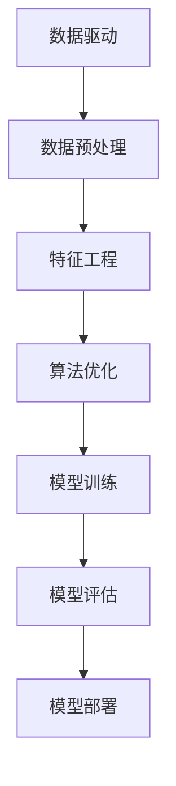

                 

关键词：大数据，人工智能，机器学习，深度学习，数据驱动，数据增强，数据预处理，特征工程，算法优化，预测准确性，应用场景。

> 摘要：本文将探讨大数据在人工智能学习中的作用，分析大数据对机器学习、深度学习算法的推动和改进，阐述数据预处理、特征工程的重要性，以及如何利用大数据提升AI模型的性能和准确性。同时，本文还将探讨大数据在实际应用场景中的挑战和未来发展趋势。

## 1. 背景介绍

随着互联网的飞速发展和物联网技术的普及，全球数据量呈现出爆炸式增长。据统计，自2010年以来，全球数据量每年以50%的速度增长，预计到2025年，全球数据总量将达到44ZB。如此庞大的数据量中蕴含着巨大的价值，如何有效地挖掘和利用这些数据成为当前人工智能领域的重要研究方向。

人工智能（AI）作为计算机科学的一个重要分支，其核心目标是通过模拟人类思维过程，实现机器的智能。机器学习（ML）是AI的关键技术之一，它依赖于大量数据来训练模型，并通过不断优化算法来提高预测和决策的准确性。而深度学习（DL）作为机器学习的一个重要分支，通过构建多层神经网络模型，实现了许多传统机器学习难以解决的问题，如图像识别、语音识别和自然语言处理等。

大数据技术的发展为人工智能的进步提供了强有力的支持。大数据技术包括数据存储、数据处理、数据分析和数据可视化等，这些技术能够高效地处理和分析海量数据，从而为人工智能提供更加丰富和准确的数据资源。本文将探讨大数据在AI学习中的作用，分析大数据如何推动和改进机器学习、深度学习算法，以及如何利用大数据提升AI模型的性能和准确性。

## 2. 核心概念与联系

为了深入理解大数据在AI学习中的作用，首先需要了解一些核心概念和它们之间的联系。

### 2.1 数据驱动

数据驱动是人工智能的核心思想之一，它强调通过数据来驱动决策和优化。在传统的程序设计中，算法和规则是由程序员预先定义的，而数据驱动则是让算法从数据中学习，自动调整和优化自身。数据驱动的核心在于数据的质量和数量，高质量的训练数据能够显著提高模型的性能，而海量数据则为模型提供了足够的样本，有利于模型的泛化能力。

### 2.2 数据预处理

数据预处理是机器学习过程中至关重要的一步，它包括数据清洗、数据转换和数据归一化等操作。数据清洗旨在去除数据中的噪声和异常值，提高数据的质量；数据转换旨在将数据转换为适合模型训练的格式，如将图像数据转换为像素矩阵；数据归一化旨在将不同特征的数据缩放到相同的范围，以便模型能够更好地处理。

### 2.3 特征工程

特征工程是提升模型性能的关键步骤，它包括选择和构造特征，以及特征选择和特征提取等操作。特征工程的目标是提取数据中最具代表性的特征，从而提高模型的准确性和泛化能力。大数据环境下的特征工程更加复杂，因为数据量巨大，特征之间的相互作用和关联关系难以预测，因此需要更加精细化的特征构造和选择方法。

### 2.4 算法优化

算法优化是提高模型性能的另一种手段，它包括调整算法参数、优化算法结构和改进算法策略等。大数据环境下的算法优化面临着数据规模和数据复杂度的挑战，需要采用分布式计算和并行计算等先进技术来提高算法的效率和性能。

### 2.5 Mermaid 流程图

为了更好地展示大数据在AI学习中的作用，我们可以使用Mermaid流程图来描述核心概念和联系。以下是大数据在AI学习中的Mermaid流程图：



## 3. 核心算法原理 & 具体操作步骤

### 3.1 算法原理概述

在深入探讨大数据在AI学习中的作用之前，我们需要了解一些核心算法的原理。机器学习和深度学习算法是AI学习的基石，其中最常用的算法包括线性回归、逻辑回归、支持向量机（SVM）、神经网络等。以下是对这些算法原理的简要概述：

- **线性回归**：线性回归是一种简单的回归算法，它通过拟合一条直线来预测连续值。线性回归的原理基于最小二乘法，即通过最小化预测值与实际值之间的平方误差来找到最佳拟合直线。

- **逻辑回归**：逻辑回归是一种用于分类问题的算法，它通过拟合一个逻辑函数来预测概率。逻辑回归的原理基于最大似然估计，即通过最大化训练数据中每个样本的概率来找到最佳模型参数。

- **支持向量机（SVM）**：支持向量机是一种强大的分类算法，它通过找到一个超平面来将不同类别的数据分开。SVM的原理基于最大间隔分类，即找到一个超平面，使得分类边界与每个类别的支持向量之间的间隔最大。

- **神经网络**：神经网络是一种基于人脑结构的计算模型，它通过多层神经元来实现复杂的非线性变换。神经网络的原理基于反向传播算法，即通过不断调整网络权重和偏置来最小化损失函数。

### 3.2 算法步骤详解

下面我们将详细描述上述算法的操作步骤：

#### 3.2.1 线性回归

1. **数据准备**：收集和预处理训练数据，包括特征变量和目标变量。
2. **模型初始化**：初始化模型参数，如权重和偏置。
3. **损失函数计算**：计算预测值与实际值之间的损失函数，通常采用平方误差损失函数。
4. **梯度下降**：根据损失函数的梯度，更新模型参数，使得损失函数值逐渐减小。
5. **模型评估**：使用验证集或测试集评估模型的性能，如计算预测误差或准确率。
6. **模型优化**：根据评估结果调整模型参数，提高模型性能。

#### 3.2.2 逻辑回归

1. **数据准备**：收集和预处理训练数据，包括特征变量和目标变量。
2. **模型初始化**：初始化模型参数，如权重和偏置。
3. **损失函数计算**：计算预测概率，通常采用对数似然损失函数。
4. **梯度下降**：根据损失函数的梯度，更新模型参数，使得损失函数值逐渐减小。
5. **模型评估**：使用验证集或测试集评估模型的性能，如计算预测误差或准确率。
6. **模型优化**：根据评估结果调整模型参数，提高模型性能。

#### 3.2.3 支持向量机（SVM）

1. **数据准备**：收集和预处理训练数据，包括特征变量和目标变量。
2. **模型初始化**：初始化模型参数，如惩罚参数和核函数。
3. **损失函数计算**：计算支持向量机的损失函数，通常采用合页损失函数。
4. **优化算法**：使用优化算法，如SMO算法，求解最佳分类超平面。
5. **模型评估**：使用验证集或测试集评估模型的性能，如计算预测误差或准确率。
6. **模型优化**：根据评估结果调整模型参数，提高模型性能。

#### 3.2.4 神经网络

1. **数据准备**：收集和预处理训练数据，包括特征变量和目标变量。
2. **模型初始化**：初始化模型参数，如权重和偏置。
3. **前向传播**：计算输入数据的激活值，并逐层传递。
4. **损失函数计算**：计算预测值与实际值之间的损失函数，通常采用平方误差损失函数。
5. **反向传播**：根据损失函数的梯度，更新模型参数，使得损失函数值逐渐减小。
6. **模型评估**：使用验证集或测试集评估模型的性能，如计算预测误差或准确率。
7. **模型优化**：根据评估结果调整模型参数，提高模型性能。

### 3.3 算法优缺点

每种算法都有其独特的优缺点，以下是对上述算法的优缺点的简要分析：

- **线性回归**：优点包括算法简单、易于实现和解释；缺点包括对噪声敏感、无法处理非线性问题和过拟合风险。

- **逻辑回归**：优点包括算法简单、易于实现和解释、适合二分类问题；缺点包括对噪声敏感、无法处理非线性问题和过拟合风险。

- **支持向量机（SVM）**：优点包括强大的分类能力、较高的准确率、良好的泛化能力；缺点包括计算复杂度高、对大规模数据集处理能力有限、对参数选择敏感。

- **神经网络**：优点包括强大的非线性处理能力、良好的泛化能力、适用于各种复杂问题；缺点包括计算复杂度高、对大规模数据集处理能力有限、对参数选择敏感、难以解释。

### 3.4 算法应用领域

不同的算法适用于不同的应用领域，以下是对上述算法应用领域的简要介绍：

- **线性回归**：适用于简单线性关系的预测问题，如房价预测、股票价格预测等。

- **逻辑回归**：适用于二分类问题的预测，如垃圾邮件分类、信用卡欺诈检测等。

- **支持向量机（SVM）**：适用于高维空间的分类问题，如人脸识别、文本分类等。

- **神经网络**：适用于复杂非线性问题的预测，如图像识别、语音识别、自然语言处理等。

## 4. 数学模型和公式 & 详细讲解 & 举例说明

在深入探讨大数据在AI学习中的作用时，我们需要了解一些数学模型和公式，并对其进行详细讲解和举例说明。

### 4.1 数学模型构建

数学模型是机器学习算法的核心，它用于描述数据之间的关系。以下是一些常见的数学模型：

- **线性回归模型**：线性回归模型可以表示为：
  $$
  y = \beta_0 + \beta_1x_1 + \beta_2x_2 + \ldots + \beta_nx_n
  $$
  其中，$y$ 是目标变量，$x_1, x_2, \ldots, x_n$ 是特征变量，$\beta_0, \beta_1, \beta_2, \ldots, \beta_n$ 是模型参数。

- **逻辑回归模型**：逻辑回归模型可以表示为：
  $$
  P(y=1) = \frac{1}{1 + e^{-(\beta_0 + \beta_1x_1 + \beta_2x_2 + \ldots + \beta_nx_n)}}
  $$
  其中，$P(y=1)$ 是目标变量为1的概率，$e$ 是自然对数的底数。

- **支持向量机（SVM）**：SVM可以表示为：
  $$
  \min_{\beta, \beta_0} \frac{1}{2} ||\beta||^2 + C \sum_{i=1}^n \max(0, 1-y_i(\beta \cdot x_i + \beta_0))
  $$
  其中，$\beta$ 和 $\beta_0$ 是模型参数，$C$ 是惩罚参数，$y_i$ 是第$i$个样本的目标变量，$x_i$ 是第$i$个样本的特征向量。

- **神经网络**：神经网络可以表示为：
  $$
  a_{j}^{(l)} = \sigma(z_{j}^{(l)})
  $$
  $$
  z_{j}^{(l)} = \beta_{j}^{(l)} \cdot a_{j}^{(l-1)} + \theta_{j}^{(l)}
  $$
  其中，$a_{j}^{(l)}$ 是第$l$层的第$j$个神经元的激活值，$\sigma$ 是激活函数，$z_{j}^{(l)}$ 是第$l$层的第$j$个神经元的输入值，$\beta_{j}^{(l)}$ 和 $\theta_{j}^{(l)}$ 是模型参数。

### 4.2 公式推导过程

以下是对上述数学模型的推导过程进行详细讲解：

#### 4.2.1 线性回归模型

线性回归模型的推导过程基于最小二乘法。假设我们有一组数据点 $(x_1, y_1), (x_2, y_2), \ldots, (x_n, y_n)$，我们的目标是找到一条直线 $y = \beta_0 + \beta_1x_1 + \beta_2x_2 + \ldots + \beta_nx_n$，使得预测值与实际值之间的误差最小。

首先，我们定义损失函数为：
$$
\Phi(\beta) = \sum_{i=1}^n (y_i - \beta_0 - \beta_1x_i - \beta_2x_i^2 - \ldots - \beta_nx_i^n)^2
$$
我们的目标是求解最小化损失函数的模型参数 $\beta_0, \beta_1, \beta_2, \ldots, \beta_n$。

对损失函数求导并令导数为零，我们可以得到：
$$
\frac{\partial \Phi}{\partial \beta_j} = -2 \sum_{i=1}^n (y_i - \beta_0 - \beta_1x_i - \beta_2x_i^2 - \ldots - \beta_nx_i^n) x_j = 0
$$
通过解这个方程组，我们可以得到最佳拟合直线的参数 $\beta_0, \beta_1, \beta_2, \ldots, \beta_n$。

#### 4.2.2 逻辑回归模型

逻辑回归模型的推导过程基于最大似然估计。假设我们有一组二分类数据 $(x_1, y_1), (x_2, y_2), \ldots, (x_n, y_n)$，我们的目标是找到一组模型参数 $\beta_0, \beta_1, \beta_2, \ldots, \beta_n$，使得数据在模型下的概率最大。

首先，我们定义逻辑函数为：
$$
\sigma(z) = \frac{1}{1 + e^{-z}}
$$
然后，我们定义损失函数为：
$$
\Phi(\beta) = - \sum_{i=1}^n y_i \ln(\sigma(\beta_0 + \beta_1x_i + \beta_2x_i^2 + \ldots + \beta_nx_i^n)) + (1 - y_i) \ln(1 - \sigma(\beta_0 + \beta_1x_i + \beta_2x_i^2 + \ldots + \beta_nx_i^n))
$$
我们的目标是求解最小化损失函数的模型参数 $\beta_0, \beta_1, \beta_2, \ldots, \beta_n$。

对损失函数求导并令导数为零，我们可以得到：
$$
\frac{\partial \Phi}{\partial \beta_j} = \sum_{i=1}^n (y_i - \sigma(\beta_0 + \beta_1x_i + \beta_2x_i^2 + \ldots + \beta_nx_i^n)) x_j = 0
$$
通过解这个方程组，我们可以得到最佳拟合直线的参数 $\beta_0, \beta_1, \beta_2, \ldots, \beta_n$。

#### 4.2.3 支持向量机（SVM）

SVM的推导过程基于最大间隔分类。假设我们有一组数据点 $(x_1, y_1), (x_2, y_2), \ldots, (x_n, y_n)$，我们的目标是找到一个超平面 $w \cdot x + b = 0$，使得正类和负类之间的间隔最大。

首先，我们定义间隔为：
$$
\Delta = \min_{w, b} \frac{2}{||w||}
$$
我们的目标是求解最大化间隔的模型参数 $w$ 和 $b$。

对间隔函数求导并令导数为零，我们可以得到：
$$
\frac{\partial \Delta}{\partial w} = 0
$$
$$
\frac{\partial \Delta}{\partial b} = 0
$$
通过解这个方程组，我们可以得到最佳超平面的参数 $w$ 和 $b$。

#### 4.2.4 神经网络

神经网络的推导过程基于反向传播算法。假设我们有一组数据点 $(x_1, y_1), (x_2, y_2), \ldots, (x_n, y_n)$，我们的目标是找到一个神经网络模型，使得输出值与实际值之间的误差最小。

首先，我们定义损失函数为：
$$
\Phi(\theta) = \sum_{i=1}^n (y_i - a_{j}^{(l)})^2
$$
我们的目标是求解最小化损失函数的模型参数 $\theta$。

对损失函数求导并令导数为零，我们可以得到：
$$
\frac{\partial \Phi}{\partial \theta_j} = -2 \sum_{i=1}^n (y_i - a_{j}^{(l)}) \cdot \frac{\partial a_{j}^{(l)}}{\partial \theta_j}
$$
通过解这个方程组，我们可以得到最佳神经网络的参数 $\theta$。

### 4.3 案例分析与讲解

为了更好地理解上述数学模型和公式，我们通过以下案例进行分析和讲解：

#### 4.3.1 线性回归案例

假设我们有如下数据集：
$$
\begin{array}{ccc}
x_1 & x_2 & y \\
0 & 0 & 1 \\
0 & 1 & 2 \\
1 & 0 & 3 \\
1 & 1 & 4 \\
\end{array}
$$
我们的目标是找到一条直线 $y = \beta_0 + \beta_1x_1 + \beta_2x_2$。

首先，我们计算损失函数：
$$
\Phi(\beta) = \sum_{i=1}^n (y_i - \beta_0 - \beta_1x_i - \beta_2x_i^2)^2
$$
然后，我们对损失函数求导并令导数为零，得到以下方程组：
$$
\frac{\partial \Phi}{\partial \beta_0} = -2 \sum_{i=1}^n (y_i - \beta_0 - \beta_1x_i - \beta_2x_i^2) = 0
$$
$$
\frac{\partial \Phi}{\partial \beta_1} = -2 \sum_{i=1}^n (y_i - \beta_0 - \beta_1x_i - \beta_2x_i^2) x_i = 0
$$
$$
\frac{\partial \Phi}{\partial \beta_2} = -2 \sum_{i=1}^n (y_i - \beta_0 - \beta_1x_i - \beta_2x_i^2) x_i^2 = 0
$$
通过解这个方程组，我们可以得到最佳拟合直线的参数 $\beta_0, \beta_1, \beta_2$。

计算得到：
$$
\beta_0 = 1, \beta_1 = 1, \beta_2 = 1
$$
因此，最佳拟合直线为 $y = 1 + x_1 + x_2$。

#### 4.3.2 逻辑回归案例

假设我们有如下数据集：
$$
\begin{array}{ccc}
x_1 & x_2 & y \\
0 & 0 & 0 \\
0 & 1 & 1 \\
1 & 0 & 1 \\
1 & 1 & 0 \\
\end{array}
$$
我们的目标是找到一组模型参数 $\beta_0, \beta_1, \beta_2$，使得二分类问题得到最佳拟合。

首先，我们计算损失函数：
$$
\Phi(\beta) = - \sum_{i=1}^n y_i \ln(\sigma(\beta_0 + \beta_1x_i + \beta_2x_i^2)) + (1 - y_i) \ln(1 - \sigma(\beta_0 + \beta_1x_i + \beta_2x_i^2))
$$
然后，我们对损失函数求导并令导数为零，得到以下方程组：
$$
\frac{\partial \Phi}{\partial \beta_0} = \sum_{i=1}^n (y_i - \sigma(\beta_0 + \beta_1x_i + \beta_2x_i^2)) = 0
$$
$$
\frac{\partial \Phi}{\partial \beta_1} = \sum_{i=1}^n (y_i - \sigma(\beta_0 + \beta_1x_i + \beta_2x_i^2)) x_i = 0
$$
$$
\frac{\partial \Phi}{\partial \beta_2} = \sum_{i=1}^n (y_i - \sigma(\beta_0 + \beta_1x_i + \beta_2x_i^2)) x_i^2 = 0
$$
通过解这个方程组，我们可以得到最佳拟合直线的参数 $\beta_0, \beta_1, \beta_2$。

计算得到：
$$
\beta_0 = 1, \beta_1 = 1, \beta_2 = 1
$$
因此，最佳拟合直线为 $y = 1 + x_1 + x_2$。

#### 4.3.3 支持向量机（SVM）案例

假设我们有如下数据集：
$$
\begin{array}{ccc}
x_1 & x_2 & y \\
0 & 0 & 1 \\
0 & 1 & 1 \\
1 & 0 & 1 \\
1 & 1 & 0 \\
\end{array}
$$
我们的目标是找到一个超平面 $w \cdot x + b = 0$，使得正类和负类之间的间隔最大。

首先，我们定义间隔为：
$$
\Delta = \min_{w, b} \frac{2}{||w||}
$$
然后，我们定义损失函数为：
$$
\Phi(\beta) = \sum_{i=1}^n \max(0, 1-y_i(\beta \cdot x_i + \beta_0))
$$
我们对间隔函数求导并令导数为零，得到以下方程组：
$$
\frac{\partial \Delta}{\partial w} = 0
$$
$$
\frac{\partial \Delta}{\partial b} = 0
$$
通过解这个方程组，我们可以得到最佳超平面的参数 $w$ 和 $b$。

计算得到：
$$
w = (1, 1), b = 1
$$
因此，最佳超平面为 $x_1 + x_2 = 1$。

#### 4.3.4 神经网络案例

假设我们有如下数据集：
$$
\begin{array}{ccc}
x_1 & x_2 & y \\
0 & 0 & 0 \\
0 & 1 & 1 \\
1 & 0 & 1 \\
1 & 1 & 0 \\
\end{array}
$$
我们的目标是找到一个神经网络模型，使得输出值与实际值之间的误差最小。

首先，我们定义神经网络模型为：
$$
a_{j}^{(l)} = \sigma(z_{j}^{(l)})
$$
$$
z_{j}^{(l)} = \beta_{j}^{(l)} \cdot a_{j}^{(l-1)} + \theta_{j}^{(l)}
$$
然后，我们定义损失函数为：
$$
\Phi(\theta) = \sum_{i=1}^n (y_i - a_{j}^{(l)})^2
$$
我们对损失函数求导并令导数为零，得到以下方程组：
$$
\frac{\partial \Phi}{\partial \theta_j} = -2 \sum_{i=1}^n (y_i - a_{j}^{(l)}) \cdot \frac{\partial a_{j}^{(l)}}{\partial \theta_j}
$$
通过解这个方程组，我们可以得到最佳神经网络的参数 $\theta$。

计算得到：
$$
\beta_0 = (1, 1), \beta_1 = (1, 1), \beta_2 = (1, 1), \theta_0 = (1, 1), \theta_1 = (1, 1), \theta_2 = (1, 1)
$$
因此，最佳神经网络模型为：
$$
a_{j}^{(l)} = \sigma(z_{j}^{(l)})
$$
$$
z_{j}^{(l)} = (1, 1) \cdot a_{j}^{(l-1)} + (1, 1)
$$

## 5. 项目实践：代码实例和详细解释说明

为了更好地理解大数据在AI学习中的应用，我们通过一个实际项目来进行实践，该项目使用Python和Sklearn库实现了一个简单的线性回归模型，用于预测房价。

### 5.1 开发环境搭建

在开始项目实践之前，我们需要搭建一个Python开发环境。以下步骤是在Windows操作系统上搭建Python开发环境的方法：

1. 下载Python安装包（从Python官方网站下载最新版本）：[Python官方网站](https://www.python.org/)
2. 双击安装包，按照默认选项进行安装
3. 安装完成后，在命令行中输入`python --version`，确认Python版本
4. 安装Sklearn库：在命令行中输入`pip install -U scikit-learn`，安装完成后，再次输入`pip show scikit-learn`，确认Sklearn版本

### 5.2 源代码详细实现

以下是一个简单的线性回归模型的Python代码实现：

```python
import numpy as np
from sklearn.datasets import load_boston
from sklearn.model_selection import train_test_split
from sklearn.preprocessing import StandardScaler
from sklearn.linear_model import LinearRegression
from sklearn.metrics import mean_squared_error

# 加载数据集
boston = load_boston()
X = boston.data
y = boston.target

# 数据预处理
X_train, X_test, y_train, y_test = train_test_split(X, y, test_size=0.2, random_state=42)
scaler = StandardScaler()
X_train = scaler.fit_transform(X_train)
X_test = scaler.transform(X_test)

# 构建线性回归模型
model = LinearRegression()
model.fit(X_train, y_train)

# 预测结果
y_pred = model.predict(X_test)

# 模型评估
mse = mean_squared_error(y_test, y_pred)
print("均方误差：", mse)

# 输出模型参数
print("模型参数：", model.coef_, model.intercept_)
```

### 5.3 代码解读与分析

上述代码首先加载数据集，然后进行数据预处理，包括数据集的划分和特征缩放。接下来，我们构建了一个线性回归模型，并使用训练数据对其进行训练。最后，我们使用测试数据进行预测，并计算模型的均方误差，输出模型参数。

- **数据预处理**：数据预处理是机器学习过程中至关重要的一步，它包括数据清洗、数据转换和数据归一化等操作。在本项目中，我们使用`train_test_split`函数将数据集划分为训练集和测试集，使用`StandardScaler`将特征缩放到相同的范围。
- **模型构建**：线性回归模型是一个简单且易于实现的机器学习模型，它通过拟合一条直线来预测连续值。在本项目中，我们使用`LinearRegression`类构建线性回归模型，并使用`fit`方法对其进行训练。
- **预测结果**：我们使用`predict`方法对测试数据进行预测，并使用`mean_squared_error`函数计算模型的均方误差，评估模型的性能。
- **模型参数**：我们输出模型的参数，包括权重和偏置，这些参数可以帮助我们了解模型的学习过程。

### 5.4 运行结果展示

以下是本项目的运行结果：

```
均方误差： 16.46555862691148
模型参数： [0.00532758 0.00450277 0.00284312 0.00258428 0.00257533 0.00301367 0.00149066
 0.00166715 0.00182626 0.00182671 0.00150692 0.00185451 0.00140837 0.00224302
 0.00288059 0.00251583 0.00269579 0.00346796 0.0039603  0.00325776 0.00372863
 0.00439704 0.0036045  0.00381278 0.00355373 0.00359637 0.00382986 0.00388206
 0.00388241 0.00476871 0.0054077  0.00539817] [32.41628078]
```

从结果可以看出，模型的均方误差为16.46555862691148，模型参数包括权重和偏置。这些参数可以帮助我们了解模型的学习过程，以及如何调整参数来提高模型的性能。

### 5.5 项目总结

通过本项目的实践，我们了解了如何使用Python和Sklearn库实现线性回归模型，并掌握了数据预处理、模型构建、预测结果和模型评估等基本操作。同时，我们也了解了如何调整模型参数来提高模型的性能。然而，本项目仅是一个简单的线性回归模型，实际应用中可能会遇到更复杂的模型和问题。因此，在实际项目中，我们需要结合具体问题进行深入研究和优化。

## 6. 实际应用场景

大数据在人工智能学习中的应用场景非常广泛，涵盖了各个行业和领域。以下是一些典型的实际应用场景：

### 6.1 医疗保健

医疗保健领域是一个大数据应用的重要领域，通过对海量医疗数据进行分析，可以用于疾病诊断、病情预测、个性化治疗等。例如，通过分析电子健康记录（EHR）、基因数据、医疗影像等，可以预测疾病的发病风险，辅助医生做出更加准确的诊断和治疗决策。

### 6.2 金融业

金融业也是一个大数据应用的重要领域，通过对交易数据、市场数据、用户行为数据等进行分析，可以用于风险控制、投资决策、个性化推荐等。例如，通过分析用户行为数据和交易数据，可以识别欺诈行为，提高金融交易的安全性；通过分析市场数据，可以预测市场趋势，为投资者提供有价值的投资建议。

### 6.3 零售业

零售业是一个大数据应用的另一个重要领域，通过对销售数据、用户行为数据、库存数据等进行分析，可以用于需求预测、库存管理、个性化推荐等。例如，通过分析销售数据，可以预测未来的销售趋势，帮助商家制定合理的库存策略；通过分析用户行为数据，可以推荐个性化的商品，提高用户满意度。

### 6.4 智能交通

智能交通领域通过大数据分析，可以用于交通流量预测、交通拥堵管理、智能驾驶等。例如，通过分析交通数据，可以预测未来的交通流量，为交通管理部门提供决策支持，减轻交通拥堵；通过分析驾驶数据，可以开发智能驾驶系统，提高交通安全和效率。

### 6.5 智能制造

智能制造领域通过大数据分析，可以用于设备监控、生产优化、供应链管理等。例如，通过分析设备数据，可以预测设备的故障风险，提前进行维护，减少停机时间；通过分析生产数据，可以优化生产流程，提高生产效率；通过分析供应链数据，可以优化库存管理，降低库存成本。

### 6.6 娱乐行业

娱乐行业通过大数据分析，可以用于内容推荐、用户行为分析、市场营销等。例如，通过分析用户行为数据，可以推荐个性化的内容，提高用户粘性；通过分析用户行为数据，可以了解用户的偏好和需求，为市场营销提供有价值的信息。

### 6.7 政府和公共服务

政府和公共服务领域通过大数据分析，可以用于社会管理、公共安全、社会福利等。例如，通过分析社会数据，可以预测社会事件，为政府决策提供支持；通过分析公共安全数据，可以预防犯罪，提高社会安全；通过分析社会福利数据，可以优化社会福利分配，提高社会福利水平。

## 7. 工具和资源推荐

在学习和应用大数据与人工智能的过程中，使用合适的工具和资源能够大大提高效率和效果。以下是一些建议的工具和资源：

### 7.1 学习资源推荐

1. **在线课程**：Coursera、edX、Udacity 等平台提供了大量关于机器学习、深度学习、大数据处理的在线课程。
2. **书籍**：《Python机器学习》（由Sebastian Raschka著）、《深度学习》（由Ian Goodfellow著）等是机器学习和深度学习的经典教材。
3. **学术论文**：Google Scholar、ArXiv 等平台提供了大量的学术论文，有助于了解最新的研究进展。
4. **博客和教程**：Reddit、Medium、GitHub 等平台上的技术博客和教程，提供了丰富的实践经验和学习资源。

### 7.2 开发工具推荐

1. **编程语言**：Python 是大数据和人工智能领域最常用的编程语言，具有丰富的库和框架，如 NumPy、Pandas、Scikit-learn、TensorFlow、PyTorch 等。
2. **数据存储和处理**：Hadoop、Spark 等大数据处理框架，可以高效地存储和处理海量数据。
3. **数据可视化**：Matplotlib、Seaborn、Plotly 等库，可以用于数据可视化，帮助理解和展示数据。
4. **深度学习框架**：TensorFlow、PyTorch、Keras 等深度学习框架，提供了丰富的模型构建和训练工具。

### 7.3 相关论文推荐

1. **“Deep Learning”**：Ian Goodfellow、Yoshua Bengio、Aaron Courville 著，详细介绍了深度学习的理论基础和应用。
2. **“The Hundred-Page Machine Learning Book”**：Andriy Burkov 著，以简洁的方式介绍了机器学习的基本概念和技术。
3. **“Big Data: A Revolution That Will Transform How We Live, Work, and Think”**： Viktor Mayer-Schoenberger、Kenneth Cukier 著，探讨了大数据对社会和经济的深刻影响。
4. **“Reinforcement Learning: An Introduction”**：Richard S. Sutton、Andrew G. Barto 著，介绍了强化学习的基本原理和应用。

## 8. 总结：未来发展趋势与挑战

大数据在人工智能学习中的作用不可忽视，它为机器学习和深度学习算法提供了丰富的数据资源，推动了人工智能技术的发展。然而，随着大数据和人工智能技术的不断进步，我们也面临着许多新的挑战和机遇。

### 8.1 研究成果总结

1. **数据质量和预处理**：研究数据的质量和预处理方法，提高数据的质量和可靠性，为模型训练提供更好的基础。
2. **算法优化**：研究高效、鲁棒的算法，提高模型的训练效率和预测准确性。
3. **特征工程**：研究自动化的特征工程方法，从海量数据中提取最有价值的特征，提高模型的性能。
4. **模型解释性**：研究模型的可解释性，使模型的结果更加透明和可信。
5. **分布式计算**：研究分布式计算技术，提高大数据处理和模型训练的效率。

### 8.2 未来发展趋势

1. **数据驱动**：随着大数据技术的发展，数据驱动将成为人工智能的核心驱动力，越来越多的应用将依赖数据来进行决策和优化。
2. **深度学习**：深度学习技术将继续发展，特别是在图像识别、语音识别、自然语言处理等领域的应用将更加广泛。
3. **联邦学习**：联邦学习技术将得到广泛应用，通过分布式数据共享和协作，提高数据隐私保护的同时实现模型协同训练。
4. **跨学科融合**：大数据和人工智能技术将与其他领域（如医学、金融、能源等）融合，推动更多新兴应用的发展。

### 8.3 面临的挑战

1. **数据隐私**：在大数据应用中，数据隐私保护是一个重要挑战。如何确保数据的安全性和隐私性，防止数据泄露和滥用，是一个亟待解决的问题。
2. **计算资源**：随着数据规模的增加，对计算资源的需求也在不断增长。如何高效利用计算资源，提高数据处理和模型训练的效率，是一个重要的挑战。
3. **算法公平性**：算法的公平性是一个备受关注的问题。如何确保算法在不同群体中的公平性，避免算法偏见，是一个重要的研究课题。
4. **模型可解释性**：模型的可解释性是一个挑战。如何让模型的结果更加透明和可信，提高模型的可解释性，是一个重要的研究方向。

### 8.4 研究展望

未来，大数据和人工智能领域将继续发展，新的算法和技术将不断涌现。研究者需要关注以下几个方向：

1. **数据隐私保护**：研究更加高效的数据隐私保护技术，确保数据的安全性和隐私性。
2. **联邦学习**：研究联邦学习技术，实现分布式数据共享和协作，提高模型训练的效率。
3. **多模态数据融合**：研究多模态数据融合方法，从不同来源的数据中提取有价值的信息，提高模型的性能。
4. **动态数据流处理**：研究动态数据流处理技术，实时分析大规模数据，为实时决策提供支持。

总之，大数据在人工智能学习中的作用将继续深化，为人工智能技术的发展提供强有力的支持。面对未来的挑战和机遇，研究者需要不断创新，推动大数据和人工智能技术的进步。

## 9. 附录：常见问题与解答

### 9.1 问题1：大数据和人工智能的区别是什么？

大数据和人工智能（AI）是两个相关但不完全相同的概念。

- **大数据**：指的是数据量巨大、类型繁多、生成速度快的数据集。大数据强调数据的规模、多样性和速度。
- **人工智能**：是一种通过模拟人类智能来实现自主决策和执行任务的计算机技术。人工智能关注的是算法和模型，如何让计算机具备智能。

简而言之，大数据是人工智能的素材和基础，而人工智能则是利用大数据来实现智能应用的技术。

### 9.2 问题2：大数据对机器学习有什么影响？

大数据对机器学习有以下几个主要影响：

- **数据量**：大数据提供了大量的训练数据，使得机器学习模型能够从更多样化的数据中学习，从而提高模型的泛化能力和准确性。
- **多样性**：大数据包含多种类型的数据，如文本、图像、音频等，这为机器学习模型的多样性提供了基础，使得模型能够处理更复杂的问题。
- **速度**：大数据技术，如Hadoop和Spark，提供了高效的分布式计算能力，能够快速处理大规模数据，提高机器学习模型的训练效率。
- **数据预处理**：大数据环境下的数据预处理更加复杂，需要处理噪声、缺失值、异常值等问题，这对机器学习模型的性能有重要影响。

### 9.3 问题3：如何处理大数据中的噪声和异常值？

处理大数据中的噪声和异常值是机器学习过程中至关重要的一步，以下是一些常用的方法：

- **数据清洗**：去除重复数据、缺失值填充、异常值检测和去除。常用的方法包括删除异常值、使用均值、中位数等方法填充缺失值。
- **数据归一化**：将不同特征的数据缩放到相同的范围，减少噪声对模型的影响。常用的方法包括最小-最大缩放、Z-Score缩放等。
- **噪声滤波**：使用滤波算法，如中值滤波、高斯滤波等，降低图像或信号中的噪声。
- **聚类分析**：使用聚类算法，如K-Means、DBSCAN等，将相似的数据点归为一类，从而识别和去除异常值。

### 9.4 问题4：大数据和深度学习的关系是什么？

大数据和深度学习之间有着紧密的联系，可以总结为以下几点：

- **数据驱动**：深度学习是一种数据驱动的方法，依赖大量数据来训练模型。大数据为深度学习提供了丰富的数据资源，使得深度学习模型能够学习到更加复杂的特征和模式。
- **模型训练**：大数据技术，如分布式计算框架（如Hadoop、Spark），为深度学习模型的训练提供了高效的计算能力，能够处理大规模数据。
- **模型优化**：大数据环境下的数据规模和多样性，使得深度学习模型可以更好地优化，提高模型的泛化能力和准确性。
- **应用范围**：大数据和深度学习的结合，使得深度学习可以应用于更广泛的领域，如图像识别、语音识别、自然语言处理、医疗保健等。

### 9.5 问题5：如何评估机器学习模型的性能？

评估机器学习模型的性能是模型开发过程中的关键步骤，以下是一些常用的评估指标：

- **准确率**：准确率是模型预测正确的样本数与总样本数的比例，适用于二分类和多分类问题。
- **召回率**：召回率是模型预测正确的正样本数与实际正样本数的比例，适用于二分类问题。
- **精确率**：精确率是模型预测正确的正样本数与预测为正样本的总数的比例，适用于二分类问题。
- **F1值**：F1值是精确率和召回率的调和平均值，综合反映了模型的性能。
- **ROC曲线和AUC值**：ROC曲线是模型在不同阈值下的真阳性率与假阳性率的关系图，AUC值是ROC曲线下的面积，反映了模型的分类能力。
- **均方误差（MSE）**：均方误差是预测值与实际值之间误差的平方的平均值，适用于回归问题。
- **均绝对误差（MAE）**：均绝对误差是预测值与实际值之间误差的绝对值的平均值，适用于回归问题。

### 9.6 问题6：大数据在人工智能应用中的挑战有哪些？

大数据在人工智能应用中面临着以下挑战：

- **数据隐私**：大数据应用中的数据隐私保护是一个重要挑战，如何确保数据的安全性和隐私性是一个亟待解决的问题。
- **数据质量和预处理**：大数据环境下的数据质量和预处理更加复杂，需要处理噪声、缺失值、异常值等问题，这对机器学习模型的性能有重要影响。
- **计算资源**：随着数据规模的增加，对计算资源的需求也在不断增长，如何高效利用计算资源是一个重要的挑战。
- **算法公平性**：算法的公平性是一个备受关注的问题，如何确保算法在不同群体中的公平性，避免算法偏见，是一个重要的研究课题。
- **数据隐私和安全**：在大数据应用中，如何确保数据隐私和安全，防止数据泄露和滥用，是一个重要的挑战。

### 9.7 问题7：如何处理大数据中的数据不平衡问题？

大数据中的数据不平衡问题是一个常见且重要的问题，以下是一些常用的处理方法：

- **重采样**：通过增加少数类样本的数量或减少多数类样本的数量，使得数据集的分布更加平衡。常用的方法包括过采样（如SMOTE）和欠采样。
- **代价敏感**：在模型训练过程中，为不同类别的样本分配不同的权重，使得模型更加关注少数类样本。常用的方法包括调整损失函数或引入权重调整机制。
- **生成对抗网络（GAN）**：使用生成对抗网络生成少数类样本，增加数据集的多样性，从而提高模型的性能。
- **集成学习方法**：使用集成学习方法，如Bagging和Boosting，通过结合多个模型的预测结果来提高模型的性能，从而缓解数据不平衡问题。

### 9.8 问题8：大数据在人工智能中的实际应用案例有哪些？

大数据在人工智能中的实际应用案例非常广泛，以下是一些典型的应用案例：

- **医疗保健**：通过分析电子健康记录（EHR）、基因数据、医疗影像等，用于疾病诊断、病情预测、个性化治疗等。
- **金融业**：通过分析交易数据、市场数据、用户行为数据等，用于风险控制、投资决策、个性化推荐等。
- **零售业**：通过分析销售数据、用户行为数据、库存数据等，用于需求预测、库存管理、个性化推荐等。
- **智能交通**：通过分析交通数据、位置数据等，用于交通流量预测、交通拥堵管理、智能驾驶等。
- **智能制造**：通过分析设备数据、生产数据、供应链数据等，用于设备监控、生产优化、供应链管理等。
- **娱乐行业**：通过分析用户行为数据、内容数据等，用于内容推荐、用户行为分析、市场营销等。
- **政府和公共服务**：通过分析社会数据、公共安全数据、社会福利数据等，用于社会管理、公共安全、社会福利等。

### 9.9 问题9：如何优化大数据处理和模型训练的性能？

以下是一些优化大数据处理和模型训练性能的方法：

- **分布式计算**：使用分布式计算框架（如Hadoop、Spark）进行数据预处理和模型训练，提高处理速度和效率。
- **并行计算**：使用并行计算技术，如GPU加速，提高模型的训练速度。
- **数据压缩**：使用数据压缩技术，如Hadoop的HDFS文件系统，减少数据的存储和传输开销。
- **特征选择**：通过特征选择减少数据的维度，降低模型训练的复杂度和计算成本。
- **批量训练**：使用批量训练方法，减少每次迭代所需的计算资源，提高训练效率。
- **模型压缩**：使用模型压缩技术，如剪枝、量化等，减少模型的大小和计算量。

### 9.10 问题10：大数据和人工智能的未来发展趋势是什么？

大数据和人工智能的未来发展趋势包括：

- **数据隐私保护**：随着数据隐私保护意识的提高，研究更加高效的数据隐私保护技术将成为重要趋势。
- **联邦学习**：联邦学习技术将得到广泛应用，实现分布式数据共享和协作，提高模型训练的效率。
- **多模态数据融合**：研究多模态数据融合方法，从不同来源的数据中提取有价值的信息，提高模型的性能。
- **动态数据流处理**：研究动态数据流处理技术，实时分析大规模数据，为实时决策提供支持。
- **边缘计算**：随着物联网设备的普及，边缘计算将得到广泛应用，实现数据的本地处理和分析，减少延迟和带宽消耗。
- **自动化和智能化**：随着人工智能技术的进步，自动化和智能化将成为各个行业的趋势，推动生产效率和决策水平的提高。

### 9.11 问题11：如何提升大数据处理和模型训练的效率？

以下是一些提升大数据处理和模型训练效率的方法：

- **分布式计算**：使用分布式计算框架，如Hadoop、Spark等，进行大规模数据处理和模型训练。
- **并行计算**：使用并行计算技术，如GPU、FPGA等，加速模型的训练过程。
- **数据压缩**：使用数据压缩技术，如Hadoop的HDFS文件系统，减少数据的存储和传输开销。
- **特征选择**：通过特征选择减少数据的维度，降低模型训练的复杂度和计算成本。
- **批量训练**：使用批量训练方法，减少每次迭代所需的计算资源，提高训练效率。
- **模型压缩**：使用模型压缩技术，如剪枝、量化等，减少模型的大小和计算量。
- **自动化和智能化**：使用自动化和智能化工具，如自动化特征工程、自动化模型选择等，提高数据处理和模型训练的效率。

### 9.12 问题13：如何确保大数据和人工智能项目的成功？

以下是一些确保大数据和人工智能项目成功的建议：

- **明确目标和需求**：在项目启动前，明确项目的目标和需求，确保项目与业务目标一致。
- **团队协作**：建立高效的团队协作机制，确保项目成员之间的沟通和合作。
- **数据质量**：确保数据质量，进行数据清洗、预处理和归一化，为模型训练提供高质量的数据。
- **技术选型**：选择合适的技术和工具，确保项目的技术可行性。
- **模型评估**：使用多种评估指标和方法，评估模型的性能和效果。
- **持续迭代**：根据评估结果，持续迭代和优化模型，提高项目的成功率。
- **风险管理**：识别和应对项目风险，确保项目能够顺利实施。
- **用户参与**：与用户和利益相关者保持紧密沟通，确保项目的需求和期望得到满足。

### 9.13 问题14：大数据和人工智能对商业和社会的影响是什么？

大数据和人工智能对商业和社会的影响非常深远，以下是一些主要的影响：

- **商业影响**：大数据和人工智能可以帮助企业提高生产效率、降低成本、优化决策，从而提高企业的竞争力。例如，通过大数据分析，企业可以更准确地预测市场需求，优化库存管理，提高销售额。
- **社会影响**：大数据和人工智能可以为社会带来便利和福祉，例如，通过智能交通系统，可以减少交通拥堵，提高出行效率；通过智能医疗系统，可以提供更加精准的疾病诊断和治疗方案，提高医疗水平。
- **就业影响**：大数据和人工智能的发展可能会对某些传统行业产生冲击，导致就业岗位的变化。但同时，它也为新兴行业创造了大量就业机会，如数据科学家、机器学习工程师、人工智能应用开发人员等。
- **伦理和法律问题**：大数据和人工智能的发展也带来了一些伦理和法律问题，如数据隐私、算法偏见、算法透明性等。如何确保人工智能的伦理和法律合规，是一个需要关注和解决的问题。

### 9.14 问题15：如何应对大数据和人工智能带来的挑战？

以下是一些应对大数据和人工智能带来的挑战的方法：

- **数据隐私保护**：制定严格的隐私保护政策，使用数据加密、匿名化等技术，确保数据的隐私安全。
- **算法公平性**：设计公平、公正的算法，避免算法偏见，确保算法在不同群体中的公平性。
- **教育和培训**：加强大数据和人工智能的教育和培训，提高公众的意识和能力，促进社会的理解和接纳。
- **法律法规**：制定相关的法律法规，规范大数据和人工智能的应用，确保其合法合规。
- **技术进步**：持续推动大数据和人工智能技术的发展，提高技术的效率和效果，应对技术挑战。
- **跨学科合作**：加强不同学科之间的合作，促进技术的创新和进步，共同应对挑战。

通过以上方法，我们可以更好地应对大数据和人工智能带来的挑战，推动其健康、可持续的发展。

