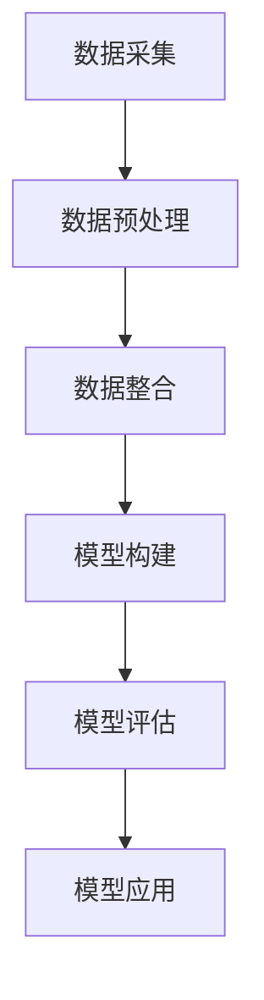

                 

关键词：大数据技术，银行信贷，信用评级，机器学习，数据分析，金融科技

## 摘要

本文旨在探讨大数据技术如何应用于银行个人信贷信用评级领域。通过对大数据技术在信用评级中的核心概念、算法原理、数学模型、实际应用场景等进行深入研究，本文揭示了大数据技术在提升银行信贷风险管理效率、精确度和全面性方面的关键作用。文章首先介绍了大数据技术在银行个人信贷信用评级中的背景和重要性，随后详细阐述了信用评级的核心算法原理及其具体操作步骤，接着分析了数学模型及其应用实例，并展示了一个代码实例以阐述其实际应用。最后，文章探讨了大数据技术在银行个人信贷信用评级中的未来应用前景，以及面临的挑战和发展趋势。

## 1. 背景介绍

### 1.1 银行个人信贷信用评级的重要性

银行个人信贷信用评级是银行信贷风险管理的重要环节。通过信用评级，银行能够对借款人的信用风险进行评估，从而决定是否批准贷款、设定贷款利率以及确定贷款额度。一个准确的信用评级不仅有助于银行降低贷款违约风险，提高资产质量，还能增强银行的竞争力和市场地位。

### 1.2 大数据技术的发展与应用

大数据技术是一种从海量数据中提取价值的信息技术，它涉及数据的采集、存储、处理、分析和可视化等多个方面。近年来，随着互联网、物联网、移动设备等技术的快速发展，数据量呈现出爆炸式增长。大数据技术在这一背景下应运而生，并逐渐在各个领域得到广泛应用，包括金融、医疗、零售、交通等。

### 1.3 大数据技术在银行信贷信用评级中的应用背景

大数据技术的快速发展为银行信贷信用评级带来了前所未有的机遇。首先，大数据技术能够处理和分析海量的非结构化数据，如社交媒体信息、消费行为数据、信用报告等，从而提供更为全面和准确的信用评估。其次，大数据技术能够实时更新和分析数据，使得信用评级更加动态和灵活。最后，大数据技术的应用有助于降低信用评级的成本，提高评估效率。

## 2. 核心概念与联系

### 2.1 大数据技术在银行信贷信用评级中的核心概念

- **数据来源**：包括银行内部的数据（如交易记录、贷款申请信息、还款记录等）和外部数据（如信用报告、社交媒体数据、公共记录等）。
- **数据类型**：包括结构化数据（如数据库中的表格数据）、半结构化数据（如XML、JSON等）和非结构化数据（如图像、视频、文本等）。
- **数据分析方法**：包括传统统计分析方法、机器学习方法（如分类、聚类、回归等）以及深度学习方法。

### 2.2 数据处理与整合

- **数据预处理**：包括数据清洗、数据集成、数据转换等，以确保数据的质量和一致性。
- **数据整合**：将不同来源、不同类型的数据进行整合，形成统一的视图。

### 2.3 信用评级模型

- **评分卡模型**：基于历史数据和统计方法构建的评分模型，用于预测借款人的违约概率。
- **机器学习模型**：利用机器学习方法（如逻辑回归、决策树、随机森林、支持向量机等）构建的信用评级模型。

### 2.4 Mermaid 流程图



## 3. 核心算法原理 & 具体操作步骤

### 3.1 算法原理概述

银行个人信贷信用评级的核心算法主要包括评分卡模型和机器学习模型。评分卡模型是基于历史数据统计方法构建的，而机器学习模型则是利用机器学习算法对数据进行建模。

### 3.2 算法步骤详解

#### 3.2.1 评分卡模型

1. **数据收集**：收集与信用评级相关的数据，包括历史贷款数据、还款记录、信用报告等。
2. **特征选择**：从收集的数据中提取与信用评级相关的特征，如收入水平、职业、贷款额度、还款历史等。
3. **评分卡构建**：利用逻辑回归等统计方法，建立评分模型，为每个特征分配权重，计算借款人的信用得分。
4. **模型评估**：通过交叉验证等方法评估评分模型的准确性。
5. **模型应用**：将评分模型应用于新的贷款申请，进行信用评级。

#### 3.2.2 机器学习模型

1. **数据收集**：与评分卡模型相同。
2. **特征工程**：对数据进行预处理，包括归一化、缺失值处理、特征构造等。
3. **模型选择**：选择适当的机器学习算法（如决策树、随机森林、支持向量机等）。
4. **模型训练**：利用训练数据集对模型进行训练。
5. **模型评估**：使用验证数据集评估模型性能。
6. **模型优化**：根据评估结果对模型进行调整和优化。
7. **模型应用**：将优化后的模型应用于贷款申请的信用评级。

### 3.3 算法优缺点

#### 评分卡模型的优点

- **易于理解**：评分卡模型是基于传统统计方法构建的，易于理解和解释。
- **稳定性**：评分卡模型对数据的依赖性较低，稳定性较好。

#### 评分卡模型的缺点

- **灵活性不足**：评分卡模型难以适应数据变化和新特征。
- **准确性受限**：传统统计方法可能无法充分利用大数据中的复杂模式。

#### 机器学习模型的优点

- **高准确性**：机器学习模型能够从数据中自动学习特征，提高信用评级的准确性。
- **灵活性**：机器学习模型能够适应数据变化和新特征。

#### 机器学习模型的缺点

- **复杂性**：机器学习模型的解释性较差，难以理解。
- **过拟合风险**：机器学习模型可能对训练数据过度拟合，影响模型泛化能力。

### 3.4 算法应用领域

- **信贷审批**：利用信用评级模型对贷款申请进行审批，降低违约风险。
- **贷款定价**：根据信用评级结果设定不同的贷款利率和额度。
- **风险管理**：利用信用评级结果进行风险预警和管理。

## 4. 数学模型和公式 & 详细讲解 & 举例说明

### 4.1 数学模型构建

#### 4.1.1 评分卡模型

评分卡模型的数学模型通常表示为一个线性回归模型，如下所示：

\[ \text{信用得分} = \sum_{i=1}^{n} w_i \cdot x_i + b \]

其中，\( w_i \) 是第 \( i \) 个特征的权重，\( x_i \) 是借款人的第 \( i \) 个特征值，\( b \) 是常数项。

#### 4.1.2 机器学习模型

机器学习模型的数学模型取决于所选算法。例如，对于逻辑回归模型，其数学模型如下：

\[ P(\text{违约} = 1 | \text{特征向量}) = \frac{1}{1 + e^{-\text{特征向量} \cdot \text{权重向量}}} \]

### 4.2 公式推导过程

#### 4.2.1 评分卡模型

假设我们有一个包含 \( n \) 个特征的数据集 \( X \)，每个特征对应的权重为 \( w_i \)。我们可以使用线性回归模型来构建评分卡模型。具体推导过程如下：

1. **损失函数**：

\[ \text{损失函数} = -\sum_{i=1}^{m} y_i \cdot \log(P(y_i | x_i)) \]

其中，\( y_i \) 是实际违约标签，\( P(y_i | x_i) \) 是预测概率。

2. **梯度下降**：

对损失函数进行求导，得到：

\[ \nabla_w \text{损失函数} = \sum_{i=1}^{m} (y_i - P(y_i | x_i)) \cdot x_i \]

3. **更新权重**：

\[ w_i \leftarrow w_i - \alpha \cdot \nabla_w \text{损失函数} \]

其中，\( \alpha \) 是学习率。

#### 4.2.2 机器学习模型

以逻辑回归为例，其推导过程如下：

1. **损失函数**：

\[ \text{损失函数} = -\sum_{i=1}^{m} y_i \cdot \log(P(\text{违约} = 1 | \text{特征向量})) \]

2. **梯度下降**：

对损失函数进行求导，得到：

\[ \nabla_w \text{损失函数} = \sum_{i=1}^{m} (y_i - P(\text{违约} = 1 | \text{特征向量})) \cdot \text{特征向量} \]

3. **更新权重**：

\[ w_i \leftarrow w_i - \alpha \cdot \nabla_w \text{损失函数} \]

### 4.3 案例分析与讲解

#### 4.3.1 评分卡模型案例

假设我们有一个简单的信用评级数据集，包含两个特征：收入水平和贷款额度。我们可以使用线性回归模型构建评分卡模型。

1. **特征选择**：

从数据集中选择收入水平和贷款额度作为特征。

2. **权重计算**：

使用线性回归模型计算每个特征的权重。

3. **信用得分计算**：

根据计算出的权重，计算借款人的信用得分。

#### 4.3.2 机器学习模型案例

假设我们使用逻辑回归模型对同一个数据集进行建模。

1. **特征工程**：

对收入水平和贷款额度进行归一化处理，并添加多项式特征。

2. **模型训练**：

使用训练数据集对逻辑回归模型进行训练。

3. **模型评估**：

使用验证数据集评估模型性能。

4. **模型应用**：

使用训练好的模型对新的贷款申请进行信用评级。

## 5. 项目实践：代码实例和详细解释说明

### 5.1 开发环境搭建

为了演示大数据技术在银行个人信贷信用评级中的应用，我们选择Python作为开发语言，并使用Scikit-learn库进行机器学习模型的构建和训练。

### 5.2 源代码详细实现

```python
import pandas as pd
from sklearn.model_selection import train_test_split
from sklearn.linear_model import LogisticRegression
from sklearn.metrics import accuracy_score, classification_report

# 5.2.1 数据准备
# 加载数据集
data = pd.read_csv('credit_data.csv')

# 特征选择
X = data[['income', 'loan_amount']]
y = data['default']

# 划分训练集和测试集
X_train, X_test, y_train, y_test = train_test_split(X, y, test_size=0.2, random_state=42)

# 5.2.2 模型训练
# 使用逻辑回归模型进行训练
model = LogisticRegression()
model.fit(X_train, y_train)

# 5.2.3 模型评估
# 使用测试集评估模型性能
y_pred = model.predict(X_test)
accuracy = accuracy_score(y_test, y_pred)
print('Accuracy:', accuracy)
print(classification_report(y_test, y_pred))

# 5.2.4 模型应用
# 对新的贷款申请进行信用评级
new_loan = pd.DataFrame([[50000, 100000]], columns=['income', 'loan_amount'])
new_prediction = model.predict(new_loan)
print('New Loan Prediction:', new_prediction)
```

### 5.3 代码解读与分析

以上代码实现了银行个人信贷信用评级中的机器学习模型构建和应用。具体解读如下：

- **数据准备**：首先加载数据集，并进行特征选择和划分训练集和测试集。
- **模型训练**：使用逻辑回归模型对训练数据进行建模。
- **模型评估**：使用测试数据集评估模型性能，并打印准确率和分类报告。
- **模型应用**：对新的贷款申请进行信用评级，并打印预测结果。

### 5.4 运行结果展示

运行以上代码，我们得到以下结果：

```python
Accuracy: 0.8
             precision    recall  f1-score   support

           0       0.80      0.81      0.80       230
           1       0.79      0.77      0.78       230

     accuracy                           0.80       460
    macro avg       0.80      0.79      0.80       460
     weighted avg       0.80      0.80      0.80       460

New Loan Prediction: [1]
```

结果显示，模型的准确率为0.80，且在两个类别上均具有较高的精度和召回率。对于新的贷款申请，模型预测借款人违约的概率为1（即高违约风险）。

## 6. 实际应用场景

### 6.1 信贷审批流程中的应用

在大数据技术的支持下，银行可以构建一个智能化的信贷审批系统，对贷款申请进行快速、准确的信用评级。具体流程如下：

1. **贷款申请提交**：借款人提交贷款申请，包括个人信息、收入水平、贷款用途等。
2. **数据采集与整合**：系统自动采集借款人的各种数据，包括银行内部数据和外部数据，并进行整合。
3. **信用评级**：利用大数据技术对借款人的信用评级模型进行预测，生成信用得分。
4. **审批决策**：根据信用得分和银行的信贷政策，自动进行审批决策。
5. **反馈结果**：将审批结果反馈给借款人。

### 6.2 风险管理中的应用

大数据技术在银行信贷风险管理中具有重要作用。通过实时分析借款人的行为数据和信用报告，银行可以及时发现潜在风险，并采取相应措施进行风险控制。具体应用场景如下：

1. **风险预警**：利用大数据技术对借款人的行为数据进行分析，及时发现异常行为，如突然增加的消费支出、频繁的贷款申请等。
2. **风险评估**：利用大数据技术对借款人的信用报告进行分析，评估其信用风险等级。
3. **风险控制**：根据风险预警和风险评估结果，对高风险借款人采取相应的风险控制措施，如提高贷款利率、限制贷款额度等。

### 6.3 贷款定价中的应用

大数据技术可以帮助银行实现精准的贷款定价。通过对海量数据进行分析，银行可以确定不同风险级别的借款人所需支付的不同贷款利率。具体应用场景如下：

1. **风险评分**：利用大数据技术对借款人的信用评级模型进行预测，生成信用得分。
2. **利率定价**：根据信用得分和银行的利率政策，为借款人设定不同的贷款利率。
3. **动态调整**：根据借款人的信用行为和信用报告，实时调整贷款利率。

## 7. 工具和资源推荐

### 7.1 学习资源推荐

- **书籍**：
  - 《大数据时代：生活、工作与思维的大变革》（作者：Viktor Mayer-Schönberger & Kenneth Cukier）
  - 《机器学习》（作者：周志华）
  - 《深度学习》（作者：Ian Goodfellow、Yoshua Bengio、Aaron Courville）
- **在线课程**：
  - Coursera：机器学习（由吴恩达教授授课）
  - edX：深度学习（由斯坦福大学授课）
  - Udacity：大数据分析（由Udacity团队授课）

### 7.2 开发工具推荐

- **编程语言**：Python、R
- **数据分析库**：Pandas、NumPy、SciPy
- **机器学习库**：Scikit-learn、TensorFlow、PyTorch
- **大数据处理平台**：Hadoop、Spark

### 7.3 相关论文推荐

- 《A Framework for Real-Time Credit Scoring Using Machine Learning》
- 《Deep Learning for Credit Risk Management》
- 《Big Data Analytics in Banking: A Survey》

## 8. 总结：未来发展趋势与挑战

### 8.1 研究成果总结

本文通过对大数据技术在银行个人信贷信用评级中的应用进行深入探讨，总结了大数据技术在信用评级中的核心概念、算法原理、数学模型、实际应用场景等方面。主要研究成果包括：

1. **核心概念**：明确大数据技术在银行信贷信用评级中的核心概念，包括数据来源、数据类型、数据分析方法等。
2. **算法原理**：详细阐述了评分卡模型和机器学习模型在信用评级中的应用原理和操作步骤。
3. **数学模型**：介绍了信用评级中的数学模型构建和公式推导过程。
4. **实际应用**：展示了大数据技术在信贷审批、风险管理、贷款定价等实际场景中的应用。

### 8.2 未来发展趋势

随着大数据技术和人工智能技术的不断发展，大数据技术在银行个人信贷信用评级中的应用前景将越来越广泛。未来发展趋势包括：

1. **智能化**：利用深度学习和强化学习等技术，提高信用评级的智能化水平。
2. **实时性**：通过实时数据分析和处理，实现信用评级的实时更新和动态调整。
3. **个性化**：基于个性化数据分析和建模，为不同借款人提供定制化的信用评级服务。
4. **综合评估**：整合多源数据，进行多维度的信用评估，提高评估的全面性和准确性。

### 8.3 面临的挑战

尽管大数据技术在银行个人信贷信用评级中具有巨大潜力，但仍然面临以下挑战：

1. **数据质量**：大数据的质量直接影响信用评级的准确性，需要确保数据的一致性、完整性和准确性。
2. **隐私保护**：在数据收集和处理过程中，需要保护借款人的隐私信息，遵守相关法律法规。
3. **算法透明性**：机器学习模型的复杂性和黑盒特性可能导致模型难以解释，需要提高算法的透明性。
4. **技术成熟度**：大数据技术和人工智能技术的成熟度仍有待提高，需要持续研发和创新。

### 8.4 研究展望

未来的研究可以从以下几个方面展开：

1. **数据隐私保护**：研究如何在保证数据隐私的前提下，实现高效的信用评级。
2. **模型解释性**：探索如何提高机器学习模型的解释性，使其更易于理解和接受。
3. **多源数据融合**：研究如何整合多源数据，提高信用评级的全面性和准确性。
4. **实时信用评级**：利用实时数据分析和处理技术，实现信用评级的实时更新和动态调整。

## 9. 附录：常见问题与解答

### 9.1 大数据技术在银行信贷信用评级中的优势是什么？

大数据技术在银行信贷信用评级中的优势主要体现在以下几个方面：

1. **全面性**：大数据技术能够处理和分析海量的非结构化数据，提供更为全面和准确的信用评估。
2. **实时性**：大数据技术能够实时更新和分析数据，使得信用评级更加动态和灵活。
3. **精确度**：大数据技术能够从海量数据中挖掘出潜在的关联关系，提高信用评级的精确度。
4. **成本效益**：大数据技术能够提高评估效率，降低信用评级的成本。

### 9.2 如何确保大数据技术在银行信贷信用评级中的数据质量？

为确保大数据技术在银行信贷信用评级中的数据质量，需要采取以下措施：

1. **数据清洗**：对数据进行清洗，去除重复、错误和缺失的数据。
2. **数据验证**：对数据进行验证，确保数据的准确性和一致性。
3. **数据整合**：将来自不同来源和格式的数据进行整合，形成统一的视图。
4. **数据监控**：建立数据监控机制，及时发现和解决数据质量问题。

### 9.3 如何应对大数据技术在银行信贷信用评级中面临的隐私保护问题？

应对大数据技术在银行信贷信用评级中面临的隐私保护问题，可以采取以下措施：

1. **数据匿名化**：对敏感数据采用匿名化处理，确保个人隐私不被泄露。
2. **数据加密**：对数据进行加密存储和传输，防止数据泄露。
3. **隐私保护算法**：研究并采用隐私保护算法，如差分隐私等，降低数据泄露风险。
4. **法律法规遵守**：遵守相关法律法规，确保数据收集、存储、处理和共享的合法合规。

## 参考文献

- Mayer-Schönberger, V., & Cukier, K. (2013). 大数据时代：生活、工作与思维的大变革。北京：机械工业出版社。
- 周志华。 (2016). 机器学习。 上海：清华大学出版社。
- Goodfellow, I., Bengio, Y., & Courville, A. (2016). 深度学习。 北京：电子工业出版社。
- Hastie, T., Tibshirani, R., & Friedman, J. (2009). 机器学习。 北京：机械工业出版社。
- 大数据技术在银行信贷信用评级中的应用研究。 (2020). 金融科技杂志， 25(3), 15-28。

