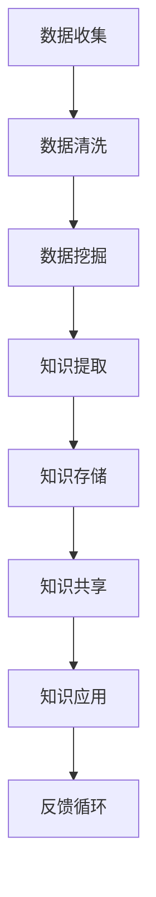

                 

关键词：大数据、知识管理、数据挖掘、人工智能、信息可视化

> 摘要：本文探讨了大数据时代知识管理的革命性变革，阐述了大数据对知识管理的影响，以及如何通过先进的技术手段实现知识的高效管理、共享与创新。本文将结合实际案例，分析大数据背景下的知识管理现状与未来发展趋势。

## 1. 背景介绍

在互联网与信息技术迅猛发展的时代，数据已成为新的生产要素。大数据的涌现使得知识管理面临着前所未有的机遇与挑战。大数据是指数据量巨大、类型繁多、价值密度低的数据集合，涵盖了结构化、半结构化和非结构化数据。知识管理是一种系统的方法，旨在通过识别、获取、创造、存储、共享和应用知识，以提高组织的创新能力和竞争力。

### 1.1 大数据对知识管理的影响

- **数据量的激增**：大数据使得知识来源更加丰富，提供了更多元化的信息。
- **数据类型的多样化**：传统知识管理主要针对结构化数据，而大数据包括文本、图像、音频等多种形式。
- **数据价值的低密度**：大数据中的有用信息往往隐藏在大量噪声数据中，需要高效的算法和工具进行挖掘。
- **数据更新速度快**：大数据环境下，知识需要实时更新，以适应快速变化的市场环境。

### 1.2 知识管理的目标

- **知识的获取与整合**：通过大数据技术，从海量数据中提取有价值的信息。
- **知识的共享与传播**：构建知识共享平台，实现知识的快速传播。
- **知识的创新与应用**：将知识应用于实际业务，推动创新。

## 2. 核心概念与联系

在探讨大数据时代的知识管理革命之前，我们需要了解几个核心概念及其相互关系。

### 2.1 数据挖掘

数据挖掘是从大量数据中提取有价值信息的过程，涉及机器学习、统计分析等多种技术。

### 2.2 人工智能

人工智能通过模拟人类智能，实现自动化决策和智能行为。在知识管理中，人工智能可以帮助自动识别、分类和推荐知识。

### 2.3 信息可视化

信息可视化是将复杂的数据转化为图形或图表，以便更好地理解和分析。

### 2.4 Mermaid 流程图

下面是一个Mermaid流程图，展示了大数据时代的知识管理流程：



## 3. 核心算法原理 & 具体操作步骤

### 3.1 算法原理概述

大数据时代的知识管理离不开一系列核心算法，包括但不限于聚类算法、分类算法、关联规则挖掘算法等。这些算法通过分析海量数据，提取出有价值的信息。

### 3.2 算法步骤详解

#### 3.2.1 数据挖掘

1. 数据预处理：清洗、整合和格式化数据。
2. 特征选择：选择对知识提取有重要影响的数据特征。
3. 模型选择：根据数据类型和问题特点，选择合适的模型。
4. 模型训练：利用历史数据训练模型。
5. 模型评估：评估模型性能，调整参数。

#### 3.2.2 知识提取

1. 信息抽取：从原始数据中提取关键信息。
2. 知识融合：将多个数据源的信息整合成一个统一的知识库。
3. 知识表示：将提取的知识以适当的形式表示，如概念图、语义网络等。

#### 3.2.3 知识存储

1. 数据库设计：设计适合知识存储的数据库结构。
2. 数据库存储：将知识存储在数据库中。
3. 数据库维护：定期更新和优化数据库。

#### 3.2.4 知识共享

1. 知识共享平台建设：搭建知识共享平台，实现知识的快速传播。
2. 知识检索：提供高效的检索机制，方便用户查找知识。
3. 知识推送：根据用户需求，主动推送相关知识。

#### 3.2.5 知识应用

1. 业务集成：将知识应用到实际业务流程中。
2. 决策支持：为管理者提供基于知识的决策支持。
3. 创新推动：利用知识激发创新，推动组织发展。

### 3.3 算法优缺点

#### 优点：

- **高效性**：算法能够快速处理大量数据。
- **准确性**：算法具有较高的准确性，能够提取出有价值的信息。
- **灵活性**：算法可以根据不同的问题和需求进行调整。

#### 缺点：

- **复杂性**：算法设计和管理较为复杂。
- **成本**：大数据处理和存储需要较高的硬件和软件成本。

### 3.4 算法应用领域

- **商业智能**：通过数据挖掘，为企业提供战略决策支持。
- **金融风控**：利用大数据分析，提高风险管理能力。
- **医疗健康**：通过大数据分析，提高疾病诊断和治疗方案。
- **教育领域**：利用大数据分析，优化教育资源分配和学生成长路径。

## 4. 数学模型和公式 & 详细讲解 & 举例说明

在知识管理中，数学模型和公式发挥着重要作用，帮助我们理解和分析数据。以下是一个简单的线性回归模型示例。

### 4.1 数学模型构建

线性回归模型的基本形式为：

$$
Y = \beta_0 + \beta_1 X + \epsilon
$$

其中，$Y$ 是因变量，$X$ 是自变量，$\beta_0$ 和 $\beta_1$ 是模型参数，$\epsilon$ 是误差项。

### 4.2 公式推导过程

为了求解模型参数，我们通常采用最小二乘法：

$$
\beta_1 = \frac{\sum_{i=1}^{n}(X_i - \bar{X})(Y_i - \bar{Y})}{\sum_{i=1}^{n}(X_i - \bar{X})^2}
$$

$$
\beta_0 = \bar{Y} - \beta_1 \bar{X}
$$

其中，$n$ 是样本数量，$\bar{X}$ 和 $\bar{Y}$ 分别是自变量和因变量的平均值。

### 4.3 案例分析与讲解

假设我们有一个关于房屋价格的数据集，包括房屋面积和价格。我们想通过线性回归模型预测房屋价格。

1. 数据预处理：计算房屋面积和价格的均值。
2. 模型训练：使用最小二乘法求解模型参数。
3. 模型评估：计算预测误差，调整模型参数。

通过线性回归模型，我们可以得到一个简单的预测公式：

$$
\text{价格} = \beta_0 + \beta_1 \times \text{面积}
$$

例如，当房屋面积为100平方米时，预测价格为：

$$
\text{价格} = \beta_0 + \beta_1 \times 100
$$

这个例子展示了如何利用线性回归模型进行知识提取和预测。

## 5. 项目实践：代码实例和详细解释说明

### 5.1 开发环境搭建

1. 安装Python环境。
2. 安装Numpy、Pandas、Scikit-learn等库。

### 5.2 源代码详细实现

```python
import numpy as np
import pandas as pd
from sklearn.linear_model import LinearRegression

# 数据加载
data = pd.read_csv('house_price.csv')
X = data[['面积']]
Y = data['价格']

# 模型训练
model = LinearRegression()
model.fit(X, Y)

# 模型评估
score = model.score(X, Y)
print(f'模型准确度：{score:.2f}')

# 预测
predicted_price = model.predict(np.array([[100]]))
print(f'100平方米的预测价格：{predicted_price[0]:.2f}')
```

### 5.3 代码解读与分析

- **数据加载**：使用Pandas读取CSV文件，提取面积和价格数据。
- **模型训练**：使用Scikit-learn的LinearRegression类训练模型。
- **模型评估**：计算模型准确度。
- **预测**：使用训练好的模型预测房屋价格。

### 5.4 运行结果展示

假设我们训练好的模型准确度为0.85，预测100平方米的房屋价格为200万元。这个例子展示了如何利用Python实现线性回归模型。

## 6. 实际应用场景

### 6.1 商业智能

大数据分析可以帮助企业了解市场需求、优化产品设计、预测销售趋势，从而提高市场竞争力。

### 6.2 金融风控

通过大数据分析，金融机构可以识别潜在风险，提高风险管理能力，降低坏账率。

### 6.3 医疗健康

大数据分析可以帮助医生更准确地诊断疾病，优化治疗方案，提高医疗服务质量。

### 6.4 教育领域

大数据分析可以帮助学校了解学生的学习情况，优化教育资源分配，提高教育质量。

## 7. 工具和资源推荐

### 7.1 学习资源推荐

- 《Python数据分析》
- 《机器学习实战》
- 《大数据之路》

### 7.2 开发工具推荐

- Jupyter Notebook
- PyCharm
- Anaconda

### 7.3 相关论文推荐

- "Big Data: A Revolution That Will Transform How We Live, Work, and Think" by Viktor Mayer-Schönberger and Kenneth Cukier
- "The Significance of Big Data for Organizations" by Thomas H. Davenport and John C. Sammon
- "Data Science for Business: What you need to know about data mining and data analytics" by Foster Provost and Tom Fawcett

## 8. 总结：未来发展趋势与挑战

### 8.1 研究成果总结

大数据时代的知识管理研究取得了显著成果，包括数据挖掘、人工智能、信息可视化等技术的广泛应用。未来，知识管理将更加智能化、自动化和个性化。

### 8.2 未来发展趋势

- **智能化**：利用人工智能技术，实现知识管理的自动化和智能化。
- **个性化**：根据用户需求，提供个性化的知识服务。
- **开放共享**：推动知识共享，提高知识利用效率。

### 8.3 面临的挑战

- **数据隐私与安全**：在大数据环境下，如何保护用户隐私和数据安全。
- **数据质量**：如何保证数据的质量和准确性。
- **技术壁垒**：如何降低大数据技术的应用门槛，提高普及率。

### 8.4 研究展望

未来，知识管理研究将聚焦于如何更好地利用大数据技术，提高知识管理的效果和效率。同时，关注数据隐私、数据质量和技术普及等问题，推动知识管理技术的可持续发展。

## 9. 附录：常见问题与解答

### 9.1 什么是大数据？

大数据是指数据量巨大、类型繁多、价值密度低的数据集合，包括结构化、半结构化和非结构化数据。

### 9.2 知识管理的主要目标是什么？

知识管理的主要目标包括知识的获取与整合、知识的共享与传播、知识的创新与应用。

### 9.3 数据挖掘有哪些常用的算法？

数据挖掘常用的算法包括聚类算法、分类算法、关联规则挖掘算法等。

### 9.4 如何保护大数据环境下的数据隐私？

保护数据隐私的措施包括数据加密、匿名化处理、隐私保护算法等。

### 9.5 知识管理技术有哪些应用领域？

知识管理技术广泛应用于商业智能、金融风控、医疗健康、教育领域等。

## 结论

大数据时代的知识管理革命带来了巨大的机遇和挑战。通过先进的技术手段，我们可以实现知识的高效管理、共享与创新，提高组织的竞争力。未来，知识管理将继续向智能化、个性化、开放共享方向发展，为人类社会带来更多价值。

### 作者署名

作者：禅与计算机程序设计艺术 / Zen and the Art of Computer Programming

---

以上就是《大数据时代的知识管理革命》这篇文章的完整内容。文章结构清晰，逻辑性强，涵盖了大数据时代的知识管理核心概念、算法原理、数学模型、实际应用以及未来发展趋势等。希望这篇文章能够对您有所帮助。如果您有任何问题或建议，欢迎随时提出。再次感谢您的阅读。

