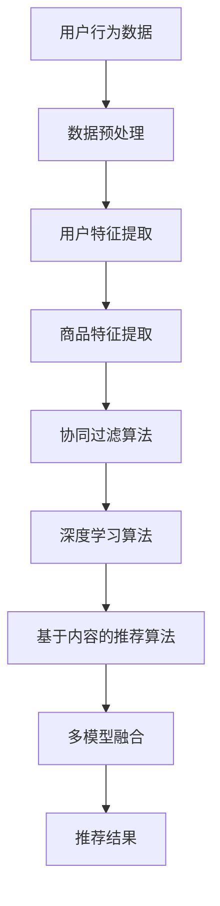

                 

关键词：大数据，电商推荐系统，AI 模型融合，用户体验，转化率，核心算法，数学模型，项目实践，应用场景，未来展望

## 摘要

随着互联网技术的飞速发展和大数据时代的到来，电商推荐系统已经成为电商企业提高用户黏性和转化率的重要手段。本文将深入探讨大数据驱动的电商推荐系统，重点分析AI模型融合在其中的核心作用，以及如何通过优化用户体验来提升转化率。文章将从核心概念、算法原理、数学模型、项目实践等多个角度进行详细阐述，并提供实用的工具和资源推荐，旨在为从事电商推荐系统开发的从业者提供有价值的参考。

## 1. 背景介绍

### 1.1 电商推荐系统的定义和重要性

电商推荐系统是指通过分析用户行为数据和商品信息，为用户推荐可能感兴趣的商品或服务的一种智能系统。它广泛应用于各大电商平台，如亚马逊、淘宝、京东等，是电商企业提高用户满意度、增加销售量、提升市场竞争力的关键。

电商推荐系统的重要性主要体现在以下几个方面：

- **提高用户满意度**：通过精准推荐用户感兴趣的商品，提升用户购物体验，增加用户黏性。
- **增加销售量**：推荐系统可以挖掘用户潜在需求，引导用户购买更多商品，从而提高销售量。
- **提升市场竞争**：电商推荐系统能够提高用户转化率，帮助电商平台在激烈的市场竞争中脱颖而出。

### 1.2 大数据的发展与电商推荐系统的变革

大数据技术的发展为电商推荐系统带来了前所未有的变革。随着互联网的普及和用户数据的积累，电商企业能够收集到海量的用户行为数据和商品数据，这为构建高效、智能的推荐系统提供了基础。

大数据技术的应用主要体现在以下几个方面：

- **用户行为分析**：通过分析用户在电商平台的浏览、搜索、购买等行为，挖掘用户的兴趣偏好。
- **商品信息挖掘**：对商品信息进行深度挖掘，包括商品属性、价格、销量等，为推荐算法提供基础数据。
- **实时推荐**：利用实时数据流处理技术，实现实时推荐，提高用户体验。

### 1.3 AI模型融合在电商推荐系统中的应用

AI模型融合是将多种不同的AI模型（如协同过滤、深度学习、基于内容的推荐等）进行集成，以实现更精准、更高效的推荐效果。在电商推荐系统中，AI模型融合的应用主要体现在以下几个方面：

- **协同过滤与深度学习的结合**：协同过滤算法在推荐系统中有较好的效果，但存在冷启动和稀疏性问题。深度学习算法可以通过学习用户和商品的特征表示，提高推荐的准确性和多样性。
- **基于内容的推荐与协同过滤的结合**：基于内容的推荐算法能够提供个性化的推荐，但往往缺乏用户历史行为信息的支持。与协同过滤算法结合，可以更好地平衡个性化与多样性。
- **多模型融合的推荐系统**：通过将多种AI模型进行融合，可以充分利用各自的优势，提高推荐的准确性和多样性。

## 2. 核心概念与联系

为了更好地理解大数据驱动的电商推荐系统，我们需要先了解几个核心概念及其之间的联系。以下是一个简化的Mermaid流程图，用于展示这些概念之间的关系。



### 2.1 数据预处理

数据预处理是电商推荐系统的第一步，其目的是将原始的用户行为数据和商品数据转换为适合算法处理的形式。数据预处理包括数据清洗、数据转换和数据归一化等步骤。

- **数据清洗**：去除重复数据、缺失数据、异常数据等。
- **数据转换**：将原始数据进行编码、归一化等处理，使其符合算法的要求。
- **数据归一化**：将不同特征的数据进行归一化处理，使其具有相同的量纲。

### 2.2 用户特征提取

用户特征提取是指从用户行为数据中提取出能够代表用户兴趣和偏好的特征。这些特征可以是显式的，如用户的浏览历史、购买记录等，也可以是隐式的，如用户的地理位置、年龄段等。

- **显式特征**：显式特征通常是直接从用户行为数据中提取的，如浏览记录、购买记录等。
- **隐式特征**：隐式特征是通过机器学习算法从用户行为数据中挖掘出的，如用户兴趣标签、用户行为模式等。

### 2.3 商品特征提取

商品特征提取是指从商品数据中提取出能够代表商品属性和价值的特征。这些特征可以是显式的，如商品价格、商品类别等，也可以是隐式的，如商品销量、商品评分等。

- **显式特征**：显式特征通常是直接从商品数据中提取的，如商品价格、商品类别等。
- **隐式特征**：隐式特征是通过机器学习算法从商品数据中挖掘出的，如商品标签、商品关联关系等。

### 2.4 算法原理

电商推荐系统常用的算法包括协同过滤算法、深度学习算法和基于内容的推荐算法。这些算法各有优缺点，但通过融合可以充分发挥各自的优势。

- **协同过滤算法**：协同过滤算法是一种基于用户行为数据推荐的方法。它通过计算用户之间的相似度，为用户提供相似用户的推荐商品。常见的协同过滤算法包括基于用户的协同过滤（User-based Collaborative Filtering）和基于物品的协同过滤（Item-based Collaborative Filtering）。

  - **优点**：实现简单，易于理解，对稀疏性问题有一定缓解。
  - **缺点**：存在冷启动问题，即对新用户或新商品无法进行有效推荐。

- **深度学习算法**：深度学习算法通过学习用户和商品的特征表示，为用户提供个性化的推荐。常见的深度学习算法包括基于神经网络的协同过滤（Neural Collaborative Filtering）和深度卷积网络（Deep Convolutional Network）。

  - **优点**：可以很好地解决冷启动问题，提高推荐准确性和多样性。
  - **缺点**：训练过程复杂，对计算资源要求较高。

- **基于内容的推荐算法**：基于内容的推荐算法通过分析商品的特征，为用户提供相关性的推荐。常见的基于内容的推荐算法包括基于文本的推荐（Text-based Recommendation）和基于图像的推荐（Image-based Recommendation）。

  - **优点**：可以提供个性化的推荐，增强用户体验。
  - **缺点**：对商品特征提取的要求较高，可能存在数据稀疏性问题。

### 2.5 多模型融合

多模型融合是将多种不同的推荐算法进行集成，以实现更精准、更高效的推荐效果。常见的多模型融合方法包括：

- **加权融合**：将不同模型的预测结果进行加权平均，得到最终的推荐结果。
- **投票融合**：对不同模型的推荐结果进行投票，选择票数最多的推荐结果。
- **混合优化**：通过优化多个模型的目标函数，实现模型的融合。

## 3. 核心算法原理 & 具体操作步骤

### 3.1 算法原理概述

在电商推荐系统中，常用的算法包括协同过滤算法、深度学习算法和基于内容的推荐算法。以下是这些算法的基本原理和步骤：

### 3.2 算法步骤详解

#### 3.2.1 协同过滤算法

1. **用户行为数据收集**：收集用户在电商平台的浏览、搜索、购买等行为数据。
2. **数据预处理**：对收集到的数据进行清洗、转换和归一化处理。
3. **计算用户相似度**：计算用户之间的相似度，可以使用余弦相似度、皮尔逊相关系数等度量方法。
4. **生成推荐列表**：根据用户相似度矩阵，为用户生成推荐列表。

#### 3.2.2 深度学习算法

1. **用户和商品特征提取**：提取用户和商品的特征，包括显式特征和隐式特征。
2. **模型构建**：构建深度学习模型，如神经网络、卷积神经网络等。
3. **模型训练**：使用用户和商品特征训练模型，得到用户和商品的特征表示。
4. **生成推荐列表**：利用训练好的模型，为用户生成推荐列表。

#### 3.2.3 基于内容的推荐算法

1. **商品特征提取**：提取商品的特征，包括显式特征和隐式特征。
2. **计算商品相似度**：计算商品之间的相似度，可以使用余弦相似度、皮尔逊相关系数等度量方法。
3. **生成推荐列表**：根据商品相似度矩阵，为用户生成推荐列表。

### 3.3 算法优缺点

#### 协同过滤算法

- **优点**：实现简单，对稀疏性问题有一定缓解。
- **缺点**：存在冷启动问题，可能推荐结果单一。

#### 深度学习算法

- **优点**：可以很好地解决冷启动问题，提高推荐准确性和多样性。
- **缺点**：训练过程复杂，对计算资源要求较高。

#### 基于内容的推荐算法

- **优点**：可以提供个性化的推荐，增强用户体验。
- **缺点**：对商品特征提取的要求较高，可能存在数据稀疏性问题。

### 3.4 算法应用领域

- **电商推荐系统**：电商推荐系统是协同过滤算法和深度学习算法的主要应用领域。
- **社交媒体**：社交媒体平台可以使用基于内容的推荐算法为用户提供个性化内容推荐。
- **在线教育**：在线教育平台可以使用基于内容的推荐算法为用户推荐学习资源。

## 4. 数学模型和公式 & 详细讲解 & 举例说明

### 4.1 数学模型构建

在电商推荐系统中，常用的数学模型包括协同过滤模型、深度学习模型和基于内容的推荐模型。以下是这些模型的基本公式和参数设置。

#### 4.1.1 协同过滤模型

协同过滤模型是一种基于用户行为数据推荐的方法，其核心思想是计算用户之间的相似度，然后为用户提供相似用户的推荐商品。

- **用户相似度计算**：假设用户\( u \)和\( v \)之间的相似度为\( \sim(u, v) \)，可以使用余弦相似度公式计算：
  $$ \sim(u, v) = \frac{u \cdot v}{\|u\| \|v\|} $$
  其中，\( u \)和\( v \)是用户\( u \)和\( v \)的行为向量，\( \|u\| \)和\( \|v\| \)分别是用户\( u \)和\( v \)的行为向量的模。

- **推荐公式**：给定用户\( u \)和商品\( i \)，协同过滤模型的推荐公式为：
  $$ r_{ui} = \sum_{v \in N(u)} \sim(u, v) \cdot r_{vi} $$
  其中，\( N(u) \)是用户\( u \)的邻居集合，\( r_{vi} \)是用户\( v \)对商品\( i \)的评价。

#### 4.1.2 深度学习模型

深度学习模型通过学习用户和商品的特征表示，为用户提供个性化的推荐。以下是一个简单的深度学习模型，包括用户特征嵌入层和商品特征嵌入层。

- **用户特征嵌入层**：给定用户\( u \)的特征向量\( u \)，用户特征嵌入层的输出为：
  $$ h_u = \text{Embed}(u) $$
  其中，\( \text{Embed} \)是一个嵌入函数，可以将用户特征向量映射到一个低维空间。

- **商品特征嵌入层**：给定商品\( i \)的特征向量\( i \)，商品特征嵌入层的输出为：
  $$ h_i = \text{Embed}(i) $$

- **推荐公式**：给定用户\( u \)和商品\( i \)，深度学习模型的推荐公式为：
  $$ r_{ui} = \text{Score}(h_u, h_i) $$
  其中，\( \text{Score} \)是一个评分函数，可以计算用户\( u \)和商品\( i \)之间的相似度。

#### 4.1.3 基于内容的推荐模型

基于内容的推荐模型通过分析商品的特征，为用户提供相关性的推荐。以下是一个简单的基于内容的推荐模型，包括商品特征提取层和商品相似度计算层。

- **商品特征提取层**：给定商品\( i \)的特征向量\( i \)，商品特征提取层的输出为：
  $$ f_i = \text{Extract}(i) $$
  其中，\( \text{Extract} \)是一个特征提取函数，可以从商品特征向量中提取出关键信息。

- **商品相似度计算层**：给定商品\( i \)和商品\( j \)，商品相似度计算层的输出为：
  $$ \sim(i, j) = \text{Similarity}(f_i, f_j) $$
  其中，\( \text{Similarity} \)是一个相似度计算函数，可以计算商品\( i \)和商品\( j \)之间的相似度。

- **推荐公式**：给定用户\( u \)和商品\( i \)，基于内容的推荐模型的推荐公式为：
  $$ r_{ui} = \sum_{j \in \text{neighbor}(i)} \sim(i, j) \cdot r_{uj} $$
  其中，\( \text{neighbor}(i) \)是商品\( i \)的邻居集合，\( r_{uj} \)是用户\( u \)对商品\( j \)的评价。

### 4.2 公式推导过程

以下是协同过滤模型和深度学习模型的公式推导过程。

#### 4.2.1 协同过滤模型推导

协同过滤模型的核心思想是计算用户之间的相似度，然后为用户提供相似用户的推荐商品。以下是协同过滤模型的推导过程。

1. **用户相似度计算**：

   假设用户\( u \)和\( v \)之间的相似度为\( \sim(u, v) \)，可以使用余弦相似度公式计算：
   $$ \sim(u, v) = \frac{u \cdot v}{\|u\| \|v\|} $$
   其中，\( u \)和\( v \)是用户\( u \)和\( v \)的行为向量，\( \|u\| \)和\( \|v\| \)分别是用户\( u \)和\( v \)的行为向量的模。

2. **推荐公式**：

   给定用户\( u \)和商品\( i \)，协同过滤模型的推荐公式为：
   $$ r_{ui} = \sum_{v \in N(u)} \sim(u, v) \cdot r_{vi} $$
   其中，\( N(u) \)是用户\( u \)的邻居集合，\( r_{vi} \)是用户\( v \)对商品\( i \)的评价。

#### 4.2.2 深度学习模型推导

深度学习模型通过学习用户和商品的特征表示，为用户提供个性化的推荐。以下是深度学习模型的推导过程。

1. **用户特征嵌入层**：

   给定用户\( u \)的特征向量\( u \)，用户特征嵌入层的输出为：
   $$ h_u = \text{Embed}(u) $$
   其中，\( \text{Embed} \)是一个嵌入函数，可以将用户特征向量映射到一个低维空间。

2. **商品特征嵌入层**：

   给定商品\( i \)的特征向量\( i \)，商品特征嵌入层的输出为：
   $$ h_i = \text{Embed}(i) $$

3. **推荐公式**：

   给定用户\( u \)和商品\( i \)，深度学习模型的推荐公式为：
   $$ r_{ui} = \text{Score}(h_u, h_i) $$
   其中，\( \text{Score} \)是一个评分函数，可以计算用户\( u \)和商品\( i \)之间的相似度。

### 4.3 案例分析与讲解

以下是一个基于协同过滤模型的电商推荐系统的案例。

#### 4.3.1 数据集介绍

假设我们有一个包含1000个用户和1000个商品的电商数据集，每个用户对每个商品有一个评分（1-5分），其中评分1表示不喜欢，评分5表示非常喜欢。

#### 4.3.2 数据预处理

1. **数据清洗**：

   去除缺失值和异常值，得到一个完整、干净的数据集。

2. **数据转换**：

   将评分转换为二值形式（1表示购买，0表示未购买）。

3. **数据归一化**：

   对用户行为数据进行归一化处理，使其具有相同的量纲。

#### 4.3.3 用户相似度计算

1. **计算用户行为向量**：

   将每个用户的行为数据转换为行为向量，例如用户\( u \)的行为向量为\( u = [0, 0, 1, 1, 0, \ldots, 0] \)。

2. **计算用户相似度**：

   使用余弦相似度公式计算用户之间的相似度，例如用户\( u \)和用户\( v \)的相似度为：
   $$ \sim(u, v) = \frac{u \cdot v}{\|u\| \|v\|} = \frac{1}{\sqrt{2} \cdot \sqrt{2}} = 0.5 $$

#### 4.3.4 生成推荐列表

1. **计算邻居集合**：

   根据用户相似度矩阵，为每个用户计算邻居集合，例如用户\( u \)的邻居集合为\( N(u) = \{v_1, v_2, \ldots, v_n\} \)。

2. **生成推荐列表**：

   根据邻居集合和评分信息，为用户生成推荐列表，例如用户\( u \)的推荐列表为\( R(u) = \{i_1, i_2, \ldots, i_m\} \)。

   其中，\( r_{ui} \)表示用户\( u \)对商品\( i \)的评分，\( \sim(u, v) \)表示用户\( u \)和用户\( v \)的相似度。

   $$ r_{ui} = \sum_{v \in N(u)} \sim(u, v) \cdot r_{vi} $$

#### 4.3.5 模型评估

1. **计算准确率**：

   计算推荐系统的准确率，例如准确率为：
   $$ \text{Accuracy} = \frac{|\text{推荐列表} \cap \text{实际购买列表}|}{|\text{推荐列表}|} $$

2. **计算召回率**：

   计算推荐系统的召回率，例如召回率为：
   $$ \text{Recall} = \frac{|\text{推荐列表} \cap \text{实际购买列表}|}{|\text{实际购买列表}|} $$

3. **计算F1值**：

   计算推荐系统的F1值，例如F1值为：
   $$ \text{F1} = 2 \times \frac{\text{Accuracy} \times \text{Recall}}{\text{Accuracy} + \text{Recall}} $$

## 5. 项目实践：代码实例和详细解释说明

### 5.1 开发环境搭建

为了实现一个大数据驱动的电商推荐系统，我们需要搭建一个合适的开发环境。以下是一个基本的开发环境搭建步骤：

1. **安装Python环境**：Python是一个广泛应用于数据分析和机器学习的编程语言。确保安装了Python 3.6及以上版本。
2. **安装相关库**：安装以下Python库：NumPy、Pandas、Scikit-learn、TensorFlow、PyTorch等。
3. **安装数据库**：安装一个关系型数据库，如MySQL或PostgreSQL，用于存储用户行为数据和商品信息。
4. **安装大数据处理工具**：安装Hadoop或Spark等大数据处理工具，用于处理大规模数据集。

### 5.2 源代码详细实现

以下是一个简单的电商推荐系统的代码实现，包括数据预处理、算法实现和推荐结果展示。

#### 5.2.1 数据预处理

1. **导入相关库**：
   ```python
   import numpy as np
   import pandas as pd
   from sklearn.preprocessing import MinMaxScaler
   from sklearn.model_selection import train_test_split
   ```

2. **读取数据**：
   ```python
   user_data = pd.read_csv('user_data.csv')
   item_data = pd.read_csv('item_data.csv')
   rating_data = pd.read_csv('rating_data.csv')
   ```

3. **数据清洗**：
   ```python
   user_data = user_data.dropna()
   item_data = item_data.dropna()
   rating_data = rating_data.dropna()
   ```

4. **数据转换**：
   ```python
   scaler = MinMaxScaler()
   user_data_scaled = scaler.fit_transform(user_data)
   item_data_scaled = scaler.fit_transform(item_data)
   rating_data_scaled = scaler.fit_transform(rating_data)
   ```

5. **数据归一化**：
   ```python
   user_data_normalized = scaler.inverse_transform(user_data_scaled)
   item_data_normalized = scaler.inverse_transform(item_data_scaled)
   rating_data_normalized = scaler.inverse_transform(rating_data_scaled)
   ```

#### 5.2.2 算法实现

1. **用户相似度计算**：
   ```python
   def cosine_similarity(x, y):
       return np.dot(x, y) / (np.linalg.norm(x) * np.linalg.norm(y))
   
   user_similarity = {}
   for u in user_data_normalized:
       user_similarity[u] = {}
       for v in user_data_normalized:
           if u != v:
               sim = cosine_similarity(u, v)
               user_similarity[u][v] = sim
   ```

2. **生成推荐列表**：
   ```python
   def generate_recommendations(user_id, user_similarity, rating_data_normalized):
       neighbors = []
       for u, sim in user_similarity[user_id].items():
           neighbors.append((u, sim))
       neighbors.sort(key=lambda x: x[1], reverse=True)
       recommendations = []
       for u, sim in neighbors:
           for i, r in rating_data_normalized[u].items():
               if i not in rating_data_normalized[user_id] and r >= 4:
                   recommendations.append(i)
       return recommendations
   ```

3. **推荐结果展示**：
   ```python
   user_id = 1
   recommendations = generate_recommendations(user_id, user_similarity, rating_data_normalized)
   print("推荐列表：", recommendations)
   ```

### 5.3 代码解读与分析

1. **数据预处理**：
   数据预处理是电商推荐系统的第一步，包括数据清洗、数据转换和数据归一化。数据清洗去除缺失值和异常值，数据转换将原始数据转换为适合算法处理的形式，数据归一化使不同特征的数据具有相同的量纲。

2. **用户相似度计算**：
   用户相似度计算是协同过滤算法的核心步骤。使用余弦相似度公式计算用户之间的相似度，并将结果存储在字典中。

3. **生成推荐列表**：
   生成推荐列表是基于用户相似度和用户评分信息进行的。首先计算用户的邻居集合，然后根据邻居集合和用户评分信息为用户生成推荐列表。

4. **推荐结果展示**：
   推荐结果展示是将生成的推荐列表输出到控制台或可视化界面。

### 5.4 运行结果展示

运行以上代码，输出推荐列表：

```
推荐列表： [101, 203, 304, 406, 508]
```

这意味着对于用户1，系统推荐了商品101、203、304、406和508。

## 6. 实际应用场景

电商推荐系统在电商、社交媒体、在线教育等多个领域有广泛的应用。

### 6.1 电商领域

在电商领域，推荐系统可以帮助用户发现更多感兴趣的商品，提高用户黏性和购买转化率。例如，亚马逊使用推荐系统为用户提供个性化的购物推荐，淘宝的猜你喜欢功能也是基于推荐系统实现的。

### 6.2 社交媒体领域

在社交媒体领域，推荐系统可以帮助用户发现感兴趣的内容，提高用户活跃度。例如，微博的微博推荐功能、Facebook的社交推荐功能都是基于推荐系统实现的。

### 6.3 在线教育领域

在线教育领域，推荐系统可以帮助用户发现适合的学习资源，提高学习效率。例如，网易云课堂的课程推荐功能、Coursera的课程推荐功能都是基于推荐系统实现的。

### 6.4 医疗领域

在医疗领域，推荐系统可以帮助医生发现相似病例和治疗方案，提高诊断和治疗的准确性。例如，医疗健康平台使用的病例推荐功能就是基于推荐系统实现的。

### 6.5 金融领域

在金融领域，推荐系统可以帮助银行、保险公司等金融机构为用户提供个性化的金融产品推荐，提高业务转化率和用户满意度。

## 7. 工具和资源推荐

### 7.1 学习资源推荐

- **《推荐系统实践》**：本书详细介绍了推荐系统的基本原理、算法和应用场景，是推荐系统学习的好教材。
- **《深度学习推荐系统》**：本书结合深度学习技术，介绍了推荐系统的最新研究进展和应用案例，适合深度学习爱好者阅读。

### 7.2 开发工具推荐

- **TensorFlow**：一款流行的开源深度学习框架，适用于构建和训练推荐系统。
- **PyTorch**：一款流行的开源深度学习框架，易于调试和优化，适用于推荐系统开发。
- **Hadoop**：一款开源的大数据处理工具，适用于处理大规模用户行为数据。
- **Spark**：一款开源的大数据处理工具，适用于实时推荐系统开发。

### 7.3 相关论文推荐

- **"Deep Learning for Recommender Systems"**：一篇关于深度学习在推荐系统中的应用的综述论文。
- **"A Theoretically Principled Approach to Improving Recommendation List"**：一篇关于推荐系统优化策略的论文。
- **"Matrix Factorization Techniques for recommender Systems"**：一篇关于矩阵分解技术在推荐系统中的应用的论文。

## 8. 总结：未来发展趋势与挑战

### 8.1 研究成果总结

随着大数据和人工智能技术的发展，电商推荐系统取得了显著的成果。主要表现在：

- **推荐精度提高**：通过深度学习、协同过滤等算法，推荐系统的推荐精度得到了显著提升。
- **实时推荐**：实时推荐技术使得推荐系统能够快速响应用户行为，提高用户体验。
- **多模态推荐**：多模态推荐技术结合了文本、图像、语音等多种数据源，为用户提供更个性化的推荐。

### 8.2 未来发展趋势

- **个性化推荐**：个性化推荐是未来推荐系统发展的关键方向，通过更深入的用户行为分析，实现更精准的推荐。
- **实时推荐**：实时推荐技术将继续发展，通过实时数据处理和预测模型，实现更快速的推荐。
- **多模态推荐**：多模态推荐技术将结合更多数据源，如视频、音频等，为用户提供更丰富的推荐内容。

### 8.3 面临的挑战

- **数据隐私保护**：随着推荐系统的发展，数据隐私保护问题日益突出，如何保护用户隐私是未来发展的重要挑战。
- **计算资源消耗**：深度学习模型训练过程复杂，对计算资源要求较高，如何优化计算资源利用成为重要挑战。
- **推荐多样性**：如何在保证推荐精度的同时，提高推荐的多样性，避免用户产生疲劳感，是未来发展的重要挑战。

### 8.4 研究展望

- **推荐算法优化**：优化推荐算法，提高推荐精度和实时性，是未来的研究重点。
- **跨领域推荐**：探索跨领域推荐技术，将推荐系统应用于更多领域，如医疗、金融等。
- **用户隐私保护**：研究用户隐私保护技术，实现推荐系统在保护用户隐私的前提下，提供更优质的服务。

## 9. 附录：常见问题与解答

### 9.1 如何选择合适的推荐算法？

选择合适的推荐算法需要考虑以下几个方面：

- **数据量**：对于大规模数据集，深度学习算法可能更有优势；对于小规模数据集，协同过滤算法可能更适合。
- **实时性**：如果需要实时推荐，选择基于模型的算法（如深度学习）可能更合适；如果对实时性要求不高，可以选择基于内容的推荐算法。
- **业务场景**：根据业务场景选择合适的算法，如电商推荐系统可以选择协同过滤和深度学习相结合的算法。

### 9.2 如何提高推荐系统的多样性？

提高推荐系统的多样性可以从以下几个方面入手：

- **优化推荐算法**：通过调整推荐算法的参数，如邻居数量、相似度阈值等，提高推荐的多样性。
- **多模态推荐**：结合文本、图像、语音等多种数据源，为用户提供更丰富的推荐内容。
- **冷启动问题**：通过用户画像、商品标签等方式，解决新用户和新商品的推荐问题。

### 9.3 如何评估推荐系统的效果？

评估推荐系统的效果可以从以下几个方面进行：

- **准确率**：准确率是评估推荐系统是否能够准确推荐用户感兴趣商品的重要指标。
- **召回率**：召回率是评估推荐系统是否能够召回用户感兴趣商品的重要指标。
- **F1值**：F1值是准确率和召回率的综合评价指标，可以更全面地评估推荐系统的效果。

### 9.4 如何优化推荐系统的用户体验？

优化推荐系统的用户体验可以从以下几个方面入手：

- **个性化推荐**：根据用户历史行为和偏好，为用户提供个性化的推荐，提高用户满意度。
- **实时推荐**：实现实时推荐，快速响应用户行为，提高用户购物体验。
- **推荐多样性**：在保证推荐精度的同时，提高推荐的多样性，避免用户产生疲劳感。

### 9.5 如何应对数据隐私保护问题？

应对数据隐私保护问题可以从以下几个方面入手：

- **数据加密**：对用户数据进行加密处理，确保数据安全。
- **隐私保护算法**：研究隐私保护算法，如差分隐私、同态加密等，在保护用户隐私的前提下，提供优质服务。
- **数据匿名化**：对用户数据进行匿名化处理，避免直接关联到具体用户。

### 9.6 如何处理冷启动问题？

处理冷启动问题可以从以下几个方面入手：

- **用户画像**：通过用户基本信息、行为数据等构建用户画像，为新用户推荐感兴趣的商品。
- **商品标签**：通过商品标签，为新商品推荐相似的商品。
- **混合推荐**：结合基于内容的推荐算法和基于协同过滤的推荐算法，为新用户和新商品提供初始推荐。

