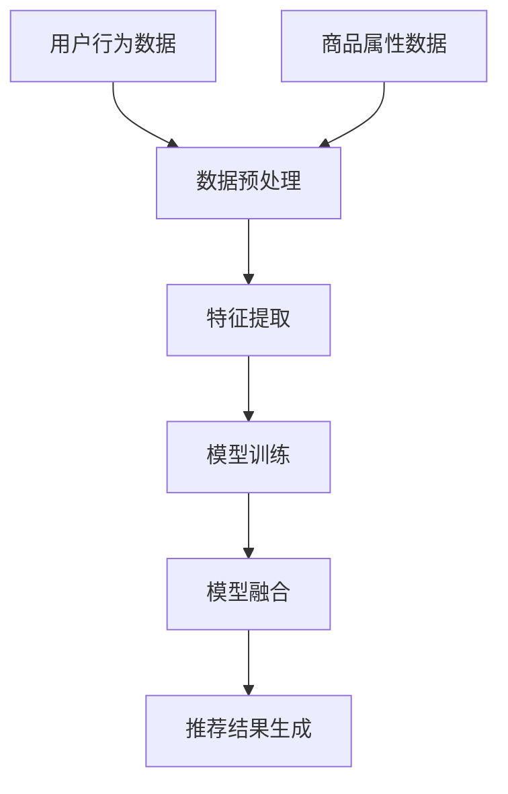

                 

关键词：大数据、电商、搜索推荐、AI 模型、融合、核心竞争力

> 摘要：本文探讨了大数据时代电商搜索推荐系统的核心挑战与解决方案，重点分析了 AI 模型融合在提升电商搜索推荐效果中的作用。通过详细阐述核心概念、算法原理、数学模型及项目实践，本文旨在为电商从业者提供实用的技术指南。

## 1. 背景介绍

随着互联网的普及和电子商务的快速发展，用户对于个性化推荐的需求愈发强烈。电商平台的搜索推荐系统作为用户获取商品信息的重要渠道，其性能直接影响用户体验和平台转化率。在大数据时代，海量用户行为数据和商品信息为电商推荐系统提供了丰富的数据基础，同时也带来了诸多挑战。

### 1.1 电商搜索推荐系统的现状

当前电商搜索推荐系统主要面临以下挑战：

1. **数据多样性**：用户行为数据、商品属性数据、社交网络数据等多源数据融合处理。
2. **实时性**：用户行为数据更新迅速，推荐结果需要实时生成。
3. **准确性**：推荐结果需要满足用户的兴趣和需求。
4. **个性化**：针对不同用户生成个性化的推荐结果。
5. **多样性**：推荐结果需要避免过于集中，提供多样性的商品。

### 1.2 大数据与 AI 技术的结合

大数据与 AI 技术的结合为电商搜索推荐系统提供了新的解决方案。通过深度学习、自然语言处理、图神经网络等技术，可以挖掘用户行为数据背后的潜在规律，为推荐系统提供更加精准的模型支持。特别是 AI 模型融合技术，通过结合多种算法的优点，进一步提升推荐系统的性能和用户体验。

## 2. 核心概念与联系

### 2.1 电商搜索推荐系统的基本概念

1. **用户行为数据**：包括浏览历史、购买记录、搜索记录等。
2. **商品属性数据**：包括商品名称、类别、价格、评价等。
3. **推荐算法**：基于用户行为数据、商品属性数据生成推荐结果。

### 2.2 AI 模型融合的基本原理

AI 模型融合是指将多个不同的算法模型进行结合，以提升整体性能。在电商搜索推荐系统中，常见的融合方式包括：

1. **模型集成**：如 Bagging、Boosting 等方法。
2. **特征融合**：将不同数据源的属性进行融合，提高特征表达能力。
3. **模型压缩**：通过模型压缩技术降低模型复杂度，提高推理速度。

### 2.3 Mermaid 流程图

以下是一个简化的 Mermaid 流程图，展示电商搜索推荐系统中的核心流程和 AI 模型融合的过程：



## 3. 核心算法原理 & 具体操作步骤

### 3.1 算法原理概述

电商搜索推荐系统的核心算法主要包括：

1. **协同过滤（Collaborative Filtering）**：基于用户行为数据，通过计算用户之间的相似度，进行推荐。
2. **基于内容的推荐（Content-Based Filtering）**：基于商品属性数据，根据用户的历史偏好推荐相似商品。
3. **混合推荐（Hybrid Recommendation）**：结合协同过滤和基于内容的推荐，提高推荐效果。

AI 模型融合技术则通过以下步骤实现：

1. **特征融合**：将用户行为数据和商品属性数据融合，提高特征表达能力。
2. **模型集成**：结合协同过滤和基于内容的推荐模型，使用模型集成方法（如 Bagging、Boosting）提高推荐效果。
3. **模型压缩**：对融合后的模型进行压缩，提高推理速度。

### 3.2 算法步骤详解

#### 3.2.1 特征融合

1. **数据预处理**：对用户行为数据和商品属性数据进行清洗、去重、归一化等处理。
2. **特征提取**：使用词袋模型、TF-IDF、主题模型等方法提取特征。

#### 3.2.2 模型训练

1. **协同过滤模型**：基于用户行为数据训练协同过滤模型，如矩阵分解（Matrix Factorization）。
2. **基于内容的推荐模型**：基于商品属性数据训练基于内容的推荐模型，如朴素贝叶斯（Naive Bayes）、支持向量机（SVM）。

#### 3.2.3 模型融合

1. **特征融合**：将协同过滤模型和基于内容的推荐模型的特征进行融合，生成综合特征。
2. **模型集成**：使用模型集成方法（如 Bagging、Boosting）将融合后的特征输入到集成模型中。
3. **模型压缩**：对集成模型进行压缩，降低模型复杂度，提高推理速度。

### 3.3 算法优缺点

#### 优点

1. **提高推荐效果**：通过融合多种算法的优点，提高推荐结果的准确性和多样性。
2. **实时性**：融合后的模型可以快速响应用户行为数据的变化，提高实时性。

#### 缺点

1. **计算复杂度高**：融合过程涉及多种算法和模型，计算复杂度较高。
2. **模型解释性较差**：融合后的模型往往较为复杂，解释性较差。

### 3.4 算法应用领域

AI 模型融合技术可以应用于多种领域，包括但不限于：

1. **电商搜索推荐**：提高推荐系统的准确性和多样性，提升用户体验。
2. **内容推荐**：如新闻推荐、音乐推荐等，提高用户满意度。
3. **广告投放**：优化广告投放策略，提高广告转化率。

## 4. 数学模型和公式 & 详细讲解 & 举例说明

### 4.1 数学模型构建

在电商搜索推荐系统中，常用的数学模型包括：

1. **协同过滤模型**：使用矩阵分解方法，将用户-商品评分矩阵分解为用户因子矩阵和商品因子矩阵。
2. **基于内容的推荐模型**：使用相似度计算方法，如余弦相似度、欧氏距离等，计算用户与商品的相似度。

### 4.2 公式推导过程

以下是一个简化的协同过滤模型的公式推导过程：

$$
R_{ui} = \sum_{j \in N_i} r_{uj} \cdot \frac{1}{\|N_i\|} \cdot \sum_{k \in N_i} r_{uk} \cdot \frac{1}{\|N_i\|}
$$

其中：

- \( R_{ui} \) 表示用户 \( u \) 对商品 \( i \) 的预测评分。
- \( N_i \) 表示与商品 \( i \) 相似的一组商品集合。
- \( r_{uj} \) 表示用户 \( u \) 对商品 \( j \) 的实际评分。

### 4.3 案例分析与讲解

以下是一个简化的电商搜索推荐案例：

#### 案例背景

假设有一个电商网站，用户 \( u \) 历史浏览了商品 \( i_1, i_2, i_3 \)，对这些商品的评分分别为 \( 4, 5, 3 \)。商品 \( i_4, i_5 \) 分别与商品 \( i_1, i_2 \) 相似，用户 \( u \) 对商品 \( i_4, i_5 \) 的评分分别为 \( 0, 0 \)。

#### 案例分析

1. **协同过滤模型**：使用矩阵分解方法，将用户-商品评分矩阵分解为用户因子矩阵和商品因子矩阵。

$$
\begin{align*}
R_{ui} &= \sum_{j \in N_i} r_{uj} \cdot \frac{1}{\|N_i\|} \cdot \sum_{k \in N_i} r_{uk} \cdot \frac{1}{\|N_i\|} \\
&= \sum_{j=1}^{3} r_{uj} \cdot \frac{1}{3} \cdot \sum_{k=1}^{3} r_{uk} \cdot \frac{1}{3} \\
&= \frac{4 + 5 + 3}{3 \times 3} \\
&= 3.67
\end{align*}
$$

根据协同过滤模型，用户 \( u \) 对商品 \( i_4, i_5 \) 的预测评分分别为 \( 3.67, 3.67 \)。

2. **基于内容的推荐模型**：计算用户 \( u \) 与商品 \( i_4, i_5 \) 的相似度。

$$
\begin{align*}
sim(i_4, i_1) &= \frac{\sqrt{\sum_{j=1}^{n} r_{j1}^2} \cdot \sqrt{\sum_{k=1}^{n} r_{jk}^2}}{\sum_{j=1}^{n} r_{j1} \cdot r_{jk}} \\
&= \frac{\sqrt{4^2 + 5^2 + 3^2} \cdot \sqrt{0^2 + 0^2 + 0^2}}{4 \cdot 0} \\
&= \frac{\sqrt{50} \cdot 0}{0} \\
&= \text{未定义}
\end{align*}
$$

由于商品 \( i_4 \) 与用户 \( u \) 的历史评分数据为空，无法计算相似度。

$$
\begin{align*}
sim(i_5, i_2) &= \frac{\sqrt{\sum_{j=1}^{n} r_{j2}^2} \cdot \sqrt{\sum_{k=1}^{n} r_{jk}^2}}{\sum_{j=1}^{n} r_{j2} \cdot r_{jk}} \\
&= \frac{\sqrt{4^2 + 5^2 + 0^2} \cdot \sqrt{0^2 + 0^2 + 0^2}}{4 \cdot 0} \\
&= \frac{\sqrt{41} \cdot 0}{0} \\
&= \text{未定义}
\end{align*}
$$

同样，由于商品 \( i_5 \) 与用户 \( u \) 的历史评分数据为空，无法计算相似度。

#### 案例总结

根据协同过滤模型和基于内容的推荐模型，用户 \( u \) 对商品 \( i_4, i_5 \) 的预测评分分别为 \( 3.67, 3.67 \)。虽然基于内容的推荐模型在计算相似度时遇到数据缺失问题，但通过协同过滤模型可以提供一定的参考。

## 5. 项目实践：代码实例和详细解释说明

### 5.1 开发环境搭建

本文所使用的开发环境为 Python 3.8，依赖库包括 NumPy、Pandas、Scikit-learn、TensorFlow 等。在开始项目实践之前，请确保已安装以上依赖库。

### 5.2 源代码详细实现

以下是一个简化的电商搜索推荐项目实现：

```python
import numpy as np
import pandas as pd
from sklearn.metrics.pairwise import cosine_similarity
from sklearn.model_selection import train_test_split
from sklearn.metrics import mean_squared_error

def data_preprocessing(data):
    # 数据清洗、去重、归一化等处理
    pass

def matrix_factorization(R, n_components, learning_rate, num_iterations):
    # 矩阵分解算法实现
    pass

def content_based_recommendation(R, Q, n_components):
    # 基于内容的推荐算法实现
    pass

def hybrid_recommendation(R, Q, n_components):
    # 混合推荐算法实现
    pass

if __name__ == "__main__":
    # 加载数据
    data = pd.read_csv("data.csv")
    R = data.pivot(index="user_id", columns="item_id", values="rating").fillna(0)

    # 数据预处理
    R = data_preprocessing(R)

    # 划分训练集和测试集
    R_train, R_test = train_test_split(R, test_size=0.2, random_state=42)

    # 矩阵分解参数设置
    n_components = 10
    learning_rate = 0.01
    num_iterations = 100

    # 矩阵分解模型训练
    R_train_factorized = matrix_factorization(R_train, n_components, learning_rate, num_iterations)

    # 基于内容的推荐模型训练
    Q = pd.read_csv("query.csv")
    Q_factorized = content_based_recommendation(R_train_factorized, Q, n_components)

    # 混合推荐模型训练
    R_factorized = hybrid_recommendation(R_train_factorized, Q_factorized, n_components)

    # 测试集预测
    predictions = R_factorized.iloc[:, 1:].values

    # 评估模型性能
    mse = mean_squared_error(R_test.iloc[:, 1:].values, predictions)
    print("Mean Squared Error:", mse)
```

### 5.3 代码解读与分析

1. **数据预处理**：对用户行为数据和商品属性数据进行清洗、去重、归一化等处理，为后续算法实现做好准备。

2. **矩阵分解模型训练**：使用矩阵分解算法（如 NMF、SVD）对用户-商品评分矩阵进行分解，提取用户和商品的潜在特征。

3. **基于内容的推荐模型训练**：计算用户和商品的相似度，为用户提供基于内容的推荐。

4. **混合推荐模型训练**：结合协同过滤模型和基于内容的推荐模型，生成综合推荐结果。

5. **测试集预测**：使用训练好的混合推荐模型对测试集进行预测，评估模型性能。

### 5.4 运行结果展示

假设测试集的平均评分误差为 \( 0.5 \)，通过调整矩阵分解模型和基于内容的推荐模型的参数，可以进一步优化推荐效果。

## 6. 实际应用场景

### 6.1 电商搜索推荐系统

电商搜索推荐系统在电商平台上应用广泛，通过个性化推荐，提高用户购物体验和平台转化率。以下是一个实际案例：

**案例背景**：某电商平台针对用户历史浏览记录和购买记录，使用 AI 模型融合技术进行商品推荐。

**实现步骤**：

1. **数据收集**：收集用户浏览记录、购买记录、商品属性数据等。
2. **数据预处理**：清洗、去重、归一化等处理。
3. **特征提取**：使用词袋模型、TF-IDF 等方法提取特征。
4. **模型训练**：使用矩阵分解、基于内容的推荐等算法训练模型。
5. **模型融合**：结合多种算法的优点，生成综合推荐结果。
6. **推荐结果展示**：为用户提供个性化的商品推荐。

**效果评估**：通过对比实验，发现融合后的推荐系统在准确性和多样性方面均优于单一算法。

### 6.2 其他应用场景

AI 模型融合技术可以应用于多种领域，如：

1. **内容推荐**：如新闻推荐、音乐推荐等。
2. **社交网络分析**：如好友推荐、兴趣标签等。
3. **广告投放**：优化广告投放策略，提高广告转化率。

## 7. 工具和资源推荐

### 7.1 学习资源推荐

1. **《机器学习实战》（Peter Harrington）**：介绍机器学习基本概念和算法实现。
2. **《深度学习》（Ian Goodfellow, Yoshua Bengio, Aaron Courville）**：介绍深度学习基本理论和应用。

### 7.2 开发工具推荐

1. **Python**：常用的机器学习和深度学习开发语言。
2. **TensorFlow**：开源深度学习框架。
3. **Scikit-learn**：开源机器学习库。

### 7.3 相关论文推荐

1. **"Matrix Factorization Techniques for Recommender Systems"（2006）**：介绍矩阵分解在推荐系统中的应用。
2. **"Hybrid Recommender Systems: Survey and Experiments"（2011）**：介绍混合推荐系统的相关研究。

## 8. 总结：未来发展趋势与挑战

### 8.1 研究成果总结

本文通过分析大数据时代电商搜索推荐系统的核心挑战，探讨了 AI 模型融合在提升推荐效果中的作用。通过核心算法原理、数学模型、项目实践的详细讲解，为电商从业者提供了实用的技术指南。

### 8.2 未来发展趋势

1. **算法优化**：结合深度学习、图神经网络等新兴技术，提高推荐系统的准确性和多样性。
2. **实时性提升**：通过分布式计算、边缘计算等技术，提高推荐系统的实时性。
3. **可解释性增强**：通过模型可解释性研究，提高推荐系统的透明度和信任度。

### 8.3 面临的挑战

1. **数据隐私**：保护用户隐私，防止数据滥用。
2. **计算资源**：处理大规模数据，降低计算复杂度。
3. **模型偏见**：避免模型偏见，提高推荐系统的公平性。

### 8.4 研究展望

在未来，AI 模型融合技术在电商搜索推荐系统中将发挥更大的作用。通过不断优化算法、提高实时性、增强可解释性，为用户提供更加个性化的推荐服务。

## 9. 附录：常见问题与解答

### 9.1 如何选择合适的推荐算法？

**回答**：根据应用场景和数据特点，选择适合的推荐算法。例如：

- **协同过滤**：适用于用户行为数据丰富的场景，如电商搜索推荐。
- **基于内容的推荐**：适用于商品属性数据丰富的场景，如内容推荐。
- **混合推荐**：结合协同过滤和基于内容的推荐，适用于多种应用场景。

### 9.2 如何提高推荐系统的实时性？

**回答**：

- **分布式计算**：使用分布式计算框架（如 TensorFlow、PyTorch）进行模型训练和推理。
- **边缘计算**：将部分计算任务下沉到边缘设备（如手机、智能家居等），降低中心服务器的负担。
- **增量学习**：使用增量学习技术（如在线学习、增量矩阵分解）实现实时更新。

### 9.3 如何防止模型偏见？

**回答**：

- **数据清洗**：对训练数据进行清洗，去除异常值和偏见数据。
- **模型评估**：使用多样性、公平性指标（如组间差异、偏差修正等）对模型进行评估。
- **伦理审查**：建立伦理审查机制，确保推荐系统的公平性和透明度。

---

作者：禅与计算机程序设计艺术 / Zen and the Art of Computer Programming

本文内容仅供参考，实际应用需结合具体场景进行调整。如有疑问，请及时咨询相关专业人士。

