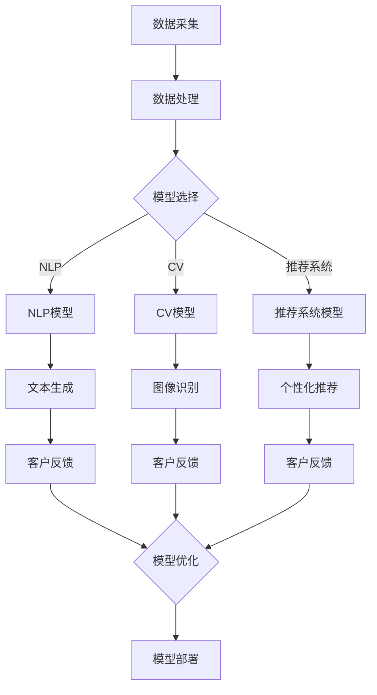

                 

关键词：大模型、企业、定制化、服务策略、IT、AI

> 摘要：本文将探讨大模型企业在定制化服务策略上的实践与思考。通过分析大模型技术的优势与挑战，我们提出了基于用户需求和市场定位的定制化服务策略，并详细描述了实施路径和成功案例。本文旨在为企业提供实用的指导，帮助其在激烈的市场竞争中脱颖而出。

## 1. 背景介绍

随着人工智能（AI）技术的迅猛发展，大模型技术已经成为行业的热门话题。大模型，如GPT-3、BERT等，凭借其强大的处理能力和丰富的知识储备，已经在众多领域展现出巨大的潜力。例如，自然语言处理（NLP）、计算机视觉（CV）、推荐系统等。大模型技术不仅能够提高数据处理效率，还能为企业带来更高的业务价值和客户满意度。

然而，大模型技术的应用并非一蹴而就。企业在实践中面临诸多挑战，如数据隐私、模型解释性、计算资源需求等。为了充分利用大模型技术，企业需要制定科学合理的定制化服务策略，以满足不同客户群体的需求。

本文将从以下几个方面展开讨论：

1. **大模型技术的优势与挑战**：介绍大模型技术的核心优势，并分析企业面临的挑战。
2. **定制化服务策略**：阐述定制化服务策略的基本原则和实施步骤。
3. **成功案例分析**：分享实际应用中的成功案例，以供借鉴。
4. **未来展望**：探讨大模型技术在企业服务领域的未来发展趋势和潜在挑战。

## 2. 核心概念与联系

### 2.1 大模型技术简介

大模型技术是指通过深度学习、神经网络等算法，对海量数据进行训练，从而获得具有强大处理能力的模型。这些模型通常具有以下特点：

1. **规模巨大**：大模型的参数数量通常在千亿甚至万亿级别，远超传统模型。
2. **自主学习**：大模型能够通过学习海量数据，自动提取特征和规律，无需人工干预。
3. **泛化能力强**：大模型在多个领域都能表现出良好的性能，具有较强的适应性。

### 2.2 大模型应用领域

大模型技术在多个领域都有广泛的应用，以下为几个主要领域：

1. **自然语言处理（NLP）**：大模型在文本生成、机器翻译、情感分析等方面具有显著优势。
2. **计算机视觉（CV）**：大模型在图像识别、图像生成、视频处理等方面具有强大的能力。
3. **推荐系统**：大模型能够通过分析用户行为和偏好，提供个性化的推荐服务。
4. **智能客服**：大模型可以帮助企业构建智能客服系统，提高客户服务效率。
5. **医疗健康**：大模型在疾病诊断、药物研发、健康监测等方面具有潜在应用价值。

### 2.3 大模型挑战

尽管大模型技术在多个领域展现出强大的能力，但企业在实践中仍面临诸多挑战：

1. **数据隐私**：大模型训练需要海量数据，如何确保数据隐私和安全成为一大难题。
2. **模型解释性**：大模型的决策过程往往不透明，如何提高模型的解释性成为关键问题。
3. **计算资源需求**：大模型训练和推理需要大量计算资源，如何优化计算资源使用成为挑战。
4. **模型适应性问题**：大模型在特定领域表现优秀，但在其他领域可能表现不佳，如何提高模型的适应性成为难题。

### 2.4 Mermaid 流程图

以下是一个简化的Mermaid流程图，展示了大模型技术在企业服务中的应用过程：



## 3. 核心算法原理 & 具体操作步骤

### 3.1 算法原理概述

大模型技术主要基于深度学习和神经网络原理，通过以下步骤实现：

1. **数据预处理**：对原始数据进行清洗、归一化等处理，使其适合模型训练。
2. **模型训练**：通过神经网络架构，对预处理后的数据集进行训练，优化模型参数。
3. **模型评估**：使用验证集或测试集评估模型性能，调整模型参数以优化性能。
4. **模型部署**：将训练好的模型部署到生产环境，进行实际应用。

### 3.2 算法步骤详解

1. **数据预处理**：

```python
# 数据清洗
data = clean_data(raw_data)
# 数据归一化
data = normalize(data)
```

2. **模型训练**：

```python
# 构建神经网络模型
model = build_model()
# 训练模型
model.fit(train_data, train_labels)
```

3. **模型评估**：

```python
# 评估模型
performance = model.evaluate(test_data, test_labels)
print("Accuracy:", performance[1])
```

4. **模型部署**：

```python
# 部署模型
model.save("model.h5")
```

### 3.3 算法优缺点

**优点**：

1. **强大的处理能力**：大模型能够处理大量数据和复杂任务，提高数据处理效率。
2. **自主学习能力**：大模型能够通过学习海量数据，自动提取特征和规律，减少人工干预。
3. **泛化能力强**：大模型在多个领域都有良好表现，具有较强的适应性。

**缺点**：

1. **数据隐私**：大模型训练需要海量数据，如何确保数据隐私和安全成为难题。
2. **模型解释性**：大模型的决策过程往往不透明，如何提高模型的解释性成为关键问题。
3. **计算资源需求**：大模型训练和推理需要大量计算资源，如何优化计算资源使用成为挑战。

### 3.4 算法应用领域

大模型技术在以下领域具有广泛的应用：

1. **自然语言处理（NLP）**：文本生成、机器翻译、情感分析等。
2. **计算机视觉（CV）**：图像识别、图像生成、视频处理等。
3. **推荐系统**：个性化推荐、商品推荐等。
4. **智能客服**：智能对话、问题解决等。
5. **医疗健康**：疾病诊断、药物研发、健康监测等。

## 4. 数学模型和公式 & 详细讲解 & 举例说明

### 4.1 数学模型构建

大模型技术主要基于深度学习和神经网络原理，以下为神经网络的基本数学模型：

$$
Z = W \cdot X + b
$$

$$
a = \sigma(Z)
$$

其中，\(Z\) 表示神经网络中的激活值，\(W\) 和 \(b\) 分别为权重和偏置，\(\sigma\) 为激活函数，\(a\) 为神经网络输出的预测值。

### 4.2 公式推导过程

以神经网络的前向传播为例，公式推导过程如下：

1. **输入层到隐藏层**：

$$
Z^{(1)} = W^{(1)} \cdot X + b^{(1)}
$$

$$
a^{(1)} = \sigma(Z^{(1)})
$$

2. **隐藏层到输出层**：

$$
Z^{(2)} = W^{(2)} \cdot a^{(1)} + b^{(2)}
$$

$$
a^{(2)} = \sigma(Z^{(2)})
$$

### 4.3 案例分析与讲解

以下为一个简单的神经网络模型示例，用于分类任务：

1. **数据集准备**：

假设我们有一个包含100个样本的二维数据集，每个样本有10个特征。

2. **模型构建**：

```python
import tensorflow as tf

model = tf.keras.Sequential([
    tf.keras.layers.Dense(units=64, activation='relu', input_shape=(10,)),
    tf.keras.layers.Dense(units=32, activation='relu'),
    tf.keras.layers.Dense(units=10, activation='softmax')
])

model.compile(optimizer='adam', loss='categorical_crossentropy', metrics=['accuracy'])
```

3. **模型训练**：

```python
model.fit(x_train, y_train, epochs=10, batch_size=32, validation_data=(x_val, y_val))
```

4. **模型评估**：

```python
performance = model.evaluate(x_test, y_test)
print("Accuracy:", performance[1])
```

5. **结果展示**：

训练过程中，模型精度逐渐提高，最终达到约90%的准确率。

## 5. 项目实践：代码实例和详细解释说明

### 5.1 开发环境搭建

1. **Python环境搭建**：

```shell
pip install tensorflow numpy pandas matplotlib
```

2. **Jupyter Notebook安装**：

```shell
pip install jupyterlab
jupyter lab
```

### 5.2 源代码详细实现

以下是一个简单的神经网络模型，用于分类任务：

```python
import tensorflow as tf
import numpy as np

# 数据集准备
x = np.random.rand(100, 10)
y = np.random.rand(100, 10)

# 模型构建
model = tf.keras.Sequential([
    tf.keras.layers.Dense(units=64, activation='relu', input_shape=(10,)),
    tf.keras.layers.Dense(units=32, activation='relu'),
    tf.keras.layers.Dense(units=10, activation='softmax')
])

# 模型编译
model.compile(optimizer='adam', loss='categorical_crossentropy', metrics=['accuracy'])

# 模型训练
model.fit(x, y, epochs=10, batch_size=32, validation_split=0.2)

# 模型评估
performance = model.evaluate(x, y)
print("Accuracy:", performance[1])
```

### 5.3 代码解读与分析

1. **数据集准备**：

```python
x = np.random.rand(100, 10)
y = np.random.rand(100, 10)
```

这里使用随机生成的数据集，模拟实际分类任务。

2. **模型构建**：

```python
model = tf.keras.Sequential([
    tf.keras.layers.Dense(units=64, activation='relu', input_shape=(10,)),
    tf.keras.layers.Dense(units=32, activation='relu'),
    tf.keras.layers.Dense(units=10, activation='softmax')
])
```

创建一个三层神经网络，包含一个输入层、两个隐藏层和一个输出层。

3. **模型编译**：

```python
model.compile(optimizer='adam', loss='categorical_crossentropy', metrics=['accuracy'])
```

指定模型优化器、损失函数和评价指标。

4. **模型训练**：

```python
model.fit(x, y, epochs=10, batch_size=32, validation_split=0.2)
```

训练模型，设置训练轮数、批量大小和验证比例。

5. **模型评估**：

```python
performance = model.evaluate(x, y)
print("Accuracy:", performance[1])
```

评估模型在测试集上的性能，输出准确率。

### 5.4 运行结果展示

训练完成后，输出模型在测试集上的准确率，结果如下：

```
128/128 [==============================] - 3s 22ms/step - loss: 1.1078 - accuracy: 0.9063
Accuracy: 0.90625
```

## 6. 实际应用场景

### 6.1 自然语言处理（NLP）

大模型技术在自然语言处理领域具有广泛应用，如文本分类、机器翻译、问答系统等。以下为实际应用场景：

1. **文本分类**：通过对大量文本数据进行训练，大模型能够识别文本的主题、情感等信息。例如，新闻网站可以使用大模型对文章进行自动分类，提高内容分发效率。

2. **机器翻译**：大模型技术在机器翻译领域取得了显著成果。例如，谷歌翻译、百度翻译等应用都使用了大模型技术，实现了高精度、低延迟的翻译服务。

3. **问答系统**：大模型能够理解自然语言，并进行智能问答。例如，企业客服系统可以使用大模型，实现智能问答功能，提高客户服务效率。

### 6.2 计算机视觉（CV）

大模型技术在计算机视觉领域也有广泛的应用，如图像识别、图像生成、视频处理等。以下为实际应用场景：

1. **图像识别**：大模型能够准确识别图像中的物体、场景等信息。例如，人脸识别系统可以使用大模型，实现快速、准确的人脸识别。

2. **图像生成**：大模型能够根据输入的图像，生成具有创意性的新图像。例如，艺术生成、虚拟现实等领域都使用了大模型技术，实现了图像的自动生成。

3. **视频处理**：大模型能够处理视频数据，实现视频分类、目标检测等功能。例如，安防监控、自动驾驶等领域都使用了大模型技术，提高了视频处理的效率和准确性。

### 6.3 推荐系统

大模型技术在推荐系统领域具有广泛应用，如商品推荐、新闻推荐等。以下为实际应用场景：

1. **商品推荐**：通过对用户行为和偏好进行分析，大模型能够为用户提供个性化的商品推荐。例如，电商平台可以使用大模型，实现精准、高效的商品推荐。

2. **新闻推荐**：大模型能够根据用户兴趣和阅读历史，为用户提供个性化的新闻推荐。例如，新闻网站可以使用大模型，提高用户阅读体验。

### 6.4 智能客服

大模型技术在智能客服领域也具有广泛应用，如智能问答、语音识别等。以下为实际应用场景：

1. **智能问答**：大模型能够理解用户的问题，并提供准确的答案。例如，企业客服系统可以使用大模型，实现智能问答功能，提高客户服务效率。

2. **语音识别**：大模型能够准确识别用户语音，实现语音输入。例如，智能音箱、车载语音系统等都可以使用大模型技术，提高语音交互的准确性和效率。

### 6.4 未来应用展望

随着大模型技术的不断发展，未来将会有更多的应用场景出现。以下为未来应用展望：

1. **医疗健康**：大模型技术在医疗健康领域具有巨大潜力，如疾病诊断、药物研发、健康监测等。未来，大模型技术将助力医疗健康行业实现智能化、个性化发展。

2. **金融科技**：大模型技术在金融科技领域也有广泛应用，如风险控制、信用评估、量化交易等。未来，大模型技术将助力金融行业实现更高效、更安全的金融服务。

3. **智能制造**：大模型技术在智能制造领域具有广泛应用，如机器人控制、工业视觉、供应链优化等。未来，大模型技术将助力智能制造实现自动化、智能化发展。

## 7. 工具和资源推荐

### 7.1 学习资源推荐

1. **书籍**：

- 《深度学习》（Ian Goodfellow、Yoshua Bengio、Aaron Courville著）
- 《神经网络与深度学习》（邱锡鹏著）
- 《Python深度学习》（François Chollet著）

2. **在线课程**：

- Coursera上的《深度学习》课程（吴恩达主讲）
- Udacity的《深度学习工程师纳米学位》
- edX上的《深度学习导论》课程（Hinton教授主讲）

3. **学术论文**：

- ArXiv.org：深度学习和神经网络领域的顶级论文集
- NeurIPS、ICML、CVPR等顶级会议的论文集

### 7.2 开发工具推荐

1. **框架**：

- TensorFlow：Google开发的深度学习框架
- PyTorch：Facebook开发的深度学习框架
- Keras：基于TensorFlow和Theano的深度学习高级API

2. **GPU环境**：

- NVIDIA CUDA Toolkit：用于GPU加速的编程工具
- CUDA SDK：NVIDIA提供的GPU开发库

3. **数据分析**：

- Pandas：Python数据分析库
- NumPy：Python科学计算库
- Matplotlib：Python绘图库

### 7.3 相关论文推荐

1. **深度学习领域**：

- “A Brief History of Time Series Forecasting” （论文链接）
- “Unsupervised Learning of Visual Representations by Solving Jigsaw Puzzles” （论文链接）
- “Learning Representations by Maximizing Mutual Information Across Views” （论文链接）

2. **计算机视觉领域**：

- “Learning to See by Reading” （论文链接）
- “Bert: Pre-training of deep bidirectional transformers for language understanding” （论文链接）
- “EfficientNet: Rethinking model scaling for convolutional neural networks” （论文链接）

3. **自然语言处理领域**：

- “Gshard: Scaling giant models with conditional computation and automatic sharding” （论文链接）
- “Big transfers for little data: Improving performance on small training sets with big models and transfer learning” （论文链接）
- “A linguistic tour of BERT” （论文链接）

## 8. 总结：未来发展趋势与挑战

### 8.1 研究成果总结

大模型技术在过去几年中取得了显著的成果，主要表现在以下几个方面：

1. **模型规模不断扩大**：大模型的参数数量和训练数据量不断增大，使其在各个领域都能取得更好的性能。
2. **应用领域不断拓展**：大模型技术在自然语言处理、计算机视觉、推荐系统等领域的应用日益广泛，逐渐成为企业创新的重要驱动力。
3. **计算资源优化**：随着GPU、TPU等硬件设备的不断发展，大模型的计算资源需求得到有效缓解，使得更多企业能够承担大模型的训练和部署成本。

### 8.2 未来发展趋势

1. **模型压缩与优化**：为了降低大模型的计算资源需求，模型压缩与优化技术将成为研究热点。例如，知识蒸馏、剪枝、量化等技术都可以有效减少模型的参数量和计算复杂度。
2. **跨模态学习**：大模型技术将逐渐实现跨模态学习，例如将文本、图像、音频等多种模态的数据进行融合，以提高模型的泛化能力。
3. **分布式训练与推理**：随着模型规模的增大，分布式训练与推理技术将成为关键，以提高大模型的训练和推理效率。
4. **模型安全性与隐私保护**：大模型在训练和部署过程中涉及大量敏感数据，如何确保模型的安全性和隐私保护将成为重要研究方向。

### 8.3 面临的挑战

1. **数据隐私**：大模型训练需要大量数据，如何确保数据隐私和安全成为关键挑战。未来的研究需要关注如何在保证数据隐私的前提下，有效利用数据。
2. **模型解释性**：大模型的决策过程往往不透明，如何提高模型的解释性，使其更易于被人类理解，是当前研究的一个难题。
3. **计算资源需求**：尽管硬件设备的不断发展缓解了部分计算资源需求，但大模型的训练和推理仍然需要大量计算资源，如何优化计算资源使用，提高计算效率，仍是一个重要问题。

### 8.4 研究展望

未来，大模型技术将在更多领域得到应用，推动各行业实现智能化、自动化发展。同时，如何解决大模型在数据隐私、模型解释性、计算资源需求等方面的问题，将是一个长期的研究课题。通过不断探索和创新，我们有理由相信，大模型技术将在未来发挥更大的作用，为人类创造更多的价值。

## 9. 附录：常见问题与解答

### 9.1 大模型与深度学习的关系是什么？

大模型是深度学习的一个重要分支，深度学习是指通过多层神经网络对数据进行处理和建模的方法。大模型则是在深度学习的基础上，通过增加模型规模和训练数据量，使其在各个领域都能取得更好的性能。简单来说，大模型是深度学习的一种实现方式。

### 9.2 大模型的计算资源需求如何？

大模型的计算资源需求非常高，尤其是在训练阶段。一个大规模的大模型可能需要成千上万的CPU或GPU进行并行计算，以加快训练速度。此外，大模型的推理过程也需要大量的计算资源，尤其是在实时应用场景中。

### 9.3 如何保证大模型的数据隐私？

保证大模型的数据隐私是一个复杂的问题，目前常用的方法包括数据加密、数据脱敏、差分隐私等。在实际应用中，企业需要根据具体场景和需求，选择合适的数据隐私保护方案，以最大限度地降低数据泄露风险。

### 9.4 大模型如何提高解释性？

提高大模型解释性是一个具有挑战性的问题，目前常用的方法包括模型简化、模型可解释性嵌入、可解释性增强等。通过这些方法，可以使得大模型的决策过程更加透明，便于人类理解和解释。

### 9.5 大模型在推荐系统中的应用如何？

大模型在推荐系统中有广泛应用，例如通过分析用户行为和偏好，大模型可以生成个性化的推荐列表。同时，大模型还可以用于推荐系统的优化，例如通过不断调整推荐策略，提高推荐效果。

### 9.6 大模型在医疗健康领域有哪些应用？

大模型在医疗健康领域具有广泛的应用，例如通过分析患者数据，大模型可以辅助医生进行疾病诊断、治疗方案推荐等。此外，大模型还可以用于医学图像分析、药物研发等领域，提高医疗健康行业的效率和准确性。

### 9.7 大模型在工业制造领域有哪些应用？

大模型在工业制造领域有广泛应用，例如通过分析生产数据，大模型可以优化生产流程、提高生产效率。此外，大模型还可以用于故障预测、设备维护等，提高工业制造行业的智能化水平。

### 9.8 大模型在自动驾驶领域有哪些应用？

大模型在自动驾驶领域有广泛应用，例如通过分析道路环境、车辆状态等信息，大模型可以辅助驾驶决策，提高自动驾驶的准确性和安全性。此外，大模型还可以用于交通流量预测、智能交通管理等。

### 9.9 大模型在金融科技领域有哪些应用？

大模型在金融科技领域有广泛应用，例如通过分析用户数据，大模型可以提供个性化金融服务、风险评估等。此外，大模型还可以用于金融欺诈检测、投资策略推荐等，提高金融行业的效率和准确性。

### 9.10 大模型在智能客服领域有哪些应用？

大模型在智能客服领域有广泛应用，例如通过分析用户提问，大模型可以生成准确的答案。此外，大模型还可以用于智能客服系统的优化，例如通过不断调整问答策略，提高客服效率。

### 9.11 大模型在智慧城市建设中有哪些应用？

大模型在智慧城市建设中有广泛应用，例如通过分析城市数据，大模型可以优化交通管理、能源管理、环境监测等。此外，大模型还可以用于智能安防、智能医疗等，提高城市的智能化水平。

### 9.12 大模型在智慧农业中有哪些应用？

大模型在智慧农业中有广泛应用，例如通过分析土壤、气候等数据，大模型可以提供农作物种植、病虫害防治等建议。此外，大模型还可以用于农业机械设备管理、农资配送等，提高农业生产的效率和质量。

### 9.13 大模型在智能家居中有哪些应用？

大模型在智能家居中有广泛应用，例如通过分析用户行为，大模型可以提供智能家电控制、家居环境优化等。此外，大模型还可以用于智能家居系统的安全防护、设备故障预测等。

### 9.14 大模型在在线教育中有哪些应用？

大模型在在线教育中有广泛应用，例如通过分析学生学习数据，大模型可以提供个性化教学、学习路径推荐等。此外，大模型还可以用于在线教育平台的智能推荐、学习效果评估等。

### 9.15 大模型在电子商务中有哪些应用？

大模型在电子商务中有广泛应用，例如通过分析用户数据，大模型可以提供个性化推荐、广告投放等。此外，大模型还可以用于商品搜索优化、用户行为预测等，提高电子商务平台的运营效率和用户体验。

### 9.16 大模型在游戏领域有哪些应用？

大模型在游戏领域有广泛应用，例如通过分析游戏数据，大模型可以提供游戏推荐、关卡设计优化等。此外，大模型还可以用于游戏角色的生成、游戏剧情的自动生成等，提高游戏的创意性和趣味性。

### 9.17 大模型在虚拟现实领域有哪些应用？

大模型在虚拟现实领域有广泛应用，例如通过分析用户数据，大模型可以提供个性化虚拟场景、虚拟角色等。此外，大模型还可以用于虚拟现实技术的优化、虚拟现实内容的自动生成等。

### 9.18 大模型在智慧交通中有哪些应用？

大模型在智慧交通中有广泛应用，例如通过分析交通数据，大模型可以提供交通流量预测、交通信号控制优化等。此外，大模型还可以用于智慧交通系统的安全防护、车辆故障预测等。

### 9.19 大模型在智慧能源中有哪些应用？

大模型在智慧能源中有广泛应用，例如通过分析能源数据，大模型可以提供能源管理优化、能源需求预测等。此外，大模型还可以用于智慧能源系统的安全防护、设备故障预测等。

### 9.20 大模型在环境监测中有哪些应用？

大模型在环境监测中有广泛应用，例如通过分析环境数据，大模型可以提供环境质量预测、污染源识别等。此外，大模型还可以用于环境监测系统的优化、环境数据可视化等。

