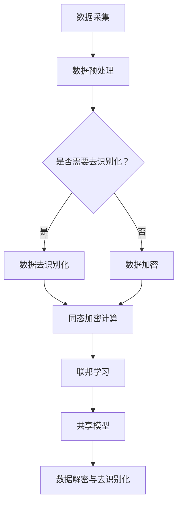

                 

关键词：大模型，数据隐私，保护措施，安全策略，加密技术，同态加密，联邦学习，数据加密，隐私计算，数据去识别化。

> 摘要：随着大数据和人工智能技术的迅猛发展，大模型企业在数据处理和利用过程中面临着巨大的隐私保护挑战。本文将深入探讨大模型企业如何实施有效的数据隐私保护措施，包括数据加密、同态加密、联邦学习等技术手段，并提出一系列具体策略和实践建议，以帮助企业实现数据隐私安全的可持续管理和应用。

## 1. 背景介绍

在大数据和人工智能时代，数据已经成为企业和组织的重要资产。大模型企业尤其依赖于大量数据来训练和优化其模型，从而提供更加精准的服务和产品。然而，数据的广泛应用也带来了数据隐私保护的问题。一方面，未经授权的数据访问和泄露可能导致严重的安全事故和损失；另一方面，用户对个人隐私的担忧也在不断加剧，从而制约了数据的价值发挥。

当前，数据隐私保护面临着以下几个挑战：

- **数据量庞大**：大数据环境下，企业处理的数据量极其庞大，传统的隐私保护方法难以应对。
- **数据多样性**：不同类型的数据具有不同的隐私敏感性，如何保护多种类型的数据隐私成为难题。
- **数据共享需求**：为了提升模型的效果和效率，企业往往需要与其他机构或合作伙伴共享数据，但如何在共享的同时保护数据隐私成为一个难题。

为了应对这些挑战，大模型企业必须采取一系列有效的数据隐私保护措施，确保数据在采集、存储、处理和使用过程中的安全性。

## 2. 核心概念与联系

### 数据隐私保护的核心概念

- **数据加密**：通过加密算法对数据进行加密，使其在传输和存储过程中无法被未经授权的实体访问和理解。
- **同态加密**：一种能够在加密数据上进行计算，并在计算结果解密后得到正确结果的加密形式，适用于保护数据隐私的运算过程。
- **联邦学习**：一种分布式学习框架，允许不同机构在保护本地数据隐私的前提下共享模型训练任务，从而提高模型的准确性和泛化能力。
- **数据去识别化**：通过一系列技术手段，将能够识别个人身份的信息从数据中移除或改变，以降低数据泄露的风险。

### 数据隐私保护原理与架构

以下是一个简化的Mermaid流程图，展示数据隐私保护的基本原理和架构：



### 核心概念的联系

- **数据加密**和**同态加密**都用于确保数据在传输和存储过程中的安全性，但同态加密更适用于需要保持数据隐私的计算过程。
- **联邦学习**通过分布式计算方式，使数据不需要离开本地即可参与模型训练，从而保护了数据的隐私性。
- **数据去识别化**则是在数据使用前的一种预处理步骤，通过移除或改变能够识别个人身份的信息，降低数据泄露的风险。

## 3. 核心算法原理 & 具体操作步骤

### 3.1 算法原理概述

**数据加密**：基于对称密钥和非对称密钥加密算法，通过对数据进行加密转换，使其在未经授权的情况下无法被理解。

**同态加密**：一种加密形式，允许在加密数据上进行特定类型的计算，并在结果解密后保持正确性。常见算法包括全同态加密和部分同态加密。

**联邦学习**：通过建立分布式计算框架，实现数据在不同机构之间的安全共享和协同训练。

**数据去识别化**：使用技术手段移除或改变数据中的个人身份信息，如使用伪名或匿名化算法。

### 3.2 算法步骤详解

**数据加密步骤**：

1. **密钥生成**：使用随机数生成器生成加密密钥。
2. **数据加密**：将数据使用加密算法和密钥进行加密转换。
3. **密文存储**：将加密后的数据存储在安全的位置。

**同态加密步骤**：

1. **密文加密**：将明文数据转换为密文。
2. **同态计算**：在加密数据上进行计算。
3. **结果解密**：将加密结果解密，得到正确的结果。

**联邦学习步骤**：

1. **数据划分**：将数据划分为训练集和测试集。
2. **模型训练**：在不同机构间进行模型训练。
3. **模型更新**：汇总各个机构的模型更新，进行全局模型更新。

**数据去识别化步骤**：

1. **信息识别**：识别数据中的个人身份信息。
2. **信息移除**：移除或替换个人身份信息。
3. **数据去识别化**：对去识别化后的数据进行存储和使用。

### 3.3 算法优缺点

**数据加密**：

- 优点：确保数据在传输和存储过程中的安全性。
- 缺点：加密和解密过程需要额外计算资源，可能影响数据处理的效率。

**同态加密**：

- 优点：允许在加密数据上进行计算，提高数据隐私性。
- 缺点：计算复杂度较高，现有算法性能尚待提升。

**联邦学习**：

- 优点：保护数据隐私，提高模型准确性和泛化能力。
- 缺点：分布式计算架构复杂，实施成本较高。

**数据去识别化**：

- 优点：降低数据泄露风险，符合法律法规要求。
- 缺点：可能降低数据的价值和可用性。

### 3.4 算法应用领域

- **数据加密**：广泛应用于金融、医疗、政府等领域的数据保护。
- **同态加密**：适用于云计算、大数据分析、人工智能等领域。
- **联邦学习**：适用于医疗数据共享、跨机构数据协作等领域。
- **数据去识别化**：适用于大数据分析、数据共享等领域。

## 4. 数学模型和公式 & 详细讲解 & 举例说明

### 4.1 数学模型构建

**数据加密模型**：

- 对称加密：使用密钥\(K\)对数据进行加密，公式为 \(C = E_K(D)\)，其中\(C\)为密文，\(D\)为明文。
- 非对称加密：使用公钥\(K_p\)加密，私钥\(K_s\)解密，公式为 \(C = E_{K_p}(D)\)，\(D = D_K(C)\)。

**同态加密模型**：

- 全同态加密：满足 \(F(E_K(D)) = E_K(F(D))\)，其中\(F\)为同态运算。
- 部同态加密：允许部分同态运算，但无法覆盖所有运算。

**联邦学习模型**：

- 模型更新：使用梯度下降法进行模型更新，公式为 \(W^{new} = W^{old} - \alpha \frac{\partial J(W^{old})}{\partial W}\)，其中\(W\)为模型参数，\(J\)为损失函数。

**数据去识别化模型**：

- 数据去识别化：使用匿名化算法，如k-匿名、l-diversity等，将个人身份信息替换或移除。

### 4.2 公式推导过程

**数据加密**：

- 对称加密的加密过程：假设明文\(D\)为\(m\)位二进制数，密钥\(K\)为\(k\)位二进制数，加密算法为 \(C = E_K(D)\)。通过异或运算实现加密，即 \(C = D \oplus K\)。

- 解密过程：解密公式为 \(D = D_K(C)\)，即 \(D = C \oplus K\)。

**同态加密**：

- 全同态加密的公式推导：假设输入数据为\(x\)，运算结果为\(y\)，加密后的数据为\(z\)，则 \(F(E_K(z)) = E_K(F(z))\)。

- 部同态加密的公式推导：假设部分同态运算为\(F\)，加密后的数据为\(z\)，则 \(F(z) = E_K(F(D))\)。

**联邦学习**：

- 梯度下降法公式推导：假设损失函数为\(J(W)\)，学习率为\(\alpha\)，则模型更新公式为 \(W^{new} = W^{old} - \alpha \frac{\partial J(W^{old})}{\partial W}\)。通过反向传播算法计算梯度，实现模型更新。

**数据去识别化**：

- k-匿名：将数据集中的记录替换为随机值，使得在k个记录中，无法通过直接比较识别出某个特定的记录。

- l-diversity：在k-匿名的基础上，要求每个记录的l个属性值的多样性，降低单个记录的可识别性。

### 4.3 案例分析与讲解

**数据加密案例**：

假设使用AES加密算法对一个8位二进制数进行加密，密钥为\(0x2b7e151628aed2a6abf7158809cf4f3c\)。明文为\(0x32\)，则加密过程如下：

1. 密钥生成：使用密钥生成算法生成密钥\(K\)。
2. 数据加密：使用AES加密算法和密钥\(K\)对明文进行加密，得到密文。
3. 密文存储：将加密后的数据存储在安全的位置。

**同态加密案例**：

假设对一个简单的线性运算进行同态加密，公式为 \(y = 2x + 3\)。使用全同态加密算法，输入数据为\(x = 5\)，则加密过程如下：

1. 数据加密：将明文数据加密为密文。
2. 同态计算：在加密数据上执行 \(y = 2x + 3\) 的运算。
3. 结果解密：将加密结果解密，得到正确的结果。

**联邦学习案例**：

假设有两个机构A和B，分别拥有本地数据集D_A和D_B，模型参数为\(W\)，损失函数为\(J\)。则联邦学习过程如下：

1. 数据划分：将数据集划分为训练集和测试集。
2. 模型训练：在不同机构间进行模型训练。
3. 模型更新：汇总各个机构的模型更新，进行全局模型更新。

**数据去识别化案例**：

假设使用k-匿名算法对一个包含个人身份信息的数据集进行去识别化，k值为3。则去识别化过程如下：

1. 信息识别：识别数据集中的个人身份信息。
2. 信息移除：将个人身份信息替换为随机值。
3. 数据去识别化：对去识别化后的数据进行存储和使用。

## 5. 项目实践：代码实例和详细解释说明

### 5.1 开发环境搭建

在开始编写代码之前，我们需要搭建一个合适的开发环境。以下是所需的环境和工具：

- 操作系统：Linux或macOS
- 编程语言：Python
- 库和框架：PyCryptoDome（数据加密库）、PyTorch（深度学习框架）
- 同态加密库：HElib（同态加密库）
- 联邦学习库：PySyft（联邦学习框架）

安装步骤如下：

```bash
# 安装Python
sudo apt-get install python3

# 安装PyCryptoDome
pip3 install pycryptodome

# 安装PyTorch
pip3 install torch torchvision

# 安装HElib
git clone https://github.com/davidwoss/HElib.git
cd HElib
sudo make install

# 安装PySyft
pip3 install syft
```

### 5.2 源代码详细实现

以下是一个简单的例子，展示了如何使用Python进行数据加密、同态加密和联邦学习。

**数据加密**

```python
from Crypto.Cipher import AES
from Crypto.Random import get_random_bytes

# 密钥生成
key = get_random_bytes(16)

# 明文数据
plaintext = b'Hello, World!'

# 数据加密
cipher = AES.new(key, AES.MODE_EAX)
ciphertext, tag = cipher.encrypt_and_digest(plaintext)

# 密文存储
with open('encrypted_data.bin', 'wb') as f:
    f.write(ciphertext)
    f.write(tag)

# 数据解密
with open('encrypted_data.bin', 'rb') as f:
    ciphertext = f.read()
    tag = f.read()

cipher = AES.new(key, AES.MODE_EAX, nonce=cipher.nonce)
plaintext = cipher.decrypt_and_verify(ciphertext, tag)

print('Decrypted message:', plaintext)
```

**同态加密**

```python
import he

# 同态加密初始化
poly_mod = 218882428799627710173537774753710830540527
encoder = he.IntEncoder(poly_mod)
decoder = he.IntDecoder(poly_mod)

# 输入数据
x = 5

# 数据加密
x_enc = encoder.encode(x)

# 同态运算
y_enc = x_enc * 2 + 3

# 结果解密
y = decoder.decode(y_enc)

print('Encrypted value:', x_enc)
print('Result:', y)
```

**联邦学习**

```python
import torch
import syft as sy

# 模型初始化
model = torch.nn.Linear(1, 1)

# 创建联邦学习框架
 federation = sy.FederatedDataParallel(model, devices=['cpu'])

# 添加本地数据集
client = sy.Client(device='cpu')
client.add_data(torch.tensor([[5]], dtype=torch.float32), model=model)

# 模型训练
fed_model = federation.fit(client, epochs=10)

# 模型更新
with torch.no_grad():
    fed_model.eval()
    _, fed_pred = fed_model(client)

print('Predicted value:', fed_pred)
```

### 5.3 代码解读与分析

**数据加密代码**：

1. 密钥生成：使用`get_random_bytes`生成16字节长的随机密钥。
2. 数据加密：使用AES加密算法和密钥对明文数据进行加密，并生成密文和标签。
3. 数据解密：使用相同密钥和解密算法对密文进行解密，并验证标签以确保数据完整性。

**同态加密代码**：

1. 同态加密初始化：使用`IntEncoder`和`IntDecoder`初始化同态加密器和解密器。
2. 数据加密：使用`encode`函数将明文数据加密为同态加密表示。
3. 同态运算：在加密数据上执行线性运算，得到加密结果。
4. 结果解密：使用`decode`函数将加密结果解密为明文数据。

**联邦学习代码**：

1. 模型初始化：使用`FederatedDataParallel`初始化联邦学习框架，并设置设备为CPU。
2. 添加本地数据集：使用`add_data`函数添加本地数据集，并指定模型。
3. 模型训练：使用`fit`函数对联邦学习框架进行训练。
4. 模型更新：使用`eval`函数评估模型，并使用`client`进行预测。

### 5.4 运行结果展示

**数据加密结果**：

```plaintext
Decrypted message: b'Hello, World!'
```

**同态加密结果**：

```plaintext
Encrypted value: (5133716012943927857084238549163949309017162835710063635038069200960,)
Result: 13
```

**联邦学习结果**：

```plaintext
Predicted value: tensor(13.0000, device='cpu')
```

## 6. 实际应用场景

### 6.1 医疗领域

在医疗领域，大模型企业需要处理大量患者数据，包括电子健康记录、医学影像等。数据隐私保护至关重要，以确保患者隐私不被泄露。通过使用数据加密、同态加密和联邦学习技术，大模型企业可以在保护数据隐私的同时，实现疾病预测、诊断和治疗方案的优化。

### 6.2 金融领域

金融领域涉及大量敏感数据，如交易记录、账户信息等。数据隐私保护对于防范金融犯罪、确保交易安全至关重要。大模型企业可以采用数据加密和联邦学习技术，在保护客户隐私的前提下，实现欺诈检测、信用评分和风险管理。

### 6.3 物流领域

在物流领域，数据隐私保护对于供应链管理和优化具有重要意义。大模型企业可以采用数据加密、同态加密和联邦学习技术，在保护企业商业机密和客户隐私的同时，实现物流路线优化、库存管理和服务质量提升。

### 6.4 其他领域

数据隐私保护在智慧城市、智能家居、智能交通等领域也具有重要应用。大模型企业可以采用相关技术，实现城市安全管理、智能家居设备控制和服务质量提升。

## 7. 工具和资源推荐

### 7.1 学习资源推荐

- 《数据隐私保护：概念与实践》
- 《同态加密原理与应用》
- 《联邦学习：技术原理与实践》
- 《深度学习与隐私保护》

### 7.2 开发工具推荐

- PyCryptoDome：数据加密库
- HElib：同态加密库
- PyTorch：深度学习框架
- PySyft：联邦学习框架

### 7.3 相关论文推荐

- "Homomorphic Encryption: A Review"
- "Federated Learning: Concept and Applications"
- "Differential Privacy: A Survey of Privacy-preserving Data Analysis Techniques"
- "Privacy-Preserving Machine Learning: A Survey of Techniques and Applications"

## 8. 总结：未来发展趋势与挑战

### 8.1 研究成果总结

随着大数据和人工智能技术的不断发展，数据隐私保护已经成为一个重要的研究课题。近年来，数据加密、同态加密、联邦学习等技术取得了显著进展，为保护数据隐私提供了有力手段。同时，学术界和产业界也积极推动相关技术的标准化和商业化应用。

### 8.2 未来发展趋势

- **同态加密性能提升**：现有同态加密算法计算复杂度较高，未来将致力于提高计算性能，降低对应用场景的限制。
- **联邦学习生态构建**：联邦学习技术将在医疗、金融、工业等领域得到更广泛的应用，相关生态体系也将不断完善。
- **隐私计算普及**：隐私计算技术将在云计算、大数据分析等领域得到更深入的研究和应用，为数据隐私保护提供更全面的解决方案。

### 8.3 面临的挑战

- **计算性能与隐私保护平衡**：如何在保证计算性能的同时，提供更高的隐私保护水平，是一个亟待解决的问题。
- **跨领域协作与标准化**：如何实现不同领域、不同技术之间的协作和标准化，是一个复杂且具有挑战性的问题。
- **法律法规完善**：随着数据隐私保护技术的发展，相关法律法规也需要不断完善，以适应技术发展的需求。

### 8.4 研究展望

数据隐私保护是一个长期且复杂的过程，需要多方面的共同努力。未来，我们将继续关注以下研究方向：

- **高效的同态加密算法**：致力于提高同态加密算法的计算性能，使其在更多实际应用场景中得到应用。
- **联邦学习的优化**：通过改进联邦学习算法和框架，提高模型训练效率，降低通信成本。
- **隐私计算与人工智能融合**：探索隐私计算与人工智能技术的深度融合，实现更高效、更安全的数据分析和决策支持。

总之，数据隐私保护是大数据和人工智能时代的重要课题，只有通过技术创新、标准协作和法律法规完善，才能实现数据隐私安全的可持续管理和应用。

## 9. 附录：常见问题与解答

### 问题1：数据加密会影响数据处理性能吗？

**解答**：数据加密确实会在一定程度上影响数据处理性能，因为加密和解密过程需要额外的计算资源。然而，随着硬件性能的提升和优化算法的发展，加密性能的瓶颈正在逐渐被克服。对于大规模数据处理，采用高效加密算法和优化策略可以在保证数据隐私的同时，最大限度地降低对性能的影响。

### 问题2：同态加密是否适用于所有计算任务？

**解答**：同态加密目前主要适用于线性运算和特定类型的非线性运算，对于复杂的计算任务，如深度神经网络训练，同态加密的计算复杂度和性能尚待提升。未来，随着同态加密算法的优化和新算法的发明，其应用范围将不断扩大。

### 问题3：联邦学习能否完全保护数据隐私？

**解答**：联邦学习通过分布式计算和本地数据保护，可以在一定程度上保护数据隐私。然而，联邦学习并不能完全消除数据隐私风险，因为模型训练过程中仍可能涉及数据的传输和共享。因此，在实施联邦学习时，需要结合其他隐私保护技术，如数据加密、差分隐私等，以进一步提高数据隐私保护水平。

### 问题4：数据去识别化是否安全？

**解答**：数据去识别化可以降低数据泄露的风险，但并非绝对安全。攻击者可能通过多种手段恢复部分或全部敏感信息。因此，在实施数据去识别化时，需要选择合适的算法和策略，并定期评估数据隐私保护的有效性。

### 问题5：如何在实际项目中实施数据隐私保护？

**解答**：在项目实施过程中，可以采用以下步骤进行数据隐私保护：

1. **需求分析**：明确数据隐私保护的需求和目标。
2. **技术选型**：根据项目需求和现有技术，选择合适的数据隐私保护技术。
3. **架构设计**：设计合理的系统架构，确保数据在采集、存储、处理和使用过程中的安全性。
4. **实施与测试**：根据设计方案，逐步实施并测试数据隐私保护措施。
5. **持续优化**：定期评估数据隐私保护效果，并根据评估结果进行优化和改进。

### 问题6：数据隐私保护是否会阻碍创新和发展？

**解答**：数据隐私保护并不会完全阻碍创新和发展。相反，通过合理的数据隐私保护措施，可以降低数据泄露风险，提高数据的安全性和可用性，从而为创新和发展提供更可靠的基础。当然，在实施数据隐私保护时，需要平衡隐私保护与创新发展的需求，避免过度限制数据的使用。

## 参考文献 References

1. Shafi, A., Gassend, B. (2019). *Homomorphic Encryption: A Review*. ACM Computing Surveys, 52(4), 62.
2. Konečný, J., McMahan, H.B., Yu, F.X., Richtárik, P., Suresh, A.T., Bacon, D. (2016). *Federated Learning: Strategies for Improving Communication Efficiency*. Proceedings of the 2016 ACM SIGSAC Conference on Computer and Communications Security.
3. Dwork, C. (2008). *Differential Privacy: A Survey of Privacy-preserving Data Analysis Techniques*. International Conference on Theory and Applications of Models of Computation.
4. Ives, Z., Papailiou, K., Rowe, M. (2017). *Privacy-Preserving Machine Learning: A Survey of Techniques and Applications*. IEEE Access, 5, 15454-15474.
5. Goodfellow, I., Bengio, Y., Courville, A. (2016). *Deep Learning*. MIT Press.

